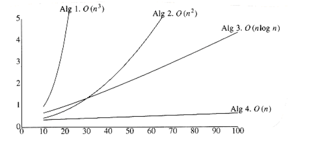
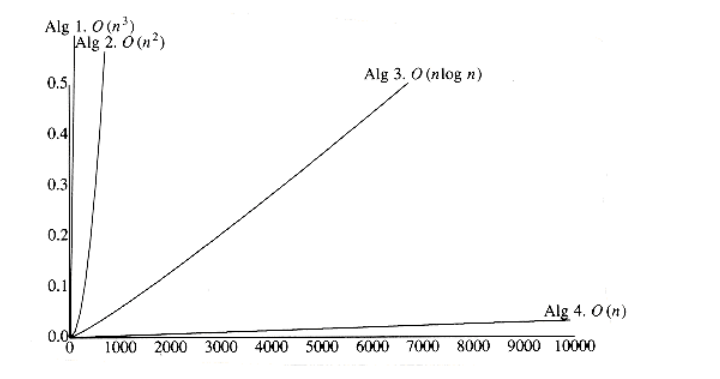
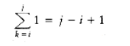
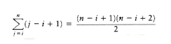
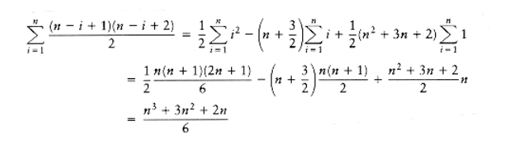

  

# CHAPTER 2: ALGORITHM ANALYSIS

An algorithm is a clearly specified set of simple instructions to be followed to solve a problem. Once an algorithm is given for a problem and decided (somehow) to be correct, an important step is to determine how much in the way of resources, such as time or space, the algorithm will require. An algorithm that solves a problem but requires a year is hardly of any use. Likewise, an algorithm that requires a gigabyte of main memory is not (currently) useful.

In this chapter, we shall discuss

- How to estimate the time required for a program.

- How to reduce the running time of a program from days or years to fractions of a second.

- The results of careless use of recursion.

- Very efficient algorithms to raise a number to a power and to compute the greatest common divisor of two numbers.

## Mathematical Background

The analysis required to estimate the resource use of an algorithm is generally a theoretical issue, and therefore a formal framework is required. We begin with some mathematical definitions.

Throughout the book we will use the following four definitions:

**DEFINITION:** 
T(n) = O(f(n)) if there are constants c and n0 such that T(n) cf (n) when n  n0.

**DEFINITION:**
 T(n) = (g(n)) if there are constants c and n0 such that T(n) cg(n) when n n0.

**DEFINITION:** 
 T(n) = (h(n)) if and only if T(n) = O(h(n)) and T(n) = (h(n)).

**DEFINITION:** 
T(n) = o(p(n)) if T(n) = O(p(n)) and T(n) (p(n)).

The idea of these definitions is to establish a relative order among functions. Given two functions, there are usually points where one function is smaller than the other function, so it does not make sense to claim, for instance, f(n) < g (n). Thus, we compare their relative rates of growth. When we apply this to the analysis of algorithms, we shall see why this is the important measure.

Although 1,000n is larger than n2 for small values of n, n2 grows at a faster rate, and thus n2 will eventually be the larger function. The turning point is n = 1,000 in this case. The first definition says that eventually there is some point n0 past which c f (n) is always at least as large as T(n), so that if
constant factors are ignored, f(n) is at least as big as T(n). In our case, we have T(n) = 1,000n, f(n) = n2, n0 = 1,000, and c = 1. We could also use n0 = 10 and c = 100. Thus, we can say that 1,000n = O(n2) (order n-squared). This notation is known as Big-Oh notation. Frequently, instead of saying "order . . . ," one says "Big-Oh . . . ."

If we use the traditional inequality operators to compare growth rates, then the first definition says that the growth rate of T(n) is less than or equal to () that of f(n). The second definition, T(n) = (g(n)) (pronounced "omega"),says that the growth rate of T(n) is greater than or equal to () that of g(n). The third definition, T(n) = (h(n)) (pronounced "theta"), says that the growth rate of T(n) equals (=) the growth rate of h(n). The last definition, T (n) = o(p(n)) (pronounced "little-oh"), says that the growth rate of T(n) is less than (<) the growth rate of p(n). This is different from Big-Oh, because Big-Oh allows the possibility that the growth rates are the same.


When we say that T(n) = O(f(n)), we are guaranteeing that the function T(n) grows at a rate no faster than f(n); thus f(n) is an upper bound on T(n). Since this implies that f(n) = (T(n)), we say that T(n) is a lower bound on f(n).

As an example, n3 grows faster than n2, so we can say that n2 = O(n3) or n3 = (n2). f(n) = n2 and g(n) = 2n2 grow at the same rate, so both f(n) = O(g(n)) and f(n) = (g(n)) are true. When two functions grow at the same rate, then the decision whether or not to signify this with () can depend on the particular context. Intuitively, if g(n) = 2n2, then g(n) = O(n4), g(n) = O(n3), and g(n) = O(n2) are all technically correct, but obviously the last option is the best answer. Writing g(n) = (n2) says not only that g(n) = O(n2), but also that

the result is as good (tight) as possible.

The important things to know are

RULE 1:
```
If T1(n) = O(f(n)) and T2(n) = O(g(n)), then

(a) T1(n) + T2(n) = max (O(f(n)), O(g(n))),

(b) T1(n) * T2(n) = O(f(n) * g(n)),

```

Function    Name

--------------------

c           Constant

logn        Logarithmic

log2n       Log-squared

n           Linear

n           log n

n2          Quadratic

n3          Cubic

2n          Exponential

Figure 2.1 Typical growth rates

RULE 2:
```
If T(x) is a polynomial of degree n, then T(x) = (xn).
```
RULE 3:

logk n = O(n) for any constant k. This tells us that logarithms grow very slowly.

To see that rule 1(a) is correct, note that by definition there exist four

constants c1, c2, n1, and n2 such that T1(n) c1 f(n) for n n1 and T2(n)

c2g(n) for n n2. Let n0 = max(n1, n2). Then, for n n0, T1(n) c1f

(n) and T2(n) c2g(n), so that T1(n) + T2(n) c1f(n) + c2g(n). Let c3 = max

(c1, c2). Then,
```
T1(n) + T2(n)
- c3f(n) + c3g(n)
- c3(f(n) + g(n))
- 2c3 max(f(n), g(n))
- c max(f(n), g(n))

for c = 2c3 and n n0.
```
We leave proofs of the other relations given above as exercises for the reader. This information is sufficient to arrange most of the common functions by growth rate (see Fig. 2.1).

Several points are in order. First, it is very bad style to include constants or low-order terms inside a Big-Oh. Do not say T(n) = O(2n2) or T(n) = O(n2 + n). In both cases, the correct form is T(n) = O(n2). This means that in any analysis that will require a Big-Oh answer, all sorts of shortcuts are possible. Lower- order terms can generally be ignored, and constants can be thrown away. Considerably less precision is required in these cases.

Secondly, we can always determine the relative growth rates of two functions f(n) and g(n) by computing limn f(n)/g(n), using L'Hôpital's rule if necessary.*

*L'Hôpital's rule states that if limn f(n) = and limn g(n), then limn f(n)/g(n) = limn f'(n) / g'(n), where f'(n) and g'(n)

are the derivatives of f(n) and g(n), respectively.
```
The limit can have four possible values:
- The limit is 0: This means that f(n) = o(g(n)).

- The limit is c 0: This means that f(n) = (g(n)).

- The limit is : This means that g(n) = o(f(n)).

- The limit oscillates: There is no relation (this will not happen in our context).
```
Using this method almost always amounts to overkill. Usually the relation between f(n) and g(n) can be derived by simple algebra. For instance, if f(n) = n log n and g(n) = n1.5, then to decide which of f(n) and g(n) grows faster, one really needs to determine which of log n and n0.5 grows faster. This is like determining which of log2 n or n grows faster. This is a simple problem, because it is already known that n grows faster than any power of a log. Thus, g(n) grows faster than f(n).

One stylistic note: It is bad to say f(n) O(g(n)), because the inequality is implied by the definition. It is wrong to write f(n) O(g(n)), which does not make sense.

## Model

In order to analyze algorithms in a formal framework, we need a model of computation. Our model is basically a normal computer, in which instructions are executed sequentially. Our model has the standard repertoire of simple instructions, such as addition, multiplication, comparison, and assignment, but, unlike real computers, it takes exactly one time unit to do anything (simple). To be reasonable, we will assume that, like a modern computer, our model has fixed size (say 32-bit) integers and that there are no fancy operations, such as matrix inversion or sorting, that clearly cannot be done in one time unit. We also assume infinite memory.

This model clearly has some weaknesses. Obviously, in real life, not all operations take exactly the same time. In particular, in our model one disk read counts the same as an addition, even though the addition is typically several orders of magnitude faster. Also, by assuming infinite memory, we never worry about page faulting, which can be a real problem, especially for efficient algorithms. This can be a major problem in many applications.

## What to Analyze

The most important resource to analyze is generally the running time. Several factors affect the running time of a program. Some, such as the compiler and computer used, are obviously beyond the scope of any theoretical model, so, although they are important, we cannot deal with them here. The other main factors are the algorithm used and the input to the algorithm.

Typically, the size of the input is the main consideration. We define two functions, Tavg(n) and Tworst(n), as the average and worst-case running time,respectively, used by an algorithm on input of size n. Clearly, Tavg(n) Tworst(n). If there is more than one input, these functions may have more than one argument.

We remark that generally the quantity required is the worst-case time, unless otherwise specified. One reason for this is that it provides a bound for all input, including particularly bad input, that an average-case analysis does not provide. The other reason is that average-case bounds are usually much more difficult to compute. In some instances, the definition of "average" can affect the result. (For instance, what is average input for the following problem?)

As an example, in the next section, we shall consider the following problem:

**MAXIMUM SUBSEQUENCE SUM PROBLEM:**

Given (possibly negative) integers a1, a2, . . . , an, find the maximum value of. (For convenience, the maximum subsequence sum is 0 if all the integers are negative.)

Example:
```
For input -2, 11, -4, 13, -5, -2, the answer is 20 (a2 through a4).
```
This problem is interesting mainly because there are so many algorithms to solve it, and the performance of these algorithms varies drastically. We will discuss four algorithms to solve this problem. The running time on some computer (the exact computer is unimportant) for these algorithms is given in Figure 2.2.

There are several important things worth noting in this table. For a small amount of input, the algorithms all run in a blink of the eye, so if only a small amount of input is expected, it might be silly to expend a great deal of effort to design a clever algorithm. On the other hand, there is a large market these days for rewriting programs that were written five years ago based on a no-longer- valid assumption of small input size. These programs are now too slow, because they used poor algorithms. For large amounts of input, Algorithm 4 is clearly the best choice (although Algorithm 3 is still usable).

Second, the times given do not include the time required to read the input. For Algorithm 4, the time merely to read in the input from a disk is likely to be an order of magnitude larger than the time required to solve the problem. This is typical of many efficient algorithms. Reading the data is generally the bottleneck; once the data are read, the problem can be solved quickly. For inefficient algorithms this is not true, and significant computer resources must be used. Thus, it is important that, where possible, algorithms be efficient enough not to be the bottleneck of a problem.
```
Algorithm 1 2 3 4

-------------------- -----------------------------------

Time O(n3) O(n2) O(n log n) (n)

------------------------------------------------------------

Input n = 10 0.00103 0.00045 0.00066 0.00034

Size n = 100 0.47015 0.01112 0.00486 0.00063

n = 1,000 448.77 1.1233 0.05843 0.00333

n = 10,000 NA 111.13 0.68631 0.03042

n = 100,000 NA NA 8.0113 0.29832

```

**Figure 2.2 Running time of several algorithms for maximum subsequence sum (in seconds)**

Figure 2.3 shows the growth rates of the running times of the four algorithms. Even though this graph encompasses only values of n ranging from 10 to 100, the relative growth rates are still evident. Although the graph for Algorithm 3 seems linear, it is easy to verify that it is not, by using a straightedge (or piece of paper). Figure 2.4 shows the performance for larger values. It dramatically illustrates how useless inefficient algorithms are for even moderately large amounts of input.


*Figure 2.3 Plot (n vs. milliseconds) of various maximum subsequence sum algorithms*


*Figure 2.4 Plot (n vs. seconds) of various maximum subsequence sum algorithms*

## Running Time Calculations

There are several ways to estimate the running time of a program. The previous table was obtained empirically. If two programs are expected to take similar times, probably the best way to decide which is faster is to code them both up and run them!

Generally, there are several algorithmic ideas, and we would like to eliminate the bad ones early, so an analysis is usually required. Furthermore, the ability to do an analysis usually provides insight into designing efficient algorithms. The analysis also generally pinpoints the bottlenecks, which are worth coding carefully.

To simplify the analysis, we will adopt the convention that there are no particular units of time. Thus, we throw away leading constants. We will also throw away low-order terms, so what we are essentially doing is computing a Big- Oh running time. Since Big-Oh is an upper bound, we must be careful to never underestimate the running time of the program. In effect, the answer provided is a guarantee that the program will terminate within a certain time period. The program may stop earlier than this, but never later.

### A Simple Example

Here is a simple program fragment to calculate
```
unsigned int sum(int n)

{

unsigned int i, partial_sum;

/*1*/ partial_sum = 0;

/*2*/ for(i=1; i<=n; i++)

/*3*/ partial_sum += i*i*i;

/*4*/ return(partial_sum);

}

```

The analysis of this program is simple. The declarations count for no time. Lines 1 and 4 count for one unit each. Line 3 counts for three units per time executed (two multiplications and one addition) and is executed n times, for a total of 3n units. Line 2 has the hidden costs of initializing i, testing i n, and incrementing i. The total cost of all these is 1 to initialize, n + 1 for all the tests, and n for all the increments, which is 2n + 2. We ignore the costs of calling the function and returning, for a total of 5n + 4. Thus, we say that this function is O (n).

If we had to perform all this work every time we needed to analyze a program, the task would quickly become infeasible. Fortunately, since we are giving the answer in terms of Big-Oh, there are lots of shortcuts that can be taken without affecting the final answer. For instance, line 3 is obviously an O (1) statement (per execution), so it is silly to count precisely whether it is two, three, or four units -- it does not matter. Line 1 is obviously insignificant compared to the for loop, so it is silly to waste time here. This leads to several obvious general rules.

### General Rules

**RULE 1-FOR LOOPS:**

The running time of a for loop is at most the running time of the statements inside the for loop (including tests) times the number of iterations.

**RULE 2-NESTED FOR LOOPS:**

Analyze these inside out. The total running time of a statement inside a group of nested for loops is the running time of the statement multiplied by the product of the sizes of all the for loops.

As an example, the following program fragment is O(n2):

for(i=0; i<n; i++)

for(j=0; j<n; j++)

k++;

**RULE 3-CONSECUTIVE STATEMENTS:**

These just add (which means that the maximum is the one that counts -- see 1(a) on page 16).

As an example, the following program fragment, which has O(n) work followed by O

(n2) work, is also O (n2):
```
for(i=0; i<n; i++)

a[i] = 0;

for(i=0; i<n; i++)

for(j=0; j<n; j++)

a[i] += a[j] + i + j;

```

**RULE 4-lF/ELSE:**

For the fragment
```
if(cond)

S1

else

S2

the running time of an if/else statement is never more than the running time of the test plus the larger of the running times of S1 and S2.

```

Clearly, this can be an over-estimate in some cases, but it is never an under- estimate.

Other rules are obvious, but a basic strategy of analyzing from the inside (or deepest part) out works. If there are function calls, obviously these must be analyzed first. If there are recursive procedures, there are several options. If the recursion is really just a thinly veiled for loop, the analysis is usually trivial. For instance, the following function is really just a simple loop and is obviously O (n):
```
unsigned int factorial(unsigned int n)

{

if(n <= 1)

return 1;

else

return(n * factorial(n-1));

}

```
This example is really a poor use of recursion. When recursion is properly used, it is difficult to convert the recursion into a simple loop structure. In this case, the analysis will involve a recurrence relation that needs to be solved. To see what might happen, consider the following program, which turns out to be a horrible use of recursion:
```
/* Compute Fibonacci numbers as described Chapter 1 */

unsigned int fib(unsigned int n)

{

/*1*/ if(n <= 1)

/*2*/ return 1;

else

/*3*/ return(fib(n-1) + fib(n-2));

}

```

At first glance, this seems like a very clever use of recursion. However, if the program is coded up and run for values of n around 30, it becomes apparent that this program is terribly inefficient. The analysis is fairly simple. Let T(n) be the running time for the function fib(n). If n = 0 or n = 1, then the running time is some constant value, which is the time to do the test at line 1 and return. We can say that T(0) = T(1) = 1, since constants do not matter. The running time for other values of n is then measured relative to the running time of the base case. For n > 2, the time to execute the function is the constant work at line 1 plus the work at line 3. Line 3 consists of an addition and two function calls. Since the function calls are not simple operations, they must be analyzed by themselves. The first function call is fib(n - 1) and hence, by the definition of T, requires T(n - 1) units of time. A similar argument shows that the second function call requires T(n - 2) units of time. The total time required is then T(n - 1) + T(n - 2) + 2, where the 2 accounts for the work at line 1 plus

the addition at line 3. Thus, for n 2, we have the following formula for the running time of fib(n):
```
T(n) = T(n - 1) + T(n - 2) + 2
```

Since ```fib(n) = fib(n - 1) + fib(n - 2)``` it is easy to show by induction that T(n) fib(n). In Section 1.2.5, we showed that fib(n) < (5/3) . A similar calculation shows that fib(n) (3/2) , and so the running time of this program grows exponentially. This is about as bad as possible. By keeping a simple array and using a for loop, the running time can be reduced substantially.

This program is slow because there is a huge amount of redundant work being performed, violating the fourth major rule of recursion (the compound interest rule), which was discussed in Section 1.3. Notice that the first call on line 3, fib(n - 1), actually computes fib(n - 2) at some point. This information is thrown away and recomputed by the second call on line 3. The amount of information thrown away compounds recursively and results in the huge running time. This is perhaps the finest example of the maxim "Don't compute anything more than once" and should not scare you away from using recursion. Throughout this book, we shall see outstanding uses of recursion.

### Solutions for the Maximum Subsequence Sum Problem

We will now present four algorithms to solve the maximum subsequence sum problem posed earlier. The first algorithm is depicted in Figure 2.5. The indices in the for loops reflect the fact that, in C, arrays begin at 0, instead of 1. Also, the algorithm computes the actual subsequences (not just the sum); additional code is required to transmit this information to the calling routine.

Convince yourself that this algorithm works (this should not take much). The

running time is O(n) and is entirely due to lines 5 and 6, which consist of an O (1) statement buried inside three nested for loops. The loop at line 2 is of size n.
```
int max_subsequence_sum(int a[],unsigned int n)

{

int this_sum, max_sum, best_i, best_j, i, j, k;

/*1*/ max_sum = 0; best_i = best_j = -1;

/*2*/ for(i=0; i<n; i++)

/*3*/ for(j=i; j<n; j++)

{

/*4*/ this_sum=0;

/*5*/ for(k = i; k<=j; k++)

/*6*/ this_sum += a[k];

/*7*/ if(this_sum > max_sum)

{ /* update max_sum, best_i, best_j */

/*8*/ max_sum = this_sum;

/*9*/ best_i = i;

/*10*/ best_j = j;

}

}

/*11*/ return(max_sum);

}

```

**Figure 2.5 Algorithm 1**

The second loop has size n - i + 1, which could be small, but could also be of size n. We must assume the worst, with the knowledge that this could make the final bound a bit high. The third loop has size j - i + 1, which, again, we must assume is of size n. The total is O(1 n n n) = O(n). Statement 1 takes only O(1) total, and statements 7 to 10 take only O(n) total, since they are easy statements inside only two loops.

It turns out that a more precise analysis, taking into account the actual size of these loops, shows that the answer is (n), and that our estimate above was a factor of 6 too high (which is all right, because constants do not matter). This is generally true in these kinds of problems. The precise analysis is obtained from the sum 1, which tells how many times line 6 is executed. The sum can be evaluated inside out, using formulas from Section 1.2.3. In particular, we will use the formulas for the sum of the first n integers and first n squares. First we have

Next we evaluate

This sum is computed by observing that it is just the sum of the first n - i + 1 integers. To complete the calculation, we evaluate 

We can avoid the cubic running time by removing a for loop. Obviously, this is not always possible, but in this case there are an awful lot of unnecessary computations present in the algorithm. The inefficiency that the improved algorithm corrects can be seen by noticing that so the computation at lines 5 and 6 in Algorithm 1 is unduly expensive. Figure 2.6 shows an improved algorithm. Algorithm 2 is clearly O(n); the analysis is even simpler than before.

There is a recursive and relatively complicated O(n log n) solution to this problem, which we now describe. If there didn't happen to be an O(n) (linear) solution, this would be an excellent example of the power of recursion. The algorithm uses a "divide-and-conquer" strategy. The idea is to split the problem into two roughly equal subproblems, each of which is half the size of the original. The subproblems are then solved recursively. This is the "divide" part. The "conquer" stage consists of patching together the two solutions of the subproblems, and possibly doing a small amount of additional work, to arrive at a solution for the whole problem.
```
int max_subsequence_sum(int a[], unsigned int n)
{

int this_sum, max_sum, best_i, best_j, i, j, k;

/*1*/ max_sum = 0; best_i = best_j = -1;

/*2*/ for(i=0; i<n; i++)

{

/*3*/ this_sum = 0;

/*4*/ for(j=i; j<n; j++)

{

/*5*/ this_sum += a[j];

/*6*/ if(this_sum > max_sum)

/* update max_sum, best_i, best_j */;
}

}

/*7*/ return(max_sum);

}

```

Figure 2.6 Algorithm 2

In our case, the maximum subsequence sum can be in one of three places. Either it occurs entirely in the left half of the input, or entirely in the right half, or it crosses the middle and is in both halves. The first two cases can be solved recursively. The last case can be obtained by finding the largest sum in the first half that includes the last element in the first half and the largest sum in the second half that includes the first element in the second half. These two sums can then be added together. As an example, consider the following input:
```
First Half      Second Half

----------------------------------------

4 -3 5 -2       -1 2 6 -2
```

The maximum subsequence sum for the first half is 6 (elements a1 through a3), and for the second half is 8 (elements a6 through a7).

The maximum sum in the first half that includes the last element in the first half is 4 (elements a1 through a4), and the maximum sum in the second half that includes the first element in the second half is 7 (elements a5 though a7). Thus, the maximum sum that spans both halves and goes through the middle is 4 + 7 = 11 (elements a1 through a7).

We see, then, that among the three ways to form a large maximum subsequence, for our example, the best way is to include elements from both halves. Thus, the answer is 11. Figure 2.7 shows an implementation of this strategy.
```
int max_sub_sequence_sum(int a[], unsigned int n)
{

return max_sub_sum(a, 0, n-1);

}

int max_sub_sum(int a[], int left, int right)

{

int max_left_sum, max_right_sum;

int max_left_border_sum, max_right_border_sum;

int left_border_sum, right_border_sum;

int center, i;

/*1*/ if (left == right) /* Base Case */

/*2*/ if(a[left] > 0)

/*3*/ return a[left];

else

/*4*/ return 0;

/*5*/ center = (left + right)/2;

/*6*/ max_left_sum = max_sub_sum(a, left, center);

/*7*/ max_right_sum = max_sub_sum(a, center+1, right);

/*8*/ max_left_border_sum = 0; left_border_sum = 0;

/*9*/ for(i=center; i>=left; i--)

{

/*10*/ left_border_sum += a[i];

/*11*/ if(left_border_sum > max_left_border_sum)

/*12*/ max_left_border_sum = left_border_sum;

}

/*13*/ max_right_border_sum = 0; right_border_sum = 0;

/*14*/ for(i=center+1; i<=right; i++)

{

/*15*/ right_border_sum += a[i];

/*16*/ if(right_border_sum > max_right_border_sum)

/*17*/ max_right_border_sum = right_border_sum;

}

/*18*/ return max3(max_left_sum, max_right_sum,

max_left_border_sum+max_right_border_sum);

}

```

**Figure 2.7 Algorithm 3**

The code for Algorithm 3 deserves some comment. The general form of the call for the recursive procedure is to pass the input array along with the left and right borders, which delimit the portion of the array that is operated upon. A one-line driver program sets this up by passing the borders 0 and n -1 along with the array.

Lines 1 to 4 handle the base case. If left == right, then there is one element, and this is the maximum subsequence if the element is nonnegative. The case left > right is not possible unless n is negative (although minor perturbations in the code could mess this up). Lines 6 and 7 perform the two recursive calls. We can see that the recursive calls are always on a smaller problem than the original, although, once again, minor perturbations in the code could destroy this property. Lines 8 to 12 and then 13 to 17 calculate the two maximum sums that touch the center divider. The sum of these two values is the maximum sum that spans both halves. The pseudoroutine max3 returns the largest of the three possibilities.

Algorithm 3 clearly requires more effort to code than either of the two previous algorithms. However, shorter code does not always mean better code. As we have seen in the earlier table showing the running times of the algorithms, this algorithm is considerably faster than the other two for all but the smallest of input sizes.

The running time is analyzed in much the same way as for the program that computes the Fibonacci numbers. Let T(n) be the time it takes to solve a maximum subsequence sum problem of size n. If n = 1, then the program takes some constant amount of time to execute lines 1 to 4, which we shall call one unit. Thus, T(1) = 1. Otherwise, the program must perform two recursive calls, the two for loops between lines 9 and 17, and some small amount of bookkeeping, such as lines 5 and 18. The two for loops combine to touch every element from a0 to an_1, and there is constant work inside the loops, so the time expended in lines 9 to 17 is O(n). The code in lines 1 to 5, 8, and 18 is all a constant amount of work and can thus be ignored when compared to O(n). The remainder of the work is performed in lines 6 and 7. These lines solve two subsequence problems of size n/2 (assuming n is even). Thus, these lines take T(n/2) units of time each, for a total of 2T(n/2). The total time for the algorithm then is 2T(n/2) + O(n). This gives the equations
```
T(1) = 1

T(n) = 2T(n/2) + O(n)
```
To simplify the calculations, we can replace the O(n) term in the equation above with n; since T(n) will be expressed in Big-Oh notation anyway, this will not affect the answer. In Chapter 7, we shall see how to solve this equation rigorously. For now, if T(n) = 2T(n/2) + n, and T(1) = 1, then T(2) = 4 = 2 * 2, T(4) = 12 = 4 * 3, T(8) = 32 = 8 * 4, T(16) = 80 = 16 * 5. The pattern that is evident, and can be derived, is that if n = 2 , then T(n) = n * (k + 1) = n log n + n = O(n log n).

This analysis assumes n is even, since otherwise n/2 is not defined. By the recursive nature of the analysis, it is really valid only when n is a power of 2, since otherwise we eventually get a subproblem that is not an even size, and the equation is invalid. When n is not a power of 2, a somewhat more complicated analysis is required, but the Big-Oh result remains unchanged.

In future chapters, we will see several clever applications of recursion. Here, we present a fourth algorithm to find the maximum subsequence sum. This algorithm is simpler to implement than the recursive algorithm and also is more efficient. It is shown in Figure 2.8.
```
int max_subsequence_sum(int a[], unsigned int n)

{

int this_sum, max_sum, best_i, best_j, i, j;

/*1*/ i = this_sum = max_sum = 0; best_i = best_j = -1;

/*2*/ for(j=0; j<n; j++)

{

/*3*/ this_sum += a[j];

/*4*/ if(this_sum > max_sum)

{ /* update max_sum, best_i, best_j */

/*5*/ max_sum = this_sum;

/*6*/ best_i = i;

/*7*/ best_j = j;

}

else

/*8*/ if(this_sum < 0)

{

/*9*/ i = j + 1;

/*10*/ this_sum = 0;

}

}

/*11*/ return(max_sum);

}
```
**Figure 2.8 Algorithm 4**

It should be clear why the time bound is correct, but it takes a little thought to see why the algorithm actually works. This is left to the reader. An extra advantage of this algorithm is that it makes only one pass through the data, and once a[i] is read and processed, it does not need to be remembered. Thus, if the array is on a disk or tape, it can be read sequentially, and there is no need to store any part of it in main memory. Furthermore, at any point in time, the algorithm can correctly give an answer to the subsequence problem for the data it has already read (the other algorithms do not share this property). Algorithms that can do this are called on-line algorithms. An on-line algorithm that requires only constant space and runs in linear time is just about as good as possible.

### Logarithms in the Running Time

The most confusing aspect of analyzing algorithms probably centers around the logarithm. We have already seen that some divide-and-conquer algorithms will run in O(n log n) time. Besides divide-and-conquer algorithms, the most frequent appearance of logarithms centers around the following general rule: An algorithm is O(log n) if it takes constant (O(1)) time to cut the problem size by a fraction (which is usually). On the other hand, if constant time is required to merely reduce the problem by a constant amount (such as to make the problem smaller by 1), then the algorithm is O(n).

Something that should be obvious is that only special kinds of problems can be O (log n). For instance, if the input is a list of n numbers, an algorithm must take (n) merely to read the input in. Thus when we talk about O(log n) algorithms for these kinds of problems, we usually presume that the input is preread. We provide three examples of logarithmic behavior.

**Binary Search**

The first example is usually referred to as binary search:

BINARY SEARCH:

Given an integer x and integers a1, a2, . . . , an, which are presorted and

already in memory, find i such that ai = x, or return i = 0 if x is not in the input.

The obvious solution consists of scanning through the list from left to right and runs in linear time. However, this algorithm does not take advantage of the fact that the list is sorted and is thus not likely to be best. The best strategy is to check if x is the middle element. If so, the answer is at hand. If x is smaller than the middle element, we can apply the same strategy to the sorted subarray to the left of the middle element; likewise, if x is larger than the middle element, we look to the right half. (There is also the case of when to stop.) Figure 2.9 shows the code for binary search (the answer is mid). As usual, the code reflects C's convention that arrays begin with index 0. Notice that the variables cannot be declared unsigned (why?). In cases where the unsigned qualifier is questionable, we will not use it. As an example, if the unsigned qualifier is dependent on an array not beginning at zero, we will discard it.

We will also avoid using the unsigned type for variables that are counters in a for loop, because it is common to change the direction of a loop counter from increasing to decreasing and the unsigned qualifier is typically appropriate for the former case only. For example, the code in Exercise 2.10 does not work if i is declared unsigned.

Clearly all the work done inside the loop is O(1) per iteration, so the analysis requires determining the number of times around the loop. The loop starts with high - low = n - 1 and finishes with high - low -1. Every time through the loop the value high - low must be at least halved from its previous value; thus,the number of times around the loop is at most log(n - 1) + 2. (As an example, if high - low = 128, then the maximum values of high - low after each iteration are 64, 32, 16, 8, 4, 2, 1, 0, -1.) Thus, the running time is O(log n). Equivalently, we could write a recursive formula for the running time, but this kind of brute-force approach is usually unnecessary when you understand what is really going on and why.

Binary search can be viewed as our first data structure. It supports the find operation in O(log n) time, but all other operations (in particular insert) require O(n) time. In applications where the data are static (that is, insertions and deletions are not allowed), this could be a very useful data structure. The input would then need to be sorted once, but afterward accesses would be fast. An example could be a program that needs to maintain information about the periodic table of elements (which arises in chemistry and physics). This table is relatively stable, as new elements are added infrequently. The element names could be kept sorted. Since there are only about 110 elements, at most eight accesses would be required to find an element. Performing a sequential search would require many more accesses.

```
int binary_search(input_type a[ ], input_type x, unsigned int n)
{

int low, mid, high; /* Can't be unsigned; why? */

/*1*/ low = 0; high = n - 1;

/*2*/ while(low <= high)

{

/*3*/ mid = (low + high)/2;

/*4*/ if(a[mid] < x)

/*5*/ low = mid + 1;

else

/*6*/ if (a[mid] < x)

/*7*/ high = mid - 1;

else

/*8*/ return(mid); /* found */

}

/*9*/ return(NOT_FOUND);

}
```
**Figure 2.9 Binary search.**

**Euclid's Algorithm**

A second example is Euclid's algorithm for computing the greatest common divisor. The greatest common divisor (gcd) of two integers is the largest integer that divides both. Thus, gcd (50, 15) = 5. The algorithm in Figure 2.10 computes gcd(m, n), assuming m n. (If n > m, the first iteration of the loop swaps them).

The algorithm works by continually computing remainders until 0 is reached. The last nonzero remainder is the answer. Thus, if m = 1,989 and n = 1,590, then the sequence of remainders is 399, 393, 6, 3, 0. Therefore, gcd (1989, 1590) = 3. As the example shows, this is a fast algorithm.

As before, the entire running time of the algorithm depends on determining how long the sequence of remainders is. Although log n seems like a good answer, it is not at all obvious that the value of the remainder has to decrease by a constant factor, since we see that the remainder went from 399 to only 393 in the example. Indeed, the remainder does not decrease by a constant factor in one iteration. However, we can prove that after two iterations, the remainder is at most half of its original value. This would show that the number of iterations is at most 2 log n = O(log n) and establish the running time. This proof is easy, so we include it here. It follows directly from the following theorem.
```

unsigned int gcd(unsigned int m, unsigned int n)

{

unsigned int rem;

/*1*/ while(n > 0)

{

/*2*/ rem = m % n;

/*3*/ m = n;

/*4*/ n = rem;

}

/*5*/ return(m);

}

```
**Figure 2.10 Euclid's algorithm.**

THEOREM 2.1.
```
If m > n, then mmod n < m/2.
```

**PROOF:**

There are two cases. If n m/2, then obviously, since the remainder is smaller than n, the theorem is true for this case. The other case is n > m/2. But then n goes into m once with a remainder m - n < m/2, proving the theorem.

One might wonder if this is the best bound possible, since 2 log n is about 20 for our example, and only seven operations were performed. It turns out that the constant can be improved slightly, to roughly 1.44 log n, in the worst case (which is achievable if m and n are consecutive Fibonacci numbers). The average- case performance of Euclid's algorithm requires pages and pages of highly sophisticated mathematical analysis, and it turns out that the average number of iterations is about .

**Exponentiation**

Our last example in this section deals with raising an integer to a power (which is also an integer). Numbers that result from exponentiation are generally quite large, so an analysis only works if we can assume that we have a machine that can store such large integers (or a compiler that can simulate this). We will count the number of multiplications as the measurement of running time.
```
int pow(int x, unsigned int n)

{

/*1*/ if(n == 0)

/*2*/ return 1;

/*1*/ if(n == 1)

/*4*/ return x;

/*5*/ if(even(n))

/*6*/ return(pow(x*x, n/2));

else

/*7*/ return(pow(x*x, n/2) * x);
}
```

**Figure 2.11 Efficient exponentiation**

The obvious algorithm to compute xn uses n - 1 multiples. The recursive algorithm in Figure 2.11 does better. Lines 1 to 4 handle the base case of the recursion. Otherwise, if n is even, we have xn = xn/2 . xn/2, and if n is odd, x = x(n-1)/2

For instance, to compute x62, the algorithm does the following calculations, which involves only nine multiplications:
```
x3 = (x2)x, x7 = (x3)2x, x15 = (x7)2x, x31 = (x15)2x, x62 = (x31)2
```
The number of multiplications required is clearly at most 2 log n, because at most two multiplications (if n is odd) are required to halve the problem. Again, a recurrence formula can be written and solved. Simple intuition obviates the need for a brute-force approach.

It is sometimes interesting to see how much the code can be tweaked without affecting correctness. In Figure 2.11, lines 3 to 4 are actually unnecessary, because if n is 1, then line 7 does the right thing. Line 7 can also be rewritten as
```
/*7*/ return(pow(x, n-1) * x);
```
without affecting the correctness of the program. Indeed, the program will still run in O(log n), because the sequence of multiplications is the same as before. However, all of the following alternatives for line 6 are bad, even though they look correct:
```
/*6a*/ return(pow(pow(x, 2), n/2));

/*6b*/ return(pow(pow(x, n/2), 2));

/*6c*/ return(pow(x, n/2) * pow(x, n/2));
```
Both lines 6a and 6b are incorrect because when n is 2, one of the recursive calls to pow has 2 as the second argument. Thus, no progress is made, and an infinite loop results (in an eventual crash).

Using line 6c affects the efficiency, because there are now two recursive calls of size n/2 instead of only one. An analysis will show that the running time is no longer O(log n). We leave it as an exercise to the reader to determine the new running time.

### Checking Your Analysis

Once an analysis has been performed, it is desirable to see if the answer is correct and as good as possible. One way to do this is to code up the program and see if the empirically observed running time matches the running time predicted by the analysis. When n doubles, the running time goes up by a factor of 2 for linear programs, 4 for quadratic programs, and 8 for cubic programs. Programs that run in logarithmic time take only an additive constant longer when n doubles, and programs that run in O(n log n) take slightly more than twice as long to run under the same circumstances. These increases can be hard to spot if the lower-order terms have relatively large coefficients and n is not large enough. An example is the jump from n = 10 to n = 100 in the running time for the various implementations of the maximum subsequence sum problem. It also can be very difficult to differentiate linear programs from O(n log n) programs purely on empirical evidence.

Another commonly used trick to verify that some program is O(f(n)) is to compute the values T(n)/ f(n) for a range of n (usually spaced out by factors of 2), where T(n) is the empirically observed running time. If f(n) is a tight answer for the running time, then the computed values converge to a positive constant. If f(n) is an over-estimate, the values converge to zero. If f (n) is an under-estimate and hence wrong, the values diverge.

As an example, the program fragment in Figure 2.12 computes the probability that two distinct positive integers, less than or equal to n and chosen randomly, are relatively prime. (As n gets large, the answer approaches 6/ 2.)

You should be able to do the analysis for this program instantaneously. Figure 2.13 shows the actual observed running time for this routine on a real computer. The table shows that the last column is most likely, and thus the analysis that you should have gotten is probably correct.Notice that there is not a great deal of difference between O(n2) and O(n2 log n), since logarithms grow so slowly.

### A Grain of Salt

Sometimes the analysis is shown empirically to be an over-estimate. If this is the case, then either the analysis needs to be tightened (usually by a clever observation), or it may be the case that the average running time is significantly less than the worst-case running time and no improvement in the bound is possible. There are many complicated algorithms for which the worst- case bound is achievable by some bad input but is usually an over-estimate in practice. Unfortunately, for most of these problems, an average-case analysis is extremely complex (in many cases still unsolved), and a worst-case bound, even though overly pessimistic, is the best analytical result known.
```
rel = 0; tot = 0;

for(i=1; i<=n; i++)

for(j=i+1; j<=n; j++)

{

tot++;

if(gcd(i, j) = 1)

rel++;

}

printf("Percentage of relatively prime pairs is %lf\n",

((double) rel)/tot);
```
**Figure 2.12 Estimate the probability that two random numbers are relatively prime**
```
n CPU time (T) T/n2 T/n3 T/n2log n

---------------------------------------------------------

100 022 .002200 .000022000 .0004777

200 056 .001400 .000007000 .0002642

300 118 .001311 .000004370 .0002299

400 207 .001294 .000003234 .0002159

500 318 .001272 .000002544 .0002047

---------------------------------------------------------

600 466 .001294 .000002157 .0002024

700 644 .001314 .000001877 .0002006

800 846 .001322 .000001652 .0001977

900 1,086 .001341 .000001490 .0001971

1,000 1,362 .001362 .000001362 .0001972

---------------------------------------------------------

1,500 3,240 .001440 .000000960 .0001969

2,000 5,949 .001482 .000000740 .0001947

4,000 25,720 .001608 .000000402 .0001938
```

Figure 2.13 Empirical running times for previous routine

**Summary**

This chapter gives some hints on how to analyze the complexity of programs. Unfortunately, it is not a complete guide. Simple programs usually have simple analyses, but this is not always the case. As an example, we shall see, later in the text, a sorting algorithm (Shellsort, Chapter 7) and an algorithm for maintaining disjoint sets (Chapter 8) each of which requires about 20 lines of code. The analysis of Shellsort is still not complete, and the disjoint set algorithm has an analysis that is extremely difficult and requires pages and pages of intricate calculations. Most of the analysis that we will encounter here will be simple and involve counting through loops.

An interesting kind of analysis, which we have not touched upon, is lowerbound analysis. We will see an example of this in Chapter 7, where it is proved that any algorithm that sorts by using only comparisons requires (n log n) comparisons in the worst case. Lower-bound proofs are generally the most difficult, because they apply not to an algorithm but to a class of algorithms that solve a problem.

We close by mentioning that some of the algorithms described here have real-life application. The gcd algorithm and the exponentiation algorithm are both used in cryptography. Specifically, a 200-digit number is raised to a large power (usually another 200-digit number), with only the low 200 or so digits retained after each multiplication. Since the calculations require dealing with 200-digit numbers, efficiency is obviously important. The straightforward algorithm for exponentiation would require about 10200 multiplications, whereas the algorithm presented requires only about 1,200.

**Exercises**

2.1 Order the following functions by growth rate: n, , n1.5, n2, n log n, n log log n, n log2n, n log(n2), 2/n, 2 , 2n/2, 37, n2 log n, n3. Indicate which functions grow at the same rate.

2.2 Suppose Tl(n) = O(f(n)) and T2(n) = O(f(n)). Which of the following are true?
```
a. T1(n) + T2(n) = O(f(n))

b. T1(n) - T2(n) = o(f(n))

d. T1(n) = O(T2(n))
```
2.3 Which function grows faster: n log n or n1+ / > 0 ?

2.4 Prove that for any constant, k, logkn = o(n).

2.5 Find two functions f(n) and g(n) such that neither (n) = O(g(n)) nor g(n) = O(f(n)).

2.6 For each of the following six program fragments:
```
a. Give an analysis of the running time (Big-Oh will do).

b. Implement the code in the language of your choice, and give the running time for several values of n.
```
c. Compare your analysis with the actual running times.
```
(1) sum = 0;

for(i=0; i<n; i++)

sum++;

(2) sum = 0;

for(i=0; i<n; i++)

for(j=0; j<n; j++)

sum++;

(3) sum = 0;

for(i=0; i<n; i++)

for(j=0; j<n*n; j++)

sum++;

(4) sum = 0;

for(i=0; i<n; i++)

for(j=0; j<i; j++)

sum++;

(5) sum = 0;

for(i=0; i<n; i++)

for(j=0; j<i*i; j++)

for(k=0; k<j; k++)

sum++;

(6) sum = 0;

for(i=1; i<n; i++)

for(j=1; j<i*i; j++)

if(j%1 == 0)

for(k=0; k<j; k++)

sum++;
```
2.7 Suppose you need to generate a random permutation of the first n integers. For example, {4,3, 1, 5, 2} and {3, 1, 4, 2, 5} are legal permutations, but {5, 4, 1, 2, 1} is not, because one number (1) is duplicated and another (3) is missing. This routine is often used in simulation of algorithms. We assume the existence of a random number generator, rand_int(i, j), which generates integers between i and j with equal probability. Here are three algorithms:

1. Fill the array a from a[0] to a[n - 1] as follows: To fill a[i], generate random numbers until you get one that is not already in a[0], a[1], a[2], . . . , a[i-1].

2. Same as algorithm (1), but keep an extra array called the used array. When a random number, ran, is first put in the array a, set used[ran] = 1. This means that when filling a[i] with a random number, you can test in one step to see whether the random number has been used, instead of the (possibly) i steps in the first algorithm.

3. Fill the array such that a[i] = i + 1. Then
```
for(i=1; i<n; i++)

swap(&a[i], &a[ rand_int(0, i) ]);
```
a. Prove that all three algorithms generate only legal permutations and that all permutations are equally likely.

b. Give as accurate (Big-Oh) an analysis as you can of the expected running time of each algorithm.

c. Write (separate) programs to execute each algorithm 10 times, to get a good average. Run program (1) for n = 250, 500, 1,000, 2,000; program (2) for n = 2,500, 5,000, 10,000, 20,000, 40,000, 80,000, and program (3) for n = 10,000, 20,000, 40,000, 80,000, 160,000, 320,000, 640,000.

d. Compare your analysis with the actual running times.

e. What is the worst-case running time of each algorithm?

2.8 Complete the table in Figure 2.2 with estimates for the running times that were too long to simulate. Interpolate the running times for these algorithms and estimate the time required to compute the maximum subsequence sum of one million numbers. What assumptions have you made?

2.9 How much time is required to compute
```
a. using a simple routine to perform exponentiation?

b. using the routine in Section 2.4.4?
```

2.10 Consider the following algorithm (known as Horner's rule) to evaluate
```
poly = 0;

for(i=n; i>=0; i--)

poly = x * poly + ai
```
a. Show how the steps are performed by this algorithm for x = 3, f(x) = 4x + 8x + x + 2.

b. Explain why this algorithm works.

c. What is the running time of this algorithm?

2.11 Give an efficient algorithm to determine if there exists an integer i such that ai = i in an array of integers a1 < a2 < a3 < . . . < an. What is the running time of your algorithm?

2.12 Give efficient algorithms (along with running time analyses) to

*a. find the minimum subsequence sum

*b. find the minimum positive subsequence sum

*c. find the maximum subsequence product

2.13 a. Write a program to determine if a positive integer, n, is prime.

b. In terms of n, what is the worst-case running time of your program? (You should be able to do

this in .)

c. Let B equal the number of bits in the binary representation of n. What is the value of B?

d. In terms of B, what is the worst-case running time of your program?

e. Compare the running times to determine if a 20-bit and a 40-bit number are prime.

f. Is it more reasonable to give the running time in terms of n or B? Why?

*2.14 The Sieve of Erastothenes is a method used to compute all primes less than n. We begin by making a table of integers 2 to n. We find the smallest integer, i, that is not crossed out,

print i, and cross out i, 2i, 3i, . . . . When the algorithm terminates. What is the running time of this algorithm?

2.15 Show that x62 can be computed with only eight multiplications.

2.16 Write the fast exponentiation routine without recursion.

2.17 Give a precise count on the number of multiplication used by the fast exponentiation routine. (Hint: Consider the binary representation of n.)

2.18 Programs A and B are analyzed and found to have worst-case running times no greater than

150n log2 n and n 2, respectively. Answer the following questions if possible:

a. Which program has the better guarantee on the running time, for large values of n (n > 10,000)?

b. Which program has the better guarantee on the running time, for small values of n (n < 100)?

c. Which program will run faster on average for n = 1,000?

d. Is it possible that program B will run faster than program A on all possible inputs ?

2.19 A majority element in an array, A, of size n is an element that appears more than n/2 times (thus, there is at most one). For example, the array 3, 3, 4, 2, 4, 4, 2, 4, 4 has a majority element (4), whereas the array 3, 3, 4, 2, 4, 4, 2, 4

does not. If there is no majority element, your program should indicate this. Here is a sketch of an algorithm to solve the problem:

First, a candidate majority element is found (this is the harder part). This candidate is the only element that could possibly be the majority element. The second step determines if this candidate is actually the majority. This is just a sequential search through the array. To find a candidate in the array, A, form a second array, B. Then compare A1 and A2. If they are equal, add one of these to B; otherwise do nothing. Then compare A3 and A4. Again if they are equal, add one of these to B; otherwise do nothing. Continue in this fashion until the entire array is read. Then recursively find a candidate for B; this is the candidate for A (why?.

*a. How does the recursion terminate?

*b. How is the case where n is odd handled?

*c. What is the running time of the algorithm?

*d. How can we avoid using an extra array B?

*e. Write a program to compute the majority element.

*2.20 Why is it important to assume that integers in our computer model have a fixed size?

2.21 Consider the word puzzle problem described in Chapter 1. Suppose we fix the size of the longest word to be 10 characters.

a. In terms of r and c, which are the number of rows and columns in the puzzle, and W, which is the number of words, what is the running time of the algorithms described in Chapter 1?

b. Suppose the word list is presorted. Show how to use binary search to obtain an algorithm with significantly better running time.

2.22 Suppose that line 5 in the binary search routine had the expression low = mid instead of low = mid + 1. Would the routine still work?

2.23 Suppose that lines 6 and 7 in Algorithm 3 (Fig. 2.7) are replaced by
```
/*6*/ max_left_sum = max_sub_sum(a, left, center-1);

/*7*/ max_right_sum = max_sub_sum(a, center, right);
```

Would the routine still work?

*2.24 The inner loop of the cubic maximum subsequence sum algorithm performs n(n + 1)(n + 2)/6 iterations of the innermost code. The quadratic version performs n(n + 1)/2 iterations. The linear version performs n iterations. What pattern is evident? Can you give a combinatoric explanation of this phenomenon?

### References

Analysis of the running time of algorithms was first made popular by Knuth in the three-part series [5], [6], and [7]. The analysis of the gcd algorithm appears in [6]. Another early text on the subject is [1].

Big-Oh, big-omega, big-theta, and little-oh notation were advocated by Knuth in [8]. There is still not a uniform agreement on the matter, especially when it comes to using (). Many people prefer to use O(), even though it is less expressive. Additionally, O() is still used i
some corners to express a lower bound, when () is called for.

The maximum subsequence sum problem is from [3]. The series of books [2], [3], and [4] show how to optimize programs for speed.

1. A. V. Aho, J. E. Hopcroft, and J. D. Ullman, The Design and Analysis of Computer Algorithms, Addison-Wesley, Reading, Mass., 1974.

2. J. L. Bentley, Writing Efficient Programs, Prentice Hall, Englewood Cliffs, N.J., 1982.

3. J. L. Bentley, Programming Pearls, Addison-Wesley, Reading, Mass., 1986.

4. J. L. Bentley, More Programming Pearls, Addison-Wesley, Reading, Mass., 1988.

5. D. E. Knuth, The Art of Computer Programming, Vol 1: Fundamental Algorithms, 2d ed., Addison- Wesley, Reading, Mass., 1973.

6. D. E. Knuth, The Art of Computer Programming, Vol 2: Seminumerical Algorithms, 2d ed., Addison-Wesley, Reading, Mass., 1981.

7. D. E. Knuth, The Art of Computer Programming, Vol 3: Sorting and Searching, Addison-Wesley, Reading, Mass., 1975.

8. D. E. Knuth, "Big Omicron and Big Omega and Big Theta," ACM SIGACT News, 8 (1976), 18-23.
