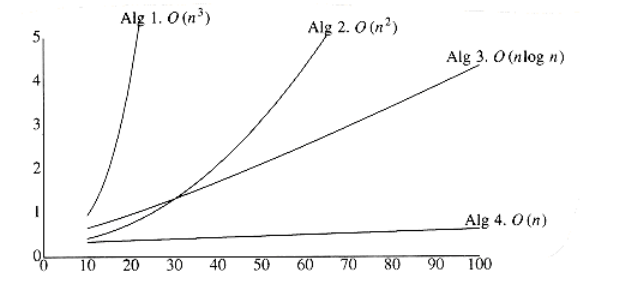
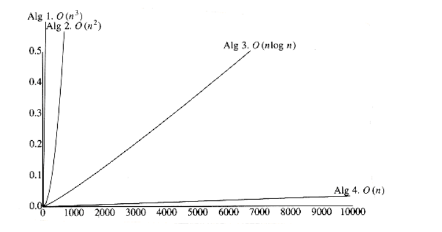

[comment]: <> (katex Header)


## What to Analyze

The most important resource to analyze is generally the running time. Several factors affect the running time of a program. Some, such as the compiler and computer used, are obviously beyond the scope of any theoretical model, so, although they are important, we cannot deal with them here. The other main factors are the algorithm used and the input to the algorithm.

Typically, the size of the input is the main consideration. We define two functions, Tavg(n) and Tworst(n), as the average and worst-case running time,respectively, used by an algorithm on input of size n. Clearly, Tavg(n) Tworst(n). If there is more than one input, these functions may have more than one argument.

We remark that generally the quantity required is the worst-case time, unless otherwise specified. One reason for this is that it provides a bound for all input, including particularly bad input, that an average-case analysis does not provide. The other reason is that average-case bounds are usually much more difficult to compute. In some instances, the definition of "average" can affect the result. (For instance, what is average input for the following problem?)

As an example, in the next section, we shall consider the following problem:

**MAXIMUM SUBSEQUENCE SUM PROBLEM:**

Given (possibly negative) integers a1, a2, . . . , an, find the maximum value of. (For convenience, the maximum subsequence sum is 0 if all the integers are negative.)

Example:
```
For input -2, 11, -4, 13, -5, -2, the answer is 20 (a2 through a4).
```
This problem is interesting mainly because there are so many algorithms to solve it, and the performance of these algorithms varies drastically. We will discuss four algorithms to solve this problem. The running time on some computer (the exact computer is unimportant) for these algorithms is given in Figure 2.2.

There are several important things worth noting in this table. For a small amount of input, the algorithms all run in a blink of the eye, so if only a small amount of input is expected, it might be silly to expend a great deal of effort to design a clever algorithm. On the other hand, there is a large market these days for rewriting programs that were written five years ago based on a no-longer- valid assumption of small input size. These programs are now too slow, because they used poor algorithms. For large amounts of input, Algorithm 4 is clearly the best choice (although Algorithm 3 is still usable).

Second, the times given do not include the time required to read the input. For Algorithm 4, the time merely to read in the input from a disk is likely to be an order of magnitude larger than the time required to solve the problem. This is typical of many efficient algorithms. Reading the data is generally the bottleneck; once the data are read, the problem can be solved quickly. For inefficient algorithms this is not true, and significant computer resources must be used. Thus, it is important that, where possible, algorithms be efficient enough not to be the bottleneck of a problem.
```
Algorithm 1 2 3 4

-----------------------------------------------------------

Time O(n3) O(n2) O(n log n) (n)

------------------------------------------------------------

Input n = 10 0.00103 0.00045 0.00066 0.00034

Size n = 100 0.47015 0.01112 0.00486 0.00063

n = 1,000 448.77 1.1233 0.05843 0.00333

n = 10,000 NA 111.13 0.68631 0.03042

n = 100,000 NA NA 8.0113 0.29832

```

**Figure 2.2 Running time of several algorithms for maximum subsequence sum (in seconds)**

Figure 2.3 shows the growth rates of the running times of the four algorithms. Even though this graph encompasses only values of n ranging from 10 to 100, the relative growth rates are still evident. Although the graph for Algorithm 3 seems linear, it is easy to verify that it is not, by using a straightedge (or piece of paper). Figure 2.4 shows the performance for larger values. It dramatically illustrates how useless inefficient algorithms are for even moderately large amounts of input.


*Figure 2.3 Plot (n vs. milliseconds) of various maximum subsequence sum algorithms*


*Figure 2.4 Plot (n vs. seconds) of various maximum subsequence sum algorithms*