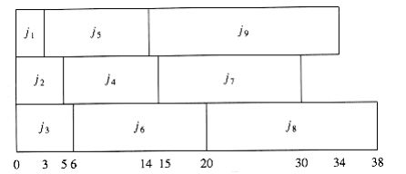
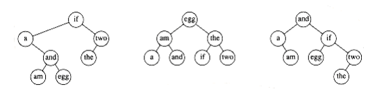
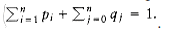
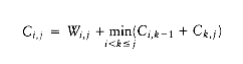
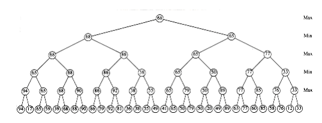
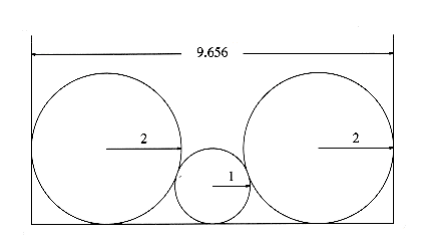
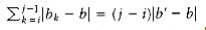

#CHAPTER 10: 
#ALGORITHM DESIGN TECHNIQUES

So far, we have been concerned W~i~th the efficient implementation of algorithms. We have seen that when an algorithm is given, the actual data structures need not be specified. It is up to the programmer to choose the approriate data structure in order to make the running time as small as possible.

In this chapter, we sW~i~tch our attention from the implementation of algorithms to the design of algorithms. Most of the algorithms that we have seen so far are straightforward and simple. Chapter 9 contains some algorithms that are much more subtle, and some require an argument (in some cases lengthy) to show that they are indeed correct. In this chapter, we W~i~ll focus on five of the common types of algorithms used to solve problems. For many problems, it is quite likely that at least one of these methods W~i~ll work. Specifically, for each type of algorithm we W~i~ll

- See the general approach.

- Look at several examples (the exercises at the end of the chapter provide many more examples).

- Discuss, in general terms, the time and space complex~i~ty, where appropriate.

# 10.1. Greedy Algorithms

The first type of algorithm we W~i~ll examine is the greedy algorithm. We have already seen three greedy algorithms in Chapter 9: Dijkstra's, Prim's, and Kruskal's algorithms. Greedy algorithms work in phases. In each phase, a decision is made that appears to be good, W~i~thout regard for future consequences. Generally, this means that some local optimum is chosen. This "take what you can get now" strategy is the source of the name for this class of algorithms. When the algorithm terminates, we hope that the local optimum is equal to the global optimum. If this is the case, then the algorithm is correct; otherW~i~se, the algorithm has produced a suboptimal solution. If the absolute best answer is not required, then simple greedy algorithms are sometimes used to generate approx~i~mate answers, rather than using the more complicated algorithms generally required to generate an exact answer.

There are several real-life examples of greedy algorithms. The most obvious is the coin-changing problem. To make change in U.S. currency, we repeatedly dispense the largest denomination. Thus, to give out seventeen dollars and sixty- one cents in change, we give out a ten-dollar bill, a five-dollar bill, two one- dollar bills, two quarters, one dime, and one penny. By doing this, we are guaranteed to minimize the number of bills and coins. This algorithm does not work in all monetary systems, but fortunately, we can prove that it does work in the American monetary system. Indeed, it works even if two-dollar bills and fifty-cent pieces are allowed.

Traffic problems provide an example where making locally optimal choices does not always work. For example, during certain rush hour times in Miami, it is best to stay off the prime streets even if they look empty, because traffic W~i~ll come to a standstill a mile down the road, and you W~i~ll be stuck. Even more shocking, it is better in some cases to make a temporary detour in the direction opposite your destination in order to avoid all traffic bottlenecks.

In the remainder of this section, we W~i~ll look at several applications that use greedy algorithms. The first application is a simple scheduling problem. Virtually all scheduling problems are either NP-complete (or of similar difficult complex~i~ty) or are solvable by a greedy algorithm. The second application deals W~i~th file compression and is one of the earliest results in computer science. Finally, we W~i~ll look at an example of a greedy approx~i~mation algorithm.

## 10.1.1. A Simple Scheduling Problem

We are given jobs j~1~, j~2~, . . . , jn, all W~i~th known running times t~1~, t~2~, . . . , tn, respectively. We have a single processor. What is the best way to schedule these jobs in order to minimize the average completion time? In this entire section, we W~i~ll assume nonpreemptive scheduling: Once a job is started, it must run to completion.

As an example, suppose we have the four jobs and associated running times shown in Figure 10.1. One possible schedule is shown in Figure 10.2. Because j~1~ finishes in 15 (time units), j~2~ in 23, j~3~ in 26, and j~4~ in 36, the average completion time is 25. A better schedule, which yields a mean completion time of 17.75, is shown in Figure 10.3.

The schedule given in Figure 10.3 is arranged by shortest job first. We can show that this W~i~ll always yield an optimal schedule. Let the jobs in the schedule be j~I~1~~, j~I~2~~, . . . , j~in~. The first job finishes in time t~I~1~~. The second job finishes after t~I~1~~ + t~I~2~~, and the third job finishes after t~I~1~~ + t~I~2~~ + t~I~3~~. From this, we see that the total cost, C, of the schedule is


**(10.1)**


**(10.2)**

Job Time

---------

j~1~ 15

j~2~ 8

j~3~ 3

j~4~ 10

**Figure 10.1 Jobs and times**


**Figure 10.2 Schedule #1**


**Figure 10.3 Schedule #2 (optimal)**

Notice that in Equation (10.2), the first sum is independent of the job ordering, so only the second sum affects the total cost. Suppose that in an ordering there ex~i~sts some x > y such that tix < tiy. Then a calculation shows that by swapping j~ix~ and j~iy~, the second sum increases, decreasing the total cost. Thus, any schedule of jobs in which the times are not monotonically nonincreasing must be suboptimal. The only schedules left are those in which the jobs are arranged by smallest running time first, breaking ties arbitrarily.This result indicates the reason the operating system scheduler generally gives precedence to shorter jobs.

### The Multiprocessor Case

We can extend this problem to the case of several processors. Again we have jobs j~1~, j~2~, . . . , jn, W~i~th associated running times t~1~, t~2~, . . . , tn, and a number P of processors. We W~i~ll assume W~i~thout loss of generality that the jobs are ordered, shortest running time first. As an example, suppose P = 3, and the jobs are as shown in Figure 10.4.

Figure 10.5 shows an optimal arrangement to minimize mean completion time. Jobs j~1~, j~4~, and j~7~ are run on Processor 1. Processor 2 handles j~2~, j~5~, and j~8~, andProcessor 3 runs the remaining jobs. The total time to completion is 165, for an average of . 

The algorithm to solve the multiprocessor case is to start jobs in order, cycling through processors. It is not hard to show that no other ordering can do better, although if the number of processors P evenly divides the number of jobs n, there are many optimal orderings. This is obtained by, for each 0 i <n/P, placing each of the jobs j~iP~+1 through j(i+1)P on a different processor. In our case,

Figure 10.6 shows a second optimal solution.

Job Time

---------

j~1~ 3

j~2~ 5

j~3~ 6

j~4~ 10

j~5~ 11

j~6~ 14

j~7~ 15

j~8~ 18

j~9~ 20

**Figure 10.4 Jobs and times**


**Figure 10.5 An optimal solution for the multiprocessor case**

Even if P does not divide n exactly, there can still be many optimal solutions, even if all the job times are distinct. We leave further investigation of this as an exercise.
  
### Minimizing the Final Completion Time

We close this section by considering a very similar problem. Suppose we are only concerned W~i~th when the last job finishes. In our two examples above, these completion times are 40 and 38, respectively. Figure 10.7 shows that the minimum final completion time is 34, and this clearly cannot be improved, because every processor is always busy.

Although this schedule does not have minimum mean completion time, it has merit in that the completion time of the entire sequence is earlier. If the same user owns all these jobs, then this is the preferable method of scheduling. Although these problems are very similar, this new problem turns out to be NP-complete; it is just another way of phrasing the knapsack or bin-packing problems, which we W~i~ll encounter later in this section. Thus, minimizing the final completion time is apparently much harder than minimizing the mean completion time.



**Figure 10.6 A second optimal solution for the multiprocessor case**


**Figure 10.7 Minimizing the final completion time**

## 10.1.2. Huffman Codes

In this section, we consider a second application of greedy algorithms, known as file compression.

The normal ASCII character set consists of roughly 100 "printable" characters.

In order to distinguish these characters, log 100 = 7 bits are required. Seven bits allow the representation of 128 characters, so the ASCII character set adds some other "nonprintable" characters. An eighth bit is added as a parity check. The important point, however, is that if the size of the character set is C, then log C bits are needed in a standard encoding.

Suppose we have a file that contains only the characters a, e, i, s, t, plus blank spaces and newlines. Suppose further, that the file has ten a's, fifteen e's, twelve i's, three s's, four t's, thirteen blanks, and one newline. As the table in Figure 10.8 shows, this file requires 174 bits to represent, since there are 58 characters and each character requires three bits.

Character Code Frequency Total Bits

--------------------------------------

a 000 10 30

e 001 15 45

i 010 12 36

s 011 3 9

t 100 4 12

space 101 3 39

newline 110 1 3

--------------------------------------

Total 174

**Figure 10.8 Using a standard coding scheme**

In real life, files can be quite large. Many of the very large files are output of some program and there is usually a big disparity between the most frequent and least frequent characters. For instance, many large data files have an inordinately large amount of digits, blanks, and newlines, but few q's and x's. We might be interested in reducing the file size in the case where we are transmitting it over a slow phone line. Also, since on virtually every machine disk space is precious, one might wonder if it would be possible to provide a better code and reduce the total number of bits required.

The answer is that this is possible, and a simple strategy achieves 25 percent savings on typical large files and as much as 50 to 60 percent savings on many large data files. The general strategy is to allow the code length to vary from character to character and to ensure that the frequently occurring characters have short codes. Notice that if all the characters occur W~i~th the same frequency, then there are not likely to be any savings.

The binary code that represents the alphabet can be represented by the binary tree shown in Figure 10.9.

The tree in Figure 10.9 has data only at the leaves. The representation of each character can be found by starting at the root and recording the path, using a 0 to indicate the left branch and a 1 to indicate the right branch. For instance, s is reached by going left, then right, and finally right. This is encoded as 011. This data structure is sometimes referred to as a trie. If character c~i~ is at depth di and occurs fi times, then the cost of the code is equal to d~i~ f~i~.


**Figure 10.9 Representation of the original code in a tree**


**Figure 10.10 A slightly better tree**

A better code than the one given in Figure 10.9 can be obtained by noticing that the newline is an only child. By placing the newline symbol one level higher at its parent, we obtain the new tree in Figure 10.9. This new tree has cost of 173, but is still far from optimal.

Notice that the tree in Figure 10.10 is a full tree: All nodes either are leaves or have two children. An optimal code W~i~ll always have this property, since otherW~i~se, as we have already seen, nodes W~i~th only one child could move up a level.

If the characters are placed only at the leaves, any sequence of bits can always be decoded unambiguously. For instance, suppose the encoded string is 0100111100010110001000111. 0 is not a character code, 01 is not a character code, but 010 represents i, so the first character is i. Then 011 follows, giving a t. Then 11 follows, which is a newline. The remainder of the code is a, space, t, i, e, and newline. Thus, it does not matter if the character codes are different lengths, as long as no character code is a prefix of another character code. Such an encoding is known as a prefix code. Conversely, if a character is contained in a nonleaf node, it is no longer possible to guarantee that the decoding W~i~ll be unambiguous.

Putting these facts together, we see that our basic problem is to find the full binary tree of minimum total cost (as defined above), where all characters are contained in the leaves. The tree in Figure 10.11 shows the optimal tree for our sample alphabet. As can be seen in Figure 10.12, this code uses only 146 bits.


**Figure 10.11 Optimal prefix code**

Character Code Frequency Total Bits

------------------------=--------------

a 001 10 30

e 01 15 30

i 10 12 24

s 00000 3 15

t 0001 4 16

space 11 13 26

newline 00001 1 5

---------------------------------------

Total 146

**Figure 10.12 Optimal prefix code**

Notice that there are many optimal codes. These can be obtained by swapping children in the encoding tree. The main unresolved question, then, is how the coding tree is constructed. The algorithm to do this was given by Huffman in 1952. Thus, this coding system is commonly referred to as a Huffman code.

Huffman's Algorithm

### Huffman's Algorithm

Throughout this section we W~i~ll assume that the number of characters is C. Huffman's algorithm can be described as follows: We maintain a forest of trees.

The weight of a tree is equal to the sum of the frequencies of its leaves. C - 1 times, select the two trees, t~1~ and t~2~, of smallest weight, breaking ties arbitrarily, and form a new tree W~i~th subtrees Tl and t~2~. At the beginning of the algorithm, there are C single-node trees-one for each character. At the end of the algorithm there is one tree, and this is the optimal Huffman coding tree.

A worked example W~i~ll make the operation of the algorithm clear. Figure 10.13 shows the initial forest; the weight of each tree is shown in small type at the root. The two trees of lowest weight are merged together, creating the forest shown in Figure 10.14. We W~i~ll name the new root t~1~, so that future merges can be stated unambiguously. We have made s the left child arbitrarily; any tiebreaking procedure can be used. The total weight of the new tree is just the sum of the weights of the old trees, and can thus be easily computed. It is also a simple matter to create the new tree, since we merely need to get a new node, set the left and right pointers, and record the weight.


**Figure 10.13 Initial stage of Huffman's algorithm**


**Figure 10.14 Huffman's algorithm after the first merge**


**Figure 10.15 Huffman's algorithm after the second merge**


**Figure 10.16 Huffman's algorithm after the third merge**

Now there are six trees, and we again select the two trees of smallest weight.
These happen to be t~1~ and t, which are then merged into a new tree W~i~th root t~2~ and weight 8. This is shown in Figure 10.15. The third step merges t~2~ and a, creating t~3~, W~i~th weight 10 + 8 = 18. Figure 10.16 shows the result of this operation.

After the third merge is completed, the two trees of lowest weight are the single-node trees representing i and the blank space. Figure 10.17 shows how these trees are merged into the new tree W~i~th root t~4~. The fifth step is to merge the trees W~i~th roots e and t~3~, since these trees have the two smallest weights. The result of this step is shown in Figure 10.18.

Finally, the optimal tree, which was shown in Figure 10.11, is obtained by merging the two remaining trees. Figure 10.19 shows this optimal tree, W~i~th root t~6~.


**Figure 10.17 Huffman's algorithm after the fourth merge**


**Figure 10.18 Huffman's algorithm after the fifth merge**


**Figure 10.19 Huffman's algorithm after the final merge**

We W~i~ll sketch the ideas involved in proving that Huffman's algorithm yields an optimal code; we W~i~ll leave the details as an exercise. First, it is not hard to show by contradiction that the tree must be full, since we have already seen how a tree that is not full is improved.

Next, we must show that the two least frequent characters and must be the two deepest nodes (although other nodes may be as deep). Again, this is easy to show by contradiction, since if either or is not a deepest node, then there must be some that is (recall that the tree is full). If is less frequent than , then we can improve the cost by swapping them in the tree.

We can then argue that the characters in any two nodes at the same depth can be swapped W~i~thout affecting optimality. This shows that an optimal tree can always be found that contains the two least frequent symbols as siblings; thus the first step is not a mistake.

The proof can be completed by using an induction argument. As trees are merged, we consider the new character set to be the characters in the roots. Thus, in our example, after four merges, we can view the character set as consisting of e and the metacharacters t~3~ and t~4~. This is probably the trickiest part of the proof; you are urged to fill in all of the details.

The reason that this is a greedy algorithm is that at each stage we perform a merge W~i~thout regard to global considerations. We merely select the two smallest trees.

If we maintain the trees in a priority queue, ordered by weight, then the running time is O(C log C), since there W~i~ll be one build_heap, 2C - 2 delete_mins, and C - 2 inserts, on a priority queue that never has more than C elements. A simple

implementation of the priority queue, using a linked list, would give an O (C2) algorithm. The choice of priority queue implementation depends on how large C is. In the typical case of an ASCII character set, C is small enough that the quadratic running time is acceptable. In such an application, virtually all the running time W~i~ll be spent on the disk I/O required to read the input file and write out the compressed version.

There are two details that must be considered. First, the encoding information must be transmitted at the start of the compressed file, since otherW~i~se it W~i~ll be impossible to decode. There are several ways of doing this; see Exercise 10.4. For small files, the cost of transmitting this table W~i~ll override any possible savings in compression, and the result W~i~ll probably be file expansion. Of course, this can be detected and the original left intact. For large files, the size of the table is not significant.

The second problem is that as described, this is a two-pass algorithm. The first pass collects the frequency data and the second pass does the encoding. This is obviously not a desirable property for a program dealing W~i~th large files. Some alternatives are described in the references.

## 10.1.3. Approx~i~mate Bin Packing

In this section, we W~i~ll consider some algorithms to solve the bin packing problem. These algorithms W~i~ll run quickly but W~i~ll not necessarily produce optimal solutions. We W~i~ll prove, however, that the solutions that are produced are not too far from optimal.

We are given n items of sizes s1, s2, . . . , sn. All sizes satisfy 0 < si 1.

The problem is to pack these items in the fewest number of bins, given that each bin has unit capacity. As an example, Figure 10.20 shows an optimal packing for an item list W~i~th sizes 0.2, 0.5, 0.4, 0.7, 0.1, 0.3, 0.8.

Figure 10.20 Optimal packing for 0.2, 0.5, 0.4, 0.7, 0.1, 0.3, 0.8

There are two versions of the bin packing problem. The first version is on-line bin packing. In this version, each item must be placed in a bin before the next item can be processed. The second version is the off-line bin packing problem. In an off-line algorithm, we do not need to do anything until all the input has been read. The distinction between on-line and off-line algorithms was discussed in Section 8.2.

### On-line Algorithms

The first issue to consider is whether or not an on-line algorithm can actually always give an optimal answer, even if it is allowed unlimited computation. Remember that even though unlimited computation is allowed, an on-line algorithm must place an item before processing the next item and cannot change its decision.

To show that an on-line algorithm cannot always give an optimal solution, we W~i~ll give it particularly difficult data to work on. Consider an input sequence I~1~ of m small items of weight followed by m large items of weight , 0 < < 0.01. It is clear that these items can be packed in m bins if we place one small item and one large item in each bin. Suppose there were an optimal on-line algorithm A that could perform this packing. Consider the operation of algorithm

A on the sequence I~2~, consisting of only m small items of weight . I~2~ can be packed in [m/2] bins. However, A W~i~ll place each item in a separate bin, since A must yield the same results on I~2~ as it does for the first half of I~1~, since the first half of I~1~ is exactly the same input as I~2~. This means that A W~i~ll use tW~i~ce as many bins as is optimal for I~2~. What we have proven is that there is no optimal algorithm for on-line bin packing.

What the argument above shows is that an on-line algorithm never knows when the input might end, so any performance guarantees it provides must hold at every instant throughout the algorithm. If we follow the foregoing strategy, we can prove the folloW~i~ng.

THEOREM 10.1.

There are inputs that force any on-line bin-packing algorithm to use at least the optimal number of bins.

PROOF:

Suppose otherW~i~se, and suppose for simplicity that m is even. Consider any on- line algorithm A running on the input sequence I~1~, above. Recall that this

sequence consists of m small items followed by m large items. Let us consider what the algorithm A has done after processing the mth item. Suppose A has already used b bins. At this point in the algorithm, the optimal number of bins is m/2, because we can place two elements in each bin. Thus we know that, by our assumption of a performance guarantee.

Now consider the performance of algorithm A after all items have been packed. All bins created after the bth bin must contain exactly one item, since all small items are placed in the first b bins, and two large items W~i~ll not fit in a bin. Since the first b bins can have at most two items each, and the remaining bins have one item each, we see that packing 2m items W~i~ll require at least 2m - b bins. Since the 2m items can be optimally packed using m bins, our performance

guarantee assures us that
.


**Figure 10.21 Next fit for 0.2, 0.5, 0.4, 0.7, 0.1, 0.3, 0.8**

The first inequality implies that , and the second inequality implies that , which is a contradiction. Thus, no on-line algorithm can guarantee that it W~i~ll produce a packing W~i~th less than the optimal number of bins.

There are three simple algorithms that guarantee that the number of bins used is no more than tW~i~ce optimal. There are also quite a few more complicated algorithms W~i~th better guarantees.

### Next Fit

Probably the simplest algorithm is next fit. When processing any item, we check to see whether it fits in the same bin as the last item. If it does, it is placed there; otherW~i~se, a new bin is created. This algorithm is incredibly simple to implement and runs in linear time. Figure 10.21 shows the packing produced for the same input as Figure 10.20.

Not only is next fit simple to program, its worst-case behavior is also easy to analyze.

THEOREM 10.2.

Let m be the optimal number of bins required to pack a list I of items. Then next fit never uses more than 2m bins. There ex~i~st sequences such that next fit uses 2m - 2 bins.

PROOF:

Consider any adjacent bins Bj and Bj + 1. The sum of the sizes of all items in Bj and Bj + 1 must be larger than 1, since otherW~i~se all of these items would have been placed in Bj. If we apply this result to all pairs of adjacent bins, we see that at most half of the space is wasted. Thus next fit uses at most tW~i~ce the number of bins.

To see that this bound is tight, suppose that the n items have size si = 0.5 if i is odd and si = 2/n if i is even. Assume n is divisible by 4. The optimal packing, shown in Figure 10.22, consists of n/4 bins, each containing 2 elements of size 0.5, and one bin containing the n/2 elements of size 2/n, for a total of (n/4) + 1. Figure 10.23 shows that next fit uses n/2 bins. Thus, next fit can be forced to use almost tW~i~ce as many bins as optimal.


**Figure 10.22 Optimal packing for 0.5, 2/n, 0.5, 2/n, 0.5, 2/n, . . .**


**Figure 10.23 Next fit packing for 0.5, 2/n, 0.5, 2/n, 0.5, 2/n, . . .**

### First Fit

Although next fit has a reasonable performance guarantee, it performs poorly in practice, because it creates new bins when it does not need to. In the sample run, it could have placed the item of size 0.3 in either B1 or B2, rather than create a new bin.

The first fit strategy is to scan the bins in order and place the new item in the first bin that is large enough to hold it. Thus, a new bin is created only when the results of previous placements have left no other alternative. Figure 10.24 shows the packing that results from first fit on our standard input.

A simple method of implementing first fit would process each item by scanning down the list of bins sequentially. This would take O(n2). It is possible to implement first fit to run in O(n log n); we leave this as an exercise.

A moment's thought W~i~ll convince you that at any point, at most one bin can be more than half empty, since if a second bin were also half empty, its contents would fit into the first bin. Thus, we can immediately conclude that first fit guarantees a solution W~i~th at most tW~i~ce the optimal number of bins. 


**Figure 10.24 First fit for 0.2, 0.5, 0.4, 0.7, 0.1, 0.3, 0.8**

On the other hand, the bad case that we used in the proof of next fit's performance bound does not apply for first fit. Thus, one might wonder if a better bound can be proven. The answer is yes, but the proof is complicated.

THEOREM 10.3.

Let m be the optimal number of bins required to pack a list I of items. Then first fit never uses more than bins. There ex~i~st sequences such that first fit uses bins.

PROOF:

See the references at the end of the chapter.

An example where first fit does almost as poorly as the previous theorem would indicate is shown in Figure 10.25. The input consists of 6m items of size, followed by 6m items of size , followed by 6m items of size . One simple packing places one item of each size in a bin and requires 6m bins. First fit requires 10m bins.

When first fit is run on a large number of items W~i~th sizes uniformly distributed between 0 and 1, empirical results show that first fit uses roughly 2 percent more bins than optimal. In many cases, this is quite acceptable.


**Figure 10.25 A case where first fit uses 10m bins instead of 6m**


**Figure 10.26 Best fit for 0.2, 0.5, 0.4, 0.7, 0.1, 0.3, 0.8**

### First Fit

Although next fit has a reasonable performance guarantee, it performs poorly in practice, because it creates new bins when it does not need to. In the sample run, it could have placed the item of size 0.3 in either B1 or B2, rather than create a new bin.

The first fit strategy is to scan the bins in order and place the new item in the first bin that is large enough to hold it. Thus, a new bin is created only when the results of previous placements have left no other alternative. Figure 10.24 shows the packing that results from first fit on our standard input.

A simple method of implementing first fit would process each item by scanning down the list of bins sequentially. This would take O(n2). It is possible to implement first fit to run in O(n log n); we leave this as an exercise.

A moment's thought W~i~ll convince you that at any point, at most one bin can be more than half empty, since if a second bin were also half empty, its contents would fit into the first bin. Thus, we can immediately conclude that first fit guarantees a solution W~i~th at most tW~i~ce the optimal number of bins.


**Figure 10.24 First fit for 0.2, 0.5, 0.4, 0.7, 0.1, 0.3, 0.8**

On the other hand, the bad case that we used in the proof of next fit's performance bound does not apply for first fit. Thus, one might wonder if a better bound can be proven. The answer is yes, but the proof is complicated.

THEOREM 10.3.

Let m be the optimal number of bins required to pack a list I of items. Then first fit never uses more than bins. There ex~i~st sequences such that first fit uses bins.

PROOF:

See the references at the end of the chapter.

An example where first fit does almost as poorly as the previous theorem would indicate is shown in Figure 10.25. The input consists of 6m items of size, followed by 6m items of size , followed by 6m items of size . One simple packing places one item of each size in a bin and requires 6m bins. First fit requires 10m bins.

When first fit is run on a large number of items W~i~th sizes uniformly distributed between 0 and 1, empirical results show that first fit uses roughly 2 percent more bins than optimal. In many cases, this is quite acceptable.


**Figure 10.25 A case where first fit uses 10m bins instead of 6m**


**Figure 10.26 Best fit for 0.2, 0.5, 0.4, 0.7, 0.1, 0.3, 0.8** 

# 10.2. Divide and Conquer

Another common technique used to design algorithms is divide and conquer. Divide and conquer algorithms consist of two parts: 

Divide: Smaller problems are solved recursively (except, of course, base cases).

Conquer: The solution to the original problem is then formed from the solutions to the subproblems.

Traditionally, routines in which the text contains at least two recursive calls are called divide and conquer algorithms, while routines whose text contains only one recursive call are not. We generally insist that the subproblems be disjoint (that is, essentially nonoverlapping). Let us review some of the recursive algorithms that have been covered in this text.

We have already seen several divide and conquer algorithms. In Section 2.4.3, we saw an O (n log n) solution to the ~max~~i~mum subsequence sum problem. In Chapter 4, we saw linear-time tree traversal strategies. In Chapter 7, we saw the classic examples of divide and conquer, namely mergesort and quicksort, which have O (n log n) worst-case and average-case bounds, respectively.

We have also seen several examples of recursive algorithms that probably do not classify as divide and conquer, but merely reduce to a single simpler case. In Section 1.3, we saw a simple routine to print a number. In Chapter 2, we used recursion to perform efficient exponentiation. In Chapter 4, we examined simple search routines for binary search trees. In Section 6.6, we saw simple recursion used to merge leftist heaps. In Section 7.7, an algorithm was given for selection that takes linear average time. The disjoint set find operation was written recursively in Chapter 8. Chapter 9 showed routines to recover the shortest path in Dijkstra's algorithm and other procedures to perform depth-first search in graphs. None of these algorithms are really divide and conquer algorithms, because only one recursive call is performed.

We have also seen, in Section 2.4, a very bad recursive routine to compute the Fibonacci numbers. This could be called a divide and conquer algorithm, but it is terribly inefficient, because the problem really is not divided at all.

In this section, we W~i~ll see more examples of the divide and conquer paradigm. Our first application is a problem in computational geometry. Given n points in a plane, we W~i~ll show that the closest pair of points can be found in O(n log n) time. The exercises describe some other problems in computational geometry which can be solved by divide and conquer. The remainder of the section shows some extremely interesting, but mostly theoretical, results. We provide an algorithm which solves the selection problem in O(n) worst-case time. We also show that 2n-bit numbers can be multiplied in o(n2) operations and that two n x n matrices can be multiplied in o(n3) operations. Unfortunately, even though these algorithms have better worst-case bounds than the conventional algorithms, none are practical except for very large inputs.

## 10.2.1. Running Time of Divide and Conquer Algorithms

All the efficient divide and conquer algorithms we W~i~ll see divide the problems into subproblems, each of which is some fraction of the original problem, and then perform some additional work to compute the final answer. As an example, we have seen that mergesort operates on two problems, each of which is half the size of the original, and then uses O(n) additional work. This yields the running time equation (W~i~th appropriate initial conditions)

T(n) = 2T(n/2) + O(n)

We saw in Chapter 7 that the solution to this equation is O(n log n). The folloW~i~ng theorem can be used to determine the running time of most divide and conquer algorithms.

THEOREM 10.6.

The solution to the equation T(n) = aT(n/b) + (nk), where a 1 and b > 1, is


PROOF:

FolloW~i~ng the analysis of mergesort in Chapter 7, we W~i~ll assume that n is a

power of b; thus, let n = bm. Then n/b = bm-l and nk = (bm)k = bmk = bkm = (bk)m.

Let us assume T(1) = 1, and ignore the constant factor in (nk). Then we have

T(bm) = aT(bm-l)+(bk)m

If we divide through by am, we obtain the equation


**(10.3)**

We can apply this equation for other values of m, obtaining


**(10.4)**


**(10.5)**


**(10.6)**

We use our standard trick of adding up the telescoping equations (10.3) through (10.6). Virtually

all the terms on the left cancel the leading terms on the right, yielding


**(10.7)**


**(10.8)**

Thus


**(10.9)**

If a > bk, then the sum is a geometric series W~i~th ratio smaller than 1. Since the sum of infinite series would converge to a constant, this finite sum is also bounded by a constant, and thus Equation (10.10) applies:

T(n) = O(am) = O(alogb n) O = O(nlogb a)

**(10.10)**

If a = bk, then each term in the sum is 1. Since the sum contains 1 + logb n terms and a = b k

implies that logb a = k,

T(n) = O(am logb n) = O(n log

b a logb n) = O(n

k logb n)

= O (nk log n)
  
**(10.11)**

Finally, if a < bk, then the terms in the geometric series are larger than 1, and the second formula in Section 1.2.3 applies. We obtain

**(10.12)**

proving the last case of the theorem.

As an example, mergesort has a = b = 2 and k = 1. The second case applies, giving the answer O(n log n). If we solve three problems, each of which is half the original size, and combine the solutions W~i~th O(n) additional work, then a = 3, b = 2 and k = 1. Case 1 applies here, giving a bound of O(nlog2 3) = O(n1.59). An algorithm that solved three half-sized problems, but required Oc (n2) work to merge the solution, would have an O(n2) running time, since the third case would apply.

There are two important cases that are not covered by Theorem 10.6. We state two more theorems, leaving the proofs as exercises. Theorem 10.7 generalizes the previous theorem.

THEOREM 10.7.

The solution to the equation T(n) = aT(n/b) + (nk logp n), where a 1, b > 1, and p 0 is


THEOREM 10.8.

, then the solution to the equation is T(n) = O(n).

## 10.2.2. Closest-Points Problem

The input to our first problem is a list P of points in a plane. If pl = (x1, y1) and P~2~ = (x2, y2), then the Euclidean distance between pl and P~2~ is [(x1 - x2) 2 + (y~1~ - y2) 2]l/2. We are required to find the closest pair of points. It is possible that two points have the same position; in that case that pair is the closest, W~i~th distance zero.

If there are n points, then there are n (n - 1)/2 pairs of distances. We can check all of these, obtaining a very short program, but at the expense of an O(n2) algorithm. Since this approach is just an exhaustive search, we should expect to do better.

Let us assume that the points have been sorted by x coordinate. At worst, this adds O(n log n) to the final time bound. Since we W~i~ll show an O(n log n) bound for the entire algorithm, this sort is essentially free, from a complex~i~ty standpoint.
 
Figure 10.29 shows a small sample point set P. Since the points are sorted by x coordinate, we can draw an imaginary vertical line that partitions the points set into two halves, Pl and Pr.This is certainly simple to do. Now we have almost exactly the same situation as we saw in the ~max~~i~mum subsequence sum problem in Section 2.4.3. Either the closest points are both in Pl, or they are both in Pr, or one is in Pl and the other is in Pr. Let us call these distances dl, dr, and dc. Figure 10.30 shows the partition of the point set and these three distances.

We can compute dl and _dr_ recursively. The problem, then, is to compute dc. Since we would like an O(n log n) solution, we must be able to compute dc W~i~th only O(n) additional work. We have already seen that if a procedure consists of two half-sized recursive calls and O(n) additional work, then the total time W~i~ll be O(n log n).

Let = min(dl, dr). The first observation is that we only need to compute dc if dc improves on . If dc is such a distance, then the two points that define dc must be W~i~thin of the dividing line; we W~i~ll refer to this area as a strip. As shown in Figure 10.31, this observation limits the number of points that need to be considered (in our case, = dr).

There are two strategies that can be tried to compute dc. For large point sets that are uniformly distributed, the number of points that are expected to be in the strip is very small. Indeed, it is easy to argue that only points are in the strip on average. Thus, we could perform a brute force calculation on these points in O(n) time. The pseudocode in Figure 10.32 implements this strategy, assuming the C convention that the points are indexed starting at 0.


**Figure 10.29 A small point set**

  
**Figure 10.30 P partitioned into P~1~ and P~2~; shortest distances are shown**


**Figure 10.31 Two-lane strip, containing all points considered for dc strip**
```
/* Points are all in the strip */

for( i=0; i<NUM_POINTS_IN_STRIP; i++ )

for( j=i+1; j<NUM_POINTS_IN_STRIP; j++ )

if( dist( pi,pj ) < )

= dist( pi,pj );

Figure 10.32 Brute force calculation of min( , dc**)**

/* Points are all in the strip and sorted by y coordinate */

for( i=0; i<NUM_POINTS_IN_STRIP; i++ )

for( j=i+1; j<NUM_POINTS_IN_STRIP; j++ )

if ( pi and pj 's coordinates differ by more than )

break; /* goto next pi */

else

if( dist( pi, pj) < )

= dist( pi, pj);
```
**Figure 10.33 Refined calculation of min( , dc)**

In the worst case, all the points could be in the strip, so this strategy does not always work in linear time. We can improve this algorithm W~i~th the folloW~i~ng observation: The y coordinates of the two points that define dc can differ by at most . OtherW~i~se, dc > . Suppose that the points in the strip are sorted by their y coordinates. Therefore, if pi and pj's y coordinates differ by more than , then we can proceed to pi + l. This simple modification is implemented in Figure 10.33.

This extra test has a significant effect on the running time, because for each pi only a few points pj are examined before pi's and pj's y coordinates differ by more than and force an ex~i~t from the inner for loop. Figure 10.34 shows, for instance, that for point P~3~, only the two

points P~4~ and P~5~ lie in the strip W~i~thin vertical distance.


**Figure 10.34 Only P~4~ and P~5~ are considered in the second for loop**  


**Figure 10.35 At most eight points fit in the rectangle; there are two coordinates shared by two points each**

In the worst case, for any point pi, at most 7 points pj are considered. This is because these points must lie either in the by square in the left half of the strip or in the by square in the right half of the strip. On the other hand, all the points in each by square are separated by at least . In the worst case, each square contains four points, one at each corner. One of these points is pi, leaving at most seven points to be considered.

This worst-case situation is shown in Figure 10.35. Notice that even though pl2 and pr1 have the same coordinates, they could be different points. For the actual analysis, it is only important that the number of points in the by 2 rectangle be O(1), and this much is certainly clear.

Because at most seven points are considered for each pi, the time to compute a dc that is better than is O(n). Thus, we appear to have an O(n log n) solution to the closest-points problem, based on the two half-sized recursive calls plus the linear extra work to combine the two results. However, we do not quite have an O (n log n) solution yet. The problem is that we have assumed that a list of points sorted by y coordinate is available. If we perform this sort for each recursive call, then we have O(n log n) extra work: this gives an O (n log2 n) algorithm. This is not all that bad, especially when compared to the brute force O (n2). However, it is not hard to reduce the work for each recursive call to O(n), thus ensuring an O(n log n) algorithm.

We W~i~ll maintain two lists. One is the point list sorted by x coordinate, and the other is the point list sorted by y coordinate. We W~i~ll call these lists P and Q, respectively. These can be obtained by a preprocessing sorting step at cost O(n log n) and thus does not affect the time bound. Pl and Ql are the lists passed to the left-half recursive call, and Pr and Qr are the lists passed to the right-half recursive call. We have already seen that P is easily split in the middle. Once the dividing line is known, we step through Q sequentially, placing each element in Ql or Qr, as appropriate. It is easy to see that Ql and Qr W~i~ll be automatically sorted by y coordinate. When the recursive calls return, we scan through the Q list and discard all the points whose x coordinates are not W~i~thin the strip. Then Q contains only points in the strip, and these points are guaranteed to be sorted by their y coordinates. 

This strategy ensures that the entire algorithm is O (n log n), because only O (n) extra work is performed.

## 10.2.3. The Selection Problem

The selection problem requires us to find the kth smallest element in a list S of n elements. Of particular interest is the special case of finding the median. This occurs when k = _n_/2 .

In Chapters 1, 6, 7 we have seen several solutions to the selection problem. The solution in Chapter 7 uses a variation of quicksort and runs in O(n) average time. Indeed, it is described in Hoare's original paper on quicksort.

Although this algorithm runs in linear average time, it has a worst case of O (n2). Selection can easily be solved in O(n log n) worst-case time by sorting the elements, but for a long time it was unknown whether or not selection could be accomplished in O(n) worst-case time. The quickselect algorithm outlined in Section 7.7.6 is quite efficient in practice, so this was mostly a question of theoretical interest.

Recall that the basic algorithm is a simple recursive strategy. Assuming that n is larger than the cutoff point where elements are simply sorted, an element v, known as the pivot, is chosen. The remaining elements are placed into two sets, S1 and S2. S1 contains elements that are guaranteed to be no larger than v, and S2 contains elements that are no smaller than v. Finally, if k |S1|, then the kth smallest element in S can be found by recursively computing the kth smallest element in S1. If k = |S1| + 1, then the pivot is the kth smallest element. OtherW~i~se, the kth smallest element in S is the (k - |S1| -1 )st smallest element in S2. The main difference between this algorithm and quicksort is that there is only one subproblem to solve instead of two.

In order to obtain a linear algorithm, we must ensure that the subproblem is only a fraction of the original and not merely only a few elements smaller than the original. Of course, we can always find such an element if we are W~i~lling to spend some time to do so. The difficult problem is that we cannot spend too much time finding the pivot.

For quicksort, we saw that a good choice for pivot was to pick three elements and use their median. This gives some expectation that the pivot is not too bad, but does not provide a guarantee. We could choose 21 elements at random, sort them in constant time, use the 11th largest as pivot, and get a pivot that is even more likely to be good. However, if these 21 elements were the 21 largest, then the pivot would still be poor. Extending this, we could use up to O (n / log n) elements, sort them using heapsort in O(n) total time, and be almost certain, from a statistical point of view, of obtaining a good pivot. In the worst case, however, this does not work because we might select the O (n / log n) largest elements, and then the pivot would be the [n - O(n / log n)]th largest element, which is not a constant fraction of n.

The basic idea is still useful. Indeed, we W~i~ll see that we can use it to improve the expected number of comparisons that quickselect makes. To get a good worst case, however, the key idea is to use one more level of indirection. Instead of finding the median from a sample of random elements, we W~i~ll find the median from a sample of medians.

The basic pivot selection algorithm is as follows:

1. Arrange the n elements into _n_/5 groups of 5 elements, ignoring the (at most four) extra elements.

2. Find the median of each group. This gives a list M of _n_/5 medians.

3. Find the median of M. Return this as the pivot, v.

We W~i~ll use the term median-of-median-of-five partitioning to describe the quickselect algorithm that uses the pivot selection rule given above. We W~i~ll now show that median-of-median-of-five partitioning guarantees that each recursive subproblem is at most roughly 70 percent as large as the original. We W~i~ll also show that the pivot can be computed quickly enough to guarantee an O (n) running time for the entire selection algorithm.

Let us assume for the moment that n is divisible by 5, so there are no extra elements. Suppose also that n/5 is odd, so that the set M contains an odd number of elements. This provides some symmetry, as we shall see. We are thus assuming, for convenience, that n is of the form 10k + 5. We W~i~ll also assume that all the elements are distinct. The actual algorithm must make sure to handle the case where this is not true. Figure 10.36 shows how the pivot might be chosen when n = 45.

In Figure 10.36, v represents the element which is selected by the algorithm as pivot. Since v is the median of nine elements, and we are assuming that all elements are distinct, there must be four medians that are larger than v and four that are smaller. We denote these by L and S, respectively. Consider a group of five elements W~i~th a large median (type L). The median of the group is smaller than two elements in the group and larger than two elements in the group. We W~i~ll let H represent the huge elements. These are elements that are known to be larger than a large median. Similarly, T represents the tiny elements, which are smaller than a small median. There are 10 elements of type H: Two are in each of the groups W~i~th an L type median, and two elements are in the same group as v. Similarly, there are 10 elements of type T.


**Figure 10.36 How the pivot is chosen**

Elements of type L or H are guaranteed to be larger than v, and elements of type S or T are guaranteed to be smaller than v. There are thus guaranteed to be 14 large and 14 small elements in our problem. Therefore, a recursive call could be on at most 45 - 14 - 1 = 30 elements.

Let us extend this analysis to general n of the form 10k + 5. In this case, there are k elements of type L and k elements of type S . There are 2k + 2 elements of type H, and also 2k + 2 elements of type T. Thus, there are 3k + 2 elements that are guaranteed to be larger than v and 3k + 2 elements that are guaranteed to be smaller. Thus, in this case, the recursive call can contain at most 7k + 2 < 0.7n elements. If n is not of the form 10k + 5, similar arguments can be made W~i~thout affecting the basic result.

It remains to bound the running time to obtain the pivot element. There are two basic steps. We can find the median of five elements in constant time. For instance, it is not hard to sort five elements in eight comparisons. We must do this _n_/5 times, so this step takes O(n) time.

We must then compute the median of a group of _n_/5 elements. The obvious way to do this is to sort the group and return the element in the middle. But this takes O( _n/5_ log _n/5_ ) = O(n log n) time, so this does not work. The solution is to call the selection algorithm recursively on the _n_/5 elements.

This completes the description of the basic algorithm. There are still some details that need to be filled in if an actual implementation is desired. For instance, duplicates must be handled correctly, and the algorithm needs a cutoff large enough to ensure that the recursive calls make progress. There is quite a large amount of overhead involved, and this algorithm is not practical at all, so we W~i~ll not describe any more of the details that need to be considered. Even so, from a theoretical standpoint, the algorithm is a major breakthrough, because, as the folloW~i~ng theorem shows, the running time is linear in the worst case.

THEOREM 10.9.

The running time of quickselect using median-of-median-of-five partitioning is O(n).

PROOF:

The algorithm consists of two recursive calls of size 0.7n and 0.2n, plus linear extra work. By Theorem 10.8, the running time is linear.

**Reducing the Average Number of Comparisons**

Divide and conquer can also be used to reduce the expected number of comparisons required by the selection algorithm. Let us look at a concrete example. Suppose we have a group S of 1,000 numbers and are looking for the 100th smallest number, which we W~i~ll call x. We choose a subset S' of S consisting of 100 numbers. We would expect that the value of x is similar in size to the 10th smallest number in S'. More specifically, the fifth smallest number in S' is almost certainly less than x, and the 15th smallest number in S' is almost certainly greater than x.

More generally, a sample S' of s elements is chosen from the n elements. Let be some number, which we W~i~ll choose later so as to minimize the average number of comparisons used by the procedure. We find the (v1 = ks/n - )th and (v2 = ks/n + )th smallest elements in S'.

Almost certainly, the kth smallest element in S W~i~ll fall between v1 and v2, so we are left W~i~th a selection problem on 2 elements. W~i~th low probability, the kth smallest element does not fall in this range, and we have considerable work to do. However, W~i~th a good choice of s and, we can ensure, by the laws of probability, that the second case does not adversely affect the total work. 

If an analysis is performed, we find that if s = n2/3 log1/3 n and = n1/3 log2/3 n, then the expected number of comparisons is n + k + O(n2/3 log1/3 n), which is optimal except for the low- order term. (If k > n/2, we can consider the symmetric problem of finding the (n - k)th largest element.)

Most of the analysis is easy to do. The last term represents the cost of performing the two selections to determine v1 and v2. The average cost of the partitioning, assuming a reasonably clever strategy, is equal to n plus the expected rank of v2 in S, which is n + k + O(n /s). If the kth element W~i~nds up in S', the cost of finishing the algorithm is equal to the cost of selection on S', namely O(s). If the kth smallest element doesn't W~i~nd up in S', the cost is O (n). However, s and have been chosen to guarantee that this happens W~i~th very low probability o(1/n), so the expected cost of this possibility is o(1), which is a term that goes to zero as n gets large. An exact calculation is left as Exercise 10.21.

This analysis shows that finding the median requires about 1.5n comparisons on average. Of course, this algorithm requires some floating-point arithmetic to compute s, which can slow down the algorithm on some machines. Even so, experiments have shown that if correctly implemented, this algorithm compares favorably W~i~th the quickselect implementation in Chapter 7.

## 10.2.4. Theoretical Improvements for Arithmetic Problems

In this section we describe a divide and conquer algorithm that multiplies two n-digit numbers.

Our previous model of computation assumed that multiplication was done in constant time, because the numbers were small. For large numbers, this assumption is no longer valid. If we measure multiplication in terms of the size of numbers being multiplied, then the natural multiplication algorithm takes quadratic time. The divide and conquer algorithm runs in subquadratic time. We also present the classic divide and conquer algorithm that multiplies two n by n matrices in subcubic time.

Multiplying Integers

Matrix Multiplication

**Multiplying Integers**

Suppose we want to multiply two n-digit numbers x and y. If exactly one of x and y is negative, then the answer is negative; otherW~i~se it is positive. Thus, we can perform this check and then assume that x, y 0. The algorithm that almost everyone uses when multiplying by hand requires (n2) operations, because each digit in x is multiplied by each digit in y.

If x = 61,438,521 and y = 94,736,407, xy = 5,820,464,730,934,047. Let us break x and y into two halves, consisting of the most significant and least significant digits, respectively. Then x~1~ = 6,143, x~r~ = 8,521, y~1~ = 9,473, and y~r~ = 6,407. We also have x = x~1~10 4 + x~r~ and y = y~1~10 4 + y~r~. It follows that

xy = x~1~y~1~10 8 + (x~1~y~r~ + x~r~y~1~)10 4 + x~r~y~r~

Notice that this equation consists of four multiplications, x~1~y~1~, x~1~y~r~, x~r~y~1~, and x~r~y~r~, which are each half the size of the original problem (n/2 digits). The multiplications by 108 and 104 amount to the placing of zeros. This and the subsequent additions add only O(n) additional work. 

If we perform these four multiplications recursively using this algorithm, stopping at an appropriate base case, then we obtain the recurrence

T(n) = 4T(n/2) + O(n)

From Theorem 10.6, we see that T(n) = O(n2), so, unfortunately, we have not improved the algorithm. To achieve a subquadratic algorithm, we must use less than four recursive calls. The key observation is that

x~1~y~r~ + x~r~y~1~ = (x~1~ - x~r~)(y~r~ - y~1~) + x~1~y~1~ + x~r~y~r~

Thus, instead of using two multiplications to compute the coefficient of 104, we can use one multiplication, plus the result of two multiplications that have already been performed. Figure 10.37 shows how only three recursive subproblems need to be solved.

It is easy to see that now the recurrence equation satisfies

T(n) = 3T(n/2) + O(n),

and so we obtain T(n) = O(nlog23) = O(n1.59). To complete the algorithm, we must have a base case, which can be solved W~i~thout recursion.


**Figure 10.37 The divide and conquer algorithm in action**

When both numbers are one-digit, we can do the multiplication by table lookup. If one number has zero digits, then we return zero. In practice, if we were to use this algorithm, we would choose the base case to be that which is most convenient for the machine.

Although this algorithm has better asymptotic performance than the standard quadratic algorithm, it is rarely used, because for small n the overhead is significant, and for larger n there are even better algorithms. These algorithms also make extensive use of divide and conquer.

**Matrix Multiplication**

A fundamental numerical problem is the multiplication of two matrices. Figure 10.38 gives a simple O(n3) algorithm to compute C = AB, where A, B, and C are n n matrices. The algorithm follows directly from the definition of matrix multiplication. To compute Ci,j, we compute the dot product of the ith row in A W~i~th the jth column in B. As usual, arrays begin at index 0.

For a long time it was assumed that (n3) was required for matrix multiplication. However, in the late sixties Strassen showed how to break the (n3) barrier. The basic idea of Strassen's algorithm is to divide each matrix into four quadrants, as shown in Figure 10.39. Then it is easy to show that

C1,1 = A1,1B1,1 + A1,2B2,1

C1,2 = A1,1B1,2 + A1,2B2,2

C2,1 = A2,1B1,1 + A2,2B2,1

C2,2 = A2,1B1,2 + A2,2B2,2
```
/* Standard matrix multiplication. Arrays start at 0 */

void

matrix_multiply( matrix A, matrix B, matrix C, unsigned int n )

{

int i, j, k;

for( i=0; i<n; i++ ) /* Initialization */

for( j=O; j<n; j++ )

C[i][j] = 0.0;

for( i=0; i<n; i++ )

for( j=0; j<n; j++ )

for( k=0; k<n; k++ )

C[i][j] += A[i][k] * B[k][j];

}
```
**Figure 10.38 Simple O(n3) matrix multiplication**


**Figure 10.39 Decomposing AB = C into four quadrants**

As an example, to perform the multiplication **AB**  


we define the folloW~i~ng eight n/2 by n/2 matrices:


We could then perform eight n/2 by n/2 matrix multiplications and four n/2 by n/2 matrix additions. The matrix additions take O(n2) time. If the matrix multiplications are done recursively, then the running time satisfies

T(n) = 8T(n/2) + O(n2).

From Theorem 10.6, we see that T(n) = O(n3), so we do not have an improvement. As we saw W~i~th integer multiplication, we must reduce the number of subproblems below 8. Strassen used a strategy similar to the integer multiplication divide and conquer algorithm and showed how to use only seven recursive calls by carefully arranging the computations. The seven multiplications are

M1 = (A1,2 - A2,2)(B2,1 + B2,2)

M2 = (A1,1 + A2,2)(B1,1 + B2,2)

M3 = (A1,1 - A2,1)(B1,1 + B1,2)

M4 = (A1,1 + A1,2)B2,2

M5 = A1,1(B1,2 - B2,2)

M6 = A2,2(B2,1 - B1,1)

M7 = (A2,1 + A2,2)B1,1

Once the multiplications are performed, the final answer can be obtained W~i~th eight more additions.

C1,1 = M1 + M2 - M4 + M6

C1,2 = M4 + M5

C1,3 = M6 + M7

C1,4 = M2 - M3 + M5 - M7

It is straightforward to verify that this tricky ordering produces the desired values. The running time now satisfies the recurrence

T(n) = 7T(n/2) + O(n2).  

The solution of this recurrence is T(n) = O(nlog27) = O(n2.81).

As usual, there are details to consider, such as the case when n is not a power of two, but these are basically minor nuisances. Strassen's algorithm is worse than the straightforward algorithm until n is fairly large. It does not generalize for the case where the matrices are sparse (contain many zero entries), and it does not easily parallelize. When run W~i~th floating-point entries, it is less stable numerically than the classic algorithm. Thus, it is has only limited applicability. Nevertheless, it represents an important theoretical milestone and certainly shows that in computer science, as in many other fields, even though a problem seems to have an intrinsic complex~i~ty, nothing is certain until proven.

# 10.3. Dynamic Programming

In the previous section, we have seen that a problem that can be mathematically expressed recursively can also be expressed as a recursive algorithm, in many cases yielding a significant performance improvement over a more nave exhaustive search.

Any recursive mathematical formula could be directly translated to a recursive algorithm, but the underlying reality is that often the compiler W~i~ll not do justice to the recursive algorithm, and an inefficient program results. When we suspect that this is likely to be the case, we must provide a little more help to the compiler, by rewriting the recursive algorithm as a nonrecursive algorithm that systematically records the answers to the subproblems in a table. One technique that makes use of this approach is known as dynamic programming.

## 10.3.1. Using a Table Instead of Recursion

In Chapter 2, we saw that the natural recursive program to compute the Fibonacci numbers is very inefficient. Recall that the program shown in Figure 10.40 has a running time T(n) that satisfies

T(n) T(n - 1) + T(n - 2). Since T(n) satisfies the same recurrence relation as the Fibonacci numbers and has the same initial conditions, T(n) in fact grows at the same rate as the Fibonacci numbers, and is thus exponential.

On the other hand, since to compute Fn, all that is needed is Fn-1 and Fn-2, we only need to record the two most recently computed Fibonacci numbers. This yields the O(n) algorithm in Figure 10.41

The reason that the recursive algorithm is so slow is because of the algorithm used to simulate recursion. To compute Fn, there is one call to Fn-1 and Fn-2. However, since Fn-1 recursively makes a call to Fn-2 and Fn-3, there are actually two separate calls to compute Fn-2. If one traces out the entire algorithm, then we can see that Fn-3 is computed three times, Fn-4 is computed five times, Fn-5 is computed eight times, and so on. As Figure 10.42 shows, the growth of redundant calculations is explosive. If the compiler's recursion simulation algorithm were able to keep a list of all precomputed values and not make a recursive call for an already solved subproblem, then this exponential explosion would be avoided. This is why the program in Figure 10.41 is so much more efficient. calculations is explosive. If the compiler's recursion simulation algorithm were able to keep a list of all precomputed values and not make a recursive call for an already solved subproblem, then this exponential explosion would be avoided. This is why the program in Figure 10.41 is so much more efficient.

```
/* Compute Fibonacci numbers as described in Chapter 1 */

unsigned int

fib( unsigned int n )

{

if( n <= 1 )

return 1;

else

return( fib( n-1 ) + fib( n-2 ) );

}

**Figure 10.40 Inefficient algorithm to compute Fibonacci numbers**

unsigned int

fibonacci( unsigned int n )

{

unsigned int i, last, next_to_last, answer;

if( n <= 1 )

return 1;

last = next_to_last = 1;

for( i = 2; i <= n; i++ )

{

answer = last + next_to_last;

next_to_last = last;

last = answer;

}

return answer;

}
```
**Figure 10.41 Linear algorithm to compute Fibonacci numbers**


**Figure 10.42 Trace of the recursive calculation of Fibonacci numbers**
```
double

eval( unsigned int n )

{

int i;

double sum;

if( n == 0 )

return 1.0;

else

{

sum = 0.0;

for( i=0; i<n; i++ )

sum += eval(i);

return( 2.0 * sum / n + n );

}

}
```
**Figure 10.43 Recursive program to evaluate** 

As a second example, we saw in Chapter 7 how to solve the recurrence 

W~i~th C(0) = 1. Suppose that we want to check, numerically, whether the solution we obtained is correct. We could then write the simple program in Figure 10.43 to evaluate the recursion.

Once again, the recursive calls duplicate work. In this case, the running time T(n) satisfies 

because, as shown in Figure 10.44, there is one (direct) recursive call of each size from 0 to n -1, plus O(n) additional work (where else have we seen the tree shown in Figure 10.44?). Solving for T(n), we find that it grows exponentially. By using a table, we obtain the program in Figure 10.45. This program avoids the redundant recursive calls and runs in

O(n2). It is not a perfect program; as an exercise, you should make the simple change that reduces its running time to O(n).


**Figure 10.44 Trace of the recursive calculation in eval**
```
double

eval( unsigned int n )

{

int i,j;

double sum, answer;

double *c;

c = (double*) malloc( sizeof (double)*(n+1) );

if( c == NULL )

fatal_error("Out of space!!!");

c[0] = 1.0;

for( i=1; i<=n; i++ ) /* Evaluate Ci, 1 i n */

{

sum = 0.0;

/* i-1 */

for( j=0; j<i; j++ ) /* Evaluate Cj */

/* j=0 */

sum += c[j];

c[i] = 2.0 * sum/i + i;

}

answer = c[n];

free( c );

return answer;

}
```
**Figure 10.45 Evaluating** **W~i~th a table**

## 10.3.2. Ordering Matrix Multiplications

Suppose we are given four matrices,**A, B, C,**and **D**, of dimensions **A**= 50 X 10, **B** = 10 X 40, **C** = 40 X 30, and **D** = 30 X 5. Although matrix multiplication is not commutative, it is associative, which means that the matrix product **ABCD** can be parenthesized, and thus evaluated, in any order. The obvious way to multiply two matrices of dimensions p X _q_ and q X r, respectively, uses pqr scalar multiplications. (Using a theoretically superior algorithm such as Strassen''s algorithm does not significantly alter the problem we W~i~ll consider, so we W~i~ll assume this performance bound.) What is the best way to perform the three matrix multiplications required to compute ABCD?

In the case of four matrices, it is simple to solve the problem by exhaustive search, since there are only five ways to order the multiplications. We evaluate each case below:  

(A((BC)D)): Evaluating BC requires 10 X 40 X 30 = 12,000 multiplications. Evaluating (BC)D requires the 12,000 multiplications to compute BC, plus an additional 10 X 30 X 5 = 1,500 multiplications, for a total of 13,500. Evaluating (A((BC)D) requires 13,500 multiplications for (BC)D, plus an additional 50 X 10 X 5 = 2,500 multiplications, for a grand total of 16,000 multiplications.

(A(B(CD))): Evaluating CD requires 40 X 30 X 5 = 6,000 multiplications. Evaluating B(CD) requires 6,000 multiplications to compute CD, plus an additional 10 X 40 X 5 = 2,000 multiplications, for a total of 8,000. Evaluating (A(B(CD)) requires 8,000 multiplications for B (CD), plus an additional 50 X 10 X 5 = 2,500 multiplications, for a grand total of 10,500 multiplications.

((AB)(CD)): Evaluating CD requires 40 X 30 X 5 = 6,000 multiplications. Evaluating AB requires 50 X 10 X 40 = 20,000 multiplications. Evaluating ((AB)(CD)) requires 6,000 multiplications for CD, 20,000 multiplications for AB, plus an additional 50 X 40 X 5 = 10,000 multiplications for a grand total of 36,000 multiplications.

(((AB)C)D): Evaluating AB requires 50 X 10 X 40 = 20,000 multiplications. Evaluating (AB)C requires the 20,000 multiplications to compute AB, plus an additional 50 X 40 X 30 = 60,000 multiplications, for a total of 80,000. Evaluating (((AB)C)D) requires 80,000 multiplications for (AB)C, plus an additional 50 X 30 X 5 = 7,500 multiplications, for a grand total of 87,500 multiplications.

((A(BC))D): Evaluating BC requires 10 X 40 X 30 = 12,000 multiplications. Evaluating A(BC) requires the 12,000 multiplications to compute BC, plus an additional 50 X 10 X 30 = 15,000 multiplications, for a total of 27,000. Evaluating ((A(BC))D) requires 27,000 multiplications for A(BC), plus an additional 50 X 30 X 5 = 7,500 multiplications, for a grand total of 34,500 multiplications.

The calculations show that the best ordering uses roughly one-ninth the number of multiplications as the worst ordering. Thus, it might be worthwhile to perform a few calculations to determine the optimal ordering. Unfortunately, none of the obvious greedy strategies seems to work. Moreover, the number of possible orderings grows quickly. Suppose we define T(n) to be this number. Then T(1) = T(2) = 1, T(3) = 2, and T(4) = 5, as we have seen. In general, To see this, suppose that the matrices are A1, A2, . . . , An, and the last multiplication performed is (A1A2. . . Ai)(Ai+1Ai+2 . . . An). Then there are T(i) ways to compute (A1A2 Ai) and T(n - i) ways to compute (Ai+1Ai+2 An). Thus, there are T(i)T(n - i) ways to compute (A1A2 Ai) (Ai+1Ai+2 An) for each possible i.

The solution of this recurrence is the well-known Catalan numbers, which grow exponentially.

Thus, for large n, an exhaustive search through all possible orderings is useless. Nevertheless, this counting argument provides a basis for a solution that is substantially better than exponential. Let ci be the number of columns in matrix Ai for 1 i n. Then Ai has ci-1 rows, since otherW~i~se the multiplications are not valid. We W~i~ll define c0 to be the number of rows in the first matrix, A1.

Suppose m~Left~,Right is the number of multiplications required to multiply A~Left~A~Left~+1 A~Right~-1A~Right~. For consistency, m~Left~,Left = 0. Suppose the last multiplication is (A~Left~...Ai)(Ai+1 A~Right~), where Left i Right. Then the number of multiplications used is m~Left~,i + mi+1,Right + C~Left~-1cicRight. These three terms represent the multiplications required to compute (A~Left~ Ai),(Ai+1 A~Right~), and their product, respectively.

If we define m~Left~,Right to be the number of multiplications required in an optimal ordering, then, if Left < Right, This equation implies that if we have an optimal multiplication arrangement of A~Left~ A~Right~, the subproblems A~Left~ Ai and Ai+1 A~Right~ cannot be performed suboptimally. This should be clear, since otherW~i~se we could improve the entire result by replacing the suboptimal computation by an optimal computation.

The formula translates directly to a recursive program, but, as we have seen in the last section, such a program would be blatantly inefficient. However, since there are only approx~i~mately n2/2 values of m~Left~,Right that ever need to be computed, it is clear that a table can be used to store these values. Further examination shows that if Right - Left = k, then the only values Mx,y that are needed in the computation of m~Left~,Right satisfy y - x < k. This tells us the order in which we need to compute the table.

If we want to print out the actual ordering of the multiplications in addition to the final answer M1,n, then we can use the ideas from the shortest-path algorithms in Chapter 9. Whenever we make a change to m~Left~,Right, we record the value of i that is responsible. This gives the simple program shown in Figure 10.46.

Although the emphasis of this chapter is not coding, it is worth noting that many programmers tend to shorten variable names to a single letter. c, i, and k are used as single-letter variables because this agrees W~i~th the names we have used in the description of the algorithm, which is very mathematical. However, it is generally best to avoid l as a variable name, because "l" looks too much like 1 and can make for very difficult debugging if you make a transcription error.

Returning to the algorithmic issues, this program contains a triply nested loop and is easily seen to run in O(n3) time. The references describe a faster algorithm, but since the time to perform the actual matrix multiplication is still likely to be much larger than the time to compute the optimal ordering, this algorithm is still quite practical.
```
/* Compute optimal ordering of matrix multiplication */
 
/* c contains number of columns for each of the n matrices */

/* c[0] is the number of rows in matrix 1 */

/* Minimum number of multiplications is left in M[1][n] */

/* Actual ordering can be computed via */

/* another procedure using last_change */

/* M and last_change are indexed starting at 1, instead of zero */

void

opt_matrix( int c[], unsigned int n, two_d_array M,

two_d_array last_change)

{

int i, k, Left, Right, this_M;

for( Left = 1; Left <= n; Left++ )

M[Left][Left] = 0;

for( k = 1; k < n; k++) /* k is Right-Left */

for( Left = 1; Left <= n-k; Left++ )

{ /* for each position */

Right = Left + k;

M[Left][Right] = INT_~max~;

for( i = Left; i < Right; i++ )

{

this_M = M[Left][i] + M[i+1][Right]

+ c[Left-1] * c[i] * c[Right];

if( this_M < M[Left][Right] ) /* Update min */

{

M[Left][Right] = this_M;

last_change[Left][Right] = i;

}

}

}

}
```
**Figure 10.46 Program to find optimal ordering of Matrix Multiplications**

## 10.3.3. Optimal Binary Search Tree
  
Our second dynamic programming example considers the folloW~i~ng input: We are given a list of words, w1, w2,..., wn, and fixed probabilities P~1~, P~2~, . . . , pn of their occurrence. The problem is to arrange these words in a binary search tree in a way that minimizes the expected total access time. In a binary search tree, the number of comparisons needed to access an element at depth d is d + 1, so if W~i~ is placed at depth di, then we want to minimize .

As an example, Figure 10.47 shows seven words along W~i~th their probability of occurrence in some context. Figure 10.48 shows three possible binary search trees. Their searching costs are shown in Figure 10.49.

The first tree was formed using a greedy strategy. The word W~i~th the highest probability of being accessed was placed at the root. The left and right subtrees were then formed recursively. The second tree is the perfectly balanced search tree. Neither of these trees is optimal, as demonstrated by the ex~i~stence of the third tree. From this we can see that neither of the obvious solutions works.

This is initially surprising, since the problem appears to be very similar to the construction of a Huffman encoding tree, which, as we have already seen, can be solved by a greedy algorithm. Construction of an optimal binary search tree is harder, because the data is not constrained to appear only at the leaves, and also because the tree must satisfy the binary search tree property.

A dynamic programming solution follows from two observations. Once again, suppose we are trying to place the (sorted) words w~Left~, w~Left~+1, . . . , w~Right~-1, w~Right~ into a binary search tree.

Suppose the optimal binary search tree has W~i~ as the root, where Left i Right. Then the left subtree must contain w~Left~, . . . ,W~i~-1, and the right subtree must contain W~i~+1 . . . ,w~Right~ (by the binary search tree property). Further, both of these subtrees must also be optimal, since otherW~i~se they could be replaced by optimal subtrees, which would give a better solution for w~Left~ . . . , w~Right~. Thus, we can write a formula for the cost C~Left~,Right of an optimal binary search tree. Figure 10.50 may be helpful.

If Left > Right, then the cost of the tree is 0; this is the NULL case, which we always have for binary search trees. OtherW~i~se, the root costs pi. The left subtree has a cost of C~Left~,i-1, relative to its root, and the right subtree has a cost of Ci+l,Right relative to its root. As Figure 10.50 shows, each node in these subtrees is one level deeper from W~i~ than from their respective roots, so we must add . This gives the formula


From this equation, it is straightforward to write a program to compute the cost of the optimal binary search tree. As usual, the actual search tree can be maintained by saving the value of i that minimizes C~Left~,Right. The standard recursive routine can be used to print the actual tree.

Word Probability

-----------------

a 0.22

am 0.18

and 0.20

egg 0.05

if 0.25

the 0.02

two 0.08

**Figure 10.47 Sample input for optimal binary search tree problem**


**Figure 10.48 Three possible binary search trees for data in previous table**

Input Tree #1 Tree #2 Tree #3

------------------------------------------

Word Probability Access Cost Access Cost Access Cost

W~i~ pi Once Sequence Once Sequence Once Sequence

------------------------------------------

a 0.22 2 0.44 3 0.66 2 0.44

am 0.18 4 0.72 2 0.36 3 0.54

and 0.20 3 0.60 3 0.60 1 0.20

egg 0.05 4 0.20 1 0.05 3 0.15

if 0.25 1 0.25 3 0.75 2 0.50

the 0.02 3 0.06 2 0.04 4 0.08

two 0.08 2 0.16 3 0.24 3 0.24

------------------------------------------

Totals 1.00 2.43 2.70 2.15

**Figure 10.49 Comparison of the three binary search trees**


**Figure 10.50 Structure of an optimal binary search tree**

Figure 10.51 shows the table that W~i~ll be produced by the algorithm. For each subrange of words, the cost and root of the optimal binary search tree are maintained. The bottommost entry, of course, computes the optimal binary search tree for the entire set of words in the input. The optimal tree is the third tree shown in Fig. 10.48.

The precise computation for the optimal binary search tree for a particular subrange, namely am..if, is shown in Figure 10.52. It is obtained by computing the minimum-cost tree obtained by placing am, and, egg, and if at the root. For instance, when and is placed at the root, the left subtree contains am..am (of cost 0.18, via previous calculation), the right subtree contains

egg..if (of cost 0.35), and , for a total cost of 1.21.


**Figure 10.51 Computation of the optimal binary search tree for sample input**


**Figure 10.52 Computation of table entry (1.21, and) for am..if**

The running time of this algorithm is O(n3), because when it is implemented, we obtain a triple loop. An O(n2) algorithm for the problem is sketched in the exercises.

## 10.3.4. All-Pairs Shortest Path

Our third and final dynamic programming application is an algorithm to compute shortest weighted paths between every pair of points in a directed graph G = (V, E). In Chapter 9, we saw an algorithm for the single-source shortest-path problem, which finds the shortest path from some arbitrary vertex s to all others. That algorithm (Dijkstra's) runs in O( V 2) time on dense graphs, but substantially faster on sparse graphs. We W~i~ll give a short algorithm to solve the all-pairs problem for dense graphs. The running time of the algorithm is O( V 3), which is not an asymptotic improvement over V iterations of Dijkstra's algorithm but could be faster on a very dense graph, because its loops are tighter. The algorithm also performs correctly if there are negative edge costs, but no negative-cost cycles; Dijkstra's algorithm fails in this case.

Let us recall the important details of Dijkstra's algorithm (the reader may W~i~sh to review Section 9.3). Dijkstra's algorithm starts at a vertex s and works in stages. Each vertex in the graph is eventually selected as an intermediate vertex. If the current selected vertex is v, then for each w V, we set dw = min(dw, dv + cv,w). This formula says that the best distance to w (from s) is either the previously known distance to w from s, or the result of going from s to v (optimally) and then directly from v to w.

Dijkstra's algorithm provides the idea for the dynamic programming algorithm: we select the vertices in sequential order. We W~i~ll define Dk,i,j to be the weight of the shortest path from vi to vj that uses only v1, v2, . . . ,vk as intermediates. By this definition, D0,i,j = ci,j, where ci,j is if (vi, vj) is not an edge in the graph. Also, by definition, D|V|,i,j is the  shortest path from v_i_ to v_j_ in the graph.
```
/* Compute All-Shortest Paths */

/* A[] contains the adjacency matrix */

/* W~i~th A[i][i] presumed to be zero */

/* D[] contains the values of shortest path */

/* |V | is the number of vertices */

/* A negative cycle ex~i~sts iff */

/* d[i][j] is set to a negative value at line 9 */

/* Actual Path can be computed via another procedure using path */

/* All arrays are indexed starting at 0 */

void

all_pairs( two_d_array A, two_d_array D, two_d_array path )

{

int i, j, k;

/*1*/ for( i = 0; i < |V |; i++ ) /* Initialize D and path */

/*2*/ for( j = 0; j < |V |; j++ )

{

/*3*/ D[i][j] = A[i][j];

/*4*/ path[i][j] = NOT_A_VERTEX;

}

/*5*/ for( k = 0; k < |v |; k++ )

/* Consider each vertex as an intermediate */

/*6*/ for( i = 0; i < |V |; i++ )

/*7*/ for( j = 0; j < |V |; j++ )

/*8*/ if( d[i][k] + d[k][j] < d[i][j] )

/*update min */

{

/*9*/ d[i][j] = d[i][k] + d[k][j];

/*10*/ path[i][j] = k;

}

}
```
**Figure 10.53 All-pairs shortest path** 

As Figure 10.53 shows, when k > 0 we can write a simple formula for Dk,i,j. The shortest path from vi to vj that uses only v1, v2, . . . ,vk as intermediates is the shortest path that either does not use vk as an intermediate at all, or consists of the merging of the two paths vi vk and vk vj, each of which uses only the first k - 1 vertices as intermediates. This leads to the formula Dk,i,j = min{Dk - 1,i,j, Dk - 1,i,k + Dk - 1,k,j}

The time requirement is once again O(|V|3). Unlike the two previous dynamic programming examples, this time bound has not been substantially lowered by another approach. Because the kth stage depends only on the (k - 1)st stage, it appears that only two |V| X |V| matrices need to be maintained.

However, using k as an intermediate vertex on a path that starts or finishes W~i~th k does not improve the result unless there is a negative cycle. Thus, only one matrix is necessary, because Dk-1,i,k = Dk,i,k and Dk-1,k,j = Dk,k,j, which implies that none of the terms on the right change values and need to be saved. This observation leads to the simple program in Figure 10.53, which numbers vertices starting at zero to conform W~i~th C's conventions.

On a complete graph, where every pair of vertices is connected (in both directions), this algorithm is almost certain to be faster than |V| iterations of Dijkstra's algorithm, because the loops are so tight. Lines 1 through 4 can be executed in parallel, as can lines 6 through 10. Thus, this algorithm seems to be well-suited for parallel computation.

Dynamic programming is a powerful algorithm design technique, which provides a starting point for a solution. It is essentially the divide and conquer paradigm of solving simpler problems first, W~i~th the important difference being that the simpler problems are not a clear division of the original. Because subproblems are repeatedly solved, it is important to record their solutions in a table rather than recompute them. In some cases, the solution can be improved (although it is certainly not always obvious and frequently difficult), and in other cases, the dynamic programming technique is the best approach known.

In some sense, if you have seen one dynamic programming problem, you have seen them all. More examples of dynamic programming can be found in the exercises and references.

# 10.4. Randomized Algorithms

Suppose you are a professor who is giving weekly programming assignments. You want to make sure that the students are doing their own programs or, at the very least, understand the code they are submitting. One solution is to give a quiz on the day that each program is due. On the other hand, these quizzes take time out of class, so it might only be practical to do this for roughly half of the programs. Your problem is to decide when to give the quizzes.

Of course, if the quizzes are announced in advance, that could be interpreted as an implicit license to cheat for the 50 percent of the programs that W~i~ll not get a quiz. One could adopt the unannounced strategy of giving quizzes on alternate programs, but students would figure out the strategy before too long. Another possibility is to give quizzes on what seems like the important programs, but this would likely lead to similar quiz patterns from semester to semester. Student grapevines being what they are, this strategy would probably be worthless after a semester.

One method that seems to eliminate these problems is to use a coin. A quiz is made for every program (making quizzes is not nearly as time-consuming as grading them), and at the start of class, the professor W~i~ll flip a coin to decide whether the quiz is to be given. This way, it is impossible to know before class whether or not the quiz W~i~ll occur, and these patterns do not repeat from semester to semester. Thus, the students W~i~ll have to expect that a quiz W~i~ll occur W~i~th 50 percent probability, regardless of previous quiz patterns. The disadvantage is that it is possible that there is no quiz for an entire semester. This is not a likely occurrence, unless the coin is suspect. Each semester, the expected number of quizzes is half the number of programs, and W~i~th high probability, the number of quizzes W~i~ll not deviate much from this.

This example illustrates what we call randomized algorithms. At least once during the algorithm, a random number is used to make a decision. The running time of the algorithm depends not only on the particular input, but also on the random numbers that occur.

The worst-case running time of a randomized algorithm is almost always the same as the worst-case running time of the nonrandomized algorithm. The important difference is that a good randomized algorithm has no bad inputs, but only bad random numbers (relative to the particular input). This may seem like only a philosophical difference, but actually it is quite important, as the folloW~i~ng example shows.

Consider two variants of quicksort. Variant A uses the first element as pivot, while variant B uses a randomly chosen element as pivot. In both cases, the worst-case running time is (n2), because it is possible at each step that the largest element is chosen as pivot. The difference between these worst cases is that there is a particular input that can always be presented to variant A to cause the bad running time. Variant A W~i~ll run in (n2) time every single time it is given an already sorted list. If variant B is presented W~i~th the same input tW~i~ce, it W~i~ll have two different running times, depending on what random numbers occur.

Throughout the text, in our calculations of running times, we have assumed that all inputs are equally likely. This is not true, because nearly sorted input, for instance, occurs much more often than is statistically expected, and this causes problems, particularly for quicksort and binary search trees. By using a randomized algorithm, the particular input is no longer important. The random numbers are important, and we can get an expected running time, where we now average over all possible random numbers instead of over all possible inputs. Using quicksort W~i~th a random pivot gives an O(n log n)-expected-time algorithm. This means that for any input, including already-sorted input, the running time is expected to be O(n log n), based on the statistics of random numbers. An expected running time bound is somewhat stronger than an average-case bound but, of course, is weaker than the corresponding worst-case bound. On the other hand, as we saw in the selection problem, solutions that obtain the worst-case bound are frequently not as practical as their average-case counterparts. Randomized algorithms usually are.

In this section we W~i~ll examine two uses of randomization. First, we W~i~ll see a novel scheme for supporting the binary search tree operations in O(log n) expected time. Once again, this means that there are no bad inputs, just bad random numbers. From a theoretical point of view, this is not terribly exciting, since balanced search trees achieve this bound in the worst case. Nevertheless, the use of randomization leads to relatively simple algorithms for searching, inserting, and especially deleting.

Our second application is a randomized algorithm to test the primality of large numbers. No efficient polynomial-time nonrandomized algorithms are known for this problem. The algorithm we present runs quickly but occasionally makes an error. The probability of error can, however, be made negligibly small.

## 10.4.1. Random Number Generators

Since our algorithms require random numbers, we must have a method to generate them. Actually, true randomness is virtually impossible to do on a computer, since these numbers W~i~ll depend on the algorithm, and thus cannot possibly be random. Generally, it suffices to produce pseudorandom numbers, which are numbers that appear to be random. Random numbers have many known statistical properties; pseudorandom numbers satisfy most of these properties. Surprisingly, this too is much easier said than done. 

Suppose we only need to flip a coin; thus, we must generate a 0 or 1 randomly. One way to do this is to examine the system clock. The clock might record time as an integer that counts the number of seconds since January 1, 1970.* We could then use the lowest bit. The problem is that this does not work well if a sequence of random numbers is needed. One second is a long time, and the clock might not change at all while the program is running. Even if the time were recorded in units of microseconds, if the program were running by itself the sequence of numbers that would be generated would be far from random, since the time between calls to the generator would be essentially identical on every program invocation. We see, then, that what is really needed is a sequence of random numbers. These numbers should appear independent. If a coin is flipped and heads appears, the next coin flip should still be equally likely to come up heads or tails.

*UNIX does this.

We W~i~ll use random in place of pseudorandom in the rest of this section.

The standard method to generate random numbers is the linear congruential generator, which was first described by Lehmer in 1951. Numbers x1, x2, . . . are generated satisfying

x~i~ + 1 = ax~i~ mod m.

To start the sequence, some value of x0 must be given. This value is known as the seed. If x0 = 0, then the sequence is far from random, but if a and m are correctly chosen, then any other 1 x 0 < m is equally valid. If m is prime, then x~i~ is never 0. As an example, if m = 11, a = 7, and x0 = 1, then the numbers generated are 7, 5, 2, 3, 10, 4, 6, 9, 8, 1, 7, 5, 2, . . .

Notice that after m - 1 = 10 numbers, the sequence repeats. Thus, this sequence has a period of m -1, which is as large as possible (by the pigeonhole principle). If m is prime, there are always choices of a that give a full period of m - 1. Some choices of a do not; if a = 5 and x0 = 1, the sequence has a short period of 5.

5, 3, 4, 9, 1, 5, 3, 4, . . .

Obviously, if m is chosen to be a large, 31-bit prime, the period should be significantly large for most applications. Lehmer suggested the use of the 31-bit prime m = 231 - 1 = 2,147,483,647.

For this prime, a = 75 = 16,807 is one of the many values that gives a full-period generator. Its use has been well studied and is recommended by experts in the field. We W~i~ll see later that W~i~th random number generators, tinkering usually means breaking, so one is well advised to stick W~i~th this formula until told otherW~i~se.

This seems like a simple routine to implement. Generally, a global variable is used to hold the current value in the sequence of x's. This is the rare case where a global variable is useful. This global variable is initialized by some routine. When debugging a program that uses random numbers, it is probably best to set x0 = 1, so that the same random sequence occurs all the time.

When the program seems to work, either the system clock can be used or the user can be asked to input a value for the seed.

It is also common to return a random real number in the open interval (0, 1) (0 and 1 are not possible values); this can be done by dividing by m. From this, a random number in any closed interval [a, b] can be computed by normalizing. This yields the "obvious" routine in Figure 10.54 which, unfortunately, works on few machines.

The problem W~i~th this routine is that the multiplication could overflow; although this is not an error, it affects the result and thus the pseudo-randomness. Schrage gave a procedure in which all of the calculations can be done on a 32-bit machine W~i~thout overflow. We compute the quotient and remainder of m/a and define these as q and r, respectively. In our case, ~q~= 127,773, r = 2,836, and r < q. We have


```
unsigned int seed; /* global variable */

define a 16807 /* 7^5 */

define m 2147483647 /* 2^31 - 1 */

double

random( void )

{

seed = ( a * seed ) % m;

return( ( (double) seed ) / m );

}
```
**Figure 10.54 Random number generator that does not work**

Since , we can replace the leading ax~i~ and obtain


Since m = aq + r, it follows that aq - m = -r. Thus, we obtain


The term  is either 0 or 1, because both terms are integers and their difference lies between 0 and 1. Thus, we have


A quick check shows that because r < q, all the remaining terms can be calculated W~i~thout overflow (this is one of the reasons for chosing a = 75). Furthermore, (x~i~) = 1 only if the remaining terms evaluate to less than zero. Thus (x~i~) does not need to be explicitly computed but can be determined by a simple test. This leads to the program in Figure 10.55.

This program works as long as INT_~max~ 231 - 1. One might be tempted to assume that all machines have a random number generator at least as good as the one in Figure 10.55 in their standard library. Sadly, this is not true. Many libraries have generators based on the function x~i~+1 = (ax~i~ + c) mod 2 b where b is chosen to match the number of bits in the machine's integer, and c is odd. These libraries also return x~i~, instead of a value between 0 and 1. Unfortunately, these generators always produce values of x~i~ that alternate between even and odd--hardly a desirable property.

Indeed, the lower k bits cycle W~i~th period 2k (at best). Many other random number generators have much smaller cycles than the one provided in Figure 10.55. These are not suitable for the case where long sequences of random numbers are needed. Finally, it may seem that we can get a better random number generator by adding a constant to the equation. For instance, it seems that x~i~+1 = (16807x~i~ + 1) mod (2 31 - 1) would somehow be even more random. This illustrates how fragile these generators are.

[16807(1319592028) + 1] mod (231-1) = 1319592028, so if the seed is 1,319,592,028, the generator gets stuck in a cycle of period 1.
```
unsigned int seed; /* global variable */

define a 16807 /* 7^5 */

define m 2147483647 /* 2^31 - 1*/

define q 127773 /* m/a */

define r 2836 /* m%a */

double

random( void )

{

int tmp_seed;

tmp_seed = a * ( seed % q ) - r * (seed / q );

if( tmp_seed >= 0)

seed = tmp_seed; 

else

seed = tmp_seed + m;

return( ( (double) seed ) / m );

}
```
**Figure 10.55 Random number generator that works on 32 bit machines**

## 10.4.2. Skip Lists

Our first use of randomization is a data structure that supports both searching and insertion in O(log n) expected time. As mentioned in the introduction to this section, this means that the running time for each operation on any input sequence has expected value O(log n), where the expectation is based on the random number generator. It is possible to add deletion and all the operations that involve ordering and obtain expected time bounds that match the average time bounds of binary search trees.

The simplest possible data structure to support searching is the linked list. Figure 10.56 shows a simple linked list. The time to perform a search is proportional to the number of nodes that have to be examined, which is at most n.

Figure 10.57 shows a linked list in which every other node has an additional pointer to the node two ahead of it in the list. Because of this, at most n/2 + 1 nodes are examined in the worst case.

We can extend this idea and obtain Figure 10.58. Here, every fourth node has a pointer to the node four ahead. Only n/4 + 2 nodes are examined.

The limiting case of this argument is shown in Figure 10.59. Every 2ith node has a pointer to the node 2i ahead of it. The total number of pointers has only doubled, but now at most log n nodes are examined during a search. It is not hard to see that the total time spent for a search is O(log n), because the search consists of either advancing to a new node or dropping to a lower pointer in the same node. Each of these steps consumes at most O(log n) total time during a search. Notice that the search in this data structure is essentially a binary search.


**Figure 10.56 Simple linked list**


**Figure 10.57 Linked list W~i~th pointers to two cells ahead**


**Figure 10.58 Linked list W~i~th pointers to four cells ahead**


**Figure 10.59 Linked list W~i~th pointers to 2i cells ahead**


**Figure 10.60 A skip list**

The problem W~i~th this data structure is that it is much too rigid to allow efficient insertion. The key to making this data structure usable is to relax the structure conditions slightly. We define a level k node to be a node that has k pointers. As Figure 10.59 shows, the ith pointer in any level k node (k i) points to the next node W~i~th at least i levels. This is an easy property to maintain; however, Figure 10.59 shows a more restrictive property than this. We thus drop the restriction that the ith pointer points to the node 2i ahead, and we replace it W~i~th the less restrictive condition above.

When it comes time to insert a new element, we allocate a new node for it. We must at this point decide what level the node should be. Examining Figure 10.59, we find that roughly half the nodes are level 1 nodes, roughly a quarter are level 2, and, in general, approx~i~mately 1/2i nodes are level i. We choose the level of the node randomly, in accordance W~i~th this probability distribution. The easiest way to do this is to flip a coin until a head occurs and use the total number of flips as the node level. Figure 10.60 shows a typical skip list.

Given this, the skip list algorithms are simple to describe. To perform a find, we start at the highest pointer at the header. We traverse along this level until we find that the next node is larger than the one we are looking for (or ). When this occurs, we go to the next lower level and continue the strategy. When progress is stopped at level 1, either we are in front of the node we are looking for, or it is not in the list. To perform an insert, we proceed as in a find, and keep track of each point where we sW~i~tch to a lower level. The new node, whose level is determined randomly, is then spliced into the list. This operation is shown in Figure 10.61.

A cursory analysis shows that since the expected number of nodes at each level is unchanged from the original (nonrandomized) algorithm, the total amount of work that is expected to be performed traversing to nodes on the same level is unchanged. This tells us that these operations have O (log n) expected costs. Of course, a more formal proof is required, but it is not much different from this.

Skip lists are similar to hash tables, in that they require an estimate of the number of elements that W~i~ll be in the list (so that the number of levels can be determined). If an estimate is not available, we can assume a large number or use a technique similar to rehashing. Experiments have shown that skip lists are as efficient as many balanced search tree implementations and are certainly much simpler to implement in many languages.

## 10.4.3. Primality Testing

In this section we examine the problem of determining whether or not a large number is prime. As was mentioned at the end of Chapter 2, some cryptography schemes depend on the difficulty of factoring a large, 200-digit number into two 100-digit primes. In order to implement this scheme, we need a method of generating these two primes. The problem is of major theoretical interest, because nobody now knows how to test whether a d-digit number n is prime in time polynomial in d.

For instance, the obvious method of testing for the divisibility by odd numbers from 3 to requires roughly divisions, which is about 2d/2. On the other hand, this problem is not thought to be NP-complete; thus, it is one of the few problems on the fringe--its complex~i~ty is unknown at the time of this writing.


**Figure 10.61 Before and after an insertion**

In this chapter, we W~i~ll give a polynomial-time algorithm that can test for primality. If the algorithm declares that the number is not prime, we can be certain that the number is not prime. If the algorithm declares that the number is prime, then, W~i~th high probability but not 100 percent certainty, the number is prime. The error probability does not depend on the particular number that is being tested but instead depends on random choices made by the algorithm. Thus, this algorithm occasionally makes a mistake, but we W~i~ll see that the error ratio can be made arbitrarily negligible.

The key to the algorithm is a well-known theorem due to Fermat.

THEOREM 10.10.

Fermat's Lesser Theorem: If p is prime, and 0 < a < p, then ap-1 1(mod p).

PROOF:

A proof of this theorem can be found in any textbook on number theory. 

For instance, since 67 is prime, 266 1(mod 67). This suggests an algorithm to test whether a number n is prime. Merely check whether 2n-1 1(mod n). If (mod n), then we can be certain that n is not prime. On the other hand, if the equality holds, then n is probably prime.For instance, the smallest n that satisfies 2n-1 1(mod n) but is not prime is n = 341.

This algorithm W~i~ll occasionally make errors, but the problem is that it W~i~ll always make the same errors. Put another way, there is a fixed set of n for which it does not work. We can attempt to randomize the algorithm as follows: Pick 1 < a < n - 1 at random. If an-1 1(mod n), declare that n is probably prime, otherW~i~se declare that n is definitely not prime. If n = 341, and a = 3, we find that 3340 56(mod 341). Thus, if the algorithm happens to choose a = 3, it W~i~ll get the correct answer for n = 341.

Although this seems to work, there are numbers that fool even this algorithm for most choices of a. One such set of numbers is known as the Carmichael numbers. These are not prime but satisfy an-1 1(mod n) for all 0 < a < n that are relatively prime to n. The smallest such number is 561. Thus, we need an additional test to improve the chances of not making an error.

In Chapter 7, we proved a theorem related to quadratic probing. A special case of this theorem is the folloW~i~ng:

THEOREM 10.11.

If p is prime and 0 < x < p, the only solutions to x2 1(mod p) are x = 1, p - 1.

PROOF:

x2 1(mod p) implies that x2 -1 0(mod p). This implies (x - 1)(x + 1) 0(mod p).

Since p is prime, 0 x < p, and p must divide either (x - 1) or (x + 1), the theorem follows.

Therefore, if at any point in the computation of an-1mod n we discover a violation of this theorem, we can conclude that n is definitely not prime. If we use power, from Section 2.4.4, we see that there W~i~ll be several opportunities to apply this test. We modify this routine to perform operations mod n, and apply the test of Theorem 10.11. This strategy is implemented in Figure 10.62. Because power needs to return two pieces of information, we pass the address of these items ( result and what_n_is ) by pointers.

Recall that if test_prime returns DEFINITELY_COMPOSITE, it has proven that n cannot be prime. The proof is nonconstructive, because it gives no method of actually finding the factors. It has been shown that for any (sufficiently large) n, at most (n - 9)/4 values of a fool this algorithm. Thus, if a is chosen at random, and the algorithm answers PROBABLY_PRIME, then the algorithm is correct at least 75 percent of the time. Suppose test_prime is run 50 times. The probability that the algorithm is fooled once is at most 1/4. Thus, the probability that 50 independent random trials fool the algorithm is never more than 1/450 = 2-100. This is actually a very conservative estimate, which holds for only a few choices of n. Even so, one is more likely to see a hardware error than an incorrect claim of primality.  

# 10.5. Backtracking Algorithms

The last algorithm design technique we W~i~ll examine is backtracking. In many cases, a backtracking algorithm amounts to a clever implementation of exhaustive search, W~i~th generally unfavorable performance. This is not always the case, however, and even so, in some cases, the savings over a brute force exhaustive search can be significant. Performance is, of course, relative: An O(n2) algorithm for sorting is pretty bad, but an O(n5) algorithm for the traveling salesman (or any NP-complete) problem would be a landmark result.

A practical example of a backtracking algorithm is the problem of arranging furniture in a new house. There are many possibilities to try, but typically only a few are actually considered. Starting W~i~th no arrangement, each piece of furniture is placed in some part of the room. If all the furniture is placed and the owner is happy, then the algorithm terminates. If we reach a point where all subsequent placement of furniture is undesirable, we have to undo the last step and try an alternative. Of course, this might force another undo, and so forth. If we find that we undo all possible first steps, then there is no placement of furniture that is satisfactory. OtherW~i~se, we eventually terminate W~i~th a satisfactory arrangement. Notice that although this algorithm is essentially brute force, it does not try all possibilities directly. For instance, arrangements that consider placing the sofa in the kitchen are never tried. Many other bad arrangements are discarded early, because an undesirable subset of the arrangement is detected. The elimination of a large group of possibilities in one step is known as pruning.

We W~i~ll see two examples of backtracking algorithms. The first is a problem in computational geometry. Our second example shows how computers select moves in games, such as chess and checkers.

## 10.5.1. The Turnpike Reconstruction Problem

Suppose we are given n points, P~1~, P~2~, . . . , pn, located on the x-ax~i~s. x~i~ is the x coordinate of pi. Let us further assume that x1 = 0 and the points are given from left to right. These n points determine n(n - 1)/2 (not necessarily unique) distances d1, d2, . . . , dn between every pair of points of the form | x~i~ - xj | (i j ). It is clear that if we are given the set of points, it is easy to construct the set of distances in O(n2) time. This set W~i~ll not be sorted, but if we are W~i~lling to settle for an O(n2 log n) time bound, the distances can be sorted, too. The turnpike reconstruction problem is to reconstruct a point set from the distances. This finds applications in physics and molecular biology (see the references for pointers to more specific information). The name derives from the analogy of points to turnpike ex~i~ts on East Coast highways. Just as factoring seems harder than multiplication, the reconstruction problem seems harder than the construction problem. Nobody has been able to give an algorithm that is guaranteed to work in polynomial time. The algorithm that we W~i~ll present seems to run in O(n2log n); no counterexample to this conjecture is known, but it is still just that - a conjecture.
```
enum test_result { PROBABLY_PRIME, DEFINITELY_COMPOSITE };

typedef enum test_result test_result;

/* Compute result = ap mod n. */

/* If at any point x2 1(mod n) is detected W~i~th x 1, x n - 1, */
  

/* then set what_n_is to DEFINITELY_COMPOSITE */

/* We are assuming very large integers, so this is pseudocode. */

void

power( unsigned int a, unsigned int p, unsigned int n,

unsigned int *result, test_result *what_n_is )

{

unsigned int x;

/*1*/ if( p = 0 ) /* Base case */

/*2*/ *result = 1;

else

{

/*3*/ power( a, p/2, n, &x, what_n_is );

/*4*/ *result = (x * x) % n;

/* Check whether x2 1(mod n), x 1, x n - 1 */

/*5*/ if( (*result = 1) && (x != 1) && (x != n-1) )

/*6*/ *what_n_is = DEFINITELY_COMPOSITE;

/* If p is odd, we need one more a */

/*7*/ if( (p % 2) = 1 )

/*8*/ *result = (*result * a) % n;

}

}

/* test_prime: Test whether n 3 is prime using one value of a */

/* repeat this procedure as many times as needed */

/* for desired error rate */

test_result

test_prime( unsigned int n )

{

unsigned int a, result;

test_result what_n_is;

/*9*/ a = rand_int( 2, n-2 ); /* choose a randomly from 2..n-2 */

/*10*/ what_n_is = PROBABLY_PRIME;


/* Compute an-1 mod n */

/*11*/ power( a, n-1, n, &result, &what_n_is );

/*12*/ if( ( result != 1) | | (what_n_is = DEFINITELY_COMPOSITE) )

/*13*/ return DEFINITELY_COMPOSITE;

else

/*14*/ return PROBABLY_PRIME;

}
```
**Figure 10.62 A probabilistic primality testing algorithm**

Of course, given one solution to the problem, an infinite number of others can be constructed by adding an offset to all the points. This is why we insist that the first point is anchored at 0 and that the point set that constitutes a solution is output in nondecreasing order.

Let D be the set of distances, and assume that | D | = m = n(n - 1)/2. As an example, suppose that

D = {1, 2, 2, 2, 3, 3, 3, 4, 5, 5, 5, 6, 7, 8, 10}

Since | D | = 15, we know that n = 6. We start the algorithm by setting x1 = 0. Clearly, x6 = 10,


since 10 is the largest element in D. We remove 10 from D. The points that we have placed and the remaining distances are as shown in the folloW~i~ng figure.

The largest remaining distance is 8, which means that either x2 = 2 or x5 = 8. By symmetry, we can conclude that the choice is unimportant, since either both choices lead to a solution (which are mirror images of each other), or neither do, so we can set x5 = 8 W~i~thout affecting the solution. We then remove the distances x6 - x5 = 2 and x5 - x1 = 8 from D, obtaining


The next step is not obvious. Since 7 is the largest value in D, either x4 = 7 or x2 = 3. If x4 = 7, then the distances x6 - 7 = 3 and x5 - 7 = 1 must also be present in D. A quick check shows that indeed they are. On the other hand, if we set x2 = 3, then 3 - x1 = 3 and x5 - 3 = 5 must be present in D. These distances are also in D, so we have no guidance on which choice to make. Thus, we try one and see if it leads to a solution. If it turns out that it does not, we can come back and try the other. Trying the first choice, we set x4 = 7, which leaves


At this point, we have x1 = 0, x4 = 7, x5 = 8, and x6 = 10. Now the largest distance is 6, so either x3 = 6 or x2 = 4. But if x3 = 6, then x4 - x3 = 1, which is impossible, since 1 is no longer in D. On the other hand, if x2 = 4 then x2 - x0 = 4, and x5 - x2 = 4. This is also impossible, since 4 only appears once in D. Thus, this line of reasoning leaves no solution, so we backtrack. 

Since x4 = 7 failed to produce a solution, we try x2 = 3. If this also fails, we give up and report no solution. We now have


Once again, we have to choose between x4 = 6 and x3 = 4. x3 = 4 is impossible, because D only has one occurrence of 4, and two would be implied by this choice. x4 = 6 is possible, so we obtaining


The only remaining choice is to assign x3 = 5; this works because it leaves D empty, and so we have a solution.


Figure 10.63 shows a decision tree representing the actions taken to arrive at the solution.

Instead of labeling the branches, we have placed the labels in the branches' destination nodes. A node W~i~th an asterisk indicates that the points chosen are inconsistent W~i~th the given distances; nodes W~i~th two asterisks have only impossible nodes as children, and thus represent an incorrect path. 


**Figure 10.63 Decision tree for the worked turnpike reconstruction example**
```
int

turnpike(int x [], dist_set D , unsigned int n)

{

/*1*/ x[1] = 0;

/*2*/ x[n ] = delete_~max~(D );

/*3*/ x[n - 1] = delete_~max~(D );

/*4*/ if(x[n ]-x[n - 1] D )

{

/*5*/ delete( x[n ]-x[n - 1],D );

/*6*/ return place( x, D, n, 2,n - 2); }

else

/*7*/ return FALSE;

}
```
**Figure 10.64 Turnpike reconstruction algorithm: driver routine (pseudocode)**

The pseudocode to implement this algorithm is mostly straightforward. The driving routine, turnpike, is shown in Figure 10.64. It receives the point array x (which need not be initialized), the distance array D, and n.* If a solution is discovered, then TRUE W~i~ll be returned, the answer W~i~ll be placed in x, and D W~i~ll be empty. OtherW~i~se, FALSE W~i~ll be returned, x W~i~ll be undefined, and the distance array D W~i~ll be untouched. The routine sets x1, xn-1, and xn, as described above, alters D, and calls the backtracking algorithm place to place the other points. We presume that a check has already been made to ensure that | D | = n(n -1)/2.  

*We have used one-letter variable names, which is generally poor sty~1~e, for consistency W~i~th the worked example. We also, for simplicity, do not give the type of variables.

The more difficult part is the backtracking algorithm, which is shown in Figure 10.65. Like most backtracking algorithms, the most convenient implementation is recursive. We pass the same arguments plus the boundaries Left and Right; x~1~eft, . . . , x~r~ight are the x coordinates of points that we are trying to place. If D is empty (or Left > Right ), then a solution has been found, and we can return. OtherW~i~se, we first try to place x~r~ight = D~max~. If all the appropriate distances are present (in the correct quantity), then we tentatively place this point, remove these distances, and try to fill from Left to Right- 1. If the distances are not present, or the attempt to fill Left to Right- 1 fails, then we try setting x~1~eft = xn - d~max~, using a similar strategy. If this does not work, then there is no solution; otherW~i~se a solution has been found, and this information is eventually passed back to turnpike by the return statement and x array.

The analysis of the algorithm involves two factors. Suppose lines 9 through 11 and 18 through 20 are never executed. We can maintain D as a balanced binary search (or splay) tree (this would require a code modification, of course). If we never backtrack, there are at most O(n2) operations involving D, such as deletion and the finds implied at lines 4 and 12 to 13. This claim is obvious for deletions, since D has O(n2) elements and no element is ever reinserted. Each call to place uses at most 2n finds, and since place never backtracks in this analysis,there can be at most 2n2 finds. Thus, if there is no backtracking, the running time is O(n2 logn). 

Of course, backtracking happens, and if it happens repeatedly, then the performance of the algorithm is affected. No polynomial bound on the amount of backtracking is known, but on the other hand, there are no pathological examples that show that backtracking must occur more than O(1) times. Thus, it is entirely possible that this algorithm is O(n2 log n). Experiments have shown that if the points have integer coordinates distributed uniformly and randomly from [0,D~max~], where D~max~ = (n2), then, almost certainly, at most one backtrack is performed during the entire algorithm.

## 10.5.2. Games

As our last application, we W~i~ll consider the strategy that a computer might use to play a strategic game, such as checkers or chess. We W~i~ll use, as an example, the much simpler game of tic-tac-toe, because it makes the points easier to illustrate.

Tic-tac-toe is, of course, a draw if both sides play optimally. By performing a careful case-by- case analysis, it is not a difficult matter to construct an algorithm that never loses and always W~i~ns when presented the opportunity. This can be done, because certain positions are known traps and can be handled by a lookup table. Other strategies, such as taking the center square when it is available, make the analysis simpler. If this is done, then by using a table we can always choose a move based only on the current position. Of course, this strategy requires the programmer, and not the computer, to do most of the thinking.
```
/* Backtracking algorithm to place the points */

/* x[left]...x[right]. */

/* x[1]...[left-1] and x[right+1]...x[n]

/* are already tentatively placed * /

/* If place returns true,


/* then x[left]...x[right] W~i~ll have value. */

int

place( int x[ ], dist_set D , unsigned int n, int Left, int Right )

{

int d_~max~, found = FALSE;

/*1*/ if D is empty then

/*2*/ return TRUE;

/*3*/ d_~max~ = find_~max~( D );

/* Check if setting x[Right] = d_~max~ is feasible. */

/*4*/ if( |x[ j ]-d_~max~| D for all 1 j < Left and Right < j n )

{

/*5*/ x[Right] = d_~max~; /* Try x[Right] = d_~max~ */

/*6*/ for( 1 j < Left, Right < j n )

/*7*/ delete( |x[j ]-d_~max~|, D );

/*8*/ found = place( x, D, n, Left, Right-1 );

/*9*/ if( !found ) /* Backtrack */

/*10*/ for( 1 j < Left, Right < j n) / Undo the deletion */

/*11*/ insert( |x[j ]-d_~max~:| D );

}

/* If first attempt failed, try to see if setting */

/* x[Left]=x[n]-d_~max~ is feasible */

/*12*/ if( !found && (|x[n]-d_~max~-x[j ]| D

/*13*/ for all 1 j < Left and Right < j n) )

{

/*14*/ x[Left] = x [n] -d_~max~; / * Same logic as before */

/*15*/ for( 1 j < Left, Right < j n )

/*16*/ delete( |x[n]-d_~max~ -x [j ] |, D );

/*17*/ found = place( x, D, n, Left + 1, Right );

/*18*/ if( !found ) /* Backtrack; undo the deletion */

/*19*/ for( 1 j < Left, Right < j n )

/*20*/ insert( |x[n]-d_~max~-x[j ]|, D );

}

/*21*/ return found;

}
```
**Figure 10.65 Turnpike reconstruction algorithm: backtracking steps (pseudocode)**

### Minimax Strategy

The general strategy is to use an evaluation function to quantify the "goodness" of a position. A

position that is a W~i~n for a computer might get the value of +1; a draw could get 0; and a position that the computer has lost would get a - 1. A position for which this assignment can be determined by examining the board is known as a terminal position.

If a position is not terminal, the value of the position is determined by recursively assuming optimal play by both sides. This is known as a mini~max~ strategy, because one player (the human) is trying to minimize the value of the position, while the other player (the computer) is trying to ~max~~i~mize it.

A successor position of P is any position Ps that is reachable from P by playing one move. If the computer is to move when in some position P, it recursively evaluates the value of all the successor positions. The computer chooses the move W~i~th the largest value; this is the value of P. To evaluate any successor position Ps, all of Ps's successors are recursively evaluated, and the smallest value is chosen. This smallest value represents the most favorable reply for the human player.

The code in Figure 10.66 makes the computer's strategy more clear. Lines 1 through 4 evaluate immediate W~i~ns or draws. If neither of these cases apply, then the position is nonterminal. Recalling that value should contain the maximum of all possible successor positions, line 5 initializes it to the smallest possible value, and the loop in lines 6 through 13 searches for improvements. Each successor position is recursively evaluated in turn by lines 8 through 10. This is recursive, because, as we W~i~ll see, the procedure find_human_move calls find_comp_move. If the human's response to a move leaves the computer W~i~th a more favorable position than that obtained W~i~th the previously best computer move, then the value and best_move are updated. Figure 10.67 shows the procedure for the human's move selection. The logic is virtually identical, except that the human player chooses the move that leads to the lowest-valued position. Indeed, it is not difficult to combine these two procedures into one by passing an extra variable, which indicates whose turn it is to move. This does make the code somewhat less readable, so we have stayed W~i~th separate routines.

Since these routines must pass back both the value of the position and the best move, we pass the address of two variables that W~i~ll get this information, by using pointers. The last two parameters now answer the question "WHERE?" instead of "WHAT? "  
```
/* Recursive procedure to find best move for computer */

/* best_move points to a number from 1-9 indicating square. */

/* Possible evaluations satisfy COMP_LOSS < DRAW < COMP_W~i~N */

/* Complementary procedure find_human_move is below */

/* board_type is an array; thus board can be changed by place ( ) */

void

find_comp_move( board_type board, int *best_move, int *value )

{

int dc, i, response; /* dc means don't care */

/*1*/ if( full_board( board ) )

/*2*/ *value = DRAW;

else

/*3*/ if( immediate_comp_W~i~n( board, best_move ) )

/*4*/ *value = COMP_W~i~N;

else

{

/*5*/ *value = COMP_LOSS;

/*6*/ for( i=1; i<=9; i++ ) /* try each square */

{

/*7*/ if( is_empty( board, i ) )

{

/*8*/ place( board, i, COMP );

/*9*/ find_human_move( board, &dc, &response );

/*10*/ unplace( board, i ); /* Restore board */

/*11*/ if( response >* value ) /* Update best move */

{

/*12*/ *value = response;

/*13*/ *best_move = i;

}

}
  
}

}

}
```
**Figure 10.66 Mini~max~ tic-tac-toe algorithm: computer selection**
```
void

find_human_move( board_type board, int *best_move, int *value )

{

int dc, i, response; /* dc means don't care */

/*1*/ if( full_board( board ) )

/*2*/ *value = DRAW;

else

/*3*/ if( immediate_human_W~i~n( board, best_move ) )

/*4*/ *value = COMP_LOSS;

else

{

/*5*/ *value = COMP_W~i~N;

/*6*/ for( i=1; i<=9; i++ ) /* try each square */

{

/*7*/ if( is_empty( board, i ) )

{

/*8*/ place( board, i, HUMAN );

/*9*/ find_comp_move( board, &dc, &response );

/*10*/ unplace( board, i ); /* Restore board */

/*11*/ if( response < * value ) /* Update best move */

{

/*12*/ *value = response;

/*13*/ *best_move = i;

}

}

}
  

}

}
```
**Figure 10.67 Min-~max~ tic-tac-toe algorithm: human selection**

As an example, in Figure 10.66, best_move contains the address where the best move can be placed.

find_comp_move can examine or alter the data at that address by accessing *best_move. Line 9 shows how the calling routine should behave. Since the caller has two integers prepared to store the data, and find_human_move only wants the addresses of these two integers, the address operator (&) is used.

If the & operator is not used at line 9, and both dc and response are zero (which would be typical of uninitialized data), the find_human_move W~i~ll try to place its best move and position value in memory location zero. Of course, this is not what was intended, and W~i~ll almost certainly result in a program crash (try it!). This is the most common error when using the scanf family of library routines.

We leave supporting routines as an exercise. The most costly computation is the case where the computer is asked to pick the opening move. Since at this stage the game is a forced draw, the computer selects square 1.* A total of 97,162 positions were examined, and the calculation took 2.5 seconds on a VAX 8800. No attempt was made to optimize the code. When the computer moves second, the number of positions examined is 5,185 if the human selects the center square, 9,761 when a corner square is selected, and 13,233 when a noncorner edge square is selected.

*We numbered the squares starting from the top left and moving right. However, this is only important for the supporting routines.

For more complex games, such as checkers and chess, it is obviously infeasible to search all the way to the terminal nodes. In this case, we have to stop the search after a certain depth of recursion is reached. The nodes where the recursion is stopped become terminal nodes. These terminal nodes are evaluated W~i~th a function that estimates the value of the position. For instance, in a chess program, the evaluation function measures such variables as the relative amount and strength of pieces and positional factors. The evaluation function is crucial for success, because the computer's move selection is based on ~max~~i~mizing this function. The best computer chess programs have surprisingly sophisticated evaluation functions.

It is estimated that if this search were conducted for chess, at least 10100 positions would be examined for the first move. Even if the improvements described later in this section were incorporated, this number could not be reduced to a practical level.

Nevertheless, for computer chess, the single most important factor seems to be number of moves of look-ahead the program is capable of. This is sometimes known as ply; it is equal to the depth of the recursion. To implement this, an extra parameter is given to the search routines.

The basic method to increase the look-ahead factor in game programs is to come up W~i~th methods that evaluate fewer nodes W~i~thout losing any information. One method which we have already seen is to use a table to keep track of all positions that have been evaluated. For instance, in the course of searching for the first move, the program W~i~ll examine the positions in Figure 10.68. If the values of the positions are saved, the second occurrence of a position need not be recomputed; it essentially becomes a terminal position. The data structure that records this is known as a transposition table; it is almost always implemented by hashing. In many cases, this can save considerable computation. For instance, in a chess endgame, where there are relatively few pieces, the time savings can allow a search to go several levels deeper.

### Pruning 

Probably the most significant improvement one can obtain in general is known as - pruning. Figure 10.69 shows the trace of the recursive calls used to evaluate some hypothetical position in a hypothetical game. This is commonly referred to as a game tree. (We have avoided the use of this term until now, because it is somewhat misleading: no tree is actually constructed by the algorithm. The game tree is just an abstract concept.) The value of the game tree is 44.


**Figure 10.68 Two searches that arrive at identical position**

Figure 10.70 shows the evaluation of the same game tree, W~i~th several unevaluated nodes. Almost half of the terminal nodes have not been checked. We show that evaluating them would not change the value at the root.

First, consider node D. Figure 10.71 shows the information that has been gathered when it is time to evaluate D. At this point, we are still in find_human_move and are contemplating a call to find_comp_move on D. However, we already know that find_human_move W~i~ll return at most 40, since it is a min node. On the other hand, its ~max~ node parent has already found a sequence that guarantees 44. Nothing that D does can possibly increase this value. Therefore, D does not need to be evaluated. This pruning of the tree is known as pruning. An identical situation occurs at node B. To implement pruning, get_comp_move passes its tentative ~max~~i~mum ( ) to get_human_move. If the tentative minimum of get_human_move falls below this value, then get_human_move returns immediately.

A similar thing happens at nodes A and C. This time, we are in the middle of a find_comp_move and are about to make a call to find_human_move to evaluate C. Figure 10.72 shows the situation that is encountered at node C. However, the sfind_human_move, at the min level, which has called find_comp_move, has already determined that it can force a value of at most 44 (recall that low values are good for the human side). Since find_comp_move has a tentative ~max~~i~mum of 68, nothing that C does W~i~ll affect the result at the min level. Therefore, C should not be evaluated. This type of pruning is known as pruning; it is the symmetric version of pruning. When both techniques are combined, we have - pruning.

  
**Figure 10.69 A hypothetical game tree**


**Figure 10.70 A pruned game tree**


**Figure 10.71 The node marked ? is unimportant**

 
**Figure 10.72 The node marked ? is unimportant**

Implementing - pruning requires surprisingly little code. It is not as difficult as one might think, although many programmers have a very hard time doing it W~i~thout looking at a reference book.

Figure 10.73 shows half of the - pruning scheme (minus type declarations); you should have no trouble coding the other half.
```
/* Same as before, but perform - pruning. */

/* The main routine should make the call W~i~th = COMP_LOSS,

= COMP_W~i~N. */

void

find_comp_move( board_type board, int *best_move, int *value,

int , int )

{

int dc, i, response; /* dc means don't care */

/*1*/ if( full_board( board ) )

/*2*/ *value = DRAW;

else

/*3*/ if( immediate-comp_W~i~n( board, best_move ) )

/*4*/ *value = COMP_W~i~N;

else

{

/*5*/ *value = ;

/*6*/ for( i=1; (i<=9) && (*value< ); i++) /* try each square */

{

/*7*/ if( is_empty( board, i ) )

{

/*8*/ place( board, i, COMP );

/*9*/ find_human_move( board, &dc, &response, *value, );

/*10*/ unplace( board, i ); /* Restore board */

/*11*/ if( response >* value ) /* Update best move */

{

/*12*/ *value = response;

/*13*/ *best_move = i;

}

}

}

}

}
```
**Figure 10.73 Min-~max~ tic-tac-toe algorithm W~i~th - pruning: Computer selection.**

To take full advantage of - pruning, game programs usually try to apply the evaluation function to nonterminal nodes in an attempt to place the best moves early in the search. The result is even more pruning than one would expect from a random ordering of the nodes. Other techniques, such as searching deeper in more active lines of play, are also employed.

In practice, - pruning limits the searching to only nodes, where n is the size of the full game tree. This a huge saving and means that searches using - pruning can go tW~i~ce as deep as compared to an unpruned tree. Our tic-tac-toe example is not ideal, because there are so many identical values, but even so, the initial search of 97,162 nodes is reduced to 4,493 nodes. (These counts include nonterminal nodes).

In many games, computers are among the best players in the world. The techniques used are very interesting, and can be applied to more serious problems. More details can be found in the references.

## Summary

This chapter illustrates five of the most common techniques found in algorithm design. When confronted W~i~th a problem, it is worthwhile to see if any of these methods apply. A proper choice of algorithm, combined W~i~th judicious use of data structures, can often lead quickly to efficient solutions.

## Exercises

10.1 Show that the greedy algorithm to minimize the mean completion time for multiprocessor job scheduling works. 

10.2 The input is a set of jobs j~1~, j~2~, . . . , jn, each of which takes one time unit to complete. Each job ji erans di dollars if it is completed by the time limit ti, but no money if completed after the time limit.

(a) Give an O(n2) greedy algorithm to solve the problem.

**(b) Modify your algorithm to obtain an O(n log n) time bound. Hint: The time bound is due entirely to sorting the jobs by money. The rest of the algorithm can be implemented, using the disjoint set data structure, in o(n log n).

10.3 A file contains only colons, spaces, newline, commas, and digits in the folloW~i~ng frequency: colon (100), space (605), newline (100), commas (705), 0 (431), 1 (242), 2 (176), 3 (59), 4 (185), 5 (250), 6 (174), 7 (199), 8 (205), 9 (217). Construct the Huffman code.

10.4 Part of the encoded file must be a header indicating the Huffman code. Give a method for constructing the header of size at most O(n) (in addition to the symbols), where n is the number of symbols.

10.5 Complete the proof that Huffman's algorithm generates an optimal prefix code.

10.6 Show that if the symbols are sorted by frequency, Huffman's algorithm can be implemented in linear time.

10.7 Write a program to implement file compression (and uncompression) using Huffman's algorithm.

*10.8 Show that any on-line bin-packing algorithm can be forced to use at least the optimal number of bins, by considering the folloW~i~ng sequence of items: n items of size , n items of size , n items of size .

10.9 Explain how to implement first fit and best fit in O(n log n) time.

10.10 Show the operation of all of the bin-packing strategies discussed in Section 10.1.3 on the input 0.42, 0.25, 0.27, 0.07, 0.72, 0.86, 0.09, 0.44, 0.50, 0.68, 0.73, 0.31, 0.78, 0.17, 0.79, 0.37, 0.73, 0.23, 0.30.

10.11 Write a program that compares the performance (both in time and number of bins used) of the various bin packing heuristics.

10.12 Prove Theorem 10.7.

10.13 Prove Theorem 10.8.

*10.14 n points are placed in a unit square. Show that the distance between the closest pair is O (n-1/2).

*10.15 Argue that for the closest-points algorithm, the average number of points in the strip is (. Hint: Use the result of the previous exercise.

10.16 Write a program to implement the closest-pair algorithm.

10.17 What is the asymptotic running time of quickselect, using a median-of-median-of-three partitioning strategy?

10.18 Show that quickselect W~i~th median-of-median-of-seven partitioning is linear. Why is median- of-median-of-seven partitioning not used in the proof?

10.19 Implement the quickselect algorithm in Chapter 7, quickselect using median-of-median-of- five patitioning, and the sampling algorithm at the end of Section 10.2.3. Compare the running times.

10.20 Much of the information used to compute the median-of-median-of-five is thrown away. Show how the number of comparisons can be reduced by more careful use of the information.

*10.21 Complete the analysis of the sampling algorithm described at the end of Section 10.2.3, and explain how the values of and s are chosen.

10.22 Show how the recursive multiplication algorithm computes xy, where x = 1234 and y = 4321. Include all recursive computations.

10.23 Show how to multiply two complex numbers x = a + bi and y = c + di using only three multiplications.

10.24 (a) Show that x~1~y~r~ + x~r~y~1~ = (x~1~ + x~r~)(y~1~ + y~r~) - x~1~y~1~ - x~r~y~r~

(b) This gives an O(n1.59) algorithm to multiply n-bit numbers. Compare this method to the solution in the text.

10.25 * (a) Show how to multiply two numbers by solving five problems that are roughly one-third of the original size.

**(b) Generalize this problem to obtain an O(n1+ ) algorithm for any constant > 0.

(c) Is the algorithm in part (b) better than O(n log n)?

10.26 Why is it important that Strassen's algorithm does not use commutativity in the multiplication of 2 X 2 matrices?
 
10.27 Two 70 X 70 matrices can be multiplied using 143,640 multiplications. Show how this can be used to improve the bound given by Strassen's algorithm.

10.28 What is the optimal way to compute A1A2A3A4A5A6, where the dimensions of the matrices are:

Al: 10 X 20, A2: 20 X 1, A3: 1 X 40, A4: 40 X 5, A5: 5 X 30, A6: 30 X 15?

10.29 Show that none of the folloW~i~ng greedy algorithms for chained matrix multiplication work. At each step

(a) Compute the cheapest multiplication.

(b) Compute the most expensive multiplication.

(c) Compute the multiplication between the two matrices Mi and Mi+1, such that the number of columns in Mi is minimized (breaking ties by one of the rules above).

10.30 Write a program to compute the best ordering of matrix multiplication. Include the routine to print out the actual ordering.

10.31 Show the optimal binary search tree for the folloW~i~ng words, where the frequency of occurrence is in parentheses: a (0.18), and (0.19), I (0.23), it (0.21) , or (0.19).

*10.32 Extend the optimal binary search tree algorithm to allow for unsuccessful searches. In this case, qj, for 1 j < n, is the probability that a search is performed for any word W satisfying w_j_ < _W_ < wj+1. q0 is the probability of performing a search for W < w1, and qn is the probability of performing a search for W > wn. Notice that  .

*10.33 Suppose Ci,i = 0 and that otherW~i~se


Suppose that W satisfies the quadrangle inequality, namely, for all i i' j j', W~i~, j + W~i~',j' W~i~',j + W~i~, j'

Suppose further, that W is monotone: If i i' and j' j', then W_i,j_ W~i~'_,,j_'.

(a) Prove that C satisfies the quadrangle inequality.

(b) Let Ri, j be the largest k that achieves the minimum Ci,k-1 + Ck,j. (That is, in case of

ties, choose the largest k). Prove that

Ri, j Ri, j+1 Ri+1,j+1

(c) Show that R is nondecreasing along each row and column.

(d) Use this to show that all entries in C can be computed in O(n2) time.

(e) Which of the dynamic programming algorithms can be solved in O(n2) using these techniques?

10.34 Write a routine to reconstruct the shortest paths from the algorithm in Section 10.3.4.

10.35 Examine the random number generator on your system. How random is it?

10.36 Write the routines to perform insertion, deletion, and searching in skip lists.

10.37 Give a formal proof that the expected time for the skip list operations is O(log n).

10.38 Figure 10.74 shows a routine to flip a coin, assuming that random returns an integer (which is prevalent in many systems). What is the expected performance of the skip list algorithms if the random number generator uses a modulus of the form m = 2b (which is unfortunately prevalent on many systems)?

10.39 (a) Use the exponentiation algorithm to prove that 2340 1(mod 341).

(b) Show how the randomized primality test works for n = 561 W~i~th several choices of a.

10.40 Implement the turnpike reconstruction algorithm.

10.41 Two point sets are homometric if they yield the same distance set and are not rotations of each other. The folloW~i~ng distance set gives two distinct point sets: 1, 2, 3, 4, 5, 6, 7, 8, 9, 10, 11, 12, 13, 16, 17 . Find the two point sets.
```
enum coin_side { heads, tails };

typedef enum coin_side coin_side;

coin_side

flip( void )

{

if( ( rand() % 2 ) == 0 )

return heads;

else

return tails;

}
```
**Figure 10.74 Questionable coin flipper**


**Figure 10.75 Game tree, which can be pruned**

10.42 Extend the reconstruction algorithm to find all homometric point sets given a distance set.

10.43 Show the result of - pruning the tree in Figure 10.75.

10.44 (a) Does the code in Figure 10.73 implement pruning or pruning?

(b) Implement the complementary routine.

10.45 Write the remaining procedures for tic-tac-toe.

10.46 The one-dimensional circle packing problem is as follows: You have n circles of radii r1, r2, . . . , rn. These circles are packed in a box such that each circle is tangent to the bottom of the box, and are arranged in the original order. The problem is to find the W~i~dth of the minimum-sized box.

Figure 10.76 shows an example W~i~th circles of radii 2, 1, 2 respectively. The minimum-sized box has W~i~dth

*10.47 Suppose that the edges in an undirected graph G satisfy the triangle inequality: cu,v + cv,w cu,w. Show how to compute a traveling salesman tour of cost at most tW~i~ce optimal.

Hint: Construct a minimum spanning tree.

*10.48 You are a tournament director and need to arrange a round robin tournament among n = 2k players. In this tournament, everyone plays exactly one game each day; after n - 1 days, a match has occurred between every pair of players. Give an algorithm to do this.


**Figure 10.76 Sample for circle packing problem**

10.49 (a) Prove that in a round robin tournament it is always possible to arrange the players in an order pI~1~, P~2~, pin such that for all 1 j < n, pij has won the match against pi_j +_ 1.

(b) Gve an O(n log n) algorithm to find one such arrangement. Your algorithm may serve as a proof for part (a).

*10.50 We are given a set P = P~1~, P~2~, . . . , pn of n points in a plane. A Voronoi diagram is a partition of the plane into n regions Ri such that all points in Ri are closer to pi than any other point in P. Figure 10.77 shows a sample Voronoi diagram for seven (nicely arranged) points. Give an O(n log n) algorithm to construct the Voronoi diagram.

*10.51 A convex polygon is a polygon W~i~th the property that any line segment whose endpoints are on the polygon lies entirely W~i~thin the polygon. The convex hull problem consists of finding the smallest (area) convex polygon which encloses a set of points in the plane. Figure 10.78 shows the convex hull for a set of 40 points. Give an O(n log n) algorithm to find the convex hull.


**Figure 10.77 Voronoi diagram**


**Figure 10.78 Example of a convex hull**

*10.52 Consider the problem of right-justifying a paragraph. The paragraph contains a sequence of words w1, w2, . . . ,wn of length a1, a2, . . . , an, which we W~i~sh to break into lines of length L. Words are separated by blanks whose ideal length is b (millimeters), but blanks can stretch or shrink as necessary (but must be >0), so that a line W~i~ W~i~+1. . . wj has length exactly L.

However, for each blank b' we charge |b' - b ugliness points. The exception to this is the last line, for which we charge only if b' < b (in other words, we charge only for shrinking), since the last line does not need to be justified. Thus, if bi is the length of the blank between ai and ai+1, then the ugliness of setting any line (but the last) W~i~W~i~+1 . . . wj for j > i is
 , where b' is the average size of a blank on this line. This is true of the last line only if b' < b, otherW~i~se the last line is not ugly at all.

(a) Give a dynamic programming algorithm to find the least ugly setting of w1, w2, . . ., wn into lines of length L. Hint: For i = n, n - 1, . . . , 1, compute the best way to set wj, W~i~+1, . . ., wn

(b) Give the time and space complex~i~ties for your algorithm (as a function of the number of words, n).

(c) Consider the special case where we are using a line printer instead of a laser printer, and assume the optimal value of b is 1 (space). In this case, no shrinking of blanks is allowed, since the next smallest blank space would be 0. Give a linear-time algorithm to generate the least ugly setting on a line printer.

*10.53 The longest increasing subsequence problem is as follows: Given numbers a1, a2, . . ., an,

find the ~max~~i~mum value of k such that aI~1~ < aI~2~ < < aik, and I~1~ < I~2~ << ik. As an example, if the input is 3, 1, 4, 1, 5, 9, 2, 6, 5, the ~max~~i~mum increasing subsequence has length four ( 1, 4, 5, 9 among others ). Give an O(n2) algorithm to solve the longest increasing subsequence problem.

*10.54 The longest common subsequence problem is as follows: Given two sequences A = a1, a2, . . . , am, and B = b1, b2, . . . , bn, find the length, k, of the longest sequence C = c1, c2, . . . , ck such that C is a subsequence of both A and B. As an example, if 

A = d, y, n, a, m, i, c 

and

B = p, r, o, g, r, a, m, m, i, n, g,

then the longest common subsequence is a,m and has length 2. Give an algorithm to solve the longest common subsequence problem. Your algorithm should run in O(mn) time.

*10.55 The pattern matching problem is as follows: Given a string S of text, and a pattern P, find the first occurrence of P in S. Approx~i~mate pattern matching allows k mismatches of three types:

1. A character can be in S that is not in P.

2. A character can be in P that is not in S.

3. P and S can differ in a position.

As an example, if we are searching for the pattern "textbook" W~i~th at most three mismatches in the string "data structures txtborkk", we find a match (insert an e, change an r to an o, delete a k). Give an O(mn) algorithm to solve the approx~i~mate string matching problem, where m = |P| and n = |S|.

*10.56 One form of the knapsack problem is as follows: We are given a set of integers A = a1, a2, . . . , an and an integer K. Is there a subset of A whose sum is exactly K?

(a) Give an algorithm that solves the knapsack problem in O(nK) time.

(b) Why does this not show that P = NP?

*10.57 You are given a currency system W~i~th coins of (decreasing) value c1, c2, . . . , cn cents.

(a) Give an algorithm that computes the minimum number of coins required to give K cents in change.

(b) Give an algorithm that computes the number of different ways to give K cents in change.

*10.58 Consider the problem of placing eight queens on an (eight by eight) chess board. Two queens are said to attack each other if they are on the same row, column, or (not necessarily main) diagonal.

(a) Give a randomized algorithm to place eight nonattacking queens on the board.

(b) Give a backtracking algorithm to solve the same problem.

(c) Implement both algorithms and compare the running time.
```
distance

shortest( s, t, G )

{

distance dt,tmp;

if( s == t )

return 0;

dt = ;

for each vertex v adjacent to s

{

tmp = shortest( v, t, G );

if( cs,v + tmp < dt )

dt = cs,v + tmp;

}

return dt

}
```
**Figure 10.79 Recursive shortest path algorithm**

*10.59 In the game of chess, a knight in row r and column c may move to row 1 r' B and

column 1 c' B (where B is the size of the board) provided that either

|r - r'| = 2 and |c - c'| = 1

or

|r - r'| = 1 and |c - c'| = 2

A knight's tour is a sequence of moves that visits all squares exactly once before returning to the starting point.

(a) If B is odd, show that a knight's tour cannot ex~i~st.

(b) Give a backtracking algorithm to find a knight's tour.

10.60 Consider the recursive algorithm in Figure 10.79 for finding the shortest weighted path in

an acyclic graph, from s to t.

(a) Why does this algorithm not work for general graphs?

(b) Prove that this algorithm terminates for acyclic graphs.

(c) What is the worst-case running time of the algorithm?

### References

The original paper on Huffman codes is [21]. Variations on the algorithm are discussed in [29], [31], and [32]. Another popular compression scheme is Ziv-Lempel encoding [52], [53]. Here the codes have a fixed length but represent strings instead of characters. [3] and [34] are good surveys of the common compression schemes.

The analysis of bin-packing heuristics first appeared in Johnson's Ph.D. thesis and was published in [22]. The improved lower bound for on-line bin packing given in Exercise 10.8 is from [50]; this result has been improved further in [35]. [44] describes another approach to on-line bin packing.

Theorem 10.7 is from [6]. The closest points algorithm appeared in [45]. [47] describes the turnpike reconstruction problem and its applications. Two books on the relatively new field of computational geometry are [14] and [40]. [2] contains the lecture notes for a computational geometry course taught at MIT; it includes an extensive bibliography.

The linear-time selection algorithm appeared in [8]. [17] discusses the sampling approach that finds the median in 1.5n expected comparisons. The O(n1.59) multiplication is from [23]. Generalizations are discussed in [9] and [24]. Strassen's algorithm appears in the short paper [48]. The paper states the results and not much else. Pan [38] gives several divide and conquer algorithms, including the one in Exercise 10.27. The best known bound is O(n2.376), which is due to Coppersmith and W~i~nograd [13].

The classic references on dynamic programming are the books [4] and [5]. The matrix ordering problem was first studied in [19]. It was shown in [20] that the problem can be solved in O(n log n) time.

An O(n2) algorithm was provided for the construction of optimal binary search trees by Knuth [25]. The all-pairs shortest-path algorithm is from Floyd [16]. A theoretically better O(n3(log logn/logn)l/3) algorithm is given by Fredman [18], but not surprisingly, it is not practical. Under certain conditions, the running time of dynamic programs can automatically be improved by a factor of n or more. This is discussed in Exercise 10.33, [15], and [51].

The discussion of random number generators is based on [39]. Park and Miller attribute the portable implementation to Schrage [46]. Skip lists are discussed by Pugh in [41]. The randomized primality-testing algorithm is due to Miller [36] and Rabin [43]. The theorem that at most (n - 9)/4 values of a fool the algorithm is from Monier [37]. Other randomized algorithms are discussed in [42].

More information on - pruning can be found in [1], [26], and [27]. The top programs that play chess, checkers, Othello, and backgammon have all achieved world class status. [33] describes an Othello program. The paper appears in a special issue on computer games (mostly chess); this issue is a gold mine of ideas. One of the papers describes the use of dynamic programming to solve chess endgames completely when only a few pieces are left on the board. Related research has resulted in the change of the 50-move rule in certain cases.

Exercise 10.41 is solved in [7]. It is the only known case of a homometric point set W~i~th no duplicate distances. Determining whether any others ex~i~st for n > 6 is open. Christofides [12] gives a solution to Exercise 10.47, and also an algorithm which generates a tour at most optimal. Exercise 10.52 is discussed in [28]. Exercise 10.55 is solved in [49]. An O(kn) algorithm is given in [30]. Exercise 10.57 is discussed in [10], but do not be misled by the title of the paper.

1. B. Abramson, "Control Strategies for Two-Player Games," ACM Computing Surveys, 21 (1989), 137- 161.

2. A. Aggarwal and J. Wein, Computational Geometry: Lecture Notes for 18.409, MIT Laboratory for Computer Science, 1988.

3. T. Bell, I. H. W~i~tten, and J. G. Cleary, "Modeling for Text Compression," ACM Computing Surveys, 21 (1989), 557-591.

4. R. E. Bellman, Dynamic Programming, Princeton University Press, Princeton, NJ, 1957.

5. R. E. Bellman and S. E. Dreyfus, Applied Dynamic Programming, Princeton University Press, Princeton, NJ, 1962.

6. J. L. Bentley, D. Haken, and J. B. Saxe, "A General Method for Solving Divide-and-Conquer Recurrences," SIGACT News, 12 (1980), 36-44.

7. G. S. Bloom, "A Counterexample to the Theorem of Piccard," Journal of Combinatorial Theory A (1977), 378-379.

8. M. Blum, R. W. Floyd, V. R. Pratt, R. L. Rivest, and R. E. Tarjan, "Time Bounds for Selection," Journal of Computer and System Sciences 7 (1973), 448-461.

9. A. Borodin and J. I. Munro, The Computational Complex~i~ty of Algebraic and Numerical Problems, American Elsevier, New York, 1975.

10. L. Chang and J. Korsh, "Canonical Coin Changing and Greedy Solutions," Journal of the ACM 23 (1976), 418-422.

12. N. Christofides, "Worst-case Analysis of a New Heuristic for the Traveling Salesman Problem,"Management Science Research Report #388, Carnegie-Mellon University, Pittsburgh, PA, 1976.

13. D. Coppersmith and S. W~i~nograd, "Matrix Multiplication via Arithmetic Progressions,"Proceedings of the Nineteenth Annual ACM Symposium of the Theory of Computing (1987), 1-6.

14. H. Edelsbrunner, Algorithms in Combinatorial Geometry, Springer-Verlag, Berlin, 1987.

15. D. Eppstein, Z. Galil, R. Giancarlo, "Speeding up Dynamic Programming," Proceedings of the Twenty-ninth Annual IEEE Symposium on the Foundations of Computer Science, (1988), 488-495.

16. R. W. Floyd, "Algorithm 97: Shortest Path," Communications of the ACM 5 (1962), 345.

17. R. W. Floyd and R. L. Rivest, "Expected Time Bounds for Selection," Communications of the ACM 18 (1975), 165-172.

18. M. L. Fredman, "New Bounds on the Complex~i~ty of the Shortest Path Problem," SIAM Journal on Computing 5 (1976), 83-89.

19. S. Godbole, "On Efficient Computation of Matrix Chain Products," IEEE Transactions on Computers 9 (1973), 864-866.

20. T. C. Hu and M. R. Shing "Computations of Matrix Chain Products, Part I," SIAM Journal on Computing 11 (1982), 362-373.

21. D. A. Huffman, "A Method for the Construction of Minimum Redundancy Codes," Proceedings of the IRE 40 (1952), 1098-1101.

22. D. S. Johnson, A. Demers, J. D. Ullman, M. R. Garey, and R. L. Graham, "Worst-case Performance Bounds for Simple One-Dimensional Packing Algorithms," SIAM Journal on Computing, 3 (1974), 299-325.

23. A. Karatsuba and Y. Ofman, "Multiplication of Multi-digit Numbers on Automata," Doklady Akademii Nauk SSSR 145 (1962), 293-294.

24. D. E. Knuth, The Art of Computer Programming, Vol 2: Seminumerical Algorithms, second edition, Addison-Wesley, Reading, MA, 1981.

25. D. E. Knuth, "Optimum Binary Search Trees," Acta Informatica 1 (1971), 14-25.

26. D. E. Knuth and R. W. Moore, "Estimating the Efficiency of Backtrack Programs," Mathematics of Computation 29, (1975) 121-136.

27. D. E. Knuth, "An Analysis of Alpha-Beta Cutoffs," Artificial Intelligence 6 (1975), 293-326.

28. D. E. Knuth, TEX and Metafont, New Directions in Typesetting, Digital Press, Bedford, MA, 1981.

29. D. E. Knuth, "Dynamic Huffman Coding,"Journal of Algorithms 6 (1985), 163-180.

30. G. M. Landau and U. Vishkin, "Introducing Efficient Parallelism into Approx~i~mate String Matching and a New Serial Algorithm," Proceedings of the Eighteenth Annual ACM Symposium on Theory of Computing (1986), 220-230.

31. L. L. Larmore, "Height-Restricted Optimal Binary Trees," SlAM Journal on Computing 16 (1987), 1115-1123.

32. L. L. Larmore and D. S. Hirschberg, "A Fast Algorithm for Optimal Length-Limited Huffman Codes," Journal of the ACM 37 (1990), 464-473.

33. K. Lee and S. Mahajan, "The Development of a World Class Othello Program," Artificial Intelligence 43 (1990), 21-36.

34. D. A. Lelewer and D. S. Hirschberg, "Data Compression," ACM Computing Surveys 19 (1987), 261- 296.

35. F. M. Liang, "A Lower Bound for On-line Bin Packing," Information Processing Letters 10 (1980), 76-79.

36. G. L. Miller, "Riemann's Hypothesis and Tests for Primality," Journal of Computer and System Sciences 13 (1976), 300-317.

37. L. Monier, "Evaluation and Comparison of Two Efficient Probabilistic Primality Testing Algorithms," Theoretical Computer Science 12 (1980), 97-108.

38. V. Pan, "Strassen's Algorithm is Not Optimal," Proceedings of the Nineteenth Annual IEEE Symposium on the Foundations of Computer Science (1978), 166-176.

39. S. K. Park and K. W. Miller, "Random Number Generators: Good Ones are Hard To Find,"Communications of the ACM 31 (1988), 1192-1201.

40. F. P. Preparata and M. I. Shamos, Computational Geometry: An Introduction, Springer-Verlag, New York, NY, 1985.

41. W. Pugh, "Skip Lists: A Probabilistic Alternative to Balanced Trees," Communications of the ACM 33 (1990), 668-676.

42. M. O. Rabin, "Probabilistic Algorithms," in Algorithms and Complex~i~ty, Recent Results and New Directions (J. F. Traub, ed.), Academic Press, New York, 1976, 21-39.

43. M. O. Rabin, "Probabilistic Algorithms for Testing Primality," Journal of Number Theory, 12 (1980), 128-138.

44. P. Ramanan, D. J. Brown, C. C. Lee, and D. T. Lee, "On-line Bin Packing in Linear Time,"Journal of Algorithms 10 (1989), 305-326.

45. M. I. Shamos and D. Hoey, "Closest-Point Problems," Proceedings of the Sixteenth Annual IEEE Symposium on the Foundations of Computer Science (1975), 151-162.

46. L. Schrage, "A More Portable FORTRAN Random Number Generator," ACM Transactions on Mathematics Software 5 (1979), 132-138.

47. S. S. Skiena, W. D. Smith, and P. Lemke, "Reconstructing Sets From Interpoint Distances,"Proceedings of the Sixth Annual ACM Symposium on Computational Geometry (1990), 332-339.

48. V. Strassen, "Gaussian Elimination is Not Optimal," Numerische Mathematik 13 (1969), 354-356.

49. R. A. Wagner and M. J. Fischer, "The String-to-String Correction Problem," Journal of the ACM 21 (1974), 168-173.

50. A. C. Yao, "New Algorithms for Bin Packing," Journal of the ACM 27 (1980), 207-227.

51. F. F. Yao, "Efficient Dynamic Programming Using Quadrangle Inequalities," Proceedings of the Twelfth Annual ACM Symposium on the Theory of Computing (1980), 429-435. 

52. J. Ziv and A. Lempel, "A Universal Algorithm for Sequential Data Compression," IEEE Transactions on Information Theory It~23~ (1977), 337-343.

53. J. Ziv and A. Lempel, "Compression of Individual Sequences via Variable-rate Coding," IEEE Transactions on Information Theory It~24~ (1978), 530-536.
