## Divide and Conquer

Another common technique used to design algorithms is divide and conquer. Divide and conquer algorithms consist of two parts: 

Divide: Smaller problems are solved recursively (except, of course, base cases).

Conquer: The solution to the original problem is then formed from the solutions to the subproblems.

Traditionally, routines in which the text contains at least two recursive calls are called divide and conquer algorithms, while routines whose text contains only one recursive call are not. We generally insist that the subproblems be disjoint (that is, essentially nonoverlapping). Let us review some of the recursive algorithms that have been covered in this text.

We have already seen several divide and conquer algorithms. In Section 2.4.3, we saw an O (n log n) solution to the ~max~~i~mum subsequence sum problem. In Chapter 4, we saw linear-time tree traversal strategies. In Chapter 7, we saw the classic examples of divide and conquer, namely mergesort and quicksort, which have O (n log n) worst-case and average-case bounds, respectively.

We have also seen several examples of recursive algorithms that probably do not classify as divide and conquer, but merely reduce to a single simpler case. In Section 1.3, we saw a simple routine to print a number. In Chapter 2, we used recursion to perform efficient exponentiation. In Chapter 4, we examined simple search routines for binary search trees. In Section 6.6, we saw simple recursion used to merge leftist heaps. In Section 7.7, an algorithm was given for selection that takes linear average time. The disjoint set find operation was written recursively in Chapter 8. Chapter 9 showed routines to recover the shortest path in Dijkstra's algorithm and other procedures to perform depth-first search in graphs. None of these algorithms are really divide and conquer algorithms, because only one recursive call is performed.

We have also seen, in Section 2.4, a very bad recursive routine to compute the Fibonacci numbers. This could be called a divide and conquer algorithm, but it is terribly inefficient, because the problem really is not divided at all.

In this section, we W~i~ll see more examples of the divide and conquer paradigm. Our first application is a problem in computational geometry. Given n points in a plane, we W~i~ll show that the closest pair of points can be found in O(n log n) time. The exercises describe some other problems in computational geometry which can be solved by divide and conquer. The remainder of the section shows some extremely interesting, but mostly theoretical, results. We provide an algorithm which solves the selection problem in O(n) worst-case time. We also show that 2n-bit numbers can be multiplied in o(n2) operations and that two n x n matrices can be multiplied in o(n3) operations. Unfortunately, even though these algorithms have better worst-case bounds than the conventional algorithms, none are practical except for very large inputs.

### Running Time of Divide and Conquer Algorithms

All the efficient divide and conquer algorithms we W~i~ll see divide the problems into subproblems, each of which is some fraction of the original problem, and then perform some additional work to compute the final answer. As an example, we have seen that mergesort operates on two problems, each of which is half the size of the original, and then uses O(n) additional work. This yields the running time equation (W~i~th appropriate initial conditions)

T(n) = 2T(n/2) + O(n)

We saw in Chapter 7 that the solution to this equation is O(n log n). The folloW~i~ng theorem can be used to determine the running time of most divide and conquer algorithms.

THEOREM 10.6.

The solution to the equation T(n) = aT(n/b) + (nk), where a 1 and b > 1, is


PROOF:

FolloW~i~ng the analysis of mergesort in Chapter 7, we W~i~ll assume that n is a

power of b; thus, let n = bm. Then n/b = bm-l and nk = (bm)k = bmk = bkm = (bk)m.

Let us assume T(1) = 1, and ignore the constant factor in (nk). Then we have

T(bm) = aT(bm-l)+(bk)m

If we divide through by am, we obtain the equation
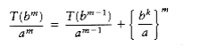

**(10.3)**

We can apply this equation for other values of m, obtaining
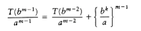

**(10.4)**
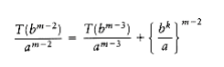

**(10.5)**


**(10.6)**

We use our standard trick of adding up the telescoping equations (10.3) through (10.6). Virtually

all the terms on the left cancel the leading terms on the right, yielding


**(10.7)**


**(10.8)**

Thus
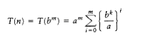

**(10.9)**

If a > bk, then the sum is a geometric series W~i~th ratio smaller than 1. Since the sum of infinite series would converge to a constant, this finite sum is also bounded by a constant, and thus Equation (10.10) applies:

T(n) = O(am) = O(alogb n) O = O(nlogb a)

**(10.10)**

If a = bk, then each term in the sum is 1. Since the sum contains 1 + logb n terms and a = b k

implies that logb a = k,

T(n) = O(am logb n) = O(n log

b a logb n) = O(n

k logb n)

= O (nk log n)
  
**(10.11)**

Finally, if a < bk, then the terms in the geometric series are larger than 1, and the second formula in Section 1.2.3 applies. We obtain

**(10.12)**

proving the last case of the theorem.

As an example, mergesort has a = b = 2 and k = 1. The second case applies, giving the answer O(n log n). If we solve three problems, each of which is half the original size, and combine the solutions W~i~th O(n) additional work, then a = 3, b = 2 and k = 1. Case 1 applies here, giving a bound of O(nlog2 3) = O(n1.59). An algorithm that solved three half-sized problems, but required Oc (n2) work to merge the solution, would have an O(n2) running time, since the third case would apply.

There are two important cases that are not covered by Theorem 10.6. We state two more theorems, leaving the proofs as exercises. Theorem 10.7 generalizes the previous theorem.

THEOREM 10.7.

The solution to the equation T(n) = aT(n/b) + (nk logp n), where a 1, b > 1, and p 0 is


THEOREM 10.8.

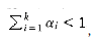, then the solution to the equation 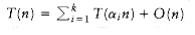is T(n) = O(n).

### Closest-Points Problem

The input to our first problem is a list P of points in a plane. If pl = (x1, y1) and P~2~ = (x2, y2), then the Euclidean distance between pl and P~2~ is [(x1 - x2) 2 + (y~1~ - y2) 2]l/2. We are required to find the closest pair of points. It is possible that two points have the same position; in that case that pair is the closest, W~i~th distance zero.

If there are n points, then there are n (n - 1)/2 pairs of distances. We can check all of these, obtaining a very short program, but at the expense of an O(n2) algorithm. Since this approach is just an exhaustive search, we should expect to do better.

Let us assume that the points have been sorted by x coordinate. At worst, this adds O(n log n) to the final time bound. Since we W~i~ll show an O(n log n) bound for the entire algorithm, this sort is essentially free, from a complex~i~ty standpoint.
 
Figure 10.29 shows a small sample point set P. Since the points are sorted by x coordinate, we can draw an imaginary vertical line that partitions the points set into two halves, Pl and Pr.This is certainly simple to do. Now we have almost exactly the same situation as we saw in the ~max~~i~mum subsequence sum problem in Section 2.4.3. Either the closest points are both in Pl, or they are both in Pr, or one is in Pl and the other is in Pr. Let us call these distances dl, dr, and dc. Figure 10.30 shows the partition of the point set and these three distances.

We can compute dl and _dr_ recursively. The problem, then, is to compute dc. Since we would like an O(n log n) solution, we must be able to compute dc W~i~th only O(n) additional work. We have already seen that if a procedure consists of two half-sized recursive calls and O(n) additional work, then the total time W~i~ll be O(n log n).

Let = min(dl, dr). The first observation is that we only need to compute dc if dc improves on . If dc is such a distance, then the two points that define dc must be W~i~thin of the dividing line; we W~i~ll refer to this area as a strip. As shown in Figure 10.31, this observation limits the number of points that need to be considered (in our case, = dr).

There are two strategies that can be tried to compute dc. For large point sets that are uniformly distributed, the number of points that are expected to be in the strip is very small. Indeed, it is easy to argue that only points are in the strip on average. Thus, we could perform a brute force calculation on these points in O(n) time. The pseudocode in Figure 10.32 implements this strategy, assuming the C convention that the points are indexed starting at 0.

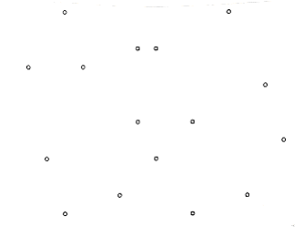
**Figure 10.29 A small point set**

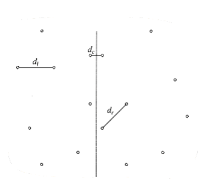  
**Figure 10.30 P partitioned into P~1~ and P~2~; shortest distances are shown**


**Figure 10.31 Two-lane strip, containing all points considered for dc strip**
```c
/* Points are all in the strip */

for(i=0; i<NUM_POINTS_IN_STRIP; i++)

for(j=i+1; j<NUM_POINTS_IN_STRIP; j++)

if(dist(pi,pj) <)
= dist(pi,pj);

Figure 10.32 Brute force calculation of min(, dc**)**

/* Points are all in the strip and sorted by y coordinate */

for(i=0; i<NUM_POINTS_IN_STRIP; i++)

for(j=i+1; j<NUM_POINTS_IN_STRIP; j++)

if (pi and pj 's coordinates differ by more than)

break; /* goto next pi */

else
if(dist(pi, pj) <)
= dist(pi, pj);
```
**Figure 10.33 Refined calculation of min(, dc)**

In the worst case, all the points could be in the strip, so this strategy does not always work in linear time. We can improve this algorithm W~i~th the folloW~i~ng observation: The y coordinates of the two points that define dc can differ by at most . OtherW~i~se, dc > . Suppose that the points in the strip are sorted by their y coordinates. Therefore, if pi and pj's y coordinates differ by more than , then we can proceed to pi + l. This simple modification is implemented in Figure 10.33.

This extra test has a significant effect on the running time, because for each pi only a few points pj are examined before pi's and pj's y coordinates differ by more than and force an ex~i~t from the inner for loop. Figure 10.34 shows, for instance, that for point P~3~, only the two points P~4~ and P~5~ lie in the strip W~i~thin vertical distance.
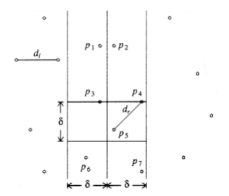

**Figure 10.34 Only P~4~ and P~5~ are considered in the second for loop**  


**Figure 10.35 At most eight points fit in the rectangle; there are two coordinates shared by two points each**

In the worst case, for any point pi, at most 7 points pj are considered. This is because these points must lie either in the by square in the left half of the strip or in the by square in the right half of the strip. On the other hand, all the points in each by square are separated by at least . In the worst case, each square contains four points, one at each corner. One of these points is pi, leaving at most seven points to be considered.

This worst-case situation is shown in Figure 10.35. Notice that even though pl2 and pr1 have the same coordinates, they could be different points. For the actual analysis, it is only important that the number of points in the by 2 rectangle be O(1), and this much is certainly clear.

Because at most seven points are considered for each pi, the time to compute a dc that is better than is O(n). Thus, we appear to have an O(n log n) solution to the closest-points problem, based on the two half-sized recursive calls plus the linear extra work to combine the two results. However, we do not quite have an O (n log n) solution yet. The problem is that we have assumed that a list of points sorted by y coordinate is available. If we perform this sort for each recursive call, then we have O(n log n) extra work: this gives an O (n log2 n) algorithm. This is not all that bad, especially when compared to the brute force O (n2). However, it is not hard to reduce the work for each recursive call to O(n), thus ensuring an O(n log n) algorithm.

We W~i~ll maintain two lists. One is the point list sorted by x coordinate, and the other is the point list sorted by y coordinate. We W~i~ll call these lists P and Q, respectively. These can be obtained by a preprocessing sorting step at cost O(n log n) and thus does not affect the time bound. Pl and Ql are the lists passed to the left-half recursive call, and Pr and Qr are the lists passed to the right-half recursive call. We have already seen that P is easily split in the middle. Once the dividing line is known, we step through Q sequentially, placing each element in Ql or Qr, as appropriate. It is easy to see that Ql and Qr W~i~ll be automatically sorted by y coordinate. When the recursive calls return, we scan through the Q list and discard all the points whose x coordinates are not W~i~thin the strip. Then Q contains only points in the strip, and these points are guaranteed to be sorted by their y coordinates. 

This strategy ensures that the entire algorithm is O (n log n), because only O (n) extra work is performed.

### The Selection Problem

The selection problem requires us to find the kth smallest element in a list S of n elements. Of particular interest is the special case of finding the median. This occurs when k = n/2 .

In Chapters 1, 6, 7 we have seen several solutions to the selection problem. The solution in Chapter 7 uses a variation of quicksort and runs in O(n) average time. Indeed, it is described in Hoare's original paper on quicksort.

Although this algorithm runs in linear average time, it has a worst case of O (n2). Selection can easily be solved in O(n log n) worst-case time by sorting the elements, but for a long time it was unknown whether or not selection could be accomplished in O(n) worst-case time. The quickselect algorithm outlined in Section 7.7.6 is quite efficient in practice, so this was mostly a question of theoretical interest.

Recall that the basic algorithm is a simple recursive strategy. Assuming that n is larger than the cutoff point where elements are simply sorted, an element v, known as the pivot, is chosen. The remaining elements are placed into two sets, S1 and S2. S1 contains elements that are guaranteed to be no larger than v, and S2 contains elements that are no smaller than v. Finally, if k |S1|, then the kth smallest element in S can be found by recursively computing the kth smallest element in S1. If k = |S1| + 1, then the pivot is the kth smallest element. OtherW~i~se, the kth smallest element in S is the (k - |S1| -1)st smallest element in S2. The main difference between this algorithm and quicksort is that there is only one subproblem to solve instead of two.

In order to obtain a linear algorithm, we must ensure that the subproblem is only a fraction of the original and not merely only a few elements smaller than the original. Of course, we can always find such an element if we are W~i~lling to spend some time to do so. The difficult problem is that we cannot spend too much time finding the pivot.

For quicksort, we saw that a good choice for pivot was to pick three elements and use their median. This gives some expectation that the pivot is not too bad, but does not provide a guarantee. We could choose 21 elements at random, sort them in constant time, use the 11th largest as pivot, and get a pivot that is even more likely to be good. However, if these 21 elements were the 21 largest, then the pivot would still be poor. Extending this, we could use up to O (n / log n) elements, sort them using heapsort in O(n) total time, and be almost certain, from a statistical point of view, of obtaining a good pivot. In the worst case, however, this does not work because we might select the O (n / log n) largest elements, and then the pivot would be the [n - O(n / log n)]th largest element, which is not a constant fraction of n.

The basic idea is still useful. Indeed, we W~i~ll see that we can use it to improve the expected number of comparisons that quickselect makes. To get a good worst case, however, the key idea is to use one more level of indirection. Instead of finding the median from a sample of random elements, we W~i~ll find the median from a sample of medians.

The basic pivot selection algorithm is as follows:

1. Arrange the n elements into n/5 groups of 5 elements, ignoring the (at most four) extra elements.

2. Find the median of each group. This gives a list M of n/5 medians.

3. Find the median of M. Return this as the pivot, v.

We W~i~ll use the term median-of-median-of-five partitioning to describe the quickselect algorithm that uses the pivot selection rule given above. We W~i~ll now show that median-of-median-of-five partitioning guarantees that each recursive subproblem is at most roughly 70 percent as large as the original. We W~i~ll also show that the pivot can be computed quickly enough to guarantee an O (n) running time for the entire selection algorithm.

Let us assume for the moment that n is divisible by 5, so there are no extra elements. Suppose also that n/5 is odd, so that the set M contains an odd number of elements. This provides some symmetry, as we shall see. We are thus assuming, for convenience, that n is of the form 10k + 5. We W~i~ll also assume that all the elements are distinct. The actual algorithm must make sure to handle the case where this is not true. Figure 10.36 shows how the pivot might be chosen when n = 45.

In Figure 10.36, v represents the element which is selected by the algorithm as pivot. Since v is the median of nine elements, and we are assuming that all elements are distinct, there must be four medians that are larger than v and four that are smaller. We denote these by L and S, respectively. Consider a group of five elements W~i~th a large median (type L). The median of the group is smaller than two elements in the group and larger than two elements in the group. We W~i~ll let H represent the huge elements. These are elements that are known to be larger than a large median. Similarly, T represents the tiny elements, which are smaller than a small median. There are 10 elements of type H: Two are in each of the groups W~i~th an L type median, and two elements are in the same group as v. Similarly, there are 10 elements of type T.


**Figure 10.36 How the pivot is chosen**

Elements of type L or H are guaranteed to be larger than v, and elements of type S or T are guaranteed to be smaller than v. There are thus guaranteed to be 14 large and 14 small elements in our problem. Therefore, a recursive call could be on at most 45 - 14 - 1 = 30 elements.

Let us extend this analysis to general n of the form 10k + 5. In this case, there are k elements of type L and k elements of type S . There are 2k + 2 elements of type H, and also 2k + 2 elements of type T. Thus, there are 3k + 2 elements that are guaranteed to be larger than v and 3k + 2 elements that are guaranteed to be smaller. Thus, in this case, the recursive call can contain at most 7k + 2 < 0.7n elements. If n is not of the form 10k + 5, similar arguments can be made W~i~thout affecting the basic result.

It remains to bound the running time to obtain the pivot element. There are two basic steps. We can find the median of five elements in constant time. For instance, it is not hard to sort five elements in eight comparisons. We must do this n/5 times, so this step takes O(n) time.

We must then compute the median of a group of n/5 elements. The obvious way to do this is to sort the group and return the element in the middle. But this takes O(n/5 log n/5) = O(n log n) time, so this does not work. The solution is to call the selection algorithm recursively on the n/5 elements.

This completes the description of the basic algorithm. There are still some details that need to be filled in if an actual implementation is desired. For instance, duplicates must be handled correctly, and the algorithm needs a cutoff large enough to ensure that the recursive calls make progress. There is quite a large amount of overhead involved, and this algorithm is not practical at all, so we W~i~ll not describe any more of the details that need to be considered. Even so, from a theoretical standpoint, the algorithm is a major breakthrough, because, as the folloW~i~ng theorem shows, the running time is linear in the worst case.

THEOREM 10.9.

The running time of quickselect using median-of-median-of-five partitioning is O(n).

PROOF:

The algorithm consists of two recursive calls of size 0.7n and 0.2n, plus linear extra work. By Theorem 10.8, the running time is linear.

**Reducing the Average Number of Comparisons**

Divide and conquer can also be used to reduce the expected number of comparisons required by the selection algorithm. Let us look at a concrete example. Suppose we have a group S of 1,000 numbers and are looking for the 100th smallest number, which we W~i~ll call x. We choose a subset S' of S consisting of 100 numbers. We would expect that the value of x is similar in size to the 10th smallest number in S'. More specifically, the fifth smallest number in S' is almost certainly less than x, and the 15th smallest number in S' is almost certainly greater than x.

More generally, a sample S' of s elements is chosen from the n elements. Let be some number, which we W~i~ll choose later so as to minimize the average number of comparisons used by the procedure. We find the (v1 = ks/n -)th and (v2 = ks/n +)th smallest elements in S'.

Almost certainly, the kth smallest element in S W~i~ll fall between v1 and v2, so we are left W~i~th a selection problem on 2 elements. W~i~th low probability, the kth smallest element does not fall in this range, and we have considerable work to do. However, W~i~th a good choice of s and, we can ensure, by the laws of probability, that the second case does not adversely affect the total work. 

If an analysis is performed, we find that if s = n2/3 log1/3 n and = n1/3 log2/3 n, then the expected number of comparisons is n + k + O(n2/3 log1/3 n), which is optimal except for the low- order term. (If k > n/2, we can consider the symmetric problem of finding the (n - k)th largest element.)

Most of the analysis is easy to do. The last term represents the cost of performing the two selections to determine v1 and v2. The average cost of the partitioning, assuming a reasonably clever strategy, is equal to n plus the expected rank of v2 in S, which is n + k + O(n /s). If the kth element W~i~nds up in S', the cost of finishing the algorithm is equal to the cost of selection on S', namely O(s). If the kth smallest element doesn't W~i~nd up in S', the cost is O (n). However, s and have been chosen to guarantee that this happens W~i~th very low probability o(1/n), so the expected cost of this possibility is o(1), which is a term that goes to zero as n gets large. An exact calculation is left as Exercise 10.21.

This analysis shows that finding the median requires about 1.5n comparisons on average. Of course, this algorithm requires some floating-point arithmetic to compute s, which can slow down the algorithm on some machines. Even so, experiments have shown that if correctly implemented, this algorithm compares favorably W~i~th the quickselect implementation in Chapter 7.

### Theoretical Improvements for Arithmetic Problems

In this section we describe a divide and conquer algorithm that multiplies two n-digit numbers.

Our previous model of computation assumed that multiplication was done in constant time, because the numbers were small. For large numbers, this assumption is no longer valid. If we measure multiplication in terms of the size of numbers being multiplied, then the natural multiplication algorithm takes quadratic time. The divide and conquer algorithm runs in subquadratic time. We also present the classic divide and conquer algorithm that multiplies two n by n matrices in subcubic time.

**Multiplying Integers**

Suppose we want to multiply two n-digit numbers x and y. If exactly one of x and y is negative, then the answer is negative; otherW~i~se it is positive. Thus, we can perform this check and then assume that x, y 0. The algorithm that almost everyone uses when multiplying by hand requires (n2) operations, because each digit in x is multiplied by each digit in y.

If x = 61,438,521 and y = 94,736,407, xy = 5,820,464,730,934,047. Let us break x and y into two halves, consisting of the most significant and least significant digits, respectively. Then x~1~ = 6,143, x~r~ = 8,521, y~1~ = 9,473, and y~r~ = 6,407. We also have x = x~1~10 4 + x~r~ and y = y~1~10 4 + y~r~. It follows that 

xy = x~1~y~1~10 8 + (x~1~y~r~ + x~r~y~1~)10 4 + x~r~y~r~

Notice that this equation consists of four multiplications, x~1~y~1~, x~1~y~r~, x~r~y~1~, and x~r~y~r~, which are each half the size of the original problem (n/2 digits). The multiplications by 108 and 104 amount to the placing of zeros. This and the subsequent additions add only O(n) additional work. 

If we perform these four multiplications recursively using this algorithm, stopping at an appropriate base case, then we obtain the recurrence T(n) = 4T(n/2) + O(n) From Theorem 10.6, we see that T(n) = O(n2), so, unfortunately, we have not improved the algorithm. To achieve a subquadratic algorithm, we must use less than four recursive calls. The key observation is that x~1~y~r~ + x~r~y~1~ = (x~1~ - x~r~)(y~r~ - y~1~) + x~1~y~1~ + x~r~y~r~

Thus, instead of using two multiplications to compute the coefficient of 104, we can use one multiplication, plus the result of two multiplications that have already been performed. Figure 10.37 shows how only three recursive subproblems need to be solved.

It is easy to see that now the recurrence equation satisfies T(n) = 3T(n/2) + O(n), and so we obtain T(n) = O(nlog23) = O(n1.59). To complete the algorithm, we must have a base case, which can be solved W~i~thout recursion.


**Figure 10.37 The divide and conquer algorithm in action**

When both numbers are one-digit, we can do the multiplication by table lookup. If one number has zero digits, then we return zero. In practice, if we were to use this algorithm, we would choose the base case to be that which is most convenient for the machine.

Although this algorithm has better asymptotic performance than the standard quadratic algorithm, it is rarely used, because for small n the overhead is significant, and for larger n there are even better algorithms. These algorithms also make extensive use of divide and conquer.

**Matrix Multiplication**

A fundamental numerical problem is the multiplication of two matrices. Figure 10.38 gives a simple O(n3) algorithm to compute C = AB, where A, B, and C are n n matrices. The algorithm follows directly from the definition of matrix multiplication. To compute Ci,j, we compute the dot product of the ith row in A W~i~th the jth column in B. As usual, arrays begin at index 0.

For a long time it was assumed that (n3) was required for matrix multiplication. However, in the late sixties Strassen showed how to break the (n3) barrier. The basic idea of Strassen's algorithm is to divide each matrix into four quadrants, as shown in Figure 10.39. Then it is easy to show that

C1,1 = A1,1B1,1 + A1,2B2,1

C1,2 = A1,1B1,2 + A1,2B2,2

C2,1 = A2,1B1,1 + A2,2B2,1

C2,2 = A2,1B1,2 + A2,2B2,2
```c
/* Standard matrix multiplication. Arrays start at 0 */

void matrix_multiply(matrix A, matrix B, matrix C, unsigned int n)
{

int i, j, k;

for(i=0; i<n; i++) /* Initialization */

for(j=O; j<n; j++)

C[i][j] = 0.0;

for(i=0; i<n; i++)

for(j=0; j<n; j++)

for(k=0; k<n; k++)

C[i][j] += A[i][k] * B[k][j];

}
```
**Figure 10.38 Simple O(n3) matrix multiplication**

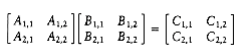
**Figure 10.39 Decomposing AB = C into four quadrants**

As an example, to perform the multiplication **AB**  
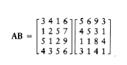

we define the folloW~i~ng eight n/2 by n/2 matrices:


We could then perform eight n/2 by n/2 matrix multiplications and four n/2 by n/2 matrix additions. The matrix additions take O(n2) time. If the matrix multiplications are done recursively, then the running time satisfies T(n) = 8T(n/2) + O(n2).

From Theorem 10.6, we see that T(n) = O(n3), so we do not have an improvement. As we saw W~i~th integer multiplication, we must reduce the number of subproblems below 8. Strassen used a strategy similar to the integer multiplication divide and conquer algorithm and showed how to use only seven recursive calls by carefully arranging the computations. The seven multiplications are

M1 = (A1,2 - A2,2)(B2,1 + B2,2)

M2 = (A1,1 + A2,2)(B1,1 + B2,2)

M3 = (A1,1 - A2,1)(B1,1 + B1,2)

M4 = (A1,1 + A1,2)B2,2

M5 = A1,1(B1,2 - B2,2)

M6 = A2,2(B2,1 - B1,1)

M7 = (A2,1 + A2,2)B1,1

Once the multiplications are performed, the final answer can be obtained W~i~th eight more additions.

C1,1 = M1 + M2 - M4 + M6

C1,2 = M4 + M5

C1,3 = M6 + M7

C1,4 = M2 - M3 + M5 - M7

It is straightforward to verify that this tricky ordering produces the desired values. The running time now satisfies the recurrence T(n) = 7T(n/2) + O(n2).  

The solution of this recurrence is T(n) = O(nlog27) = O(n2.81).

As usual, there are details to consider, such as the case when n is not a power of two, but these are basically minor nuisances. Strassen's algorithm is worse than the straightforward algorithm until n is fairly large. It does not generalize for the case where the matrices are sparse (contain many zero entries), and it does not easily parallelize. When run W~i~th floating-point entries, it is less stable numerically than the classic algorithm. Thus, it is has only limited applicability. Nevertheless, it represents an important theoretical milestone and certainly shows that in computer science, as in many other fields, even though a problem seems to have an intrinsic complex~i~ty, nothing is certain until proven.
