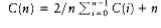
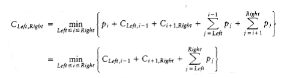
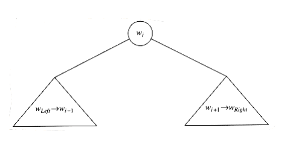

## Dynamic Programming

In the previous section, we have seen that a problem that can be mathematically expressed recursively can also be expressed as a recursive algorithm, in many cases yielding a significant performance improvement over a more naïve exhaustive search.

Any recursive mathematical formula could be directly translated to a recursive algorithm, but the underlying reality is that often the compiler W~i~ll not do justice to the recursive algorithm, and an inefficient program results. When we suspect that this is likely to be the case, we must provide a little more help to the compiler, by rewriting the recursive algorithm as a nonrecursive algorithm that systematically records the answers to the subproblems in a table. One technique that makes use of this approach is known as dynamic programming.

### Using a Table Instead of Recursion

In Chapter 2, we saw that the natural recursive program to compute the Fibonacci numbers is very inefficient. Recall that the program shown in Figure 10.40 has a running time T(n) that satisfies T(n) T(n - 1) + T(n - 2). Since T(n) satisfies the same recurrence relation as the Fibonacci numbers and has the same initial conditions, T(n) in fact grows at the same rate as the Fibonacci numbers, and is thus exponential.

On the other hand, since to compute Fn, all that is needed is Fn-1 and Fn-2, we only need to record the two most recently computed Fibonacci numbers. This yields the O(n) algorithm in Figure 10.41

The reason that the recursive algorithm is so slow is because of the algorithm used to simulate recursion. To compute Fn, there is one call to Fn-1 and Fn-2. However, since Fn-1 recursively makes a call to Fn-2 and Fn-3, there are actually two separate calls to compute Fn-2. If one traces out the entire algorithm, then we can see that Fn-3 is computed three times, Fn-4 is computed five times, Fn-5 is computed eight times, and so on. As Figure 10.42 shows, the growth of redundant calculations is explosive. If the compiler's recursion simulation algorithm were able to keep a list of all precomputed values and not make a recursive call for an already solved subproblem, then this exponential explosion would be avoided. This is why the program in Figure 10.41 is so much more efficient. calculations is explosive. If the compiler's recursion simulation algorithm were able to keep a list of all precomputed values and not make a recursive call for an already solved subproblem, then this exponential explosion would be avoided. This is why the program in Figure 10.41 is so much more efficient.

```c
/* Compute Fibonacci numbers as described in Chapter 1 */

unsigned int fib(unsigned int n)
{

if(n <= 1)
return 1;

else
return(fib(n-1) + fib(n-2));

}

**Figure 10.40 Inefficient algorithm to compute Fibonacci numbers**

unsigned int

fibonacci(unsigned int n)
{

unsigned int i, last, next_to_last, answer;

if(n <= 1)
return 1;

last = next_to_last = 1;

for(i = 2; i <= n; i++)
{

answer = last + next_to_last;

next_to_last = last;

last = answer;

}

return answer;

}
```
**Figure 10.41 Linear algorithm to compute Fibonacci numbers**


**Figure 10.42 Trace of the recursive calculation of Fibonacci numbers**
```c
double eval(unsigned int n)
{

int i;

double sum;

if(n == 0)
return 1.0;

else{

sum = 0.0;

for(i=0; i<n; i++)

sum += eval(i);

return(2.0 * sum / n + n);

}

}
```
**Figure 10.43 Recursive program to evaluate** 

As a second example, we saw in Chapter 7 how to solve the recurrence 

W~i~th C(0) = 1. Suppose that we want to check, numerically, whether the solution we obtained is correct. We could then write the simple program in Figure 10.43 to evaluate the recursion.

Once again, the recursive calls duplicate work. In this case, the running time T(n) satisfies because, as shown in Figure 10.44, there is one (direct) recursive call of each size from 0 to n -1, plus O(n) additional work (where else have we seen the tree shown in Figure 10.44?). Solving for T(n), we find that it grows exponentially. By using a table, we obtain the program in Figure 10.45. This program avoids the redundant recursive calls and runs in O(n2). It is not a perfect program; as an exercise, you should make the simple change that reduces its running time to O(n).


**Figure 10.44 Trace of the recursive calculation in eval**
```c
double

eval(unsigned int n)
{

int i,j;

double sum, answer;

double *c;

c = (double*) malloc(sizeof (double)*(n+1));

if(c == NULL)
fatal_error("Out of space!!!");

c[0] = 1.0;

for(i=1; i<=n; i++) /* Evaluate Ci, 1 i n */
{

sum = 0.0;

/* i-1 */

for(j=0; j<i; j++) /* Evaluate Cj */

/* j=0 */

sum += c[j];

c[i] = 2.0 * sum/i + i;

}

answer = c[n];

free(c);

return answer;

}
```
**Figure 10.45 Evaluating** **W~i~th a table**

### Ordering Matrix Multiplications

Suppose we are given four matrices,**A, B, C,**and **D**, of dimensions **A**= 50 X 10, **B** = 10 X 40, **C** = 40 X 30, and **D** = 30 X 5. Although matrix multiplication is not commutative, it is associative, which means that the matrix product **ABCD** can be parenthesized, and thus evaluated, in any order. The obvious way to multiply two matrices of dimensions p X _q_ and q X r, respectively, uses pqr scalar multiplications. (Using a theoretically superior algorithm such as Strassen''s algorithm does not significantly alter the problem we W~i~ll consider, so we W~i~ll assume this performance bound.) What is the best way to perform the three matrix multiplications required to compute ABCD?

In the case of four matrices, it is simple to solve the problem by exhaustive search, since there are only five ways to order the multiplications. We evaluate each case below:  

(A((BC)D)): Evaluating BC requires 10 X 40 X 30 = 12,000 multiplications. Evaluating (BC)D requires the 12,000 multiplications to compute BC, plus an additional 10 X 30 X 5 = 1,500 multiplications, for a total of 13,500. Evaluating (A((BC)D) requires 13,500 multiplications for (BC)D, plus an additional 50 X 10 X 5 = 2,500 multiplications, for a grand total of 16,000 multiplications.

(A(B(CD))): Evaluating CD requires 40 X 30 X 5 = 6,000 multiplications. Evaluating B(CD) requires 6,000 multiplications to compute CD, plus an additional 10 X 40 X 5 = 2,000 multiplications, for a total of 8,000. Evaluating (A(B(CD)) requires 8,000 multiplications for B (CD), plus an additional 50 X 10 X 5 = 2,500 multiplications, for a grand total of 10,500 multiplications.

((AB)(CD)): Evaluating CD requires 40 X 30 X 5 = 6,000 multiplications. Evaluating AB requires 50 X 10 X 40 = 20,000 multiplications. Evaluating ((AB)(CD)) requires 6,000 multiplications for CD, 20,000 multiplications for AB, plus an additional 50 X 40 X 5 = 10,000 multiplications for a grand total of 36,000 multiplications.

(((AB)C)D): Evaluating AB requires 50 X 10 X 40 = 20,000 multiplications. Evaluating (AB)C requires the 20,000 multiplications to compute AB, plus an additional 50 X 40 X 30 = 60,000 multiplications, for a total of 80,000. Evaluating (((AB)C)D) requires 80,000 multiplications for (AB)C, plus an additional 50 X 30 X 5 = 7,500 multiplications, for a grand total of 87,500 multiplications.

((A(BC))D): Evaluating BC requires 10 X 40 X 30 = 12,000 multiplications. Evaluating A(BC) requires the 12,000 multiplications to compute BC, plus an additional 50 X 10 X 30 = 15,000 multiplications, for a total of 27,000. Evaluating ((A(BC))D) requires 27,000 multiplications for A(BC), plus an additional 50 X 30 X 5 = 7,500 multiplications, for a grand total of 34,500 multiplications.

The calculations show that the best ordering uses roughly one-ninth the number of multiplications as the worst ordering. Thus, it might be worthwhile to perform a few calculations to determine the optimal ordering. Unfortunately, none of the obvious greedy strategies seems to work. Moreover, the number of possible orderings grows quickly. Suppose we define T(n) to be this number. Then T(1) = T(2) = 1, T(3) = 2, and T(4) = 5, as we have seen. In general, To see this, suppose that the matrices are A1, A2, . . . , An, and the last multiplication performed is (A1A2. . . Ai)(Ai+1Ai+2 . . . An). Then there are T(i) ways to compute (A1A2 Ai) and T(n - i) ways to compute (Ai+1Ai+2 An). Thus, there are T(i)T(n - i) ways to compute (A1A2 Ai) (Ai+1Ai+2 An) for each possible i.

The solution of this recurrence is the well-known Catalan numbers, which grow exponentially.

Thus, for large n, an exhaustive search through all possible orderings is useless. Nevertheless, this counting argument provides a basis for a solution that is substantially better than exponential. Let ci be the number of columns in matrix Ai for 1 i n. Then Ai has ci-1 rows, since otherW~i~se the multiplications are not valid. We W~i~ll define c0 to be the number of rows in the first matrix, A1.

Suppose m~Left~,Right is the number of multiplications required to multiply A~Left~A~Left~+1 A~Right~-1A~Right~. For consistency, m~Left~,Left = 0. Suppose the last multiplication is (A~Left~...Ai)(Ai+1 A~Right~), where Left i Right. Then the number of multiplications used is m~Left~,i + mi+1,Right + C~Left~-1cicRight. These three terms represent the multiplications required to compute (A~Left~ Ai),(Ai+1 A~Right~), and their product, respectively.

If we define m~Left~,Right to be the number of multiplications required in an optimal ordering, then, if Left < Right, This equation implies that if we have an optimal multiplication arrangement of A~Left~ A~Right~, the subproblems A~Left~ Ai and Ai+1 A~Right~ cannot be performed suboptimally. This should be clear, since otherW~i~se we could improve the entire result by replacing the suboptimal computation by an optimal computation.

The formula translates directly to a recursive program, but, as we have seen in the last section, such a program would be blatantly inefficient. However, since there are only approx~i~mately n2/2 values of m~Left~,Right that ever need to be computed, it is clear that a table can be used to store these values. Further examination shows that if Right - Left = k, then the only values Mx,y that are needed in the computation of m~Left~,Right satisfy y - x < k. This tells us the order in which we need to compute the table.

If we want to print out the actual ordering of the multiplications in addition to the final answer M1,n, then we can use the ideas from the shortest-path algorithms in Chapter 9. Whenever we make a change to m~Left~,Right, we record the value of i that is responsible. This gives the simple program shown in Figure 10.46.

Although the emphasis of this chapter is not coding, it is worth noting that many programmers tend to shorten variable names to a single letter. c, i, and k are used as single-letter variables because this agrees W~i~th the names we have used in the description of the algorithm, which is very mathematical. However, it is generally best to avoid l as a variable name, because "l" looks too much like 1 and can make for very difficult debugging if you make a transcription error.

Returning to the algorithmic issues, this program contains a triply nested loop and is easily seen to run in O(n3) time. The references describe a faster algorithm, but since the time to perform the actual matrix multiplication is still likely to be much larger than the time to compute the optimal ordering, this algorithm is still quite practical.
```c
/* Compute optimal ordering of matrix multiplication */
 
/* c contains number of columns for each of the n matrices */

/* c[0] is the number of rows in matrix 1 */

/* Minimum number of multiplications is left in M[1][n] */

/* Actual ordering can be computed via */

/* another procedure using last_change */

/* M and last_change are indexed starting at 1, instead of zero */

void opt_matrix(int c[], unsigned int n, two_d_array M,

two_d_array last_change)
{

int i, k, Left, Right, this_M;

for(Left = 1; Left <= n; Left++)

M[Left][Left] = 0;

for(k = 1; k < n; k++) /* k is Right-Left */

for(Left = 1; Left <= n-k; Left++)
{ /* for each position */

Right = Left + k;

M[Left][Right] = INT_~max~;

for(i = Left; i < Right; i++)
{

this_M = M[Left][i] + M[i+1][Right]

+ c[Left-1] * c[i] * c[Right];

if(this_M < M[Left][Right]) /* Update min */
{

M[Left][Right] = this_M;

last_change[Left][Right] = i;

}

}

}

}
```
**Figure 10.46 Program to find optimal ordering of Matrix Multiplications**

### Optimal Binary Search Tree
  
Our second dynamic programming example considers the folloW~i~ng input: We are given a list of words, w1, w2,..., wn, and fixed probabilities P~1~, P~2~, . . . , pn of their occurrence. The problem is to arrange these words in a binary search tree in a way that minimizes the expected total access time. In a binary search tree, the number of comparisons needed to access an element at depth d is d + 1, so if W~i~ is placed at depth di, then we want to minimize .

As an example, Figure 10.47 shows seven words along W~i~th their probability of occurrence in some context. Figure 10.48 shows three possible binary search trees. Their searching costs are shown in Figure 10.49.

The first tree was formed using a greedy strategy. The word W~i~th the highest probability of being accessed was placed at the root. The left and right subtrees were then formed recursively. The second tree is the perfectly balanced search tree. Neither of these trees is optimal, as demonstrated by the ex~i~stence of the third tree. From this we can see that neither of the obvious solutions works.

This is initially surprising, since the problem appears to be very similar to the construction of a Huffman encoding tree, which, as we have already seen, can be solved by a greedy algorithm. Construction of an optimal binary search tree is harder, because the data is not constrained to appear only at the leaves, and also because the tree must satisfy the binary search tree property.

A dynamic programming solution follows from two observations. Once again, suppose we are trying to place the (sorted) words w~Left~, w~Left~+1, . . . , w~Right~-1, w~Right~ into a binary search tree.

Suppose the optimal binary search tree has W~i~ as the root, where Left i Right. Then the left subtree must contain w~Left~, . . . ,W~i~-1, and the right subtree must contain W~i~+1 . . . ,w~Right~ (by the binary search tree property). Further, both of these subtrees must also be optimal, since otherW~i~se they could be replaced by optimal subtrees, which would give a better solution for w~Left~ . . . , w~Right~. Thus, we can write a formula for the cost C~Left~,Right of an optimal binary search tree. Figure 10.50 may be helpful.

If Left > Right, then the cost of the tree is 0; this is the NULL case, which we always have for binary search trees. OtherW~i~se, the root costs pi. The left subtree has a cost of C~Left~,i-1, relative to its root, and the right subtree has a cost of Ci+l,Right relative to its root. As Figure 10.50 shows, each node in these subtrees is one level deeper from W~i~ than from their respective roots, so we must add . This gives the formula



From this equation, it is straightforward to write a program to compute the cost of the optimal binary search tree. As usual, the actual search tree can be maintained by saving the value of i that minimizes C~Left~,Right. The standard recursive routine can be used to print the actual tree.

Word Probability

-----------------

a 0.22

am 0.18

and 0.20

egg 0.05

if 0.25

the 0.02

two 0.08

**Figure 10.47 Sample input for optimal binary search tree problem**


**Figure 10.48 Three possible binary search trees for data in previous table**

Input Tree #1 Tree #2 Tree #3

------------------------------------------

Word Probability Access Cost Access Cost Access Cost

W~i~ pi Once Sequence Once Sequence Once Sequence

------------------------------------------

a 0.22 2 0.44 3 0.66 2 0.44

am 0.18 4 0.72 2 0.36 3 0.54

and 0.20 3 0.60 3 0.60 1 0.20

egg 0.05 4 0.20 1 0.05 3 0.15

if 0.25 1 0.25 3 0.75 2 0.50

the 0.02 3 0.06 2 0.04 4 0.08

two 0.08 2 0.16 3 0.24 3 0.24

------------------------------------------

Totals 1.00 2.43 2.70 2.15

**Figure 10.49 Comparison of the three binary search trees**


**Figure 10.50 Structure of an optimal binary search tree**

Figure 10.51 shows the table that W~i~ll be produced by the algorithm. For each subrange of words, the cost and root of the optimal binary search tree are maintained. The bottommost entry, of course, computes the optimal binary search tree for the entire set of words in the input. The optimal tree is the third tree shown in Fig. 10.48.

The precise computation for the optimal binary search tree for a particular subrange, namely am..if, is shown in Figure 10.52. It is obtained by computing the minimum-cost tree obtained by placing am, and, egg, and if at the root. For instance, when and is placed at the root, the left subtree contains am..am (of cost 0.18, via previous calculation), the right subtree contains

egg..if (of cost 0.35), and , for a total cost of 1.21.


**Figure 10.51 Computation of the optimal binary search tree for sample input**


**Figure 10.52 Computation of table entry (1.21, and) for am..if**

The running time of this algorithm is O(n3), because when it is implemented, we obtain a triple loop. An O(n2) algorithm for the problem is sketched in the exercises.

### All-Pairs Shortest Path

Our third and final dynamic programming application is an algorithm to compute shortest weighted paths between every pair of points in a directed graph G = (V, E). In Chapter 9, we saw an algorithm for the single-source shortest-path problem, which finds the shortest path from some arbitrary vertex s to all others. That algorithm (Dijkstra's) runs in O(V 2) time on dense graphs, but substantially faster on sparse graphs. We W~i~ll give a short algorithm to solve the all-pairs problem for dense graphs. The running time of the algorithm is O(V 3), which is not an asymptotic improvement over V iterations of Dijkstra's algorithm but could be faster on a very dense graph, because its loops are tighter. The algorithm also performs correctly if there are negative edge costs, but no negative-cost cycles; Dijkstra's algorithm fails in this case.

Let us recall the important details of Dijkstra's algorithm (the reader may W~i~sh to review Section 9.3). Dijkstra's algorithm starts at a vertex s and works in stages. Each vertex in the graph is eventually selected as an intermediate vertex. If the current selected vertex is v, then for each w V, we set dw = min(dw, dv + cv,w). This formula says that the best distance to w (from s) is either the previously known distance to w from s, or the result of going from s to v (optimally) and then directly from v to w.

Dijkstra's algorithm provides the idea for the dynamic programming algorithm: we select the vertices in sequential order. We W~i~ll define Dk,i,j to be the weight of the shortest path from vi to vj that uses only v1, v2, . . . ,vk as intermediates. By this definition, D0,i,j = ci,j, where ci,j is if (vi, vj) is not an edge in the graph. Also, by definition, D|V|,i,j is the  shortest path from v_i_ to v_j_ in the graph.
```c
/* Compute All-Shortest Paths */

/* A[] contains the adjacency matrix */

/* W~i~th A[i][i] presumed to be zero */

/* D[] contains the values of shortest path */

/* |V | is the number of vertices */

/* A negative cycle ex~i~sts iff */

/* d[i][j] is set to a negative value at line 9 */

/* Actual Path can be computed via another procedure using path */

/* All arrays are indexed starting at 0 */

void all_pairs(two_d_array A, two_d_array D, two_d_array path)
{

int i, j, k;

/*1*/ for(i = 0; i < |V |; i++) /* Initialize D and path */

/*2*/ for(j = 0; j < |V |; j++)
{

/*3*/ D[i][j] = A[i][j];

/*4*/ path[i][j] = NOT_A_VERTEX;

}

/*5*/ for(k = 0; k < |v |; k++)

/* Consider each vertex as an intermediate */

/*6*/ for(i = 0; i < |V |; i++)

/*7*/ for(j = 0; j < |V |; j++)

/*8*/ if(d[i][k] + d[k][j] < d[i][j])
/*update min */
{

/*9*/ d[i][j] = d[i][k] + d[k][j];

/*10*/ path[i][j] = k;

}

}
```
**Figure 10.53 All-pairs shortest path** 

As Figure 10.53 shows, when k > 0 we can write a simple formula for Dk,i,j. The shortest path from vi to vj that uses only v1, v2, . . . ,vk as intermediates is the shortest path that either does not use vk as an intermediate at all, or consists of the merging of the two paths vi vk and vk vj, each of which uses only the first k - 1 vertices as intermediates. This leads to the formula Dk,i,j = min{Dk - 1,i,j, Dk - 1,i,k + Dk - 1,k,j}

The time requirement is once again O(|V|3). Unlike the two previous dynamic programming examples, this time bound has not been substantially lowered by another approach. Because the kth stage depends only on the (k - 1)st stage, it appears that only two |V| X |V| matrices need to be maintained.

However, using k as an intermediate vertex on a path that starts or finishes W~i~th k does not improve the result unless there is a negative cycle. Thus, only one matrix is necessary, because Dk-1,i,k = Dk,i,k and Dk-1,k,j = Dk,k,j, which implies that none of the terms on the right change values and need to be saved. This observation leads to the simple program in Figure 10.53, which numbers vertices starting at zero to conform W~i~th C's conventions.

On a complete graph, where every pair of vertices is connected (in both directions), this algorithm is almost certain to be faster than |V| iterations of Dijkstra's algorithm, because the loops are so tight. Lines 1 through 4 can be executed in parallel, as can lines 6 through 10. Thus, this algorithm seems to be well-suited for parallel computation.

Dynamic programming is a powerful algorithm design technique, which provides a starting point for a solution. It is essentially the divide and conquer paradigm of solving simpler problems first, W~i~th the important difference being that the simpler problems are not a clear division of the original. Because subproblems are repeatedly solved, it is important to record their solutions in a table rather than recompute them. In some cases, the solution can be improved (although it is certainly not always obvious and frequently difficult), and in other cases, the dynamic programming technique is the best approach known.

In some sense, if you have seen one dynamic programming problem, you have seen them all. More examples of dynamic programming can be found in the exercises and references.
