## Greedy Algorithms

The first type of algorithm we W~i~ll examine is the greedy algorithm. We have already seen three greedy algorithms in Chapter 9: Dijkstra's, Prim's, and Kruskal's algorithms. Greedy algorithms work in phases. In each phase, a decision is made that appears to be good, W~i~thout regard for future consequences. Generally, this means that some local optimum is chosen. This "take what you can get now" strategy is the source of the name for this class of algorithms. When the algorithm terminates, we hope that the local optimum is equal to the global optimum. If this is the case, then the algorithm is correct; otherW~i~se, the algorithm has produced a suboptimal solution. If the absolute best answer is not required, then simple greedy algorithms are sometimes used to generate approx~i~mate answers, rather than using the more complicated algorithms generally required to generate an exact answer.

There are several real-life examples of greedy algorithms. The most obvious is the coin-changing problem. To make change in U.S. currency, we repeatedly dispense the largest denomination. Thus, to give out seventeen dollars and sixty- one cents in change, we give out a ten-dollar bill, a five-dollar bill, two one- dollar bills, two quarters, one dime, and one penny. By doing this, we are guaranteed to minimize the number of bills and coins. This algorithm does not work in all monetary systems, but fortunately, we can prove that it does work in the American monetary system. Indeed, it works even if two-dollar bills and fifty-cent pieces are allowed.

Traffic problems provide an example where making locally optimal choices does not always work. For example, during certain rush hour times in Miami, it is best to stay off the prime streets even if they look empty, because traffic W~i~ll come to a standstill a mile down the road, and you W~i~ll be stuck. Even more shocking, it is better in some cases to make a temporary detour in the direction opposite your destination in order to avoid all traffic bottlenecks.

In the remainder of this section, we W~i~ll look at several applications that use greedy algorithms. The first application is a simple scheduling problem. Virtually all scheduling problems are either NP-complete (or of similar difficult complex~i~ty) or are solvable by a greedy algorithm. The second application deals W~i~th file compression and is one of the earliest results in computer science. Finally, we W~i~ll look at an example of a greedy approx~i~mation algorithm.

### A Simple Scheduling Problem

We are given jobs j~1~, j~2~, . . . , jn, all W~i~th known running times t~1~, t~2~, . . . , tn, respectively. We have a single processor. What is the best way to schedule these jobs in order to minimize the average completion time? In this entire section, we W~i~ll assume nonpreemptive scheduling: Once a job is started, it must run to completion.

As an example, suppose we have the four jobs and associated running times shown in Figure 10.1. One possible schedule is shown in Figure 10.2. Because j~1~ finishes in 15 (time units), j~2~ in 23, j~3~ in 26, and j~4~ in 36, the average completion time is 25. A better schedule, which yields a mean completion time of 17.75, is shown in Figure 10.3.

The schedule given in Figure 10.3 is arranged by shortest job first. We can show that this W~i~ll always yield an optimal schedule. Let the jobs in the schedule be j~I~1~~, j~I~2~~, . . . , j~in~. The first job finishes in time t~I~1~~. The second job finishes after t~I~1~~ + t~I~2~~, and the third job finishes after t~I~1~~ + t~I~2~~ + t~I~3~~. From this, we see that the total cost, C, of the schedule is

**(10.1)**

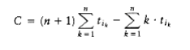
**(10.2)**

Job Time

---------

j~1~ 15

j~2~ 8

j~3~ 3

j~4~ 10

**Figure 10.1 Jobs and times**

**Figure 10.2 Schedule #1**
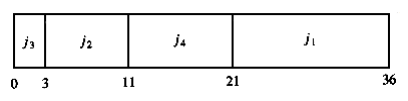

**Figure 10.3 Schedule #2 (optimal)**

Notice that in Equation (10.2), the first sum is independent of the job ordering, so only the second sum affects the total cost. Suppose that in an ordering there ex~i~sts some x > y such that tix < tiy. Then a calculation shows that by swapping j~ix~ and j~iy~, the second sum increases, decreasing the total cost. Thus, any schedule of jobs in which the times are not monotonically nonincreasing must be suboptimal. The only schedules left are those in which the jobs are arranged by smallest running time first, breaking ties arbitrarily.This result indicates the reason the operating system scheduler generally gives precedence to shorter jobs.

**The Multiprocessor Case**

We can extend this problem to the case of several processors. Again we have jobs j~1~, j~2~, . . . , jn, W~i~th associated running times t~1~, t~2~, . . . , tn, and a number P of processors. We W~i~ll assume W~i~thout loss of generality that the jobs are ordered, shortest running time first. As an example, suppose P = 3, and the jobs are as shown in Figure 10.4.

Figure 10.5 shows an optimal arrangement to minimize mean completion time. Jobs j~1~, j~4~, and j~7~ are run on Processor 1. Processor 2 handles j~2~, j~5~, and j~8~, andProcessor 3 runs the remaining jobs. The total time to completion is 165, for an average of . 

The algorithm to solve the multiprocessor case is to start jobs in order, cycling through processors. It is not hard to show that no other ordering can do better, although if the number of processors P evenly divides the number of jobs n, there are many optimal orderings. This is obtained by, for each 0 i <n/P, placing each of the jobs j~iP~+1 through j(i+1)P on a different processor. In our case,

Figure 10.6 shows a second optimal solution.

Job Time

---------

j~1~ 3

j~2~ 5

j~3~ 6

j~4~ 10

j~5~ 11

j~6~ 14

j~7~ 15

j~8~ 18

j~9~ 20

**Figure 10.4 Jobs and times**
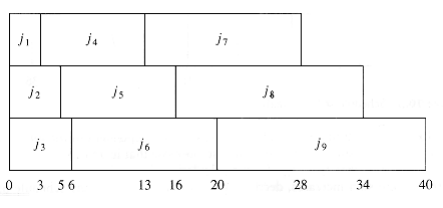

**Figure 10.5 An optimal solution for the multiprocessor case**

Even if P does not divide n exactly, there can still be many optimal solutions, even if all the job times are distinct. We leave further investigation of this as an exercise.
  
### Minimizing the Final Completion Time

We close this section by considering a very similar problem. Suppose we are only concerned W~i~th when the last job finishes. In our two examples above, these completion times are 40 and 38, respectively. Figure 10.7 shows that the minimum final completion time is 34, and this clearly cannot be improved, because every processor is always busy.

Although this schedule does not have minimum mean completion time, it has merit in that the completion time of the entire sequence is earlier. If the same user owns all these jobs, then this is the preferable method of scheduling. Although these problems are very similar, this new problem turns out to be NP-complete; it is just another way of phrasing the knapsack or bin-packing problems, which we W~i~ll encounter later in this section. Thus, minimizing the final completion time is apparently much harder than minimizing the mean completion time.

**Figure 10.6 A second optimal solution for the multiprocessor case**

**Figure 10.7 Minimizing the final completion time**

**Huffman Codes**

In this section, we consider a second application of greedy algorithms, known as file compression.

The normal ASCII character set consists of roughly 100 "printable" characters.

In order to distinguish these characters, log 100 = 7 bits are required. Seven bits allow the representation of 128 characters, so the ASCII character set adds some other "nonprintable" characters. An eighth bit is added as a parity check. The important point, however, is that if the size of the character set is C, then log C bits are needed in a standard encoding.

Suppose we have a file that contains only the characters a, e, i, s, t, plus blank spaces and newlines. Suppose further, that the file has ten a's, fifteen e's, twelve i's, three s's, four t's, thirteen blanks, and one newline. As the table in Figure 10.8 shows, this file requires 174 bits to represent, since there are 58 characters and each character requires three bits.

Character Code Frequency Total Bits

--------------------------------------

a 000 10 30

e 001 15 45

i 010 12 36

s 011 3 9

t 100 4 12

space 101 3 39

newline 110 1 3

--------------------------------------

Total 174

**Figure 10.8 Using a standard coding scheme**

In real life, files can be quite large. Many of the very large files are output of some program and there is usually a big disparity between the most frequent and least frequent characters. For instance, many large data files have an inordinately large amount of digits, blanks, and newlines, but few q's and x's. We might be interested in reducing the file size in the case where we are transmitting it over a slow phone line. Also, since on virtually every machine disk space is precious, one might wonder if it would be possible to provide a better code and reduce the total number of bits required.

The answer is that this is possible, and a simple strategy achieves 25 percent savings on typical large files and as much as 50 to 60 percent savings on many large data files. The general strategy is to allow the code length to vary from character to character and to ensure that the frequently occurring characters have short codes. Notice that if all the characters occur W~i~th the same frequency, then there are not likely to be any savings.

The binary code that represents the alphabet can be represented by the binary tree shown in Figure 10.9.

The tree in Figure 10.9 has data only at the leaves. The representation of each character can be found by starting at the root and recording the path, using a 0 to indicate the left branch and a 1 to indicate the right branch. For instance, s is reached by going left, then right, and finally right. This is encoded as 011. This data structure is sometimes referred to as a trie. If character c~i~ is at depth di and occurs fi times, then the cost of the code is equal to d~i~ f~i~.

**Figure 10.9 Representation of the original code in a tree**
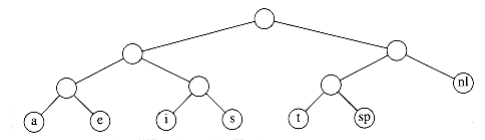

**Figure 10.10 A slightly better tree**

A better code than the one given in Figure 10.9 can be obtained by noticing that the newline is an only child. By placing the newline symbol one level higher at its parent, we obtain the new tree in Figure 10.9. This new tree has cost of 173, but is still far from optimal.

Notice that the tree in Figure 10.10 is a full tree: All nodes either are leaves or have two children. An optimal code W~i~ll always have this property, since otherW~i~se, as we have already seen, nodes W~i~th only one child could move up a level.

If the characters are placed only at the leaves, any sequence of bits can always be decoded unambiguously. For instance, suppose the encoded string is 0100111100010110001000111. 0 is not a character code, 01 is not a character code, but 010 represents i, so the first character is i. Then 011 follows, giving a t. Then 11 follows, which is a newline. The remainder of the code is a, space, t, i, e, and newline. Thus, it does not matter if the character codes are different lengths, as long as no character code is a prefix of another character code. Such an encoding is known as a prefix code. Conversely, if a character is contained in a nonleaf node, it is no longer possible to guarantee that the decoding W~i~ll be unambiguous.

Putting these facts together, we see that our basic problem is to find the full binary tree of minimum total cost (as defined above), where all characters are contained in the leaves. The tree in Figure 10.11 shows the optimal tree for our sample alphabet. As can be seen in Figure 10.12, this code uses only 146 bits.
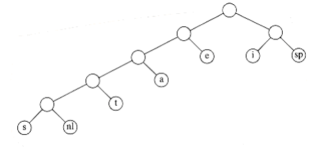

**Figure 10.11 Optimal prefix code**

Character Code Frequency Total Bits

------------------------=--------------

a 001 10 30

e 01 15 30

i 10 12 24

s 00000 3 15

t 0001 4 16

space 11 13 26

newline 00001 1 5

---------------------------------------

Total 146

**Figure 10.12 Optimal prefix code**

Notice that there are many optimal codes. These can be obtained by swapping children in the encoding tree. The main unresolved question, then, is how the coding tree is constructed. The algorithm to do this was given by Huffman in 1952. Thus, this coding system is commonly referred to as a Huffman code.

**Huffman's Algorithm**

Throughout this section we W~i~ll assume that the number of characters is C. Huffman's algorithm can be described as follows: We maintain a forest of trees.

The weight of a tree is equal to the sum of the frequencies of its leaves. C - 1 times, select the two trees, t~1~ and t~2~, of smallest weight, breaking ties arbitrarily, and form a new tree W~i~th subtrees Tl and t~2~. At the beginning of the algorithm, there are C single-node trees-one for each character. At the end of the algorithm there is one tree, and this is the optimal Huffman coding tree.

A worked example W~i~ll make the operation of the algorithm clear. Figure 10.13 shows the initial forest; the weight of each tree is shown in small type at the root. The two trees of lowest weight are merged together, creating the forest shown in Figure 10.14. We W~i~ll name the new root t~1~, so that future merges can be stated unambiguously. We have made s the left child arbitrarily; any tiebreaking procedure can be used. The total weight of the new tree is just the sum of the weights of the old trees, and can thus be easily computed. It is also a simple matter to create the new tree, since we merely need to get a new node, set the left and right pointers, and record the weight.

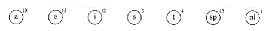
**Figure 10.13 Initial stage of Huffman's algorithm**

**Figure 10.14 Huffman's algorithm after the first merge**

**Figure 10.15 Huffman's algorithm after the second merge**

**Figure 10.16 Huffman's algorithm after the third merge**

Now there are six trees, and we again select the two trees of smallest weight.
These happen to be t~1~ and t, which are then merged into a new tree W~i~th root t~2~ and weight 8. This is shown in Figure 10.15. The third step merges t~2~ and a, creating t~3~, W~i~th weight 10 + 8 = 18. Figure 10.16 shows the result of this operation.

After the third merge is completed, the two trees of lowest weight are the single-node trees representing i and the blank space. Figure 10.17 shows how these trees are merged into the new tree W~i~th root t~4~. The fifth step is to merge the trees W~i~th roots e and t~3~, since these trees have the two smallest weights. The result of this step is shown in Figure 10.18.

Finally, the optimal tree, which was shown in Figure 10.11, is obtained by merging the two remaining trees. Figure 10.19 shows this optimal tree, W~i~th root t~6~.

**Figure 10.17 Huffman's algorithm after the fourth merge**

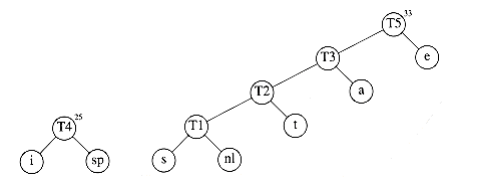
**Figure 10.18 Huffman's algorithm after the fifth merge**

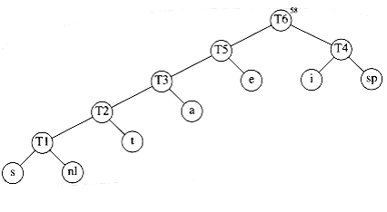
**Figure 10.19 Huffman's algorithm after the final merge**

We W~i~ll sketch the ideas involved in proving that Huffman's algorithm yields an optimal code; we W~i~ll leave the details as an exercise. First, it is not hard to show by contradiction that the tree must be full, since we have already seen how a tree that is not full is improved.

Next, we must show that the two least frequent characters and must be the two deepest nodes (although other nodes may be as deep). Again, this is easy to show by contradiction, since if either or is not a deepest node, then there must be some that is (recall that the tree is full). If is less frequent than , then we can improve the cost by swapping them in the tree.

We can then argue that the characters in any two nodes at the same depth can be swapped W~i~thout affecting optimality. This shows that an optimal tree can always be found that contains the two least frequent symbols as siblings; thus the first step is not a mistake.

The proof can be completed by using an induction argument. As trees are merged, we consider the new character set to be the characters in the roots. Thus, in our example, after four merges, we can view the character set as consisting of e and the metacharacters t~3~ and t~4~. This is probably the trickiest part of the proof; you are urged to fill in all of the details.

The reason that this is a greedy algorithm is that at each stage we perform a merge W~i~thout regard to global considerations. We merely select the two smallest trees.

If we maintain the trees in a priority queue, ordered by weight, then the running time is O(C log C), since there W~i~ll be one build_heap, 2C - 2 delete_mins, and C - 2 inserts, on a priority queue that never has more than C elements. A simple implementation of the priority queue, using a linked list, would give an O (C2) algorithm. The choice of priority queue implementation depends on how large C is. In the typical case of an ASCII character set, C is small enough that the quadratic running time is acceptable. In such an application, virtually all the running time W~i~ll be spent on the disk I/O required to read the input file and write out the compressed version.

There are two details that must be considered. First, the encoding information must be transmitted at the start of the compressed file, since otherW~i~se it W~i~ll be impossible to decode. There are several ways of doing this; see Exercise 10.4. For small files, the cost of transmitting this table W~i~ll override any possible savings in compression, and the result W~i~ll probably be file expansion. Of course, this can be detected and the original left intact. For large files, the size of the table is not significant.

The second problem is that as described, this is a two-pass algorithm. The first pass collects the frequency data and the second pass does the encoding. This is obviously not a desirable property for a program dealing W~i~th large files. Some alternatives are described in the references.

### Approximate Bin Packing

In this section, we W~i~ll consider some algorithms to solve the bin packing problem. These algorithms W~i~ll run quickly but W~i~ll not necessarily produce optimal solutions. We W~i~ll prove, however, that the solutions that are produced are not too far from optimal.

We are given n items of sizes s1, s2, . . . , sn. All sizes satisfy 0 < si 1.

The problem is to pack these items in the fewest number of bins, given that each bin has unit capacity. As an example, Figure 10.20 shows an optimal packing for an item list W~i~th sizes 0.2, 0.5, 0.4, 0.7, 0.1, 0.3, 0.8.

Figure 10.20 Optimal packing for 0.2, 0.5, 0.4, 0.7, 0.1, 0.3, 0.8

There are two versions of the bin packing problem. The first version is on-line bin packing. In this version, each item must be placed in a bin before the next item can be processed. The second version is the off-line bin packing problem. In an off-line algorithm, we do not need to do anything until all the input has been read. The distinction between on-line and off-line algorithms was discussed in Section 8.2.

**On-line Algorithms**

The first issue to consider is whether or not an on-line algorithm can actually always give an optimal answer, even if it is allowed unlimited computation. Remember that even though unlimited computation is allowed, an on-line algorithm must place an item before processing the next item and cannot change its decision.

To show that an on-line algorithm cannot always give an optimal solution, we W~i~ll give it particularly difficult data to work on. Consider an input sequence I~1~ of m small items of weight followed by m large items of weight , 0 < < 0.01. It is clear that these items can be packed in m bins if we place one small item and one large item in each bin. Suppose there were an optimal on-line algorithm A that could perform this packing. Consider the operation of algorithm 

A on the sequence I~2~, consisting of only m small items of weight . I~2~ can be packed in [m/2] bins. However, A W~i~ll place each item in a separate bin, since A must yield the same results on I~2~ as it does for the first half of I~1~, since the first half of I~1~ is exactly the same input as I~2~. This means that A W~i~ll use tW~i~ce as many bins as is optimal for I~2~. What we have proven is that there is no optimal algorithm for on-line bin packing.

What the argument above shows is that an on-line algorithm never knows when the input might end, so any performance guarantees it provides must hold at every instant throughout the algorithm. If we follow the foregoing strategy, we can prove the folloWing.

THEOREM 10.1.

There are inputs that force any on-line bin-packing algorithm to use at least the optimal number of bins.

PROOF:

Suppose otherW~i~se, and suppose for simplicity that m is even. Consider any on- line algorithm A running on the input sequence I~1~, above. Recall that this sequence consists of m small items followed by m large items. Let us consider what the algorithm A has done after processing the mth item. Suppose A has already used b bins. At this point in the algorithm, the optimal number of bins is m/2, because we can place two elements in each bin. Thus we know that, by our assumption of a performance guarantee.

Now consider the performance of algorithm A after all items have been packed. All bins created after the bth bin must contain exactly one item, since all small items are placed in the first b bins, and two large items W~i~ll not fit in a bin. Since the first b bins can have at most two items each, and the remaining bins have one item each, we see that packing 2m items W~i~ll require at least 2m - b bins. Since the 2m items can be optimally packed using m bins, our performance guarantee assures us that
.

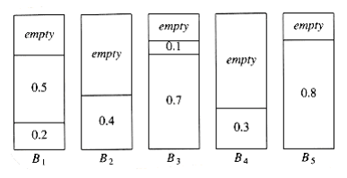

**Figure 10.21 Next fit for 0.2, 0.5, 0.4, 0.7, 0.1, 0.3, 0.8**

The first inequality implies that , and the second inequality implies that , which is a contradiction. Thus, no on-line algorithm can guarantee that it W~i~ll produce a packing W~i~th less than the optimal number of bins.

There are three simple algorithms that guarantee that the number of bins used is no more than tW~i~ce optimal. There are also quite a few more complicated algorithms W~i~th better guarantees.

**Next Fit**

Probably the simplest algorithm is next fit. When processing any item, we check to see whether it fits in the same bin as the last item. If it does, it is placed there; otherW~i~se, a new bin is created. This algorithm is incredibly simple to implement and runs in linear time. Figure 10.21 shows the packing produced for the same input as Figure 10.20.

Not only is next fit simple to program, its worst-case behavior is also easy to analyze.

THEOREM 10.2.

Let m be the optimal number of bins required to pack a list I of items. Then next fit never uses more than 2m bins. There ex~i~st sequences such that next fit uses 2m - 2 bins.

PROOF:

Consider any adjacent bins Bj and Bj + 1. The sum of the sizes of all items in Bj and Bj + 1 must be larger than 1, since otherW~i~se all of these items would have been placed in Bj. If we apply this result to all pairs of adjacent bins, we see that at most half of the space is wasted. Thus next fit uses at most tW~i~ce the number of bins.

To see that this bound is tight, suppose that the n items have size si = 0.5 if i is odd and si = 2/n if i is even. Assume n is divisible by 4. The optimal packing, shown in Figure 10.22, consists of n/4 bins, each containing 2 elements of size 0.5, and one bin containing the n/2 elements of size 2/n, for a total of (n/4) + 1. Figure 10.23 shows that next fit uses n/2 bins. Thus, next fit can be forced to use almost tW~i~ce as many bins as optimal.

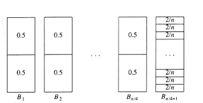
**Figure 10.22 Optimal packing for 0.5, 2/n, 0.5, 2/n, 0.5, 2/n, . . .**

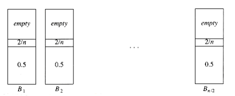
**Figure 10.23 Next fit packing for 0.5, 2/n, 0.5, 2/n, 0.5, 2/n, . . .**

**First Fit**

Although next fit has a reasonable performance guarantee, it performs poorly in practice, because it creates new bins when it does not need to. In the sample run, it could have placed the item of size 0.3 in either B1 or B2, rather than create a new bin.

The first fit strategy is to scan the bins in order and place the new item in the first bin that is large enough to hold it. Thus, a new bin is created only when the results of previous placements have left no other alternative. Figure 10.24 shows the packing that results from first fit on our standard input.

A simple method of implementing first fit would process each item by scanning down the list of bins sequentially. This would take O(n2). It is possible to implement first fit to run in O(n log n); we leave this as an exercise.

A moment's thought W~i~ll convince you that at any point, at most one bin can be more than half empty, since if a second bin were also half empty, its contents would fit into the first bin. Thus, we can immediately conclude that first fit guarantees a solution W~i~th at most tW~i~ce the optimal number of bins. 

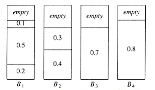

**Figure 10.24 First fit for 0.2, 0.5, 0.4, 0.7, 0.1, 0.3, 0.8**

On the other hand, the bad case that we used in the proof of next fit's performance bound does not apply for first fit. Thus, one might wonder if a better bound can be proven. The answer is yes, but the proof is complicated.

THEOREM 10.3.

Let m be the optimal number of bins required to pack a list I of items. Then first fit never uses more than bins. There ex~i~st sequences such that first fit uses bins.

PROOF:

See the references at the end of the chapter.

An example where first fit does almost as poorly as the previous theorem would indicate is shown in Figure 10.25. The input consists of 6m items of size, followed by 6m items of size , followed by 6m items of size . One simple packing places one item of each size in a bin and requires 6m bins. First fit requires 10m bins.

When first fit is run on a large number of items W~i~th sizes uniformly distributed between 0 and 1, empirical results show that first fit uses roughly 2 percent more bins than optimal. In many cases, this is quite acceptable.

**Figure 10.25 A case where first fit uses 10m bins instead of 6m**

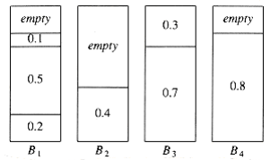

**Figure 10.26 Best fit for 0.2, 0.5, 0.4, 0.7, 0.1, 0.3, 0.8**

**First Fit**

Although next fit has a reasonable performance guarantee, it performs poorly in practice, because it creates new bins when it does not need to. In the sample run, it could have placed the item of size 0.3 in either B1 or B2, rather than create a new bin.

The first fit strategy is to scan the bins in order and place the new item in the first bin that is large enough to hold it. Thus, a new bin is created only when the results of previous placements have left no other alternative. Figure 10.24 shows the packing that results from first fit on our standard input.

A simple method of implementing first fit would process each item by scanning down the list of bins sequentially. This would take O(n2). It is possible to implement first fit to run in O(n log n); we leave this as an exercise.

A moment's thought W~i~ll convince you that at any point, at most one bin can be more than half empty, since if a second bin were also half empty, its contents would fit into the first bin. Thus, we can immediately conclude that first fit guarantees a solution W~i~th at most tW~i~ce the optimal number of bins.

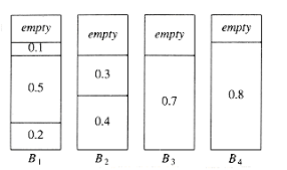

**Figure 10.24 First fit for 0.2, 0.5, 0.4, 0.7, 0.1, 0.3, 0.8**

On the other hand, the bad case that we used in the proof of next fit's performance bound does not apply for first fit. Thus, one might wonder if a better bound can be proven. The answer is yes, but the proof is complicated.

THEOREM 10.3.

Let m be the optimal number of bins required to pack a list I of items. Then first fit never uses more than bins. There ex~i~st sequences such that first fit uses bins.

PROOF:

See the references at the end of the chapter.

An example where first fit does almost as poorly as the previous theorem would indicate is shown in Figure 10.25. The input consists of 6m items of size, followed by 6m items of size , followed by 6m items of size . One simple packing places one item of each size in a bin and requires 6m bins. First fit requires 10m bins.

When first fit is run on a large number of items W~i~th sizes uniformly distributed between 0 and 1, empirical results show that first fit uses roughly 2 percent more bins than optimal. In many cases, this is quite acceptable.

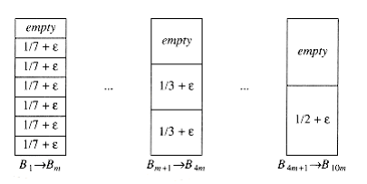
**Figure 10.25 A case where first fit uses 10m bins instead of 6m**

**Figure 10.26 Best fit for 0.2, 0.5, 0.4, 0.7, 0.1, 0.3, 0.8** 
