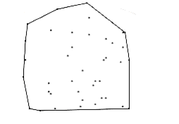

# Summary

This chapter illustrates five of the most common techniques found in algorithm design. When confronted W~i~th a problem, it is worthwhile to see if any of these methods apply. A proper choice of algorithm, combined W~i~th judicious use of data structures, can often lead quickly to efficient solutions.

## Exercises

10.1 Show that the greedy algorithm to minimize the mean completion time for multiprocessor job scheduling works. 

10.2 The input is a set of jobs j~1~, j~2~, . . . , jn, each of which takes one time unit to complete. Each job ji erans di dollars if it is completed by the time limit ti, but no money if completed after the time limit.

(a) Give an O(n2) greedy algorithm to solve the problem.

**(b) Modify your algorithm to obtain an O(n log n) time bound. Hint: The time bound is due entirely to sorting the jobs by money. The rest of the algorithm can be implemented, using the disjoint set data structure, in o(n log n).

10.3 A file contains only colons, spaces, newline, commas, and digits in the folloW~i~ng frequency: colon (100), space (605), newline (100), commas (705), 0 (431), 1 (242), 2 (176), 3 (59), 4 (185), 5 (250), 6 (174), 7 (199), 8 (205), 9 (217). Construct the Huffman code.

10.4 Part of the encoded file must be a header indicating the Huffman code. Give a method for constructing the header of size at most O(n) (in addition to the symbols), where n is the number of symbols.

10.5 Complete the proof that Huffman's algorithm generates an optimal prefix code.

10.6 Show that if the symbols are sorted by frequency, Huffman's algorithm can be implemented in linear time.

10.7 Write a program to implement file compression (and uncompression) using Huffman's algorithm.

*10.8 Show that any on-line bin-packing algorithm can be forced to use at least the optimal number of bins, by considering the folloW~i~ng sequence of items: n items of size , n items of size , n items of size .

10.9 Explain how to implement first fit and best fit in O(n log n) time.

10.10 Show the operation of all of the bin-packing strategies discussed in Section 10.1.3 on the input 0.42, 0.25, 0.27, 0.07, 0.72, 0.86, 0.09, 0.44, 0.50, 0.68, 0.73, 0.31, 0.78, 0.17, 0.79, 0.37, 0.73, 0.23, 0.30.

10.11 Write a program that compares the performance (both in time and number of bins used) of the various bin packing heuristics.

10.12 Prove Theorem 10.7.

10.13 Prove Theorem 10.8.

*10.14 n points are placed in a unit square. Show that the distance between the closest pair is O (n-1/2).

*10.15 Argue that for the closest-points algorithm, the average number of points in the strip is (. Hint: Use the result of the previous exercise.

10.16 Write a program to implement the closest-pair algorithm.

10.17 What is the asymptotic running time of quickselect, using a median-of-median-of-three partitioning strategy?

10.18 Show that quickselect W~i~th median-of-median-of-seven partitioning is linear. Why is median- of-median-of-seven partitioning not used in the proof?

10.19 Implement the quickselect algorithm in Chapter 7, quickselect using median-of-median-of- five patitioning, and the sampling algorithm at the end of Section 10.2.3. Compare the running times.

10.20 Much of the information used to compute the median-of-median-of-five is thrown away. Show how the number of comparisons can be reduced by more careful use of the information.

*10.21 Complete the analysis of the sampling algorithm described at the end of Section 10.2.3, and explain how the values of and s are chosen.

10.22 Show how the recursive multiplication algorithm computes xy, where x = 1234 and y = 4321. Include all recursive computations.

10.23 Show how to multiply two complex numbers x = a + bi and y = c + di using only three multiplications.

10.24 (a) Show that x~1~y~r~ + x~r~y~1~ = (x~1~ + x~r~)(y~1~ + y~r~) - x~1~y~1~ - x~r~y~r~

(b) This gives an O(n1.59) algorithm to multiply n-bit numbers. Compare this method to the solution in the text.

10.25 * (a) Show how to multiply two numbers by solving five problems that are roughly one-third of the original size.

**(b) Generalize this problem to obtain an O(n1+) algorithm for any constant > 0.

(c) Is the algorithm in part (b) better than O(n log n)?

10.26 Why is it important that Strassen's algorithm does not use commutativity in the multiplication of 2 X 2 matrices?
 
10.27 Two 70 X 70 matrices can be multiplied using 143,640 multiplications. Show how this can be used to improve the bound given by Strassen's algorithm.

10.28 What is the optimal way to compute A1A2A3A4A5A6, where the dimensions of the matrices are:

Al: 10 X 20, A2: 20 X 1, A3: 1 X 40, A4: 40 X 5, A5: 5 X 30, A6: 30 X 15?

10.29 Show that none of the folloW~i~ng greedy algorithms for chained matrix multiplication work. At each step

(a) Compute the cheapest multiplication.

(b) Compute the most expensive multiplication.

(c) Compute the multiplication between the two matrices Mi and Mi+1, such that the number of columns in Mi is minimized (breaking ties by one of the rules above).

10.30 Write a program to compute the best ordering of matrix multiplication. Include the routine to print out the actual ordering.

10.31 Show the optimal binary search tree for the folloW~i~ng words, where the frequency of occurrence is in parentheses: a (0.18), and (0.19), I (0.23), it (0.21) , or (0.19).

*10.32 Extend the optimal binary search tree algorithm to allow for unsuccessful searches. In this case, qj, for 1 j < n, is the probability that a search is performed for any word W satisfying w_j_ < _W_ < wj+1. q0 is the probability of performing a search for W < w1, and qn is the probability of performing a search for W > wn. Notice that  .

*10.33 Suppose Ci,i = 0 and that otherW~i~se


Suppose that W satisfies the quadrangle inequality, namely, for all i i' j j', W~i~, j + W~i~',j' W~i~',j + W~i~, j' Suppose further, that W is monotone: If i i' and j' j', then W_i,j_ W~i~'_,,j_'.

(a) Prove that C satisfies the quadrangle inequality.

(b) Let Ri, j be the largest k that achieves the minimum Ci,k-1 + Ck,j. (That is, in case of

ties, choose the largest k). Prove that Ri, j Ri, j+1 Ri+1,j+1

(c) Show that R is nondecreasing along each row and column.

(d) Use this to show that all entries in C can be computed in O(n2) time.

(e) Which of the dynamic programming algorithms can be solved in O(n2) using these techniques?

10.34 Write a routine to reconstruct the shortest paths from the algorithm in Section 10.3.4.

10.35 Examine the random number generator on your system. How random is it?

10.36 Write the routines to perform insertion, deletion, and searching in skip lists.

10.37 Give a formal proof that the expected time for the skip list operations is O(log n).

10.38 Figure 10.74 shows a routine to flip a coin, assuming that random returns an integer (which is prevalent in many systems). What is the expected performance of the skip list algorithms if the random number generator uses a modulus of the form m = 2b (which is unfortunately prevalent on many systems)?

10.39 (a) Use the exponentiation algorithm to prove that 2340 1(mod 341).

(b) Show how the randomized primality test works for n = 561 W~i~th several choices of a.

10.40 Implement the turnpike reconstruction algorithm.

10.41 Two point sets are homometric if they yield the same distance set and are not rotations of each other. The folloW~i~ng distance set gives two distinct point sets: 1, 2, 3, 4, 5, 6, 7, 8, 9, 10, 11, 12, 13, 16, 17 . Find the two point sets.
```c
enum coin_side { heads, tails };

typedef enum coin_side coin_side;

coin_side

flip(void)
{

if((rand() % 2) == 0)
return heads;

else
return tails;

}
```
**Figure 10.74 Questionable coin flipper**


**Figure 10.75 Game tree, which can be pruned**

10.42 Extend the reconstruction algorithm to find all homometric point sets given a distance set.

10.43 Show the result of - pruning the tree in Figure 10.75.

10.44 (a) Does the code in Figure 10.73 implement pruning or pruning?

(b) Implement the complementary routine.

10.45 Write the remaining procedures for tic-tac-toe.

10.46 The one-dimensional circle packing problem is as follows: You have n circles of radii r1, r2, . . . , rn. These circles are packed in a box such that each circle is tangent to the bottom of the box, and are arranged in the original order. The problem is to find the W~i~dth of the minimum-sized box.

Figure 10.76 shows an example W~i~th circles of radii 2, 1, 2 respectively. The minimum-sized box has W~i~dth

*10.47 Suppose that the edges in an undirected graph G satisfy the triangle inequality: cu,v + cv,w cu,w. Show how to compute a traveling salesman tour of cost at most tW~i~ce optimal.

Hint: Construct a minimum spanning tree.

*10.48 You are a tournament director and need to arrange a round robin tournament among n = 2k players. In this tournament, everyone plays exactly one game each day; after n - 1 days, a match has occurred between every pair of players. Give an algorithm to do this.


**Figure 10.76 Sample for circle packing problem**

10.49 (a) Prove that in a round robin tournament it is always possible to arrange the players in an order pI~1~, P~2~, pin such that for all 1 j < n, pij has won the match against pi_j +_ 1.

(b) Gve an O(n log n) algorithm to find one such arrangement. Your algorithm may serve as a proof for part (a).

*10.50 We are given a set P = P~1~, P~2~, . . . , pn of n points in a plane. A Voronoi diagram is a partition of the plane into n regions Ri such that all points in Ri are closer to pi than any other point in P. Figure 10.77 shows a sample Voronoi diagram for seven (nicely arranged) points. Give an O(n log n) algorithm to construct the Voronoi diagram.

*10.51 A convex polygon is a polygon W~i~th the property that any line segment whose endpoints are on the polygon lies entirely W~i~thin the polygon. The convex hull problem consists of finding the smallest (area) convex polygon which encloses a set of points in the plane. Figure 10.78 shows the convex hull for a set of 40 points. Give an O(n log n) algorithm to find the convex hull.


**Figure 10.77 Voronoi diagram**


**Figure 10.78 Example of a convex hull**

*10.52 Consider the problem of right-justifying a paragraph. The paragraph contains a sequence of words w1, w2, . . . ,wn of length a1, a2, . . . , an, which we W~i~sh to break into lines of length L. Words are separated by blanks whose ideal length is b (millimeters), but blanks can stretch or shrink as necessary (but must be >0), so that a line W~i~ W~i~+1. . . wj has length exactly L.

However, for each blank b' we charge |b' - b ugliness points. The exception to this is the last line, for which we charge only if b' < b (in other words, we charge only for shrinking), since the last line does not need to be justified. Thus, if bi is the length of the blank between ai and ai+1, then the ugliness of setting any line (but the last) W~i~W~i~+1 . . . wj for j > i is
 , where b' is the average size of a blank on this line. This is true of the last line only if b' < b, otherW~i~se the last line is not ugly at all.

(a) Give a dynamic programming algorithm to find the least ugly setting of w1, w2, . . ., wn into lines of length L. Hint: For i = n, n - 1, . . . , 1, compute the best way to set wj, W~i~+1, . . ., wn

(b) Give the time and space complex~i~ties for your algorithm (as a function of the number of words, n).

(c) Consider the special case where we are using a line printer instead of a laser printer, and assume the optimal value of b is 1 (space). In this case, no shrinking of blanks is allowed, since the next smallest blank space would be 0. Give a linear-time algorithm to generate the least ugly setting on a line printer.

*10.53 The longest increasing subsequence problem is as follows: Given numbers a1, a2, . . ., an,

find the ~max~~i~mum value of k such that aI~1~ < aI~2~ < < aik, and I~1~ < I~2~ << ik. As an example, if the input is 3, 1, 4, 1, 5, 9, 2, 6, 5, the ~max~~i~mum increasing subsequence has length four (1, 4, 5, 9 among others). Give an O(n2) algorithm to solve the longest increasing subsequence problem.

*10.54 The longest common subsequence problem is as follows: Given two sequences A = a1, a2, . . . , am, and B = b1, b2, . . . , bn, find the length, k, of the longest sequence C = c1, c2, . . . , ck such that C is a subsequence of both A and B. As an example, if 

A = d, y, n, a, m, i, c 

and

B = p, r, o, g, r, a, m, m, i, n, g,

then the longest common subsequence is a,m and has length 2. Give an algorithm to solve the longest common subsequence problem. Your algorithm should run in O(mn) time.

*10.55 The pattern matching problem is as follows: Given a string S of text, and a pattern P, find the first occurrence of P in S. Approx~i~mate pattern matching allows k mismatches of three types:

1. A character can be in S that is not in P.

2. A character can be in P that is not in S.

3. P and S can differ in a position.

As an example, if we are searching for the pattern "textbook" W~i~th at most three mismatches in the string "data structures txtborkk", we find a match (insert an e, change an r to an o, delete a k). Give an O(mn) algorithm to solve the approx~i~mate string matching problem, where m = |P| and n = |S|.

*10.56 One form of the knapsack problem is as follows: We are given a set of integers A = a1, a2, . . . , an and an integer K. Is there a subset of A whose sum is exactly K?

(a) Give an algorithm that solves the knapsack problem in O(nK) time.

(b) Why does this not show that P = NP?

*10.57 You are given a currency system W~i~th coins of (decreasing) value c1, c2, . . . , cn cents.

(a) Give an algorithm that computes the minimum number of coins required to give K cents in change.

(b) Give an algorithm that computes the number of different ways to give K cents in change.

*10.58 Consider the problem of placing eight queens on an (eight by eight) chess board. Two queens are said to attack each other if they are on the same row, column, or (not necessarily main) diagonal.

(a) Give a randomized algorithm to place eight nonattacking queens on the board.

(b) Give a backtracking algorithm to solve the same problem.

(c) Implement both algorithms and compare the running time.
```
distance

shortest(s, t, G)
{

distance dt,tmp;

if(s == t)
return 0;

dt = ;

for each vertex v adjacent to s
{

tmp = shortest(v, t, G);

if(cs,v + tmp < dt)
dt = cs,v + tmp;

}

return dt

}
```
**Figure 10.79 Recursive shortest path algorithm**

*10.59 In the game of chess, a knight in row r and column c may move to row 1 r' B and column 1 c' B (where B is the size of the board) provided that either

|r - r'| = 2 and |c - c'| = 1

or

|r - r'| = 1 and |c - c'| = 2

A knight's tour is a sequence of moves that visits all squares exactly once before returning to the starting point.

(a) If B is odd, show that a knight's tour cannot ex~i~st.

(b) Give a backtracking algorithm to find a knight's tour.

10.60 Consider the recursive algorithm in Figure 10.79 for finding the shortest weighted path in an acyclic graph, from s to t.

(a) Why does this algorithm not work for general graphs?

(b) Prove that this algorithm terminates for acyclic graphs.

(c) What is the worst-case running time of the algorithm?

## References

The original paper on Huffman codes is [21]. Variations on the algorithm are discussed in [29], [31], and [32]. Another popular compression scheme is Ziv-Lempel encoding [52], [53]. Here the codes have a fixed length but represent strings instead of characters. [3] and [34] are good surveys of the common compression schemes.

The analysis of bin-packing heuristics first appeared in Johnson's Ph.D. thesis and was published in [22]. The improved lower bound for on-line bin packing given in Exercise 10.8 is from [50]; this result has been improved further in [35]. [44] describes another approach to on-line bin packing.

Theorem 10.7 is from [6]. The closest points algorithm appeared in [45]. [47] describes the turnpike reconstruction problem and its applications. Two books on the relatively new field of computational geometry are [14] and [40]. [2] contains the lecture notes for a computational geometry course taught at MIT; it includes an extensive bibliography.

The linear-time selection algorithm appeared in [8]. [17] discusses the sampling approach that finds the median in 1.5n expected comparisons. The O(n1.59) multiplication is from [23]. Generalizations are discussed in [9] and [24]. Strassen's algorithm appears in the short paper [48]. The paper states the results and not much else. Pan [38] gives several divide and conquer algorithms, including the one in Exercise 10.27. The best known bound is O(n2.376), which is due to Coppersmith and W~i~nograd [13].

The classic references on dynamic programming are the books [4] and [5]. The matrix ordering problem was first studied in [19]. It was shown in [20] that the problem can be solved in O(n log n) time.

An O(n2) algorithm was provided for the construction of optimal binary search trees by Knuth [25]. The all-pairs shortest-path algorithm is from Floyd [16]. A theoretically better O(n3(log logn/logn)l/3) algorithm is given by Fredman [18], but not surprisingly, it is not practical. Under certain conditions, the running time of dynamic programs can automatically be improved by a factor of n or more. This is discussed in Exercise 10.33, [15], and [51].

The discussion of random number generators is based on [39]. Park and Miller attribute the portable implementation to Schrage [46]. Skip lists are discussed by Pugh in [41]. The randomized primality-testing algorithm is due to Miller [36] and Rabin [43]. The theorem that at most (n - 9)/4 values of a fool the algorithm is from Monier [37]. Other randomized algorithms are discussed in [42].

More information on - pruning can be found in [1], [26], and [27]. The top programs that play chess, checkers, Othello, and backgammon have all achieved world class status. [33] describes an Othello program. The paper appears in a special issue on computer games (mostly chess); this issue is a gold mine of ideas. One of the papers describes the use of dynamic programming to solve chess endgames completely when only a few pieces are left on the board. Related research has resulted in the change of the 50-move rule in certain cases.

Exercise 10.41 is solved in [7]. It is the only known case of a homometric point set W~i~th no duplicate distances. Determining whether any others ex~i~st for n > 6 is open. Christofides [12] gives a solution to Exercise 10.47, and also an algorithm which generates a tour at most optimal. Exercise 10.52 is discussed in [28]. Exercise 10.55 is solved in [49]. An O(kn) algorithm is given in [30]. Exercise 10.57 is discussed in [10], but do not be misled by the title of the paper.

1. B. Abramson, "Control Strategies for Two-Player Games," ACM Computing Surveys, 21 (1989), 137- 161.

2. A. Aggarwal and J. Wein, Computational Geometry: Lecture Notes for 18.409, MIT Laboratory for Computer Science, 1988.

3. T. Bell, I. H. W~i~tten, and J. G. Cleary, "Modeling for Text Compression," ACM Computing Surveys, 21 (1989), 557-591.

4. R. E. Bellman, Dynamic Programming, Princeton University Press, Princeton, NJ, 1957.

5. R. E. Bellman and S. E. Dreyfus, Applied Dynamic Programming, Princeton University Press, Princeton, NJ, 1962.

6. J. L. Bentley, D. Haken, and J. B. Saxe, "A General Method for Solving Divide-and-Conquer Recurrences," SIGACT News, 12 (1980), 36-44.

7. G. S. Bloom, "A Counterexample to the Theorem of Piccard," Journal of Combinatorial Theory A (1977), 378-379.

8. M. Blum, R. W. Floyd, V. R. Pratt, R. L. Rivest, and R. E. Tarjan, "Time Bounds for Selection," Journal of Computer and System Sciences 7 (1973), 448-461.

9. A. Borodin and J. I. Munro, The Computational Complex~i~ty of Algebraic and Numerical Problems, American Elsevier, New York, 1975.

10. L. Chang and J. Korsh, "Canonical Coin Changing and Greedy Solutions," Journal of the ACM 23 (1976), 418-422.

12. N. Christofides, "Worst-case Analysis of a New Heuristic for the Traveling Salesman Problem,"Management Science Research Report #388, Carnegie-Mellon University, Pittsburgh, PA, 1976.

13. D. Coppersmith and S. W~i~nograd, "Matrix Multiplication via Arithmetic Progressions,"Proceedings of the Nineteenth Annual ACM Symposium of the Theory of Computing (1987), 1-6.

14. H. Edelsbrunner, Algorithms in Combinatorial Geometry, Springer-Verlag, Berlin, 1987.

15. D. Eppstein, Z. Galil, R. Giancarlo, "Speeding up Dynamic Programming," Proceedings of the Twenty-ninth Annual IEEE Symposium on the Foundations of Computer Science, (1988), 488-495.

16. R. W. Floyd, "Algorithm 97: Shortest Path," Communications of the ACM 5 (1962), 345.

17. R. W. Floyd and R. L. Rivest, "Expected Time Bounds for Selection," Communications of the ACM 18 (1975), 165-172.

18. M. L. Fredman, "New Bounds on the Complex~i~ty of the Shortest Path Problem," SIAM Journal on Computing 5 (1976), 83-89.

19. S. Godbole, "On Efficient Computation of Matrix Chain Products," IEEE Transactions on Computers 9 (1973), 864-866.

20. T. C. Hu and M. R. Shing "Computations of Matrix Chain Products, Part I," SIAM Journal on Computing 11 (1982), 362-373.

21. D. A. Huffman, "A Method for the Construction of Minimum Redundancy Codes," Proceedings of the IRE 40 (1952), 1098-1101.

22. D. S. Johnson, A. Demers, J. D. Ullman, M. R. Garey, and R. L. Graham, "Worst-case Performance Bounds for Simple One-Dimensional Packing Algorithms," SIAM Journal on Computing, 3 (1974), 299-325.

23. A. Karatsuba and Y. Ofman, "Multiplication of Multi-digit Numbers on Automata," Doklady Akademii Nauk SSSR 145 (1962), 293-294.

24. D. E. Knuth, The Art of Computer Programming, Vol 2: Seminumerical Algorithms, second edition, Addison-Wesley, Reading, MA, 1981.

25. D. E. Knuth, "Optimum Binary Search Trees," Acta Informatica 1 (1971), 14-25.

26. D. E. Knuth and R. W. Moore, "Estimating the Efficiency of Backtrack Programs," Mathematics of Computation 29, (1975) 121-136.

27. D. E. Knuth, "An Analysis of Alpha-Beta Cutoffs," Artificial Intelligence 6 (1975), 293-326.

28. D. E. Knuth, TEX and Metafont, New Directions in Typesetting, Digital Press, Bedford, MA, 1981.

29. D. E. Knuth, "Dynamic Huffman Coding,"Journal of Algorithms 6 (1985), 163-180.

30. G. M. Landau and U. Vishkin, "Introducing Efficient Parallelism into Approx~i~mate String Matching and a New Serial Algorithm," Proceedings of the Eighteenth Annual ACM Symposium on Theory of Computing (1986), 220-230.

31. L. L. Larmore, "Height-Restricted Optimal Binary Trees," SlAM Journal on Computing 16 (1987), 1115-1123.

32. L. L. Larmore and D. S. Hirschberg, "A Fast Algorithm for Optimal Length-Limited Huffman Codes," Journal of the ACM 37 (1990), 464-473.

33. K. Lee and S. Mahajan, "The Development of a World Class Othello Program," Artificial Intelligence 43 (1990), 21-36.

34. D. A. Lelewer and D. S. Hirschberg, "Data Compression," ACM Computing Surveys 19 (1987), 261- 296.

35. F. M. Liang, "A Lower Bound for On-line Bin Packing," Information Processing Letters 10 (1980), 76-79.

36. G. L. Miller, "Riemann's Hypothesis and Tests for Primality," Journal of Computer and System Sciences 13 (1976), 300-317.

37. L. Monier, "Evaluation and Comparison of Two Efficient Probabilistic Primality Testing Algorithms," Theoretical Computer Science 12 (1980), 97-108.

38. V. Pan, "Strassen's Algorithm is Not Optimal," Proceedings of the Nineteenth Annual IEEE Symposium on the Foundations of Computer Science (1978), 166-176.

39. S. K. Park and K. W. Miller, "Random Number Generators: Good Ones are Hard To Find,"Communications of the ACM 31 (1988), 1192-1201.

40. F. P. Preparata and M. I. Shamos, Computational Geometry: An Introduction, Springer-Verlag, New York, NY, 1985.

41. W. Pugh, "Skip Lists: A Probabilistic Alternative to Balanced Trees," Communications of the ACM 33 (1990), 668-676.

42. M. O. Rabin, "Probabilistic Algorithms," in Algorithms and Complex~i~ty, Recent Results and New Directions (J. F. Traub, ed.), Academic Press, New York, 1976, 21-39.

43. M. O. Rabin, "Probabilistic Algorithms for Testing Primality," Journal of Number Theory, 12 (1980), 128-138.

44. P. Ramanan, D. J. Brown, C. C. Lee, and D. T. Lee, "On-line Bin Packing in Linear Time,"Journal of Algorithms 10 (1989), 305-326.

45. M. I. Shamos and D. Hoey, "Closest-Point Problems," Proceedings of the Sixteenth Annual IEEE Symposium on the Foundations of Computer Science (1975), 151-162.

46. L. Schrage, "A More Portable FORTRAN Random Number Generator," ACM Transactions on Mathematics Software 5 (1979), 132-138.

47. S. S. Skiena, W. D. Smith, and P. Lemke, "Reconstructing Sets From Interpoint Distances,"Proceedings of the Sixth Annual ACM Symposium on Computational Geometry (1990), 332-339.

48. V. Strassen, "Gaussian Elimination is Not Optimal," Numerische Mathematik 13 (1969), 354-356.

49. R. A. Wagner and M. J. Fischer, "The String-to-String Correction Problem," Journal of the ACM 21 (1974), 168-173.

50. A. C. Yao, "New Algorithms for Bin Packing," Journal of the ACM 27 (1980), 207-227.

51. F. F. Yao, "Efficient Dynamic Programming Using Quadrangle Inequalities," Proceedings of the Twelfth Annual ACM Symposium on the Theory of Computing (1980), 429-435. 

52. J. Ziv and A. Lempel, "A Universal Algorithm for Sequential Data Compression," IEEE Transactions on Information Theory It~23~ (1977), 337-343.

53. J. Ziv and A. Lempel, "Compression of Individual Sequences via Variable-rate Coding," IEEE Transactions on Information Theory It~24~ (1978), 530-536.
