# AMORTIZED ANALYSIS

In this chapter, we will analyze the running time for several of the advanced data structures that have been presented in Chapters 4 and 6. In particular, we will consider the worst-case running time for any sequence of m operations. This contrasts with the more typical analysis, in which a worst-case bound is given for any single operation.

As an example, we have seen that **AVL** trees support the standard tree operations in O(log n) worst-case time per operation.**AVL** trees are somewhat complicated to implement, not only because there are a host of cases, but also because height balance information must be maintained and updated correctly. The reason that

**AVL** trees are used is that a sequence of (n) operations on an unbalanced

search tree could require (n2) time, which would be expensive. For search trees, the O(n) worst-case running time of an operation is not the real problem. The major problem is that this could happen repeatedly. Splay trees offer a

pleasant alternative. Although any operation can still require (n) time, this degenerate behavior cannot occur repeatedly, and we can prove that any sequence of m operations takes O(m log n) worst-case time (total). Thus, in the long run this data structure behaves as though each operation takes O(log n). We call this an amortized time bound.

Amortized bounds are weaker than the corresponding worst-case bounds, because there is no guarantee for any single operation. Since this is generally not important, we are willing to sacrifice the bound on a single operation, if we can retain the same bound for the sequence of operations and at the same time simplify the data structure. Amortized bounds are stronger than the equivalent average-case bound. For instance, binary search trees have O (log n) average time per operation, but it is still possible for a sequence of m operations to take O (mn) time.

Because deriving an amortized bound requires us to look at an entire sequence of operations instead of just one, we expect that the analysis will be more tricky. We will see that this expectation is generally realized.

In this chapter we shall

- Analyze the binomial queue operations.

- Analyze skew heaps.

- Introduce and analyze the Fibonacci heap.

- Analyze splay trees.

## An Unrelated Puzzle

Consider the following puzzle: Two kittens are placed on opposite ends of a football field, 100 yards apart. They walk towards each other at the speed of ten yards per minute. At the same time, their mother is at one end of the field. She can run at 100 yards per minute. The mother runs from one kitten to the other, making turns with no loss of speed, until the kittens (and thus the mother) meet at midfield. How far does the mother run?

It is not hard to solve this puzzle with a brute force calculation. We leave the details to you, but one expects that this calculation will involve computing the sum of an infinite geometric series. Although this straightforward calculation will lead to an answer, it turns out that a much simpler solution can be arrived at by introducing an extra variable, namely, time.

Because the kittens are 100 yards apart and approach each other at a combined velocity of 20 yards per minute, it takes them five minutes to get to midfield. Since the mother runs 100 yards per minute, her total is 500 yards.

This puzzle illustrates the point that sometimes it is easier to solve a problem indirectly than directly. The amortized analyses that we will perform will use this idea. We will introduce an extra variable, known as the potential, to allow us to prove results that seem very difficult to establish otherwise.

## Binomial Queues

The first data structure we will look at is the binomial queue of Chapter 6, which we now review briefly. Recall that a binomial tree B0 is a one-node tree,and for k > 0, the binomial tree Bk is built by melding two binomial trees Bk-1 together. Binomial trees B0 through B4 are shown in Figure 11.1.

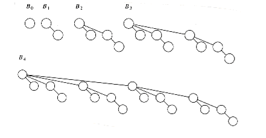
Figure 11.1 Binomial trees B0, B1, B2, B3, and B4

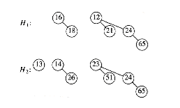
Figure 11.2 Two binomial queues H1 **and H2**

The rank of a node in a binomial tree is equal to the number of children; in particular, the rank of the root of Bk is k. A binomial queue is a collection of heap-ordered binomial trees, in which there can be at most one binomial tree Bk for any k. Two binomial queues, H1 and H2, are shown in Figure 11.2.

The most important operation is merge. To merge two binomial queues, an operation similar to addition of binary integers is performed: At any stage we may have zero, one, two, or possibly three Bk trees, depending on whether or not the two priority queues contain a Bk tree and whether or not a Bk tree is carried over from the previous step. If there is zero or one Bk tree, it is placed as a tree in the resultant binomial queue. If there are two Bk trees, they are melded into a Bk+1 tree and carried over; if there are three Bk trees, one is placed as a tree in the binomial queue and the other two are melded and carried over. The result of merging H1 and H2 is shown in Figure 11.3.

Insertion is performed by creating a one-node binomial queue and performing a merge. The time to do this is m + 1, where m represents the smallest type of binomial tree Bm not present in the binomial queue. Thus, insertion into a binomial queue that has a B0 tree but no B1 tree requires two steps. Deletion of the minimum is accomplished by removing the minimum and splitting the original binomial queue into two binomial queues, which are then merged. A less terse explanation of these operations is given in Chapter 6.

We consider a very simple problem first. Suppose we want to build a binomial queue of n elements. We know that building a binary heap of n elements can be done in O (n), so we expect a similar bound for binomial queues.

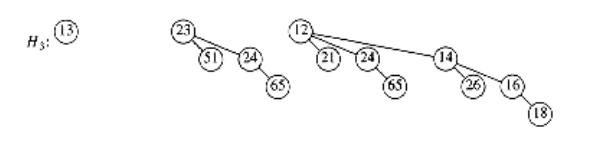
**Figure 11.3 Binomial queue H3**: the result of merging H1 and H2

**CLAIM:**
```
A binomial queue of n elements can be built by n successive insertions in O(n) time.
```

The claim, if true, would give an extremely simple algorithm. Since the worst-case time for each insertion is O (log n), it is not obvious that the claim is true. Recall that if this algorithm were applied to binary heaps, the running time would be O(n log n).

To prove the claim, we could do a direct calculation. To measure the running time, we define the cost of each insertion to be one time unit plus an extra unit for each linking step. Summing this cost over all insertions gives the total running time. This total is n units plus the total number of linking steps. The 1st, 3rd, 5th, and all odd-numbered steps require no linking steps, since there is no B0 present at the time of insertion. Thus, half of the insertions require no linking steps. A quarter of the insertions require only one linking step (2nd, 6th, 10th, and so on). An eighth require two, and so on. We could add this all up and bound the number of linking steps by n, proving the claim. This brute force calculation will not help when we try to analyze a sequence of operations that include more than just insertions, so we will use another approach to prove this result.

Consider the result of an insertion. If there is no B0 tree present at the time of the insertion,then the insertion costs a total of one unit, by using the same accounting as above. The result of the insertion is that there is now a B0 tree, and thus we have added one tree to the forest of binomial trees. If there is a B0 tree but no B1 tree, then the insertion costs two units. The new forest will have a B1 tree but will no longer have a B0 tree, so the number of trees in the forest is unchanged. An insertion that costs three units will create a B2 tree but destroy a B0 and B1 tree, yielding a net loss of one tree in the forest. In fact, it is easy to see that, in general, an insertion that costs c units results in a net increase of 2 - c trees in the forest, because a Bc-1 tree is created but all Bi trees 0 i < c - 1 are removed. Thus, expensive insertions remove trees, while cheap insertions create trees.

Let Ci be the cost of the ith insertion. Let Ti be the number of trees after the ith insertion.T0 = 0 is the number of trees initially. Then we have the invariant
```
Ci + (Ti - Ti-1) = 2
```
***(11.1)***

We then have
```
C1 + (T1 - T0) = 2

C2 + (T2 - T1) = 2

Cn-1 + (Tn-1 - Tn-2) = 2

Cn + (Tn - Tn-1) = 2
```

If we add all these equations, most of the Ti terms cancel, leaving

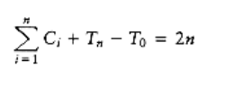
or equivalently,

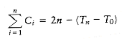
Recall that T0 = 0 and Tn, the number of trees after the n insertions, is certainly not negative,

so (Tn - T0) is not negative. Thus

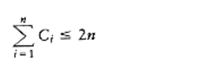
which proves the claim.

During the build_binomial_queue routine, each insertion had a worst-case time of O(log n), but since the entire routine used at most 2n units of time, the insertions behaved as though each used no more than 2 units each.

This example illustrates the general technique we will use. The state of the data structure at any time is given by a function known as the potential. The potential function is not maintained by the program, but rather is an accounting device that will help with the analysis. When operations take less time than we have allocated for them, the unused time is "saved" in the form of a higher potential. In our example, the potential of the data structure is simply the number of trees. In the analysis above, when we have insertions that use only one unit instead of the two units that are allocated, the extra unit is saved for later by an increase in potential. When operations occur that exceed the allotted time, then the excess time is accounted for by a decrease in potential. One may view the potential as representing a savings account. If an operation uses less than its allotted time, the difference is saved for use later on by more expensive operations. Figure 11.4 shows the cumulative running time used by build_binomial_queue over a sequence of insertions. Observe that the running time never exceeds 2n and that the potential in the binomial queue after any insertion measures the amount of savings.

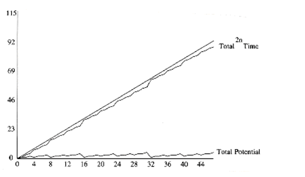

**Figure 11.4 A sequence of n inserts**

Once a potential function is chosen, we write the main equation:

Tactual + Potential = Tamortized

**(11.2)**

Tactual, the actual time of an operation, represents the exact (observed) amount of time required to execute a particular operation. In a binary search tree, for example, the actual time to perform a find(x) is 1 plus the depth of the node containing x. If we sum the basic equation over the entire sequence, and if the final potential is at least as large as the initial potential,then the amortized time is an upper bound on the actual time used during the execution of the sequence. Notice that while Tactual varies from operation to operation, Tamortized is stable.

Picking a potential function that proves a meaningful bound is a very tricky task; there is no one method that is used. Generally, many potential functions are tried before the one that works is found. Nevertheless, the discussion above suggests a few rules, which tell us the properties that good potential functions have. The potential function should

- Always assume its minimum at the start of the sequence. A popular method of choosing potential functions is to ensure that the potential function is initially 0, and always nonnegative. All of the examples that we will encounter use this strategy.

- Cancel a term in the actual time. In our case, if the actual cost was c, then the potential change was 2 - c. When these are added, an amortized cost of 2 is obtained. This is shown in

Figure 11.5.

We can now perform a complete analysis of binomial queue operations.

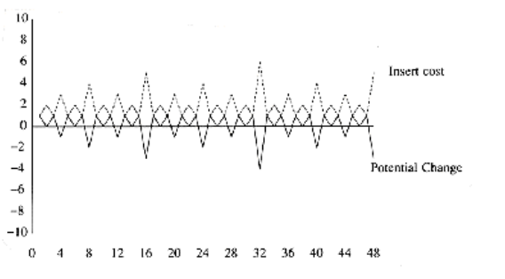
**Figure 11.5 The insertion cost and potential change for each operation in a sequence**

THEOREM 11.1.

*The amortized running times of insert, delete_min, and merge are O(1), O(log n), and O(log n), respectively, for binomial queues.*

PROOF:

The potential function is the number of trees. The initial potential is 0, and the potential is always nonnegative, so the amortized time is an upper bound on the actual time. The analysis for insert follows from the argument above. For merge, assume the two trees have n1 and n2 nodes with T1 and T2 trees, respectively. Let n = n1 + n2. The actual time to perform the merge is O(log(n1) + log(n2)) = O(log n). After the merge, there can be at most log n trees, so the potential can increase by at most O(log n). This gives an amortized bound of O(log n). The delete_min bound follows in a similar manner.

## Skew Heaps

The analysis of binomial queues is a fairly easy example of an amortized analysis. We now look at skew heaps. As is common with many of our examples, once the right potential function is found, the analysis is easy. The difficult part is choosing a meaningful potential function.

Recall that for skew heaps, the key operation is merging. To merge two skew heaps, we merge their right paths and make this the new left path. For each node on the new path, except the last, the old left subtree is attached as the right subtree. The last node on the new left path is known to not have a right subtree, so it is silly to give it one. The bound does not depend on this exception, and if the routine is coded recursively, this is what will happen naturally. Figure 11.6 shows the result of merging two skew heaps.

Suppose we have two heaps, H1 and H2, and there are r1 and r2 nodes on their respective right paths. Then the actual time to perform the merge is proportional to r1 + r2, so we will drop the Big-Oh notation and charge one unit of time for each node on the paths. Since the heaps have no structure, it is possible that all the nodes in both heaps lie on the right path, and this would give a (n) worst-case bound to merge the heaps (Exercise 11.3 asks you to construct an example). We will show that the amortized time to merge two skew heaps is O(log n).


**Figure 11.6 Merging of two skew heaps**

What is needed is some sort of a potential function that captures the effect of skew heap operations. Recall that the effect of a merge is that every node on the right path is moved to the left path, and its old left child becomes the new right child. One idea might be to classify each node as a right node or left node, depending on whether or not it is a right child, and use the number of right nodes as a potential function. Although the potential is initially 0 and always nonnegative, the problem is that the potential does not decrease after a merge and thus does not adequately reflect the savings in the data structure. The result is that this potential function cannot be used to prove the desired bound.

A similar idea is to classify nodes as either heavy or light, depending on whether or not the right subtree of any node has more nodes than the left subtree.

**DEFINITION**: A node p is heavy if the number of descendants of p's right subtree is at least half of the number of descendants of p, and light otherwise. Note that the number of descendants of a node includes the node itself.

As an example, Figure 11.7 shows a skew heap. The nodes with keys 15, 3, 6, 12, and 7 are heavy,and all other nodes are light. The potential function we will use is the number of heavy nodes in the (collection) of heaps. This seems like a good choice, because a long right path will contain an inordinate number of heavy nodes. Because nodes on this path have their children swapped, these nodes will be converted to light nodes as a result of the merge.

THEOREM 11.2.

*The amortized time to merge two skew heaps is O(log n).*

PROOF:

Let H1 and H2 be the two heaps, with n1 and n2 nodes respectively. Suppose the right path of H1 has l1 light nodes and h1 heavy nodes, for a total of l1 + h1. Likewise, H2 has l2 light and h2 heavy nodes on its right path, for a total of l2 + h2 nodes.

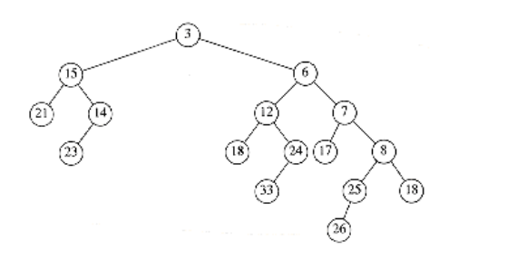
**Figure 11.7 Skew heap -- heavy nodes are 3, 6, 7, 12, and 15**

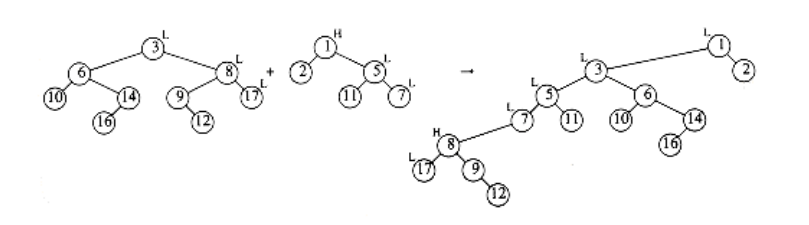
**Figure 11.8 Change in heavy/light status after a merge**

If we adopt the convention that the cost of merging two skew heaps is the total number of nodes on their right paths, then the actual time to perform the merge is l1 + l2 + h1 + h2. Now the only nodes whose heavy/light status can change are nodes that are initially on the right path (and wind up on the left path), since no other nodes have their subtrees altered. This is shown by the example in Figure 11.8.

If a heavy node is initially on the right path, then after the merge it must become a light node. The other nodes that were on the right path were light and may or may not become heavy, but since we are proving an upper bound, we will have to assume the worst, which is that they become heavy and increase the potential. Then the net change in the number of heavy nodes is at most l1 + l2 - h1 - h2. Adding the actual time and the potential change (Equation 11.2) gives an amortized bound of 2(l1 + l2).

Now we must show that l1 + l2 = O(log n). Since l1 and l2 are the number of light nodes on the original right paths, and the right subtree of a light node is less than half the size of the tree rooted at the light node, it follows directly that the number of light nodes on the right path is at most log n1 + log n2, which is O(log n).

The proof is completed by noting that the initial potential is 0 and that the potential is always nonnegative. It is important to verify this, since otherwise the amortized time does not bound the actual time and is meaningless. Since the insert and delete_min operations are basically just merges, they also have O(log n) amortized bounds.

## Fibonacci Heaps

In Section 9.3.2, we showed how to use priority queues to improve on the naïve O(|V|2) running time of Dijkstra's shortest-path algorithm. The important observation was that the running time was dominated by|E|decrease_key operations and |V| insert and delete_min operations. These operations take place on a set of size at most |V|. By using a binary heap, all these operations take O(log |V|) time, so the resulting bound for Dijkstra's algorithm can be reduced to O(|E| log |V|).

In order to lower this time bound, the time required to perform the decrease_key operation must be improved. d-heaps, which were described in Section 6.5, give an O(logd |V|) time bound for the *delete_min* operation as well as for insert, but an O(d logd |V|) bound for delete_min. By choosing d to balance the costs of |E| decrease_key operations with |V| delete_min operations, and remembering that d must always be at least 2, we see that a good choice for d is

```
*d = max(2, E / V).*
```
This improves the time bound for Dijkstra's algorithm to O(E log(2+ E / V) V).

The *Fibonacci* heap is a data structure that supports all the basic heap operations in O(1) amortized time, with the exception of delete_min and delete, which take O (log n) amortized time. It immediately follows that the heap operations in Dijkstra's algorithm will require a total of O (|E| + |V| log |V|) time.

Fibonacci heaps* generalize binomial queues by adding two new concepts:

The name comes from a property of this data structure, which we will prove later in the section.

A different implementation of decrease_key: The method we have seen before is to percolate the element up toward the root. It does not seem reasonable to expect an O(1) amortized bound for this strategy, so a new method is needed.

Lazy merging: Two heaps are merged only when it is required to do so. This is similar to lazy deletion. For lazy merging, merges are cheap, but because lazy merging does not actually combine trees, the delete_min operation could encounter lots of trees, making that operation expensive. Any one delete_min could take linear time, but it is always possible to charge the time to previous merge operations. In particular, an expensive delete_min must have been preceded by a large number of unduly cheap merges, which have been able to store up extra potential.

### Cutting Nodes in Leftist Heaps

In binary heaps, the decrease_key operation is implemented by lowering the value at a node and then percolating it up toward the root until heap order is established. In the worst case, this can take O(log n) time, which is the length of the longest path toward the root in a balanced tree.

This strategy does not work if the tree that represents the priority queue does not have O(log n) depth. As an example, if this strategy is applied to leftist heaps, then the *decrease_key*operation could take (n) time, as the example in Figure 11.9 shows.

We see that for leftist heaps, another strategy is needed for the decrease_key operation. Our example will be the leftist heap in Figure 11.10. Suppose we want to decrease the key with value 9 down to 0. If we make the change, we find that we have created a violation of heap order, which is indicated by a dashed line in Figure 11.11.

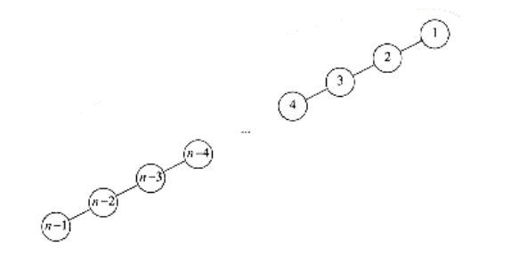

**Figure 11.9 Decreasing n - 1 to 0 via percolate up would take (n) time**
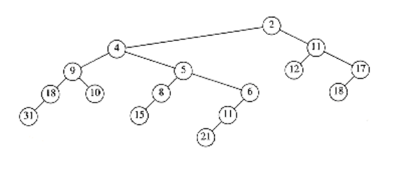
**Figure 11.10 Sample leftist heap H**

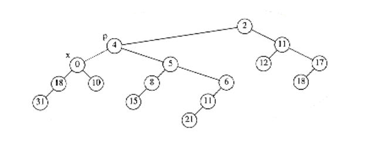
**Figure 11.11 Decreasing 9 to 0 creates a heap order violation**

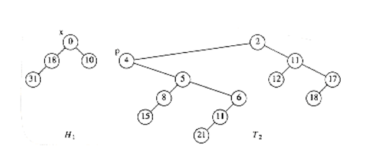
**Figure 11.12 The two trees after the cut**

We do not want to percolate the 0 to the root, because, as we have seen, there are cases where this could be expensive. The solution is to cut the heap along the dashed line, thus creating two trees, and then merge the two trees back into one. Let x be the node to which the decrease_key operation is being applied, and let p be its parent. After the cut, we have two trees, namely, H1 with root x, and T2, which is the original tree with H1 removed. The situation is shown in Figure 11.12.

If these two trees were both leftist heaps, then they could be merged in O (log n) time, and we would be done. It is easy to see that H1 is a leftist heap, since none of its nodes have had any changes in their descendants. Thus, since all of its nodes originally satisfied the leftist property, they still must.

Nevertheless, it seems that this scheme will not work, because T2 is not necessarily leftist.However, it is easy to reinstate the leftist heap property by using two observations:

- Only nodes on the path from p to the root of T2 can be in violation of the leftist heap property; these can be fixed by swapping children.

- Since the maximum right path length has at most log(n + 1) nodes, we only need to check the first log(n + 1) nodes on the path from p to the root of T2. Figure 11.13

shows H1 and T2 after T2 is converted to a leftist heap.

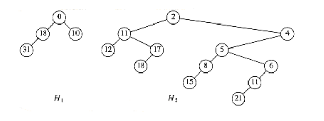
**Figure 11.13 T2 converted to the leftist heap H2**

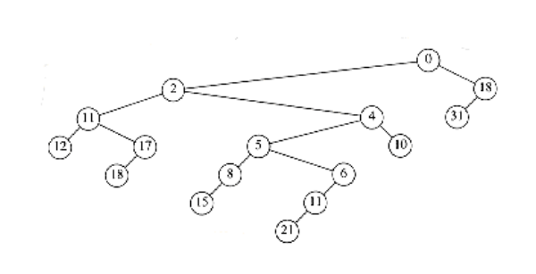
**Figure 11.14 decrease_key (H,x,9) completed by merging Hl and H2**

Because we can convert T2 to the leftist heap H2 in O (log n) steps, and then merge H1 and H2, we have an O (log n) algorithm for performing the decrease_key operation in leftist heaps. The heap that results in our example is shown in

                                Figure 11.14.

### Lazy Merging for Binomial Queues

The second idea that is used by Fibonacci heaps is lazy merging. We will apply this idea to binomial queues and show that the amortized time to perform a merge operation (as well as insertion, which is a special case) is O(1). The amortized time for delete_min will still be O (log n).

The idea is as follows: To merge two binomial queues, merely concatenate the two lists of binomial trees, creating a new binomial queue. This new queue may have several trees of the same size, so it violates the binomial queue property. We will call this a lazy binomial queue in order to maintain consistency. This is a fast operation, which always takes constant (worst-case) time. As before, an insertion is done by creating a one-node binomial queue and merging. The difference is that the *merge* is lazy.

The *delete_min* operation is much more painful, because it is where we finally convert the lazy binomial queue back into a standard binomial queue, but, as we will show, it is still O (log n) amortized time-but not O(log n) worst-case time, as before. To perform a delete_min, we find (and eventually return) the minimum element. As before, we delete it from the queue, making each of its children new trees. We then merge all the trees into a binomial queue by merging two equal- sized trees until it is no longer possible.

As an example, Figure 11.15 shows a lazy binomial queue. In a lazy binomial queue, there can be more than one tree of the same size. We can tell the size of a tree by examining the root's rank field, which gives the number of children (and thus implicitly the type of tree). To perform the delete_min, we remove the smallest element, as before, and obtain the tree in Figure 11.16.

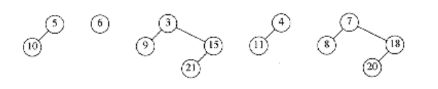
**Figure 11.15 Lazy binomial queue**

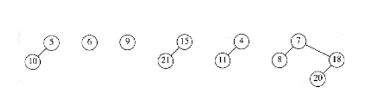
**Figure 11.16 Lazy binomial queue after removing the smallest element (3)**

We now have to merge all the trees and obtain a standard binomial queue. A standard binomial queue has at most one tree of each rank. In order to do this efficiently, we must be able to perform the merge in time proportional to the number of trees present (T) (or log n, whichever is larger). To do this, we form an array of lists, L0, L1, . . . , LRmax_+_ 1, where Rmax is the rank of the largest tree. Each list Lr contains all of the trees of rank r. The procedure in Figure 11.17 is then applied.

Each time through the loop, at lines 3 through 5, the total number of trees is reduced by 1. This means that this part of the code, which takes constant time per execution, can only be performed T - 1 times, where T is the number of trees. The for loop counters, and tests at the end of the while loop take O (log n) time, so the running time is O (T + log n), as required. Figure 11.18 shows the execution of this algorithm on the previous collection of binomial trees.

**Amortized Analysis of Lazy Binomial Queues** 

Amortized Analysis of Lazy Binomial Queues To carry out the amortized analysis of lazy binomial queues, we will use the same potential function that was used for standard binomial queues. Thus, the potential of a lazy binomial queue is the number of trees.

THEOREM 11.3.

*The amortized running times of merge and insert are both O(1) for lazy binomial queues. The amortized running time of delete_min is O(log n).*

PROOF:

The potential function is the number of trees in the collection of binomial queues. The initial potential is 0, and the potential is always nonnegative. Thus, over a sequence of operations, the total amortized time is an upper bound on the total actual time.
```
/*1*/ for(r = 0; r <= log n ; r++)

/*2*/ while (|Lr| 2)

{

/*3*/ remove two trees from Lr;

/*4*/ merge the two trees into a new tree;

/*5*/ add the new tree to Lr+1 ;

}

``` 
**Figure 11.17 Procedure to reinstate a binomial queue**


**Figure 11.18 Combining the binomial trees into a binomial queue**

For the merge operation, the actual time is constant, and the number of trees in the collection of binomial queues is unchanged, so, by Equation (11.2), the amortized time is O(1).

For the *insert* operation, the actual time is constant, and the number of trees can increase by at most 1, so the amortized time is O(1).

The *delete_min* operation is more complicated. Let r be the rank of the tree that contains the minimum element, and let T be the number of trees. Thus, the potential at the start of the delete_min operation is T. To perform a delete_min, the children of the smallest node are split off into separate trees. This creates T + r trees, which must be merged into a standard binomial queue. The actual time to perform this is T + r + log n, if we ignore the constant in the Big-Oh notation, by the argument above.* On the other hand, once this is done, there can be at most log n trees remaining, so the potential function can increase by at most (log n) - T. Adding the actual time and the change in potential gives an amortized bound of 2 log n + r. Since all the trees are binomial trees, we know that r log n. Thus we arrive at an O(log n) amortized time bound for the delete_min operation.

*We can do this because we can place the constant implied by the Big-Oh notation in the potential function and still get the cancellation of terms, which is needed in the proof.

### The Fibonacci Heap Operations

As we mentioned before, the Fibonacci heap combines the leftist heap decrease_key operation with the lazy binomial queue merge operation. Unfortunately, we cannot use both operations without a slight modification. The problem is that if arbitrary cuts are made in the binomial trees, the resulting forest will no longer be a collection of binomial trees. Because of this, it will no longer be true that the rank of every tree is at most log n . Since the amortized bound for delete_min in lazy binomial queues was shown to be 2 log n + r, we need r = O(log n) for the delete_min bound to hold.

In order to ensure that r = O(log n), we apply the following rules to all non-root nodes:

- Mark a (nonroot) node the first time that it loses a child (because of a cut).

- If a marked node loses another child, then cut it from its parent. This node now becomes the root of a separate tree and is no longer marked. This is called a cascading cut, because several of these could occur in one decrease_key operation.

Figure 11.19 shows one tree in a Fibonacci heap prior to a decrease_key operation.

When the node with key 39 is changed to 12, the heap order is violated. Therefore, the node is cut from its parent, becoming the root of a new tree. Since the node containing 33 is marked, this is its second lost child, and thus it is cut from its parent (10). Now 10 has lost its second child, so it is cut from 5. The process stops here, since 5 was unmarked. 5 is now marked. The result is shown in Figure 11.20.

Notice that 10 and 33, which used to be marked nodes, are no longer marked, because they are now root nodes. This will be a crucial observation in our proof of the time bound.

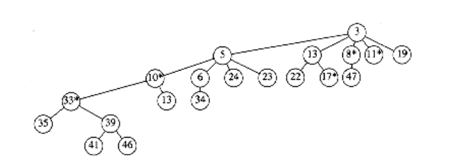
**Figure 11.19 A tree in the Fibonacci heap prior to decreasing 39 to 12**


**Figure 11.20 The resulting segment of the Fibonacci heap after the decrease_key operation**

### Proof of the Time Bound

Recall that the reason for marking nodes is that we needed to bound the rank (number of children) r of any node. We will now show that any node with n descendants has rank O(log n).

*LEMMA 11.1.*

*Let x be any node in a Fibonacci heap. Let ci be the ith youngest child of x. Then the rank of ci is at least i - 2.*

*PROOF:*

At the time when ci was linked to x, x already had (older) children c1, c2, . . . , ci-1. Thus, x had at least i - 1 children when it linked to ci. Since nodes are only linked if they have the same rank, it follows that at the time that ci was linked to x, ci had at least i - 1 children.Since that time, it could have lost at most one child, or else it would have been cut from x. Thus, ci has at least i - 2 children.

*From*

Lemma 11.1, it is easy to show that any node of rank r must have a lot of descendants.

*LEMMA 11.2.*

Let Fk be the Fibonacci numbers defined (in Section 1.2) by F0 = 1, F1 = 1, and Fk = Fk-1 + Fk-2.

Any node of rank r 1 has at least Fr+1 descendants (including itself).

*PROOF:*

Let Sr be the smallest tree of rank r. Clearly, S0 = 1 and S1 = 2. By Lemma 11.1, a tree of rank r must have subtrees of rank at least r - 2, r - 3, . . . , 1, and 0, plus another subtree, which has at least one node. Along with the root of Sr itself, this gives a minimum value for Sr>1 of

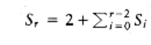

- It is easy to show that Sr = Fr+1 (Exercise 1.9a).

Because it is well known that the Fibonacci numbers grow exponentially, it immediately follows that any node with s descendants has rank at most O(log s). Thus, we have

LEMMA 11.3.

The rank of any node in a Fibonacci heap is O(log n).

*PROOF:*

*Immediate from the discussion above.*

If all we were concerned about was the time bounds for the merge, insert, and delete_min operations, then we could stop here and prove the desired amortized time bounds. Of course, the whole point of Fibonacci heaps is to obtain an O(1) time bound for decrease_key as well.

The actual time required for a decrease_key operation is 1 plus the number of cascading cuts that are performed during the operation. Since the number of cascading cuts could be much more than O (1), we will need to pay for this with a loss in potential. If we look at

Figure 11.20, we see that the number of trees actually increases with each cascading cut, so we will have to enhance the potential function to include something that decreases during cascading cuts. Notice that we cannot just throw out the number of trees from the potential function, since then we will not be able to prove the time bound for the merge operation. Looking at Figure 11.20 again, we see that a cascading cut causes a decrease in the number of marked nodes, because each node that is the victim of a cascading cut becomes an unmarked root. Since each cascading cut costs 1 unit of actual time and increases the tree potential by 1, we will count each marked node as two units of potential. This way, we have a chance of canceling out the number of cascading cuts.

*THEOREM 11.4.*

*The amortized time bounds for Fibonacci heaps are O(1) for insert, merge, and decrease_key and O (log n) for delete_min.*

*PROOF:*

The potential is the number of trees in the collection of Fibonacci heaps plus twice the number of marked nodes. As usual, the initial potential is 0 and is always nonnegative. Thus, over a sequence of operations, the total amortized time is an upper bound on the total actual time.

For the *merge* operation, the actual time is constant, and the number of trees and marked nodes is unchanged, so, by

Equation (11.2), the amortized time is O(1).

For the *insert* operation, the actual time is constant, the number of trees increases by 1, and the number of marked nodes is unchanged. Thus, the potential increases by at most 1, so the amortized time is O(1).

For the *delete_min* operation, let r be the rank of the tree that contains the minimum element, and let T be the number of trees before the operation. To perform a delete_min, we once again split the children of a tree, creating an additional r new trees. Notice that, although this can remove marked nodes (by making them unmarked roots), this cannot create any additional marked nodes. These r new trees, along with the other T trees, must now be merged, at a cost of T + r + log n = T + O(log n), by Lemma 11.3. Since there can be at most O(log n) trees, and the number of marked nodes cannot increase, the potential change is at most O(log n) - T. Adding the actual time and potential change gives the O(log n) amortized bound for delete_min.

Finally, for the decrease_key operation, let C be the number of cascading cuts. The actual cost of a decrease_key is C + 1, which is the total number of cuts performed. The first (noncascading) cut creates a new tree and thus increases the potential by 1. Each cascading cut creates a new tree, but converts a marked node to an unmarked (root) node, for a net loss of one unit per cascading cut. The last cut also can convert an unmarked node (in Figure 11.20 it is node 5) into a marked node, thus increasing the potential by 2. The total change in potential is thus 3 - C. Adding the actual time and the potential change gives a total of 4, which is O (1).

## Splay Trees

As a final example, we analyze the running time of splay trees. Recall, from Chapter 4, that after an access of some item x is performed, a splaying step moves x to the root by a series of three operations: zig, zig-zag, and zig-zig. These tree rotations are shown in Figure 11.21. We adopt the convention that if a tree rotation is being performed at node x, then prior to the rotation p is its parent and g is its grandparent (if x is not the child of the root).

Recall that the time required for any tree operation on node x is proportional to the number of nodes on the path from the root to x. If we count each zig operation as one rotation and each zig-zig or zig-zag as two rotations, then the cost of any access is equal to 1 plus the number of rotations.

In order to show an O(log n) amortized bound for the splaying step, we need a potential function which can increase by at most O(log n) over the entire splaying step, but which will also cancel out the number of rotations performed during the step. It is not at all easy to find a potential function that satisfies these criteria. A simple first guess at a potential function might be the sum of the depths of all the nodes in the tree. This does not work, because the potential can increase by (n) during an access. A canonical example of this occurs when elements are inserted in sequential order.

- A potential function , which does work, is defined as
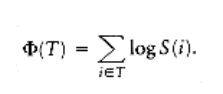

S(i) represents the number of descendants of i (including i itself). The potential function is the sum, over all nodes i in the tree T, of the logarithm of S(i).

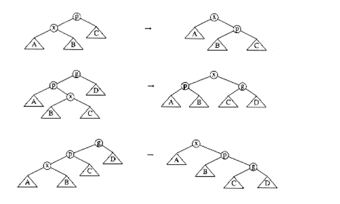
*Figure 11.21 zig, zig-zag, and zig-zig operations; each has a symmetric case (not shown)*

To simplify the notation, we will define

R(i) = logS(i).

This makes
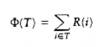

R(i) represents the rank of node i. The terminology is similar to what we used in the analysis of the disjoint set algorithm, binomial queues, and Fibonacci heaps. In all these data structures, the meaning of rank is somewhat different, but is generally meant to be on the order (magnitude) of the logarithm of the size of the tree. For a tree T with n nodes, the rank of the root is simply R(T) = log n. Using the sum of ranks as a potential function is similar to using the sum of heights as a potential function. The important difference is that while a rotation can change the heights of many nodes in the tree, only x, p, and g can have their ranks changed.

Before proving the main theorem, we need the following lemma.

*LEMMA 11.4.*

If a + b c, and a and b are both positive integers, then

log a + log b 2 log c - 2.

*PROOF:*

By the arithmetic-geometric mean inequality,

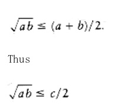

Squaring both sides gives
```
ab c2/4
```
Taking logarithms of both sides proves the lemma.

With the preliminaries taken care of, we are ready to prove the main theorem.

*THEOREM 11.5.*

The amortized time to splay a tree with root T at node x is at most 3(R(T) - R(x)) + 1 = O(log n).

*PROOF:*

The potential function is the sum of the ranks of the nodes in T.

If x is the root of T, then there are no rotations, so there is no potential change. The actual time is 1 to access the node, thus the amortized time is 1 and the theorem is true. Thus, we may assume that there is at least one rotation.

For any splaying step, let Ri(x) and Si(x) be the rank and size of x before the step, and let Rf (x) and Sf(x) be the rank and size of x immediately after the splaying step. We will show that the amortized time required for a zig is at most 3(Rf(x) - Ri(x)) + 1 and that the amortized time for either a zig-zag or zig-zig is at most 3(Rf(x) - Ri(x)). We will show that when we add over all steps, the sum telescopes to the desired time bound.

*Zig step:* For the zig step, the actual time is 1 (for the single rotation), and the potential change is Rf(x) + Rf(p) - Ri(x) - Ri(p). Notice that the potential change is easy to compute,because only x and p's trees change size. Thus
```
ATzig = 1 + Rf(x) + Rf(p) - Ri(x) - Ri(p)

```

From

Figure 11.21 we see that Si(p) Sf(p); thus, it follows that Ri(p) Rf(p). Thus,
```
ATzig 1 + Rf(x) - Ri(x).
```

Since Sf(x) Si(x), it follows that Rf(x) - Ri(x) 0, so we may increase the right side,obtaining
```
ATzig 1 + 3(Rf(x) - Ri(x)).
```

*Zig-zag step:* For the zig-zag case, the actual cost is 2, and the potential change is Rf(x) + Rf (p) + Rf(g) - Ri(x) - Ri(p) - Ri(g). This gives an amortized time bound of
```
ATzig-zag = 2 + Rf(x) + Rf(p) + Rf(g) - Ri(x) - Ri(p) - Ri(g).
```

From Figure 11.21 we see that Sf(x) = Si(g), so their ranks must be equal. Thus, we obtain
```
ATzig-zag = 2 + Rf(p) + Rf(g) - Ri(x) - Ri(p).
```

We also see that Si(p) Si(x). Consequently, Ri(x) Ri(p). Making this substitution

gives
```
ATzig-zag 2 + Rf(p) + Rf(g) - 2Ri(x).
```

From Figure 11.21 we see that Sf(p) + Sf(g) Sf(x). If we apply Lemma 11.4, we obtain
```
log Sf(p) + log Sf(g) 2 log Sf(x) - 2.
```
By definition of rank, this becomes
```
Rf(p) + Rf(g) 2Rf(x) - 2.
```
Substituting this we obtain
```
ATzig-zag 2Rf(x) - 2Ri(x)

2(Rf(x) - Ri(x))
```

Since Rf(x) Ri(x), we obtain

```
ATzig-zag 3(Rf(x) - Ri(x)).
```

*Zig-zig step:*

 The third case is the zig-zig. The proof of this case is very similar to the zig-zag case. The important inequalities are Rf(x) _= Ri_(g), Rf(x) Rf(p), Ri(x) Ri(p), and Si(x) + Sf(g) Sf(x). We leave the details as Exercise 11.8.
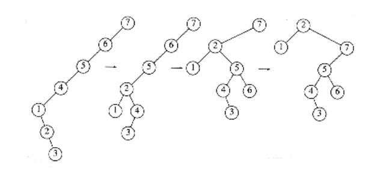
**Figure 11.22 The splaying steps involved in splaying at node 2**

The amortized cost of an entire splay is the sum of the amortized costs of each splay step.

Figure 11.22 shows the steps which are performed in a splay at node 2. Let R1 (2), R2(2), R3(2),and R4(2) be the rank of node 2 in each of the four trees. The cost of the first step, which is a zig-zag, is at most 3(R2(2) - R1 (2)). The cost of the second step, which is a zig-zig, is 3(R3 (2) - R2(2)). The last step is a zig and has a cost no larger than 3(R4(2) - R3(2)) + 1. The total cost thus telescopes to 3(R4(2) - R1(2)) + 1.

In general, by adding up the amortized costs of all the rotations, of which at most one can be a zig, we see that the total amortized cost to splay at node x is at most 3(Rf(x) - Ri(x)) + 1,where Ri(x) is the rank of x before the first splaying step and Rf(x) is the rank of x after the last splaying step. Since the last splaying step leaves x at the root, we obtain an amortized bound of 3(Rf(T) - Ri(x)) + 1, which is O(log n).

Because every operation on a splay tree requires a splay, the amortized cost of any operation is within a constant factor of the amortized cost of a splay. Thus, all splay tree operations take O (log n) amortized time. By using a more general potential function, it is possible to show that splay trees have several remarkable properties. This is discussed in more detail in the exercises.

## Summary

In this chapter, we have seen how an amortized analysis can be used to apportion charges among operations. To perform the analysis, we invent a fictitious potential function. The potential function measures the state of the system. A high-potential data structure is volatile, having been built on relatively cheap operations. When the expensive bill comes for an operation, it is paid for by the savings of previous operations. One can view potential as standing for *potential for disaster* , in that very expensive operations can only occur when the data structure has a high potential and has used considerably less time than has been allocated.

Low potential in a data structure means that the cost of each operation has been roughly equal to the amount allocated for it. Negative potential means debt-- more time has been spent than has been allocated, so the allocated (or amortized) time is not a meaningful bound.

As expressed by Equation (11.2), the amortized time for an operation is equal to the sum of the actual time and potential change. Taken over an entire sequence of operations, the amortized time for the sequence is equal to the total sequence time plus the net change in potential. As long as this net change is positive, then the amortized bound provides an upper bound for the actual time spent and is meaningful.

The keys to choosing a potential function are to guarantee that the minimum potential occurs at the beginning of the algorithm, and to have the potential increase for cheap operations and decrease for expensive operations. It is important that the excess or saved time be measured by an opposite change in potential. Unfortunately, this is sometimes easier said than done.

## Exercises

11.1 When do m consecutive insertions into a binomial queue take less than 2m time units?

11.2 Suppose a binomial queue of n = 2k - 1 elements is built. Alternately perform m insert and delete_min pairs. Clearly, each operation takes O(log n) time. Why does this not contradict the amortized bound of O(1) for insertion?

11.3 Show that the amortized bound of O(log n) for the skew heap operations described in the text cannot be converted to a worst-case bound, by giving a sequence of operations that lead to a merge requiring (n) time.

11.4 Show how to merge two skew heaps with one top-down pass and reduce the merge cost to O(1) amortized time.

11.5 Extend skew heaps to support the decrease_key operation in O(log n) amortized time.

11.6 Implement Fibonacci heaps and compare their performance with binary heaps when used in Dijkstra's algorithm.

11.7 A standard implementation of Fibonacci heaps requires four pointers per node (parent, child, and two siblings). Show how to reduce the number of pointers, at the cost of at most a constant factor in the running time.

11.8 Show that the amortized time of a zig-zig splay is at most 3(Rf(x) - Ri(x)).

11.9 By changing the potential function, it is possible to prove different bounds for splaying. Let the weight function W(i) be some function assigned to each node in the tree, and let S(i) be the sum of the weights of all the nodes in the subtree rooted at i, including i itself. The special case W(i) = 1 for all nodes corresponds to the function used in the proof of the splaying bound. Let n be the number of nodes in the tree, and let m be the number of accesses. Prove the following two theorems:

a. The total access time is O(m + (m + n)log n).

*b. If qi is the number of times that item i is accessed, and qi > 0 for all i, then the total access time is
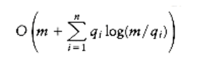

11.10 a. Show how to implement the merge operation on splay trees so that a sequence of n -1 merges starting from n single-element trees takes O(n log2 n) time.

*b. Improve the bound to O(n log n).

11.11 In Chapter 5, we described rehasing: When a table becomes more than half full, a new table twice as large is constructed, and the entire old table is rehashed. Give a formal amortized analysis, with potential function, to show that the amortized cost of an insertion is still O(1).

11.12 Show that if deletions are not allowed, then any sequence of m insertions into an n node 2- 3 tree produces O(m + n) node splits.

11.13 A deque with heap order is a data structure consisting of a list of items, on which the following operations are possible:
```
push(x,d): Insert item x on the front end of deque d.

pop(d): Remove the front item from deque d and return it.

inject(x,d): Insert item x on the rear end of deque d.

eject(d): Remove the rear item from deque d and return it.

find _min(d): Return the smallest item from deque d (breaking ties arbitrarily).
```
a. Describe how to support these operations in constant amortized time per operation.

b. Describe how to support these operations in constant worst-case time per operation.

## References

An excellent survey of amortized analysis is provided in [9].

Most of the references below duplicate citations in earlier chapters. We cite them again for convenience and completeness. Binomial queues were first described in [10] and analyzed in [1]. Solutions to 11.3 and 11.4 appear in [8]. Fibonacci heaps are described in [3]. Exercise 11.9a shows that splay trees are optimal, to within a constant factor of the the best static search trees. 11.9b shows that splay trees are optimal, to within a constant factor of the best optimal search trees. These, as well as two other strong results, are proved in the original splay tree paper [6].

The merge operation for splay trees is described in [5]. Exercise 11.12 is solved, with an implicit use of amortization, in [2]. The paper also shows how to merge 2-3 trees efficiently. A solution to 11.13 can be found in [4]. 

Amortized analysis is used in [7] to design an on-line algorithm that processes a series of queries in time only a constant factor larger than any off-line algorithm in its class.

1. M. R. Brown, "Implementation and Analysis of Binomial Queue Algorithms," SIAM Journal on Computing 7 (1978), 298-319.

2. M. R. Brown and R. E. Tarjan, "Design and Analysis of a Data Structure for Representing Sorted Lists," SIAM Journal on Computing 9 (1980), 594-614.

3. M. L. Fredman and R. E. Tarjan, "Fibonacci Heaps and Their Uses in Improved Network Optimization Algorithms," Journal of the ACM 34 (1987), 596-615.

4. H. Gajewska and R. E. Tarjan, "Deques with Heap Order," Information Processing Letters 22 (1986), 197-200.

5. G. Port and A. Moffat, "A Fast Algorithm for Melding Splay Trees," Proceedings of the First Workshop on Algorithms and Data Structures, 1989, 450-459.

6. D. D. Sleator and R. E. Tarjan, "Self-adjusting Binary Search Trees," Journal of the ACM 32 (1985), 652-686.

7. D. D. Sleator and R. E. Tarjan, "Amortized Efficiency of List Update and Paging Rules," Communications of the ACM 28 (1985), 202-208.

8. D. D. Sleator and R. E. Tarjan, "Self-adjusting Heaps," SIAM Journal on Computing 15 (1986), 52-69.

9. R. E. Tarjan, "Amortized Computational Complexity," SIAM Journal on Algebraic and Discrete Methods 6 (1985), 306-318.

10. J. Vuillemin, "A Data Structure for Manipulating Priority Queues," Communications of the ACM 21 (1978), 309-314.
