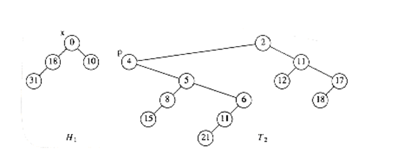
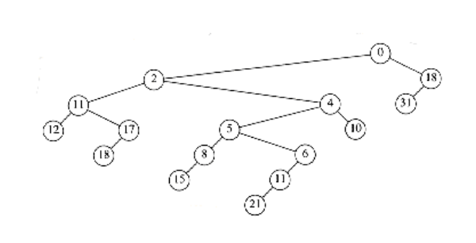
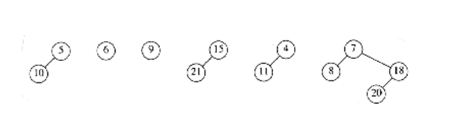
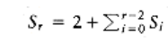

# Fibonacci Heaps

In Section 9.3.2, we showed how to use priority queues to improve on the naïve O(|V|2) running time of Dijkstra's shortest-path algorithm. The important observation was that the running time was dominated by|E|decrease_key operations and |V| insert and delete_min operations. These operations take place on a set of size at most |V|. By using a binary heap, all these operations take O(log |V|) time, so the resulting bound for Dijkstra's algorithm can be reduced to O(|E| log |V|).

In order to lower this time bound, the time required to perform the decrease_key operation must be improved. d-heaps, which were described in Section 6.5, give an O(logd |V|) time bound for the *delete_min* operation as well as for insert, but an O(d logd |V|) bound for delete_min. By choosing d to balance the costs of |E| decrease_key operations with |V| delete_min operations, and remembering that d must always be at least 2, we see that a good choice for d is

```
*d = max(2, E / V).*
```
This improves the time bound for Dijkstra's algorithm to O(E log(2+ E / V) V).

The *Fibonacci* heap is a data structure that supports all the basic heap operations in O(1) amortized time, with the exception of delete_min and delete, which take O (log n) amortized time. It immediately follows that the heap operations in Dijkstra's algorithm will require a total of O (|E| + |V| log |V|) time.

Fibonacci heaps* generalize binomial queues by adding two new concepts:

The name comes from a property of this data structure, which we will prove later in the section.

A different implementation of decrease_key: The method we have seen before is to percolate the element up toward the root. It does not seem reasonable to expect an O(1) amortized bound for this strategy, so a new method is needed.

Lazy merging: Two heaps are merged only when it is required to do so. This is similar to lazy deletion. For lazy merging, merges are cheap, but because lazy merging does not actually combine trees, the delete_min operation could encounter lots of trees, making that operation expensive. Any one delete_min could take linear time, but it is always possible to charge the time to previous merge operations. In particular, an expensive delete_min must have been preceded by a large number of unduly cheap merges, which have been able to store up extra potential.

### Cutting Nodes in Leftist Heaps

In binary heaps, the decrease_key operation is implemented by lowering the value at a node and then percolating it up toward the root until heap order is established. In the worst case, this can take O(log n) time, which is the length of the longest path toward the root in a balanced tree.

This strategy does not work if the tree that represents the priority queue does not have O(log n) depth. As an example, if this strategy is applied to leftist heaps, then the *decrease_key*operation could take (n) time, as the example in Figure 11.9 shows.

We see that for leftist heaps, another strategy is needed for the decrease_key operation. Our example will be the leftist heap in Figure 11.10. Suppose we want to decrease the key with value 9 down to 0. If we make the change, we find that we have created a violation of heap order, which is indicated by a dashed line in Figure 11.11.


**Figure 11.9 Decreasing n - 1 to 0 via percolate up would take (n) time**

**Figure 11.10 Sample leftist heap H**


**Figure 11.11 Decreasing 9 to 0 creates a heap order violation**


**Figure 11.12 The two trees after the cut**

We do not want to percolate the 0 to the root, because, as we have seen, there are cases where this could be expensive. The solution is to cut the heap along the dashed line, thus creating two trees, and then merge the two trees back into one. Let x be the node to which the decrease_key operation is being applied, and let p be its parent. After the cut, we have two trees, namely, H1 with root x, and T2, which is the original tree with H1 removed. The situation is shown in Figure 11.12.

If these two trees were both leftist heaps, then they could be merged in O (log n) time, and we would be done. It is easy to see that H1 is a leftist heap, since none of its nodes have had any changes in their descendants. Thus, since all of its nodes originally satisfied the leftist property, they still must.

Nevertheless, it seems that this scheme will not work, because T2 is not necessarily leftist.However, it is easy to reinstate the leftist heap property by using two observations:

- Only nodes on the path from p to the root of T2 can be in violation of the leftist heap property these can be fixed by swapping children.

- Since the maximum right path length has at most log(n + 1) nodes, we only need to check the first log(n + 1) nodes on the path from p to the root of T2. Figure 11.13 shows H1 and T2 after T2 is converted to a leftist heap.


**Figure 11.13 T2 converted to the leftist heap H2**


**Figure 11.14 decrease_key (H,x,9) completed by merging Hl and H2**

Because we can convert T2 to the leftist heap H2 in O (log n) steps, and then merge H1 and H2, we have an O (log n) algorithm for performing the decrease_key operation in leftist heaps. The heap that results in our example is shown in Figure 11.14.

### Lazy Merging for Binomial Queues

The second idea that is used by Fibonacci heaps is lazy merging. We will apply this idea to binomial queues and show that the amortized time to perform a merge operation (as well as insertion, which is a special case) is O(1). The amortized time for delete_min will still be O (log n).

The idea is as follows: To merge two binomial queues, merely concatenate the two lists of binomial trees, creating a new binomial queue. This new queue may have several trees of the same size, so it violates the binomial queue property. We will call this a lazy binomial queue in order to maintain consistency. This is a fast operation, which always takes constant (worst-case) time. As before, an insertion is done by creating a one-node binomial queue and merging. The difference is that the *merge* is lazy.

The *delete_min* operation is much more painful, because it is where we finally convert the lazy binomial queue back into a standard binomial queue, but, as we will show, it is still O (log n) amortized time-but not O(log n) worst-case time, as before. To perform a delete_min, we find (and eventually return) the minimum element. As before, we delete it from the queue, making each of its children new trees. We then merge all the trees into a binomial queue by merging two equal- sized trees until it is no longer possible.

As an example, Figure 11.15 shows a lazy binomial queue. In a lazy binomial queue, there can be more than one tree of the same size. We can tell the size of a tree by examining the root's rank field, which gives the number of children (and thus implicitly the type of tree). To perform the delete_min, we remove the smallest element, as before, and obtain the tree in Figure 11.16.


**Figure 11.15 Lazy binomial queue**


**Figure 11.16 Lazy binomial queue after removing the smallest element (3)**

We now have to merge all the trees and obtain a standard binomial queue. A standard binomial queue has at most one tree of each rank. In order to do this efficiently, we must be able to perform the merge in time proportional to the number of trees present (T) (or log n, whichever is larger). To do this, we form an array of lists, L0, L1, . . . , LRmax_+_ 1, where Rmax is the rank of the largest tree. Each list Lr contains all of the trees of rank r. The procedure in Figure 11.17 is then applied.

Each time through the loop, at lines 3 through 5, the total number of trees is reduced by 1. This means that this part of the code, which takes constant time per execution, can only be performed T - 1 times, where T is the number of trees. The for loop counters, and tests at the end of the while loop take O (log n) time, so the running time is O (T + log n), as required. Figure 11.18 shows the execution of this algorithm on the previous collection of binomial trees.

**Amortized Analysis of Lazy Binomial Queues** 

Amortized Analysis of Lazy Binomial Queues To carry out the amortized analysis of lazy binomial queues, we will use the same potential function that was used for standard binomial queues. Thus, the potential of a lazy binomial queue is the number of trees.

THEOREM 11.3.

*The amortized running times of merge and insert are both O(1) for lazy binomial queues. The amortized running time of delete_min is O(log n).*

PROOF:

The potential function is the number of trees in the collection of binomial queues. The initial potential is 0, and the potential is always nonnegative. Thus, over a sequence of operations, the total amortized time is an upper bound on the total actual time.
```c
/*1*/ for(r = 0; r <= log n ; r++)

/*2*/ while (|Lr| 2)
{

/*3*/ remove two trees from Lr;

/*4*/ merge the two trees into a new tree;

/*5*/ add the new tree to Lr+1 ;

}

``` 
**Figure 11.17 Procedure to reinstate a binomial queue**


**Figure 11.18 Combining the binomial trees into a binomial queue**

For the merge operation, the actual time is constant, and the number of trees in the collection of binomial queues is unchanged, so, by Equation (11.2), the amortized time is O(1).

For the *insert* operation, the actual time is constant, and the number of trees can increase by at most 1, so the amortized time is O(1).

The *delete_min* operation is more complicated. Let r be the rank of the tree that contains the minimum element, and let T be the number of trees. Thus, the potential at the start of the delete_min operation is T. To perform a delete_min, the children of the smallest node are split off into separate trees. This creates T + r trees, which must be merged into a standard binomial queue. The actual time to perform this is T + r + log n, if we ignore the constant in the Big-Oh notation, by the argument above.* On the other hand, once this is done, there can be at most log n trees remaining, so the potential function can increase by at most (log n) - T. Adding the actual time and the change in potential gives an amortized bound of 2 log n + r. Since all the trees are binomial trees, we know that r log n. Thus we arrive at an O(log n) amortized time bound for the delete_min operation.

*We can do this because we can place the constant implied by the Big-Oh notation in the potential function and still get the cancellation of terms, which is needed in the proof.

### The Fibonacci Heap Operations

As we mentioned before, the Fibonacci heap combines the leftist heap decrease_key operation with the lazy binomial queue merge operation. Unfortunately, we cannot use both operations without a slight modification. The problem is that if arbitrary cuts are made in the binomial trees, the resulting forest will no longer be a collection of binomial trees. Because of this, it will no longer be true that the rank of every tree is at most log n . Since the amortized bound for delete_min in lazy binomial queues was shown to be 2 log n + r, we need r = O(log n) for the delete_min bound to hold.

In order to ensure that r = O(log n), we apply the following rules to all non-root nodes:

- Mark a (nonroot) node the first time that it loses a child (because of a cut).

- If a marked node loses another child, then cut it from its parent. This node now becomes the root of a separate tree and is no longer marked. This is called a cascading cut, because several of these could occur in one decrease_key operation.

Figure 11.19 shows one tree in a Fibonacci heap prior to a decrease_key operation.

When the node with key 39 is changed to 12, the heap order is violated. Therefore, the node is cut from its parent, becoming the root of a new tree. Since the node containing 33 is marked, this is its second lost child, and thus it is cut from its parent (10). Now 10 has lost its second child, so it is cut from 5. The process stops here, since 5 was unmarked. 5 is now marked. The result is shown in Figure 11.20.

Notice that 10 and 33, which used to be marked nodes, are no longer marked, because they are now root nodes. This will be a crucial observation in our proof of the time bound.


**Figure 11.19 A tree in the Fibonacci heap prior to decreasing 39 to 12**


**Figure 11.20 The resulting segment of the Fibonacci heap after the decrease_key operation**

### Proof of the Time Bound

Recall that the reason for marking nodes is that we needed to bound the rank (number of children) r of any node. We will now show that any node with n descendants has rank O(log n).

*LEMMA 11.1.*

*Let x be any node in a Fibonacci heap. Let ci be the ith youngest child of x. Then the rank of ci is at least i - 2.*

*PROOF:*

At the time when ci was linked to x, x already had (older) children c1, c2, . . . , ci-1. Thus, x had at least i - 1 children when it linked to ci. Since nodes are only linked if they have the same rank, it follows that at the time that ci was linked to x, ci had at least i - 1 children.Since that time, it could have lost at most one child, or else it would have been cut from x. Thus, ci has at least i - 2 children.

*From*

Lemma 11.1, it is easy to show that any node of rank r must have a lot of descendants.

*LEMMA 11.2.*

Let Fk be the Fibonacci numbers defined (in Section 1.2) by F0 = 1, F1 = 1, and Fk = Fk-1 + Fk-2.

Any node of rank r 1 has at least Fr+1 descendants (including itself).

*PROOF:*

Let Sr be the smallest tree of rank r. Clearly, S0 = 1 and S1 = 2. By Lemma 11.1, a tree of rank r must have subtrees of rank at least r - 2, r - 3, . . . , 1, and 0, plus another subtree, which has at least one node. Along with the root of Sr itself, this gives a minimum value for Sr>1 of



- It is easy to show that Sr = Fr+1 (Exercise 1.9a).

Because it is well known that the Fibonacci numbers grow exponentially, it immediately follows that any node with s descendants has rank at most O(log s). Thus, we have

LEMMA 11.3.

The rank of any node in a Fibonacci heap is O(log n).

*PROOF:*

*Immediate from the discussion above.*

If all we were concerned about was the time bounds for the merge, insert, and delete_min operations, then we could stop here and prove the desired amortized time bounds. Of course, the whole point of Fibonacci heaps is to obtain an O(1) time bound for decrease_key as well.

The actual time required for a decrease_key operation is 1 plus the number of cascading cuts that are performed during the operation. Since the number of cascading cuts could be much more than O (1), we will need to pay for this with a loss in potential. If we look at

Figure 11.20, we see that the number of trees actually increases with each cascading cut, so we will have to enhance the potential function to include something that decreases during cascading cuts. Notice that we cannot just throw out the number of trees from the potential function, since then we will not be able to prove the time bound for the merge operation. Looking at Figure 11.20 again, we see that a cascading cut causes a decrease in the number of marked nodes, because each node that is the victim of a cascading cut becomes an unmarked root. Since each cascading cut costs 1 unit of actual time and increases the tree potential by 1, we will count each marked node as two units of potential. This way, we have a chance of canceling out the number of cascading cuts.

*THEOREM 11.4.*

*The amortized time bounds for Fibonacci heaps are O(1) for insert, merge, and decrease_key and O (log n) for delete_min.*

*PROOF:*

The potential is the number of trees in the collection of Fibonacci heaps plus twice the number of marked nodes. As usual, the initial potential is 0 and is always nonnegative. Thus, over a sequence of operations, the total amortized time is an upper bound on the total actual time.

For the *merge* operation, the actual time is constant, and the number of trees and marked nodes is unchanged, so, by

Equation (11.2), the amortized time is O(1).

For the *insert* operation, the actual time is constant, the number of trees increases by 1, and the number of marked nodes is unchanged. Thus, the potential increases by at most 1, so the amortized time is O(1).

For the *delete_min* operation, let r be the rank of the tree that contains the minimum element, and let T be the number of trees before the operation. To perform a delete_min, we once again split the children of a tree, creating an additional r new trees. Notice that, although this can remove marked nodes (by making them unmarked roots), this cannot create any additional marked nodes. These r new trees, along with the other T trees, must now be merged, at a cost of T + r + log n = T + O(log n), by Lemma 11.3. Since there can be at most O(log n) trees, and the number of marked nodes cannot increase, the potential change is at most O(log n) - T. Adding the actual time and potential change gives the O(log n) amortized bound for delete_min.

Finally, for the decrease_key operation, let C be the number of cascading cuts. The actual cost of a decrease_key is C + 1, which is the total number of cuts performed. The first (noncascading) cut creates a new tree and thus increases the potential by 1. Each cascading cut creates a new tree, but converts a marked node to an unmarked (root) node, for a net loss of one unit per cascading cut. The last cut also can convert an unmarked node (in Figure 11.20 it is node 5) into a marked node, thus increasing the potential by 2. The total change in potential is thus 3 - C. Adding the actual time and the potential change gives a total of 4, which is O (1).