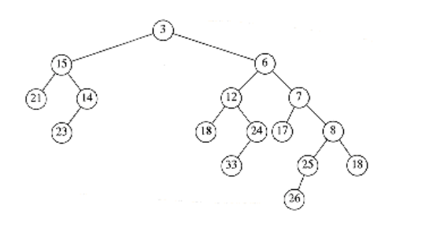

# Skew Heaps

The analysis of binomial queues is a fairly easy example of an amortized analysis. We now look at skew heaps. As is common with many of our examples, once the right potential function is found, the analysis is easy. The difficult part is choosing a meaningful potential function.

Recall that for skew heaps, the key operation is merging. To merge two skew heaps, we merge their right paths and make this the new left path. For each node on the new path, except the last, the old left subtree is attached as the right subtree. The last node on the new left path is known to not have a right subtree, so it is silly to give it one. The bound does not depend on this exception, and if the routine is coded recursively, this is what will happen naturally. Figure 11.6 shows the result of merging two skew heaps.

Suppose we have two heaps, H1 and H2, and there are r1 and r2 nodes on their respective right paths. Then the actual time to perform the merge is proportional to r1 + r2, so we will drop the Big-Oh notation and charge one unit of time for each node on the paths. Since the heaps have no structure, it is possible that all the nodes in both heaps lie on the right path, and this would give a (n) worst-case bound to merge the heaps (Exercise 11.3 asks you to construct an example). We will show that the amortized time to merge two skew heaps is O(log n).

**Figure 11.6 Merging of two skew heaps**

What is needed is some sort of a potential function that captures the effect of skew heap operations. Recall that the effect of a merge is that every node on the right path is moved to the left path, and its old left child becomes the new right child. One idea might be to classify each node as a right node or left node, depending on whether or not it is a right child, and use the number of right nodes as a potential function. Although the potential is initially 0 and always nonnegative, the problem is that the potential does not decrease after a merge and thus does not adequately reflect the savings in the data structure. The result is that this potential function cannot be used to prove the desired bound.

A similar idea is to classify nodes as either heavy or light, depending on whether or not the right subtree of any node has more nodes than the left subtree.

**DEFINITION**: A node p is heavy if the number of descendants of p's right subtree is at least half of the number of descendants of p, and light otherwise. Note that the number of descendants of a node includes the node itself.

As an example, Figure 11.7 shows a skew heap. The nodes with keys 15, 3, 6, 12, and 7 are heavy,and all other nodes are light. The potential function we will use is the number of heavy nodes in the (collection) of heaps. This seems like a good choice, because a long right path will contain an inordinate number of heavy nodes. Because nodes on this path have their children swapped, these nodes will be converted to light nodes as a result of the merge.

THEOREM 11.2.

*The amortized time to merge two skew heaps is O(log n).*

PROOF:

Let H1 and H2 be the two heaps, with n1 and n2 nodes respectively. Suppose the right path of H1 has l1 light nodes and h1 heavy nodes, for a total of l1 + h1. Likewise, H2 has l2 light and h2 heavy nodes on its right path, for a total of l2 + h2 nodes.

**Figure 11.7 Skew heap -- heavy nodes are 3, 6, 7, 12, and 15**

**Figure 11.8 Change in heavy/light status after a merge**

If we adopt the convention that the cost of merging two skew heaps is the total number of nodes on their right paths, then the actual time to perform the merge is l1 + l2 + h1 + h2. Now the only nodes whose heavy/light status can change are nodes that are initially on the right path (and wind up on the left path), since no other nodes have their subtrees altered. This is shown by the example in Figure 11.8.

If a heavy node is initially on the right path, then after the merge it must become a light node. The other nodes that were on the right path were light and may or may not become heavy, but since we are proving an upper bound, we will have to assume the worst, which is that they become heavy and increase the potential. Then the net change in the number of heavy nodes is at most l1 + l2 - h1 - h2. Adding the actual time and the potential change (Equation 11.2) gives an amortized bound of 2(l1 + l2).

Now we must show that l1 + l2 = O(log n). Since l1 and l2 are the number of light nodes on the original right paths, and the right subtree of a light node is less than half the size of the tree rooted at the light node, it follows directly that the number of light nodes on the right path is at most log n1 + log n2, which is O(log n).

The proof is completed by noting that the initial potential is 0 and that the potential is always nonnegative. It is important to verify this, since otherwise the amortized time does not bound the actual time and is meaningless. Since the insert and delete_min operations are basically just merges, they also have O(log n) amortized bounds.