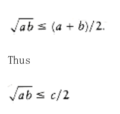

# Splay Trees

As a final example, we analyze the running time of splay trees. Recall, from Chapter 4, that after an access of some item x is performed, a splaying step moves x to the root by a series of three operations: zig, zig-zag, and zig-zig. These tree rotations are shown in Figure 11.21. We adopt the convention that if a tree rotation is being performed at node x, then prior to the rotation p is its parent and g is its grandparent (if x is not the child of the root).

Recall that the time required for any tree operation on node x is proportional to the number of nodes on the path from the root to x. If we count each zig operation as one rotation and each zig-zig or zig-zag as two rotations, then the cost of any access is equal to 1 plus the number of rotations.

In order to show an O(log n) amortized bound for the splaying step, we need a potential function which can increase by at most O(log n) over the entire splaying step, but which will also cancel out the number of rotations performed during the step. It is not at all easy to find a potential function that satisfies these criteria. A simple first guess at a potential function might be the sum of the depths of all the nodes in the tree. This does not work, because the potential can increase by (n) during an access. A canonical example of this occurs when elements are inserted in sequential order.

- A potential function , which does work, is defined as


S(i) represents the number of descendants of i (including i itself). The potential function is the sum, over all nodes i in the tree T, of the logarithm of S(i).


*Figure 11.21 zig, zig-zag, and zig-zig operations; each has a symmetric case (not shown)*

To simplify the notation, we will define

R(i) = logS(i).

This makes


R(i) represents the rank of node i. The terminology is similar to what we used in the analysis of the disjoint set algorithm, binomial queues, and Fibonacci heaps. In all these data structures, the meaning of rank is somewhat different, but is generally meant to be on the order (magnitude) of the logarithm of the size of the tree. For a tree T with n nodes, the rank of the root is simply R(T) = log n. Using the sum of ranks as a potential function is similar to using the sum of heights as a potential function. The important difference is that while a rotation can change the heights of many nodes in the tree, only x, p, and g can have their ranks changed.

Before proving the main theorem, we need the following lemma.

*LEMMA 11.4.*

If a + b c, and a and b are both positive integers, then

log a + log b 2 log c - 2.

*PROOF:*

By the arithmetic-geometric mean inequality,



Squaring both sides gives
```
ab c2/4
```
Taking logarithms of both sides proves the lemma.

With the preliminaries taken care of, we are ready to prove the main theorem.

*THEOREM 11.5.*

The amortized time to splay a tree with root T at node x is at most 3(R(T) - R(x)) + 1 = O(log n).

*PROOF:*

The potential function is the sum of the ranks of the nodes in T.

If x is the root of T, then there are no rotations, so there is no potential change. The actual time is 1 to access the node, thus the amortized time is 1 and the theorem is true. Thus, we may assume that there is at least one rotation.

For any splaying step, let Ri(x) and Si(x) be the rank and size of x before the step, and let Rf (x) and Sf(x) be the rank and size of x immediately after the splaying step. We will show that the amortized time required for a zig is at most 3(Rf(x) - Ri(x)) + 1 and that the amortized time for either a zig-zag or zig-zig is at most 3(Rf(x) - Ri(x)). We will show that when we add over all steps, the sum telescopes to the desired time bound.

*Zig step:* For the zig step, the actual time is 1 (for the single rotation), and the potential change is Rf(x) + Rf(p) - Ri(x) - Ri(p). Notice that the potential change is easy to compute,because only x and p's trees change size. Thus
```
ATzig = 1 + Rf(x) + Rf(p) - Ri(x) - Ri(p)

```

From

Figure 11.21 we see that Si(p) Sf(p); thus, it follows that Ri(p) Rf(p). Thus,
```
ATzig 1 + Rf(x) - Ri(x).
```

Since Sf(x) Si(x), it follows that Rf(x) - Ri(x) 0, so we may increase the right side,obtaining
```
ATzig 1 + 3(Rf(x) - Ri(x)).
```

*Zig-zag step:* For the zig-zag case, the actual cost is 2, and the potential change is Rf(x) + Rf (p) + Rf(g) - Ri(x) - Ri(p) - Ri(g). This gives an amortized time bound of
```
ATzig-zag = 2 + Rf(x) + Rf(p) + Rf(g) - Ri(x) - Ri(p) - Ri(g).
```

From Figure 11.21 we see that Sf(x) = Si(g), so their ranks must be equal. Thus, we obtain
```
ATzig-zag = 2 + Rf(p) + Rf(g) - Ri(x) - Ri(p).
```

We also see that Si(p) Si(x). Consequently, Ri(x) Ri(p). Making this substitution

gives
```
ATzig-zag 2 + Rf(p) + Rf(g) - 2Ri(x).
```

From Figure 11.21 we see that Sf(p) + Sf(g) Sf(x). If we apply Lemma 11.4, we obtain
```
log Sf(p) + log Sf(g) 2 log Sf(x) - 2.
```
By definition of rank, this becomes
```
Rf(p) + Rf(g) 2Rf(x) - 2.
```
Substituting this we obtain
```
ATzig-zag 2Rf(x) - 2Ri(x)

2(Rf(x) - Ri(x))
```

Since Rf(x) Ri(x), we obtain

```
ATzig-zag 3(Rf(x) - Ri(x)).
```

*Zig-zig step:*

 The third case is the zig-zig. The proof of this case is very similar to the zig-zag case. The important inequalities are Rf(x) _= Ri_(g), Rf(x) Rf(p), Ri(x) Ri(p), and Si(x) + Sf(g) Sf(x). We leave the details as Exercise 11.8.

**Figure 11.22 The splaying steps involved in splaying at node 2**

The amortized cost of an entire splay is the sum of the amortized costs of each splay step.

Figure 11.22 shows the steps which are performed in a splay at node 2. Let R1 (2), R2(2), R3(2),and R4(2) be the rank of node 2 in each of the four trees. The cost of the first step, which is a zig-zag, is at most 3(R2(2) - R1 (2)). The cost of the second step, which is a zig-zig, is 3(R3 (2) - R2(2)). The last step is a zig and has a cost no larger than 3(R4(2) - R3(2)) + 1. The total cost thus telescopes to 3(R4(2) - R1(2)) + 1.

In general, by adding up the amortized costs of all the rotations, of which at most one can be a zig, we see that the total amortized cost to splay at node x is at most 3(Rf(x) - Ri(x)) + 1,where Ri(x) is the rank of x before the first splaying step and Rf(x) is the rank of x after the last splaying step. Since the last splaying step leaves x at the root, we obtain an amortized bound of 3(Rf(T) - Ri(x)) + 1, which is O(log n).

Because every operation on a splay tree requires a splay, the amortized cost of any operation is within a constant factor of the amortized cost of a splay. Thus, all splay tree operations take O (log n) amortized time. By using a more general potential function, it is possible to show that splay trees have several remarkable properties. This is discussed in more detail in the exercises.