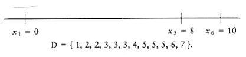
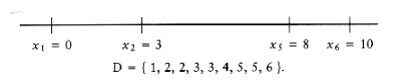
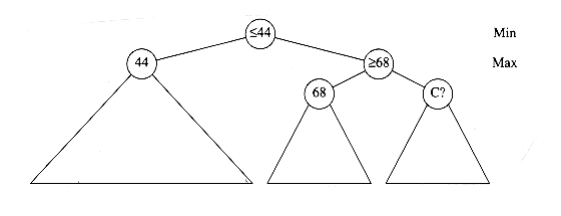

## Backtracking Algorithms

The last algorithm design technique we W~i~ll examine is backtracking. In many cases, a backtracking algorithm amounts to a clever implementation of exhaustive search, W~i~th generally unfavorable performance. This is not always the case, however, and even so, in some cases, the savings over a brute force exhaustive search can be significant. Performance is, of course, relative: An O(n2) algorithm for sorting is pretty bad, but an O(n5) algorithm for the traveling salesman (or any NP-complete) problem would be a landmark result.

A practical example of a backtracking algorithm is the problem of arranging furniture in a new house. There are many possibilities to try, but typically only a few are actually considered. Starting W~i~th no arrangement, each piece of furniture is placed in some part of the room. If all the furniture is placed and the owner is happy, then the algorithm terminates. If we reach a point where all subsequent placement of furniture is undesirable, we have to undo the last step and try an alternative. Of course, this might force another undo, and so forth. If we find that we undo all possible first steps, then there is no placement of furniture that is satisfactory. OtherW~i~se, we eventually terminate W~i~th a satisfactory arrangement. Notice that although this algorithm is essentially brute force, it does not try all possibilities directly. For instance, arrangements that consider placing the sofa in the kitchen are never tried. Many other bad arrangements are discarded early, because an undesirable subset of the arrangement is detected. The elimination of a large group of possibilities in one step is known as pruning.

We W~i~ll see two examples of backtracking algorithms. The first is a problem in computational geometry. Our second example shows how computers select moves in games, such as chess and checkers.

### The Turnpike Reconstruction Problem

Suppose we are given n points, P~1~, P~2~, . . . , pn, located on the x-ax~i~s. x~i~ is the x coordinate of pi. Let us further assume that x1 = 0 and the points are given from left to right. These n points determine n(n - 1)/2 (not necessarily unique) distances d1, d2, . . . , dn between every pair of points of the form | x~i~ - xj | (i j). It is clear that if we are given the set of points, it is easy to construct the set of distances in O(n2) time. This set W~i~ll not be sorted, but if we are W~i~lling to settle for an O(n2 log n) time bound, the distances can be sorted, too. The turnpike reconstruction problem is to reconstruct a point set from the distances. This finds applications in physics and molecular biology (see the references for pointers to more specific information). The name derives from the analogy of points to turnpike ex~i~ts on East Coast highways. Just as factoring seems harder than multiplication, the reconstruction problem seems harder than the construction problem. Nobody has been able to give an algorithm that is guaranteed to work in polynomial time. The algorithm that we W~i~ll present seems to run in O(n2log n); no counterexample to this conjecture is known, but it is still just that - a conjecture.
```c
enum test_result { PROBABLY_PRIME, DEFINITELY_COMPOSITE };

typedef enum test_result test_result;

/* Compute result = ap mod n. */

/* If at any point x2 1(mod n) is detected W~i~th x 1, x n - 1, */
  

/* then set whatnis to DEFINITELY_COMPOSITE */

/* We are assuming very large integers, so this is pseudocode. */

void power(unsigned int a, unsigned int p, unsigned int n,

unsigned int *result, test_result *whatnis)
{

unsigned int x;

/*1*/ if(p = 0) /* Base case */

/*2*/ *result = 1;

else{

/*3*/ power(a, p/2, n, &x, whatnis);

/*4*/ *result = (x * x) % n;

/* Check whether x2 1(mod n), x 1, x n - 1 */

/*5*/ if((*result = 1) && (x != 1) && (x != n-1))
/*6*/ *whatnis = DEFINITELY_COMPOSITE;

/* If p is odd, we need one more a */

/*7*/ if((p % 2) = 1)
/*8*/ *result = (*result * a) % n;

}

}

/* test_prime: Test whether n 3 is prime using one value of a */

/* repeat this procedure as many times as needed */

/* for desired error rate */

test_result

test_prime(unsigned int n)
{

unsigned int a, result;

test_result whatnis;

/*9*/ a = rand_int(2, n-2); /* choose a randomly from 2..n-2 */

/*10*/ whatnis = PROBABLY_PRIME;


/* Compute an-1 mod n */

/*11*/ power(a, n-1, n, &result, &whatnis);

/*12*/ if((result != 1) | | (whatnis = DEFINITELY_COMPOSITE))
/*13*/ return DEFINITELY_COMPOSITE;

else
/*14*/ return PROBABLY_PRIME;

}
```
**Figure 10.62 A probabilistic primality testing algorithm**

Of course, given one solution to the problem, an infinite number of others can be constructed by adding an offset to all the points. This is why we insist that the first point is anchored at 0 and that the point set that constitutes a solution is output in nondecreasing order.

Let D be the set of distances, and assume that | D | = m = n(n - 1)/2. As an example, suppose that

D = {1, 2, 2, 2, 3, 3, 3, 4, 5, 5, 5, 6, 7, 8, 10}

Since | D | = 15, we know that n = 6. We start the algorithm by setting x1 = 0. Clearly, x6 = 10,


since 10 is the largest element in D. We remove 10 from D. The points that we have placed and the remaining distances are as shown in the folloW~i~ng figure.

The largest remaining distance is 8, which means that either x2 = 2 or x5 = 8. By symmetry, we can conclude that the choice is unimportant, since either both choices lead to a solution (which are mirror images of each other), or neither do, so we can set x5 = 8 W~i~thout affecting the solution. We then remove the distances x6 - x5 = 2 and x5 - x1 = 8 from D, obtaining


The next step is not obvious. Since 7 is the largest value in D, either x4 = 7 or x2 = 3. If x4 = 7, then the distances x6 - 7 = 3 and x5 - 7 = 1 must also be present in D. A quick check shows that indeed they are. On the other hand, if we set x2 = 3, then 3 - x1 = 3 and x5 - 3 = 5 must be present in D. These distances are also in D, so we have no guidance on which choice to make. Thus, we try one and see if it leads to a solution. If it turns out that it does not, we can come back and try the other. Trying the first choice, we set x4 = 7, which leaves


At this point, we have x1 = 0, x4 = 7, x5 = 8, and x6 = 10. Now the largest distance is 6, so either x3 = 6 or x2 = 4. But if x3 = 6, then x4 - x3 = 1, which is impossible, since 1 is no longer in D. On the other hand, if x2 = 4 then x2 - x0 = 4, and x5 - x2 = 4. This is also impossible, since 4 only appears once in D. Thus, this line of reasoning leaves no solution, so we backtrack. 

Since x4 = 7 failed to produce a solution, we try x2 = 3. If this also fails, we give up and report no solution. We now have


Once again, we have to choose between x4 = 6 and x3 = 4. x3 = 4 is impossible, because D only has one occurrence of 4, and two would be implied by this choice. x4 = 6 is possible, so we obtaining


The only remaining choice is to assign x3 = 5; this works because it leaves D empty, and so we have a solution.


Figure 10.63 shows a decision tree representing the actions taken to arrive at the solution.

Instead of labeling the branches, we have placed the labels in the branches' destination nodes. A node W~i~th an asterisk indicates that the points chosen are inconsistent W~i~th the given distances; nodes W~i~th two asterisks have only impossible nodes as children, and thus represent an incorrect path. 


**Figure 10.63 Decision tree for the worked turnpike reconstruction example**
```c
int

turnpike(int x [], dist_set D , unsigned int n)
{

/*1*/ x[1] = 0;

/*2*/ x[n ] = delete_~max~(D);

/*3*/ x[n - 1] = delete_~max~(D);

/*4*/ if(x[n ]-x[n - 1] D){

/*5*/ delete(x[n ]-x[n - 1],D);

/*6*/ return place(x, D, n, 2,n - 2); }

else
/*7*/ return FALSE;

}
```
**Figure 10.64 Turnpike reconstruction algorithm: driver routine (pseudocode)**

The pseudocode to implement this algorithm is mostly straightforward. The driving routine, turnpike, is shown in Figure 10.64. It receives the point array x (which need not be initialized), the distance array D, and n.* If a solution is discovered, then TRUE W~i~ll be returned, the answer W~i~ll be placed in x, and D W~i~ll be empty. OtherW~i~se, FALSE W~i~ll be returned, x W~i~ll be undefined, and the distance array D W~i~ll be untouched. The routine sets x1, xn-1, and xn, as described above, alters D, and calls the backtracking algorithm place to place the other points. We presume that a check has already been made to ensure that | D | = n(n -1)/2.  

*We have used one-letter variable names, which is generally poor sty~1~e, for consistency W~i~th the worked example. We also, for simplicity, do not give the type of variables.

The more difficult part is the backtracking algorithm, which is shown in Figure 10.65. Like most backtracking algorithms, the most convenient implementation is recursive. We pass the same arguments plus the boundaries Left and Right; x~1~eft, . . . , x~r~ight are the x coordinates of points that we are trying to place. If D is empty (or Left > Right), then a solution has been found, and we can return. OtherW~i~se, we first try to place x~r~ight = D~max~. If all the appropriate distances are present (in the correct quantity), then we tentatively place this point, remove these distances, and try to fill from Left to Right- 1. If the distances are not present, or the attempt to fill Left to Right- 1 fails, then we try setting x~1~eft = xn - d~max~, using a similar strategy. If this does not work, then there is no solution; otherW~i~se a solution has been found, and this information is eventually passed back to turnpike by the return statement and x array.

The analysis of the algorithm involves two factors. Suppose lines 9 through 11 and 18 through 20 are never executed. We can maintain D as a balanced binary search (or splay) tree (this would require a code modification, of course). If we never backtrack, there are at most O(n2) operations involving D, such as deletion and the finds implied at lines 4 and 12 to 13. This claim is obvious for deletions, since D has O(n2) elements and no element is ever reinserted. Each call to place uses at most 2n finds, and since place never backtracks in this analysis,there can be at most 2n2 finds. Thus, if there is no backtracking, the running time is O(n2 logn). 

Of course, backtracking happens, and if it happens repeatedly, then the performance of the algorithm is affected. No polynomial bound on the amount of backtracking is known, but on the other hand, there are no pathological examples that show that backtracking must occur more than O(1) times. Thus, it is entirely possible that this algorithm is O(n2 log n). Experiments have shown that if the points have integer coordinates distributed uniformly and randomly from [0,D~max~], where D~max~ = (n2), then, almost certainly, at most one backtrack is performed during the entire algorithm.

### Games

As our last application, we W~i~ll consider the strategy that a computer might use to play a strategic game, such as checkers or chess. We W~i~ll use, as an example, the much simpler game of tic-tac-toe, because it makes the points easier to illustrate.

Tic-tac-toe is, of course, a draw if both sides play optimally. By performing a careful case-by- case analysis, it is not a difficult matter to construct an algorithm that never loses and always W~i~ns when presented the opportunity. This can be done, because certain positions are known traps and can be handled by a lookup table. Other strategies, such as taking the center square when it is available, make the analysis simpler. If this is done, then by using a table we can always choose a move based only on the current position. Of course, this strategy requires the programmer, and not the computer, to do most of the thinking.
```c
/* Backtracking algorithm to place the points */

/* x[left]...x[right]. */

/* x[1]...[left-1] and x[right+1]...x[n]

/* are already tentatively placed * /

/* If place returns true,


/* then x[left]...x[right] W~i~ll have value. */

int

place(int x[ ], dist_set D , unsigned int n, int Left, int Right)
{

int d_~max~, found = FALSE;

/*1*/ if D is empty then

/*2*/ return TRUE;

/*3*/ d_~max~ = find_~max~(D);

/* Check if setting x[Right] = d_~max~ is feasible. */

/*4*/ if(|x[ j ]-d_~max~| D for all 1 j < Left and Right < j n){

/*5*/ x[Right] = d_~max~; /* Try x[Right] = d_~max~ */

/*6*/ for(1 j < Left, Right < j n)

/*7*/ delete(|x[j ]-d_~max~|, D);

/*8*/ found = place(x, D, n, Left, Right-1);

/*9*/ if(!found) /* Backtrack */

/*10*/ for(1 j < Left, Right < j n) / Undo the deletion */

/*11*/ insert(|x[j ]-d_~max~:| D);

}

/* If first attempt failed, try to see if setting */

/* x[Left]=x[n]-d_~max~ is feasible */

/*12*/ if(!found && (|x[n]-d_~max~-x[j ]| D

/*13*/ for all 1 j < Left and Right < j n))
{

/*14*/ x[Left] = x [n] -d_~max~; / * Same logic as before */

/*15*/ for(1 j < Left, Right < j n)

/*16*/ delete(|x[n]-d_~max~ -x [j ] |, D);

/*17*/ found = place(x, D, n, Left + 1, Right);

/*18*/ if(!found) /* Backtrack; undo the deletion */

/*19*/ for(1 j < Left, Right < j n)

/*20*/ insert(|x[n]-d_~max~-x[j ]|, D);

}

/*21*/ return found;

}
```
**Figure 10.65 Turnpike reconstruction algorithm: backtracking steps (pseudocode)**

**Minimax Strategy**

The general strategy is to use an evaluation function to quantify the "goodness" of a position. A

position that is a W~i~n for a computer might get the value of +1; a draw could get 0; and a position that the computer has lost would get a - 1. A position for which this assignment can be determined by examining the board is known as a terminal position.

If a position is not terminal, the value of the position is determined by recursively assuming optimal play by both sides. This is known as a mini~max~ strategy, because one player (the human) is trying to minimize the value of the position, while the other player (the computer) is trying to ~max~~i~mize it.

A successor position of P is any position Ps that is reachable from P by playing one move. If the computer is to move when in some position P, it recursively evaluates the value of all the successor positions. The computer chooses the move W~i~th the largest value; this is the value of P. To evaluate any successor position Ps, all of Ps's successors are recursively evaluated, and the smallest value is chosen. This smallest value represents the most favorable reply for the human player.

The code in Figure 10.66 makes the computer's strategy more clear. Lines 1 through 4 evaluate immediate W~i~ns or draws. If neither of these cases apply, then the position is nonterminal. Recalling that value should contain the maximum of all possible successor positions, line 5 initializes it to the smallest possible value, and the loop in lines 6 through 13 searches for improvements. Each successor position is recursively evaluated in turn by lines 8 through 10. This is recursive, because, as we W~i~ll see, the procedure find_human_move calls find_comp_move. If the human's response to a move leaves the computer W~i~th a more favorable position than that obtained W~i~th the previously best computer move, then the value and best_move are updated. Figure 10.67 shows the procedure for the human's move selection. The logic is virtually identical, except that the human player chooses the move that leads to the lowest-valued position. Indeed, it is not difficult to combine these two procedures into one by passing an extra variable, which indicates whose turn it is to move. This does make the code somewhat less readable, so we have stayed W~i~th separate routines.

Since these routines must pass back both the value of the position and the best move, we pass the address of two variables that W~i~ll get this information, by using pointers. The last two parameters now answer the question "WHERE?" instead of "WHAT?"  
```c
/* Recursive procedure to find best move for computer */

/* best_move points to a number from 1-9 indicating square. */

/* Possible evaluations satisfy COMP_LOSS < DRAW < COMP_W~i~N */

/* Complementary procedure find_human_move is below */

/* board_type is an array; thus board can be changed by place () */

void find_comp_move(board_type board, int *best_move, int *value)
{

int dc, i, response; /* dc means don't care */

/*1*/ if(full_board(board))
/*2*/ *value = DRAW;

else
/*3*/ if(immediate_comp_W~i~n(board, best_move))
/*4*/ *value = COMP_W~i~N;

else{

/*5*/ *value = COMP_LOSS;

/*6*/ for(i=1; i<=9; i++) /* try each square */
{

/*7*/ if(is_empty(board, i)){

/*8*/ place(board, i, COMP);

/*9*/ find_human_move(board, &dc, &response);

/*10*/ unplace(board, i); /* Restore board */

/*11*/ if(response >* value) /* Update best move */
{

/*12*/ *value = response;

/*13*/ *best_move = i;

}

}
  
}

}

}
```
**Figure 10.66 Mini~max~ tic-tac-toe algorithm: computer selection**
```c
void find_human_move(board_type board, int *best_move, int *value)
{

int dc, i, response; /* dc means don't care */

/*1*/ if(full_board(board))
/*2*/ *value = DRAW;

else
/*3*/ if(immediate_human_W~i~n(board, best_move))
/*4*/ *value = COMP_LOSS;

else{

/*5*/ *value = COMP_W~i~N;

/*6*/ for(i=1; i<=9; i++) /* try each square */
{

/*7*/ if(is_empty(board, i)){

/*8*/ place(board, i, HUMAN);

/*9*/ find_comp_move(board, &dc, &response);

/*10*/ unplace(board, i); /* Restore board */

/*11*/ if(response < * value) /* Update best move */
{

/*12*/ *value = response;

/*13*/ *best_move = i;

}

}

}
  

}

}
```
**Figure 10.67 Min-~max~ tic-tac-toe algorithm: human selection**

As an example, in Figure 10.66, best_move contains the address where the best move can be placed.

find_comp_move can examine or alter the data at that address by accessing *best_move. Line 9 shows how the calling routine should behave. Since the caller has two integers prepared to store the data, and find_human_move only wants the addresses of these two integers, the address operator (&) is used.

If the & operator is not used at line 9, and both dc and response are zero (which would be typical of uninitialized data), the find_human_move W~i~ll try to place its best move and position value in memory location zero. Of course, this is not what was intended, and W~i~ll almost certainly result in a program crash (try it!). This is the most common error when using the scanf family of library routines.

We leave supporting routines as an exercise. The most costly computation is the case where the computer is asked to pick the opening move. Since at this stage the game is a forced draw, the computer selects square 1.* A total of 97,162 positions were examined, and the calculation took 2.5 seconds on a VAX 8800. No attempt was made to optimize the code. When the computer moves second, the number of positions examined is 5,185 if the human selects the center square, 9,761 when a corner square is selected, and 13,233 when a noncorner edge square is selected.

*We numbered the squares starting from the top left and moving right. However, this is only important for the supporting routines.

For more complex games, such as checkers and chess, it is obviously infeasible to search all the way to the terminal nodes.ç In this case, we have to stop the search after a certain depth of recursion is reached. The nodes where the recursion is stopped become terminal nodes. These terminal nodes are evaluated W~i~th a function that estimates the value of the position. For instance, in a chess program, the evaluation function measures such variables as the relative amount and strength of pieces and positional factors. The evaluation function is crucial for success, because the computer's move selection is based on ~max~~i~mizing this function. The best computer chess programs have surprisingly sophisticated evaluation functions.

It is estimated that if this search were conducted for chess, at least 10100 positions would be examined for the first move. Even if the improvements described later in this section were incorporated, this number could not be reduced to a practical level.

Nevertheless, for computer chess, the single most important factor seems to be number of moves of look-ahead the program is capable of. This is sometimes known as ply; it is equal to the depth of the recursion. To implement this, an extra parameter is given to the search routines.

The basic method to increase the look-ahead factor in game programs is to come up W~i~th methods that evaluate fewer nodes W~i~thout losing any information. One method which we have already seen is to use a table to keep track of all positions that have been evaluated. For instance, in the course of searching for the first move, the program W~i~ll examine the positions in Figure 10.68. If the values of the positions are saved, the second occurrence of a position need not be recomputed; it essentially becomes a terminal position. The data structure that records this is known as a transposition table; it is almost always implemented by hashing. In many cases, this can save considerable computation. For instance, in a chess endgame, where there are relatively few pieces, the time savings can allow a search to go several levels deeper.

**Pruning**  

Probably the most significant improvement one can obtain in general is known as - pruning. Figure 10.69 shows the trace of the recursive calls used to evaluate some hypothetical position in a hypothetical game. This is commonly referred to as a game tree. (We have avoided the use of this term until now, because it is somewhat misleading: no tree is actually constructed by the algorithm. The game tree is just an abstract concept.) The value of the game tree is 44.


**Figure 10.68 Two searches that arrive at identical position**

Figure 10.70 shows the evaluation of the same game tree, W~i~th several unevaluated nodes. Almost half of the terminal nodes have not been checked. We show that evaluating them would not change the value at the root.

First, consider node D. Figure 10.71 shows the information that has been gathered when it is time to evaluate D. At this point, we are still in find_human_move and are contemplating a call to find_comp_move on D. However, we already know that find_human_move W~i~ll return at most 40, since it is a min node. On the other hand, its ~max~ node parent has already found a sequence that guarantees 44. Nothing that D does can possibly increase this value. Therefore, D does not need to be evaluated. This pruning of the tree is known as pruning. An identical situation occurs at node B. To implement pruning, get_comp_move passes its tentative ~max~~i~mum () to get_human_move. If the tentative minimum of get_human_move falls below this value, then get_human_move returns immediately.

A similar thing happens at nodes A and C. This time, we are in the middle of a find_comp_move and are about to make a call to find_human_move to evaluate C. Figure 10.72 shows the situation that is encountered at node C. However, the sfind_human_move, at the min level, which has called find_comp_move, has already determined that it can force a value of at most 44 (recall that low values are good for the human side). Since find_comp_move has a tentative ~max~~i~mum of 68, nothing that C does W~i~ll affect the result at the min level. Therefore, C should not be evaluated. This type of pruning is known as pruning; it is the symmetric version of pruning. When both techniques are combined, we have - pruning.

  
**Figure 10.69 A hypothetical game tree**


**Figure 10.70 A pruned game tree**


**Figure 10.71 The node marked ? is unimportant**

 
**Figure 10.72 The node marked ? is unimportant**

Implementing - pruning requires surprisingly little code. It is not as difficult as one might think, although many programmers have a very hard time doing it W~i~thout looking at a reference book.

Figure 10.73 shows half of the - pruning scheme (minus type declarations); you should have no trouble coding the other half.
```c
/* Same as before, but perform - pruning. */

/* The main routine should make the call W~i~th = COMP_LOSS,

= COMP_W~i~N. */

void find_comp_move(board_type board, int *best_move, int *value,

int , int)
{

int dc, i, response; /* dc means don't care */

/*1*/ if(full_board(board))
/*2*/ *value = DRAW;

else
/*3*/ if(immediate-comp_W~i~n(board, best_move))
/*4*/ *value = COMP_W~i~N;

else{

/*5*/ *value = ;

/*6*/ for(i=1; (i<=9) && (*value<); i++) /* try each square */
{

/*7*/ if(is_empty(board, i)){

/*8*/ place(board, i, COMP);

/*9*/ find_human_move(board, &dc, &response, *value,);

/*10*/ unplace(board, i); /* Restore board */

/*11*/ if(response >* value) /* Update best move */
{

/*12*/ *value = response;

/*13*/ *best_move = i;

}

}

}

}

}
```
**Figure 10.73 Min-~max~ tic-tac-toe algorithm W~i~th - pruning: Computer selection.**

To take full advantage of - pruning, game programs usually try to apply the evaluation function to nonterminal nodes in an attempt to place the best moves early in the search. The result is even more pruning than one would expect from a random ordering of the nodes. Other techniques, such as searching deeper in more active lines of play, are also employed.

In practice, - pruning limits the searching to only nodes, where n is the size of the full game tree. This a huge saving and means that searches using - pruning can go tW~i~ce as deep as compared to an unpruned tree. Our tic-tac-toe example is not ideal, because there are so many identical values, but even so, the initial search of 97,162 nodes is reduced to 4,493 nodes. (These counts include nonterminal nodes).

In many games, computers are among the best players in the world. The techniques used are very interesting, and can be applied to more serious problems. More details can be found in the references.
