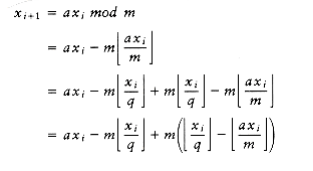
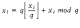
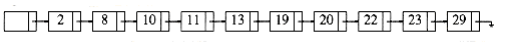
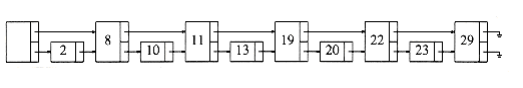
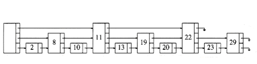
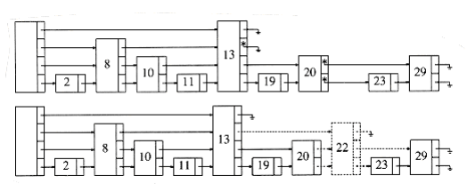

## Randomized Algorithms

Suppose you are a professor who is giving weekly programming assignments. You want to make sure that the students are doing their own programs or, at the very least, understand the code they are submitting. One solution is to give a quiz on the day that each program is due. On the other hand, these quizzes take time out of class, so it might only be practical to do this for roughly half of the programs. Your problem is to decide when to give the quizzes.

Of course, if the quizzes are announced in advance, that could be interpreted as an implicit license to cheat for the 50 percent of the programs that W~i~ll not get a quiz. One could adopt the unannounced strategy of giving quizzes on alternate programs, but students would figure out the strategy before too long. Another possibility is to give quizzes on what seems like the important programs, but this would likely lead to similar quiz patterns from semester to semester. Student grapevines being what they are, this strategy would probably be worthless after a semester.

One method that seems to eliminate these problems is to use a coin. A quiz is made for every program (making quizzes is not nearly as time-consuming as grading them), and at the start of class, the professor W~i~ll flip a coin to decide whether the quiz is to be given. This way, it is impossible to know before class whether or not the quiz W~i~ll occur, and these patterns do not repeat from semester to semester. Thus, the students W~i~ll have to expect that a quiz W~i~ll occur W~i~th 50 percent probability, regardless of previous quiz patterns. The disadvantage is that it is possible that there is no quiz for an entire semester. This is not a likely occurrence, unless the coin is suspect. Each semester, the expected number of quizzes is half the number of programs, and W~i~th high probability, the number of quizzes W~i~ll not deviate much from this.

This example illustrates what we call randomized algorithms. At least once during the algorithm, a random number is used to make a decision. The running time of the algorithm depends not only on the particular input, but also on the random numbers that occur.

The worst-case running time of a randomized algorithm is almost always the same as the worst-case running time of the nonrandomized algorithm. The important difference is that a good randomized algorithm has no bad inputs, but only bad random numbers (relative to the particular input). This may seem like only a philosophical difference, but actually it is quite important, as the folloW~i~ng example shows.

Consider two variants of quicksort. Variant A uses the first element as pivot, while variant B uses a randomly chosen element as pivot. In both cases, the worst-case running time is (n2), because it is possible at each step that the largest element is chosen as pivot. The difference between these worst cases is that there is a particular input that can always be presented to variant A to cause the bad running time. Variant A W~i~ll run in (n2) time every single time it is given an already sorted list. If variant B is presented W~i~th the same input tW~i~ce, it W~i~ll have two different running times, depending on what random numbers occur.

Throughout the text, in our calculations of running times, we have assumed that all inputs are equally likely. This is not true, because nearly sorted input, for instance, occurs much more often than is statistically expected, and this causes problems, particularly for quicksort and binary search trees. By using a randomized algorithm, the particular input is no longer important. The random numbers are important, and we can get an expected running time, where we now average over all possible random numbers instead of over all possible inputs. Using quicksort W~i~th a random pivot gives an O(n log n)-expected-time algorithm. This means that for any input, including already-sorted input, the running time is expected to be O(n log n), based on the statistics of random numbers. An expected running time bound is somewhat stronger than an average-case bound but, of course, is weaker than the corresponding worst-case bound. On the other hand, as we saw in the selection problem, solutions that obtain the worst-case bound are frequently not as practical as their average-case counterparts. Randomized algorithms usually are In this section we W~i~ll examine two uses of randomization. First, we W~i~ll see a novel scheme for supporting the binary search tree operations in O(log n) expected time. Once again, this means that there are no bad inputs, just bad random numbers. From a theoretical point of view, this is not terribly exciting, since balanced search trees achieve this bound in the worst case. Nevertheless, the use of randomization leads to relatively simple algorithms for searching, inserting, and especially deleting.

Our second application is a randomized algorithm to test the primality of large numbers. No efficient polynomial-time nonrandomized algorithms are known for this problem. The algorithm we present runs quickly but occasionally makes an error. The probability of error can, however, be made negligibly small.

### Random Number Generators

Since our algorithms require random numbers, we must have a method to generate them. Actually, true randomness is virtually impossible to do on a computer, since these numbers W~i~ll depend on the algorithm, and thus cannot possibly be random. Generally, it suffices to produce pseudorandom numbers, which are numbers that appear to be random. Random numbers have many known statistical properties; pseudorandom numbers satisfy most of these properties. Surprisingly, this too is much easier said than done. 

Suppose we only need to flip a coin; thus, we must generate a 0 or 1 randomly. One way to do this is to examine the system clock. The clock might record time as an integer that counts the number of seconds since January 1, 1970.* We could then use the lowest bit. The problem is that this does not work well if a sequence of random numbers is needed. One second is a long time, and the clock might not change at all while the program is running. Even if the time were recorded in units of microseconds, if the program were running by itself the sequence of numbers that would be generated would be far from random, since the time between calls to the generator would be essentially identical on every program invocation. We see, then, that what is really needed is a sequence of random numbers.ç These numbers should appear independent. If a coin is flipped and heads appears, the next coin flip should still be equally likely to come up heads or tails.

*UNIX does this.

We W~i~ll use random in place of pseudorandom in the rest of this section.

The standard method to generate random numbers is the linear congruential generator, which was first described by Lehmer in 1951. Numbers x1, x2, . . . are generated satisfying x~i~ + 1 = ax~i~ mod m.

To start the sequence, some value of x0 must be given. This value is known as the seed. If x0 = 0, then the sequence is far from random, but if a and m are correctly chosen, then any other 1 x 0 < m is equally valid. If m is prime, then x~i~ is never 0. As an example, if m = 11, a = 7, and x0 = 1, then the numbers generated are 7, 5, 2, 3, 10, 4, 6, 9, 8, 1, 7, 5, 2, . . . Notice that after m - 1 = 10 numbers, the sequence repeats. Thus, this sequence has a period of m -1, which is as large as possible (by the pigeonhole principle). If m is prime, there are always choices of a that give a full period of m - 1. Some choices of a do not; if a = 5 and x0 = 1, the sequence has a short period of 5.

5, 3, 4, 9, 1, 5, 3, 4, . . .

Obviously, if m is chosen to be a large, 31-bit prime, the period should be significantly large for most applications. Lehmer suggested the use of the 31-bit prime m = 231 - 1 = 2,147,483,647.

For this prime, a = 75 = 16,807 is one of the many values that gives a full-period generator. Its use has been well studied and is recommended by experts in the field. We W~i~ll see later that W~i~th random number generators, tinkering usually means breaking, so one is well advised to stick W~i~th this formula until told otherW~i~se.

This seems like a simple routine to implement. Generally, a global variable is used to hold the current value in the sequence of x's. This is the rare case where a global variable is useful. This global variable is initialized by some routine. When debugging a program that uses random numbers, it is probably best to set x0 = 1, so that the same random sequence occurs all the time.

When the program seems to work, either the system clock can be used or the user can be asked to input a value for the seed.

It is also common to return a random real number in the open interval (0, 1) (0 and 1 are not possible values); this can be done by dividing by m. From this, a random number in any closed interval [a, b] can be computed by normalizing. This yields the "obvious" routine in Figure 10.54 which, unfortunately, works on few machines.

The problem W~i~th this routine is that the multiplication could overflow; although this is not an error, it affects the result and thus the pseudo-randomness. Schrage gave a procedure in which all of the calculations can be done on a 32-bit machine W~i~thout overflow. We compute the quotient and remainder of m/a and define these as q and r, respectively. In our case, ~q~= 127,773, r = 2,836, and r < q. We have


```c
unsigned int seed; /* global variable */

define a 16807 /* 7^5 */

define m 2147483647 /* 2^31 - 1 */

double

random(void)
{

seed = (a * seed) % m;

return(((double) seed) / m);

}
```
**Figure 10.54 Random number generator that does not work**

Since , we can replace the leading ax~i~ and obtain


Since m = aq + r, it follows that aq - m = -r. Thus, we obtain


The term  is either 0 or 1, because both terms are integers and their difference lies between 0 and 1. Thus, we have


A quick check shows that because r < q, all the remaining terms can be calculated W~i~thout overflow (this is one of the reasons for chosing a = 75). Furthermore, (x~i~) = 1 only if the remaining terms evaluate to less than zero. Thus (x~i~) does not need to be explicitly computed but can be determined by a simple test. This leads to the program in Figure 10.55.

This program works as long as INT_~max~ 231 - 1. One might be tempted to assume that all machines have a random number generator at least as good as the one in Figure 10.55 in their standard library. Sadly, this is not true. Many libraries have generators based on the function x~i~+1 = (ax~i~ + c) mod 2 b where b is chosen to match the number of bits in the machine's integer, and c is odd. These libraries also return x~i~, instead of a value between 0 and 1. Unfortunately, these generators always produce values of x~i~ that alternate between even and odd--hardly a desirable property.

Indeed, the lower k bits cycle W~i~th period 2k (at best). Many other random number generators have much smaller cycles than the one provided in Figure 10.55. These are not suitable for the case where long sequences of random numbers are needed. Finally, it may seem that we can get a better random number generator by adding a constant to the equation. For instance, it seems that x~i~+1 = (16807x~i~ + 1) mod (2 31 - 1) would somehow be even more random. This illustrates how fragile these generators are [16807(1319592028) + 1] mod (231-1) = 1319592028, so if the seed is 1,319,592,028, the generator gets stuck in a cycle of period 1.
```c
unsigned int seed; /* global variable */

define a 16807 /* 7^5 */

define m 2147483647 /* 2^31 - 1*/

define q 127773 /* m/a */

define r 2836 /* m%a */

double

random(void)
{

int tmp_seed;

tmp_seed = a * (seed % q) - r * (seed / q);

if(tmp_seed >= 0)
seed = tmp_seed; 

else
seed = tmp_seed + m;

return(((double) seed) / m);

}
```
**Figure 10.55 Random number generator that works on 32 bit machines**

### Skip Lists

Our first use of randomization is a data structure that supports both searching and insertion in O(log n) expected time. As mentioned in the introduction to this section, this means that the running time for each operation on any input sequence has expected value O(log n), where the expectation is based on the random number generator. It is possible to add deletion and all the operations that involve ordering and obtain expected time bounds that match the average time bounds of binary search trees.

The simplest possible data structure to support searching is the linked list. Figure 10.56 shows a simple linked list. The time to perform a search is proportional to the number of nodes that have to be examined, which is at most n.

Figure 10.57 shows a linked list in which every other node has an additional pointer to the node two ahead of it in the list. Because of this, at most n/2 + 1 nodes are examined in the worst case.

We can extend this idea and obtain Figure 10.58. Here, every fourth node has a pointer to the node four ahead. Only n/4 + 2 nodes are examined.

The limiting case of this argument is shown in Figure 10.59. Every 2ith node has a pointer to the node 2i ahead of it. The total number of pointers has only doubled, but now at most log n nodes are examined during a search. It is not hard to see that the total time spent for a search is O(log n), because the search consists of either advancing to a new node or dropping to a lower pointer in the same node. Each of these steps consumes at most O(log n) total time during a search. Notice that the search in this data structure is essentially a binary search.


**Figure 10.56 Simple linked list**


**Figure 10.57 Linked list W~i~th pointers to two cells ahead**


**Figure 10.58 Linked list W~i~th pointers to four cells ahead**


**Figure 10.59 Linked list W~i~th pointers to 2i cells ahead**


**Figure 10.60 A skip list**

The problem W~i~th this data structure is that it is much too rigid to allow efficient insertion. The key to making this data structure usable is to relax the structure conditions slightly. We define a level k node to be a node that has k pointers. As Figure 10.59 shows, the ith pointer in any level k node (k i) points to the next node W~i~th at least i levels. This is an easy property to maintain; however, Figure 10.59 shows a more restrictive property than this. We thus drop the restriction that the ith pointer points to the node 2i ahead, and we replace it W~i~th the less restrictive condition above.

When it comes time to insert a new element, we allocate a new node for it. We must at this point decide what level the node should be. Examining Figure 10.59, we find that roughly half the nodes are level 1 nodes, roughly a quarter are level 2, and, in general, approx~i~mately 1/2i nodes are level i. We choose the level of the node randomly, in accordance W~i~th this probability distribution. The easiest way to do this is to flip a coin until a head occurs and use the total number of flips as the node level. Figure 10.60 shows a typical skip list.

Given this, the skip list algorithms are simple to describe. To perform a find, we start at the highest pointer at the header. We traverse along this level until we find that the next node is larger than the one we are looking for (or). When this occurs, we go to the next lower level and continue the strategy. When progress is stopped at level 1, either we are in front of the node we are looking for, or it is not in the list. To perform an insert, we proceed as in a find, and keep track of each point where we sW~i~tch to a lower level. The new node, whose level is determined randomly, is then spliced into the list. This operation is shown in Figure 10.61.

A cursory analysis shows that since the expected number of nodes at each level is unchanged from the original (nonrandomized) algorithm, the total amount of work that is expected to be performed traversing to nodes on the same level is unchanged. This tells us that these operations have O (log n) expected costs. Of course, a more formal proof is required, but it is not much different from this.

Skip lists are similar to hash tables, in that they require an estimate of the number of elements that W~i~ll be in the list (so that the number of levels can be determined). If an estimate is not available, we can assume a large number or use a technique similar to rehashing. Experiments have shown that skip lists are as efficient as many balanced search tree implementations and are certainly much simpler to implement in many languages.

### Primality Testing

In this section we examine the problem of determining whether or not a large number is prime. As was mentioned at the end of Chapter 2, some cryptography schemes depend on the difficulty of factoring a large, 200-digit number into two 100-digit primes. In order to implement this scheme, we need a method of generating these two primes. The problem is of major theoretical interest, because nobody now knows how to test whether a d-digit number n is prime in time polynomial in d.

For instance, the obvious method of testing for the divisibility by odd numbers from 3 to requires roughly divisions, which is about 2d/2. On the other hand, this problem is not thought to be NP-complete; thus, it is one of the few problems on the fringe--its complex~i~ty is unknown at the time of this writing.


**Figure 10.61 Before and after an insertion**

In this chapter, we W~i~ll give a polynomial-time algorithm that can test for primality. If the algorithm declares that the number is not prime, we can be certain that the number is not prime. If the algorithm declares that the number is prime, then, W~i~th high probability but not 100 percent certainty, the number is prime. The error probability does not depend on the particular number that is being tested but instead depends on random choices made by the algorithm. Thus, this algorithm occasionally makes a mistake, but we W~i~ll see that the error ratio can be made arbitrarily negligible.

The key to the algorithm is a well-known theorem due to Fermat.

THEOREM 10.10.

Fermat's Lesser Theorem: If p is prime, and 0 < a < p, then ap-1 1(mod p).

PROOF:

A proof of this theorem can be found in any textbook on number theory. 

For instance, since 67 is prime, 266 1(mod 67). This suggests an algorithm to test whether a number n is prime. Merely check whether 2n-1 1(mod n). If (mod n), then we can be certain that n is not prime. On the other hand, if the equality holds, then n is probably prime.For instance, the smallest n that satisfies 2n-1 1(mod n) but is not prime is n = 341.

This algorithm W~i~ll occasionally make errors, but the problem is that it W~i~ll always make the same errors. Put another way, there is a fixed set of n for which it does not work. We can attempt to randomize the algorithm as follows: Pick 1 < a < n - 1 at random. If an-1 1(mod n), declare that n is probably prime, otherW~i~se declare that n is definitely not prime. If n = 341, and a = 3, we find that 3340 56(mod 341). Thus, if the algorithm happens to choose a = 3, it W~i~ll get the correct answer for n = 341.

Although this seems to work, there are numbers that fool even this algorithm for most choices of a. One such set of numbers is known as the Carmichael numbers. These are not prime but satisfy an-1 1(mod n) for all 0 < a < n that are relatively prime to n. The smallest such number is 561. Thus, we need an additional test to improve the chances of not making an error.

In Chapter 7, we proved a theorem related to quadratic probing. A special case of this theorem is the folloW~i~ng:

THEOREM 10.11.

If p is prime and 0 < x < p, the only solutions to x2 1(mod p) are x = 1, p - 1.

PROOF:

x2 1(mod p) implies that x2 -1 0(mod p). This implies (x - 1)(x + 1) 0(mod p).

Since p is prime, 0 x < p, and p must divide either (x - 1) or (x + 1), the theorem follows.

Therefore, if at any point in the computation of an-1mod n we discover a violation of this theorem, we can conclude that n is definitely not prime. If we use power, from Section 2.4.4, we see that there W~i~ll be several opportunities to apply this test. We modify this routine to perform operations mod n, and apply the test of Theorem 10.11. This strategy is implemented in Figure 10.62. Because power needs to return two pieces of information, we pass the address of these items (result and whatnis) by pointers.

Recall that if test_prime returns DEFINITELY_COMPOSITE, it has proven that n cannot be prime. The proof is nonconstructive, because it gives no method of actually finding the factors. It has been shown that for any (sufficiently large) n, at most (n - 9)/4 values of a fool this algorithm. Thus, if a is chosen at random, and the algorithm answers PROBABLY_PRIME, then the algorithm is correct at least 75 percent of the time. Suppose test_prime is run 50 times. The probability that the algorithm is fooled once is at most 1/4. Thus, the probability that 50 independent random trials fool the algorithm is never more than 1/450 = 2-100. This is actually a very conservative estimate, which holds for only a few choices of n. Even so, one is more likely to see a hardware error than an incorrect claim of primality.  