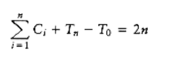

# Binomial Queues

The first data structure we will look at is the binomial queue of Chapter 6, which we now review briefly. Recall that a binomial tree B0 is a one-node tree,and for k > 0, the binomial tree Bk is built by melding two binomial trees Bk-1 together. Binomial trees B0 through B4 are shown in Figure 11.1.


Figure 11.1 Binomial trees B0, B1, B2, B3, and B4


Figure 11.2 Two binomial queues H1 **and H2**

The rank of a node in a binomial tree is equal to the number of children; in particular, the rank of the root of Bk is k. A binomial queue is a collection of heap-ordered binomial trees, in which there can be at most one binomial tree Bk for any k. Two binomial queues, H1 and H2, are shown in Figure 11.2.

The most important operation is merge. To merge two binomial queues, an operation similar to addition of binary integers is performed: At any stage we may have zero, one, two, or possibly three Bk trees, depending on whether or not the two priority queues contain a Bk tree and whether or not a Bk tree is carried over from the previous step. If there is zero or one Bk tree, it is placed as a tree in the resultant binomial queue. If there are two Bk trees, they are melded into a Bk+1 tree and carried over; if there are three Bk trees, one is placed as a tree in the binomial queue and the other two are melded and carried over. The result of merging H1 and H2 is shown in Figure 11.3.

Insertion is performed by creating a one-node binomial queue and performing a merge. The time to do this is m + 1, where m represents the smallest type of binomial tree Bm not present in the binomial queue. Thus, insertion into a binomial queue that has a B0 tree but no B1 tree requires two steps. Deletion of the minimum is accomplished by removing the minimum and splitting the original binomial queue into two binomial queues, which are then merged. A less terse explanation of these operations is given in Chapter 6.

We consider a very simple problem first. Suppose we want to build a binomial queue of n elements. We know that building a binary heap of n elements can be done in O (n), so we expect a similar bound for binomial queues.


**Figure 11.3 Binomial queue H3**: the result of merging H1 and H2

**CLAIM:**
```
A binomial queue of n elements can be built by n successive insertions in O(n) time.
```

The claim, if true, would give an extremely simple algorithm. Since the worst-case time for each insertion is O (log n), it is not obvious that the claim is true. Recall that if this algorithm were applied to binary heaps, the running time would be O(n log n).

To prove the claim, we could do a direct calculation. To measure the running time, we define the cost of each insertion to be one time unit plus an extra unit for each linking step. Summing this cost over all insertions gives the total running time. This total is n units plus the total number of linking steps. The 1st, 3rd, 5th, and all odd-numbered steps require no linking steps, since there is no B0 present at the time of insertion. Thus, half of the insertions require no linking steps. A quarter of the insertions require only one linking step (2nd, 6th, 10th, and so on). An eighth require two, and so on. We could add this all up and bound the number of linking steps by n, proving the claim. This brute force calculation will not help when we try to analyze a sequence of operations that include more than just insertions, so we will use another approach to prove this result.

Consider the result of an insertion. If there is no B0 tree present at the time of the insertion,then the insertion costs a total of one unit, by using the same accounting as above. The result of the insertion is that there is now a B0 tree, and thus we have added one tree to the forest of binomial trees. If there is a B0 tree but no B1 tree, then the insertion costs two units. The new forest will have a B1 tree but will no longer have a B0 tree, so the number of trees in the forest is unchanged. An insertion that costs three units will create a B2 tree but destroy a B0 and B1 tree, yielding a net loss of one tree in the forest. In fact, it is easy to see that, in general, an insertion that costs c units results in a net increase of 2 - c trees in the forest, because a Bc-1 tree is created but all Bi trees 0 i < c - 1 are removed. Thus, expensive insertions remove trees, while cheap insertions create trees.

Let Ci be the cost of the ith insertion. Let Ti be the number of trees after the ith insertion.T0 = 0 is the number of trees initially. Then we have the invariant
```
Ci + (Ti - Ti-1) = 2
```
***(11.1)***

We then have
```
C1 + (T1 - T0) = 2

C2 + (T2 - T1) = 2

Cn-1 + (Tn-1 - Tn-2) = 2

Cn + (Tn - Tn-1) = 2
```

If we add all these equations, most of the Ti terms cancel, leaving


or equivalently,


Recall that T0 = 0 and Tn, the number of trees after the n insertions, is certainly not negative,

so (Tn - T0) is not negative. Thus


which proves the claim.

During the build_binomial_queue routine, each insertion had a worst-case time of O(log n), but since the entire routine used at most 2n units of time, the insertions behaved as though each used no more than 2 units each.

This example illustrates the general technique we will use. The state of the data structure at any time is given by a function known as the potential. The potential function is not maintained by the program, but rather is an accounting device that will help with the analysis. When operations take less time than we have allocated for them, the unused time is "saved" in the form of a higher potential. In our example, the potential of the data structure is simply the number of trees. In the analysis above, when we have insertions that use only one unit instead of the two units that are allocated, the extra unit is saved for later by an increase in potential. When operations occur that exceed the allotted time, then the excess time is accounted for by a decrease in potential. One may view the potential as representing a savings account. If an operation uses less than its allotted time, the difference is saved for use later on by more expensive operations. Figure 11.4 shows the cumulative running time used by build_binomial_queue over a sequence of insertions. Observe that the running time never exceeds 2n and that the potential in the binomial queue after any insertion measures the amount of savings.


**Figure 11.4 A sequence of n inserts**

Once a potential function is chosen, we write the main equation:

Tactual + Potential = Tamortized

**(11.2)**

Tactual, the actual time of an operation, represents the exact (observed) amount of time required to execute a particular operation. In a binary search tree, for example, the actual time to perform a find(x) is 1 plus the depth of the node containing x. If we sum the basic equation over the entire sequence, and if the final potential is at least as large as the initial potential,then the amortized time is an upper bound on the actual time used during the execution of the sequence. Notice that while Tactual varies from operation to operation, Tamortized is stable.

Picking a potential function that proves a meaningful bound is a very tricky task; there is no one method that is used. Generally, many potential functions are tried before the one that works is found. Nevertheless, the discussion above suggests a few rules, which tell us the properties that good potential functions have. The potential function should

- Always assume its minimum at the start of the sequence. A popular method of choosing potential functions is to ensure that the potential function is initially 0, and always nonnegative. All of the examples that we will encounter use this strategy.

- Cancel a term in the actual time. In our case, if the actual cost was c, then the potential change was 2 - c. When these are added, an amortized cost of 2 is obtained. This is shown in Figure 11.5.

We can now perform a complete analysis of binomial queue operations.


**Figure 11.5 The insertion cost and potential change for each operation in a sequence**

THEOREM 11.1.

*The amortized running times of insert, delete_min, and merge are O(1), O(log n), and O(log n), respectively, for binomial queues.*

PROOF:

The potential function is the number of trees. The initial potential is 0, and the potential is always nonnegative, so the amortized time is an upper bound on the actual time. The analysis for insert follows from the argument above. For merge, assume the two trees have n1 and n2 nodes with T1 and T2 trees, respectively. Let n = n1 + n2. The actual time to perform the merge is O(log(n1) + log(n2)) = O(log n). After the merge, there can be at most log n trees, so the potential can increase by at most O(log n). This gives an amortized bound of O(log n). The delete_min bound follows in a similar manner.