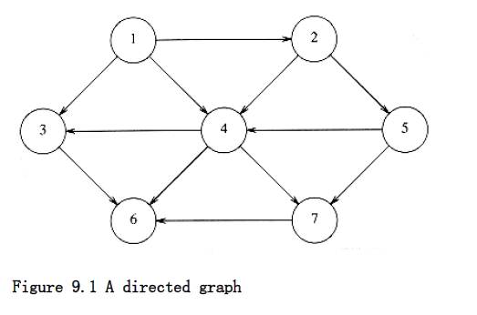

## Definitions

A graph G = (V, E) consists of a set of vertices, V, and a set of edges, E. Each edge is a pair (v,w), where v,w V. Edges are sometimes referred to as arcs. If the pair is ordered, then the graph is directed. Directed graphs are sometimes referred to as digraphs. Vertex w is adjacent to v if and only if (v,w) E. In an undirected graph with edge (v,w), and hence (w,v), w is adjacent to v and v is adjacent to w. Sometimes an edge has a third component, known as either a weight or a cost.

A path in a graph is a sequence of verices w~1~, w~2~, w~3~, . . . , wn such that (w~i~,w~i+i~) E for 1 i < n. The length of such a path is the number of edges on the path, which is equal to n - 1. We allow a path from a vertex to itself; if this path contains no edges, then the path lenght is 0. This is a convenient way to define an otherwise special case. If the graph contains an edge (v,v) from a vertex to itself, then the path v, v is sometimes referred to as a loop. The graphs we will consider will generally be loopless. A simple path is a path such that all vertices are distinct, except that the first and last could be the same.

A cycle in a directed graph is a path of length at least 1 such that w~1~ = w~n~; this cycle is simple if the path is simple. For undirected graphs, we require that the edges be distinct. The logic of these requirements is that the path u, v, u in an undirected graph should not be considered a cycle, because (u, v) and (v, u) are the same edge. In a directed graph, these are different edges, so it makes sense to call this a cycle. A directed graph is acyclic if it has no cycles. A directed acyclic graph is sometimes referred to by its abbreviation, DAG.

An undirected graph is connected if there is a path from every vertex to every other vertex. A directed graph with this property is called strongly connected. If a directed graph is not strongly connected, but the underlying graph (without direction to the arcs) is connected, then the graph is said to be weakly connected. A complete graph is a graph in which there is an edge between every pair of vertices.

An example of a real-life situation that can be modeled by a graph is the airport system. Each airport is a vertex, and two vertices are connected by an edge if there is a nonstop flight from the airports that are represented by the vertices. The edge could have a weight, representing the time, distance, or cost of the flight. It is reasonable to assume that such a graph is directed, since it might take longer or cost more (depending on local taxes, for example) to fly in different directions. We would probably like to make sure that the airport system is strongly connected, so that it is always possible to fly from any airport to any other airport. We might also like to quickly determine the best flight between any two airports. "Best" could mean the path with the fewest number of edges or could be taken with respect to one, or all, of the weight measures.

Traffic flow can be modeled by a graph. Each street intersection represents a vertex, and each street is an edge. The edge costs could represent, among other things, a speed limit or a capacity (number of lanes). We could then ask for the shortest route or use this information to find the most likely location for bottlenecks.

In the remainder of this chapter, we will see several more applications of graphs. Many of these graphs can be quite large, so it is important that the algorithms we use be efficient.

### Representation of Graphs

We will consider directed graphs (undirected graphs are similarly represented).

Suppose, for now, that we can number the vertices, starting at 1. The graph shown in Figure 9.1 represents 7 vertices and 12 edges. One simple way to represent a graph is to use a two-dimensional array. This is known as an adjacency matrix representation. For each edge (u, v), we set a[u][v] = 1; otherwise the entry in the array is 0. If the edge has a weight associated with it, then we can set a[u][v] equal to the weight and use either a very large or a very small weight as a sentinel to indicate nonexistent edges. For instance, if we were looking for the cheapest airplane route, we could represent nonexistent flights with a cost of . If we were looking, for some strange reason, for the most expensive airplane route, we could use (or perhaps 0) to represent nonexistent edges.

Although this has the merit of extreme simplicity, the space requirement is (|V|2), which can be prohibitive if the graph does not have very many edges. An adjacency matrix is an appropriate representation if the graph is dense: |E| = (|V|2). In most of the applications that we shall see, this is not true. For instance, suppose the graph represents a street map. Assume a Manhattan-like orientation, where almost all the streets run either north-south or east-west. Therefore, any intersection is attached to roughly four streets, so if the graph is directed and all streets are two-way, then |E| 4|V|. If there are 3,000 intersections, then we have a 3,000-vertex graph with 12,000 edge entries, which would require an array of size nine million. Most of these entries would contain zero. This is intuitively bad, because we want our data structures to represent the data that is actually there and not the data that is not present.

If the graph is not dense, in other words, if the graph is sparse, a better solution is an adjacency list representation. For each vertex, we keep a list of all adjacent vertices. The space requirement is then O|E| + |V|). The leftmost structure in Figure 9.2 is merely an array of header cells. The representation should be clear from Figure 9.2. If the edges have weights, then this additional information is also stored in the cells.

Adjacency lists are the standard way to represent graphs. Undirected graphs can be similarly represented; each edge (u, v) appears in two lists, so the space usage essentially doubles. A common requirement in graph algorithms is to find all vertices adjacent to some given vertex v, and this can be done, in time proportional to the number of such vertices found, by a simple scan down the appropriate adjacency list.

In most real-life applications, the vertices have names, which are unknown at compile time, instead of numbers. Since we cannot index an array by an unknown name, we must provide a mapping of names to numbers. The easiest way to do this is to use a hash table, in which we store a name and an internal number ranging from 1 to |V| for each vertex. The numbers are assigned as the graph is read. The first number assigned is 1. As each edge is input, we check whether each of the two vertices has been assigned a number, by seeing if it is in the hash table. If so, we use the internal number. Otherwise, we assign to the vertex the next available number and insert the vertex name and number into the hash table.

With this transformation, all the graph algorithms will use only the internal numbers. Since eventually we will need to output the real vertex names and not the internal numbers, we must also record, for each internal number, the corresponding vertex name. One way is to use an array of strings. If the vertex names are long, this can cost considerable space, because the vertex names are stored twice. An alternative is to keep an array of pointers into the hash table. The price of this alternative is a slight loss of the sanctity of the hash table ADT.

The code that we present in this chapter will be pseudocode using ADTS as much as possible. We will do this to save space and, of course, to make the algorithmic presentation of the algorithms much clearer.
