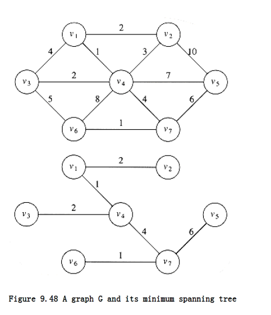

## Minimum Spanning Tree

The next problem we will consider is that of finding a minimum spanning tree in an undirected graph. The problem makes sense for directed graphs but appears to be more difficult. Informally, a minimum spanning tree of an undirected graph G is a tree formed from graph edges that connects all the vertices of G at lowest total cost. A minimum spanning tree exists if and only if G is connected. Although a robust algorithm should report the case that G is unconnected, we will assume that G is connected, and leave the issue of robustness as an exercise for the reader.

In Figure 9.48 the second graph is a minimum spanning tree of the first (it happens to be unique, but this is unusual). Notice that the number of edges in the minimum spanning tree is |V| - 1. The minimum spanning tree is a tree because it is acyclic, it is spanning because it covers every edge, and it is minimum for the obvious reason. If we need to wire a house with a minimum of cable, then a minimum spanning tree problem needs to be solved. There are two basic algorithms to solve this problem; both are greedy. We now describe them.



**9.5.1. Prim's Algorithm**

**9.5.2. Kruskal's Algorithm**

### Prim's Algorithm

One way to compute a minimum spanning tree is to grow the tree in successive stages. In each stage, one node is picked as the root, and we add an edge, and thus an associated vertex, to the tree.

At any point in the algorithm, we can see that we have a set of vertices that have already been included in the tree; the rest of the vertices have not. The algorithm then finds, at each stage, a new vertex to add to the tree by choosing the edge (u, v) such that the cost of (u, v) is the smallest among all edges where u is in the tree and v is not.

Figure 9.49 shows how this algorithm would build the minimum spanning tree, starting from v~1~. Initially, v~1~ is in the tree as a root with no edges. Each step adds one edge and one vertex to the tree.

We can see that Prim's algorithm is essentially identical to Dijkstra's algorithm for shortest paths. As before, for each vertex we keep values dv and pv and an indication of whether it is known or unknown. d~v~ is the weight of the shortest arc connecting v to a known vertex, and p~v~, as before, is the last vertex to cause a change in d~v~. The rest of the algorithm is exactly the same, with the exception that since the definition of dv is different, so is the update rule. For this problem, the update rule is even simpler than before: After a vertex v is selected, for each unknown w adjacent to v, d~v~ = min(d~w~, c~w~,v).


The initial configuration of the table is shown in Figure 9.50. v~1~ is selected, and v~2~, v~3~, and v~4~ are updated. The table resulting from this is shown in Figure 9.51. The next vertex selected is v~4~. Every vertex is adjacent to v~4~. v~1~ is not examined, because it is known. v~2~ is unchanged, because it has d~v = 2~ and the edge cost from v~4~ to v~2~ is 3; all the rest are updated. Figure 9.52 shows the resulting table. The next vertex chosen is v~2~ (arbitrarily breaking a tie). This does not affect any distances. Then v~3~ is chosen, which affects the distance in v~6~, producing Figure 9.53. Figure 9.54 results from the selection of v~7~, which forces v~6~ and v~5~ to be adjusted. v~6~ and then v~5~ are selected, completing the algorithm.

The final table is shown in Figure 9.55. The edges in the spanning tree can be read from the table: (v~2~, v~1~), (v~3~, v~4~), (v~4~, v~1~), (v~5~, v~7~), (v~6~, v~7~), (v~7~, v~4~). The total cost is 16.

The entire implementation of this algorithm is virtually identical to that of Dijkstra's algorithm, and everything that was said about the analysis of Dijkstra's algorithm applies here. Be aware that Prim's algorithm runs on undirected graphs, so when coding it, remember to put every edge in two adjacency lists. The running time is O (|V|^2^) without heaps, which is optimal for dense graphs, and O (|E| log |V|) using binary heaps, which is good for sparse graphs.

### Kruskal's Algorithm 

A second greedy strategy is continually to select the edges in order of smallest weight and accept an edge if it does not cause a cycle. The action of the algorithm on the graph in the preceding example is shown in Figure 9.56.

v Known d~v~ p~v~

--------------------

v~1~ 0 0 0

v~2~ 0 0

v~3~ 0 0

v~4~ 0 0

v~5~ 0 0

v~6~ 0 0

v~7~ 0 0

Figure 9.50 Initial configuration of table used in Prim's algorithm

v Known d~v~ p~v~

--------------------

v~1~ 1 0 0

v~2~ 0 2 v~1~

v~3~ 0 4 v~1~

v~4~ 0 1 v~1~

v~5~ 0 0

v~6~ 0 0

v~7~ 0 0

Figure 9.51 The table after v~1~ **is declared known**

v Known d~v~ p~v~

--------------------

v~1~ 1 0 0

v~2~ 0 2 v~1~

v~3~ 0 2 v~4~

v~4~ 1 1 v~1~

v~5~ 0 7 v~4~

v~6~ 0 8 v~4~

v~7~ 0 4 v~4~

Figure 9.52 The table after v~4~ **is declared known**

Formally, Kruskal's algorithm maintains a forest -- a collection of trees. Initially, there are |V| single-node trees. Adding an edge merges two trees into one. When the algorithm terminates, there is only one tree, and this is the minimum spanning tree. Figure 9.57 shows the order in which edges are added to the forest.

The algorithm terminates when enough edges are accepted. It turns out to be simple to decide whether edge (u,v) should be accepted or rejected. The appropriate data structure is the union/find algorithm of the previous chapter.

The invariant we will use is that at any point in the process, two vertices belong to the same set if and only if they are connected in the current spanning forest. Thus, each vertex is initially in its own set. If u and v are in the same set, the edge is rejected, because since they are already connected, adding (u, v) would form a cycle. Otherwise, the edge is accepted, and a union is performed on the two sets containing u and v. It is easy to see that this maintains the set invariant, because once the edge (u, v) is added to the spanning forest, if w was connected to u and x was connected to v, then x and w must now be connected, and thus belong in the same set.

v Known d~v~ p~v~

--------------------

v~1~ 1 0 0

v~2~ 1 2 v~1~

v~3~ 1 2 v~4~

v~4~ 1 1 v~1~

v~5~ 0 7 v~4~

v~6~ 0 5 v~3~

v~7~ 0 4 v~4~

Figure 9.53 The table after v~2~ **and then v~3~ are declared known**

v Known d~v~ p~v~

--------------------

v~1~ 1 0 0

v~2~ 1 2 v~1~

v~3~ 1 2 v~4~

v~4~ 1 1 v~1~

v~5~ 0 6 v~7~

v~6~ 0 1 v~7~

v~7~ 1 4 v~4~

Figure 9.54 The table after v~7~ **is declared known**

v Known d~v~ p~v~

--------------------

v~1~ 1 0 0

v~2~ 1 2 v~1~

v~3~ 1 2 v~4~

v~4~ 1 1 v~1~

v~5~ 1 6 v~7~

v~6~ 1 1 v~7~

v~7~ 1 4 v~4~

Figure 9.55 The table after v~6~ **and v~5~ are selected (Prim's algorithm terminates)**

The edges could be sorted to facilitate the selection, but building a heap in linear time is a much better idea. Then delete_mins give the edges to be tested in order. Typically, only a small fraction of the edges needs to be tested before the algorithm can terminate, although it is always possible that all the edges must be tried. For instance, if there was an extra vertex v~8~ and edge (v~5~, v~8~) of cost 100, all the edges would have to be examined. Procedure kruskal in Figure 9.58 finds a minimum spanning tree. Because an edge consists of three pieces of data, on some machines it is more efficient to implement the priority queue as an array of pointers to edges, rather than as an array of edges. The effect of this implementation is that, to rearrange the heap, only pointers, not large records, need to be moved.

Edge Weight Action

----------------------------

(v~1~,v~4~) 1 Accepted

(v~6~,v~7~) 1 Accepted

(v~1~,v~2~) 2 Accepted

(v~3~,v~4~) 2 Accepted

(v~2~,v~4~) 3 Rejected

(v~1~,v~3~) 4 Rejected

(v~4~,v~7~) 4 Accepted

(v~3~,v~6~) 5 Rejected

(v~5~,v~7~) 6 Accepted

Figure 9.56 Action of Kruskal's algorithm on G
 


The worst-case running time of this algorithm is O(|E| log |E|), which is dominated by the heap operations. Notice that since |E| = O(|V|^2^), this running time is actually O(|E| log |V|). In practice, the algorithm is much faster than this time bound would indicate.
```c
void kruskal(graph G)
{

unsigned int edges_accepted;

DISJ_SET S;

PRIORITY_QUEUE H;

vertex u, v;

set_type u_set, v_set;

edge e;

initialize(S);

read_graph_into_heap_array(G, H);

build_heap(H);

edges_accepted = 0;

while(edges_accepted < NUM_VERTEX-1)
{

e = delete_min(H); /* e = (u, v) */

u_set = find(u, S);

v_set = find(v, S);

if(u_set != v_set){

/* accept the edge */

edges_accepted++;

set_union(S, u_set, v_set);

}

}

}
```
**Figure 9.58 Pseudocode for Kruskal's algorithm**

