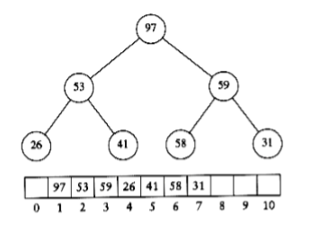
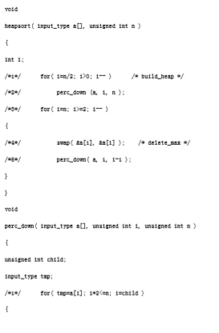

## Heapsort

As mentioned in Chapter 6, priority queues can be used to sort in O(n log n) time. The algorithm based on this idea is known as heapsort and gives the best Big-Oh running time we have seen so far. In practice however, it is slower than a version of Shellsort that uses Sedgewick's increment sequence.

Recall, from Chapter 6, that the basic strategy is to build a binary heap of n elements. This stage takes O(n) time. We then perform n delete_min operations. The elements leave the heap smallest first, in sorted order. By recording these elements in a second array and then copying the array back, we sort n elements. Since each delete_min takes O(log n) time, the total running time is O(n log n).

The main problem with this algorithm is that it uses an extra array. Thus, the memory requirement is doubled. This could be a problem in some instances. Notice that the extra time spent copying the second array back to the first is only O (n), so that this is not likely to affect the running time significantly. The problem is space.

A clever way to avoid using a second array makes use of the fact that after each delete_min, the heap shrinks by 1. Thus the cell that was last in the heap can be used to store the element that was just deleted. As an example, suppose we have a heap with six elements. The first delete_min produces a1. Now the heap has only five elements, so we can place a1 in position 6. The next delete_min produces a2.Since the heap will now only have four elements, we can place a2 in position 5. Using this strategy, after the last delete_min the array will contain the elements in decreasing sorted order. If we want the elements in the more typical increasing sorted order, we can change the ordering property so that the parent has a larger key than the child. Thus we have a (max)heap.

In our implementation, we will use a (max)heap, but avoid the actual ADT for the purposes of speed. As usual, everything is done in an array. The first step builds the heap in linear time. We then perform n - 1 delete_maxes by swapping the last element in the heap with the first, decrementing the heap size, and percolating down. When the algorithm terminates, the array contains the elements in sorted order. For instance, consider the input sequence 31, 41, 59, 26, 53, 58, 97. The resulting heap is shown in **figure 7.6**.

**figure 7.7** shows the heap that results after the first delete_max. As the figures imply, the last element in the heap is 31; 97 has been placed in a part of the heap array that is technically no longer part of the heap. After 5 more delete_max operations, the heap will actually have only one element, but the elements left in the heap array will be in sorted order.

The code to perform heapsort is given in **figure 7.8**.

**figure 7.6** (Max) heap after build_heap phase

**figure 7.7** Heap after first delete_max

**figure 7.8** Heapsort
