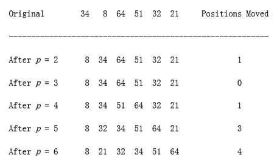

## Insertion Sort
### The Algorithm

One of the simplest sorting algorithms is the insertion sort. Insertion sort consists of n - 1 passes. For pass p = 2 through n, insertion sort ensures that the elements in positions 1 through p are in sorted order. Insertion sort makes use of the fact that elements in positions 1 through p - 1 are already known to be in sorted order. **figure 7.1** shows a sample file after each pass of insertion sort.

**figure 7.1** shows the general strategy. In pass p, we move the pth element left until its correct place is found among the first p elements. The code in **figure 7.2** implements this strategy. The sentinel in a[0] terminates the while loop in the event that in some pass an element is moved all the way to the front. Lines 3 through 6 implement that data movement without the explicit use of swaps. The element in position p is saved in tmp, and all larger elements (prior to position p) are moved one spot to the right. Then tmp is placed in the correct spot. This is the same technique that was used in the implementation of binary heaps.


**figure 7.1** Insertion sort after each pass
```c
void insertion_sort(input_type a[], unsigned int n){

unsigned int j, p;

input_type tmp;

/*1*/ a[0] = MIN_DATA; /* sentinel */

/*2*/ for(p=2; p <= n; p++)
{

/*3*/ tmp = a[p];

/*4*/ for(j = p; tmp < a[j-1]; j--)

/*5*/ a[j] = a[j-1];


/*6*/ a[j] = tmp;

}

}
```
**figure 7.2** Insertion sort routine.

### Analysis of Insertion Sort

Because of the nested loops, each of which can take n iterations, insertion sort

is O(n2). Furthermore, this bound is tight, because input in reverse order can actually achieve this bound. A precise calculation shows that the test at line 4 can be executed at most p times for each value of p. Summing over all p gives a total of

On the other hand, if the input is presorted, the running time is O(n), because the test in the inner for loop always fails immediately. Indeed, if the input is almost sorted (this term will be more rigorously defined in the next section), insertion sort will run quickly. Because of this wide variation, it is worth analyzing the average-case behavior of this algorithm. It turns out that the average case is (n2) for insertion sort, as well as for a variety of other sorting algorithms, as the next section shows.
