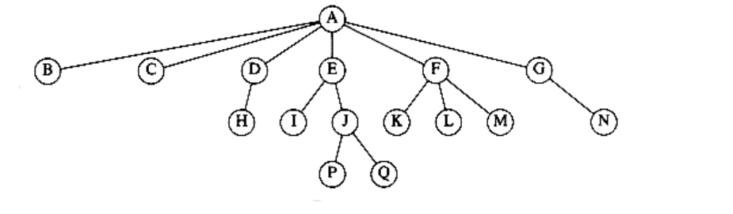
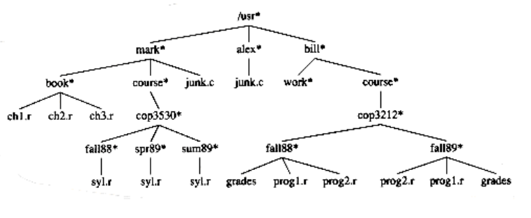

## Preliminaries

A tree can be defined in several ways. One natural way to define a tree is recursively. A tree is a collection of nodes. The collection can be empty, which is sometimes denoted as A. Otherwise, a tree consists of a distinguished node r, called the root, and zero or more (sub)trees T1, T2, . . . , Tk, each of whose roots are connected by a directed edge to r.

The root of each subtree is said to be a child of r, and r is the parent of each subtree root. Figure 4.1 shows a typical tree using the recursive definition.

From the recursive definition, we find that a tree is a collection of n nodes, one of which is the root, and n - 1 edges. That there are n - 1 edges follows from the fact that each edge connects some node to its parent, and every node except the root has one parent (see Fig. 4.2).


**Figure 4.1 Generic tree**



**Figure 4.2 A tree**

In the tree of Figure 4.2, the root is A. Node F has A as a parent and K, L, and M as children. Each node may have an arbitrary number of children, possibly zero. Nodes with no children are known as leaves; the leaves in the tree above are B, C, H, I, P, Q, K, L, M, and N. Nodes with the same parent are siblings; thus K, L, and M are all siblings. Grandparent and grandchild relations can be defined in a similar manner.

A path from node n1 to nk is defined as a sequence of nodes n1, n2, . . . , nk such that ni is the parent of ni+1 for 1 i < k. The length of this path isthe number of edges on the path, namely k -1. There is a path of length zero from every node to itself. Notice that in a tree there is exactly one path from the root to each node.

For any node ni, the depth of ni is the length of the unique path from the rootto ni. Thus, the root is at depth 0. The height of ni is the longest path from ni to a leaf. Thus all leaves are at height 0. The height of a tree is equal to the height of the root. For the tree in Figure 4.2, E is at depth 1 and height 2; F is at depth 1 and height 1; the height of the tree is 3. The depth of a tree is equal to the depth of the deepest leaf; this is always equal to the height of the tree.

If there is a path from n1 to n2, then n1 is an ancestor of n2 and n2 is a descendant of n1. If n1 n2, then n1 is a proper ancestor of n2 and n2 is aproper descendant of n1.

### Implementation of Trees

One way to implement a tree would be to have in each node, besides its data, a pointer to each child of the node. However, since the number of children per node can vary so greatly and is not known in advance, it might be infeasible to make the children direct links in the data structure, because there would be too much wasted space. The solution is simple: Keep the children of each node in a linked list of tree nodes. The declaration in Figure 4.3 is typical.

```c
typedef struct tree_node *tree_ptr;

struct tree_node
{

element_type element;

tree_ptr first_child;

tree_ptr next_sibling;

};
```

**Figure 4.3 Node declarations for trees**


**Figure 4.4 First child/next sibling representation of the tree shown in Figure 4.2**

Figure 4.4 shows how a tree might be represented in this implementation. Arrows that point downward are first_child pointers. Arrows that go left to right are next_sibling pointers. Null pointers are not drawn, because there are too many.

In the tree of Figure 4.4, node E has both a pointer to a sibling (F) and a pointer to a child (I), while some nodes have neither.

### Tree Traversals with an Application

There are many applications for trees. One of the popular uses is the directory structure in many common operating systems, including **UNIX, VAX/VMS,** and **DOS**. Figure 4.5 is a typical directory in the **UNIX** file system.

The root of this directory is /usr. (The asterisk next to the name indicates that /usr is itself a directory.) /usr has three children, mark, alex, and bill, which are themselves directories. Thus, /usr contains three directories and no regular files. The filename /usr/mark/book/ch1.r is obtained by following the leftmost child three times. Each / after the first indicates an edge; the result is the full pathname. This hierarchical file system is very popular, because it allows users to organize their data logically. Furthermore, two files in different directories can share the same name, because they must have different paths from the root and thus have different pathnames. A directory in the **UNIX** file system is just a file with a list of all its children, so the directoriesare structured almost exactly in accordance with the type declaration above.* Indeed, if the normal command to print a file is applied to a directory, then the names of the files in the directory can be seen in the output (along with other non **-ASCII** information).

*Each directory in the UNIX file system also has one entry that points to itself and another entry that points to the parent of the directory. Thus, technically, the UNIX file system is not a tree, but is treelike.



**Figure 4.5 UNIX directory**
```c
void list_directory (Directory_or_file D)
{

list_dir (D, 0);

}

void list_dir (Directory_or_file D, unsigned int depth)
{

/*1*/ if (D is a legitimate entry)
{

/*2*/ print_name (depth, D);

/*3*/ if(D is a directory)
/*4*/ for each child, c, of D

/*5*/ list_dir(c, depth+1);

}

}
```
**Figure 4.6 Routine to list a directory in a hierarchical file system**

Suppose we would like to list the names of all of the files in the directory. Our output format will be that files that are depth d will have their names indented by d tabs. Our algorithm is given in Figure 4.6.

The heart of the algorithm is the recursive procedure list_dir. This routine needs to be started with the directory name and a depth of 0, to signify no indenting for the root. This depth is an internal bookkeeping variable, and is hardly a parameter that a calling routine should be expected to know about. Thus the driver routine list_directory is used to interface the recursive routine to the outside world.

The logic of the algorithm is simple to follow. The argument to list_dir is some sort of pointer into the tree. As long as the pointer is valid, the name implied by the pointer is printed out with the appropriate number of tabs. If the entry is a directory, then we process all children recursively, one by one. These children are one level deeper, and thus need to be indented an extra space. The output is in Figure 4.7.

This traversal strategy is known as a preorder traversal. In a preorder traversal, work at a node is performed before (pre) its children are processed. When this program is run, it is clear that line 2 is executed exactly once per node, since each name is output once. Since line 2 is executed at most once per node, line 3 must also be executed once per node. Furthermore, line 5 can be executed at most once for each child of each node. But the number of children is exactly one less than the number of nodes. Finally, the for loop iterates once per execution of line 5, plus once each time the loop ends. Each for loop terminates on a NULL pointer, but there is at most one of those per node. Thus, the total amount of work is constant per node. If there are n file names to be output, then the running time is O(n).

**Figure 4.7 The (preorder) directory listing**

Another common method of traversing a tree is the postorder traversal. In a postorder traversal, the work at a node is performed after (post) its children are evaluated. As an example, Figure 4.8 represents the same directory structure as before, with the numbers in parentheses representing the number of disk blocks taken up by each file.

Since the directories are themselves files, they have sizes too. Suppose we would like to calculate the total number of blocks used by all the files in the tree. The most natural way to do this would be to find the number of blocks contained in the subdirectories /usr/mark (30), /usr/alex (9), and /usr/bill (32). The total number of blocks is then the total in the subdirectories (71) plus the one block used by /usr, for a total of 72. The function size_directory in Figure 4.9 implements this strategy.


**Figure 4.8 UNIX directory with file sizes obtained via postorder traversal**
```c
unsigned int

size_directory(Directory_or_file D)
{

unsigned int total_size;

/*1*/ total_size = 0;

/*2*/ if(D is a legitimate entry){

/*3*/ total_size = file_size(D);

/*4*/ if(D is a directory)
/*5*/ for each child, c, of D

/*6*/ total_size += size_directory(c);

}

/*7*/ return(total_size);

}
```
**Figure 4.9 Routine to calculate the size of a directory**

            ch1.r                 3

            ch2.r                 2

            ch3.r                 4

        book                      10

           syl.r                  1 

             fall88               2

           syl.r                  5

              spr89               6

           syl.r                  2

              sum89               3

          cop3530                 12

          course                  13

          junk.c                  6

     mark                         30

         junk.c                   8

     alex                         9

         work                     1

                  grades          3

                  prog1.r         4

                  prog2.r         1

               fall88             9

                  prog2.r         2

                  prog1.r         7

                  grades          9

             fall89               19

         cop3212                  29

    course                        30

   bill                           32

/usr                              72


**Figure 4.10 Trace of the size function**

If D is not a directory, then size_directory merely returns the number of blocks used by D. Otherwise, the number of blocks used by D is added to the number of blocks (recursively) found in all of the children. To see the difference between the postorder traversal strategy and the preorder traversal strategy, Figure 4.10 shows how the size of each directory or file is produced by the algorithm.