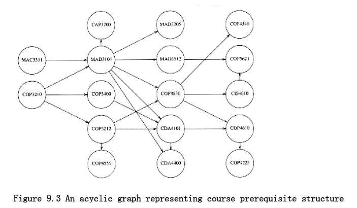
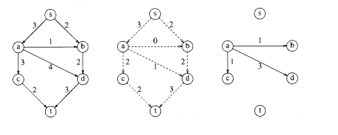
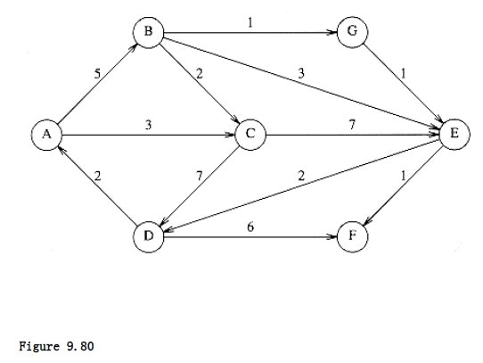

 
# Graph Algorithms

In this chapter we discuss several common problems in graph theory. Not only are these algorithms useful in practice, they are interesting because in many real- life applications they are too slow unless careful attention is paid to the choice of data structures. We will 
- Show several real-life problems, which can be converted to problems on graphs. 

- Give algorithms to solve several common graph problems.

- Show how the proper choice of data structures can drastically reduce the running time of these algorithms.

- See an important technique, known as depth-first search, and show how it can be used to solve several seemingly nontrivial problems in linear time.

## Definitions

A graph G = (V, E) consists of a set of vertices, V, and a set of edges, E. Each edge is a pair (v,w), where v,w V. Edges are sometimes referred to as arcs. If the pair is ordered, then the graph is directed. Directed graphs are sometimes referred to as digraphs. Vertex w is adjacent to v if and only if (v,w) E. In an undirected graph with edge (v,w), and hence (w,v), w is adjacent to v and v is adjacent to w. Sometimes an edge has a third component, known as either a weight or a cost.

A path in a graph is a sequence of verices w~1~, w~2~, w~3~, . . . , wn such that (w~i~,w~i+i~) E for 1 i < n. The length of such a path is the number of edges on the path, which is equal to n - 1. We allow a path from a vertex to itself; if this path contains no edges, then the path lenght is 0. This is a convenient way to define an otherwise special case. If the graph contains an edge (v,v) from a vertex to itself, then the path v, v is sometimes referred to as a loop. The graphs we will consider will generally be loopless. A simple path is a path such that all vertices are distinct, except that the first and last could be the same.

A cycle in a directed graph is a path of length at least 1 such that w~1~ = w~n~; this cycle is simple if the path is simple. For undirected graphs, we require that the edges be distinct. The logic of these requirements is that the path u, v, u in an undirected graph should not be considered a cycle, because (u, v) and (v, u) are the same edge. In a directed graph, these are different edges, so it makes sense to call this a cycle. A directed graph is acyclic if it has no cycles. A directed acyclic graph is sometimes referred to by its abbreviation, DAG.

An undirected graph is connected if there is a path from every vertex to every other vertex. A directed graph with this property is called strongly connected. If a directed graph is not strongly connected, but the underlying graph (without direction to the arcs) is connected, then the graph is said to be weakly connected. A complete graph is a graph in which there is an edge between every pair of vertices.

An example of a real-life situation that can be modeled by a graph is the airport system. Each airport is a vertex, and two vertices are connected by an edge if there is a nonstop flight from the airports that are represented by the vertices. The edge could have a weight, representing the time, distance, or cost of the flight. It is reasonable to assume that such a graph is directed, since it might take longer or cost more (depending on local taxes, for example) to fly in different directions. We would probably like to make sure that the airport system is strongly connected, so that it is always possible to fly from any airport to any other airport. We might also like to quickly determine the best flight between any two airports. "Best" could mean the path with the fewest number of edges or could be taken with respect to one, or all, of the weight measures.

Traffic flow can be modeled by a graph. Each street intersection represents a vertex, and each street is an edge. The edge costs could represent, among other things, a speed limit or a capacity (number of lanes). We could then ask for the shortest route or use this information to find the most likely location for bottlenecks.

In the remainder of this chapter, we will see several more applications of graphs. Many of these graphs can be quite large, so it is important that the algorithms we use be efficient.

### Representation of Graphs

We will consider directed graphs (undirected graphs are similarly represented).

Suppose, for now, that we can number the vertices, starting at 1. The graph shown in Figure 9.1 represents 7 vertices and 12 edges. One simple way to represent a graph is to use a two-dimensional array. This is known as an adjacency matrix representation. For each edge (u, v), we set a[u][v] = 1; otherwise the entry in the array is 0. If the edge has a weight associated with it, then we can set a[u][v] equal to the weight and use either a very large or a very small weight as a sentinel to indicate nonexistent edges. For instance, if we were looking for the cheapest airplane route, we could represent nonexistent flights with a cost of . If we were looking, for some strange reason, for the most expensive airplane route, we could use (or perhaps 0) to represent nonexistent edges.

Although this has the merit of extreme simplicity, the space requirement is (|V|2), which can be prohibitive if the graph does not have very many edges. An adjacency matrix is an appropriate representation if the graph is dense: |E| = (|V|2). In most of the applications that we shall see, this is not true. For instance, suppose the graph represents a street map. Assume a Manhattan-like orientation, where almost all the streets run either north-south or east-west. Therefore, any intersection is attached to roughly four streets, so if the graph is directed and all streets are two-way, then |E| 4|V|. If there are 3,000 intersections, then we have a 3,000-vertex graph with 12,000 edge entries, which would require an array of size nine million. Most of these entries would contain zero. This is intuitively bad, because we want our data structures to represent the data that is actually there and not the data that is not present.


If the graph is not dense, in other words, if the graph is sparse, a better solution is an adjacency list representation. For each vertex, we keep a list of all adjacent vertices. The space requirement is then O|E| + |V|). The leftmost structure in Figure 9.2 is merely an array of header cells. The representation should be clear from Figure 9.2. If the edges have weights, then this additional information is also stored in the cells.

Adjacency lists are the standard way to represent graphs. Undirected graphs can be similarly represented; each edge (u, v) appears in two lists, so the space usage essentially doubles. A common requirement in graph algorithms is to find all vertices adjacent to some given vertex v, and this can be done, in time proportional to the number of such vertices found, by a simple scan down the appropriate adjacency list.

In most real-life applications, the vertices have names, which are unknown at compile time, instead of numbers. Since we cannot index an array by an unknown name, we must provide a mapping of names to numbers. The easiest way to do this is to use a hash table, in which we store a name and an internal number ranging from 1 to |V| for each vertex. The numbers are assigned as the graph is read. The first number assigned is 1. As each edge is input, we check whether each of the two vertices has been assigned a number, by seeing if it is in the hash table. If so, we use the internal number. Otherwise, we assign to the vertex the next available number and insert the vertex name and number into the hash table.

With this transformation, all the graph algorithms will use only the internal numbers. Since eventually we will need to output the real vertex names and not the internal numbers, we must also record, for each internal number, the corresponding vertex name. One way is to use an array of strings. If the vertex names are long, this can cost considerable space, because the vertex names are stored twice. An alternative is to keep an array of pointers into the hash table. The price of this alternative is a slight loss of the sanctity of the hash table ADT.


The code that we present in this chapter will be pseudocode using ADTS as much as possible. We will do this to save space and, of course, to make the algorithmic presentation of the algorithms much clearer.

## Topological Sort

A topological sort is an ordering of vertices in a directed acyclic graph, such that if there is a path from v~i~ to v~j~, then v~j~ appears after v~i~ in the ordering.

The graph in Figure 9.3 represents the course prerequisite structure at a state university in Miami. A directed edge (v,w) indicates that course v must be completed before course w may be attempted. A topological ordering of these courses is any course sequence that does not violate the prerequisite requirement.

It is clear that a topological ordering is not possible if the graph has a cycle, since for two vertices v and w on the cycle, v precedes w and w precedes v. Furthermore, the ordering is not necessarily unique; any legal ordering will do. In the graph in Figure 9.4, v~1~, v~2~, v~5~, v~4~, v~3~, v~7~, v~6~and v~1~, v~2~, v~5~, v~4~, v~7~, v~3~, v6 are both topological orderings.

A simple algorithm to find a topological ordering is first to find any vertex with no incoming edges. We can then print this vertex, and remove it, along with its edges, from the graph. Then we apply this same strategy to the rest of the graph.




To formalize this, we define the indegree of a vertex v as the number of edges (u,v). We compute the indegrees of all vertices in the graph. Assuming that the indegree array is initialized and that the graph is read into an adjacency list, we can then apply the algorithm in Figure 9.5 to generate a topological ordering.

The function find_new_vertex_of_indegree_zero scans the indegree array looking for a vertex with indegree 0 that has not already been assigned a topological number. It returns NOT_A_VERTEX if no such vertex exists; this indicates that the graph has a cycle.

```c
void
topsort(graph G){
unsigned int counter;
vertex v, w;
for(counter = 0; counter < NUM_VERTEX; counter++){
v = find_new_vertex_of_indegree_zero();
if(v = NOT_A_VERTEX){
error("Graph has a cycle");
break;
}
top_num[v] = counter;
for each w adjacent to v
indegree[w]--;
}
}
```
**Figure 9.5 Simple topological sort pseudocode**

Because find_new_vertex_of_indegree_zero is a simple sequential scan of the indegree array, each call to it takes O(|V|) time. Since there are |V| such calls, the running time of the algorithm is O(|V|^2^).

By paying more careful attention to the data structures, it is possible to do better. The cause of the poor running time is the sequential scan through the indegree array. If the graph is sparse, we would expect that only a few vertices have their indegrees updated during each iteration. However, in the search for a vertex of indegree 0, we look at (potentially) all the vertices, even though only a few have changed.

We can remove this inefficiency by keeping all the (unassigned) vertices of indegree 0 in a special box. The find_new_vertex_of_indegree_zero function then returns (and removes) any vertex in the box. When we decrement the indegrees of the adjacent vertices, we check each vertex and place it in the box if its indegree falls to 0.

To implement the box, we can use either a stack or a queue. First, the indegree is computed for every vertex. Then all vertices of indegree 0 are placed on an initially empty queue. While the queue is not empty, a vertex v is removed, and all edges adjacent to v have their indegrees decremented. A vertex is put on the queue as soon as its indegree falls to 0. The topological ordering then is the order in which the vertices dequeue. Figure 9.6 shows the status after each phase.

A pseudocode implementation of this algorithm is given in Figure 9.7. As before, we will assume that the graph is already read into an adjacency list and that the indegrees are computed and placed in an array. A convenient way of doing this in practice would be to place the indegree of each vertex in the header cell. We also assume an array top_num, in which to place the topological numbering.

Indegree Before Dequeue #

Vertex 1 2 3 4 5 6 7

--------------------------------------

v1 0 0 0 0 0 0 0

v2 1 0 0 0 0 0 0

v3 2 1 1 1 0 0 0

v4 3 2 1 0 0 0 0

v5 1 1 0 0 0 0 0

v6 3 3 3 3 2 1 0

v7 2 2 2 1 0 0 0

--------------------------------------

enqueue v1 v2 v5 v4 v3 v7 v6

--------------------------------------

dequeue v1 v2 v5 v4 v3 v7 v6

Figure 9.6 Result of applying topological sort to the graph in Figure 9.4
```c
void topsort(graph G)
{

QUEUE Q;

unsigned int counter;

vertex v, w;
 
Q = create_queue(NUM_VERTEX); make_null(Q); counter = 0;

for each vertex v

if(indegree[v] = 0)
enqueue(v, Q);

while(!is_empty(Q))
{

v = dequeue(Q);

top_num[v] = ++counter; * assign next number *

for each w adjacent to v

if(--indegree[w] = 0)
enqueue(w, Q);

}

if(counter != NUM_VERTEX)
error("Graph has a cycle");

dispose_queue(Q); * free the memory *

}
```
**Figure 9.7 Pseudocode to perform topological sort**

The time to perform this algorithm is O(|E| + |V|) if adjacency lists are used. This is apparent when one realizes that the body of the for loop at line 8 is executed at most once per edge. The queue operations are done at most once per vertex, and the initialization steps also take time proportional to the size of the graph.

## Shortest-Path Algorithms

In this section we examine various shortest-path problems. The input is a weighted graph: associated with each edge (v~i~, v~j~) is a cost c~i,j~ to traverse the arc. The cost of a path v~1~v~2~ ... v~n~ is This is referred to as the weighted path length. The unweighted path length is merely the number of edges on the path, namely, n - 1.

**SINGLE-SOURCE SHORTEST-PATH PROBLEM:**

Given as input a weighted graph, G = (V, E), and a distinguished vertex, s , find the shortest weighted path from s to every other vertex in G.

For example, in the graph in Figure 9.8, the shortest weighted path from v~1~ to v6 has a cost of 6 and goes from v~1~ to v~4~ to v~7~ to v~6~. The shortest unweighted path between these vertices is 2.

Generally, when it is not specified whether we are referring to a weighted or an unweighted path, the path is weighted if the graph is. Notice also that in this graph there is no path from v6 to v1.

The graph in the preceding example has no edges of negative cost. The graph in Figure 9.9 shows the problems that negative edges can cause. The path from v~5~ to v~4~ has cost 1, but a shorter path exists by following the loop v~5~, v~4~, v~2~, v~5~, v~4~, which has cost -5. This path is still not the shortest, because we could stay in the loop arbitrarily long. Thus, the shortest path between these two points is undefined. Similarly, the shortest path from v~~ to v~6~ is undefined, because we can get into the same loop. This loop is known as a negative-cost cycle; when one is present in the graph, the shortest paths are not defined. Negative-cost edges are not necessarily bad, as the cycles are, but their presence seems to make the problem harder. For convenience, in the absence of a negative-cost cycle, the shortest path from s to s is zero.


There are many examples where we might want to solve the shortest-path problem. If the vertices represent computers; the edges represent a link between computers; and the costs represent communication costs (phone bill per 1,000 bytes of data), delay costs (number of seconds required to transmit 1,000 bytes), or a combination of these and other factors, then we can use the shortest-path algorithm to find the cheapest way to send electronic news from one computer to a set of other computers.

We can model airplane or other mass transit routes by graphs and use a shortest-path algorithm to compute the best route between two points. In this and many practical applications, we might want to find the shortest path from one vertex, s, to only one other vertex, t. Currently there are no algorithms in which finding the path from s to one vertex is any faster (by more than a constant factor) than finding the path from s to all vertices.

We will examine algorithms to solve four versions of this problem. First, we will consider the unweighted shortest-path problem and show how to solve it in O(|E| + |V|). Next, we will show how to solve the weighted shortest-path problem if we assume that there are no negative edges. The running time for this algorithm is O (|E| log |V|) when implemented with reasonable data structures.

If the graph has negative edges, we will provide a simple solution, which unfortunately has a poor time bound of O (|E| |V|). Finally, we will solve the weighted problem for the special case of acyclic graphs in linear time.

### Unweighted Shortest Paths

Figure 9.10 shows an unweighted graph, G. Using some vertex, s, which is an input parameter, we would like to find the shortest path from s to all other vertices. We are only interested in the number of edges contained on the path, so there are no weights on the edges. This is clearly a special case of the weighted shortest-path problem, since we could assign all edges a weight of 1.

For now, suppose we are interested only in the length of the shortest paths, not in the actual paths themselves. Keeping track of the actual paths will turn out to be a matter of simple bookkeeping.


Suppose we choose s to be v3. Immediately, we can tell that the shortest path from s to v3 is then a path of length 0. We can mark this information, obtaining the graph in Figure 9.11.

Now we can start looking for all vertices that are a distance 1 away from s. These can be found by looking at the vertices that are adjacent to s. If we do this, we see that v1 and v6 are one
edge from s. This is shown in Figure 9.12.
 


We can now find vertices whose shortest path from s is exactly 2, by finding all the vertices adjacent to v~1~ and v~~ (the vertices at distance 1), whose shortest paths are not already known.

This search tells us that the shortest path to v~2~ and v~4~ is 2. Figure 9.13 shows the progress that has been made so far.

Finally we can find, by examining vertices adjacent to the recently evaluated v~2~ and v~4~, that v~5~and v~7~ have a shortest path of three edges. All vertices have now been calculated, and so Figure 9.14 shows the final result of the algorithm.

This strategy for searching a graph is known as breadth-first search. It operates by processing vertices in layers: the vertices closest to the start are evaluated first, and the most distant vertices are evaluated last. This is much the same as a level-order traversal for trees.

Given this strategy, we must translate it into code. Figure 9.15 shows the initial configuration of the table that our algorithm will use to keep track of its progress.

For each vertex, we will keep track of three pieces of information. First, we will keep its distance from s in the entry dv. Initially all vertices are unreachable except for s, whose path length is 0. The entry in pv is the bookkeeping variable, which will allow us to print the actual paths. The entry known is set to 1 after a vertex is processed. Initially, all entries are unknown, including the start vertex.
 


v Known d~v~ p~v~

------------------

v~1~ 0 0

v~2~ 0 0

v~3~ 0 0 0

v~4~ 0 0

v~5~ 0 0

v~6~ 0 0

v~7~ 0 0

Figure 9.15 Initial configuration of table used in unweighted shortest-path computation

When a vertex is known, we have a guarantee that no cheaper path will ever be found, and so processing for that vertex is essentially complete.

The basic algorithm can be described in Figure 9.16. The algorithm in Figure 9.16 mimics the diagrams by declaring as known the vertices at distance d = 0, then d = 1, then d = 2, and so on,and setting all the adjacent vertices w that still have dw = to a distance dw = d + 1.

By tracing back through the pv variable, the actual path can be printed. We will see how when we discuss the weighted case.
 
The running time of the algorithm is O(|V|2), because of the doubly nested for loops. An obvious inefficiency is that the outside loop continues until NUM_VERTEX -1, even if all the vertices become known much earlier. Although an extra test could be made to avoid this, it does not affect the worst-case running time, as can be seen by generalizing what happens when the input is the graph in Figure 9.17 with start vertex v9.
```c
void unweighted(TABLE T) * assume T is initialized *
{

unsigned int curr_dist;

vertex v, w;

for(curr_dist = 0; curr_dist < NUM_VERTEX; curr_dist++)

for each vertex v

if((!T[v].known) && (T[v].dist = curr_dist)){

T[v].known = TRUE;

for each w adjacent to v

if(T[w].dist = INT_MAX){

T[w].dist = curr_dist + 1;

T[w].path = v;

}

}

}
```
**Figure 9.16 Pseudocode for unweighted shortest-path algorithm**


 We can remove the inefficiency in much the same way as was done for topological sort. At any point in time, there are only two types of unknown vertices that have d~v~ . Some have d~v~ = curr_dist, and the rest have d~v~ = curr_dist + 1. Because of this extra structure, it is very wasteful to search through the entire table to find a proper vertex at lines 2 and 3.

A very simple but abstract solution is to keep two boxes. Box #1 will have the unknown vertices with dv = curr_dist, and box #2 will have dv = curr_dist + 1. The test at lines 2 and 3 can be replaced by finding any vertex in box #1. After line 8 (inside the if block), we can add w to box #2. After the outside for loop terminates, box #1 is empty, and box #2 can be transferred to box #1 for the next pass of the for loop.

We can refine this idea even further by using just one queue. At the start of the pass, the queue contains only vertices of distance curr_dist. When we add adjacent vertices of distance curr_dist + 1, since they enqueue at the rear, we are guaranteed that they will not be processed until after all the vertices of distance curr_dist have been processed. After the last vertex at distance curr_dist dequeues and is processed, the queue only contains vertices of distance curr_dist + 1, so this process perpetuates. We merely need to begin the process by placing the start node on the queue by itself.

The refined algorithm is shown in Figure 9.18. In the pseudocode, we have assumed that the start vertex, s, is known somehow and T[s].dist is 0. A C routine might pass s as an argument. Also, it is possible that the queue might empty prematurely, if some vertices are unreachable from the start node. In this case, a distance of INT_MAX will be reported for these nodes, which is perfectly reasonable. Finally, the known field is not used; once a vertex is processed it can never enter the queue again, so the fact that it need not be reprocessed is implicitly marked. Thus, the known field can be discarded. Figure 9.19 shows how the values on the graph we have been using are changed during the algorithm. We keep the known field to make the table easier to follow, and for consistency with the rest of this section.

Using the same analysis as was performed for topological sort, we see that the running time is O (|E| + |V|), as long as adjacency lists are used.

### Dijkstra's Algorithm

If the graph is weighted, the problem (apparently) becomes harder, but we can still use the ideas from the unweighted case.

We keep all of the same information as before. Thus, each vertex is marked as either known or unknown. A tentative distance dv is kept for each vertex, as before. This distance turns out to be the shortest path length from s to v using only known vertices as intermediates. As before, we record p~v~, which is the last vertex to cause a change to d~v~.
```c
void unweighted(TABLE T) * assume T is initialized (Fig 9.30) *
{

QUEUE Q;

vertex v, w;

Q = create_queue(NUM_VERTEX); make_null(Q);

* enqueue the start vertex s, determined elsewhere *

enqueue(s, Q);

while(!is empty(Q))
{

v = dequeue(Q);

T[v].known = TRUE; * not really needed anymore *

for each w adjacent to v

if(T[w].dist = INT_MAX){

T[w].dist = T[v].dist + 1;

T[w].path = v;

enqueue(w, Q);

}

}

dispose_queue(Q); * free the memory *

}
```
**Figure 9.18 Pseudocode for unweighted shortest-path algorithm**

The general method to solve the single-source shortest-path problem is known as Dijkstra's algorithm. This thirty-year-old solution is a prime example of a greedy algorithm. Greedy algorithms generally solve a problem in stages by doing what appears to be the best thing at each stage. For example, to make change in U.S. currency, most people count out the quarters first, then the dimes, nickels, and pennies. This greedy algorithm gives change using the minimum number of coins. The main problem with greedy algorithms is that they do not always work. The addition of a 12-cent piece breaks the coin-changing algorithm, because the answer it gives (one 12-cent piece and three pennies) is not optimal (one dime and one nickel).

Dijkstra's algorithm proceeds in stages, just like the unweighted shortest-path algorithm. At each stage, Dijkstra's algorithm selects a vertex v, which has the smallest dv among all the unknown vertices, and declares that the shortest path from s to v is known. The remainder of a stage consists of updating the values of dw.

Initial State v~3~ Dequeued v~1~ Dequeued v~6~ Dequeued

------------- -------------- ------------- -------------

v Known d~v~ p~v~ Known d~v~ p~v~ Known d~v~ p~v~ Known d~v~ p~v~

----------------------------------------------------------------

v~1~ 0 0 0 1 v~3~ 1 1 v~3~ 1 1 v~3~

v~2~ 0 0 0 0 0 2 v~1~ 0 2 v~1~

v~3~ 0 0 0 1 0 0 1 0 0 1 0 0
 
v~4~ 0 0 0 0 0 2 v~1~ 0 2 v~1~

v~5~ 0 0 0 0 0 0 0 0

v~6~ 0 0 0 1 v~3~ 0 1 v~3~ 1 1 v~3~

v~7~ 0 0 0 0 0 0 0 0

----------------------------------------------------------------

Q: v~3~ v~1~,v~6~ v~6~,v~2~,v4 v~2~,v4

v~2~ Dequeued v~4~ Dequeued v~5~ Dequeued v~7~ Dequeued

------------- -------------- ------------- -------------

v Known d~v~ p~v~ Known d~v~ p~v~ Known d~v~ p~v~ Known d~v~ p~v~

----------------------------------------------------------------

v~1~ 1 1 v~3~ 1 1 v~3~ 1 1 v~3~ 1 1 v~3~

v~2~ 1 2 v~1~ 1 2 v~1~ 1 2 v~1~ 1 2 v~1~

v~3~ 1 0 0 1 0 0 1 0 0 1 0 0

v~4~ 0 2 v~1~ 1 2 v~1~ 1 2 v~1~ 1 2 v~1~

v~5~ 0 3 v~2~ 0 3 v~2~ 1 3 v~2~ 1 3 v~2~

v~6~ 1 1 v~3~ 1 1 v~3~ 1 1 v~3~ 1 1 v~3~

v~7~ 0 0 0 3 v~4~ 0 3 v~4~ 1 3 v~4~

----------------------------------------------------------------

Q: v~4~,v~5~ v~5~,v~7~ v~7~ empty

Figure 9.19 How the data structure changes during the unweighted shortest-path algorithm In the unweighted case, we set d~w~ = d~v + 1~ if d~w~ = . Thus, we essentially lowered the value of dw if vertex v offered a shorter path. If we apply the same logic to the weighted case, then we should set d~w~ = d~v~ + c~v~,w if this new value for dw would be an improvement. Put simply, the algorithm decides whether or not it is a good idea to use v on the path to w. The original cost, dw, is the cost without using v; the cost calculated above is the cheapest path using v (and only known vertices).

The graph in Figure 9.20 is our example. Figure 9.21 represents the initial configuration, assuming that the start node, s, is v~2~. The first vertex selected is v~1~, with path length 0. This vertex is marked known. Now that v~1~ is known, some entries need to be adjusted. The vertices adjacent to v~1~ are v~2~ and v~4~. Both these vertices get their entries adjusted, as indicated in
Figure 9.22.

Next, v~4~ is selected and marked known. Vertices v~3~, v~5~, v~6~, and v~7~ are adjacent, and it turns out that all require adjusting, as shown in Figure 9.23.

Next, v~2~ is selected. v~4~ is adjacent but already known, so no work is performed on it. v~5~ is adjacent but not adjusted, because the cost of going through v~2~ is 2 + 10 = 12 and a path of length 3 is already known. Figure 9.24 shows the table after these vertices are selected.


v Known d~v~ p~v~

-------------------

v~1~ 0 0 0

v~2~ 0 0

v~3~ 0 0

v~4~ 0 0

v~5~ 0 0

v~6~ 0 0

v~7~ 0 0
  

Figure 9.21 Initial configuration of table used in Dijkstra's algorithm


v Known d~v~ p~v~

--------------------

v~1~ 1 0 0

v~2~ 0 2 v~1~

v~3~ 0 0

v~4~ 0 1 v~1~

v~5~ 0 0

v~6~ 0 0

v~7~ 0 0

Figure 9.22 After v~1~ **is declared known**

v Known d~v~ p~v~

--------------------

v~1~ 1 0 0

v~2~ 0 2 v~1~

v~3~ 0 3 v~4~

v~4~ 1 1 v~1~

v~5~ 0 3 v~4~

v~6~ 0 9 v~4~

v~7~ 0 5 v~4~

Figure 9.23 After v~4~ **is declared known**

v Known d~v~ p~v~ 

--------------------

v~1~ 1 0 0

v~2~ 1 2 v~1~

v~3~ 0 3 v~4~

v~4~ 1 1 v~1~

v~5~ 0 3 v~4~

v~6~ 0 9 v~4~

v~7~ 0 5 v~4~

Figure 9.24 After v~2~ **is declared known**

v Known d~v~ p~v~

--------------------

v~1~ 1 0 0

v~2~ 1 2 v~1~

v~3~ 1 3 v~4~

v~4~ 1 1 v~1~

v~5~ 1 3 v~4~

v~6~ 0 8 v~3~

v~7~ 0 5 v~4~

Figure 9.25 After v~5~ **and then v~3~ are declared known**

v Known d~v~ p~v~

-------------------

v~1~ 1 0 0

v~2~ 1 2 v~1~

v~3~ 1 3 v~4~

v~4~ 1 1 v~1~

v~5~ 1 3 v~4~

v~6~ 0 6 v~7~

v~7~ 1 5 v~4~

Figure 9.26 After v~7~ **is declared known**

The next vertex selected is v5 at cost 3. v7 is the only adjacent vertex, but it is not adjusted, because 3 + 6 > 5. Then v3 is selected, and the distance for v6 is adjusted down to 3 + 5 = 8.

The resulting table is depicted in Figure 9.25.

Next v7 is selected; v6 gets updated down to 5 + 1 = 6. The resulting table is Figure 9.26.

Finally, v6 is selected. The final table is shown in Figure 9.27. Figure 9.28 graphically shows how edges are marked known and vertices updated during Dijkstra's algorithm.

v Known d~v~ p~v~

-------------------

v~1~ 1 0 0

v~2~ 1 2 v~1~

v~3~ 1 3 v~4~

v~4~ 1 1 v~1~

v~5~ 1 3 v~4~

v~6~ 1 6 v~7~

v~7~ 1 5 v~4~

Figure 9.27 After v~6~ **is declared known and algorithm terminates**
  


To print out the actual path from a start vertex to some vertex v, we can write a recursive routine to follow the trail left in the p array.

We now give pseudocode to implement Dijkstra's algorithm. We will assume that the vertices are numbered from 0 to NUM_VERTEX for convenience (see Fig. 9.29), and that the graph can be read into an adjacency list by the routine read_graph.

In the routine in Figure 9.30, the start vertex is passed to the initialization routine. This is the only place in the code where the start vertex needs to be known.

The path can be printed out using the recursive routine in Figure 9.31. The routine recursively prints the path all the way up to the vertex before v on the path, and then just prints v. This works because the path is simple.
```c
typedef int vertex;

struct table_entry
{

LIST header; /* Adjacency list header */

int known;

dist_type dist;

vertex path;

};

/* Vertices are numbered from 1 */

#define NOT_A_VERTEX 0

typedef struct table_entry TABLE[NUM_VERTEX+1];
```
**Figure 9.29 Declarations for Dijkstra's algorithm**
```c
void init_table(vertex start, graph G, TABLE T)
{

int i;

read graph(G, T); /* read graph somehow */

for(i=NUM_VERTEX; i>0; i--)
{

T[i].known = FALSE;

T[i].dist = INT_MAX;

T[i].path = NOT_A_VERTEX;

}

T[start].dist = 0;

}
```
**Figure 9.30 Table initialization routine**

/* print shortest path to v after dijkstra has run */

/* assume that the path exists */  
```c
void print_path(vertex v, TABLE T)
{

if(T[v].path != NOT_A_VERTEX){

print_path(T[v].path, T);

printf(" to ");

}

printf("%v", v); /* %v is a pseudocode option for printf */

}
```
**Figure 9.31 Routine to print the actual shortest path**

Figure 9.32 shows the main algorithm, which is just a for loop to fill up the table using the greedy selection rule.

A proof by contradiction will show that this algorithm always works as long as no edge has a negative cost. If any edge has negative cost, the algorithm could produce the wrong answer (see Exercise 9.7a). The running time depends on how the table is manipulated, which we have yet to consider. If we use the obvious algorithm of scanning down the table to find the minimum dv, each phase will take O(|V|) time to find the minimum, and thus O(|V|~2~) time will be spent finding the minimum over the course of the algorithm. The time for updating d~w~ is constant per update, and there is at most one update per edge for a total of O(|E|). Thus, the total running time is O(|E|\+ |V|~2~) = O(|V|~2~). If the graph is dense, with |E| = (|V|~2~), this algorithm is not only simple but essentially optimal, since it runs in time linear in the number of edges.

If the graph is sparse, with |E| = (|V|), this algorithm is too slow. In this case, the distances would need to be kept in a priority queue. There are actually two ways to do this; both are similar.

Lines 2 and 5 combine to form a delete_min operation, since once the unknown minimum vertex is found, it is no longer unknown and must be removed from future consideration. The update at line 9 can be implemented two ways.

One way treats the update as a decrease_key operation. The time to find the minimum is then O(log |V|), as is the time to perform updates, which amount to decrease_key operations. This gives a running time of O(|E| log |V| + |V| log |V|) = O(|E| log |V|), an improvement over the previous bound for sparse graphs. Since priority queues do not efficiently support the find operation, the location in the priority queue of each value of di will need to be maintained and updated whenever di changes in the priority queue. This is not typical of the priority queue ADT and thus is considered ugly.

The alternate method is to insert w and the new value dw into the priority queue every time line 9 is executed. Thus, there may be more than one representative for each vertex in the priority queue. When the delete_min operation removes the smallest vertex from the priority queue, it must be checked to make sure that it is not already known. Thus, line 2 becomes a loop performing delete_mins until an unknown vertex emerges. Although this method is superior from a software point of view, and is certainly much easier to code, the size of the priority queue could get to be as big as |E|. This does not affect the asymptotic time bounds, since |E| |V|2 implies that log|E| 2 log |V|. Thus, we still get an O(|E| log |V|) algorithm. However, the space requirement does increase, and this could be important in some applications. Moreover, because this method requires |E| delete_mins instead of only |V|, it is likely to be slower in practice.
```c
void dijkstra(TABLE T)
{

vertex v, w;

for(; ;)
{

v = smallest unknown distance vertex;

break;

T[v].known = TRUE;

for each w adjacent to v

if(!T[w].known)
if(T[v].dist + cv,w < T[w].dist){ /* update w */

decrease(T[w].dist to

T[v].dist + cv,w);

T[w].path = v;

}

}

}
``` 

Figure 9.32 Pseudocode for Dijkstra's algorithm

Notice that for the typical problems, such as computer mail and mass transit commutes, the graphs are typically very sparse because most vertices have only a couple of edges, so it is important in many applications to use a priority queue to solve this problem.

There are better time bounds possible using Dijkstra's algorithm if different data structures are used. In Chapter 11, we will see another priority queue data structure called the Fibonacci heap. When this is used, the running time is O(|E| + |V| log |V|). Fibonacci heaps have good theoretical time bounds but a fair amount of overhead, so it is not dear whether using Fibonacci heaps is actually better in practice than Dijkstra's algorithm with binary heaps. Needless to say, there are no average-case results for this problem, since it is not even obvious how to model a random graph.
```c
void /* assume T is initialized as in Fig 9.18 */

weighted_negative(TABLE T)
{

QUEUE Q;

vertex v, w;

Q = create_queue(NUM_VERTEX); make_null(Q);

enqueue(s, Q); /* enqueue the start vertex s */

while(!is_empty(Q))
{

v = dequeue(Q);

for each w adjacent to v

if(T[v].dist + cv,w < T[w].dist){ /*update w */

T[w].dist = T[v].dist + cv,w ;

T[w].path = v;

if(w is not already in Q)
enqueue(w, Q);

}

}

dispose_queue(Q);

}
```

Figure 9.33 Pseudocode for weighted shortest-path algorithm with negative edge costs

### Graphs with Negative Edge Costs

If the graph has negative edge costs, then Dijkstra's algorithm does not work. The problem is that once a vertex u is declared known, it is possible that from some other, unknown vertex v there is a path back to u that is very negative. In such a case, taking a path from s to v back to u is better than going from s to u without using v.

A combination of the weighted and unweighted algorithms will solve the problem, but at the cost of a drastic increase in running time. We forget about the concept of known vertices, since our algorithm needs to be able to change its mind. We begin by placing s on a queue. Then, at each stage, we dequeue a vertex v. We find all vertices w adjacent to v such that d~w~ > d~v~ + c~v~,w. We update dw and pw, and place w on a queue if it is not already there. A bit can be set for each vertex to indicate presence in the queue. We repeat the process until the queue is empty.

Figure 9.33 (almost) implements this algorithm.

Although the algorithm works if there are no negative-cost cycles, it is no longer true that the code in lines 6 through 10 is executed once per edge. Each vertex can dequeue at most |V| times, so the running time is O(|E| |V|) if adjacency lists are used (Exercise 9.7b). This is quite an increase from Dijkstra's algorithm, so it is fortunate that, in practice, edge costs are nonnegative. If negative-cost cycles are present, then the algorithm as written will loop indefinitely. By stopping the algorithm after any vertex has dequeued |V| + 1 times, we can guarantee termination.

### Acyclic Graphs

If the graph is known to be acyclic, we can improve Dijkstra's algorithm by changing the order in which vertices are declared known, otherwise known as the vertex selection rule. The new rule is to select vertices in topological order. The algorithm can be done in one pass, since the selections and updates can take place as the topological sort is being performed.

This selection rule works because when a vertex v is selected, its distance, dv, can no longer be lowered, since by the topological ordering rule it has no incoming edges emanating from unknown nodes.

There is no need for a priority queue with this selection rule; the running time is O(|E| + |V|), since the selection takes constant time.

An acyclic graph could model some downhill skiing problem -- we want to get from point a to b, but can only go downhill, so clearly there are no cycles. Another possible application might be the modeling of (nonreversible) chemical reactions. We could have each vertex represent a particular state of an experiment. Edges would represent a transition from one state to another, and the edge weights might represent the energy released. If only transitions from a higher energy state to a lower are allowed, the graph is acyclic.

A more important use of acyclic graphs is critical path analysis. The graph in Figure 9.34 will serve as our example. Each node represents an activity that must be performed, along with the time it takes to complete the activity. This graph is thus known as an activity-node graph. The edges represent precedence relationships: An edge (v, w) means that activity v must be completed before activity w may begin. Of course, this implies that the graph must be acyclic. We assume that any activities that do not depend (either directly or indirectly) on each other can be performed in parallel by different servers.


This type of a graph could be (and frequently is) used to model construction projects. In this case, there are several important questions which would be of interest to answer. First, what is the earliest completion time for the project? We can see from the graph that 10 time units are required along the path A, C, F, H. Another important question is to determine which activities can be delayed, and by how long, without affecting the minimum completion time. For instance, delaying any of A, C, F, or H would push the completion time past 10 units. On the other hand, activity B is less critical and can be delayed up to two time units without affecting the final completion time.

To perform these calculations, we convert the activity-node graph to an event-node graph. Each event corresponds to the completion of an activity and all its dependent activities. Events reachable from a node v in the event-node graph may not commence until after the event v is completed. This graph can be constructed automatically or by hand. Dummy edges and nodes may need to be inserted in the case where an activity depends on several others. This is necessary in order to avoid introducing false dependencies (or false lack of dependencies). The event node graph corresponding to the graph in Figure 9.34 is shown in Figure 9.35.

To find the earliest completion time of the project, we merely need to find the length of the longest path from the first event to the last event. For general graphs, the longest-path problem generally does not make sense, because of the possibility of positive-cost cycles. These are the equivalent of negative-cost cycles in shortest-path problems. If positive-cost cycles are present, we could ask for the longest simple path, but no satisfactory solution is known for this problem. Since the event-node graph is acyclic, we need not worry about cycles. In this case, it is easy to adapt the shortest-path algorithm to compute the earliest completion time for all nodes in the graph. If E Ci is the earliest completion time for node i, then the applicable rules


Figure 9.36 shows the earliest completion time for each event in our example event-node graph.

We can also compute the latest time, LCi, that each event can finish without affecting the final completion time. The formulas to do this are LCn = ECn


These values can be computed in linear time by maintaining, for each vertex, a list of all adjacent and preceding vertices. The earliest completion times are computed for vertices by their topological order, and the latest completion times are computed by reverse topological order. The latest completion times are shown in Figure 9.37.

The slack time for each edge in the event-node graph represents the amount of time that the completion of the corresponding activity can be delayed without delaying the overall completion. It is easy to see that


Figure 9.38 shows the slack (as the third entry) for each activity in the event-node graph. For each node, the top number is the earliest completion time and the bottom entry is the latest completion time.


Some activities have zero slack. These are critical activities, which must finish on schedule. There is at least one path consisting entirely of zero-slack edges; such a path is a critical path.

### All-Pairs Shortest Path

Sometimes it is important to find the shortest paths between all pairs of vertices in the graph. Although we could just run the appropriate single-source algorithm |V| times, we might expect a somewhat faster solution, especially on a dense graph, if we compute all the information at once.

In Chapter 10, we will see an O(|V|~3~) algorithm to solve this problem for weighted graphs. Although, for dense graphs, this is the same bound as running a simple (non-priority queue) Dijkstra's algorithm |V| times, the loops are so tight that the specialized all-pairs algorithm is likely to be faster in practice. On sparse graphs, of course, it is faster to run |V| Dijkstra's algorithms coded with priority queues.

## Network Flow Problems

Suppose we are given a directed graph G = (V, E) with edge capacities c~v,w~. These capacities could represent the amount of water that could flow through a pipe or the amount of traffic that could flow on a street between two intersections. We have two vertices: s, which we call the source, and t, which is the sink. Through any edge, (v, w), at most c~v,w~ units of "flow" may pass. At any vertex, v, that is not either s or t, the total flow coming in must equal the total flow going out. The maximum flow problem is to determine the maximum amount of flow that can pass from s to t. As an example, for the graph in Figure 9.39 on the left the maximum flow is 5, as indicated by the graph on the right.


As required by the problem statement, no edge carries more flow than its capacity. Vertex a has three units of flow coming in, which it distributes to c and d. Vertex d takes three units of flow from a and b and combines this, sending the result to t. A vertex can combine and distribute flow in any manner that it likes, as long as edge capacities are not violated and as long as flow conservation is maintained (what goes in must come out).

### A Simple Maximum-Flow Algorithm

A first attempt to solve the problem proceeds in stages. We start with our graph, G, and construct a flow graph Gf. Gf tells the flow that has been attained at any stage in the algorithm. Initially all edges in Gf have no flow, and we hope that when the algorithm terminates, Gf contains a maximum flow. We also construct a graph, Gr, called the residual graph. Gr tells, for each edge, how much more flow can be added. We can calculate this by subtracting the current flow from the capacity for each edge. An edge in Gr is known as a residual edge.

At each stage, we find a path in Gr from s to t. This path is known as an augmenting path. The minimum edge on this path is the amount of flow that can be added to every edge on the path. We do this by adjusting Gf and recomputing Gr. When we find no path from s to t in Gr, we terminate.

This algorithm is nondeterministic, in that we are free to choose any path from s to t; obviously some choices are better than others, and we will address this issue later. We will run this algorithm on our example. The graphs below are G, Gf, Gr respectively. Keep in mind that there is a slight flaw in this algorithm. The initial configuration is in Figure 9.40.

There are many paths from s to t in the residual graph. Suppose we select s, b, d, t. Then we can send two units of flow through every edge on this path. We will adopt the convention that once we have filled (saturated) an edge, it is removed from the residual graph. We then obtain Figure 9.41.

Next, we might select the path s, a, c, t, which also allows two units of flow. Making the required adjustments gives the graphs in Figure 9.42.


  


The only path left to select is s, a, d, t, which allows one unit of flow. The resulting graphs are shown in Figure 9.43.

The algorithm terminates at this point, because t is unreachable from s. The resulting flow of 5 happens to be the maximum. To see what the problem is, suppose that with our initial graph, we chose the path s, a, d, t. This path allows 3 units of flow and thus seems to be a good choice. The result of this choice, however, is that there is now no longer any path from s to t in the residual graph, and thus, our algorithm has failed to find an optimal solution. This is an example of a greedy algorithm that does not work. Figure 9.44 shows why the algorithm fails.

In order to make this algorithm work, we need to allow the algorithm to change its mind. To do this, for every edge (v, w) with flow fv,w in the flow graph, we will add an edge in the residual graph (w, v) of capacity fv,w. In effect, we are allowing the algorithm to undo its decisions by sending flow back in the opposite direction. This is best seen by example. Starting from our original graph and selecting the augmenting path s, a, d, t, we obtain the graphs in Figure 9.45.

Notice that in the residual graph, there are edges in both directions between a and d. Either one more unit of flow can be pushed from a to d, or up to three units can be pushed back -- we can undo flow. Now the algorithm finds the augmenting path s, b, d, a, c, t, of flow 2. By pushing two units of flow from d to a, the algorithm takes two units of flow away from the edge (a, d) and is essentially changing its mind. Figure 9.46 shows the new graphs.


 
**Figure 9.43 G, Gf , Gr after one unit of flow added along s, a, d, t -- algorithm terminates**


**algorithm terminates with suboptimal solution**


There is no augmenting path in this graph, so the algorithm terminates. Surprisingly, it can be shown that if the edge capacities are rational numbers, this algorithm always terminates with a maximum flow. This proof is somewhat difficult and is beyond the scope of this text. Although the example happened to be acyclic, this is not a requirement for the algorithm to work. We have used acyclic graphs merely to keep things simple.

If the capacities are all integers and the maximum flow is f, then, since each augmenting path increases the flow value by at least 1, f stages suffice, and the total running time is O(f |E|), since an augmenting path can be found in O(|E|) time by an unweighted shortest-path algorithm. The classic example of why this is a bad running time is shown by the graph in


The maximum flow is seen by inspection to be 2,000,000 by sending 1,000,000 down each side. Random augmentations could continually augment along a path that includes the edge connected by a and b. If this were to occur repeatedly, 2,000,000 augmentations would be required, when we could get by with only 2.

A simple method to get around this problem is always to choose the augmenting path that allows the largest increase in flow. Finding such a path is similar to solving a weighted shortest-path problem and a single-line modification to Dijkstra's algorithm will do the trick. If capmax is the maximum edge capacity, then one can show that O(|E| log capmax) augmentations will suffice to find the maximum flow. In this case, since O(|E| log |V|) time is used for each calculation of an augmenting path, a total bound of O(|E|2 log |V| log capmax) is obtained. If the capacities are all small integers, this reduces to O(|E|2 log |V|).

Another way to choose augmenting paths is always to take the path with the least number of edges, with the plausible expectation that by choosing a path in this manner, it is less likely that a small, flow-restricting edge will turn up on the path. Using this rule, it can be shown that O

(|E| |V|) augmenting steps are required. Each step takes O(|E|), again using an unweighted shortest-path algorithm, yielding a O(|E|~2~|V|) bound on the running time.

Further data structure improvements are possible to this algorithm, and there are several, more complicated, algorithms. A long history of improved bounds has lowered the current best-known bound for this problem to O(|E||V| log(|V|2/ |E|)) (see the references). There are also a host of very good bounds for special cases. For instance, O(|E||V|~1/2~) time finds a maximum flow in a graph, having the property that all vertices except the source and sink have either a single incoming edge of capacity 1 or a single outgoing edge of capacity 1. These graphs occur in many applications.

The analyses required to produce these bounds are rather intricate, and it is not clear how the worst-case results relate to the running times encountered in practice. A related, even more difficult problem is the min-cost flow problem. Each edge has not only a capacity but a cost per unit of flow. The problem is to find, among all maximum flows, the one flow of minimum cost. Both of these problems are being actively researched.

## Minimum Spanning Tree

The next problem we will consider is that of finding a minimum spanning tree in an undirected graph. The problem makes sense for directed graphs but appears to be more difficult. Informally, a minimum spanning tree of an undirected graph G is a tree formed from graph edges that connects all the vertices of G at lowest total cost. A minimum spanning tree exists if and only if G is connected. Although a robust algorithm should report the case that G is unconnected, we will assume that G is connected, and leave the issue of robustness as an exercise for the reader.

In Figure 9.48 the second graph is a minimum spanning tree of the first (it happens to be unique, but this is unusual). Notice that the number of edges in the minimum spanning tree is |V| - 1. The minimum spanning tree is a tree because it is acyclic, it is spanning because it covers every edge, and it is minimum for the obvious reason. If we need to wire a house with a minimum of cable, then a minimum spanning tree problem needs to be solved. There are two basic algorithms to solve this problem; both are greedy. We now describe them.


**9.5.1. Prim's Algorithm**

**9.5.2. Kruskal's Algorithm**

### Prim's Algorithm

One way to compute a minimum spanning tree is to grow the tree in successive stages. In each stage, one node is picked as the root, and we add an edge, and thus an associated vertex, to the tree.

At any point in the algorithm, we can see that we have a set of vertices that have already been included in the tree; the rest of the vertices have not. The algorithm then finds, at each stage, a new vertex to add to the tree by choosing the edge (u, v) such that the cost of (u, v) is the smallest among all edges where u is in the tree and v is not.

Figure 9.49 shows how this algorithm would build the minimum spanning tree, starting from v~1~. Initially, v~1~ is in the tree as a root with no edges. Each step adds one edge and one vertex to the tree.

We can see that Prim's algorithm is essentially identical to Dijkstra's algorithm for shortest paths. As before, for each vertex we keep values dv and pv and an indication of whether it is known or unknown. d~v~ is the weight of the shortest arc connecting v to a known vertex, and p~v~, as before, is the last vertex to cause a change in d~v~. The rest of the algorithm is exactly the same, with the exception that since the definition of dv is different, so is the update rule. For this problem, the update rule is even simpler than before: After a vertex v is selected, for each unknown w adjacent to v, d~v~ = min(d~w~, c~w~,v).


The initial configuration of the table is shown in Figure 9.50. v~1~ is selected, and v~2~, v~3~, and v~4~ are updated. The table resulting from this is shown in Figure 9.51. The next vertex selected is v~4~. Every vertex is adjacent to v~4~. v~1~ is not examined, because it is known. v~2~ is unchanged, because it has d~v = 2~ and the edge cost from v~4~ to v~2~ is 3; all the rest are updated. Figure 9.52 shows the resulting table. The next vertex chosen is v~2~ (arbitrarily breaking a tie). This does not affect any distances. Then v~3~ is chosen, which affects the distance in v~6~, producing Figure 9.53. Figure 9.54 results from the selection of v~7~, which forces v~6~ and v~5~ to be adjusted. v~6~ and then v~5~ are selected, completing the algorithm.

The final table is shown in Figure 9.55. The edges in the spanning tree can be read from the table: (v~2~, v~1~), (v~3~, v~4~), (v~4~, v~1~), (v~5~, v~7~), (v~6~, v~7~), (v~7~, v~4~). The total cost is 16.

The entire implementation of this algorithm is virtually identical to that of Dijkstra's algorithm, and everything that was said about the analysis of Dijkstra's algorithm applies here. Be aware that Prim's algorithm runs on undirected graphs, so when coding it, remember to put every edge in two adjacency lists. The running time is O (|V|^2^) without heaps, which is optimal for dense graphs, and O (|E| log |V|) using binary heaps, which is good for sparse graphs.

### Kruskal's Algorithm 

A second greedy strategy is continually to select the edges in order of smallest weight and accept an edge if it does not cause a cycle. The action of the algorithm on the graph in the preceding example is shown in Figure 9.56.

v Known d~v~ p~v~

--------------------

v~1~ 0 0 0

v~2~ 0 0

v~3~ 0 0

v~4~ 0 0

v~5~ 0 0

v~6~ 0 0

v~7~ 0 0

Figure 9.50 Initial configuration of table used in Prim's algorithm

v Known d~v~ p~v~

--------------------

v~1~ 1 0 0

v~2~ 0 2 v~1~

v~3~ 0 4 v~1~

v~4~ 0 1 v~1~

v~5~ 0 0

v~6~ 0 0

v~7~ 0 0

Figure 9.51 The table after v~1~ **is declared known**

v Known d~v~ p~v~

--------------------

v~1~ 1 0 0

v~2~ 0 2 v~1~

v~3~ 0 2 v~4~

v~4~ 1 1 v~1~

v~5~ 0 7 v~4~

v~6~ 0 8 v~4~

v~7~ 0 4 v~4~

Figure 9.52 The table after v~4~ **is declared known**

Formally, Kruskal's algorithm maintains a forest -- a collection of trees. Initially, there are |V| single-node trees. Adding an edge merges two trees into one. When the algorithm terminates, there is only one tree, and this is the minimum spanning tree. Figure 9.57 shows the order in which edges are added to the forest.

The algorithm terminates when enough edges are accepted. It turns out to be simple to decide whether edge (u,v) should be accepted or rejected. The appropriate data structure is the union/find algorithm of the previous chapter.

The invariant we will use is that at any point in the process, two vertices belong to the same set if and only if they are connected in the current spanning forest. Thus, each vertex is initially in its own set. If u and v are in the same set, the edge is rejected, because since they are already connected, adding (u, v) would form a cycle. Otherwise, the edge is accepted, and a union is performed on the two sets containing u and v. It is easy to see that this maintains the set invariant, because once the edge (u, v) is added to the spanning forest, if w was connected to u and x was connected to v, then x and w must now be connected, and thus belong in the same set.

v Known d~v~ p~v~

--------------------

v~1~ 1 0 0

v~2~ 1 2 v~1~

v~3~ 1 2 v~4~

v~4~ 1 1 v~1~

v~5~ 0 7 v~4~

v~6~ 0 5 v~3~

v~7~ 0 4 v~4~

Figure 9.53 The table after v~2~ **and then v~3~ are declared known**

v Known d~v~ p~v~

--------------------

v~1~ 1 0 0

v~2~ 1 2 v~1~

v~3~ 1 2 v~4~

v~4~ 1 1 v~1~

v~5~ 0 6 v~7~

v~6~ 0 1 v~7~

v~7~ 1 4 v~4~

Figure 9.54 The table after v~7~ **is declared known**

v Known d~v~ p~v~

--------------------

v~1~ 1 0 0

v~2~ 1 2 v~1~

v~3~ 1 2 v~4~

v~4~ 1 1 v~1~

v~5~ 1 6 v~7~

v~6~ 1 1 v~7~

v~7~ 1 4 v~4~

Figure 9.55 The table after v~6~ **and v~5~ are selected (Prim's algorithm terminates)**

The edges could be sorted to facilitate the selection, but building a heap in linear time is a much better idea. Then delete_mins give the edges to be tested in order. Typically, only a small fraction of the edges needs to be tested before the algorithm can terminate, although it is always possible that all the edges must be tried. For instance, if there was an extra vertex v~8~ and edge (v~5~, v~8~) of cost 100, all the edges would have to be examined. Procedure kruskal in Figure 9.58 finds a minimum spanning tree. Because an edge consists of three pieces of data, on some machines it is more efficient to implement the priority queue as an array of pointers to edges, rather than as an array of edges. The effect of this implementation is that, to rearrange the heap, only pointers, not large records, need to be moved.

Edge Weight Action

----------------------------

(v~1~,v~4~) 1 Accepted

(v~6~,v~7~) 1 Accepted

(v~1~,v~2~) 2 Accepted

(v~3~,v~4~) 2 Accepted

(v~2~,v~4~) 3 Rejected

(v~1~,v~3~) 4 Rejected

(v~4~,v~7~) 4 Accepted

(v~3~,v~6~) 5 Rejected

(v~5~,v~7~) 6 Accepted

Figure 9.56 Action of Kruskal's algorithm on G
 


The worst-case running time of this algorithm is O(|E| log |E|), which is dominated by the heap operations. Notice that since |E| = O(|V|^2^), this running time is actually O(|E| log |V|). In practice, the algorithm is much faster than this time bound would indicate.
```c
void kruskal(graph G)
{

unsigned int edges_accepted;

DISJ_SET S;

PRIORITY_QUEUE H;

vertex u, v;

set_type u_set, v_set;

edge e;

initialize(S);

read_graph_into_heap_array(G, H);

build_heap(H);

edges_accepted = 0;

while(edges_accepted < NUM_VERTEX-1)
{

e = delete_min(H); /* e = (u, v) */

u_set = find(u, S);

v_set = find(v, S);

if(u_set != v_set){

/* accept the edge */

edges_accepted++;

set_union(S, u_set, v_set);

}

}

}
```
**Figure 9.58 Pseudocode for Kruskal's algorithm**

## Applications of Depth-First Search

Depth-first search is a generalization of preorder traversal. Starting at some vertex, v, we process v and then recursively traverse all vertices adjacent to v. If this process is performed on a tree, then all tree vertices are systematically visited in a total of O(|E|) time, since |E|= (|V|). If we perform this process on an arbitrary graph, we need to be careful to avoid cycles. To do this, when we visit a vertex v, we mark it visited, since now we have been there, and recursively call depth-first search on all adjacent vertices that are not already marked. We implicitly assume that for undirected graphs every edge (v, w) appears twice in the adjacency lists: once as (v, w) and once as (w, v). The procedure in Figure 9.59 performs a depth-first search (and does absolutely nothing else) and is a template for the general style.
```c
void dfs(vertex v)
{

visited[v] = TRUE;

for each w adjacent to v

if(!visited[w])
dfs(w);

}
```
**Figure 9.59 Template for depth-first search**
 

The (global) boolean array visited[ ] is initialized to FALSE. By recursively calling the procedures only on nodes that have not been visited, we guarantee that we do not loop indefinitely. If the graph is undirected and not connected, or directed and not strongly connected, this strategy might fail to visit some nodes. We then search for an unmarked node, apply a depth-first traversal there, and continue this process until there are no unmarked nodes.* Because this strategy guarantees that each edge is encountered only once, the total time to perform the traversal is O(|E| + |V|), as long as adjacency lists are used.

* An efficient way of implementing this is to begin the depth-first search at v1. If we need to restart the depth-first search, we examine the sequence v~k~, v~k + 1~, . . . for an unmarked vertex, where v~k - 1~ is the vertex where the last depth-first search was started. This guarantees that throughout the algorithm, only O(|V|) is spent looking for vertices where new depth-first search trees can be started.

### Undirected Graphs

An undirected graph is connected if and only if a depth-first search starting from any node visits every node. Because this test is so easy to apply, we will assume that the graphs we deal with are connected. If they are not, then we can find all the connected components and apply our algorithm on each of these in turn.

As an example of depth-first search, suppose in the graph of Figure 9.60 we start at vertex A. Then we mark A as visited and call dfs(B) recursively. dfs(B) marks B as visited and calls dfs(C) recursively. dfs(C) marks C as visited and calls dfs(D) recursively. dfs(D) sees both A and B, but both these are marked, so no recursive calls are made. dfs(D) also sees that C is adjacent but marked, so no recursive call is made there, and dfs(D) returns back to dfs(C). dfs(C) sees B adjacent, ignores it, finds a previously unseen vertex E adjacent, and thus calls dfs(E). dfs(E) marks E, ignores A and C, and returns to dfs(C). dfs(C) returns to dfs(B). dfs(B) ignores both A and D and returns. dfs(A) ignores both D and E and returns. (We have actually touched every edge twice, once as (v, w) and again as (w, v), but this is really once per adjacency list entry.)


 
We graphically illustrate these steps with a depth-first spanning tree. The root of the tree is A, the first vertex visited. Each edge (v, w) in the graph is present in the tree. If, when we process (v, w), we find that w is unmarked, or if, when we process (w, v), we find that v is unmarked, we indicate this with a tree edge. If when we process (v, w), we find that w is already marked, and when processing (w, v), we find that v is already marked, we draw a dashed line, which we will call a back edge, to indicate that this "edge" is not really part of the tree. The depth-first search of the graph in Figure 9.60 is shown in Figure 9.61.

The tree will simulate the traversal we performed. A preorder numbering of the tree, using only tree edges, tells us the order in which the vertices were marked. If the graph is not connected, then processing all nodes (and edges) requires several calls to dfs, and each generates a tree. This entire collection is a depth-first spanning forest, which is so named for obvious reasons.

### Biconnectivity

A connected undirected graph is biconnected if there are no vertices whose removal disconnects the rest of the graph. The graph in the example above is biconnected. If the nodes are computers and the edges are links, then if any computer goes down, network mail is unaffected, except, of course, at the down computer. Similarly, if a mass transit system is biconnected, users always have an alternate route should some terminal be disrupted.


If a graph is not biconnected, the vertices whose removal would disconnect the graph are known as articulation points. These nodes are critical in many applications. The graph in Figure 9.62 is not biconnected: C and D are articulation points. The removal of C would disconnect G, and the removal of D would disconnect E and F, from the rest of the graph.

Depth-first search provides a linear-time algorithm to find all articulation points in a connected graph. First, starting at any vertex, we perform a depth-first search and number the nodes as they are visited. For each vertex v, we call this preorder number num(v). Then, for every vertex v in the depth-first search spanning tree, we compute the lowest-numbered vertex, which we call low(v), that is reachable from v by taking zero or more tree edges and then possibly one back edge (in that order). The depth-first search tree in Figure 9.63 shows the preorder number first, and then the lowest-numbered vertex reachable under the rule described above.

The lowest-numbered vertex reachable by A, B, and C is vertex 1 (A), because they can all take tree edges to D and then one back edge back to A. We can efficiently compute low by performing a postorder traversal of the depth-first spanning tree. By the definition of low, low(v) is the minimum of

1. num(v)

2. the lowest num(w) among all back edges (v, w)

3. the lowest low(w) among all tree edges (v, w)

The first condition is the option of taking no edges, the second way is to choose no tree edges and a back edge, and the third way is to choose some tree edges and possibly a back edge. This third method is succinctly described with a recursive call. Since we need to evaluate low for all the children of v before we can evaluate low(v), this is a postorder traversal. For any edge (v, w), we can tell whether it is a tree edge or a back edge merely by checking num(v) and num(w). Thus, it is easy to compute low(v): we merely scan down v's adjacency list, apply the proper rule, and keep track of the minimum. Doing all the computation takes O(|E| +|V|) time.

All that is left to do is to use this information to find articulation points. The root is an articulation point if and only if it has more than one child, because if it has two children, removing the root disconnects nodes in different subtrees, and if it has only one child, removing the root merely disconnects the root. Any other vertex v is an articulation point if and only if v has some child w such that low(w) num(v). Notice that this condition is always satisfied at the root; hence the need for a special test.

The if part of the proof is clear when we examine the articulation points that the algorithm determines, namely C and D. D has a child E, and low(E) num(D), since both are 4. Thus, there is only one way for E to get to any node above D, and that is by going through D.

Similarly, C is an articulation point, because low (G) num (C). To prove that this algorithm is correct, one must show that the only if part of the assertion is true (that is, this finds all articulation points). We leave this as an exercise. As a second example, we show (Fig. 9.64) the result of applying this algorithm on the same graph, starting the depth-first search at C.


We close by giving pseudocode to implement this algorithm. We will assume that the arrays visited [] (initialized to FALSE), num[], low[], and parent[] are global to keep the code simple. We will also keep a global variable called counter, which is initialized to 1 to assign the preorder traversal numbers, num[]. This is not normally good programming practice, but including all the declarations and passing the extra parameters would cloud the logic. We also leave out the easily implemented test for the root.

As we have already stated, this algorithm can be implemented by performi to compute num and then a postorder traversal to compute low. A third traversal can be used to check which vertices satisfy the articulation point criteria. Performing three traversals, however, would be a waste. The first pass is shown in Figure 9.65.

The second and third passes, which are postorder traversals, can be implemented by the code in Figure 9.66. Line 8 handles a special case. If w is adjacent to v, then the recursive call to w will find v adjacent to w. This is not a back edge, only an edge that has already been considered and needs to be ignored. Otherwise, the procedure computes the minimum of the various low[] and num[] entries, as specified by the algorithm.

There is no rule that a traversal must be either preorder or postorder. It is possible to do processing both before and after the recursive calls. The procedure in Figure 9.67 combines the two routines assign_num and assign_low in a straightforward manner to produce the procedure find_art.

### Euler Circuits

Consider the three figures in Figure 9.68. A popular puzzle is to reconstruct these figures using a pen, drawing each line exactly once. The pen may not be lifted from the paper while the drawing is being performed. As an extra challenge, make the pen finish at the same point at which it started. This puzzle has a surprisingly simple solution. Stop reading if you would like to try to solve it.


```c
/* assign num and compute parents */
void assign_num(vertex v)
{

vertex w;
num[v] = counter++;

visited[v] = TRUE;

for each w adjacent to v

if(!visited[w]){

parent[w] = v;

assign_num(w);

}

}
```
**Figure 9.65 Routine to assign num to vertices (pseudocode)**

/* assign low. Also check for articulation points */
```c
void assign_low(vertex v)
{

vertex w;

low[v] = num[v]; /* Rule 1 */

for each w adjacent to v
{

if(num[w] > num[v]) /* forward edge */
{

assign_low(w);

if(low[w] >= num[v])
printf("%v is an articulation pointn", v);

low[v] = min(low[v], low[w]); /* Rule 3 */

}

else
if(parent[v] != w) /* back edge */

low[v] = min(low[v], num[w]); /* Rule 2 */

}

}
```
**Figure 9.66 Pseudocode to compute low and to test for articulation points (test for the root is omitted)**
```c
void find_art(vertex v)
{

vertex w;

visited[v] = TRUE;

low[v] = num[v] = counter++; /* Rule 1 */

for each w adjacent to v
{

if(!visited[w]) /* forward edge */
{

parent[w] = v;

find_art(w);

if(low[w] >= num[v])
printf ("%v is an articulation pointn", v);

low[v] = min(low[v], low[w]); /* Rule */

}

else
if(parent[v] != w) /* back edge */

low[v] = min(low[v], num[w]); /* Rule 2 */

}

}
```
**Figure 9.67 Testing for articulation points in one depth-first search (test for the root is omitted) (pseudocode)**
  


The first figure can be drawn only if the starting point is the lower left- or right-hand corner, and it is not possible to finish at the starting point. The second figure is easily drawn with the finishing point the same as the starting point, but the third figure cannot be drawn at all within the parameters of the puzzle.

We can convert this problem to a graph theory problem by assigning a vertex to each intersection. Then the edges can be assigned in the natural manner, as in Figure 9.69.

After this conversion is performed, we must find a path in the graph that visits every edge exactly once. If we are to solve the "extra challenge," then we must find a cycle that visits every edge exactly once. This graph problem was solved in 1736 by Euler and marked the beginning of graph theory. The problem is thus commonly referred to as an Euler path (sometimes Euler tour) or Euler circuit problem, depending on the specific problem statement. The Euler tour and Euler circuit problems, though slightly different, have the same basic solution. Thus, we will consider the Euler circuit problem in this section.

The first observation that can be made is that an Euler circuit, which must end on its starting vertex, is possible only if the graph is connected and each vertex has an even degree (number of edges). This is because, on the Euler circuit, a vertex is entered and then left. If any vertex v has odd degree, then eventually we will reach the point where only one edge into v is unvisited, and taking it will strand us at v. If exactly two vertices have odd degree, an Euler tour, which must visit every edge but need not return to its starting vertex, is still possible if we start at one of the odd-degree vertices and finish at the other. If more than two vertices have odd degree, then an Euler tour is not possible.

The observations of the preceding paragraph provide us with a necessary condition for the existence of an Euler circuit. It does not, however, tell us that all connected graphs that satisfy this property must have an Euler circuit, nor does it give us guidance on how to find one. It turns out that the necessary condition is also sufficient. That is, any connected graph, all of whose vertices have even degree, must have an Euler circuit. Furthermore, a circuit can be found in linear time.

We can assume that we know that an Euler circuit exists, since we can test the necessary and sufficient condition in linear time. Then the basic algorithm is to perform a depth-first search. There is a surprisingly large number of "obvious" solutions that do not work. Some of these are presented in the exercises.

The main problem is that we might visit a portion of the graph and return to the starting point prematurely. If all the edges coming out of the start vertex have been used up, then part of the graph is untraversed. The easiest way to fix this is to find the first vertex on this path that has an untraversed edge, and perform another depth-first search. This will give another circuit, which can be spliced into the original. This is continued until all edges have been traversed.
 


As an example, consider the graph in Figure 9.70. It is easily seen that this graph has an Euler circuit. Suppose we start at vertex 5, and traverse the circuit 5, 4, 10, 5. Then we are stuck, and most of the graph is still untraversed. The situation is shown in Figure 9.71.

We then continue from vertex 4, which still has unexplored edges. A depth-first search might come up with the path 4, 1, 3, 7, 4, 11, 10, 7, 9, 3, 4. If we splice this path into the previous path of 5, 4, 10, 5, then we get a new path of 5, 4, 1, 3, 7 ,4, 11, 10, 7, 9, 3, 4, 10, 5.

The graph that remains after this is shown in Figure 9.72. Notice that in this graph all the vertices must have even degree, so we are guaranteed to find a cycle to add. The remaining graph might not be connected, but this is not important. The next vertex on the path that has untraversed edges is vertex 3. A possible circuit would then be 3, 2, 8, 9, 6, 3. When spliced in, this gives the path 5, 4, 1, 3, 2, 8, 9, 6, 3, 7, 4, 11, 10, 7, 9, 3, 4, 10, 5.


The graph that remains is in

Figure 9.73. On this path, the next vertex with an untraversed edge is 9, and the algorithm finds the circuit 9, 12, 10, 9. When this is added to the current path, a circuit of 5, 4, 1, 3, 2, 8, 9, 12, 10, 9, 6, 3, 7, 4, 11, 10, 7, 9, 3, 4, 10, 5 is obtained. As all the edges are traversed, the algorithm terminates with an Euler circuit.

To make this algorithm efficient, we must use appropriate data structures. We will sketch some of the ideas, leaving the implementation as an exercise. To make splicing simple, the path should be maintained as a linked list. To avoid repetitious scanning of adjacency lists, we must maintain, for each adjacency list, a pointer to the last edge scanned. When a path is spliced in, the search for a new vertex from which to perform the next dfs must begin at the start of the splice point. This guarantees that the total work performed on the vertex search phase is O(|E|) during the entire life of the algorithm. With the appropriate data structures, the running time of the algorithm is O(|E| + |V|).

A very similar problem is to find a simple cycle, in an undirected graph, that visits every vertex. This is known as the Hamiltonian cycle problem. Although it seems almost identical to the Euler circuit problem, no efficient algorithm for it is known. We shall see this problem again in Section 9.7.

### Directed Graphs

Using the same strategy as with undirected graphs, directed graphs can be traversed in linear time, using depth-first search. If the graph is not strongly connected, a depth-first search starting at some node might not visit all nodes. In this case we repeatedly perform depth-first searches, starting at some unmarked node, until all vertices have been visited. As an example, consider the directed graph in Figure 9.74.

We arbitrarily start the depth-first search at vertex B. This visits vertices B, C, A, D, E, and F. We then restart at some unvisited vertex. Arbitrarily, we start at H, which visits I and J. Finally, we start at G, which is the last vertex that needs to be visited. The corresponding depth-first search tree is shown in Figure 9.75.  

 


The dashed arrows in the depth-first spanning forest are edges (v, w) for which w was already marked at the time of consideration. In undirected graphs, these are always back edges, but, as we can see, there are three types of edges that do not lead to new vertices. First, there are back edges, such as (A, B) and (I, H). There are also forward edges, such as (C, D) and (C, E), that lead from a tree node to a descendant. Finally, there are cross edges, such as (F, C) and (G, F), which connect two tree nodes that are not directly related. Depth-first search forests are generally drawn with children and new trees added to the forest from left to right. In a depth- first search of a directed graph drawn in this manner, cross edges always go from right to left.

Some algorithms that use depth-first search need to distinguish between the three types of nontree edges. This is easy to check as the depth-first search is being performed, and it is left as an exercise.

One use of depth-first search is to test whether or not a directed graph is acyclic. The rule is that a directed graph is acyclic if and only if it has no back edges. (The graph above has back edges, and thus is not acyclic.) The alert reader may remember that a topological sort can also be used to determine whether a graph is acyclic. Another way to perform topological sorting is to assign the vertices topological numbers n, n - 1, . . . ,1 by postorder traversal of the depth- first spanning forest. As long as the graph is acyclic, this ordering will be consistent.

### Finding Strong Components

By performing two depth-first searches, we can test whether a directed graph is strongly connected, and if it is not, we can actually produce the subsets of vertices that are strongly connected to themselves. This can also be done in only one depth-first search, but the method used here is much simpler to understand.

First, a depth-first search is performed on the input graph G. The vertices of G are numbered by a postorder traversal of the depth-first spanning forest, and then all edges in G are reversed, forming G~r~. The graph in Figure 9.76 represents Gr for the graph G shown in Figure 9.74; the vertices are shown with their numbers.

The algorithm is completed by performing a depth-first search on Gr, always starting a new depth-first search at the highest-numbered vertex. Thus, we begin the depth-first search of Gr at vertex G, which is numbered 10. This leads nowhere, so the next search is started at H. This call visits I and J. The next call starts at B and visits A, C, and F. The next calls after this are dfs(D) and finally dfs(E). The resulting depth-first spanning forest is shown in Figure 9.77.

Each of the trees (this is easier to see if you completely ignore all nontree edges) in this depth-first spanning forest forms a strongly connected component. Thus, for our example, the strongly connected components are {G}, {H, I, J}, {B, A, C, F}, {D}, and {E}.

To see why this algorithm works, first note that if two vertices v and w are in the same strongly connected component, then there are paths from v to w and from w to v in the original graph G, and hence also in G~r~. Now, if two vertices v and w are not in the same depth-first spanning tree of Gr, clearly they cannot be in the same strongly connected component.

To prove that this algorithm works, we must show that if two vertices v and w are in the same depth-first spanning tree of Gr, there must be paths from v to w and from w to v. Equivalently, we can show that if x is the root of the depth-first spanning tree of Gr containing v, then there is a path from x to v and from v to x. Applying the same logic to w would then give a path from x to w and from w to x. These paths would imply paths from v to w and w to v (going through x).

Since v is a descendant of x in Gr's depth-first spanning tree, there is a path from x to v in Gr and thus a path from v to x in G. Furthermore, since x is the root, x has the higher postorder number from the first depth-first search. Therefore, during the first depth-first search, all the work processing v was completed before the work at x was completed. Since there is a path from v to x, it follows that v must be a descendant of x in the spanning tree for G -- otherwise v would finish after x. This implies a path from x to v in G and completes the proof.


  
## Introduction to NP-Completeness

In this chapter, we have seen solutions to a wide variety of graph theory problems. All these problems have polynomial running times, and with the exception of the network flow problem, the running time is either linear or only slightly more than linear (O(|E| log |E|)). We have also mentioned, in passing, that for some problems certain variations seem harder than the original.

Recall that the Euler circuit problem, which finds a path that touches every edge exactly once, is solvable in linear time. The Hamiltonian cycle problem asks for a simple cycle that contains every vertex. No linear algorithm is known for this problem.

The single-source unweighted shortest-path problem for directed graphs is also solvable in linear time. No linear-time algorithm is known for the corresponding longest-simple-path problem.

The situation for these problem variations is actually much worse than we have described. Not only are no linear algorithms known for these variations, but there are no known algorithms that are guaranteed to run in polynomial time. The best known algorithms for these problems could take exponential time on some inputs.

In this section we will take a brief look at this problem. This topic is rather complex, so we will only take a quick and informal look at it. Because of this, the discussion may be (necessarily) somewhat imprecise in places.

We will see that there are a host of important problems that are roughly equivalent in complexity. These problems form a class called the NP-complete problems. The exact complexity of these NP-complete problems has yet to be determined and remains the foremost open problem in theoretical computer science.Either all these problems have polynomial-time solutions or none of them do.

### Easy vs. Hard

When classifying problems, the first step is to examine the boundaries. We have already seen that many problems can be solved in linear time. We have also seen some O(log n) running times, but these either assume some preprocessing (such as input already being read or a data structure already being built) or occur on arithmetic examples. For instance, the gcd algorithm, when applied on two numbers m and n, takes O(log n) time. Since the numbers consist of log m and log n bits respectively, the gcd algorithm is really taking time that is linear in the amount or size of input. Thus, when we measure running time, we will be concerned with the running time as a function of the amount of input. Generally, we cannot expect better than linear running time.

At the other end of the spectrum lie some truly hard problems. These problems are so hard that they are impossible. This does not mean the typical exasperated moan, which means that it would take a genius to solve the problem. Just as real numbers are not sufficient to express a solution to x2 < 0, one can prove that computers cannot solve every problem that happens to come along. These "impossible" problems are called undecidable problems.

One particular undecidable problem is the halting problem. Is it possible to have your C compiler have an extra feature that not only detects syntax errors but also infinite loops? This seems like a hard problem, but one might expect that if some very clever programmers spent enough time on it, they could produce this enhancement.

The intuitive reason that this problem is undecidable is that such a program might have a hard time checking itself. For this reason, these problems are sometimes called recursively undecidable.

If an infinite loop-checking program could be written, surely it could be used to check itself. We could then produce a program called LOOP. LOOP takes as input a program P and runs P on itself. It prints out the phrase YES if P loops when run on itself. If P terminates when run on itself, a natural thing to do would be to print out NO. Instead of doing that, we will have LOOP go into an infinite loop.

What happens when LOOP is given itself as input? Either LOOP halts, or it does not halt. The problem is that both these possibilities lead to contradictions, in much the same way as does the phrase "This sentence is a lie."

By our definition, LOOP(P) goes into an infinite loop if P(P) terminates. Suppose that when P = LOOP, P(P) terminates. Then, according to the LOOP program, LOOP(P) is obligated to go into an infinite loop. Thus, we must have LOOP(LOOP) terminating and entering an infinite loop, which is clearly not possible. On the other hand, suppose that when P = LOOP, P(P) enters an infinite loop. Then LOOP(P) must terminate, and we arrive at the same set of contradictions. Thus, we see that the program LOOP cannot possibly exist.

### The Class NP

A few steps down from the horrors of undecidable problems lies the class NP. NP stands for nondeterministic polynomial-time. A deterministic machine, at each point in time, is executing an instruction. Depending on the instruction, it then goes to some next instruction, which is unique. A nondeterministic machine has a choice of next steps. It is free to choose any that it wishes, and if one of these steps leads to a solution, it will always choose the correct one. A nondeterministic machine thus has the power of extremely good (optimal) guessing. This probably seems like a ridiculous model, since nobody could possibly build a nondeterministic computer, and because it would seem to be an incredible upgrade to your standard computer (every problem might now seem trivial). We will see that nondeterminism is a very useful theoretical construct. Furthermore, nondeterminism is not as powerful as one might think. For instance, undecidable problems are still undecidable, even if nondeterminism is allowed.

A simple way to check if a problem is in NP is to phrase the problem as a yes/no question. The problem is in NP if, in polynomial time, we can prove that any "yes" instance is correct. We do not have to worry about "no" instances, since the program always makes the right choice. Thus, for the Hamiltonian cycle problem, a "yes" instance would be any simple circuit in the graph that includes all the vertices. This is in NP, since, given the path, it is a simple matter to check that it is really a Hamiltonian cycle. Appropriately phrased questions, such as "Is there a simple path of length > K?" can also easily be checked and are in NP. Any path that satisfies this property can be checked trivially.

The class NP includes all problems that have polynomial-time solutions, since obviously the solution provides a check. One would expect that since it is so much easier to check an answer than to come up with one from scratch, there would be problems in NP that do not have polynomial- time solutions. To date no such problem has been found, so it is entirely possible, though not considered likely by experts, that nondeterminism is not such an important improvement. The problem is that proving exponential lower bounds is an extremely difficult task. The information theory bound technique, which we used to show that sorting requires (n log n) comparisons, does not seem to be adequate for the task, because the decision trees are not nearly large enough.

Notice also that not all decidable problems are in NP. Consider the problem of determining whether a graph does not have a Hamiltonian cycle. To prove that a graph has a Hamiltonian cycle is a relatively simple matter-we just need to exhibit one. Nobody knows how to show, in polynomial time, that a graph does not have a Hamiltonian cycle. It seems that one must enumerate all the cycles and check them one by one. Thus the Non-Hamiltonian cycle problem is not known to be in NP.

### NP-Complete Problems

Among all the problems known to be in NP, there is a subset, known as the NP-complete problems, which contains the hardest. An NP-complete problem has the property that any problem in NP can be polynomially reduced to it.

A problem P~1~ can be reduced to P~2~ as follows: Provide a mapping so that any instance of P~1~ can be transformed to an instance of P~2~. Solve P~2~, and then map the answer back to the original. As an example, numbers are entered into a pocket calculator in decimal. The decimal numbers are converted to binary, and all calculations are performed in binary. Then the final answer is converted back to decimal for display. For P~1~ to be polynomially reducible to P~2~, all the work associated with the transformations must be performed in polynomial time.

The reason that NP-complete problems are the hardest NP problems is that a problem that is NP- complete can essentially be used as a subroutine for any problem in NP, with only a polynomial amount of overhead. Thus, if any NP-complete problem has a polynomial-time solution, then every problem in NP must have a polynomial-time solution. This makes the NP-complete problems the hardest of all NP problems.

Suppose we have an NP-complete problem P~1~. Suppose P~2~ is known to be in NP. Suppose further that P~1~ polynomially reduces to P~2~, so that we can solve P1 by using P~2~ with only a polynomial time penalty. Since P~1~ is NP-complete, every problem in NP polynomially reduces to P~1~. By applying the closure property of polynomials, we see that every problem in NP is polynomially reducible to P~2~: We reduce the problem to P~1~ and then reduce P~1~ to P~2~. Thus, P~2~ is NP-complete.

As an example, suppose that we already know that the Hamiltonian cycle problem is NP-complete. The traveling salesman problem is as follows.

**TRAVELING SALESMAN PROBLEM:**

Given a complete graph G = (V, E), with edge costs, and an integer K, is there a simple cycle that visits all vertices and has total cost K?

The problem is different from the Hamiltonian cycle problem, because all |V|(|V| - 1)/2 edges are present and the graph is weighted. This problem has many important applications. For instance, printed circuit boards need to have holes punched so that chips, resistors, and other electronic components can be placed. This is done mechanically. Punching the hole is a quick operation; the time-consuming step is positioning the hole puncher. The time required for positioning depends on the distance traveled from hole to hole. Since we would like to punch every hole (and then return to the start for the next board), and minimize the total amount of time spent traveling, what we have is a traveling salesman problem.

The traveling salesman problem is NP-complete. It is easy to see that a solution can be checked in polynomial time, so it is certainly in NP. To show that it is NP-complete, we polynomially reduce the Hamiltonian cycle problem to it. To do this we construct a new graph G'. G' has the same vertices as G. For G', each edge (v, w) has a weight of 1 if (v, w) G, and 2 otherwise. We choose K = |V|. See Figure 9.78. It is easy to verify that G has a Hamiltonian cycle problem if and only if G' has a Traveling Salesman tour of total weight |V|.

There is now a long list of problems known to be NP-complete. To prove that some new problem is NP-complete, it must be shown to be in NP, and then an appropriate NP-complete problem must be transformed into it. Although the transformation to a traveling salesman problem was rather straightforward, most transformations are actually quite involved and require some tricky constructions. Generally, several different NP-complete problems are considered before the problem that actually provides the reduction. As we are only interested in the general ideas, we will not show any more transformations; the interested reader can consult the references.

The alert reader may be wondering how the first NP-complete problem was actually proven to be NP- complete. Since proving that a problem is NP-complete requires transforming it from another NP- complete problem, there must be some NP-complete problem for which this strategy will not work. The first problem that was proven to be NP-complete was the satisfiability problem. The satisfiability problem takes as input a boolean expression and asks whether the expression has an assignment to the variables that gives a value of 1.


Satisfiability is certainly in NP, since it is easy to evaluate a boolean expression and check whether the result is 1. In 1971, Cook showed that satisfiability was NP-complete by directly proving that all problems that are in NP could be transformed to satisfiability. To do this, he used the one known fact about every problem in NP: Every problem in NP can be solved in polynomial time by a nondeterministic computer. The formal model for a computer is known as a Turing machine. Cook showed how the actions of this machine could be simulated by an extremely complicated and long, but still polynomial, boolean formula. This boolean formula would be true if and only if the program which was being run by the Turing machine produced a "yes" answer for its input.

Once satisfiability was shown to be NP-complete, a host of new NP-complete problems, including some of the most classic problems, were also shown to be NP-complete.

In addition to the satisfiability, Hamiltonian circuit, traveling salesman, and longest-path problems, which we have already examined, some of the more well-known NP-complete problems which we have not discussed are bin packing, knapsack, graph coloring, and clique. The list is quite extensive and includes problems from operating systems (scheduling and security), database systems, operations research, logic, and especially graph theory.

## Summary

In this chapter we have seen how graphs can be used to model many real-life problems. Many of the graphs that occur are typically very sparse, so it is important to pay attention to the data structures that are used to implement them.

We have also seen a class of problems that do not seem to have efficient solutions. In Chapter 10, some techniques for dealing with these problems will be discussed.

## Exercises

**9.1** Find a topological ordering for the graph in Figure 9.79.

**9.2** If a stack is used instead of a queue for the topological sort algorithm in Section 9.1, does a different ordering result? Why might one data structure give a "better" answer?

**9.3** Write a program to perform a topological sort on a graph.

**9.4** An adjacency matrix requires O(V 2) merely to initialize using a standard double loop. Propose a method that stores a graph in an adjacency matrix (so that testing for the existence of an edge is O(1)) but avoids the quadratic running time.

**9.5** 
a. Find the shortest path from A to all other vertices for the graph in Figure 9.80.

b. Find the shortest unweighed path from B to all other vertices for the graph in

Figure 9.80.


**9.6** What is the worst-case running time of Dijkstra's algorithm when implemented with d-heaps (Section 6.5)?
 
**9.7** 

a. Give an example where Dijkstra's algorithm gives the wrong answer in the presence of a negative edge but no negative-cost cycle.

**b. Show that the weighted shortest-path algorithm suggested in

Section 9.3.3 works if there are negative-weight edges, but no negative-cost cycles, and that the running time of this algorithm is O(|E| |V|).

***9.8** Suppose all the edge weights in a graph are integers between 1 and E . How fast can Dijkstra's algorithm be implemented?

**9.9** Write a program to solve the single-source shortest-path problem.

**9.10** 
a. Explain how to modify Dijkstra's algorithm to produce a count of the number of different minimum paths from v to w.

b. Explain how to modify Dijkstra's algorithm so that if there is more than one minimum path from v to w, a path with the fewest number of edges is chosen.



**9.11** Find the maximum flow in the network of Figure 9.79.

***9.12** Suppose that G = (V, E) is a tree, s is the root, and we add a vertex t and edges of infinite capacity from all leaves in G to t. Give a linear-time algorithm to find a maximum flow from s to t.

**9.13** A bipartite graph, G = (V, E), is a graph such that V can be partitioned into two subsets V~1~ and V~2~ and no edge has both its vertices in the same subset.

a. Give a linear algorithm to determine whether a graph is bipartite.

b. The bipartite matching problem is to find the largest subset E' of E such that no vertex is included in more than one edge. A matching of four edges (indicated by dashed edges) is shown in Figure 9.81. There is a matching of five edges, which is maximum. Show how the bipartite matching problem can be used to solve the following problem: We have a set of instructors, a set of courses, and a list of courses that each instructor is qualified to teach. If no instructor is required to teach more than one course, and only one instructor may teach a given course, what is the maximum number of courses that can be offered?

c. Show that the network flow problem can be used to solve the bipartite matching problem.

d. What is the time complexity of your solution to part (b)?

**9.14** Give an algorithm to find an augmenting path that permits the maximum flow.

**9.15** 
a. Find a minimum spanning tree for the graph in Figure 9.82 using both Prim's and Kruskal's algorithms.

b. Is this minimum spanning tree unique? Why?

**9.16** Does either Prim's or Kruskal's algorithm work if there are negative edge weights?

**9.17** Show that a graph of V vertices can have VV_2 minimum spanning trees.

**9.18** Write a program to implement Kruskal's algorithm. 

**9.19** If all of the edges in a graph have weights between 1 and E , how fast can the minimum spanning tree be computed?


**9.20** Give an algorithm to find a maximum spanning tree. Is this harder than finding a minimum spanning tree?

**9.21** Find all the articulation points in the graph in Figure 9.83. Show the depth-first spanning tree and the values of num and low for each vertex.

**9.22** Prove that the algorithm to find articulation points works. 

**9.23** 
a. Give an algorithm to find the minimum number of edges that need to be removed from an undirected graph so that the resulting graph is acyclic.

*b. Show that this problem is NP-complete for directed graphs.

**9.24** Prove that in a depth-first spanning forest of a directed graph, all cross edges go from right to left.

**9.25** Give an algorithm to decide whether an edge (v, w) in a depth-first spanning forest of a directed graph is a tree, back, cross, or forward edge.

**9.26** Find the strongly connected components in the graph of Figure 9.84.

**9.27** Write a program to find the strongly connected components in a digraph.


***9.28** Give an algorithm that finds the strongly connected components in only one depth-first search. Use an algorithm similar to the biconnectivity algorithm.

**9.29** The biconnected components of a graph G is a partition of the edges into sets such that the graph formed by each set of edges is biconnected. Modify the algorithm in Figure 9.67 to find the biconnected components instead of the articulation points.

**9.30** Suppose we perform a breadth-first search of an undirected graph and build a breadth-first spanning tree. Show that all edges in the tree are either tree edges or cross edges.

**9.31** Give an algorithm to find in an undirected (connected) graph a path that goes through every edge exactly once in each direction.

**9.32** 
a. Write a program to find an Euler circuit in a graph if one exists.

b. Write a program to find an Euler tour in a graph if one exists.

**9.33** An Euler circuit in a directed graph is a cycle in which every edge is visited exactly once.

*a. Prove that a directed graph has an Euler circuit if and only if it is strongly connected and every vertex has equal indegree and outdegree.

*b. Give a linear-time algorithm to find an Euler circuit in a directed graph where one exists.

**9.34** 
a. Consider the following solution to the Euler circuit problem: Assume that the graph is biconnected. Perform a depth-first search, taking back edges only as a last resort. If the graph is not biconnected, apply the algorithm recursively on the biconnected components. Does this algorithm work?

b. Suppose that when taking back edges, we take the back edge to the nearest ancestor. Does the algorithm work?

**9.35** A planar graph is a graph that can be drawn in a plane without any two edges intersecting.

*a. Show that neither of the graphs in Figure 9.85 is planar. 

b. Show that in a planar graph, there must exist some vertex which is connected to no more than five nodes.

**c. Show that in a planar graph,


**9.36** A multigraph is a graph in which multiple edges are allowed between pairs of vertices. Which of the algorithms in this chapter work without modification for multigraphs? What modifications need to be done for the others?

***9.37** Let G = (V, E) be an undirected graph. Use depth-first search to design a linear algorithm to convert each edge in G to a directed edge such that the resulting graph is strongly connected, or determine that this is not possible.

**9.38** You are given a set of n sticks, which are laying on top of each other in some configuration. Each stick is specified by its two endpoints; each endpoint is an ordered triple giving its x, y, and z coordinates; no stick is vertical. A stick may be picked up only if there is no stick on top of it.

a. Explain how to write a routine that takes two sticks a and b and reports whether a is above, below, or unrelated to b. (This has nothing to do with graph theory.)

b. Give an algorithm that determines whether it is possible to pick up all the sticks, and if so, provides a sequence of stick pickups that accomplishes this.

**9.39** The clique problem can be stated as follows: Given an undirected graph G = (V, E) and an integer K, does G contain a complete subgraph of at least K vertices?

The vertex cover problem can be stated as follows: Given an undirected graph G = (V, E) and an integer K, does G contain a subset V' V such that V' K and every edge in G has a vertex in V'? Show that the clique problem is polynomially reducible to vertex cover.

**9.40** Assume that the Hamiltonian cycle problem is NP-complete for undirected graphs.

a. Prove that the Hamiltonian cycle problem is NP-complete for directed graphs.

b. Prove that the unweighted simple longest-path problem is NP-complete for directed graphs.

**9.41** The baseball card collector problem is as follows: Given packets P1, P2, . . . , Pm, each of

which contains a subset of the year's baseball cards, and an integer K, is it possible to collect

all the baseball cards by choosing K packets? Show that the baseball card collector problem is NP-complete.

## References

Good graph theory textbooks include [7], [12], [21], and [34]. More advanced topics, including the more careful attention to running times, are covered in [36], [38], and [45].

Use of adjacency lists was advocated in [23]. The topological sort algorithm is from [28], as described in [31]. Dijkstra's algorithm appeared in [8]. The improvements using d-heaps and Fibonacci heaps are described in [27] and [14], respectively. The shortest-path algorithm with negative edge weights is due to Bellman [3]; Tarjan [45] describes a more efficient way to guarantee termination.

Ford and Fulkerson's seminal work on network flow is [13]. The idea of augmenting along shortest paths or on paths admitting the largest flow increase is from [11]. Other approaches to the problem can be found in [9], [30], and [20]. An algorithm for the min-cost flow problem can be found in [18].

An early minimum spanning tree algorithm can be found in [4]. Prim's algorithm is from [39]; Kruskal's algorithm appears in [32]. Two O(|E| log log |V|) algorithms are [5] and [46]. The theoretically best-known algorithms appear in [14] and [16]. An empirical study of these algorithms suggests that Prim's algorithm, implemented with decrease_key, is best in practice on most graphs [37].

The algorithm for biconnectivity is from [41]. The first linear-time strong components algorithm (Exercise 9.28) appears in the same paper. The algorithm presented in the text is due to Kosaraju (unpublished) and Sharir [40]. Other applications of depth-first search appear in [24], [25], [42], and [43] (as mentioned in Chapter 8, the results in [42] and [43] have been improved, but the basic algorithm is unchanged).

The classic reference work for the theory of NP-complete problems is [19]. Additional material can be found in [1]. The NP-completeness of satisfiability is shown in [6]. The other seminal paper is [29], which showed the NP-completeness of 21 problems. An excellent survey of complexity theory is [44]. An approximation algorithm for the traveling salesman problem, which generally gives nearly optimal results, can be found in [35].

A solution to Exercise 9.8 can be found in [2]. Solutions to the bipartite matching problem in Exercise 9.13 can be found in [22] and [33]. The problem can be generalized by adding weights to the edges and removing the restriction that the graph is bipartite. Efficient solutions for the unweighted matching problem for general graphs are quite complex. Details can be found in [10], [15], and [17].

Exercise 9.35 deals with planar graphs, which commonly arise in practice. Planar graphs are very sparse, and many difficult problems are easier on planar graphs. An example is the graph isomorphism problem, which is solvable in linear time for planar graphs [26]. No polynomial time algorithm is known for general graphs.

1. A. V. Aho, J. E. Hopcroft, and J. D. Ullman, The Design and Analysis of Computer Algorithms, Addison-Wesley, Reading, MA, 1974.

2. R. K. Ahuja, K. Melhorn, J. B. Orlin, and R. E. Tarjan, "Faster Algorithms for the Shortest Path Problem," Journal of the ACM 37 (1990), 213-223.

3. R. E. Bellman, "On a Routing Problem," Quarterly of Applied Mathematics 16 (1958), 87-90.

4. O. Boruvka, "Ojistm problmu minimlnm (On a Minimal Problem)," Pr__ca Moravsk__ 3 (1926), 37-58.

5. D. Cheriton and R. E. Tarjan, "Finding Minimum Spanning Trees," SIAM Journal on Computing 5 (1976), 724-742.  

6. S. Cook, "The Complexity of Theorem Proving Procedures," Proceedings of the Third Annual ACM Symposium on Theory of Computing (1971), 151-158.

7. N. Deo, Graph Theory wtth Applications to Engineering and Computer Science, Prentice Hall, Englewood Cliffs, NJ, 1974.

8. E. W. Dijkstra, "A Note on Two Problems in Connexion with Graphs," Numerische Mathematik 1 (1959), 269-271.

9. E. A. Dinic, "Algorithm for Solution of a Problem of Maximum Flow in Networks with Power Estimation," Soviet Mathematics Doklady 11 (1970), 1277-1280.

10. J. Edmonds, "Paths, Trees, and Flowers," Canadian Journal of Mathematics 17 (1965) 449-467.

11. J. Edmonds and R. M. Karp, "Theoretical Improvements in Algorithmic Efficiency for Network Flow Problems," Journal of the ACM 19 (1972), 248-264.

12. S. Even, Graph Algorithms, Computer Science Press, Potomac, MD, 1979.

13. L. R. Ford, Jr. and D. R. Fulkerson, Flows in Networks, Princeton University Press, Princeton, NJ, 1962.

14. M. L. Fredman and R. E. Tarjan, "Fibonacci Heaps and Their Uses in Improved Network Optimization Algorithms," Journal of the ACM 34 (1987), 596-615.

15. H. N. Gabow, "Data Structures for Weighted Matching and Nearest Common Ancestors with Linking," Proceedings of First Annual ACM-SIAM Symposium on Discrete Algorithms (1990), 434-443. 

16. H. N. Gabow, Z. Galil, T. H. Spencer, and R. E. Tarjan, "Efficient Algorithms for Finding Minimum Spanning Trees on Directed and Undirected Graphs," Combinatorica 6 (1986), 109-122.

17. Z. Galil, "Efficient Algorithms for Finding Maximum Matchings in Graphs," ACM Computing Surveys 18 (1986), 23-38.

18. Z. Galil and E. Tardos,"An O(n2(m + n log n)log n) Min-Cost Flow Algorithm," Journal of the ACM 35 (1988), 374-386.

19. M. R. Garey and D. S. Johnson, Computers and Intractability: A Guide to the Theory of NP- Completeness, Freeman, San Francisco, 1979.

20. A. V. Goldberg and R. E. Tarjan, "A New Approach to the Maximum-Flow Problem," Journal of the ACM 35 (1988), 921-940.

21. F. Harary, Graph Theory, Addison-Wesley, Reading, MA, 1969.

22. J. E. Hopcroft and R. M. Karp, "An n5/2 Algorithm for Maximum Matchings in Bipartite Graphs," SIAM Journal on Computing 2 (1973), 225-231.

23. J. E. Hopcroft and R. E. Tarjan, "Algorithm 447: Efficient Algorithms for Graph Manipulation," Communications of the ACM 16 (1973), 372-378.

24. J. E. Hopcroft and R. E. Tarjan, "Dividing a Graph into Triconnected Components," SIAM Journal on Computing 2 (1973), 135-158.

25. J. E. Hopcroft and R. E. Tarjan, "Efficient Planarity Testing," Journal of the ACM 21 (1974),549-568.

26. J. E. Hopcroft and J. K. Wong, "Linear Time Algorithm for Isomorphism of Planar Graphs," Proceedings of the Sixth Annual ACM Symposium on Theory of Computing (1974), 172-184.

27. D. B. Johnson, "Efficient Algorithms for Shortest Paths in Sparse Networks," Journal of the ACM 24 (1977), 1-13.

28. A. B. Kahn, "Topological Sorting of Large Networks," Communications of the ACM 5 (1962), 558- 562.

29. R. M. Karp, "Reducibility among Combinatorial Problems," Complexity of Computer Computations (eds. R. E. Miller and J. W. Thatcher), Plenum Press, New York, 1972, 85-103.

30. A. V. Karzanov, "Determining the Maximal Flow in a Network by the Method of Preflows," Soviet Mathematics Doklady 15 (1974), 434-437.

31. D. E. Knuth, The Art of Computer Programming, Vol. 1: Fundamental Algorithms, second edition, Addison-Wesley, Reading, MA, 1973.

32. J. B. Kruskal, Jr. "On the Shortest Spanning Subtree of a Graph and the Traveling Salesman Problem," Proceedings of the American Mathematical Society 7 (1956), 48-50.

33. H. W. Kuhn, "The Hungarian Method for the Assignment Problem," Naval Research Logistics Quarterly 2 (1955), 83-97.

34. E. L. Lawler, Combinatorial Optimization: Networks and Matroids, Holt, Reinhart, and Winston, New York, NY, 1976.
 
35. S. Lin and B. W. Kernighan, "An Effective Heuristic Algorithm for the Traveling Salesman Problem," Operations Research 21 (1973), 498-516.

36. K. Melhorn, Data Structures and Algorithms 2: Graph Algorithms and NP-completeness, Springer- Verlag, Berlin, 1984.

37. B. M. E. Moret and H. D. Shapiro, "An Empirical Analysis of Algorithms for Constructing a Minimum Spanning Tree," Proceedings of the Second Workshop on Algorithms and Data Structures (1991), 400-411.

38. C. H. Papadimitriou and K. Steiglitz, Combinatorial Optimization: Algorithms and Complexity, Prentice Hall, Englewood Cliffs, NJ, 1982.

39. R. C. Prim, "Shortest Connection Networks and Some Generalizations," Bell System Technical Journal 36 (1957), 1389-1401.

40. M. Sharir, "A Strong-Connectivity Algorithm and Its Application in Data Flow Analysis," Computers and Mathematics with Applications 7 (1981), 67-72.

41. R. E. Tarjan, "Depth First Search and Linear Graph Algorithms," SIAM Journal on Computing 1 (1972), 146-160.

42. R. E. Tarjan, "Testing Flow Graph Reducibility," Journal of Computer and System Sciences 9 (1974), 355-365.

43. R. E. Tarjan, "Finding Dominators in Directed Graphs," SIAM Journal on Computing 3 (1974), 62-89.

44. R. E. Tarjan, "Complexity of Combinatorial Algorithms," SIAM Review 20 (1978), 457-491.

45. R. E. Tarjan, Data Structures and Network Algorithms, Society for Industrial and Applied Mathematics, Philadelphia, PA, 1983.

46. A. C. Yao, "An O(|E | log log |V |) Algorithm for Finding Minimum Spanning Trees," Information Processing Letters 4 (1975), 21-23.

