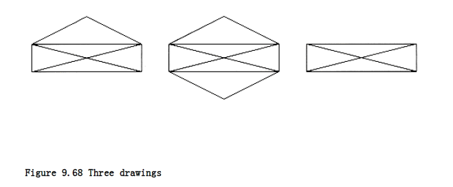

## Applications of Depth-First Search

Depth-first search is a generalization of preorder traversal. Starting at some vertex, v, we process v and then recursively traverse all vertices adjacent to v. If this process is performed on a tree, then all tree vertices are systematically visited in a total of O(|E|) time, since |E|= (|V|). If we perform this process on an arbitrary graph, we need to be careful to avoid cycles. To do this, when we visit a vertex v, we mark it visited, since now we have been there, and recursively call depth-first search on all adjacent vertices that are not already marked. We implicitly assume that for undirected graphs every edge (v, w) appears twice in the adjacency lists: once as (v, w) and once as (w, v). The procedure in Figure 9.59 performs a depth-first search (and does absolutely nothing else) and is a template for the general style.
```c
void dfs(vertex v)
{

visited[v] = TRUE;

for each w adjacent to v

if(!visited[w])
dfs(w);

}
```
**Figure 9.59 Template for depth-first search**
 

The (global) boolean array visited[ ] is initialized to FALSE. By recursively calling the procedures only on nodes that have not been visited, we guarantee that we do not loop indefinitely. If the graph is undirected and not connected, or directed and not strongly connected, this strategy might fail to visit some nodes. We then search for an unmarked node, apply a depth-first traversal there, and continue this process until there are no unmarked nodes.* Because this strategy guarantees that each edge is encountered only once, the total time to perform the traversal is O(|E| + |V|), as long as adjacency lists are used.

* An efficient way of implementing this is to begin the depth-first search at v1. If we need to restart the depth-first search, we examine the sequence v~k~, v~k + 1~, . . . for an unmarked vertex, where v~k - 1~ is the vertex where the last depth-first search was started. This guarantees that throughout the algorithm, only O(|V|) is spent looking for vertices where new depth-first search trees can be started.

### Undirected Graphs

An undirected graph is connected if and only if a depth-first search starting from any node visits every node. Because this test is so easy to apply, we will assume that the graphs we deal with are connected. If they are not, then we can find all the connected components and apply our algorithm on each of these in turn.

As an example of depth-first search, suppose in the graph of Figure 9.60 we start at vertex A. Then we mark A as visited and call dfs(B) recursively. dfs(B) marks B as visited and calls dfs(C) recursively. dfs(C) marks C as visited and calls dfs(D) recursively. dfs(D) sees both A and B, but both these are marked, so no recursive calls are made. dfs(D) also sees that C is adjacent but marked, so no recursive call is made there, and dfs(D) returns back to dfs(C). dfs(C) sees B adjacent, ignores it, finds a previously unseen vertex E adjacent, and thus calls dfs(E). dfs(E) marks E, ignores A and C, and returns to dfs(C). dfs(C) returns to dfs(B). dfs(B) ignores both A and D and returns. dfs(A) ignores both D and E and returns. (We have actually touched every edge twice, once as (v, w) and again as (w, v), but this is really once per adjacency list entry.)


 
We graphically illustrate these steps with a depth-first spanning tree. The root of the tree is A, the first vertex visited. Each edge (v, w) in the graph is present in the tree. If, when we process (v, w), we find that w is unmarked, or if, when we process (w, v), we find that v is unmarked, we indicate this with a tree edge. If when we process (v, w), we find that w is already marked, and when processing (w, v), we find that v is already marked, we draw a dashed line, which we will call a back edge, to indicate that this "edge" is not really part of the tree. The depth-first search of the graph in Figure 9.60 is shown in Figure 9.61.

The tree will simulate the traversal we performed. A preorder numbering of the tree, using only tree edges, tells us the order in which the vertices were marked. If the graph is not connected, then processing all nodes (and edges) requires several calls to dfs, and each generates a tree. This entire collection is a depth-first spanning forest, which is so named for obvious reasons.

### Biconnectivity

A connected undirected graph is biconnected if there are no vertices whose removal disconnects the rest of the graph. The graph in the example above is biconnected. If the nodes are computers and the edges are links, then if any computer goes down, network mail is unaffected, except, of course, at the down computer. Similarly, if a mass transit system is biconnected, users always have an alternate route should some terminal be disrupted.


If a graph is not biconnected, the vertices whose removal would disconnect the graph are known as articulation points. These nodes are critical in many applications. The graph in Figure 9.62 is not biconnected: C and D are articulation points. The removal of C would disconnect G, and the removal of D would disconnect E and F, from the rest of the graph.

Depth-first search provides a linear-time algorithm to find all articulation points in a connected graph. First, starting at any vertex, we perform a depth-first search and number the nodes as they are visited. For each vertex v, we call this preorder number num(v). Then, for every vertex v in the depth-first search spanning tree, we compute the lowest-numbered vertex, which we call low(v), that is reachable from v by taking zero or more tree edges and then possibly one back edge (in that order). The depth-first search tree in Figure 9.63 shows the preorder number first, and then the lowest-numbered vertex reachable under the rule described above.

The lowest-numbered vertex reachable by A, B, and C is vertex 1 (A), because they can all take tree edges to D and then one back edge back to A. We can efficiently compute low by performing a postorder traversal of the depth-first spanning tree. By the definition of low, low(v) is the minimum of

1. num(v)

2. the lowest num(w) among all back edges (v, w)

3. the lowest low(w) among all tree edges (v, w)

The first condition is the option of taking no edges, the second way is to choose no tree edges and a back edge, and the third way is to choose some tree edges and possibly a back edge. This third method is succinctly described with a recursive call. Since we need to evaluate low for all the children of v before we can evaluate low(v), this is a postorder traversal. For any edge (v, w), we can tell whether it is a tree edge or a back edge merely by checking num(v) and num(w). Thus, it is easy to compute low(v): we merely scan down v's adjacency list, apply the proper rule, and keep track of the minimum. Doing all the computation takes O(|E| +|V|) time.

All that is left to do is to use this information to find articulation points. The root is an articulation point if and only if it has more than one child, because if it has two children, removing the root disconnects nodes in different subtrees, and if it has only one child, removing the root merely disconnects the root. Any other vertex v is an articulation point if and only if v has some child w such that low(w) num(v). Notice that this condition is always satisfied at the root; hence the need for a special test.

The if part of the proof is clear when we examine the articulation points that the algorithm determines, namely C and D. D has a child E, and low(E) num(D), since both are 4. Thus, there is only one way for E to get to any node above D, and that is by going through D.

Similarly, C is an articulation point, because low (G) num (C). To prove that this algorithm is correct, one must show that the only if part of the assertion is true (that is, this finds all articulation points). We leave this as an exercise. As a second example, we show (Fig. 9.64) the result of applying this algorithm on the same graph, starting the depth-first search at C.


We close by giving pseudocode to implement this algorithm. We will assume that the arrays visited [] (initialized to FALSE), num[], low[], and parent[] are global to keep the code simple. We will also keep a global variable called counter, which is initialized to 1 to assign the preorder traversal numbers, num[]. This is not normally good programming practice, but including all the declarations and passing the extra parameters would cloud the logic. We also leave out the easily implemented test for the root.

As we have already stated, this algorithm can be implemented by performi to compute num and then a postorder traversal to compute low. A third traversal can be used to check which vertices satisfy the articulation point criteria. Performing three traversals, however, would be a waste. The first pass is shown in Figure 9.65.

The second and third passes, which are postorder traversals, can be implemented by the code in Figure 9.66. Line 8 handles a special case. If w is adjacent to v, then the recursive call to w will find v adjacent to w. This is not a back edge, only an edge that has already been considered and needs to be ignored. Otherwise, the procedure computes the minimum of the various low[] and num[] entries, as specified by the algorithm.

There is no rule that a traversal must be either preorder or postorder. It is possible to do processing both before and after the recursive calls. The procedure in Figure 9.67 combines the two routines assign_num and assign_low in a straightforward manner to produce the procedure find_art.

### Euler Circuits

Consider the three figures in Figure 9.68. A popular puzzle is to reconstruct these figures using a pen, drawing each line exactly once. The pen may not be lifted from the paper while the drawing is being performed. As an extra challenge, make the pen finish at the same point at which it started. This puzzle has a surprisingly simple solution. Stop reading if you would like to try to solve it.


```c
/* assign num and compute parents */
void assign_num(vertex v)
{

vertex w;
num[v] = counter++;

visited[v] = TRUE;

for each w adjacent to v

if(!visited[w]){

parent[w] = v;

assign_num(w);

}

}
```
**Figure 9.65 Routine to assign num to vertices (pseudocode)**

/* assign low. Also check for articulation points */
```c
void assign_low(vertex v)
{

vertex w;

low[v] = num[v]; /* Rule 1 */

for each w adjacent to v
{

if(num[w] > num[v]) /* forward edge */
{

assign_low(w);

if(low[w] >= num[v])
printf("%v is an articulation pointn", v);

low[v] = min(low[v], low[w]); /* Rule 3 */

}

else
if(parent[v] != w) /* back edge */

low[v] = min(low[v], num[w]); /* Rule 2 */

}

}
```
**Figure 9.66 Pseudocode to compute low and to test for articulation points (test for the root is omitted)**
```c
void find_art(vertex v)
{

vertex w;

visited[v] = TRUE;

low[v] = num[v] = counter++; /* Rule 1 */

for each w adjacent to v
{

if(!visited[w]) /* forward edge */
{

parent[w] = v;

find_art(w);

if(low[w] >= num[v])
printf ("%v is an articulation pointn", v);

low[v] = min(low[v], low[w]); /* Rule */

}

else
if(parent[v] != w) /* back edge */

low[v] = min(low[v], num[w]); /* Rule 2 */

}

}
```
**Figure 9.67 Testing for articulation points in one depth-first search (test for the root is omitted) (pseudocode)**
  


The first figure can be drawn only if the starting point is the lower left- or right-hand corner, and it is not possible to finish at the starting point. The second figure is easily drawn with the finishing point the same as the starting point, but the third figure cannot be drawn at all within the parameters of the puzzle.

We can convert this problem to a graph theory problem by assigning a vertex to each intersection. Then the edges can be assigned in the natural manner, as in Figure 9.69.

After this conversion is performed, we must find a path in the graph that visits every edge exactly once. If we are to solve the "extra challenge," then we must find a cycle that visits every edge exactly once. This graph problem was solved in 1736 by Euler and marked the beginning of graph theory. The problem is thus commonly referred to as an Euler path (sometimes Euler tour) or Euler circuit problem, depending on the specific problem statement. The Euler tour and Euler circuit problems, though slightly different, have the same basic solution. Thus, we will consider the Euler circuit problem in this section.

The first observation that can be made is that an Euler circuit, which must end on its starting vertex, is possible only if the graph is connected and each vertex has an even degree (number of edges). This is because, on the Euler circuit, a vertex is entered and then left. If any vertex v has odd degree, then eventually we will reach the point where only one edge into v is unvisited, and taking it will strand us at v. If exactly two vertices have odd degree, an Euler tour, which must visit every edge but need not return to its starting vertex, is still possible if we start at one of the odd-degree vertices and finish at the other. If more than two vertices have odd degree, then an Euler tour is not possible.

The observations of the preceding paragraph provide us with a necessary condition for the existence of an Euler circuit. It does not, however, tell us that all connected graphs that satisfy this property must have an Euler circuit, nor does it give us guidance on how to find one. It turns out that the necessary condition is also sufficient. That is, any connected graph, all of whose vertices have even degree, must have an Euler circuit. Furthermore, a circuit can be found in linear time.

We can assume that we know that an Euler circuit exists, since we can test the necessary and sufficient condition in linear time. Then the basic algorithm is to perform a depth-first search. There is a surprisingly large number of "obvious" solutions that do not work. Some of these are presented in the exercises.

The main problem is that we might visit a portion of the graph and return to the starting point prematurely. If all the edges coming out of the start vertex have been used up, then part of the graph is untraversed. The easiest way to fix this is to find the first vertex on this path that has an untraversed edge, and perform another depth-first search. This will give another circuit, which can be spliced into the original. This is continued until all edges have been traversed.
 


As an example, consider the graph in Figure 9.70. It is easily seen that this graph has an Euler circuit. Suppose we start at vertex 5, and traverse the circuit 5, 4, 10, 5. Then we are stuck, and most of the graph is still untraversed. The situation is shown in Figure 9.71.

We then continue from vertex 4, which still has unexplored edges. A depth-first search might come up with the path 4, 1, 3, 7, 4, 11, 10, 7, 9, 3, 4. If we splice this path into the previous path of 5, 4, 10, 5, then we get a new path of 5, 4, 1, 3, 7 ,4, 11, 10, 7, 9, 3, 4, 10, 5.

The graph that remains after this is shown in Figure 9.72. Notice that in this graph all the vertices must have even degree, so we are guaranteed to find a cycle to add. The remaining graph might not be connected, but this is not important. The next vertex on the path that has untraversed edges is vertex 3. A possible circuit would then be 3, 2, 8, 9, 6, 3. When spliced in, this gives the path 5, 4, 1, 3, 2, 8, 9, 6, 3, 7, 4, 11, 10, 7, 9, 3, 4, 10, 5.


The graph that remains is in

Figure 9.73. On this path, the next vertex with an untraversed edge is 9, and the algorithm finds the circuit 9, 12, 10, 9. When this is added to the current path, a circuit of 5, 4, 1, 3, 2, 8, 9, 12, 10, 9, 6, 3, 7, 4, 11, 10, 7, 9, 3, 4, 10, 5 is obtained. As all the edges are traversed, the algorithm terminates with an Euler circuit.

To make this algorithm efficient, we must use appropriate data structures. We will sketch some of the ideas, leaving the implementation as an exercise. To make splicing simple, the path should be maintained as a linked list. To avoid repetitious scanning of adjacency lists, we must maintain, for each adjacency list, a pointer to the last edge scanned. When a path is spliced in, the search for a new vertex from which to perform the next dfs must begin at the start of the splice point. This guarantees that the total work performed on the vertex search phase is O(|E|) during the entire life of the algorithm. With the appropriate data structures, the running time of the algorithm is O(|E| + |V|).

A very similar problem is to find a simple cycle, in an undirected graph, that visits every vertex. This is known as the Hamiltonian cycle problem. Although it seems almost identical to the Euler circuit problem, no efficient algorithm for it is known. We shall see this problem again in Section 9.7.

### Directed Graphs

Using the same strategy as with undirected graphs, directed graphs can be traversed in linear time, using depth-first search. If the graph is not strongly connected, a depth-first search starting at some node might not visit all nodes. In this case we repeatedly perform depth-first searches, starting at some unmarked node, until all vertices have been visited. As an example, consider the directed graph in Figure 9.74.

We arbitrarily start the depth-first search at vertex B. This visits vertices B, C, A, D, E, and F. We then restart at some unvisited vertex. Arbitrarily, we start at H, which visits I and J. Finally, we start at G, which is the last vertex that needs to be visited. The corresponding depth-first search tree is shown in Figure 9.75.  

 


The dashed arrows in the depth-first spanning forest are edges (v, w) for which w was already marked at the time of consideration. In undirected graphs, these are always back edges, but, as we can see, there are three types of edges that do not lead to new vertices. First, there are back edges, such as (A, B) and (I, H). There are also forward edges, such as (C, D) and (C, E), that lead from a tree node to a descendant. Finally, there are cross edges, such as (F, C) and (G, F), which connect two tree nodes that are not directly related. Depth-first search forests are generally drawn with children and new trees added to the forest from left to right. In a depth- first search of a directed graph drawn in this manner, cross edges always go from right to left.

Some algorithms that use depth-first search need to distinguish between the three types of nontree edges. This is easy to check as the depth-first search is being performed, and it is left as an exercise.

One use of depth-first search is to test whether or not a directed graph is acyclic. The rule is that a directed graph is acyclic if and only if it has no back edges. (The graph above has back edges, and thus is not acyclic.) The alert reader may remember that a topological sort can also be used to determine whether a graph is acyclic. Another way to perform topological sorting is to assign the vertices topological numbers n, n - 1, . . . ,1 by postorder traversal of the depth- first spanning forest. As long as the graph is acyclic, this ordering will be consistent.

### Finding Strong Components

By performing two depth-first searches, we can test whether a directed graph is strongly connected, and if it is not, we can actually produce the subsets of vertices that are strongly connected to themselves. This can also be done in only one depth-first search, but the method used here is much simpler to understand.

First, a depth-first search is performed on the input graph G. The vertices of G are numbered by a postorder traversal of the depth-first spanning forest, and then all edges in G are reversed, forming G~r~. The graph in Figure 9.76 represents Gr for the graph G shown in Figure 9.74; the vertices are shown with their numbers.

The algorithm is completed by performing a depth-first search on Gr, always starting a new depth-first search at the highest-numbered vertex. Thus, we begin the depth-first search of Gr at vertex G, which is numbered 10. This leads nowhere, so the next search is started at H. This call visits I and J. The next call starts at B and visits A, C, and F. The next calls after this are dfs(D) and finally dfs(E). The resulting depth-first spanning forest is shown in Figure 9.77.

Each of the trees (this is easier to see if you completely ignore all nontree edges) in this depth-first spanning forest forms a strongly connected component. Thus, for our example, the strongly connected components are {G}, {H, I, J}, {B, A, C, F}, {D}, and {E}.

To see why this algorithm works, first note that if two vertices v and w are in the same strongly connected component, then there are paths from v to w and from w to v in the original graph G, and hence also in G~r~. Now, if two vertices v and w are not in the same depth-first spanning tree of Gr, clearly they cannot be in the same strongly connected component.

To prove that this algorithm works, we must show that if two vertices v and w are in the same depth-first spanning tree of Gr, there must be paths from v to w and from w to v. Equivalently, we can show that if x is the root of the depth-first spanning tree of Gr containing v, then there is a path from x to v and from v to x. Applying the same logic to w would then give a path from x to w and from w to x. These paths would imply paths from v to w and w to v (going through x).

Since v is a descendant of x in Gr's depth-first spanning tree, there is a path from x to v in Gr and thus a path from v to x in G. Furthermore, since x is the root, x has the higher postorder number from the first depth-first search. Therefore, during the first depth-first search, all the work processing v was completed before the work at x was completed. Since there is a path from v to x, it follows that v must be a descendant of x in the spanning tree for G -- otherwise v would finish after x. This implies a path from x to v in G and completes the proof.


  