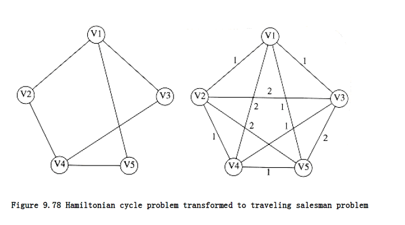
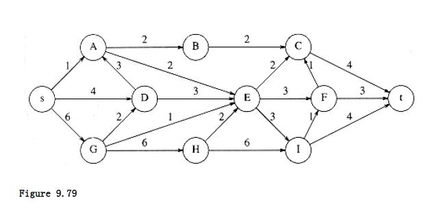
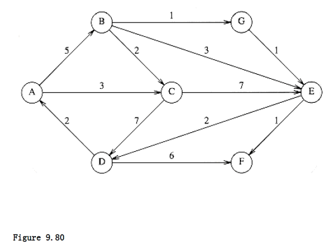
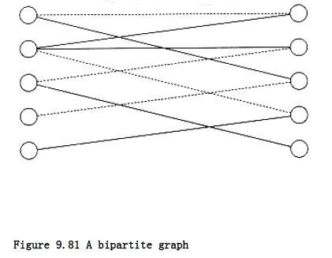
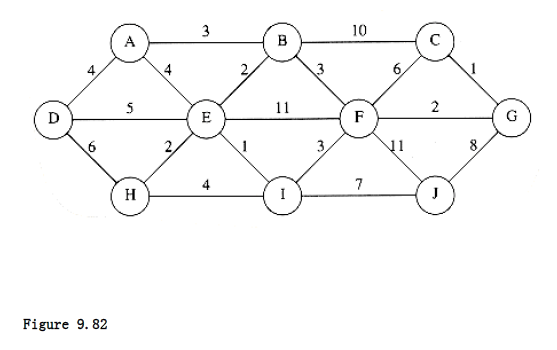
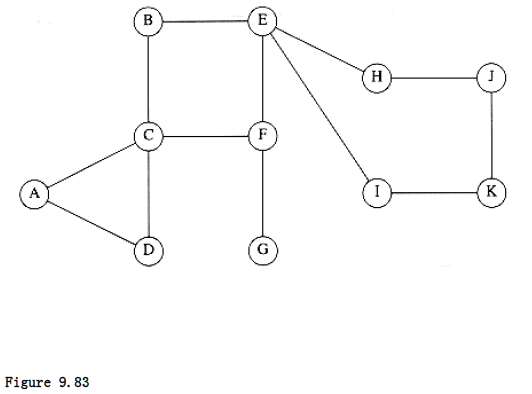
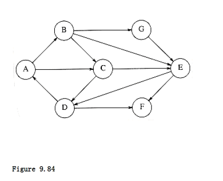
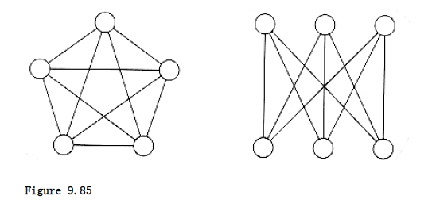

## Introduction to NP-Completeness

In this chapter, we have seen solutions to a wide variety of graph theory problems. All these problems have polynomial running times, and with the exception of the network flow problem, the running time is either linear or only slightly more than linear (O(|E| log |E|)). We have also mentioned, in passing, that for some problems certain variations seem harder than the original.

Recall that the Euler circuit problem, which finds a path that touches every edge exactly once, is solvable in linear time. The Hamiltonian cycle problem asks for a simple cycle that contains every vertex. No linear algorithm is known for this problem.

The single-source unweighted shortest-path problem for directed graphs is also solvable in linear time. No linear-time algorithm is known for the corresponding longest-simple-path problem.

The situation for these problem variations is actually much worse than we have described. Not only are no linear algorithms known for these variations, but there are no known algorithms that are guaranteed to run in polynomial time. The best known algorithms for these problems could take exponential time on some inputs.

In this section we will take a brief look at this problem. This topic is rather complex, so we will only take a quick and informal look at it. Because of this, the discussion may be (necessarily) somewhat imprecise in places.

We will see that there are a host of important problems that are roughly equivalent in complexity. These problems form a class called the NP-complete problems. The exact complexity of these NP-complete problems has yet to be determined and remains the foremost open problem in theoretical computer science.Either all these problems have polynomial-time solutions or none of them do.

### Easy vs. Hard

When classifying problems, the first step is to examine the boundaries. We have already seen that many problems can be solved in linear time. We have also seen some O(log n) running times, but these either assume some preprocessing (such as input already being read or a data structure already being built) or occur on arithmetic examples. For instance, the gcd algorithm, when applied on two numbers m and n, takes O(log n) time. Since the numbers consist of log m and log n bits respectively, the gcd algorithm is really taking time that is linear in the amount or size of input. Thus, when we measure running time, we will be concerned with the running time as a function of the amount of input. Generally, we cannot expect better than linear running time.

At the other end of the spectrum lie some truly hard problems. These problems are so hard that they are impossible. This does not mean the typical exasperated moan, which means that it would take a genius to solve the problem. Just as real numbers are not sufficient to express a solution to x2 < 0, one can prove that computers cannot solve every problem that happens to come along. These "impossible" problems are called undecidable problems.

One particular undecidable problem is the halting problem. Is it possible to have your C compiler have an extra feature that not only detects syntax errors but also infinite loops? This seems like a hard problem, but one might expect that if some very clever programmers spent enough time on it, they could produce this enhancement.

The intuitive reason that this problem is undecidable is that such a program might have a hard time checking itself. For this reason, these problems are sometimes called recursively undecidable.

If an infinite loop-checking program could be written, surely it could be used to check itself. We could then produce a program called LOOP. LOOP takes as input a program P and runs P on itself. It prints out the phrase YES if P loops when run on itself. If P terminates when run on itself, a natural thing to do would be to print out NO. Instead of doing that, we will have LOOP go into an infinite loop.

What happens when LOOP is given itself as input? Either LOOP halts, or it does not halt. The problem is that both these possibilities lead to contradictions, in much the same way as does the phrase "This sentence is a lie."

By our definition, LOOP(P) goes into an infinite loop if P(P) terminates. Suppose that when P = LOOP, P(P) terminates. Then, according to the LOOP program, LOOP(P) is obligated to go into an infinite loop. Thus, we must have LOOP(LOOP) terminating and entering an infinite loop, which is clearly not possible. On the other hand, suppose that when P = LOOP, P(P) enters an infinite loop. Then LOOP(P) must terminate, and we arrive at the same set of contradictions. Thus, we see that the program LOOP cannot possibly exist.

### The Class NP

A few steps down from the horrors of undecidable problems lies the class NP. NP stands for nondeterministic polynomial-time. A deterministic machine, at each point in time, is executing an instruction. Depending on the instruction, it then goes to some next instruction, which is unique. A nondeterministic machine has a choice of next steps. It is free to choose any that it wishes, and if one of these steps leads to a solution, it will always choose the correct one. A nondeterministic machine thus has the power of extremely good (optimal) guessing. This probably seems like a ridiculous model, since nobody could possibly build a nondeterministic computer, and because it would seem to be an incredible upgrade to your standard computer (every problem might now seem trivial). We will see that nondeterminism is a very useful theoretical construct. Furthermore, nondeterminism is not as powerful as one might think. For instance, undecidable problems are still undecidable, even if nondeterminism is allowed.

A simple way to check if a problem is in NP is to phrase the problem as a yes/no question. The problem is in NP if, in polynomial time, we can prove that any "yes" instance is correct. We do not have to worry about "no" instances, since the program always makes the right choice. Thus, for the Hamiltonian cycle problem, a "yes" instance would be any simple circuit in the graph that includes all the vertices. This is in NP, since, given the path, it is a simple matter to check that it is really a Hamiltonian cycle. Appropriately phrased questions, such as "Is there a simple path of length > K?" can also easily be checked and are in NP. Any path that satisfies this property can be checked trivially.

The class NP includes all problems that have polynomial-time solutions, since obviously the solution provides a check. One would expect that since it is so much easier to check an answer than to come up with one from scratch, there would be problems in NP that do not have polynomial- time solutions. To date no such problem has been found, so it is entirely possible, though not considered likely by experts, that nondeterminism is not such an important improvement. The problem is that proving exponential lower bounds is an extremely difficult task. The information theory bound technique, which we used to show that sorting requires (n log n) comparisons, does not seem to be adequate for the task, because the decision trees are not nearly large enough.

Notice also that not all decidable problems are in NP. Consider the problem of determining whether a graph does not have a Hamiltonian cycle. To prove that a graph has a Hamiltonian cycle is a relatively simple matter-we just need to exhibit one. Nobody knows how to show, in polynomial time, that a graph does not have a Hamiltonian cycle. It seems that one must enumerate all the cycles and check them one by one. Thus the Non-Hamiltonian cycle problem is not known to be in NP.

### NP-Complete Problems

Among all the problems known to be in NP, there is a subset, known as the NP-complete problems, which contains the hardest. An NP-complete problem has the property that any problem in NP can be polynomially reduced to it.

A problem P~1~ can be reduced to P~2~ as follows: Provide a mapping so that any instance of P~1~ can be transformed to an instance of P~2~. Solve P~2~, and then map the answer back to the original. As an example, numbers are entered into a pocket calculator in decimal. The decimal numbers are converted to binary, and all calculations are performed in binary. Then the final answer is converted back to decimal for display. For P~1~ to be polynomially reducible to P~2~, all the work associated with the transformations must be performed in polynomial time.

The reason that NP-complete problems are the hardest NP problems is that a problem that is NP- complete can essentially be used as a subroutine for any problem in NP, with only a polynomial amount of overhead. Thus, if any NP-complete problem has a polynomial-time solution, then every problem in NP must have a polynomial-time solution. This makes the NP-complete problems the hardest of all NP problems.

Suppose we have an NP-complete problem P~1~. Suppose P~2~ is known to be in NP. Suppose further that P~1~ polynomially reduces to P~2~, so that we can solve P1 by using P~2~ with only a polynomial time penalty. Since P~1~ is NP-complete, every problem in NP polynomially reduces to P~1~. By applying the closure property of polynomials, we see that every problem in NP is polynomially reducible to P~2~: We reduce the problem to P~1~ and then reduce P~1~ to P~2~. Thus, P~2~ is NP-complete.

As an example, suppose that we already know that the Hamiltonian cycle problem is NP-complete. The traveling salesman problem is as follows.

**TRAVELING SALESMAN PROBLEM:**

Given a complete graph G = (V, E), with edge costs, and an integer K, is there a simple cycle that visits all vertices and has total cost K?

The problem is different from the Hamiltonian cycle problem, because all |V|(|V| - 1)/2 edges are present and the graph is weighted. This problem has many important applications. For instance, printed circuit boards need to have holes punched so that chips, resistors, and other electronic components can be placed. This is done mechanically. Punching the hole is a quick operation; the time-consuming step is positioning the hole puncher. The time required for positioning depends on the distance traveled from hole to hole. Since we would like to punch every hole (and then return to the start for the next board), and minimize the total amount of time spent traveling, what we have is a traveling salesman problem.

The traveling salesman problem is NP-complete. It is easy to see that a solution can be checked in polynomial time, so it is certainly in NP. To show that it is NP-complete, we polynomially reduce the Hamiltonian cycle problem to it. To do this we construct a new graph G'. G' has the same vertices as G. For G', each edge (v, w) has a weight of 1 if (v, w) G, and 2 otherwise. We choose K = |V|. See Figure 9.78. It is easy to verify that G has a Hamiltonian cycle problem if and only if G' has a Traveling Salesman tour of total weight |V|.

There is now a long list of problems known to be NP-complete. To prove that some new problem is NP-complete, it must be shown to be in NP, and then an appropriate NP-complete problem must be transformed into it. Although the transformation to a traveling salesman problem was rather straightforward, most transformations are actually quite involved and require some tricky constructions. Generally, several different NP-complete problems are considered before the problem that actually provides the reduction. As we are only interested in the general ideas, we will not show any more transformations; the interested reader can consult the references.

The alert reader may be wondering how the first NP-complete problem was actually proven to be NP- complete. Since proving that a problem is NP-complete requires transforming it from another NP- complete problem, there must be some NP-complete problem for which this strategy will not work. The first problem that was proven to be NP-complete was the satisfiability problem. The satisfiability problem takes as input a boolean expression and asks whether the expression has an assignment to the variables that gives a value of 1.

Satisfiability is certainly in NP, since it is easy to evaluate a boolean expression and check whether the result is 1. In 1971, Cook showed that satisfiability was NP-complete by directly proving that all problems that are in NP could be transformed to satisfiability. To do this, he used the one known fact about every problem in NP: Every problem in NP can be solved in polynomial time by a nondeterministic computer. The formal model for a computer is known as a Turing machine. Cook showed how the actions of this machine could be simulated by an extremely complicated and long, but still polynomial, boolean formula. This boolean formula would be true if and only if the program which was being run by the Turing machine produced a "yes" answer for its input.

Once satisfiability was shown to be NP-complete, a host of new NP-complete problems, including some of the most classic problems, were also shown to be NP-complete.

In addition to the satisfiability, Hamiltonian circuit, traveling salesman, and longest-path problems, which we have already examined, some of the more well-known NP-complete problems which we have not discussed are bin packing, knapsack, graph coloring, and clique. The list is quite extensive and includes problems from operating systems (scheduling and security), database systems, operations research, logic, and especially graph theory.

## Summary

In this chapter we have seen how graphs can be used to model many real-life problems. Many of the graphs that occur are typically very sparse, so it is important to pay attention to the data structures that are used to implement them.

We have also seen a class of problems that do not seem to have efficient solutions. In Chapter 10, some techniques for dealing with these problems will be discussed.

## Exercises

**9.1** Find a topological ordering for the graph in Figure 9.79.

**9.2** If a stack is used instead of a queue for the topological sort algorithm in Section 9.1, does a different ordering result? Why might one data structure give a "better" answer?

**9.3** Write a program to perform a topological sort on a graph.

**9.4** An adjacency matrix requires O(V 2) merely to initialize using a standard double loop. Propose a method that stores a graph in an adjacency matrix (so that testing for the existence of an edge is O(1)) but avoids the quadratic running time.

**9.5** 
a. Find the shortest path from A to all other vertices for the graph in Figure 9.80.

b. Find the shortest unweighed path from B to all other vertices for the graph in

Figure 9.80.

**9.6** What is the worst-case running time of Dijkstra's algorithm when implemented with d-heaps (Section 6.5)?
 
**9.7** 

a. Give an example where Dijkstra's algorithm gives the wrong answer in the presence of a negative edge but no negative-cost cycle.

**b. Show that the weighted shortest-path algorithm suggested in

Section 9.3.3 works if there are negative-weight edges, but no negative-cost cycles, and that the running time of this algorithm is O(|E| |V|).

***9.8** Suppose all the edge weights in a graph are integers between 1 and E . How fast can Dijkstra's algorithm be implemented?

**9.9** Write a program to solve the single-source shortest-path problem.

**9.10** 
a. Explain how to modify Dijkstra's algorithm to produce a count of the number of different minimum paths from v to w.

b. Explain how to modify Dijkstra's algorithm so that if there is more than one minimum path from v to w, a path with the fewest number of edges is chosen.

**9.11** Find the maximum flow in the network of Figure 9.79.

***9.12** Suppose that G = (V, E) is a tree, s is the root, and we add a vertex t and edges of infinite capacity from all leaves in G to t. Give a linear-time algorithm to find a maximum flow from s to t.

**9.13** A bipartite graph, G = (V, E), is a graph such that V can be partitioned into two subsets V~1~ and V~2~ and no edge has both its vertices in the same subset.

a. Give a linear algorithm to determine whether a graph is bipartite.

b. The bipartite matching problem is to find the largest subset E' of E such that no vertex is included in more than one edge. A matching of four edges (indicated by dashed edges) is shown in Figure 9.81. There is a matching of five edges, which is maximum. Show how the bipartite matching problem can be used to solve the following problem: We have a set of instructors, a set of courses, and a list of courses that each instructor is qualified to teach. If no instructor is required to teach more than one course, and only one instructor may teach a given course, what is the maximum number of courses that can be offered?

c. Show that the network flow problem can be used to solve the bipartite matching problem.

d. What is the time complexity of your solution to part (b)?

**9.14** Give an algorithm to find an augmenting path that permits the maximum flow.

**9.15** 
a. Find a minimum spanning tree for the graph in Figure 9.82 using both Prim's and Kruskal's algorithms.

b. Is this minimum spanning tree unique? Why?

**9.16** Does either Prim's or Kruskal's algorithm work if there are negative edge weights?

**9.17** Show that a graph of V vertices can have VV_2 minimum spanning trees.

**9.18** Write a program to implement Kruskal's algorithm. 

**9.19** If all of the edges in a graph have weights between 1 and E , how fast can the minimum spanning tree be computed?

**9.20** Give an algorithm to find a maximum spanning tree. Is this harder than finding a minimum spanning tree?

**9.21** Find all the articulation points in the graph in Figure 9.83. Show the depth-first spanning tree and the values of num and low for each vertex.

**9.22** Prove that the algorithm to find articulation points works. 

**9.23** 
a. Give an algorithm to find the minimum number of edges that need to be removed from an undirected graph so that the resulting graph is acyclic.

*b. Show that this problem is NP-complete for directed graphs.

**9.24** Prove that in a depth-first spanning forest of a directed graph, all cross edges go from right to left.

**9.25** Give an algorithm to decide whether an edge (v, w) in a depth-first spanning forest of a directed graph is a tree, back, cross, or forward edge.

**9.26** Find the strongly connected components in the graph of Figure 9.84.

**9.27** Write a program to find the strongly connected components in a digraph.

***9.28** Give an algorithm that finds the strongly connected components in only one depth-first search. Use an algorithm similar to the biconnectivity algorithm.

**9.29** The biconnected components of a graph G is a partition of the edges into sets such that the graph formed by each set of edges is biconnected. Modify the algorithm in Figure 9.67 to find the biconnected components instead of the articulation points.

**9.30** Suppose we perform a breadth-first search of an undirected graph and build a breadth-first spanning tree. Show that all edges in the tree are either tree edges or cross edges.

**9.31** Give an algorithm to find in an undirected (connected) graph a path that goes through every edge exactly once in each direction.

**9.32** 
a. Write a program to find an Euler circuit in a graph if one exists.

b. Write a program to find an Euler tour in a graph if one exists.

**9.33** An Euler circuit in a directed graph is a cycle in which every edge is visited exactly once.

*a. Prove that a directed graph has an Euler circuit if and only if it is strongly connected and every vertex has equal indegree and outdegree.

*b. Give a linear-time algorithm to find an Euler circuit in a directed graph where one exists.

**9.34** 
a. Consider the following solution to the Euler circuit problem: Assume that the graph is biconnected. Perform a depth-first search, taking back edges only as a last resort. If the graph is not biconnected, apply the algorithm recursively on the biconnected components. Does this algorithm work?

b. Suppose that when taking back edges, we take the back edge to the nearest ancestor. Does the algorithm work?

**9.35** A planar graph is a graph that can be drawn in a plane without any two edges intersecting.

*a. Show that neither of the graphs in Figure 9.85 is planar. 

b. Show that in a planar graph, there must exist some vertex which is connected to no more than five nodes.

**c. Show that in a planar graph,

**9.36** A multigraph is a graph in which multiple edges are allowed between pairs of vertices. Which of the algorithms in this chapter work without modification for multigraphs? What modifications need to be done for the others?

***9.37** Let G = (V, E) be an undirected graph. Use depth-first search to design a linear algorithm to convert each edge in G to a directed edge such that the resulting graph is strongly connected, or determine that this is not possible.

**9.38** You are given a set of n sticks, which are laying on top of each other in some configuration. Each stick is specified by its two endpoints; each endpoint is an ordered triple giving its x, y, and z coordinates; no stick is vertical. A stick may be picked up only if there is no stick on top of it.

a. Explain how to write a routine that takes two sticks a and b and reports whether a is above, below, or unrelated to b. (This has nothing to do with graph theory.)

b. Give an algorithm that determines whether it is possible to pick up all the sticks, and if so, provides a sequence of stick pickups that accomplishes this.

**9.39** The clique problem can be stated as follows: Given an undirected graph G = (V, E) and an integer K, does G contain a complete subgraph of at least K vertices?

The vertex cover problem can be stated as follows: Given an undirected graph G = (V, E) and an integer K, does G contain a subset V' V such that V' K and every edge in G has a vertex in V'? Show that the clique problem is polynomially reducible to vertex cover.

**9.40** Assume that the Hamiltonian cycle problem is NP-complete for undirected graphs.

a. Prove that the Hamiltonian cycle problem is NP-complete for directed graphs.

b. Prove that the unweighted simple longest-path problem is NP-complete for directed graphs.

**9.41** The baseball card collector problem is as follows: Given packets P1, P2, . . . , Pm, each of

which contains a subset of the year's baseball cards, and an integer K, is it possible to collect

all the baseball cards by choosing K packets? Show that the baseball card collector problem is NP-complete.

## References

Good graph theory textbooks include [7], [12], [21], and [34]. More advanced topics, including the more careful attention to running times, are covered in [36], [38], and [45].

Use of adjacency lists was advocated in [23]. The topological sort algorithm is from [28], as described in [31]. Dijkstra's algorithm appeared in [8]. The improvements using d-heaps and Fibonacci heaps are described in [27] and [14], respectively. The shortest-path algorithm with negative edge weights is due to Bellman [3]; Tarjan [45] describes a more efficient way to guarantee termination.

Ford and Fulkerson's seminal work on network flow is [13]. The idea of augmenting along shortest paths or on paths admitting the largest flow increase is from [11]. Other approaches to the problem can be found in [9], [30], and [20]. An algorithm for the min-cost flow problem can be found in [18].

An early minimum spanning tree algorithm can be found in [4]. Prim's algorithm is from [39]; Kruskal's algorithm appears in [32]. Two O(|E| log log |V|) algorithms are [5] and [46]. The theoretically best-known algorithms appear in [14] and [16]. An empirical study of these algorithms suggests that Prim's algorithm, implemented with decrease_key, is best in practice on most graphs [37].

The algorithm for biconnectivity is from [41]. The first linear-time strong components algorithm (Exercise 9.28) appears in the same paper. The algorithm presented in the text is due to Kosaraju (unpublished) and Sharir [40]. Other applications of depth-first search appear in [24], [25], [42], and [43] (as mentioned in Chapter 8, the results in [42] and [43] have been improved, but the basic algorithm is unchanged).

The classic reference work for the theory of NP-complete problems is [19]. Additional material can be found in [1]. The NP-completeness of satisfiability is shown in [6]. The other seminal paper is [29], which showed the NP-completeness of 21 problems. An excellent survey of complexity theory is [44]. An approximation algorithm for the traveling salesman problem, which generally gives nearly optimal results, can be found in [35].

A solution to Exercise 9.8 can be found in [2]. Solutions to the bipartite matching problem in Exercise 9.13 can be found in [22] and [33]. The problem can be generalized by adding weights to the edges and removing the restriction that the graph is bipartite. Efficient solutions for the unweighted matching problem for general graphs are quite complex. Details can be found in [10], [15], and [17].

Exercise 9.35 deals with planar graphs, which commonly arise in practice. Planar graphs are very sparse, and many difficult problems are easier on planar graphs. An example is the graph isomorphism problem, which is solvable in linear time for planar graphs [26]. No polynomial time algorithm is known for general graphs.

1. A. V. Aho, J. E. Hopcroft, and J. D. Ullman, The Design and Analysis of Computer Algorithms, Addison-Wesley, Reading, MA, 1974.

2. R. K. Ahuja, K. Melhorn, J. B. Orlin, and R. E. Tarjan, "Faster Algorithms for the Shortest Path Problem," Journal of the ACM 37 (1990), 213-223.

3. R. E. Bellman, "On a Routing Problem," Quarterly of Applied Mathematics 16 (1958), 87-90.

4. O. Boruvka, "Ojistém problému minimálním (On a Minimal Problem)," Pr_á_ca Moravsk_é_ 3 (1926), 37-58.

5. D. Cheriton and R. E. Tarjan, "Finding Minimum Spanning Trees," SIAM Journal on Computing 5 (1976), 724-742.  

6. S. Cook, "The Complexity of Theorem Proving Procedures," Proceedings of the Third Annual ACM Symposium on Theory of Computing (1971), 151-158.

7. N. Deo, Graph Theory wtth Applications to Engineering and Computer Science, Prentice Hall, Englewood Cliffs, NJ, 1974.

8. E. W. Dijkstra, "A Note on Two Problems in Connexion with Graphs," Numerische Mathematik 1 (1959), 269-271.

9. E. A. Dinic, "Algorithm for Solution of a Problem of Maximum Flow in Networks with Power Estimation," Soviet Mathematics Doklady 11 (1970), 1277-1280.

10. J. Edmonds, "Paths, Trees, and Flowers," Canadian Journal of Mathematics 17 (1965) 449-467.

11. J. Edmonds and R. M. Karp, "Theoretical Improvements in Algorithmic Efficiency for Network Flow Problems," Journal of the ACM 19 (1972), 248-264.

12. S. Even, Graph Algorithms, Computer Science Press, Potomac, MD, 1979.

13. L. R. Ford, Jr. and D. R. Fulkerson, Flows in Networks, Princeton University Press, Princeton, NJ, 1962.

14. M. L. Fredman and R. E. Tarjan, "Fibonacci Heaps and Their Uses in Improved Network Optimization Algorithms," Journal of the ACM 34 (1987), 596-615.

15. H. N. Gabow, "Data Structures for Weighted Matching and Nearest Common Ancestors with Linking," Proceedings of First Annual ACM-SIAM Symposium on Discrete Algorithms (1990), 434-443. 

16. H. N. Gabow, Z. Galil, T. H. Spencer, and R. E. Tarjan, "Efficient Algorithms for Finding Minimum Spanning Trees on Directed and Undirected Graphs," Combinatorica 6 (1986), 109-122.

17. Z. Galil, "Efficient Algorithms for Finding Maximum Matchings in Graphs," ACM Computing Surveys 18 (1986), 23-38.

18. Z. Galil and E. Tardos,"An O(n2(m + n log n)log n) Min-Cost Flow Algorithm," Journal of the ACM 35 (1988), 374-386.

19. M. R. Garey and D. S. Johnson, Computers and Intractability: A Guide to the Theory of NP- Completeness, Freeman, San Francisco, 1979.

20. A. V. Goldberg and R. E. Tarjan, "A New Approach to the Maximum-Flow Problem," Journal of the ACM 35 (1988), 921-940.

21. F. Harary, Graph Theory, Addison-Wesley, Reading, MA, 1969.

22. J. E. Hopcroft and R. M. Karp, "An n5/2 Algorithm for Maximum Matchings in Bipartite Graphs," SIAM Journal on Computing 2 (1973), 225-231.

23. J. E. Hopcroft and R. E. Tarjan, "Algorithm 447: Efficient Algorithms for Graph Manipulation," Communications of the ACM 16 (1973), 372-378.

24. J. E. Hopcroft and R. E. Tarjan, "Dividing a Graph into Triconnected Components," SIAM Journal on Computing 2 (1973), 135-158.

25. J. E. Hopcroft and R. E. Tarjan, "Efficient Planarity Testing," Journal of the ACM 21 (1974),549-568.

26. J. E. Hopcroft and J. K. Wong, "Linear Time Algorithm for Isomorphism of Planar Graphs," Proceedings of the Sixth Annual ACM Symposium on Theory of Computing (1974), 172-184.

27. D. B. Johnson, "Efficient Algorithms for Shortest Paths in Sparse Networks," Journal of the ACM 24 (1977), 1-13.

28. A. B. Kahn, "Topological Sorting of Large Networks," Communications of the ACM 5 (1962), 558- 562.

29. R. M. Karp, "Reducibility among Combinatorial Problems," Complexity of Computer Computations (eds. R. E. Miller and J. W. Thatcher), Plenum Press, New York, 1972, 85-103.

30. A. V. Karzanov, "Determining the Maximal Flow in a Network by the Method of Preflows," Soviet Mathematics Doklady 15 (1974), 434-437.

31. D. E. Knuth, The Art of Computer Programming, Vol. 1: Fundamental Algorithms, second edition, Addison-Wesley, Reading, MA, 1973.

32. J. B. Kruskal, Jr. "On the Shortest Spanning Subtree of a Graph and the Traveling Salesman Problem," Proceedings of the American Mathematical Society 7 (1956), 48-50.

33. H. W. Kuhn, "The Hungarian Method for the Assignment Problem," Naval Research Logistics Quarterly 2 (1955), 83-97.

34. E. L. Lawler, Combinatorial Optimization: Networks and Matroids, Holt, Reinhart, and Winston, New York, NY, 1976.
 
35. S. Lin and B. W. Kernighan, "An Effective Heuristic Algorithm for the Traveling Salesman Problem," Operations Research 21 (1973), 498-516.

36. K. Melhorn, Data Structures and Algorithms 2: Graph Algorithms and NP-completeness, Springer- Verlag, Berlin, 1984.

37. B. M. E. Moret and H. D. Shapiro, "An Empirical Analysis of Algorithms for Constructing a Minimum Spanning Tree," Proceedings of the Second Workshop on Algorithms and Data Structures (1991), 400-411.

38. C. H. Papadimitriou and K. Steiglitz, Combinatorial Optimization: Algorithms and Complexity, Prentice Hall, Englewood Cliffs, NJ, 1982.

39. R. C. Prim, "Shortest Connection Networks and Some Generalizations," Bell System Technical Journal 36 (1957), 1389-1401.

40. M. Sharir, "A Strong-Connectivity Algorithm and Its Application in Data Flow Analysis," Computers and Mathematics with Applications 7 (1981), 67-72.

41. R. E. Tarjan, "Depth First Search and Linear Graph Algorithms," SIAM Journal on Computing 1 (1972), 146-160.

42. R. E. Tarjan, "Testing Flow Graph Reducibility," Journal of Computer and System Sciences 9 (1974), 355-365.

43. R. E. Tarjan, "Finding Dominators in Directed Graphs," SIAM Journal on Computing 3 (1974), 62-89.

44. R. E. Tarjan, "Complexity of Combinatorial Algorithms," SIAM Review 20 (1978), 457-491.

45. R. E. Tarjan, Data Structures and Network Algorithms, Society for Industrial and Applied Mathematics, Philadelphia, PA, 1983.

46. A. C. Yao, "An O(|E | log log |V |) Algorithm for Finding Minimum Spanning Trees," Information Processing Letters 4 (1975), 21-23.

