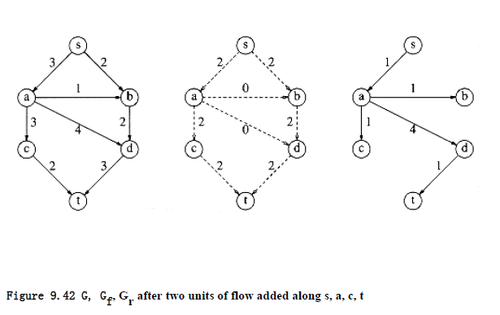
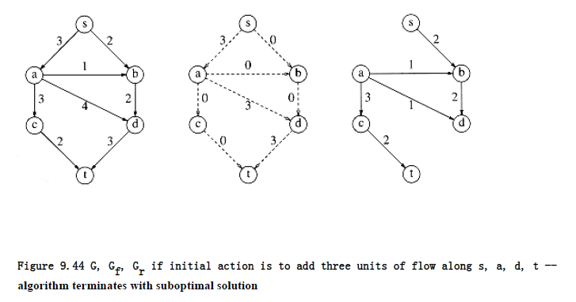
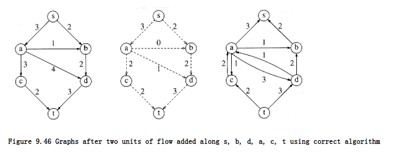

## Network Flow Problems

Suppose we are given a directed graph G = (V, E) with edge capacities c~v,w~. These capacities could represent the amount of water that could flow through a pipe or the amount of traffic that could flow on a street between two intersections. We have two vertices: s, which we call the source, and t, which is the sink. Through any edge, (v, w), at most c~v,w~ units of "flow" may pass. At any vertex, v, that is not either s or t, the total flow coming in must equal the total flow going out. The maximum flow problem is to determine the maximum amount of flow that can pass from s to t. As an example, for the graph in Figure 9.39 on the left the maximum flow is 5, as indicated by the graph on the right.

As required by the problem statement, no edge carries more flow than its capacity. Vertex a has three units of flow coming in, which it distributes to c and d. Vertex d takes three units of flow from a and b and combines this, sending the result to t. A vertex can combine and distribute flow in any manner that it likes, as long as edge capacities are not violated and as long as flow conservation is maintained (what goes in must come out).

### A Simple Maximum-Flow Algorithm

A first attempt to solve the problem proceeds in stages. We start with our graph, G, and construct a flow graph Gf. Gf tells the flow that has been attained at any stage in the algorithm. Initially all edges in Gf have no flow, and we hope that when the algorithm terminates, Gf contains a maximum flow. We also construct a graph, Gr, called the residual graph. Gr tells, for each edge, how much more flow can be added. We can calculate this by subtracting the current flow from the capacity for each edge. An edge in Gr is known as a residual edge.

At each stage, we find a path in Gr from s to t. This path is known as an augmenting path. The minimum edge on this path is the amount of flow that can be added to every edge on the path. We do this by adjusting Gf and recomputing Gr. When we find no path from s to t in Gr, we terminate.

This algorithm is nondeterministic, in that we are free to choose any path from s to t; obviously some choices are better than others, and we will address this issue later. We will run this algorithm on our example. The graphs below are G, Gf, Gr respectively. Keep in mind that there is a slight flaw in this algorithm. The initial configuration is in Figure 9.40.

There are many paths from s to t in the residual graph. Suppose we select s, b, d, t. Then we can send two units of flow through every edge on this path. We will adopt the convention that once we have filled (saturated) an edge, it is removed from the residual graph. We then obtain Figure 9.41.

Next, we might select the path s, a, c, t, which also allows two units of flow. Making the required adjustments gives the graphs in Figure 9.42.

  

The only path left to select is s, a, d, t, which allows one unit of flow. The resulting graphs are shown in Figure 9.43.

The algorithm terminates at this point, because t is unreachable from s. The resulting flow of 5 happens to be the maximum. To see what the problem is, suppose that with our initial graph, we chose the path s, a, d, t. This path allows 3 units of flow and thus seems to be a good choice. The result of this choice, however, is that there is now no longer any path from s to t in the residual graph, and thus, our algorithm has failed to find an optimal solution. This is an example of a greedy algorithm that does not work. Figure 9.44 shows why the algorithm fails.

In order to make this algorithm work, we need to allow the algorithm to change its mind. To do this, for every edge (v, w) with flow fv,w in the flow graph, we will add an edge in the residual graph (w, v) of capacity fv,w. In effect, we are allowing the algorithm to undo its decisions by sending flow back in the opposite direction. This is best seen by example. Starting from our original graph and selecting the augmenting path s, a, d, t, we obtain the graphs in Figure 9.45.

Notice that in the residual graph, there are edges in both directions between a and d. Either one more unit of flow can be pushed from a to d, or up to three units can be pushed back -- we can undo flow. Now the algorithm finds the augmenting path s, b, d, a, c, t, of flow 2. By pushing two units of flow from d to a, the algorithm takes two units of flow away from the edge (a, d) and is essentially changing its mind. Figure 9.46 shows the new graphs.

 
**Figure 9.43 G, Gf , Gr after one unit of flow added along s, a, d, t -- algorithm terminates**

**algorithm terminates with suboptimal solution**

There is no augmenting path in this graph, so the algorithm terminates. Surprisingly, it can be shown that if the edge capacities are rational numbers, this algorithm always terminates with a maximum flow. This proof is somewhat difficult and is beyond the scope of this text. Although the example happened to be acyclic, this is not a requirement for the algorithm to work. We have used acyclic graphs merely to keep things simple.

If the capacities are all integers and the maximum flow is f, then, since each augmenting path increases the flow value by at least 1, f stages suffice, and the total running time is O(f |E|), since an augmenting path can be found in O(|E|) time by an unweighted shortest-path algorithm. The classic example of why this is a bad running time is shown by the graph in

The maximum flow is seen by inspection to be 2,000,000 by sending 1,000,000 down each side. Random augmentations could continually augment along a path that includes the edge connected by a and b. If this were to occur repeatedly, 2,000,000 augmentations would be required, when we could get by with only 2.

A simple method to get around this problem is always to choose the augmenting path that allows the largest increase in flow. Finding such a path is similar to solving a weighted shortest-path problem and a single-line modification to Dijkstra's algorithm will do the trick. If capmax is the maximum edge capacity, then one can show that O(|E| log capmax) augmentations will suffice to find the maximum flow. In this case, since O(|E| log |V|) time is used for each calculation of an augmenting path, a total bound of O(|E|2 log |V| log capmax) is obtained. If the capacities are all small integers, this reduces to O(|E|2 log |V|).

Another way to choose augmenting paths is always to take the path with the least number of edges, with the plausible expectation that by choosing a path in this manner, it is less likely that a small, flow-restricting edge will turn up on the path. Using this rule, it can be shown that O

(|E| |V|) augmenting steps are required. Each step takes O(|E|), again using an unweighted shortest-path algorithm, yielding a O(|E|~2~|V|) bound on the running time.

Further data structure improvements are possible to this algorithm, and there are several, more complicated, algorithms. A long history of improved bounds has lowered the current best-known bound for this problem to O(|E||V| log(|V|2/ |E|)) (see the references). There are also a host of very good bounds for special cases. For instance, O(|E||V|~1/2~) time finds a maximum flow in a graph, having the property that all vertices except the source and sink have either a single incoming edge of capacity 1 or a single outgoing edge of capacity 1. These graphs occur in many applications.

The analyses required to produce these bounds are rather intricate, and it is not clear how the worst-case results relate to the running times encountered in practice. A related, even more difficult problem is the min-cost flow problem. Each edge has not only a capacity but a cost per unit of flow. The problem is to find, among all maximum flows, the one flow of minimum cost. Both of these problems are being actively researched.
