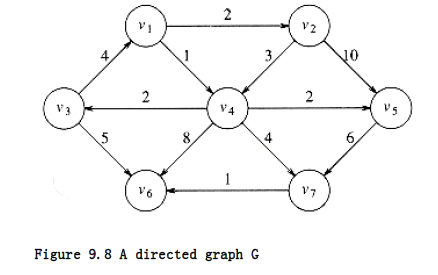
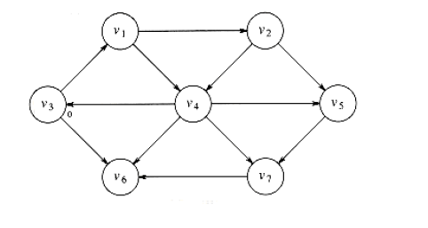
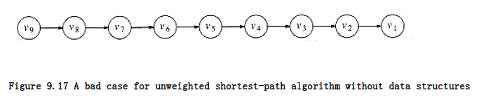
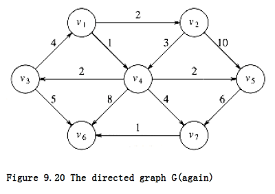
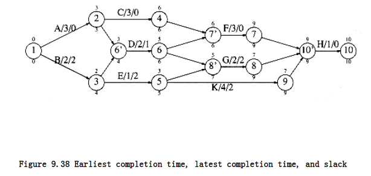

## Shortest-Path Algorithms

In this section we examine various shortest-path problems. The input is a weighted graph: associated with each edge (v~i~, v~j~) is a cost c~i,j~ to traverse the arc. The cost of a path v~1~v~2~ ... v~n~ is This is referred to as the weighted path length. The unweighted path length is merely the number of edges on the path, namely, n - 1.

**SINGLE-SOURCE SHORTEST-PATH PROBLEM:**

Given as input a weighted graph, G = (V, E), and a distinguished vertex, s , find the shortest weighted path from s to every other vertex in G.

For example, in the graph in Figure 9.8, the shortest weighted path from v~1~ to v6 has a cost of 6 and goes from v~1~ to v~4~ to v~7~ to v~6~. The shortest unweighted path between these vertices is 2.

Generally, when it is not specified whether we are referring to a weighted or an unweighted path, the path is weighted if the graph is. Notice also that in this graph there is no path from v6 to v1.

The graph in the preceding example has no edges of negative cost. The graph in Figure 9.9 shows the problems that negative edges can cause. The path from v~5~ to v~4~ has cost 1, but a shorter path exists by following the loop v~5~, v~4~, v~2~, v~5~, v~4~, which has cost -5. This path is still not the shortest, because we could stay in the loop arbitrarily long. Thus, the shortest path between these two points is undefined. Similarly, the shortest path from v~~ to v~6~ is undefined, because we can get into the same loop. This loop is known as a negative-cost cycle; when one is present in the graph, the shortest paths are not defined. Negative-cost edges are not necessarily bad, as the cycles are, but their presence seems to make the problem harder. For convenience, in the absence of a negative-cost cycle, the shortest path from s to s is zero.




There are many examples where we might want to solve the shortest-path problem. If the vertices represent computers; the edges represent a link between computers; and the costs represent communication costs (phone bill per 1,000 bytes of data), delay costs (number of seconds required to transmit 1,000 bytes), or a combination of these and other factors, then we can use the shortest-path algorithm to find the cheapest way to send electronic news from one computer to a set of other computers.

We can model airplane or other mass transit routes by graphs and use a shortest-path algorithm to compute the best route between two points. In this and many practical applications, we might want to find the shortest path from one vertex, s, to only one other vertex, t. Currently there are no algorithms in which finding the path from s to one vertex is any faster (by more than a constant factor) than finding the path from s to all vertices.

We will examine algorithms to solve four versions of this problem. First, we will consider the unweighted shortest-path problem and show how to solve it in O(|E| + |V|). Next, we will show how to solve the weighted shortest-path problem if we assume that there are no negative edges. The running time for this algorithm is O (|E| log |V|) when implemented with reasonable data structures.

If the graph has negative edges, we will provide a simple solution, which unfortunately has a poor time bound of O (|E| |V|). Finally, we will solve the weighted problem for the special case of acyclic graphs in linear time.

### Unweighted Shortest Paths

Figure 9.10 shows an unweighted graph, G. Using some vertex, s, which is an input parameter, we would like to find the shortest path from s to all other vertices. We are only interested in the number of edges contained on the path, so there are no weights on the edges. This is clearly a special case of the weighted shortest-path problem, since we could assign all edges a weight of 1.

For now, suppose we are interested only in the length of the shortest paths, not in the actual paths themselves. Keeping track of the actual paths will turn out to be a matter of simple bookkeeping.


Suppose we choose s to be v3. Immediately, we can tell that the shortest path from s to v3 is then a path of length 0. We can mark this information, obtaining the graph in Figure 9.11.

Now we can start looking for all vertices that are a distance 1 away from s. These can be found by looking at the vertices that are adjacent to s. If we do this, we see that v1 and v6 are one
edge from s. This is shown in Figure 9.12.
 



We can now find vertices whose shortest path from s is exactly 2, by finding all the vertices adjacent to v~1~ and v~~ (the vertices at distance 1), whose shortest paths are not already known.

This search tells us that the shortest path to v~2~ and v~4~ is 2. Figure 9.13 shows the progress that has been made so far.

Finally we can find, by examining vertices adjacent to the recently evaluated v~2~ and v~4~, that v~5~and v~7~ have a shortest path of three edges. All vertices have now been calculated, and so Figure 9.14 shows the final result of the algorithm.

This strategy for searching a graph is known as breadth-first search. It operates by processing vertices in layers: the vertices closest to the start are evaluated first, and the most distant vertices are evaluated last. This is much the same as a level-order traversal for trees.

Given this strategy, we must translate it into code. Figure 9.15 shows the initial configuration of the table that our algorithm will use to keep track of its progress.

For each vertex, we will keep track of three pieces of information. First, we will keep its distance from s in the entry dv. Initially all vertices are unreachable except for s, whose path length is 0. The entry in pv is the bookkeeping variable, which will allow us to print the actual paths. The entry known is set to 1 after a vertex is processed. Initially, all entries are unknown, including the start vertex.
 


v Known d~v~ p~v~

------------------

v~1~ 0 0

v~2~ 0 0

v~3~ 0 0 0

v~4~ 0 0

v~5~ 0 0

v~6~ 0 0

v~7~ 0 0

Figure 9.15 Initial configuration of table used in unweighted shortest-path computation

When a vertex is known, we have a guarantee that no cheaper path will ever be found, and so processing for that vertex is essentially complete.

The basic algorithm can be described in Figure 9.16. The algorithm in Figure 9.16 mimics the diagrams by declaring as known the vertices at distance d = 0, then d = 1, then d = 2, and so on,and setting all the adjacent vertices w that still have dw = to a distance dw = d + 1.

By tracing back through the pv variable, the actual path can be printed. We will see how when we discuss the weighted case.
 
The running time of the algorithm is O(|V|2), because of the doubly nested for loops. An obvious inefficiency is that the outside loop continues until NUM_VERTEX -1, even if all the vertices become known much earlier. Although an extra test could be made to avoid this, it does not affect the worst-case running time, as can be seen by generalizing what happens when the input is the graph in Figure 9.17 with start vertex v9.
```c
void unweighted(TABLE T) * assume T is initialized *
{

unsigned int curr_dist;

vertex v, w;

for(curr_dist = 0; curr_dist < NUM_VERTEX; curr_dist++)

for each vertex v

if((!T[v].known) && (T[v].dist = curr_dist)){

T[v].known = TRUE;

for each w adjacent to v

if(T[w].dist = INT_MAX){

T[w].dist = curr_dist + 1;

T[w].path = v;

}

}

}
```
**Figure 9.16 Pseudocode for unweighted shortest-path algorithm**



 We can remove the inefficiency in much the same way as was done for topological sort. At any point in time, there are only two types of unknown vertices that have d~v~ . Some have d~v~ = curr_dist, and the rest have d~v~ = curr_dist + 1. Because of this extra structure, it is very wasteful to search through the entire table to find a proper vertex at lines 2 and 3.

A very simple but abstract solution is to keep two boxes. Box #1 will have the unknown vertices with dv = curr_dist, and box #2 will have dv = curr_dist + 1. The test at lines 2 and 3 can be replaced by finding any vertex in box #1. After line 8 (inside the if block), we can add w to box #2. After the outside for loop terminates, box #1 is empty, and box #2 can be transferred to box #1 for the next pass of the for loop.

We can refine this idea even further by using just one queue. At the start of the pass, the queue contains only vertices of distance curr_dist. When we add adjacent vertices of distance curr_dist + 1, since they enqueue at the rear, we are guaranteed that they will not be processed until after all the vertices of distance curr_dist have been processed. After the last vertex at distance curr_dist dequeues and is processed, the queue only contains vertices of distance curr_dist + 1, so this process perpetuates. We merely need to begin the process by placing the start node on the queue by itself.

The refined algorithm is shown in Figure 9.18. In the pseudocode, we have assumed that the start vertex, s, is known somehow and T[s].dist is 0. A C routine might pass s as an argument. Also, it is possible that the queue might empty prematurely, if some vertices are unreachable from the start node. In this case, a distance of INT_MAX will be reported for these nodes, which is perfectly reasonable. Finally, the known field is not used; once a vertex is processed it can never enter the queue again, so the fact that it need not be reprocessed is implicitly marked. Thus, the known field can be discarded. Figure 9.19 shows how the values on the graph we have been using are changed during the algorithm. We keep the known field to make the table easier to follow, and for consistency with the rest of this section.

Using the same analysis as was performed for topological sort, we see that the running time is O (|E| + |V|), as long as adjacency lists are used.

### Dijkstra's Algorithm

If the graph is weighted, the problem (apparently) becomes harder, but we can still use the ideas from the unweighted case.

We keep all of the same information as before. Thus, each vertex is marked as either known or unknown. A tentative distance dv is kept for each vertex, as before. This distance turns out to be the shortest path length from s to v using only known vertices as intermediates. As before, we record p~v~, which is the last vertex to cause a change to d~v~.
```c
void unweighted(TABLE T) * assume T is initialized (Fig 9.30) *
{

QUEUE Q;

vertex v, w;

Q = create_queue(NUM_VERTEX); make_null(Q);

* enqueue the start vertex s, determined elsewhere *

enqueue(s, Q);

while(!is empty(Q))
{

v = dequeue(Q);

T[v].known = TRUE; * not really needed anymore *

for each w adjacent to v

if(T[w].dist = INT_MAX){

T[w].dist = T[v].dist + 1;

T[w].path = v;

enqueue(w, Q);

}

}

dispose_queue(Q); * free the memory *

}
```
**Figure 9.18 Pseudocode for unweighted shortest-path algorithm**

The general method to solve the single-source shortest-path problem is known as Dijkstra's algorithm. This thirty-year-old solution is a prime example of a greedy algorithm. Greedy algorithms generally solve a problem in stages by doing what appears to be the best thing at each stage. For example, to make change in U.S. currency, most people count out the quarters first, then the dimes, nickels, and pennies. This greedy algorithm gives change using the minimum number of coins. The main problem with greedy algorithms is that they do not always work. The addition of a 12-cent piece breaks the coin-changing algorithm, because the answer it gives (one 12-cent piece and three pennies) is not optimal (one dime and one nickel).

Dijkstra's algorithm proceeds in stages, just like the unweighted shortest-path algorithm. At each stage, Dijkstra's algorithm selects a vertex v, which has the smallest dv among all the unknown vertices, and declares that the shortest path from s to v is known. The remainder of a stage consists of updating the values of dw.

Initial State v~3~ Dequeued v~1~ Dequeued v~6~ Dequeued

------------- -------------- ------------- -------------

v Known d~v~ p~v~ Known d~v~ p~v~ Known d~v~ p~v~ Known d~v~ p~v~

----------------------------------------------------------------

v~1~ 0 0 0 1 v~3~ 1 1 v~3~ 1 1 v~3~

v~2~ 0 0 0 0 0 2 v~1~ 0 2 v~1~

v~3~ 0 0 0 1 0 0 1 0 0 1 0 0
 
v~4~ 0 0 0 0 0 2 v~1~ 0 2 v~1~

v~5~ 0 0 0 0 0 0 0 0

v~6~ 0 0 0 1 v~3~ 0 1 v~3~ 1 1 v~3~

v~7~ 0 0 0 0 0 0 0 0

----------------------------------------------------------------

Q: v~3~ v~1~,v~6~ v~6~,v~2~,v4 v~2~,v4

v~2~ Dequeued v~4~ Dequeued v~5~ Dequeued v~7~ Dequeued

------------- -------------- ------------- -------------

v Known d~v~ p~v~ Known d~v~ p~v~ Known d~v~ p~v~ Known d~v~ p~v~

----------------------------------------------------------------

v~1~ 1 1 v~3~ 1 1 v~3~ 1 1 v~3~ 1 1 v~3~

v~2~ 1 2 v~1~ 1 2 v~1~ 1 2 v~1~ 1 2 v~1~

v~3~ 1 0 0 1 0 0 1 0 0 1 0 0

v~4~ 0 2 v~1~ 1 2 v~1~ 1 2 v~1~ 1 2 v~1~

v~5~ 0 3 v~2~ 0 3 v~2~ 1 3 v~2~ 1 3 v~2~

v~6~ 1 1 v~3~ 1 1 v~3~ 1 1 v~3~ 1 1 v~3~

v~7~ 0 0 0 3 v~4~ 0 3 v~4~ 1 3 v~4~

----------------------------------------------------------------

Q: v~4~,v~5~ v~5~,v~7~ v~7~ empty

Figure 9.19 How the data structure changes during the unweighted shortest-path algorithm In the unweighted case, we set d~w~ = d~v + 1~ if d~w~ = . Thus, we essentially lowered the value of dw if vertex v offered a shorter path. If we apply the same logic to the weighted case, then we should set d~w~ = d~v~ + c~v~,w if this new value for dw would be an improvement. Put simply, the algorithm decides whether or not it is a good idea to use v on the path to w. The original cost, dw, is the cost without using v; the cost calculated above is the cheapest path using v (and only known vertices).

The graph in Figure 9.20 is our example. Figure 9.21 represents the initial configuration, assuming that the start node, s, is v~2~. The first vertex selected is v~1~, with path length 0. This vertex is marked known. Now that v~1~ is known, some entries need to be adjusted. The vertices adjacent to v~1~ are v~2~ and v~4~. Both these vertices get their entries adjusted, as indicated in
Figure 9.22.

Next, v~4~ is selected and marked known. Vertices v~3~, v~5~, v~6~, and v~7~ are adjacent, and it turns out that all require adjusting, as shown in Figure 9.23.

Next, v~2~ is selected. v~4~ is adjacent but already known, so no work is performed on it. v~5~ is adjacent but not adjusted, because the cost of going through v~2~ is 2 + 10 = 12 and a path of length 3 is already known. Figure 9.24 shows the table after these vertices are selected.



v Known d~v~ p~v~

-------------------

v~1~ 0 0 0

v~2~ 0 0

v~3~ 0 0

v~4~ 0 0

v~5~ 0 0

v~6~ 0 0

v~7~ 0 0
  

Figure 9.21 Initial configuration of table used in Dijkstra's algorithm


v Known d~v~ p~v~

--------------------

v~1~ 1 0 0

v~2~ 0 2 v~1~

v~3~ 0 0

v~4~ 0 1 v~1~

v~5~ 0 0

v~6~ 0 0

v~7~ 0 0

Figure 9.22 After v~1~ **is declared known**

v Known d~v~ p~v~

--------------------

v~1~ 1 0 0

v~2~ 0 2 v~1~

v~3~ 0 3 v~4~

v~4~ 1 1 v~1~

v~5~ 0 3 v~4~

v~6~ 0 9 v~4~

v~7~ 0 5 v~4~

Figure 9.23 After v~4~ **is declared known**

v Known d~v~ p~v~ 

--------------------

v~1~ 1 0 0

v~2~ 1 2 v~1~

v~3~ 0 3 v~4~

v~4~ 1 1 v~1~

v~5~ 0 3 v~4~

v~6~ 0 9 v~4~

v~7~ 0 5 v~4~

Figure 9.24 After v~2~ **is declared known**

v Known d~v~ p~v~

--------------------

v~1~ 1 0 0

v~2~ 1 2 v~1~

v~3~ 1 3 v~4~

v~4~ 1 1 v~1~

v~5~ 1 3 v~4~

v~6~ 0 8 v~3~

v~7~ 0 5 v~4~

Figure 9.25 After v~5~ **and then v~3~ are declared known**

v Known d~v~ p~v~

-------------------

v~1~ 1 0 0

v~2~ 1 2 v~1~

v~3~ 1 3 v~4~

v~4~ 1 1 v~1~

v~5~ 1 3 v~4~

v~6~ 0 6 v~7~

v~7~ 1 5 v~4~

Figure 9.26 After v~7~ **is declared known**

The next vertex selected is v5 at cost 3. v7 is the only adjacent vertex, but it is not adjusted, because 3 + 6 > 5. Then v3 is selected, and the distance for v6 is adjusted down to 3 + 5 = 8.

The resulting table is depicted in Figure 9.25.

Next v7 is selected; v6 gets updated down to 5 + 1 = 6. The resulting table is Figure 9.26.

Finally, v6 is selected. The final table is shown in Figure 9.27. Figure 9.28 graphically shows how edges are marked known and vertices updated during Dijkstra's algorithm.

v Known d~v~ p~v~

-------------------

v~1~ 1 0 0

v~2~ 1 2 v~1~

v~3~ 1 3 v~4~

v~4~ 1 1 v~1~

v~5~ 1 3 v~4~

v~6~ 1 6 v~7~

v~7~ 1 5 v~4~

Figure 9.27 After v~6~ **is declared known and algorithm terminates**
  


To print out the actual path from a start vertex to some vertex v, we can write a recursive routine to follow the trail left in the p array.

We now give pseudocode to implement Dijkstra's algorithm. We will assume that the vertices are numbered from 0 to NUM_VERTEX for convenience (see Fig. 9.29), and that the graph can be read into an adjacency list by the routine read_graph.

In the routine in Figure 9.30, the start vertex is passed to the initialization routine. This is the only place in the code where the start vertex needs to be known.

The path can be printed out using the recursive routine in Figure 9.31. The routine recursively prints the path all the way up to the vertex before v on the path, and then just prints v. This works because the path is simple.
```c
typedef int vertex;

struct table_entry
{

LIST header; /* Adjacency list header */

int known;

dist_type dist;

vertex path;

};

/* Vertices are numbered from 1 */

#define NOT_A_VERTEX 0

typedef struct table_entry TABLE[NUM_VERTEX+1];
```
**Figure 9.29 Declarations for Dijkstra's algorithm**
```c
void init_table(vertex start, graph G, TABLE T)
{

int i;

read graph(G, T); /* read graph somehow */

for(i=NUM_VERTEX; i>0; i--)
{

T[i].known = FALSE;

T[i].dist = INT_MAX;

T[i].path = NOT_A_VERTEX;

}

T[start].dist = 0;

}
```
**Figure 9.30 Table initialization routine**

/* print shortest path to v after dijkstra has run */

/* assume that the path exists */  
```c
void print_path(vertex v, TABLE T)
{

if(T[v].path != NOT_A_VERTEX){

print_path(T[v].path, T);

printf(" to ");

}

printf("%v", v); /* %v is a pseudocode option for printf */

}
```
**Figure 9.31 Routine to print the actual shortest path**

Figure 9.32 shows the main algorithm, which is just a for loop to fill up the table using the greedy selection rule.

A proof by contradiction will show that this algorithm always works as long as no edge has a negative cost. If any edge has negative cost, the algorithm could produce the wrong answer (see Exercise 9.7a). The running time depends on how the table is manipulated, which we have yet to consider. If we use the obvious algorithm of scanning down the table to find the minimum dv, each phase will take O(|V|) time to find the minimum, and thus O(|V|~2~) time will be spent finding the minimum over the course of the algorithm. The time for updating d~w~ is constant per update, and there is at most one update per edge for a total of O(|E|). Thus, the total running time is O(|E|\+ |V|~2~) = O(|V|~2~). If the graph is dense, with |E| = (|V|~2~), this algorithm is not only simple but essentially optimal, since it runs in time linear in the number of edges.

If the graph is sparse, with |E| = (|V|), this algorithm is too slow. In this case, the distances would need to be kept in a priority queue. There are actually two ways to do this; both are similar.

Lines 2 and 5 combine to form a delete_min operation, since once the unknown minimum vertex is found, it is no longer unknown and must be removed from future consideration. The update at line 9 can be implemented two ways.

One way treats the update as a decrease_key operation. The time to find the minimum is then O(log |V|), as is the time to perform updates, which amount to decrease_key operations. This gives a running time of O(|E| log |V| + |V| log |V|) = O(|E| log |V|), an improvement over the previous bound for sparse graphs. Since priority queues do not efficiently support the find operation, the location in the priority queue of each value of di will need to be maintained and updated whenever di changes in the priority queue. This is not typical of the priority queue ADT and thus is considered ugly.

The alternate method is to insert w and the new value dw into the priority queue every time line 9 is executed. Thus, there may be more than one representative for each vertex in the priority queue. When the delete_min operation removes the smallest vertex from the priority queue, it must be checked to make sure that it is not already known. Thus, line 2 becomes a loop performing delete_mins until an unknown vertex emerges. Although this method is superior from a software point of view, and is certainly much easier to code, the size of the priority queue could get to be as big as |E|. This does not affect the asymptotic time bounds, since |E| |V|2 implies that log|E| 2 log |V|. Thus, we still get an O(|E| log |V|) algorithm. However, the space requirement does increase, and this could be important in some applications. Moreover, because this method requires |E| delete_mins instead of only |V|, it is likely to be slower in practice.
```c
void dijkstra(TABLE T)
{

vertex v, w;

for(; ;)
{

v = smallest unknown distance vertex;

break;

T[v].known = TRUE;

for each w adjacent to v

if(!T[w].known)
if(T[v].dist + cv,w < T[w].dist){ /* update w */

decrease(T[w].dist to

T[v].dist + cv,w);

T[w].path = v;

}

}

}
``` 

Figure 9.32 Pseudocode for Dijkstra's algorithm

Notice that for the typical problems, such as computer mail and mass transit commutes, the graphs are typically very sparse because most vertices have only a couple of edges, so it is important in many applications to use a priority queue to solve this problem.

There are better time bounds possible using Dijkstra's algorithm if different data structures are used. In Chapter 11, we will see another priority queue data structure called the Fibonacci heap. When this is used, the running time is O(|E| + |V| log |V|). Fibonacci heaps have good theoretical time bounds but a fair amount of overhead, so it is not dear whether using Fibonacci heaps is actually better in practice than Dijkstra's algorithm with binary heaps. Needless to say, there are no average-case results for this problem, since it is not even obvious how to model a random graph.
```c
void /* assume T is initialized as in Fig 9.18 */

weighted_negative(TABLE T)
{

QUEUE Q;

vertex v, w;

Q = create_queue(NUM_VERTEX); make_null(Q);

enqueue(s, Q); /* enqueue the start vertex s */

while(!is_empty(Q))
{

v = dequeue(Q);

for each w adjacent to v

if(T[v].dist + cv,w < T[w].dist){ /*update w */

T[w].dist = T[v].dist + cv,w ;

T[w].path = v;

if(w is not already in Q)
enqueue(w, Q);

}

}

dispose_queue(Q);

}
```

Figure 9.33 Pseudocode for weighted shortest-path algorithm with negative edge costs

### Graphs with Negative Edge Costs

If the graph has negative edge costs, then Dijkstra's algorithm does not work. The problem is that once a vertex u is declared known, it is possible that from some other, unknown vertex v there is a path back to u that is very negative. In such a case, taking a path from s to v back to u is better than going from s to u without using v.

A combination of the weighted and unweighted algorithms will solve the problem, but at the cost of a drastic increase in running time. We forget about the concept of known vertices, since our algorithm needs to be able to change its mind. We begin by placing s on a queue. Then, at each stage, we dequeue a vertex v. We find all vertices w adjacent to v such that d~w~ > d~v~ + c~v~,w. We update dw and pw, and place w on a queue if it is not already there. A bit can be set for each vertex to indicate presence in the queue. We repeat the process until the queue is empty.

Figure 9.33 (almost) implements this algorithm.

Although the algorithm works if there are no negative-cost cycles, it is no longer true that the code in lines 6 through 10 is executed once per edge. Each vertex can dequeue at most |V| times, so the running time is O(|E| |V|) if adjacency lists are used (Exercise 9.7b). This is quite an increase from Dijkstra's algorithm, so it is fortunate that, in practice, edge costs are nonnegative. If negative-cost cycles are present, then the algorithm as written will loop indefinitely. By stopping the algorithm after any vertex has dequeued |V| + 1 times, we can guarantee termination.

### Acyclic Graphs

If the graph is known to be acyclic, we can improve Dijkstra's algorithm by changing the order in which vertices are declared known, otherwise known as the vertex selection rule. The new rule is to select vertices in topological order. The algorithm can be done in one pass, since the selections and updates can take place as the topological sort is being performed.

This selection rule works because when a vertex v is selected, its distance, dv, can no longer be lowered, since by the topological ordering rule it has no incoming edges emanating from unknown nodes.

There is no need for a priority queue with this selection rule; the running time is O(|E| + |V|), since the selection takes constant time.

An acyclic graph could model some downhill skiing problem -- we want to get from point a to b, but can only go downhill, so clearly there are no cycles. Another possible application might be the modeling of (nonreversible) chemical reactions. We could have each vertex represent a particular state of an experiment. Edges would represent a transition from one state to another, and the edge weights might represent the energy released. If only transitions from a higher energy state to a lower are allowed, the graph is acyclic.

A more important use of acyclic graphs is critical path analysis. The graph in Figure 9.34 will serve as our example. Each node represents an activity that must be performed, along with the time it takes to complete the activity. This graph is thus known as an activity-node graph. The edges represent precedence relationships: An edge (v, w) means that activity v must be completed before activity w may begin. Of course, this implies that the graph must be acyclic. We assume that any activities that do not depend (either directly or indirectly) on each other can be performed in parallel by different servers.


This type of a graph could be (and frequently is) used to model construction projects. In this case, there are several important questions which would be of interest to answer. First, what is the earliest completion time for the project? We can see from the graph that 10 time units are required along the path A, C, F, H. Another important question is to determine which activities can be delayed, and by how long, without affecting the minimum completion time. For instance, delaying any of A, C, F, or H would push the completion time past 10 units. On the other hand, activity B is less critical and can be delayed up to two time units without affecting the final completion time.

To perform these calculations, we convert the activity-node graph to an event-node graph. Each event corresponds to the completion of an activity and all its dependent activities. Events reachable from a node v in the event-node graph may not commence until after the event v is completed. This graph can be constructed automatically or by hand. Dummy edges and nodes may need to be inserted in the case where an activity depends on several others. This is necessary in order to avoid introducing false dependencies (or false lack of dependencies). The event node graph corresponding to the graph in Figure 9.34 is shown in Figure 9.35.

To find the earliest completion time of the project, we merely need to find the length of the longest path from the first event to the last event. For general graphs, the longest-path problem generally does not make sense, because of the possibility of positive-cost cycles. These are the equivalent of negative-cost cycles in shortest-path problems. If positive-cost cycles are present, we could ask for the longest simple path, but no satisfactory solution is known for this problem. Since the event-node graph is acyclic, we need not worry about cycles. In this case, it is easy to adapt the shortest-path algorithm to compute the earliest completion time for all nodes in the graph. If E Ci is the earliest completion time for node i, then the applicable rules


Figure 9.36 shows the earliest completion time for each event in our example event-node graph.

We can also compute the latest time, LCi, that each event can finish without affecting the final completion time. The formulas to do this are LCn = ECn


These values can be computed in linear time by maintaining, for each vertex, a list of all adjacent and preceding vertices. The earliest completion times are computed for vertices by their topological order, and the latest completion times are computed by reverse topological order. The latest completion times are shown in Figure 9.37.

The slack time for each edge in the event-node graph represents the amount of time that the completion of the corresponding activity can be delayed without delaying the overall completion. It is easy to see that


Figure 9.38 shows the slack (as the third entry) for each activity in the event-node graph. For each node, the top number is the earliest completion time and the bottom entry is the latest completion time.




Some activities have zero slack. These are critical activities, which must finish on schedule. There is at least one path consisting entirely of zero-slack edges; such a path is a critical path.

### All-Pairs Shortest Path

Sometimes it is important to find the shortest paths between all pairs of vertices in the graph. Although we could just run the appropriate single-source algorithm |V| times, we might expect a somewhat faster solution, especially on a dense graph, if we compute all the information at once.

In Chapter 10, we will see an O(|V|~3~) algorithm to solve this problem for weighted graphs. Although, for dense graphs, this is the same bound as running a simple (non-priority queue) Dijkstra's algorithm |V| times, the loops are so tight that the specialized all-pairs algorithm is likely to be faster in practice. On sparse graphs, of course, it is faster to run |V| Dijkstra's algorithms coded with priority queues.
