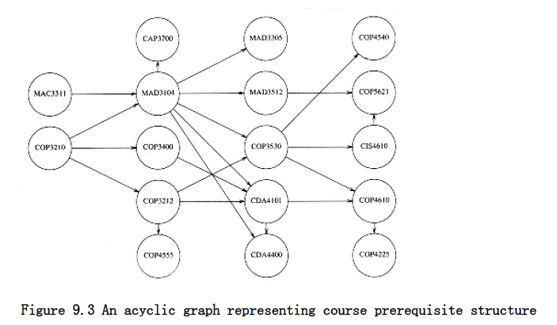
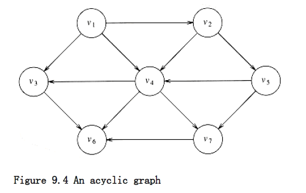

## Topological Sort

A topological sort is an ordering of vertices in a directed acyclic graph, such that if there is a path from v~i~ to v~j~, then v~j~ appears after v~i~ in the ordering.

The graph in Figure 9.3 represents the course prerequisite structure at a state university in Miami. A directed edge (v,w) indicates that course v must be completed before course w may be attempted. A topological ordering of these courses is any course sequence that does not violate the prerequisite requirement.

It is clear that a topological ordering is not possible if the graph has a cycle, since for two vertices v and w on the cycle, v precedes w and w precedes v. Furthermore, the ordering is not necessarily unique; any legal ordering will do. In the graph in Figure 9.4, v~1~, v~2~, v~5~, v~4~, v~3~, v~7~, v~6~and v~1~, v~2~, v~5~, v~4~, v~7~, v~3~, v6 are both topological orderings.

A simple algorithm to find a topological ordering is first to find any vertex with no incoming edges. We can then print this vertex, and remove it, along with its edges, from the graph. Then we apply this same strategy to the rest of the graph.





To formalize this, we define the indegree of a vertex v as the number of edges (u,v). We compute the indegrees of all vertices in the graph. Assuming that the indegree array is initialized and that the graph is read into an adjacency list, we can then apply the algorithm in Figure 9.5 to generate a topological ordering.

The function find_new_vertex_of_indegree_zero scans the indegree array looking for a vertex with indegree 0 that has not already been assigned a topological number. It returns NOT_A_VERTEX if no such vertex exists; this indicates that the graph has a cycle.

```c
void
topsort(graph G){
unsigned int counter;
vertex v, w;
for(counter = 0; counter < NUM_VERTEX; counter++){
v = find_new_vertex_of_indegree_zero();
if(v = NOT_A_VERTEX){
error("Graph has a cycle");
break;
}
top_num[v] = counter;
for each w adjacent to v
indegree[w]--;
}
}
```
**Figure 9.5 Simple topological sort pseudocode**

Because find_new_vertex_of_indegree_zero is a simple sequential scan of the indegree array, each call to it takes O(|V|) time. Since there are |V| such calls, the running time of the algorithm is O(|V|^2^).

By paying more careful attention to the data structures, it is possible to do better. The cause of the poor running time is the sequential scan through the indegree array. If the graph is sparse, we would expect that only a few vertices have their indegrees updated during each iteration. However, in the search for a vertex of indegree 0, we look at (potentially) all the vertices, even though only a few have changed.

We can remove this inefficiency by keeping all the (unassigned) vertices of indegree 0 in a special box. The find_new_vertex_of_indegree_zero function then returns (and removes) any vertex in the box. When we decrement the indegrees of the adjacent vertices, we check each vertex and place it in the box if its indegree falls to 0.

To implement the box, we can use either a stack or a queue. First, the indegree is computed for every vertex. Then all vertices of indegree 0 are placed on an initially empty queue. While the queue is not empty, a vertex v is removed, and all edges adjacent to v have their indegrees decremented. A vertex is put on the queue as soon as its indegree falls to 0. The topological ordering then is the order in which the vertices dequeue. Figure 9.6 shows the status after each phase.

A pseudocode implementation of this algorithm is given in Figure 9.7. As before, we will assume that the graph is already read into an adjacency list and that the indegrees are computed and placed in an array. A convenient way of doing this in practice would be to place the indegree of each vertex in the header cell. We also assume an array top_num, in which to place the topological numbering.

Indegree Before Dequeue #

Vertex 1 2 3 4 5 6 7

--------------------------------------

v1 0 0 0 0 0 0 0

v2 1 0 0 0 0 0 0

v3 2 1 1 1 0 0 0

v4 3 2 1 0 0 0 0

v5 1 1 0 0 0 0 0

v6 3 3 3 3 2 1 0

v7 2 2 2 1 0 0 0

--------------------------------------

enqueue v1 v2 v5 v4 v3 v7 v6

--------------------------------------

dequeue v1 v2 v5 v4 v3 v7 v6

Figure 9.6 Result of applying topological sort to the graph in Figure 9.4
```c
void topsort(graph G)
{

QUEUE Q;

unsigned int counter;

vertex v, w;
 
Q = create_queue(NUM_VERTEX); make_null(Q); counter = 0;

for each vertex v

if(indegree[v] = 0)
enqueue(v, Q);

while(!is_empty(Q))
{

v = dequeue(Q);

top_num[v] = ++counter; * assign next number *

for each w adjacent to v

if(--indegree[w] = 0)
enqueue(w, Q);

}

if(counter != NUM_VERTEX)
error("Graph has a cycle");

dispose_queue(Q); * free the memory *

}
```
**Figure 9.7 Pseudocode to perform topological sort**

The time to perform this algorithm is O(|E| + |V|) if adjacency lists are used. This is apparent when one realizes that the body of the for loop at line 8 is executed at most once per edge. The queue operations are done at most once per vertex, and the initialization steps also take time proportional to the size of the graph.
