# HASHING

In Previous Chapter, we discussed the search tree ADT, which allowed various operations on a set of elements. In this chapter, we discuss the hash table ADT, which supports only a subset of the operations allowed by binary search trees.

The implementation of hash tables is frequently called hashing. Hashing is a technique used for performing insertions, deletions and finds in constant average time. Tree operations that require any ordering information among the elements are not supported efficiently. Thus, operations such as find_min, find_max, and the printing of the entire table in sorted order in linear time are not supported.

- The central data structure in this chapter is the hash table. We will See several methods of implementing the hash table.

- Compare these methods analytically.

- Show numerous applications of hashing.

- Compare hash tables with binary search trees.

## General Idea

The ideal hash table data structure is merely an array of some fixed size, containing the keys. Typically, a key is a string with an associated value (for instance, salary information). We will refer to the table size as H_SIZE, with the understanding that this is part of a hash data structure and not merely some variable floating around globally. The common convention is to have the table run from 0 to H_SIZE-1; we will see why shortly.

Each key is mapped into some number in the range 0 to H_SIZE - 1 and placed in the appropriate cell. The mapping is called a hash function, which ideally should be simple to compute and should ensure that any two distinct keys get different cells. Since there are a finite number of cells and a virtually inexhaustible supply of keys, this is clearly impossible, and thus we seek a hash function that distributes the keys evenly among the cells. Figure 5.1 is typical of a perfect situation. In this example, john hashes to 3, phil hashes to 4, dave hashes to 6, and mary hashes to 7. 

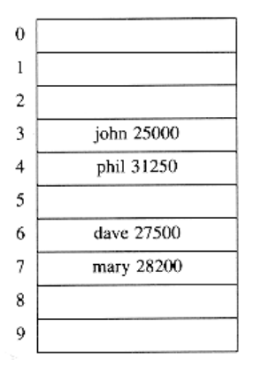

**Figure 5.1 An ideal hash table**

This is the basic idea of hashing. The only remaining problems deal with choosing a function, deciding what to do when two keys hash to the same value (this is known as a collision), and deciding on the table size.
## Hash Function

If the input keys are integers, then simply returning key mod H_SIZE is generally a reasonable strategy, unless key happens to have some undesirable properties. In this case, the choice of hash function needs to be carefully considered. For instance, if the table size is 10 and the keys all end in zero, then the standard hash function is obviously a bad choice. For reasons we shall see later, and to avoid situations like the one above, it is usually a good idea to ensure that the table size is prime. When the input keys are random integers, then this function is not only very simple to compute but also distributes the keys evenly.

Usually, the keys are strings; in this case, the hash function needs to be chosen carefully.

One option is to add up the ASCII values of the characters in the string. In Figure 5.2 we declare the type INDEX, which is returned by the hash function. The routine in Figure 5.3 implements this strategy and uses the typical C method of stepping through a string.

The hash function depicted in Figure 5.3 is simple to implement and computes an answer quickly. However, if the table size is large, the function does not distribute the keys well. For instance, suppose that H_SIZE = 10,007 (10,007 is a prime number). Suppose all the keys are eight or fewer characters long. Since a char has an integer value that is always at most 127, the hash function can only assume values between 0 and 1016, which is 127 * 8. This is clearly not an equitable distribution!
```c
typedef unsigned int INDEX;
```
Figure 5.2 Type returned by hash function

 
```c
INDEX

hash(char *key, unsigned int H_SIZE)

{

unsigned int hash_val = 0;

/*1*/ while(*key != '\\0')

/*2*/ hash_val += *key++;

/*3*/ return(hash_val % H_SIZE);

}
```
Figure 5.3 A simple hash function

Another hash function is shown in Figure 5.4. This hash function assumes key has at least two characters plus the NULL terminator. 27 represents the number of letters in the English alphabet, plus the blank, and 729 is 272. This function only examines the first three characters, but if these are random, and the table size is 10,007, as before, then we would expect a reasonably equitable distribution. Unfortunately, English is not random. Although there are 263 = 17,576 possible combinations of three characters (ignoring blanks), a check of a reasonably large on-line dictionary reveals that the number of different combinations is actually only 2,851. Even if none of these combinations collide, only 28 percent of the table can actually be hashed to. Thus this function, although easily computable, is also not appropriate if the hash table is reasonably large.

Figure 5.5 shows a third attempt at a hash function. This hash function involves all characters in the key and can generally be expected to distribute well (it computes key/key_size - i - 1] 32i, and brings the result into proper range). The code computes a polynomial function (of 32) by use of Horner's rule.

For instance, another way of computing hk = k1 + 27k2 + 27 2k3 is by the formula hk = ((k3) * 27 + k2) * 27 + k1. Horner's rule extends this to an nth degree polynomial.

We have used 32 instead of 27, because multiplication by 32 is not really a multiplication, but amounts to bit-shifting by five. In line 2, the addition could be replaced with a bitwise exclusive or, for increased speed.

```c
INDEX

hash(char *key, unsigned int H_SIZE)

{

return ((key[0] + 27*key[1] + 729*key[2]) % H_SIZE);

}Figure 5.4 Another possible hash function -- not too good

INDEX

hash(char *key, unsigned int H_SIZE)

{

unsigned int hash_val = O;

/*1*/ while(*key != '\\0')

/*2*/ hash_val = (hash_val << 5) + *key++;

/*3*/ return(hash_val % H_SIZE);

}
```
Figure 5.5 A good hash function

The hash function described in Figure 5.5 is not necessarily the best with respect to table distribution, but does have the merit of extreme simplicity (and speed if overflows are allowed). If the keys are very long, the hash function will take too long to compute. Furthermore, the early characters will wind up being left-shifted out of the eventual answer. A common practice in this case is not to use all the characters. The length and properties of the keys would then influence the choice. For instance, the keys could be a complete street address. The hash function might include a couple of characters from the street address and perhaps a couple of characters from the city name and ZIP code. Some programmers implement their hash function by using only the characters in the odd spaces, with the idea that the time saved computing the hash function will make up for a slightly less evenly distributed function.

The main programming detail left is collision resolution. If, when inserting an element, it hashes to the same value as an already inserted element, then we have a collision and need to resolve it. There are several methods for dealing with this. We will discuss two of the simplest: open hashing and closed hashing.*

*These are also commonly known as separate chaining and open addressing, respectively.

## Open Hashing (Separate Chaining)

The first strategy, commonly known as either open hashing, or separate chaining, is to keep a list of all elements that hash to the same value. For convenience, our lists have headers. This makes the list implementation the same as in Chapter 3. If space is tight, it might be preferable to avoid their use. We assume for this section that the keys are the first 10 perfect squares and that the hashing function is simply hash(x) = x mod 10. (The table size is not prime, but is used here for simplicity.) Figure 5.6 should make this clear.

To perform a find, we use the hash function to determine which list to traverse. We then traverse this list in the normal manner, returning the position where the
item is found. To perform an insert, we traverse down the appropriate list to check whether the element is already in place (if duplicates are expected, an extra field is usually kept, and this field would be incremented in the event of a match). If the element turns out to be new, it is inserted either at the front of the list or at the end of the list, whichever is easiest. This is an issue most easily addressed while the code is being written. Sometimes new elements are inserted at the front of the list, since it is convenient and also because frequently it happens that recently inserted elements are the most likely to be accessed in the near future.
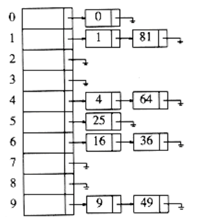
Figure 5.6 An open hash table

The type declarations required to implement open hashing are in Figure 5.7. The first few lines are the same as the linked list declarations of Chapter 3. The hash table structure contains the actual size and an array of linked lists, which are dynamically allocated when the table is initialized. The HASH_TABLE type is just a pointer to this structure.
```c
typedef struct list_node *node_ptr;

struct list_node

{

element_type element;

node_ptr next;

};

typedef node_ptr LIST;

typedef node_ptr position;

/* LIST *the_list will be an array of lists, allocated later */

/* The lists will use headers, allocated later */

struct hash_tbl

{


unsigned int table_size;

LIST *the_lists;

};

typedef struct hash_tbl *HASH_TABLE;

Figure 5.7 Type declaration for open hash table

Notice that the the_lists field is actually a pointer to a pointer to a list_node structure. If

typedefs and abstraction are not used, this can be quite confusing.

HASH_TABLE

initialize_table(unsigned int table_size)

{

HASH_TABLE H;

int i;

/*1*/ if(table size < MIN_TABLE_SIZE)

{

/*2*/ error("Table size too small");

/*3*/ return NULL;

}

/* Allocate table */

/*4*/ H = (HASH_TABLE) malloc (sizeof (struct hash_tbl));

/*5*/ if(H == NULL)

/*6*/ fatal_error("Out of space!!!");

/*7*/ H->table_size = next_prime(table_size);

/* Allocate list pointers */

/*8*/ H->the_lists = (position *)

malloc(sizeof (LIST) * H->table_size);

/*9*/ if(H->the_lists == NULL)

/*10*/ fatal_error("Out of space!!!");

/* Allocate list headers */

/*11*/ for(i=0; i<H->table_size; i++)

{
/*12*/ H->the_lists[i] = (LIST) malloc

(sizeof (struct list_node));

/*13*/ if(H->the_lists[i] == NULL)

/*14*/ fatal_error("Out of space!!!");

else

/*15*/ H->the_lists[i]->next = NULL;

}

/*16*/ return H;

}
```
Figure 5.8 Initialization routine for open hash table

Figure 5.8 shows the initialization function, which uses the same ideas that were seen in the array implementation of stacks. Lines 4 through 6 allocate a hash table structure. If space is available, then H will point to a structure containing an integer and a pointer to a list. Line 7 sets the table size to a prime number, and lines 8 through 10 attempt to allocate an array of lists. Since a LIST is defined to be a pointer, the result is an array of pointers.

If our LIST implementation was not using headers, we could stop here. Since our implementation uses headers, we must allocate one header per list and set its next field to NULL. This is done in lines 11 through 15. Of course, lines 12 through 15 could be replaced with the statement
```c
H->the_lists[i] = make_null();
```
Although we have not used this option, because in this instance it is preferable to make the code as self-contained as possible, it is certainly worth considering. An inefficiency of our code is that the malloc on line 12 is performed H->table_size times. This can be avoided by replacing line 12 with one call to malloc before the loop occurs:
```c
H->the lists = (LIST*) malloc

(H->table_size * sizeof (struct list_node));
```
Line 16 returns H.

The call find(key, H) will return a pointer to the cell containing key. The code to implement this is shown in Figure 5.9. Notice that lines 2 through 5 are identical to the code to perform a find that is given in Chapter 3. Thus, the list ADT implementation in Chapter 3 could be used here. Remember that if element_type is a string, comparison and assignment must be done with strcmp and strcpy, respectively.

Next comes the insertion routine. If the item to be inserted is already present, then we do nothing; otherwise we place it at the front of the list (see Fig. 5.10).*

*Since the table in Figure 5.6 was created by inserting at the end of the list, the code in Figure 5.10 will produce a table with the lists in Figure 5.6 reversed.
```c
position

find(element_type key, HASH_TABLE H)

{

position p;

LIST L;

/*1*/ L = H->the_lists[ hash(key, H->table_size) ];

/*2*/ p = L->next;

/*3*/ while((p != NULL) && (p->element != key))

/* Probably need strcmp!! */

/*4*/ p = p->next;

/*5*/ return p;

}
```
Figure 5.9 Find routine for open hash table
```c
void

insert(element_type key, HASH_TABLE H)

{

position pos, new_cell;

LIST L;

/*1*/ pos = find(key, H);

/*2*/ if(pos == NULL)

{

/*3*/ new_cell = (position) malloc(sizeof(struct list_node));

/*4*/ if(new_cell == NULL)

/*5*/ fatal_error("Out of space!!!");

else

{

/*6*/ L = H->the_lists[ hash(key, H->table size) ];

/*7*/ new_cell->next = L->next;

/*8*/ new_cell->element = key; /* Probably need strcpy!! */

/*9*/ L->next = new_cell;

}}

}
```
Figure 5.10 Insert routine for open hash table

The element can be placed anywhere in the list; this is most convenient in our case. Notice that the code to insert at the front of the list is essentially identical to the code in Chapter 3 that implements a push using linked lists. Again, if the ADTs in Chapter 3 have already been carefully implemented, they can be used here.

The insertion routine coded in Figure 5.10 is somewhat poorly coded, because it computes the hash function twice. Redundant calculations are always bad, so this code should be rewritten if it turns out that the hash routines account for a significant portion of a program's running time.

The deletion routine is a straightforward implementation of deletion in a linked list, so we will not bother with it here. If the repertoire of hash routines does not include deletions, it is probably best to not use headers, since their use would provide no simplification and would waste considerable space. We leave this as an exercise, too.

Any scheme could be used besides linked lists to resolve the collisions-a binary search tree or even another hash table would work, but we expect that if the table is large and the hash function is good, all the lists should be short, so it is not worthwhile to try anything complicated.

We define the load factor, , of a hash table to be the ratio of the number of elements in the hash table to the table size. In the example above, = 1.0. The average length of a list is  The effort required to perform a search is the constant time required to evaluate the hash function plus the time to traverse the list.

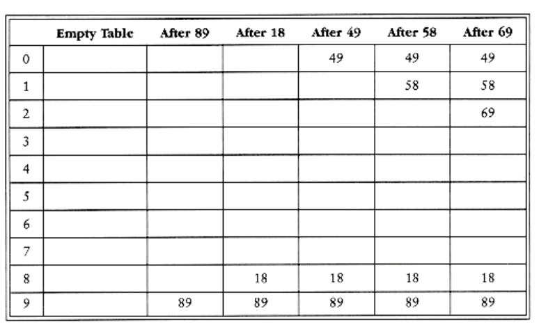
Figure 5.11 Closed hash table with linear probing, after each insertion In an unsuccessful search, the number of links to traverse is (excluding the final NULL link) on average. A successful search requires that about 1 + (/2) links be traversed, since there is a guarantee that one link must be traversed (since the search is successful), and we also expect to go halfway down a list to find our match. This analysis shows that the table size is not really important, but the load factor is. The general rule for open hashing is to make the table size about as large as the number of elements expected (in other words, let 1). It is also a good idea, as mentioned before, to keep the table size prime to ensure a good distribution.

## Closed Hashing (Open Addressing)

Open hashing has the disadvantage of requiring pointers. This tends to slow the algorithm down a bit because of the time required to allocate new cells, and also essentially requires the implementation of a second data structure. Closed hashing, also known as open addressing, is an alternative to resolving collisions with linked lists. In a closed hashing system, if a collision occurs, alternate cells are tried until an empty cell is found. More formally, cells h0(x), h1 (x), h2(x), . . . are tried in succession where hi(x) = (hash(x) + (i))mod H_SIZE, with (0) = 0. The function, , is the collision resolution strategy. Because all the data goes inside the table, a bigger table is needed for closed hashing than for open hashing. Generally, the load factor should be below = 0.5 for closed hashing. We now look at three common collision resolution strategies.

**5.4.1. Linear Probing**

**5.4.2. Quadratic Probing**

**5.4.3. Double Hashing**

### Linear Probing

In linear probing, is a linear function of i, typically (i) = i. This amounts to trying cells sequentially (with wraparound) in search of an empty cell. Figure 5.11 shows the result of inserting keys {89, 18, 49, 58, 69} into a closed table using the same hash function as before and the collision resolution strategy, (i) = i.

The first collision occurs when 49 is inserted; it is put in the next available spot, namely spot 0, which is open. 58 collides with 18, 89, and then 49 before an empty cell is found three away. The collision for 69 is handled in a similar manner. As long as the table is big enough, a free cell can always be found, but the time to do so can get quite large. Worse, even if the table is relatively empty, blocks of occupied cells start forming. This effect, known as primary clustering, means that any key that hashes into the cluster will require several attempts to resolve the collision, and then it will add to the cluster.

Although we will not perform the calculations here, it can be shown that the expected number of probes using linear probing is roughly 1/2(1 + 1/(1 -)2) for insertions and unsuccessful searches and 1/2(1 + 1/ (1-)) for successful searches. The calculations are somewhat involved. It is easy to see from the code that insertions and unsuccessful searches require the same number of probes. A moment's thought suggests that on average, successful searches should take less time than unsuccessful searches.

The corresponding formulas, if clustering were not a problem, are fairly easy to derive. We will assume a very large table and that each probe is independent of the previous probes. These assumptions are satisfied by a random collision resolution strategy and are reasonable unless is very close to 1. First, we derive the expected number of probes in an unsuccessful search. This is just the expected number of probes until we find an empty cell. Since the fraction of empty cells is 1 - , the number of cells we expect to probe is 1/(1 -). The number of probes for a successful search is equal to the number of probes required when the particular element was inserted. When an element is inserted, it is done as a result of an unsuccessful search. Thus we can use the cost of an unsuccessful search to compute the average cost of a successful search.

The caveat is that changes from 0 to its current value, so that earlier insertions are cheaper and should bring the average down. For instance, in the table above, = 0.5, but the cost of accessing 18 is determined when 18 is inserted. At that point, = 0.2. Since 18 was inserted into a relatively empty table, accessing it should be easier than accessing a recently inserted element such as 69. We can estimate the average by using an integral to calculate the mean value of the insertion time, obtaining These formulas are clearly better than the corresponding formulas for linear probing. Clustering is not only a theoretical problem but actually occurs in real implementations.

Figure 5.12 compares the performance of linear probing (dashed curves) with what would be expected from more random collision resolution. Successful searches are indicated by an S, and unsuccessful searches and insertions are marked with U and I, respectively.

If = 0.75, then the formula above indicates that 8.5 probes are expected for an insertion in linear probing. If = 0.9, then 50 probes are expected, which is unreasonable. This compares with 4 and 10 probes for the respective load factors if clustering were not a problem. We see from these formulas that linear probing can be a bad idea if the table is expected to be more than half full. If = 0.5, however, only 2.5 probes are required on average for insertion andonly 1.5 probes are required, on average, for a successful search.

### Quadratic Probing

Quadratic probing is a collision resolution method that eliminates the primary clustering problem of linear probing. Quadratic probing is what you would expect-the collision function is quadratic. The popular choice is (i) = i2. Figure 5.13 shows the resulting closed table with this collision function on the same input used in the linear probing example.

When 49 collides with 89, the next position attempted is one cell away. This cell is empty, so 49 is placed there. Next 58 collides at position 8. Then the cell one away is tried but another collision occurs. A vacant cell is found at the next cell tried, which is 22 = 4 away. 58 is thus placed in cell 2. The same thing happens for 69.

For linear probing it is a bad idea to let the hash table get nearly full, because performance degrades. For quadratic probing, the situation is even more drastic: There is no guarantee of finding an empty cell once the table gets more than half full, or even before the table gets half full if the table size is not prime. This is because at most half of the table can be used as alternate locations to resolve collisions.

Indeed, we prove now that if the table is half empty and the table size is prime, then we are always guaranteed to be able to insert a new element.

**THEOREM 5.1.**

If quadratic probing is used, and the table size is prime, then a new element can always be inserted if the table is at least half empty.

PROOF:

Let the table size, H_SIZE, be an (odd) prime greater than 3. We show that the first

H_SIZ_E/2 alternate locations are all distinct. Two of these locations are h(x) + i2(mod

H_SIZE) and h(x) + j2(mod H_SIZE), where 0 < i, j H_SIZE/2 . Suppose, for the sake

of contradiction, that these locations are the same, but i j. Then
```
h(x) + i2 = h(x) + j2 (mod H_SIZE)

i2 = j2 (mod H_SIZE)

i2 - j2 = 0 (mod H_SIZE)

(i - j)(i + j) = 0 (mod H_SIZE)
```
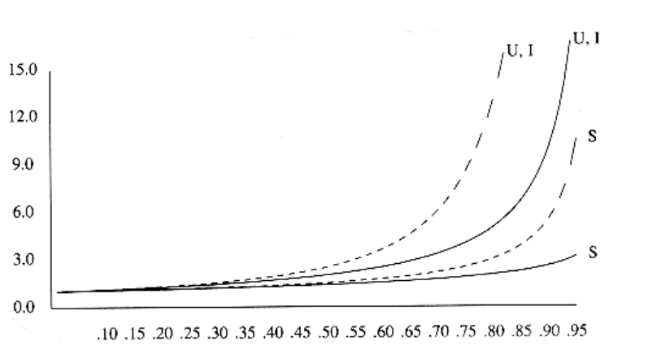
Figure 5.12 Number of probes plotted against load factor for linear probing (dashed) and random strategy. S is successful search,U is unsuccessful search, I is insertion
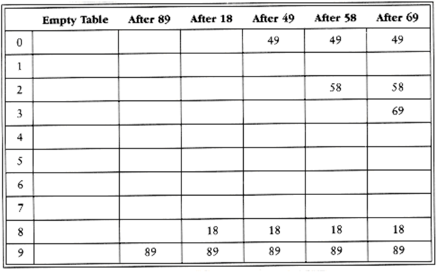
Figure 5.13 Closed hash table with quadratic probing, after each insertion Since H_SIZE is prime, it follows that either (i - j) or (i + j) is equal to 0 (mod H_SIZE).

Since i and j are distinct, the first option is not possible. Since 0 < i, j < H_SIZE_2 , the second option is also impossible. Thus, the first H_SIZE_2 alternate locations are distinct. Since the element to be inserted can also be placed in the cell to which it hashes (if there are no collisions), any element has H_SIZE_2 locations into which it can go. If at most H_SIZE_2 positions are taken, then an empty spot can always be found.

If the table is even one more than half full, the insertion could fail (although this is extremely unlikely). Therefore, it is important to keep this in mind. It is also crucial that the table size be prime.* If the table size is not prime, the number of alternate locations can be severely reduced. As an example, if the table size were 16, then the only alternate locations would be at distances 1, 4, or 9 away.

*If the table size is a prime of the form 4k + 3, and the quadratic collision resolution strategy f(i) = + i2 is used, then the entire table can be probed. The cost is a slightly more complicated routine.

Standard deletion cannot be performed in a closed hash table, because the cell might have caused a collision to go past it. For instance, if we remove 89, then virtually all of the remaining finds will fail. Thus, closed hash tables require lazy deletion, although in this case there really is no laziness implied.

The type declarations required to implement closed hashing are in Figure 5.14. Instead of an array of lists, we have an array of hash table entry cells, which, as in open hashing, are allocated dynamically. Initializing the table (Figure 5.15) consists of allocating space (lines 1 through 10) and then setting the info field to empty for each cell.
```c
enum kind_of_entry { legitimate, empty, deleted };

struct hash_entry
{

element_type element;

enum kind_of_entry info;

};

typedef INDEX position;

typedef struct hash_entry cell;

/* the_cells is an array of hash_entry cells, allocated later */

struct hash_tbl

{

unsigned int table_size;

cell *the_cells;

};

typedef struct hash_tbl *HASH_TABLE;
```
Figure 5.14 Type declaration for closed hash tables
```c
HASH_TABLE

initialize_table(unsigned int table_size)

{
HASH_TABLE H;

int i;

/*1*/ if(table_size < MIN_TABLE_SIZE)

{

/*2*/ error("Table size too small");

/*3*/ return NULL;

}

/* Allocate table */

/*4*/ H = (HASH_TABLE) malloc(sizeof (struct hash_tbl));

/*5*/ if(H == NULL)

/*6*/ fatal_error("Out of space!!!");

/*7*/ H->table_size = next_prime(table_size);

/* Allocate cells */

/*8*/ H->the cells = (cell *) malloc

(sizeof (cell) * H->table_size);

/*9*/ if(H->the_cells == NULL)

/*10*/ fatal_error("Out of space!!!");

/*11*/ for(i=0; i<H->table_size; i++)

/*12*/ H->the_cells[i].info = empty;

/*13*/ return H;

}
```
**Figure 5.15 Routine to initialize closed hash table**

As with open hashing, find(key, H) will return the position of key in the hash table. If key is not present, then find will return the last cell. This cell is where key would be inserted if needed. Further, because it is marked empty, it is easy to tell that the find failed. We assume for convenience that the hash table is at least twice as large as the number of elements in the table, so quadratic resolution will always work. Otherwise, we would need to test i before line 4. In the implementation in Figure 5.16, elements that are marked as deleted count as being in the table. This can cause problems, because the table can get too full prematurely. We shall discuss this item presently.

Lines 4 through 6 represent the fast way of doing quadratic resolution. From the definition of the quadratic resolution function, f(i) = f(i - 1) + 2i -1, so the next cell to try can be determined with a multiplication by two (really a bit shift) and a decrement. If the new location is past the array, it can be put back in range by subtracting H_SIZE. This is faster than the obvious method, because it avoids the multiplication and division that seem to be required. Thevariable name i is not the best one to use; we only use it to be consistent with the text.
```c
position

find(element_type key, HASH_TABLE H)

{

position i, current_pos;

/*1*/ i = 0;

/*2*/ current_pos = hash(key, H->table_size);

/* Probably need strcmp! */

/*3*/ while((H->the_cells[current_pos].element != key) &&

(H->the_cells[current_pos].info != empty))

{

/*4*/ current_pos += 2*(++i) - 1;

/*5*/ if(current_pos >= H->table_size)

/*6*/ current_pos -= H->table_size;

}

/*7*/ return current_pos;

}
```
**Figure 5.16 Find routine for closed hashing with quadratic probing**

The final routine is insertion. As with open hashing, we do nothing if key is already present. It is a simple modification to do something else. Otherwise, we place it at the spot suggested by the find routine. The code is shown in **Figure 5.17.**

Although quadratic probing eliminates primary clustering, elements that hash to the same position will probe the same alternate cells. This is known as secondary clustering. Secondary clustering is a slight theoretical blemish. Simulation results suggest that it generally causes less than an extra probe per search. The following technique eliminates this, but does so at the cost of extra multiplications and divisions.

### Double Hashing 

The last collision resolution method we will examine is double hashing. For double hashing, one popular choice is f(i) = i h2(x). This formula says that we apply a second hash function to x and probe at a distance h2(x), 2h2(x), . . ., and so on. A poor choice of h2(x) would be disastrous. For instance, the obvious choice h2(x) = x mod 9 would not help if 99 were inserted into the input in the previous examples. Thus, the function must never evaluate to zero. It is also important to make sure all cells can be probed (this is not possible in the example below, because the table size is not prime). A function such as h2(x) = R - (x mod R), with R a prime smaller than H_SIZE, will work well. If we choose R = 7, then Figure 5.18 shows the results of inserting the same keys as before.
```
void

insert(element_type key, HASH_TABLE H)

{

position pos;

pos = find(key, H);

if(H->the_cells[pos].info != legitimate)

{ /* ok to insert here */

H->the_cells[pos].info = legitimate;

H->the_cells[pos].element = key;

/* Probably need strcpy!! */

}

}
```
**Figure 5.17 Insert routine for closed hash tables with quadratic probing**

**Figure 5.18 Closed hash table with double hashing, after each insertion**
  

The first collision occurs when 49 is inserted. h2(49) = 7 - 0 = 7, so 49 is inserted in position

6. h2(58) = 7 - 2 = 5, so 58 is inserted at location 3. Finally, 69 collides and is inserted at a distance h2(69) = 7 - 6 = 1 away. If we tried to insert 60 in position 0, we would have a collision. Since h2(60) = 7 - 4 = 3, we would then try positions 3, 6, 9, and then 2 until an empty spot is found. It is generally possible to find some bad case, but there are not too many here.

As we have said before, the size of our sample hash table is not prime. We have done this for convenience in computing the hash function, but it is worth seeing why it is important to make sure the table size is prime when double hashing is used. If we attempt to insert 23 into the table, it would collide with 58. Since h2(23) = 7 - 2 = 5, and the table size is 10, we essentially have only one alternate location, and it is already taken. Thus, if the table size is not prime, it is possible to run out of alternate locations prematurely. However, if double hashing is correctly implemented, simulations imply that the expected number of probes is almost the same as for a random collision resolution strategy. This makes double hashing theoretically interesting. Quadratic probing, however, does not require the use of a second hash function and is thus likely to be simpler and faster in practice.

## Rehashing

If the table gets too full, the running time for the operations will start taking too long and inserts might fail for closed hashing with quadratic resolution. This can happen if there are too many deletions intermixed with insertions. A solution, then, is to build another table that is about twice as big (with associated new hash function) and scan down the entire original hash table, computing the new hash value for each (non-deleted) element and inserting it in the new table.

As an example, suppose the elements 13, 15, 24, and 6 are inserted into a closed hash table of size 7. The hash function is h(x) = x mod 7. Suppose linear probing is used to resolve collisions. The resulting hash table appears in

Figure 5.19.

If 23 is inserted into the table, the resulting table in Figure 5.20 will be over 70 percent full. Because the table is so full, a new table is created. The size of this table is 17, because this is the first prime which is twice as large as the old table size. The new hash function is then h(x) = x mod 17. The old table is scanned, and elements 6, 15, 23, 24, and 13 are inserted into the new table. The resulting table appears in Figure 5.21.

This entire operation is called rehashing. This is obviously a very expensive operation -- the running time is O(n), since there are n elements to rehash and the table size is roughly 2n, but it is actually not all that bad, because it happens very infrequently. In particular, there must have been n/2 inserts prior to the last rehash, so it essentially adds a constant cost to each insertion.* If this data structure is part of the program, the effect is not noticeable. On the other hand, if the hashing is performed as part of an interactive system, then the unfortunate user whose insertion caused a rehash could see a slowdown.

*This is why the new table is made twice as large as the old table.

 
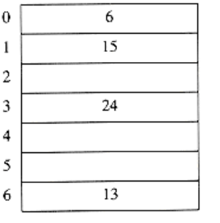
**Figure 5.19 Closed hash table with linear probing with input 13,15, 6, 24**
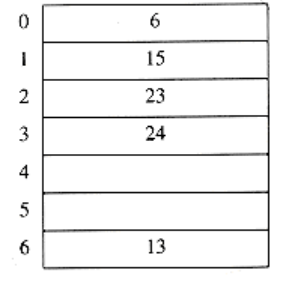
**Figure 5.20 Closed hash table with linear probing after 23 is inserted**
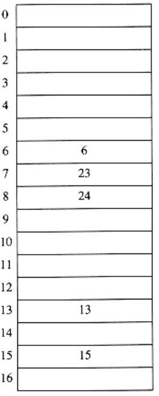
**Figure 5.21 Closed hash table after rehashing**

Rehashing can be implemented in several ways with quadratic probing. One alternative is to rehash as soon as the table is half full. The other extreme is to rehash only when an insertion fails. A third, middle of the road, strategy is to rehash when the table reaches a certain load factor. Since performance does degrade as the load factor increases, the third strategy, implemented with a good cutoff, could be best.

Rehashing frees the programmer from worrying about the table size and is important because hash tables cannot be made arbitrarily large in complex programs. The exercises ask you to investigate the use of rehashing in conjunction with lazy deletion. Rehashing can be used in other data structures as well. For instance, if the queue data structure of Chapter 3 became full, we could declare a double-sized array and copy everything over, freeing the original.

Figure 5.22 shows that rehashing is simple to implement.
```c
HASH_TABLE

rehash(HASH_TABLE H)

{

unsigned int i, old_size;

cell *old_cells;

/*1*/ old_cells = H->the_cells;

/*2*/ old_size = H->table_size;

/* Get a new, empty table */

/*3*/ H = initialize_table(2*old_size);

/* Scan through old table, reinserting into new */

/*4*/ for(i=0; i<old_size; i++)

/*5*/ if(old_cells[i].info == legitimate)

/*6*/ insert(old_cells[i].element, H);

/*7*/ free(old_cells);

/*8*/ return H;

}
```
**Figure 5.22**
## Extendible Hashing

Our last topic in this chapter deals with the case where the amount of data is too large to fit in main memory. As we saw in Chapter 4, the main consideration then is the number of disk accesses required to retrieve data.

As before, we assume that at any point we have n records to store; the value of n changes over time. Furthermore, at most m records fit in one disk block. We will use m = 4 in this section.

If either open hashing or closed hashing is used, the major problem is that collisions could cause several blocks to be examined during a find, even for a well-distributed hash table. Furthermore, when the table gets too full, an extremely expensive rehashing step must be performed, which requires O(n) disk accesses.

A clever alternative, known as extendible hashing, allows a find to be performed in two disk accesses. Insertions also require few disk accesses.

We recall from Chapter 4 that a B-tree has depth O(logm/2 n). As m increases, the depth of a B-tree decreases. We could in theory choose m to be so large that the depth of the B-tree would be 1. Then any find after the first would take one disk access, since, presumably, the root node could be stored in main memory. The problem with this strategy is that the branching factor is so high that it would take considerable processing to determine which leaf the data was in. If the time to perform this step could be reduced, then we would have a practical scheme. This is exactly the strategy used by extendible hashing.

Let us suppose, for the moment, that our data consists of several six-bit integers. Figure 5.23 shows an extendible hashing scheme for this data. The root of the "tree" contains four pointers determined by the leading two bits of the data. Each leaf has up to m = 4 elements. It happens that in each leaf the first two bits are identical; this is indicated by the number in parentheses. To be more formal, D will represent the number of bits used by the root, which is sometimes known as the directory. The number of entries in the directory is thus 2D. dl is the number of leading bits that all the elements of some leaf l have in common. dl will depend on the particular leaf, and dl D.

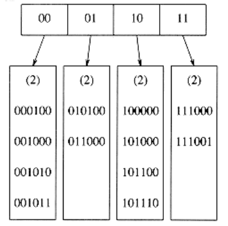
**Figure 5.23 Extendible hashing: original data**

Suppose that we want to insert the key 100100. This would go into the third leaf, but as the third leaf is already full, there is no room. We thus split this leaf into two leaves, which are now determined by the first three bits. This requires increasing the directory size to 3. These changes are reflected in Figure 5.24.

Notice that all of the leaves not involved in the split are now pointed to by two adjacent directory entries. Thus, although an entire directory is rewritten, none of the other leaves are actually accessed.

If the key 000000 is now inserted, then the first leaf is split, generating two leaves with dl = 3. Since D = 3, the only change required in the directory is the updating of the 000 and 001 pointers. See Figure 5.25.

This very simple strategy provides quick access times for insert and find operations on large databases. There are a few important details we have not considered.

First, it is possible that several directory splits will be required if the elements in a leaf agree in more than D + 1 leading bits. For instance, starting at the original example, with D = 2, if 111010, 111011, and finally 111100 are inserted, the directory size must be increased to 4 to distinguish between the five keys. This is an easy detail to take care of, but must not be forgotten. Second, there is the possibility of duplicate keys; if there are more than m duplicates, then this algorithm does not work at all. In this case, some other arrangements need to be made.

These possibilities suggest that it is important for the bits to be fairly random. This can be accomplished by hashing the keys into a reasonably long integer; hence the reason for the name.

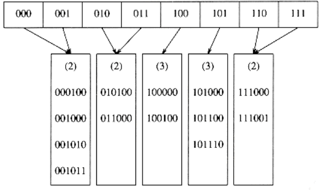
**Figure 5.24 Extendible hashing: after insertion of 100100 and directory split**
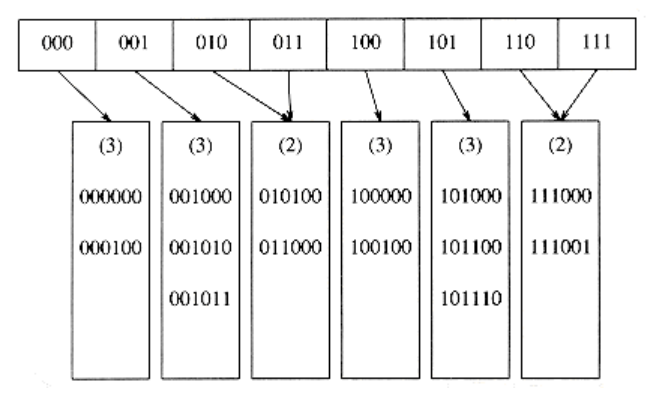
**Figure 5.25 Extendible hashing: after insertion of 000000 and leaf split**

We close by mentioning some of the performance properties of extendible hashing, which are derived after a very difficult analysis. These results are based on the reasonable assumption that the bit patterns are uniformly distributed.

The expected number of leaves is (n / m) log2 e. Thus the average leaf is ln 2 = 0.69 full. This is the same as B-trees, which is not entirely surprising, since for both data structures new nodes are created when the (m + 1)st entry is added.

The more surprising result is that the expected size of the directory (in other words, 2D) is O (n1+1 /m/ m). If m is very small, then the directory can get unduly large. In this case, we can have the leaves contain pointers to the records instead of the actual records, thus increasing the value of m. This adds a second disk access to each find operation in order to maintain a smaller directory. If the directory is too large to fit in main memory, the second disk access would be needed anyway.

## Summary

Hash tables can be used to implement the insert and find operations in constant average time. It is especially important to pay attention to details such as load factor when using hash tables, since otherwise the time bounds are not valid. It is also important to choose the hash function carefully when the key is not a short string or integer.

For open hashing, the load factor should be close to 1, although performance does not significantly degrade unless the load factor becomes very large. For closed hashing, the load factor should not exceed 0.5, unless this is completely unavoidable. If linear probing is used, performance degenerates rapidly as the load factor approaches 1. Rehashing can be implemented to allow the table to grow (and shrink), thus maintaining a reasonable load factor. This is important if space is tight and it is not possible just to declare a huge hash table.

Binary search trees can also be used to implement insert and find operations. Although the resulting average time bounds are O(log n), binary search trees also support routines that require order and are thus more powerful. Using a hash table, it is not possible to find the minimum element. It is not possible to search efficiently for a string unless the exact string is known. A binary search tree could quickly find all items in a certain range; this is not supported by hash tables. Furthermore, the O(log n) bound is not necessarily that much more than O (1), especially since no multiplications or divisions are required by search trees.

On the other hand, the worst case for hashing generally results from an implementation error, whereas sorted input can make binary trees perform poorly. Balanced search trees are quite expensive to implement, so if no ordering information is required and there is any suspicion that the input might be sorted, then hashing is the data structure of choice.

Hashing applications are abundant. Compilers use hash tables to keep track of declared variables in source code. The data structure is known as a symbol table. Hash tables are the ideal application for this problem because only inserts and finds are performed. Identifiers are typically short, so the hash function can be computed quickly.

A hash table is useful for any graph theory problem where the nodes have real names instead of numbers. Here, as the input is read, vertices are assigned integers from 1 onwards by order of appearance. Again, the input is likely to have large groups of alphabetized entries. For example, the vertices could be computers. Then if one particular installation lists its computers as ibm1, ibm2, ibm3, . . . , there could be a dramatic effect on efficiency if a search tree is used.

A third common use of hash tables is in programs that play games. As the program searches through different lines of play, it keeps track of positions it has seen by computing a hash function based on the position (and storing its move for that position). If the same position reoccurs, usually by a simple transposition of moves, the program can avoid expensive recomputation. This general feature of all game-playing programs is known as the transposition table.

Yet another use of hashing is in online spelling checkers. If misspelling detection (as opposed to correction) is important, an entire dictionary can be prehashed and words can be checked in constant time. Hash tables are well suited for this, because it is not important to alphabetize words; printing out misspellings in the order they occurred in the document is certainly acceptable.

We close this chapter by returning to the word puzzle problem of Chapter 1. If the second algorithm described in Chapter 1 is used, and we assume that the maximum word size is some small constant, then the time to read in the dictionary containing W words and put it in a hash table is O(W). This time is likely to be dominated by the disk I/O and not the hashing routines. The rest of the algorithm would test for the presence of a word for each ordered quadruple (row, column, orientation, number of characters). As each lookup would be O(1), and there are only a constant number of orientations (8) and characters per word, the running time of this phase would be O(r c). The total running time would be O (r c + W), which is a distinct improvement over the original O (r c W). We could make further optimizations, which would decrease the running time in practice; these are described in the exercises.

## Exercises

5.1 Given input {4371, 1323, 6173, 4199, 4344, 9679, 1989} and a hash function h(x) = x(mod 10), show the resulting

a. open hash table

b. closed hash table using linear probing

c. closed hash table using quadratic probing

d. closed hash table with second hash function h2(x) = 7 - (x mod 7)

5.2 Show the result of rehashing the hash tables in Exercise 5.1.

5.3 Write a program to compute the number of collisions required in a long random sequence of insertions using linear probing, quadratic probing, and double hashing.

5.4 A large number of deletions in an open hash table can cause the table to be fairly empty, which wastes space. In this case, we can rehash to a table half as large. Assume that we rehash to a larger table when there are twice as many elements as the table size. How empty should an open table be before we rehash to a smaller table?

5.5 An alternative collision resolution strategy is to define a sequence, f(i) = ri, where r0 = 0 and r1, r2, . . . , rn is a random permutation of the first n integers (each integer appearsexactly once).

a. Prove that under this strategy, if the table is not full, then the collision can always be resolved.

b. Would this strategy be expected to eliminate clustering?

c. If the load factor of the table is , what is the expected time to perform an insert?

d. If the load factor of the table is , what is the expected time for a successful search?

e. Give an efficient algorithm (theoretically as well as practically) to generate the random sequence. Explain why the rules for choosing P are important.

5.6 What are the advantages and disadvantages of the various collision resolution strategies?

5.7 Write a program to implement the following strategy for multiplying two sparse polynomials P1, P2 of size m and n respectively. Each polynomial is represented as a linked list with cells consisting of a coefficient, an exponent, and a next pointer (Exercise 3.7). We multiply each term in P1 by a term in P2 for a total of mn operations. One method is to sort these terms and combine like terms, but this requires sorting mn records, which could be expensive, especially in small-memory environments. Alternatively, we could merge terms as they are computed and then sort the result.

a. Write a program to implement the alternate strategy.

b. If the output polynomial has about O(m + n) terms, then what is the running time of both methods?

5.8 A spelling checker reads an input file and prints out all words not in some online dictionary. Suppose the dictionary contains 30,000 words and the file is one megabyte, so that the algorithm can make only one pass through the input file. A simple strategy is to read the dictionary into a hash table and look for each input word as it is read. Assuming that an average word is seven characters and that it is possible to store words of length l in l + 1 bytes (so space waste is not much of a consideration), and assuming a closed table, how much space does this require?

5.9 If memory is limited and the entire dictionary cannot be stored in a hash table, we can still get an efficient algorithm that almost always works. We declare an array H_TABLE of bits (initialized to zeros) from 0 to TABLE_SIZE - 1. As we read in a word, we set H_TABLE[hash(word)] = 1. Which of the following is true?

a. If a word hashes to a location with value 0, the word is not in the dictionary.

b. If a word hashes to a location with value 1, then the word is in the dictionary. 

Suppose we choose TABLE_SIZE = 300,007.

c. How much memory does this require?

d. What is the probability of an error in this algorithm?

e. A typical document might have about three actual misspellings per page of 500 words. Is this algorithm usable?

5.10 *Describe a procedure that avoids initializing a hash table (at the expense of memory).

5.11 Suppose we want to find the first occurrence of a string p1p2. . . pk in a long input string a1a2 . . . an. We can solve this problem by hashing the pattern string, obtaining a hash value hp, and comparing this value with the hash value formed from a1a2 . . . ak,a2a3 . . . ak+1,a3a4 . . . ak+2, and so on until an-k+1an-k+2 . . . an. If we have a match of hash values, we compare the strings character by character to verify the match. We return the position (in a) if the strings actually do match, and we continue in the unlikely event that the match is false.

*a. Show that if the hash value of aiai+1 . . . ai + k - 1 is known, then the hash value of ai+1ai+2 . . . ai+k can be computed in constant time.

b. Show that the running time is O(k + n) plus the time spent refuting false matches.

*c. Show that the expected number of false matches is negligible.

d. Write a program to implement this algorithm.

**e. Describe an algorithm that runs in O(k + n) worst case time.

**f. Describe an algorithm that runs in O(n/k) average time.

5.12 A BASIC program consists of a series of statements, each of which is numbered in ascending order. Control is passed by use of a goto or gosub and a statement number. Write a program that reads in a legal BASIC program and renumbers the statements so that the first starts at number f and each statement has a number d higher than the previous statement. You may assume an upper limit of n statements, but the statement numbers in the input might be as large as a 32-bit integer. Your program must run in linear time.

5.13 a. Implement the word puzzle program using the algorithm described at the end of the chapter.

b. We can get a big speed increase by storing, in addition to each word w, all of w's prefixes. (If one of w's prefixes is another word in the dictionary, it is stored as a real word). Although this may seem to increase the size of the hash table drastically, it does not, because many words have the same prefixes. When a scan is performed in a particular direction, if the word that is looked up is not even in the hash table as a prefix, then the scan in that direction can be terminated early. Use this idea to write an improved program to solve the word puzzle.

c. If we are willing to sacrifice the sanctity of the hash table ADT, we can speed up the program in part (b) by noting that if, for example, we have just computed the hash function for "excel," we do not need to compute the hash function for "excels" from scratch. Adjust your hash function so that it can take advantage of its previous calculation.

d. In Chapter 2, we suggested using binary search. Incorporate the idea of using prefixes into your binary search algorithm. The modification should be simple. Which algorithm is faster?

5.14 Show the result of inserting the keys 10111101, 00000010, 10011011, 10111110, 01111111, 01010001, 10010110, 00001011, 11001111, 10011110, 11011011, 00101011, 01100001, 11110000, 01101111 into an initially empty extendible hashing data structure with m = 4.

5.15 Write a program to implement extendible hashing. If the table is small enough to fit in main memory, how does its performance compare with open and closed hashing?

## References

Despite the apparent simplicity of hashing, much of the analysis is quite difficult and there are still many unresolved questions. There are also many interesting theoretical issues, which generally attempt to make it unlikely that the worst-case possibilities of hashing arise.

An early paper on hashing is [17]. A wealth of information on the subject, including an analysis of closed hashing with linear probing can be found in [11]. An excellent survey on the subject is [14]; [15] contains suggestions, and pitfalls, for choosing hash functions. Precise analytic and simulation results for all of the methods described in this chapter can be found in [8].

An analysis of double hashing can be found in [9] and [13]. Yet another collision resolution scheme is coalesced hashing, as described in [18]. Yao [20] has shown that uniform hashing, in which no clustering exists, is optimal with respect to cost of a successful search.

If the input keys are known in advance, then perfect hash functions, which do not allow collisions, exist [2], [7]. Some more complicated hashing schemes, for which the worst case depends not on the particular input but on random numbers chosen by the algorithm, appear in [3] and [4].

Extendible hashing appears in [5], with analysis in [6] and [19].

One method of implementing Exercise 5.5 is described in [16]. Exercise 5.11 (a-d) is from [10]. Part (e) is from [12], and part (f) is from [1].

1. R. S. Boyer and J. S. Moore, "A Fast String Searching Algorithm," Communications of the ACM 20 (1977), 762-772.

2. J. L. Carter and M. N. Wegman, "Universal Classes of Hash Functions," Journal of Computer and System Sciences 18 (1979), 143-154.

3. M. Dietzfelbinger, A. R. Karlin, K. Melhorn, F. Meyer auf der Heide, H. Rohnert, and R. E. Tarjan, Dynamic Perfect Hashing: Upper and Lower Bounds," Proceedings of the Twenty-ninth IEEE Symposium on Foundations of Computer Science (1988), 524-531.

4. R. J. Enbody and H. C. Du, "Dynamic Hashing Schemes," Computing Surveys 20 (1988), 85-113.

5. R. Fagin, J. Nievergelt, N. Pippenger, and H. R. Strong, "Extendible Hashing-A Fast Access Method for Dynamic Files," ACM Transactions on Database Systems 4 (1979), 315-344.

6. P. Flajolet, "On the Performance Evaluation of Extendible Hashing and Trie Searching," Acta Informatica 20 (1983), 345-369.

7. M. L. Fredman, J. Komlos, and E. Szemeredi, "Storing a Sparse Table with O(1) Worst Case Access Time," Journal of the ACM 31 (1984), 538-544.

8. G. H. Gonnet and R. Baeza-Yates, Handbook of Algorithms and Data Structures, second edition, Addison-Wesley, Reading, MA, 1991.

9. L. J. Guibas and E. Szemeredi, "The Analysis of Double Hashing," Journal of Computer and System Sciences 16 (1978), 226-274.

10. R. M. Karp and M. O. Rabin, "Efficient Randomized Pattern-Matching Algorithms," Aiken Computer Laboratory Report TR-31-81, Harvard University, Cambridge, MA, 1981.

11. D. E. Knuth, The Art of Computer Programming, Vol 3: Sorting and Searching, second printing, Addison-Wesley, Reading, MA, 1975.

12. D. E. Knuth, J. H. Morris, V. R. Pratt, "Fast Pattern Matching in Strings," SIAM Journal on Computing 6 (1977), 323-350.

13. G. Lueker and M. Molodowitch, "More Analysis of Double Hashing," Proceedings of the Twentieth ACM Symposium on Theory of Computing (1988), 354-359.

14. W. D. Maurer and T. G. Lewis, "Hash Table Methods," Computing Surveys 7 (1975), 5-20.

15. B. J. McKenzie, R. Harries, and T. Bell, "Selecting a Hashing Algorithm," Software--Practice and Experience 20 (1990), 209-224.

16. R. Morris, "Scatter Storage Techniques," Communications of the ACM 11 (1968), 38-44.

17. W. W. Peterson, "Addressing for Random Access Storage," IBM Journal of Research and Development 1 (1957), 130-146.

18. J. S. Vitter, "Implementations for Coalesced Hashing," Communications of the ACM 25 (1982), 911-926.

19. A. C. Yao, "A Note on The Analysis of Extendible Hashing," Information Processing Letters 11 (1980), 84-86.

20. A. C. Yao, "Uniform Hashing is Optimal," Journal of the ACM 32 (1985), 687-693.