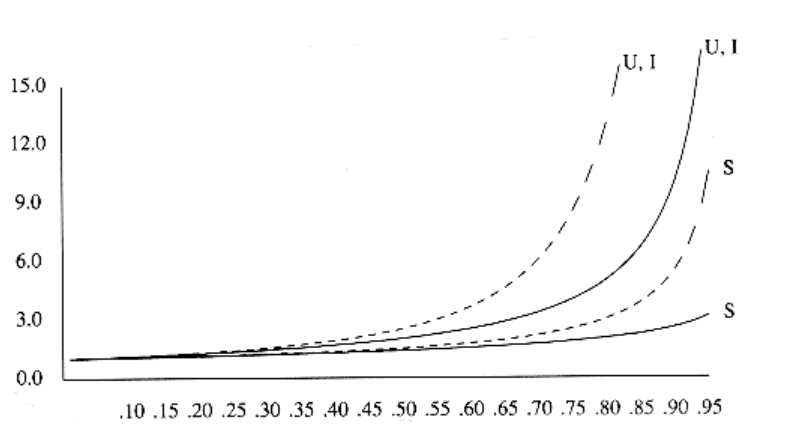
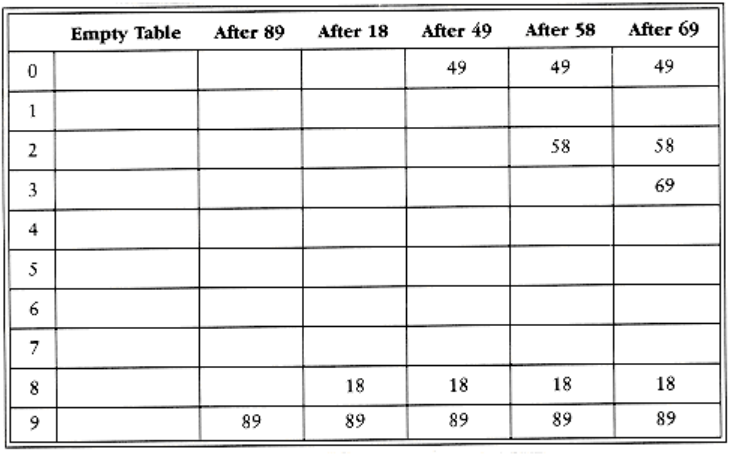
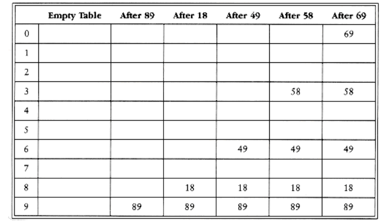

# Closed Hashing (Open Addressing)

Open hashing has the disadvantage of requiring pointers. This tends to slow the algorithm down a bit because of the time required to allocate new cells, and also essentially requires the implementation of a second data structure. Closed hashing, also known as open addressing, is an alternative to resolving collisions with linked lists. In a closed hashing system, if a collision occurs, alternate cells are tried until an empty cell is found. More formally, cells h0(x), h1 (x), h2(x), . . . are tried in succession where hi(x) = (hash(x) + (i))mod H_SIZE, with (0) = 0. The function, , is the collision resolution strategy. Because all the data goes inside the table, a bigger table is needed for closed hashing than for open hashing. Generally, the load factor should be below = 0.5 for closed hashing. We now look at three common collision resolution strategies.

**5.4.1. Linear Probing**

**5.4.2. Quadratic Probing**

**5.4.3. Double Hashing**

## Linear Probing

In linear probing, is a linear function of i, typically (i) = i. This amounts to trying cells sequentially (with wraparound) in search of an empty cell. Figure 5.11 shows the result of inserting keys {89, 18, 49, 58, 69} into a closed table using the same hash function as before and the collision resolution strategy, (i) = i.

The first collision occurs when 49 is inserted; it is put in the next available spot, namely spot 0, which is open. 58 collides with 18, 89, and then 49 before an empty cell is found three away. The collision for 69 is handled in a similar manner. As long as the table is big enough, a free cell can always be found, but the time to do so can get quite large. Worse, even if the table is relatively empty, blocks of occupied cells start forming. This effect, known as primary clustering, means that any key that hashes into the cluster will require several attempts to resolve the collision, and then it will add to the cluster.

Although we will not perform the calculations here, it can be shown that the expected number of probes using linear probing is roughly 1/2(1 + 1/(1 -)2) for insertions and unsuccessful searches and 1/2(1 + 1/ (1-)) for successful searches. The calculations are somewhat involved. It is easy to see from the code that insertions and unsuccessful searches require the same number of probes. A moment's thought suggests that on average, successful searches should take less time than unsuccessful searches.

The corresponding formulas, if clustering were not a problem, are fairly easy to derive. We will assume a very large table and that each probe is independent of the previous probes. These assumptions are satisfied by a random collision resolution strategy and are reasonable unless is very close to 1. First, we derive the expected number of probes in an unsuccessful search. This is just the expected number of probes until we find an empty cell. Since the fraction of empty cells is 1 - , the number of cells we expect to probe is 1/(1 -). The number of probes for a successful search is equal to the number of probes required when the particular element was inserted. When an element is inserted, it is done as a result of an unsuccessful search. Thus we can use the cost of an unsuccessful search to compute the average cost of a successful search.

The caveat is that changes from 0 to its current value, so that earlier insertions are cheaper and should bring the average down. For instance, in the table above, = 0.5, but the cost of accessing 18 is determined when 18 is inserted. At that point, = 0.2. Since 18 was inserted into a relatively empty table, accessing it should be easier than accessing a recently inserted element such as 69. We can estimate the average by using an integral to calculate the mean value of the insertion time, obtaining These formulas are clearly better than the corresponding formulas for linear probing. Clustering is not only a theoretical problem but actually occurs in real implementations.

Figure 5.12 compares the performance of linear probing (dashed curves) with what would be expected from more random collision resolution. Successful searches are indicated by an S, and unsuccessful searches and insertions are marked with U and I, respectively.

If = 0.75, then the formula above indicates that 8.5 probes are expected for an insertion in linear probing. If = 0.9, then 50 probes are expected, which is unreasonable. This compares with 4 and 10 probes for the respective load factors if clustering were not a problem. We see from these formulas that linear probing can be a bad idea if the table is expected to be more than half full. If = 0.5, however, only 2.5 probes are required on average for insertion andonly 1.5 probes are required, on average, for a successful search.

## Quadratic Probing

Quadratic probing is a collision resolution method that eliminates the primary clustering problem of linear probing. Quadratic probing is what you would expect-the collision function is quadratic. The popular choice is (i) = i2. Figure 5.13 shows the resulting closed table with this collision function on the same input used in the linear probing example.

When 49 collides with 89, the next position attempted is one cell away. This cell is empty, so 49 is placed there. Next 58 collides at position 8. Then the cell one away is tried but another collision occurs. A vacant cell is found at the next cell tried, which is 22 = 4 away. 58 is thus placed in cell 2. The same thing happens for 69.

For linear probing it is a bad idea to let the hash table get nearly full, because performance degrades. For quadratic probing, the situation is even more drastic: There is no guarantee of finding an empty cell once the table gets more than half full, or even before the table gets half full if the table size is not prime. This is because at most half of the table can be used as alternate locations to resolve collisions.

Indeed, we prove now that if the table is half empty and the table size is prime, then we are always guaranteed to be able to insert a new element.

**THEOREM 5.1.**

If quadratic probing is used, and the table size is prime, then a new element can always be inserted if the table is at least half empty.

PROOF:

Let the table size, H_SIZE, be an (odd) prime greater than 3. We show that the first

H_SIZ_E/2 alternate locations are all distinct. Two of these locations are h(x) + i2(mod

H_SIZE) and h(x) + j2(mod H_SIZE), where 0 < i, j H_SIZE/2 . Suppose, for the sake

of contradiction, that these locations are the same, but i j. Then
```
h(x) + i2 = h(x) + j2 (mod H_SIZE)

i2 = j2 (mod H_SIZE)

i2 - j2 = 0 (mod H_SIZE)

(i - j)(i + j) = 0 (mod H_SIZE)
```

Figure 5.12 Number of probes plotted against load factor for linear probing (dashed) and random strategy. S is successful search,U is unsuccessful search, I is insertion

Figure 5.13 Closed hash table with quadratic probing, after each insertion Since H_SIZE is prime, it follows that either (i - j) or (i + j) is equal to 0 (mod H_SIZE).

Since i and j are distinct, the first option is not possible. Since 0 < i, j < H_SIZE_2 , the second option is also impossible. Thus, the first H_SIZE_2 alternate locations are distinct. Since the element to be inserted can also be placed in the cell to which it hashes (if there are no collisions), any element has H_SIZE_2 locations into which it can go. If at most H_SIZE_2 positions are taken, then an empty spot can always be found.

If the table is even one more than half full, the insertion could fail (although this is extremely unlikely). Therefore, it is important to keep this in mind. It is also crucial that the table size be prime.* If the table size is not prime, the number of alternate locations can be severely reduced. As an example, if the table size were 16, then the only alternate locations would be at distances 1, 4, or 9 away.

*If the table size is a prime of the form 4k + 3, and the quadratic collision resolution strategy f(i) = + i2 is used, then the entire table can be probed. The cost is a slightly more complicated routine.

Standard deletion cannot be performed in a closed hash table, because the cell might have caused a collision to go past it. For instance, if we remove 89, then virtually all of the remaining finds will fail. Thus, closed hash tables require lazy deletion, although in this case there really is no laziness implied.

The type declarations required to implement closed hashing are in Figure 5.14. Instead of an array of lists, we have an array of hash table entry cells, which, as in open hashing, are allocated dynamically. Initializing the table (Figure 5.15) consists of allocating space (lines 1 through 10) and then setting the info field to empty for each cell.
```c
enum kind_of_entry { legitimate, empty, deleted };

struct hash_entry{

element_type element;

enum kind_of_entry info;

};

typedef INDEX position;

typedef struct hash_entry cell;

/* the_cells is an array of hash_entry cells, allocated later */

struct hash_tbl
{

unsigned int table_size;

cell *the_cells;

};

typedef struct hash_tbl *HASH_TABLE;
```
Figure 5.14 Type declaration for closed hash tables
```c
HASH_TABLE

initialize_table(unsigned int table_size)
{
HASH_TABLE H;

int i;

/*1*/ if(table_size < MIN_TABLE_SIZE){

/*2*/ error("Table size too small");

/*3*/ return NULL;

}

/* Allocate table */

/*4*/ H = (HASH_TABLE) malloc(sizeof (struct hash_tbl));

/*5*/ if(H == NULL)
/*6*/ fatal_error("Out of space!!!");

/*7*/ H->table_size = next_prime(table_size);

/* Allocate cells */

/*8*/ H->the cells = (cell *) malloc

(sizeof (cell) * H->table_size);

/*9*/ if(H->the_cells == NULL)
/*10*/ fatal_error("Out of space!!!");

/*11*/ for(i=0; i<H->table_size; i++)

/*12*/ H->the_cells[i].info = empty;

/*13*/ return H;

}
```
**Figure 5.15 Routine to initialize closed hash table**

As with open hashing, find(key, H) will return the position of key in the hash table. If key is not present, then find will return the last cell. This cell is where key would be inserted if needed. Further, because it is marked empty, it is easy to tell that the find failed. We assume for convenience that the hash table is at least twice as large as the number of elements in the table, so quadratic resolution will always work. Otherwise, we would need to test i before line 4. In the implementation in Figure 5.16, elements that are marked as deleted count as being in the table. This can cause problems, because the table can get too full prematurely. We shall discuss this item presently.

Lines 4 through 6 represent the fast way of doing quadratic resolution. From the definition of the quadratic resolution function, f(i) = f(i - 1) + 2i -1, so the next cell to try can be determined with a multiplication by two (really a bit shift) and a decrement. If the new location is past the array, it can be put back in range by subtracting H_SIZE. This is faster than the obvious method, because it avoids the multiplication and division that seem to be required. Thevariable name i is not the best one to use; we only use it to be consistent with the text.
```c
position

find(element_type key, HASH_TABLE H)
{

position i, current_pos;

/*1*/ i = 0;

/*2*/ current_pos = hash(key, H->table_size);

/* Probably need strcmp! */

/*3*/ while((H->the_cells[current_pos].element != key) &&

(H->the_cells[current_pos].info != empty))
{

/*4*/ current_pos += 2*(++i) - 1;

/*5*/ if(current_pos >= H->table_size)
/*6*/ current_pos -= H->table_size;

}

/*7*/ return current_pos;

}
```
**Figure 5.16 Find routine for closed hashing with quadratic probing**

The final routine is insertion. As with open hashing, we do nothing if key is already present. It is a simple modification to do something else. Otherwise, we place it at the spot suggested by the find routine. The code is shown in **Figure 5.17.**

Although quadratic probing eliminates primary clustering, elements that hash to the same position will probe the same alternate cells. This is known as secondary clustering. Secondary clustering is a slight theoretical blemish. Simulation results suggest that it generally causes less than an extra probe per search. The following technique eliminates this, but does so at the cost of extra multiplications and divisions.

## Double Hashing 

The last collision resolution method we will examine is double hashing. For double hashing, one popular choice is f(i) = i h2(x). This formula says that we apply a second hash function to x and probe at a distance h2(x), 2h2(x), . . ., and so on. A poor choice of h2(x) would be disastrous. For instance, the obvious choice h2(x) = x mod 9 would not help if 99 were inserted into the input in the previous examples. Thus, the function must never evaluate to zero. It is also important to make sure all cells can be probed (this is not possible in the example below, because the table size is not prime). A function such as h2(x) = R - (x mod R), with R a prime smaller than H_SIZE, will work well. If we choose R = 7, then Figure 5.18 shows the results of inserting the same keys as before.
```
void insert(element_type key, HASH_TABLE H)
{

position pos;

pos = find(key, H);

if(H->the_cells[pos].info != legitimate){ /* ok to insert here */

H->the_cells[pos].info = legitimate;

H->the_cells[pos].element = key;

/* Probably need strcpy!! */

}

}
```
**Figure 5.17 Insert routine for closed hash tables with quadratic probing**

**Figure 5.18 Closed hash table with double hashing, after each insertion**
  

The first collision occurs when 49 is inserted. h2(49) = 7 - 0 = 7, so 49 is inserted in position

6. h2(58) = 7 - 2 = 5, so 58 is inserted at location 3. Finally, 69 collides and is inserted at a distance h2(69) = 7 - 6 = 1 away. If we tried to insert 60 in position 0, we would have a collision. Since h2(60) = 7 - 4 = 3, we would then try positions 3, 6, 9, and then 2 until an empty spot is found. It is generally possible to find some bad case, but there are not too many here.

As we have said before, the size of our sample hash table is not prime. We have done this for convenience in computing the hash function, but it is worth seeing why it is important to make sure the table size is prime when double hashing is used. If we attempt to insert 23 into the table, it would collide with 58. Since h2(23) = 7 - 2 = 5, and the table size is 10, we essentially have only one alternate location, and it is already taken. Thus, if the table size is not prime, it is possible to run out of alternate locations prematurely. However, if double hashing is correctly implemented, simulations imply that the expected number of probes is almost the same as for a random collision resolution strategy. This makes double hashing theoretically interesting. Quadratic probing, however, does not require the use of a second hash function and is thus likely to be simpler and faster in practice.