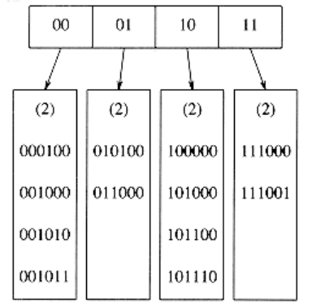
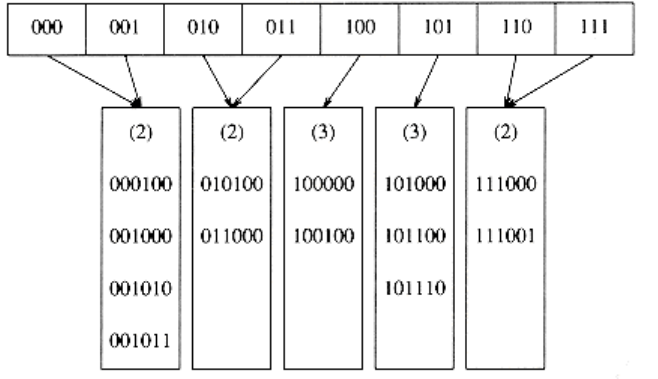

# Extendible Hashing

Our last topic in this chapter deals with the case where the amount of data is too large to fit in main memory. As we saw in Chapter 4, the main consideration then is the number of disk accesses required to retrieve data.

As before, we assume that at any point we have n records to store; the value of n changes over time. Furthermore, at most m records fit in one disk block. We will use m = 4 in this section.

If either open hashing or closed hashing is used, the major problem is that collisions could cause several blocks to be examined during a find, even for a well-distributed hash table. Furthermore, when the table gets too full, an extremely expensive rehashing step must be performed, which requires O(n) disk accesses.

A clever alternative, known as extendible hashing, allows a find to be performed in two disk accesses. Insertions also require few disk accesses.

We recall from Chapter 4 that a B-tree has depth O(logm/2 n). As m increases, the depth of a B-tree decreases. We could in theory choose m to be so large that the depth of the B-tree would be 1. Then any find after the first would take one disk access, since, presumably, the root node could be stored in main memory. The problem with this strategy is that the branching factor is so high that it would take considerable processing to determine which leaf the data was in. If the time to perform this step could be reduced, then we would have a practical scheme. This is exactly the strategy used by extendible hashing.

Let us suppose, for the moment, that our data consists of several six-bit integers. Figure 5.23 shows an extendible hashing scheme for this data. The root of the "tree" contains four pointers determined by the leading two bits of the data. Each leaf has up to m = 4 elements. It happens that in each leaf the first two bits are identical; this is indicated by the number in parentheses. To be more formal, D will represent the number of bits used by the root, which is sometimes known as the directory. The number of entries in the directory is thus 2D. dl is the number of leading bits that all the elements of some leaf l have in common. dl will depend on the particular leaf, and dl D.

**Figure 5.23 Extendible hashing: original data**

Suppose that we want to insert the key 100100. This would go into the third leaf, but as the third leaf is already full, there is no room. We thus split this leaf into two leaves, which are now determined by the first three bits. This requires increasing the directory size to 3. These changes are reflected in Figure 5.24.

Notice that all of the leaves not involved in the split are now pointed to by two adjacent directory entries. Thus, although an entire directory is rewritten, none of the other leaves are actually accessed.

If the key 000000 is now inserted, then the first leaf is split, generating two leaves with dl = 3. Since D = 3, the only change required in the directory is the updating of the 000 and 001 pointers. See Figure 5.25.

This very simple strategy provides quick access times for insert and find operations on large databases. There are a few important details we have not considered.

First, it is possible that several directory splits will be required if the elements in a leaf agree in more than D + 1 leading bits. For instance, starting at the original example, with D = 2, if 111010, 111011, and finally 111100 are inserted, the directory size must be increased to 4 to distinguish between the five keys. This is an easy detail to take care of, but must not be forgotten. Second, there is the possibility of duplicate keys; if there are more than m duplicates, then this algorithm does not work at all. In this case, some other arrangements need to be made.

These possibilities suggest that it is important for the bits to be fairly random. This can be accomplished by hashing the keys into a reasonably long integer; hence the reason for the name.

**Figure 5.24 Extendible hashing: after insertion of 100100 and directory split**

**Figure 5.25 Extendible hashing: after insertion of 000000 and leaf split**

We close by mentioning some of the performance properties of extendible hashing, which are derived after a very difficult analysis. These results are based on the reasonable assumption that the bit patterns are uniformly distributed.

The expected number of leaves is (n / m) log2 e. Thus the average leaf is ln 2 = 0.69 full. This is the same as B-trees, which is not entirely surprising, since for both data structures new nodes are created when the (m + 1)st entry is added.

The more surprising result is that the expected size of the directory (in other words, 2D) is O (n1+1 /m/ m). If m is very small, then the directory can get unduly large. In this case, we can have the leaves contain pointers to the records instead of the actual records, thus increasing the value of m. This adds a second disk access to each find operation in order to maintain a smaller directory. If the directory is too large to fit in main memory, the second disk access would be needed anyway.