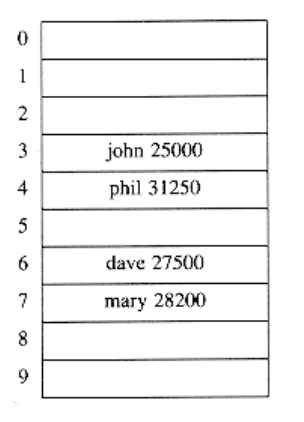

# General Idea

The ideal hash table data structure is merely an array of some fixed size, containing the keys. Typically, a key is a string with an associated value (for instance, salary information). We will refer to the table size as H_SIZE, with the understanding that this is part of a hash data structure and not merely some variable floating around globally. The common convention is to have the table run from 0 to H_SIZE-1; we will see why shortly.

Each key is mapped into some number in the range 0 to H_SIZE - 1 and placed in the appropriate cell. The mapping is called a hash function, which ideally should be simple to compute and should ensure that any two distinct keys get different cells. Since there are a finite number of cells and a virtually inexhaustible supply of keys, this is clearly impossible, and thus we seek a hash function that distributes the keys evenly among the cells. Figure 5.1 is typical of a perfect situation. In this example, john hashes to 3, phil hashes to 4, dave hashes to 6, and mary hashes to 7. 

**Figure 5.1 An ideal hash table**

This is the basic idea of hashing. The only remaining problems deal with choosing a function, deciding what to do when two keys hash to the same value (this is known as a collision), and deciding on the table size.