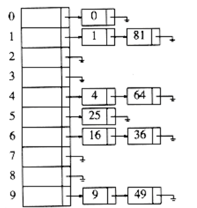
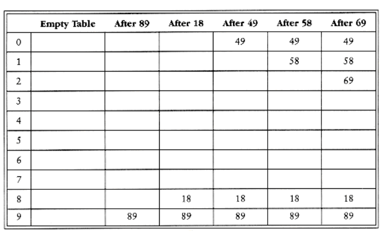

# Open Hashing (Separate Chaining)

The first strategy, commonly known as either open hashing, or separate chaining, is to keep a list of all elements that hash to the same value. For convenience, our lists have headers. This makes the list implementation the same as in Chapter 3. If space is tight, it might be preferable to avoid their use. We assume for this section that the keys are the first 10 perfect squares and that the hashing function is simply hash(x) = x mod 10. (The table size is not prime, but is used here for simplicity.) Figure 5.6 should make this clear.

To perform a find, we use the hash function to determine which list to traverse. We then traverse this list in the normal manner, returning the position where the
item is found. To perform an insert, we traverse down the appropriate list to check whether the element is already in place (if duplicates are expected, an extra field is usually kept, and this field would be incremented in the event of a match). If the element turns out to be new, it is inserted either at the front of the list or at the end of the list, whichever is easiest. This is an issue most easily addressed while the code is being written. Sometimes new elements are inserted at the front of the list, since it is convenient and also because frequently it happens that recently inserted elements are the most likely to be accessed in the near future.

Figure 5.6 An open hash table

The type declarations required to implement open hashing are in Figure 5.7. The first few lines are the same as the linked list declarations of Chapter 3. The hash table structure contains the actual size and an array of linked lists, which are dynamically allocated when the table is initialized. The HASH_TABLE type is just a pointer to this structure.
```c
typedef struct list_node *node_ptr;

struct list_node
{

element_type element;

node_ptr next;

};

typedef node_ptr LIST;

typedef node_ptr position;

/* LIST *the_list will be an array of lists, allocated later */

/* The lists will use headers, allocated later */

struct hash_tbl
{


unsigned int table_size;

LIST *the_lists;

};

typedef struct hash_tbl *HASH_TABLE;

Figure 5.7 Type declaration for open hash table

Notice that the the_lists field is actually a pointer to a pointer to a list_node structure. If

typedefs and abstraction are not used, this can be quite confusing.

HASH_TABLE

initialize_table(unsigned int table_size)
{

HASH_TABLE H;

int i;

/*1*/ if(table size < MIN_TABLE_SIZE){

/*2*/ error("Table size too small");

/*3*/ return NULL;

}

/* Allocate table */

/*4*/ H = (HASH_TABLE) malloc (sizeof (struct hash_tbl));

/*5*/ if(H == NULL)
/*6*/ fatal_error("Out of space!!!");

/*7*/ H->table_size = next_prime(table_size);

/* Allocate list pointers */

/*8*/ H->the_lists = (position *)

malloc(sizeof (LIST) * H->table_size);

/*9*/ if(H->the_lists == NULL)
/*10*/ fatal_error("Out of space!!!");

/* Allocate list headers */

/*11*/ for(i=0; i<H->table_size; i++)
{
/*12*/ H->the_lists[i] = (LIST) malloc

(sizeof (struct list_node));

/*13*/ if(H->the_lists[i] == NULL)
/*14*/ fatal_error("Out of space!!!");

else
/*15*/ H->the_lists[i]->next = NULL;

}

/*16*/ return H;

}
```
Figure 5.8 Initialization routine for open hash table

Figure 5.8 shows the initialization function, which uses the same ideas that were seen in the array implementation of stacks. Lines 4 through 6 allocate a hash table structure. If space is available, then H will point to a structure containing an integer and a pointer to a list. Line 7 sets the table size to a prime number, and lines 8 through 10 attempt to allocate an array of lists. Since a LIST is defined to be a pointer, the result is an array of pointers.

If our LIST implementation was not using headers, we could stop here. Since our implementation uses headers, we must allocate one header per list and set its next field to NULL. This is done in lines 11 through 15. Of course, lines 12 through 15 could be replaced with the statement
```c
H->the_lists[i] = make_null();
```
Although we have not used this option, because in this instance it is preferable to make the code as self-contained as possible, it is certainly worth considering. An inefficiency of our code is that the malloc on line 12 is performed H->table_size times. This can be avoided by replacing line 12 with one call to malloc before the loop occurs:
```c
H->the lists = (LIST*) malloc

(H->table_size * sizeof (struct list_node));
```
Line 16 returns H.

The call find(key, H) will return a pointer to the cell containing key. The code to implement this is shown in Figure 5.9. Notice that lines 2 through 5 are identical to the code to perform a find that is given in Chapter 3. Thus, the list ADT implementation in Chapter 3 could be used here. Remember that if element_type is a string, comparison and assignment must be done with strcmp and strcpy, respectively.

Next comes the insertion routine. If the item to be inserted is already present, then we do nothing; otherwise we place it at the front of the list (see Fig. 5.10).*

*Since the table in Figure 5.6 was created by inserting at the end of the list, the code in Figure 5.10 will produce a table with the lists in Figure 5.6 reversed.
```c
position

find(element_type key, HASH_TABLE H)
{

position p;

LIST L;

/*1*/ L = H->the_lists[ hash(key, H->table_size) ];

/*2*/ p = L->next;

/*3*/ while((p != NULL) && (p->element != key))

/* Probably need strcmp!! */

/*4*/ p = p->next;

/*5*/ return p;

}
```
Figure 5.9 Find routine for open hash table
```c
void insert(element_type key, HASH_TABLE H)
{

position pos, new_cell;

LIST L;

/*1*/ pos = find(key, H);

/*2*/ if(pos == NULL){

/*3*/ new_cell = (position) malloc(sizeof(struct list_node));

/*4*/ if(new_cell == NULL)
/*5*/ fatal_error("Out of space!!!");

else{

/*6*/ L = H->the_lists[ hash(key, H->table size) ];

/*7*/ new_cell->next = L->next;

/*8*/ new_cell->element = key; /* Probably need strcpy!! */

/*9*/ L->next = new_cell;

}}

}
```
Figure 5.10 Insert routine for open hash table

The element can be placed anywhere in the list; this is most convenient in our case. Notice that the code to insert at the front of the list is essentially identical to the code in Chapter 3 that implements a push using linked lists. Again, if the ADTs in Chapter 3 have already been carefully implemented, they can be used here.

The insertion routine coded in Figure 5.10 is somewhat poorly coded, because it computes the hash function twice. Redundant calculations are always bad, so this code should be rewritten if it turns out that the hash routines account for a significant portion of a program's running time.

The deletion routine is a straightforward implementation of deletion in a linked list, so we will not bother with it here. If the repertoire of hash routines does not include deletions, it is probably best to not use headers, since their use would provide no simplification and would waste considerable space. We leave this as an exercise, too.

Any scheme could be used besides linked lists to resolve the collisions-a binary search tree or even another hash table would work, but we expect that if the table is large and the hash function is good, all the lists should be short, so it is not worthwhile to try anything complicated.

We define the load factor, , of a hash table to be the ratio of the number of elements in the hash table to the table size. In the example above, = 1.0. The average length of a list is  The effort required to perform a search is the constant time required to evaluate the hash function plus the time to traverse the list.


Figure 5.11 Closed hash table with linear probing, after each insertion In an unsuccessful search, the number of links to traverse is (excluding the final NULL link) on average. A successful search requires that about 1 + (/2) links be traversed, since there is a guarantee that one link must be traversed (since the search is successful), and we also expect to go halfway down a list to find our match. This analysis shows that the table size is not really important, but the load factor is. The general rule for open hashing is to make the table size about as large as the number of elements expected (in other words, let 1). It is also a good idea, as mentioned before, to keep the table size prime to ensure a good distribution.