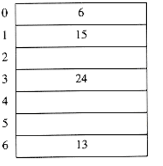
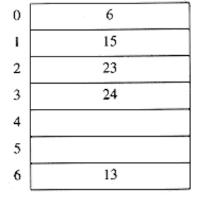
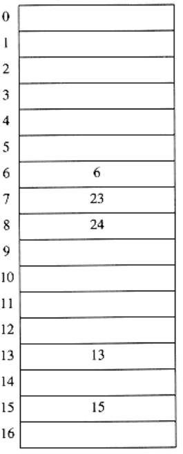

# Rehashing

If the table gets too full, the running time for the operations will start taking too long and inserts might fail for closed hashing with quadratic resolution. This can happen if there are too many deletions intermixed with insertions. A solution, then, is to build another table that is about twice as big (with associated new hash function) and scan down the entire original hash table, computing the new hash value for each (non-deleted) element and inserting it in the new table.

As an example, suppose the elements 13, 15, 24, and 6 are inserted into a closed hash table of size 7. The hash function is h(x) = x mod 7. Suppose linear probing is used to resolve collisions. The resulting hash table appears in

Figure 5.19.

If 23 is inserted into the table, the resulting table in Figure 5.20 will be over 70 percent full. Because the table is so full, a new table is created. The size of this table is 17, because this is the first prime which is twice as large as the old table size. The new hash function is then h(x) = x mod 17. The old table is scanned, and elements 6, 15, 23, 24, and 13 are inserted into the new table. The resulting table appears in Figure 5.21.

This entire operation is called rehashing. This is obviously a very expensive operation -- the running time is O(n), since there are n elements to rehash and the table size is roughly 2n, but it is actually not all that bad, because it happens very infrequently. In particular, there must have been n/2 inserts prior to the last rehash, so it essentially adds a constant cost to each insertion.* If this data structure is part of the program, the effect is not noticeable. On the other hand, if the hashing is performed as part of an interactive system, then the unfortunate user whose insertion caused a rehash could see a slowdown.

*This is why the new table is made twice as large as the old table.

 

**Figure 5.19 Closed hash table with linear probing with input 13,15, 6, 24**

**Figure 5.20 Closed hash table with linear probing after 23 is inserted**

**Figure 5.21 Closed hash table after rehashing**

Rehashing can be implemented in several ways with quadratic probing. One alternative is to rehash as soon as the table is half full. The other extreme is to rehash only when an insertion fails. A third, middle of the road, strategy is to rehash when the table reaches a certain load factor. Since performance does degrade as the load factor increases, the third strategy, implemented with a good cutoff, could be best.

Rehashing frees the programmer from worrying about the table size and is important because hash tables cannot be made arbitrarily large in complex programs. The exercises ask you to investigate the use of rehashing in conjunction with lazy deletion. Rehashing can be used in other data structures as well. For instance, if the queue data structure of Chapter 3 became full, we could declare a double-sized array and copy everything over, freeing the original.

Figure 5.22 shows that rehashing is simple to implement.
```c
HASH_TABLE

rehash(HASH_TABLE H)
{

unsigned int i, old_size;

cell *old_cells;

/*1*/ old_cells = H->the_cells;

/*2*/ old_size = H->table_size;

/* Get a new, empty table */

/*3*/ H = initialize_table(2*old_size);

/* Scan through old table, reinserting into new */

/*4*/ for(i=0; i<old_size; i++)

/*5*/ if(old_cells[i].info == legitimate)
/*6*/ insert(old_cells[i].element, H);

/*7*/ free(old_cells);

/*8*/ return H;

}
```
**Figure 5.22**