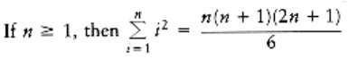
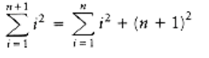
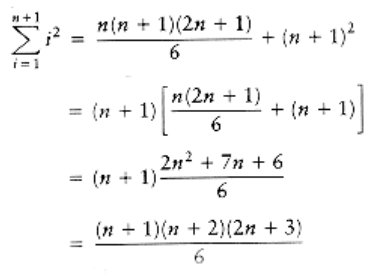
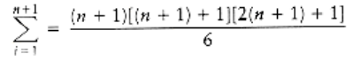
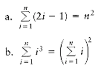

 

# Introduction

In this chapter, we discuss the aims and goals of this text and briefly review programming concepts and discrete mathematics. We will

- See that how a program performs for reasonably large input is just as important as its performance on moderate amounts of input.

- Review good programming style.

- Summarize the basic mathematical background needed for the rest of the book.

- Briefly review recursion.

## What's the Book About?

Suppose you have a group of n numbers and would like to determine the *k*th largest. This is known as the selection problem. Most students who have had a programming course or two would have no difficulty writing a program to solve this problem. There are quite a few "*obvious*" solutions.

One way to solve this problem would be to read the n numbers into an array, sort the array in decreasing order by some simple algorithm such as bubblesort, and then return the element in position *k*.

A somewhat better algorithm might be to read the first *k* elements into an array and sort them (in decreasing order). Next, each remaining element is read one by one. As a new element arrives, it is ignored if it is smaller than the *k*th element in the array. Otherwise, it is placed in its correct spot in the array, bumping one element out of the array. When the algorithm ends, the element in the *k*th position is returned as the answer.

Both algorithms are simple to code, and you are encouraged to do so. The natural questions, then, are which algorithm is better and, more importantly, is either algorithm good enough? A simulation using a random file of 1 million elements and *k* = 500,000 will show that neither algorithm finishes in a reasonable amount of time--each requires several days of computer processing to terminate (albeit eventually with a correct answer). An alternative method, discussed in Chapter 7, gives a solution in about a second. Thus, although our proposed algorithms work, they cannot be considered good algorithms, because they are entirely impractical for input sizes that a third algorithm can handle in a reasonable amount of time.

A second problem is to solve a popular word puzzle. The input consists of a two- dimensional array of letters and a list of words. The object is to find the words in the puzzle. These words may be horizontal, vertical, or diagonal in any direction. As an example, the puzzle shown in Figure 1.1 contains the words this, two, fat, and that. The word this begins at row 1, column 1 (1,1) and extends to (1, 4); two goes from (1, 1) to (3, 1); fat goes from (4, 1) to (2, 3); and that goes from (4, 4) to (1, 1).

Again, there are at least two straightforward algorithms that solve the problem. For each word in the word list, we check each ordered triple (row, column, orientation) for the presence of the word. This amounts to lots of nested for loops but is basically straightforward.

Alternatively, for each ordered quadruple (row, column, orientation, number of characters) that doesn't run off an end of the puzzle, we can test whether the word indicated is in the word list. Again, this amounts to lots of nested for loops. It is possible to save some time if the maximum number of characters in any word is known.

It is relatively easy to code up either solution and solve many of the real-life puzzles commonly published in magazines. These typically have 16 rows, 16 columns, and 40 or so words. Suppose, however, we consider the variation where only the puzzle board is given and the word list is essentially an English dictionary. Both of the solutions proposed require considerable time to solve this problem and therefore are not acceptable. However, it is possible, even with a large word list, to solve the problem in a matter of seconds.

An important concept is that, in many problems, writing a working program is not good enough. If the program is to be run on a large data set, then the running time becomes an issue. Throughout this book we will see how to estimate the running time of a program for large inputs and, more importantly, how to compare the running times of two programs without actually coding them. We will see techniques for drastically improving the speed of a program and for determining program bottlenecks. These techniques will enable us to find the section of the code on which to concentrate our optimization efforts.

\\( \begin{matrix}a & b \\c & d\end{matrix} \\)

<pre>

  1 2 3 4
---------
1 t h i s

2 w a t s

3 o a h g

4 f g d t

</pre>

**Figure 1.1 Sample word puzzle**

## Mathematics Review

This section lists some of the basic formulas you need to memorize or be able to derive and reviews basic proof techniques.
  
### Exponents

\\(x^a x^b = x^{a+b}\\)

\\(x^a\\)

-- = \\(x^a-b\\)

\\(x^b\\)

\\((x^a)^b = x^{ab}\\)

\\(x^n + x^n = 2x^n x^{2n}\\)

\\(2^n + 2^n = 2^{n+1}\\)

### Logarithms

In computer science, all logarithms are to base 2 unless specified otherwise.

**DEFINITION**: \\(x^a = b\\) if and only if \\(log_x b = a\\)

Several convenient equalities follow from this definition.

**THEOREM 1.1.**

\\(log_a b = \dfrac{log_c b}{log_c a}; c > 0\\)

PROOF:

Let \\(x = log_c b, y = log_c a, and z = log_a b.\\) Then, by the definition of logarithms, \\(c^x = b, c^y = a, \\) and \\(a^z = b.\\) Combining these three equalities yields \\((c^y)^z = c^x = b.\\) Therefore, x = yz, which implies z = x/y, proving the theorem.

**THEOREM 1.2.**
```
log ab = log a + log b
```
PROOF:

\\(Let x = log a, y = log b, z = log ab.\\) Then, assuming the default base of \\(2, 2^x= a, 2^y = b, 2^z = ab.\\) Combining the last three equalities yields \\(2^x2^y = 2^z = ab.\\) Therefore, \\(x + y = z,\\) which proves the theorem.

Some other useful formulas, which can all be derived in a similar manner, follow.

\\(log a/b = log a - log b\\)

\\(log(a^b) = b log a\\)

\\(log x < x for all x > 0\\)

\\(log 1 = 0, log 2 = 1, log 1,024 = 10, log 1,048,576 = 20\\)

### Series

The easiest formulas to remember are

\\(\displaystyle\sum_{i=0}^n 2i = 2^{n+1} - 1\\)

and the companion,

\\(\displaystyle\sum_{i=0}^n a^i = \dfrac{a^{n+1} - 1}{a - 1}\\)

In the latter formula, if 0 < a < 1, then

\\(\displaystyle\sum_{i=0}^n a^i \le \dfrac{1}{1 - a}\\)

and as n tends to , the sum approaches 1/(1 -a). These are the "geometric series" formulas.

We can derive the last formula for \\( \textstyle\sum_{i=0}^\infin a^i (0 < a < 1)\\)in the following manner. Let S be the sum. 

Then

\\(S = 1 + a + a^2 + a^3 + a^4 + a^5 + . . .\\)

Then

\\(aS = a + a^2 + a^3 + a^4 + a^5 + . . .\\)

If we subtract these two equations (which is permissible only for a convergent series), virtually all the terms on the right side cancel, leaving 

\\(S - aS = 1\\)

which implies that

\\(s = \dfrac{1}{1 - a}\\)

We can use this same techniq \\( \textstyle\sum_{i=0}^\infin i/2^i\\)a sum that occurs frequently. We write

\\(s = \dfrac{1}{2} + \dfrac{2}{2^2} + \dfrac{3}{2^3} + \dfrac{4}{2^4} + \dfrac{5}{2^5} + . . .\\)

and multiply by 2, obtaining

\\(2s = 1 + \dfrac{2}{2} + \dfrac{3}{2^2} + \dfrac{4}{2^3} + \dfrac{5}{2^4} + \dfrac{6}{2^5} + . . .\\)

Subtracting these two equations yields Thus, \\(S = 2\\).

Another type of common series in analysis is the arithmetic series. Any such series can be evaluated from the basic formula.

For instance, to find the sum \\(2 + 5 + 8 + . . . + (3k - 1),\\) rewrite it as \\(3(1 + 2 + 3 + . . . + k) - (1 + 1 + 1 + . . . + 1),\\) which is clearly \\(3k(k + 1)/2 - k.\\) Another way to remember this is to add the first and last terms (total \\(3k + 1)\\), the second and next to last terms (total \\(3k + 1)\\), and so on. Since there are \\(k/2\\) of these pairs, the total sum is \\(k(3k + 1)/2\\), which is the same answer as before.

The next two formulas pop up now and then but are fairly infrequent.

\\(\displaystyle\sum_{i=1}^N i^2 = \dfrac{N(N + 1)(2N + 1)}{6} = \dfrac{N^3}{3}\\)

\\(\displaystyle\sum_{i=1}^N i^k \approx \dfrac{N^{k+1}}{|k + 1|} k \ne -1\\)

When \\(k = -1,\\) the latter formula is not valid. We then need the following formula, which is used far more in computer science than in other mathematical disciplines. The numbers, \\(H_N\\), are known as the harmonic numbers, and the sum is known as a harmonic sum. The error in the following approximation tends to y 0.57721566, which is known as Euler's constant.

\\(H_N \displaystyle\sum_{i=1}^N \dfrac{1}{i} \approx log_e N\\)

These two formulas are just general algebraic manipulations.

\\(\displaystyle\sum_{i=1}^N f(N) = Nf(N)\\)

\\(\displaystyle\sum_{i=n_0}^N f(i) = \displaystyle\sum_{i=1}^N f(i) - \displaystyle\sum_{i=1}^{n_0 - 1} f(i)\\)

### Modular Arithmetic

We say that a is congruent to b modulo n, written \\( a b(mod n)\\), if n divides \\(a - b.\\)

Intuitively, this means that the remainder is the same when either a or b is divided by n. Thus, \\( 81 61 1(mod 10)\\). As with equality, if \\( a b (mod n)\\), then \\(a + c, b + c(mod n)\\) and \\(a d b d (mod n)\\).

There are a lot of theorems that apply to modular arithmetic, some of which require extraordinary proofs in number theory. We will use modular arithmetic sparingly, and the preceding theorems will suffice.

### The P Word

The two most common ways of proving statements in data structure analysis are proof by induction and proof by contradiction (and occasionally a proof by intimidation, by professors only). The best way of proving that a theorem is false is by exhibiting a counterexample.

**Proof by Induction**

A proof by induction has two standard parts. The first step is proving a base case, that is, establishing that a theorem is true for some small (usually degenerate) value(s); this step is almost always trivial. Next, an inductive hypothesis is assumed. Generally this means that the theorem is assumed to be true for all cases up to some limit k. Using this assumption, the theorem is then shown to be true for the next value, which is typically k + 1. This proves the theorem (as long as k is finite).

As an example, we prove that the Fibonacci numbers, \\(F_0 = 1, F_1 = 1, F_2 = 2, F_3 = 3, F_4 = 5, . . . , F_i = F_{i-1} + F_{i-2},\\) satisfy \\(F_i < (5/3)^i\\), for i 1. (Some definitions have \\(F_0 = 0\\), which shifts the series.) To do this, we first verify that the theorem is true for the trivial cases.

It is easy to verify that \\(F_1 = 1 < 5/3 and F_2 = 2 < 25/9;\\) this proves the basis. We assume that the theorem is true for \\(i = 1, 2, . . . , k;\\) this is the inductive hypothesis. To prove the theorem, we need to show that \\(F_{k+1} < (5/3)^{k+1}.\\) We have 

\\(F_k + 1= F_k + F_{k-1}\\) 

by the definition, and we can use the inductive hypothesis on the right-hand side, obtaining 

\\(F_{k+1} < (5/3)^k + (5/3)^{k-1}\\)

\\(< (3/5)(5/3)^{k+1} + (3/5)^2(5/3)^{k+1}\\) 

\\(< (3/5)(5/3)^{k+1} + (9/25)(5/3)^{k+1}\\)

which simplifies to

\\(F_k+1 < (3/5 + 9/25)(5/3)^{k+1} \\)

\\(< (24/25)(5/3)6{k+1} \\)

\\(< (5/3)^{k+1}\\)

proving the theorem.

As a second example, we establish the following theorem.

**THEOREM 1.3.**



PROOF:

The proof is by induction. For the basis, it is readily seen that the theorem is true when n = 1.

For the inductive hypothesis, assume that the theorem is true for 1 k n. We will establish that, under this assumption, the theorem is true for n + 1. We have



Applying the inductive hypothesis, we obtain



Thus,



proving the theorem.

**Proof by Counterexample**


The statement Fk k2 is false. The easiest way to prove this is to compute F11 = 144 > 11 2.

**Proof by Contradiction**

Proof by contradiction proceeds by assuming that the theorem is false and showing that this assumption implies that some known property is false, and hence the original assumption was erroneous. A classic example is the proof that there is an infinite number of primes. To prove this, we assume that the theorem is false, so that there is some largest prime pk. Let p1, p2, . . . , pk be all the primes in order and consider N = p1p2p3 . . . pk + 1 Clearly, N is larger than pk, so by assumption N is not prime. However, none of p1, p2, . . . , pk divide N exactly, because there will always be a remainder of 1. This is a contradiction, because every number is either prime or a product of primes. Hence, the original assumption, that pk is the largest prime, is false, which implies that the theorem is true.
```
int f(int x){
/*1*/ if (x = 0)
/*2*/ return 0;

else/*3*/ return(2*f(x-1) + x*x);

}
```
**Figure 1.2 A recursive function**

## A Brief Introduction to Recursion

Most mathematical functions that we are familiar with are described by a simple formula. For instance, we can convert temperatures from Fahrenheit to Celsius by applying the formula C = 5(F - 32)/9 Given this formula, it is trivial to write a C function; with declarations and braces removed, the one-line formula translates to one line of C.

Mathematical functions are sometimes defined in a less standard form. As an example, we can define a function f, valid on nonnegative integers, that satisfies f(0) = 0 and f(x) = 2f(x - 1) + x2. From this definition we see that f(1) = 1, f(2) = 6, f(3) = 21, and f(4) = 58. A function that is defined in terms of itself is called recursive. C allows functions to be recursive.* It is important to remember that what C provides is merely an attempt to follow the recursive spirit. Not all mathematically recursive functions are efficiently (or correctly) implemented by C's simulation of recursion. The idea is that the recursive function f ought to be expressible in only a few lines, just like a non-recursive function. Figure 1.2 shows the recursive implementation of f.

*Using recursion for numerical calculations is usually a bad idea. We have done so to illustrate the basic points.

Lines 1 and 2 handle what is known as the base case, that is, the value for which the function is directly known without resorting to recursion. Just as declaring f(x) = 2 f(x - 1) + x2 is meaningless, mathematically, without including the fact that f (0) = 0, the recursive C function doesn't make sense without a base case. Line 3 makes the recursive call.

There are several important and possibly confusing points about recursion. A common question is: Isn't this just circular logic? The answer is that although we are defining a function in terms of itself, we are not defining a particular instance of the function in terms of itself. In other words, evaluating f(5) by computing f(5) would be circular. Evaluating f(5) by computing f(4) is not circular--unless, of course f(4) is evaluated by eventually computing f(5). The two most important issues are probably the how and why questions. In Chapter 3, the how and why issues are formally resolved. We will give an incomplete description here.

It turns out that recursive calls are handled no differently from any others. If f is called with the value of 4, then line 3 requires the computation of 2 * f(3) + 4 * 4. Thus, a call is made to compute f(3). This requires the computation of 2 * f(2) + 3 * 3. Therefore, another call is made to compute f(2). This means that 2 * f(1) + 2 * 2 must be evaluated. To do so, f(1) is computed as 2 * f(0) + 1 * 1. Now, f(0) must be evaluated. Since this is a base case, we know a priority that f(0) = 0. This enables the completion of the calculation for f(1), which is now seen to be 1. Then f(2), f(3), and finally f(4) can be determined. All the bookkeeping needed to keep track of pending function calls (those started but waiting for a recursive call to complete), along with their variables, is done by the computer automatically. An important point, however, is that recursive calls will keep on being made until a base case is reached. For instance, an attempt to evaluate f(-1) will result in calls to f(-2), f(-3), and so on. Since this will never get to a base case, the program won't be able to compute the answer (which is undefined anyway). Occasionally, a much more subtle error is made, which is exhibited in Figure 1.3. The error in the program in Figure 1.3 is that bad(1) is defined, by line 3, to be bad(1). Obviously, this doesn't give any clue as to what bad(1) actually is. The computer will thus repeatedly make calls to bad(1) in an attempt to resolve its values. Eventually, its bookkeeping system will run out of space, and the program will crash. Generally, we would say that this function doesn't work for one special case but is correct otherwise. This isn't true here, since bad(2) calls bad(1). Thus, bad(2) cannot be evaluated either. Furthermore, bad(3), bad(4), and bad(5) all make calls to bad (2). Since bad(2) is unevaluable, none of these values are either. In fact, this program doesn't work for any value of n, except 0. With recursive programs, there is no such thing as a "special case."

These considerations lead to the first two fundamental rules of recursion:

1. Base cases. You must always have some base cases, which can be solved without recursion.

2. Making progress. For the cases that are to be solved recursively, the recursive call must always be to a case that makes progress toward a base case.

Throughout this book, we will use recursion to solve problems. As an example of a nonmathematical use, consider a large dictionary. Words in dictionaries are defined in terms of other words. When we look up a word, we might not always understand the definition, so we might have to look up words in the definition. Likewise, we might not understand some of those, so we might have to continue this search for a while. As the dictionary is finite, eventually either we will come to a point where we understand all of the words in some definition (and thus understand that definition and retrace our path through the other definitions), or we will find that the definitions are circular and we are stuck, or that some word we need to understand a definition is not in the dictionary.
```c
int bad(unsigned int n){

/*2*/ return 0;

else
/*3*/ return(bad (n/3 + 1) + n - 1);

}
```
**Figure 1.3 A nonterminating recursive program**

Our recursive strategy to understand words is as follows: If we know the meaning of a word, then we are done; otherwise, we look the word up in the dictionary. If we understand all the words in the definition, we are done; otherwise, we figure out what the definition means by recursively looking up the words we don't know. This procedure will terminate if the dictionary is well defined but can loop indefinitely if a word is either not defined or circularly defined.

**Printing Out Numbers**

Suppose we have a positive integer, n, that we wish to print out. Our routine will have the heading print_out(n). Assume that the only I/O routines available will take a single-digit number and output it to the terminal. We will call this routine print_digit; for example, print_digit(4) will output a 4 to the terminal.

Recursion provides a very clean solution to this problem. To print out 76234, we need to first print out 7623 and then print out 4. The second step is easily accomplished with the statement print_digit(n%10), but the first doesn't seem any simpler than the original problem. Indeed it is virtually the same problem, so we can solve it recursively with the statement print_out(n/10).

This tells us how to solve the general problem, but we still need to make sure that the program doesn't loop indefinitely. Since we haven't defined a base case yet, it is clear that we still have something to do. Our base case will be print_digit(n) if 0 n < 10. Now print_out(n) is defined for every positive number from 0 to 9, and larger numbers are defined in terms of a smaller positive number. Thus, there is no cycle. The entire procedure* is shown Figure 1.4.

*The term procedure refers to a function that returns void.

We have made no effort to do this efficiently. We could have avoided using the mod routine (which is very expensive) because n%10 = n - _n_/10 * 10.

**Recursion and Induction**

Let us prove (somewhat) rigorously that the recursive number-printing program works. To do so, we'll use a proof by induction.

**THEOREM 1.4**

The recursive number-printing algorithm is correct for n 0.

PROOF:

First, if n has one digit, then the program is trivially correct, since it merely makes a call to print_digit. Assume then that print_out works for all numbers of k or fewer digits. A number of k + 1 digits is expressed by its first k digits followed by its least significant digit. But the number formed by the first k digits is exactly _n_/10 , which, by the indicated hypothesis is correctly printed, and the last digit is n mod10, so the program prints out any (k + 1)-digit number correctly. Thus, by induction, all numbers are correctly printed.
```c
void print_out(unsigned int n) /* print nonnegative n */{
if(n<10)    print_digit(n);

else{
    print_out(n/10);
    print_digit(n%10);
}

}
```
**Figure 1.4 Recursive routine to print an integer**

This proof probably seems a little strange in that it is virtually identical to the algorithm description. It illustrates that in designing a recursive program, all smaller instances of the same problem (which are on the path to a base case) may be assumed to work correctly. The recursive program needs only to combine solutions to smaller problems, which are "magically" obtained by recursion, into a solution for the current problem. The mathematical justification for this is proof by induction. This gives the third rule of recursion:

3. Design rule. Assume that all the recursive calls work.

This rule is important because it means that when designing recursive programs, you generally don't need to know the details of the bookkeeping arrangements, and you don't have to try to trace through the myriad of recursive calls. Frequently, it is extremely difficult to track down the actual sequence of recursive calls. Of course, in many cases this is an indication of a good use of recursion, since the computer is being allowed to work out the complicated details.

The main problem with recursion is the hidden bookkeeping costs. Although these costs are almost always justifiable, because recursive programs not only simplify the algorithm design but also tend to give cleaner code, recursion should never be used as a substitute for a simple for loop. We'll discuss the overhead involved in recursion in more detail in Section 3.3.

When writing recursive routines, it is crucial to keep in mind the four basic rules of recursion:

1. Base cases. You must always have some base cases, which can be solved without recursion.

2. Making progress. For the cases that are to be solved recursively, the recursive call must always be to a case that makes progress toward a base case.

3. Design rule. Assume that all the recursive calls work.

4. Compound interest rule. Never duplicate work by solving the same instance of a problem in separate recursive calls.

The fourth rule, which will be justified (along with its nickname) in later sections, is the reason that it is generally a bad idea to use recursion to evaluate simple mathematical functions, such as the Fibonacci numbers. As long as you keep these rules in mind, recursive programming should be straightforward.

## Summary

This chapter sets the stage for the rest of the book. The time taken by an algorithm confronted with large amounts of input will be an important criterion for deciding if it is a good algorithm. (Of course, correctness is most important.) Speed is relative. What is fast for one problem on one machine might be slow for another problem or a different machine. We will begin to address these issues in the next chapter and will use the mathematics discussed here to establish a formal model.

## Exercises

1.1 Write a program to solve the selection problem. Let k = n/2. Draw a table showing the running

time of your program for various values of n.

1.2 Write a program to solve the word puzzle problem.

1.3 Write a procedure to output an arbitrary real number (which might be negative) using only

print_digit for I/O.

1.4 C allows statements of the form #include filename

which reads filename and inserts its contents in place of the include statement. Include statements may be nested; in other words, the file filename may itself contain an include statement, but, obviously, a file can't include itself in any chain. Write a program that reads in a file and outputs the file as modified by the include statements.

1.5 Prove the following formulas:

a. log x < x for all x > 0

b. log(ab) = b log a

1.6 Evaluate the following sums:

1.7 Estimate

*1.8 What is 2100 (mod 5)?

1.9 Let Fi be the Fibonacci numbers as defined in Section 1.2. Prove the following:

**c. Give a precise closed-form expression for Fn.

1.10 Prove the following formulas:



## References

There are many good textbooks covering the mathematics reviewed in this chapter. A small subset is [1], [2], [3], [11], [13], and [14]. Reference [11] is specifically geared toward the analysis

of algorithms. It is the first volume of a three-volume series that will be cited throughout this text. More advanced material is covered in [6].

Throughout this book we will assume a knowledge of C [10]. Occasionally, we add a feature where necessary for clarity. We also assume familiarity with pointers and recursion (the recursion summary in this chapter is meant to be a quick review). We will attempt to provide hints on their use where appropriate throughout the textbook. Readers not familiar with these should consult [4], [8], [12], or any good intermediate programming textbook.

General programming style is discussed in several books. Some of the classics are [5], [7], and [9].

1. M. O. Albertson and J. P. Hutchinson, Discrete Mathematics with Algorithms, John Wiley & Sons, New York, 1988.

2. Z. Bavel, Math Companion for Computer Science, Reston Publishing Company, Reston, Va., 1982.

3. R. A. Brualdi, Introductory Combinatorics, North-Holland, New York, 1977.

4. W. H. Burge, Recursive Programming Techniques, Addison-Wesley, Reading, Mass., 1975.

5. E. W. Dijkstra, A Discipline of Programming, Prentice Hall, Englewood Cliffs, N.J., 1976.

6. R. L. Graham, D. E. Knuth, and O. Patashnik, Concrete Mathematics, Addison-Wesley, Reading, Mass., 1989.

7. D. Gries, The Science of Programming, Springer-Verlag, New York, 1981.

8. P. Helman and R. Veroff, Walls and Mirrors: Intermediate Problem Solving and Data Structures, 2d ed., Benjamin Cummings Publishing, Menlo Park, Calif., 1988.

9. B. W. Kernighan and P. J. Plauger, The Elements of Programming Style, 2d ed., McGraw- Hill, New York, 1978.

10. B. W. Kernighan and D. M. Ritchie, The C Programming Language, 2d ed., Prentice Hall, Englewood Cliffs, N.J., 1988.

11. D. E. Knuth, The Art of Computer Programming, Vol. 1: Fundamental Algorithms, 2d ed., Addison-Wesley, Reading, Mass., 1973.

12. E. Roberts, Thinking Recursively, John Wiley & Sons, New York, 1986.

13. F. S. Roberts, Applied Combinatorics, Prentice Hall, Englewood Cliffs, N.J., 1984.

14. A. Tucker, Applied Combinatorics, 2d ed., John Wiley & Sons, New York, 1984.