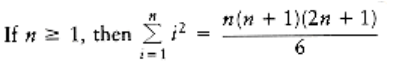
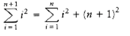
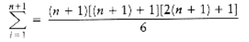

## Mathematics Review

This section lists some of the basic formulas you need to memorize or be able to derive and reviews basic proof techniques.
  
### Exponents

\\(x^a x^b = x^{a+b}\\)

\\(x^a\\)

-- = \\(x^a-b\\)

\\(x^b\\)

\\((x^a)^b = x^{ab}\\)

\\(x^n + x^n = 2x^n x^{2n}\\)

\\(2^n + 2^n = 2^{n+1}\\)

### Logarithms

In computer science, all logarithms are to base 2 unless specified otherwise.

**DEFINITION**: \\(x^a = b\\) if and only if \\(log_x b = a\\)

Several convenient equalities follow from this definition.

**THEOREM 1.1.**

\\(log_a b = \dfrac{log_c b}{log_c a}; c > 0\\)

PROOF:

Let \\(x = log_c b, y = log_c a, and z = log_a b.\\) Then, by the definition of logarithms, \\(c^x = b, c^y = a, \\) and \\(a^z = b.\\) Combining these three equalities yields \\((c^y)^z = c^x = b.\\) Therefore, x = yz, which implies z = x/y, proving the theorem.

**THEOREM 1.2.**
```
log ab = log a + log b
```
PROOF:

\\(Let x = log a, y = log b, z = log ab.\\) Then, assuming the default base of \\(2, 2^x= a, 2^y = b, 2^z = ab.\\) Combining the last three equalities yields \\(2^x2^y = 2^z = ab.\\) Therefore, \\(x + y = z,\\) which proves the theorem.

Some other useful formulas, which can all be derived in a similar manner, follow.

\\(log a/b = log a - log b\\)

\\(log(a^b) = b log a\\)

\\(log x < x for all x > 0\\)

\\(log 1 = 0, log 2 = 1, log 1,024 = 10, log 1,048,576 = 20\\)

### Series

The easiest formulas to remember are

\\(\displaystyle\sum_{i=0}^n 2i = 2^{n+1} - 1\\)

and the companion,

\\(\displaystyle\sum_{i=0}^n a^i = \dfrac{a^{n+1} - 1}{a - 1}\\)

In the latter formula, if 0 < a < 1, then

\\(\displaystyle\sum_{i=0}^n a^i \le \dfrac{1}{1 - a}\\)

and as n tends to , the sum approaches 1/(1 -a). These are the "geometric series" formulas.

We can derive the last formula for \\( \textstyle\sum_{i=0}^\infin a^i (0 < a < 1)\\)in the following manner. Let S be the sum. 

Then

\\(S = 1 + a + a^2 + a^3 + a^4 + a^5 + . . .\\)

Then

\\(aS = a + a^2 + a^3 + a^4 + a^5 + . . .\\)

If we subtract these two equations (which is permissible only for a convergent series), virtually all the terms on the right side cancel, leaving 

\\(S - aS = 1\\)

which implies that

\\(s = \dfrac{1}{1 - a}\\)

We can use this same techniq \\( \textstyle\sum_{i=0}^\infin i/2^i\\)a sum that occurs frequently. We write

\\(s = \dfrac{1}{2} + \dfrac{2}{2^2} + \dfrac{3}{2^3} + \dfrac{4}{2^4} + \dfrac{5}{2^5} + . . .\\)

and multiply by 2, obtaining

\\(2s = 1 + \dfrac{2}{2} + \dfrac{3}{2^2} + \dfrac{4}{2^3} + \dfrac{5}{2^4} + \dfrac{6}{2^5} + . . .\\)

Subtracting these two equations yields Thus, \\(S = 2\\).

Another type of common series in analysis is the arithmetic series. Any such series can be evaluated from the basic formula.

For instance, to find the sum \\(2 + 5 + 8 + . . . + (3k - 1),\\) rewrite it as \\(3(1 + 2 + 3 + . . . + k) - (1 + 1 + 1 + . . . + 1),\\) which is clearly \\(3k(k + 1)/2 - k.\\) Another way to remember this is to add the first and last terms (total \\(3k + 1)\\), the second and next to last terms (total \\(3k + 1)\\), and so on. Since there are \\(k/2\\) of these pairs, the total sum is \\(k(3k + 1)/2\\), which is the same answer as before.

The next two formulas pop up now and then but are fairly infrequent.

\\(\displaystyle\sum_{i=1}^N i^2 = \dfrac{N(N + 1)(2N + 1)}{6} = \dfrac{N^3}{3}\\)

\\(\displaystyle\sum_{i=1}^N i^k \approx \dfrac{N^{k+1}}{|k + 1|} k \ne -1\\)

When \\(k = -1,\\) the latter formula is not valid. We then need the following formula, which is used far more in computer science than in other mathematical disciplines. The numbers, \\(H_N\\), are known as the harmonic numbers, and the sum is known as a harmonic sum. The error in the following approximation tends to y 0.57721566, which is known as Euler's constant.

\\(H_N \displaystyle\sum_{i=1}^N \dfrac{1}{i} \approx log_e N\\)

These two formulas are just general algebraic manipulations.

\\(\displaystyle\sum_{i=1}^N f(N) = Nf(N)\\)

\\(\displaystyle\sum_{i=n_0}^N f(i) = \displaystyle\sum_{i=1}^N f(i) - \displaystyle\sum_{i=1}^{n_0 - 1} f(i)\\)

### Modular Arithmetic

We say that a is congruent to b modulo n, written \\( a b(mod n)\\), if n divides \\(a - b.\\)

Intuitively, this means that the remainder is the same when either a or b is divided by n. Thus, \\( 81 61 1(mod 10)\\). As with equality, if \\( a b (mod n)\\), then \\(a + c, b + c(mod n)\\) and \\(a d b d (mod n)\\).

There are a lot of theorems that apply to modular arithmetic, some of which require extraordinary proofs in number theory. We will use modular arithmetic sparingly, and the preceding theorems will suffice.

### The P Word

The two most common ways of proving statements in data structure analysis are proof by induction and proof by contradiction (and occasionally a proof by intimidation, by professors only). The best way of proving that a theorem is false is by exhibiting a counterexample.

**Proof by Induction**

A proof by induction has two standard parts. The first step is proving a base case, that is, establishing that a theorem is true for some small (usually degenerate) value(s); this step is almost always trivial. Next, an inductive hypothesis is assumed. Generally this means that the theorem is assumed to be true for all cases up to some limit k. Using this assumption, the theorem is then shown to be true for the next value, which is typically k + 1. This proves the theorem (as long as k is finite).

As an example, we prove that the Fibonacci numbers, \\(F_0 = 1, F_1 = 1, F_2 = 2, F_3 = 3, F_4 = 5, . . . , F_i = F_{i-1} + F_{i-2},\\) satisfy \\(F_i < (5/3)^i\\), for i 1. (Some definitions have \\(F_0 = 0\\), which shifts the series.) To do this, we first verify that the theorem is true for the trivial cases.

It is easy to verify that \\(F_1 = 1 < 5/3 and F_2 = 2 < 25/9;\\) this proves the basis. We assume that the theorem is true for \\(i = 1, 2, . . . , k;\\) this is the inductive hypothesis. To prove the theorem, we need to show that \\(F_{k+1} < (5/3)^{k+1}.\\) We have 

\\(F_k + 1= F_k + F_{k-1}\\) 

by the definition, and we can use the inductive hypothesis on the right-hand side, obtaining 

\\(F_{k+1} < (5/3)^k + (5/3)^{k-1}\\)

\\(< (3/5)(5/3)^{k+1} + (3/5)^2(5/3)^{k+1}\\) 

\\(< (3/5)(5/3)^{k+1} + (9/25)(5/3)^{k+1}\\)

which simplifies to

\\(F_k+1 < (3/5 + 9/25)(5/3)^{k+1} \\)

\\(< (24/25)(5/3)6{k+1} \\)

\\(< (5/3)^{k+1}\\)

proving the theorem.

As a second example, we establish the following theorem.

**THEOREM 1.3.**



PROOF:

The proof is by induction. For the basis, it is readily seen that the theorem is true when n = 1.

For the inductive hypothesis, assume that the theorem is true for 1 k n. We will establish that, under this assumption, the theorem is true for n + 1. We have



Applying the inductive hypothesis, we obtain


Thus,



proving the theorem.

**Proof by Counterexample**


The statement Fk k2 is false. The easiest way to prove this is to compute F11 = 144 > 11 2.

**Proof by Contradiction**

Proof by contradiction proceeds by assuming that the theorem is false and showing that this assumption implies that some known property is false, and hence the original assumption was erroneous. A classic example is the proof that there is an infinite number of primes. To prove this, we assume that the theorem is false, so that there is some largest prime pk. Let p1, p2, . . . , pk be all the primes in order and consider N = p1p2p3 . . . pk + 1 Clearly, N is larger than pk, so by assumption N is not prime. However, none of p1, p2, . . . , pk divide N exactly, because there will always be a remainder of 1. This is a contradiction, because every number is either prime or a product of primes. Hence, the original assumption, that pk is the largest prime, is false, which implies that the theorem is true.
```
int f(int x){
/*1*/ if (x = 0)
/*2*/ return 0;

else/*3*/ return(2*f(x-1) + x*x);

}
```
**Figure 1.2 A recursive function**
