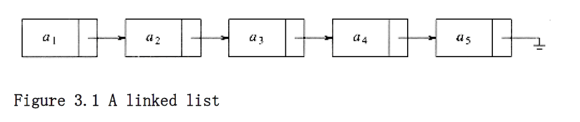
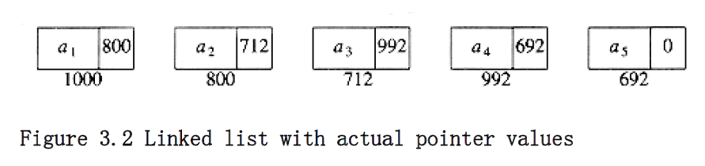
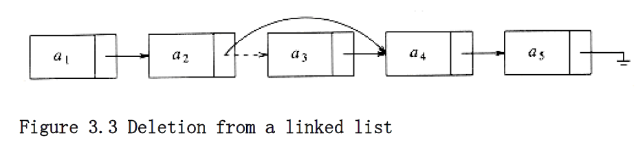
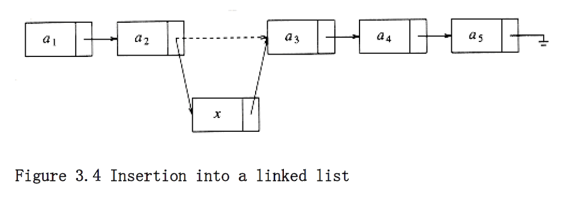
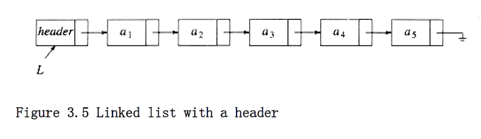
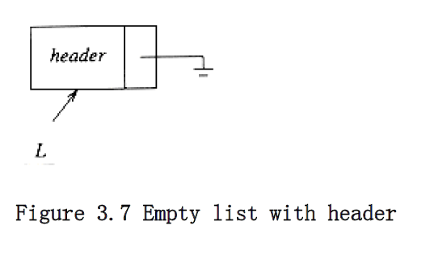
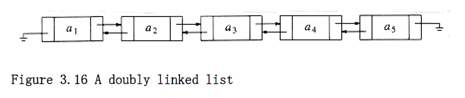
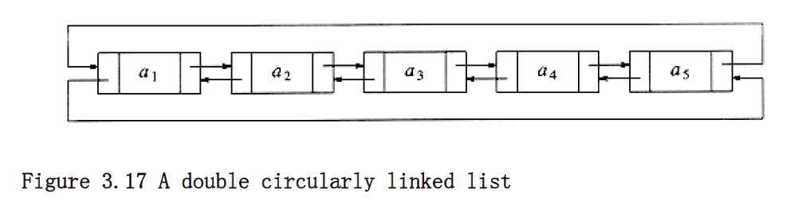
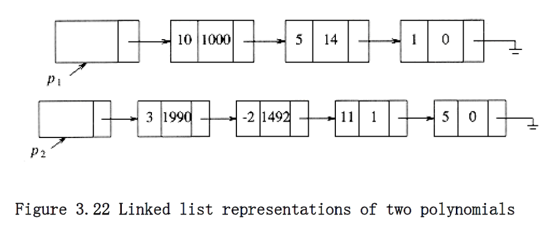
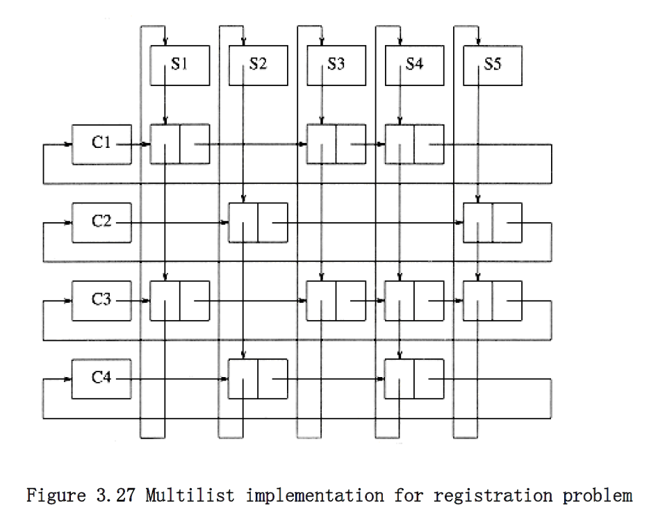

## The List ADT

We will deal with a general list of the form a1, a2, a3, . . . , an. We say that the size of this list is n. We will call the special list of size 0 a null list.

For any list except the null list, we say that a~i+l~ follows (or succeeds) a~i~ (i < n) and that a~i-1~ precedes ai (i > 1). The first element of the list is a1, and the last element is an. We will not define the predecessor of a1 or the successor of a~n~. The position of element ai in a list is i. Throughout this discussion, we will assume, to simplify matters, that the elements in the list are integers, but in general, arbitrarily complex elements are allowed.

Associated with these "==definitions==" is a set of operations that we would like to perform on the list ADT. Some popular operations are print_list and make_null, which do the obvious things; find, which returns the position of the first occurrence of a key; insert and delete, which generally insert and delete some key from some position in the list; and find_kth, which returns the element in some position (specified as an argument). If the list is 34, 12, 52, 16, 12, then find(52) might return 3; insert(x,3) might make the list into 34, 12, 52, x, 16, 12 (if we insert after the position given); and delete(3) might turn that list into 34, 12, x, 16, 12.

Of course, the interpretation of what is appropriate for a function is entirely up to the programmer, as is the handling of special cases (for example, what does find(1) return above?). We could also add operations such as next and previous, which would take a position as argument and return the position of the successor and predecessor, respectively.

### Simple Array Implementation of Lists

Obviously all of these instructions can be implemented just by using an array. Even if the array is dynamically allocated, an estimate of the maximum size of the list is required. Usually this requires a high over-estimate, which wastes considerable space. This could be a serious limitation, especially if there are many lists of unknown size.

An array implementation allows print_list and find to be carried out in linear time, which is as good as can be expected, and the find_kth operation takes constant time. However, insertion and deletion are expensive. For example, inserting at position 0 (which amounts to making a new first element) requires first pushing the entire array down one spot to make room, whereas deleting the first element requires shifting all the elements in the list up one, so the worst case of these operations is O(n). On average, half the list needs to be moved for either operation, so linear time is still required. Merely building a list by n successive inserts would require quadratic time.

Because the running time for insertions and deletions is so slow and the list size must be known in advance, simple arrays are generally not used to implement lists.

### Linked Lists

In order to avoid the linear cost of insertion and deletion, we need to ensure that the list is not stored contiguously, since otherwise entire parts of the list will need to be moved. Figure 3.1 shows the general idea of a linked list.

The linked list consists of a series of structures, which are not necessarily adjacent in memory. Each structure contains the element and a pointer to a structure containing its successor. We call this the next pointer. The last cell's next pointer points to ; this value is defined by C and cannot be confused with another pointer. ANSI C specifies that is zero.

Recall that a pointer variable is just a variable that contains the address where some other data is stored. Thus, if p is declared to be a pointer to a structure, then the value stored in p is interpreted as the location, in main memory, where a structure can be found. A field of that structure can be accessed by p

field_name, where field_name is the name of the field we wish to examine. **Figure** 3.2 shows the actual representation of the list in **Figure 3.1.** The list contains five structures, which happen to reside in memory locations 1000, 800, 712, 992, and 692 respectively. The next pointer in the first structure has the value 800, which provides the indication of where the second structure is. The other structures each have a pointer that serves a similar purpose. Of course, in order to access this list, we need to know where the first cell can be found. A pointer variable can be used for this purpose. It is important to remember that a pointer is just a number. For the rest of this chapter, we will draw pointers with arrows, because they are more illustrative.









To execute print_list(L) or find(L,key), we merely pass a pointer to the first element in the list and then traverse the list by following the next pointers. This operation is clearly linear-time, although the constant is likely to be larger than if an array implementation were used. The find_kth operation is no longer quite as efficient as an array implementation; find_kth(L,i) takes O(i) time and works by traversing down the list in the obvious manner. In practice, this bound is pessimistic, because frequently the calls to find_kth are in sorted order (by i). As an example, find_kth(L,2), find_kth(L,3), find_kth(L,4), find_kth(L,6) can all be executed in one scan down the list.

The delete command can be executed in one pointer change. Figure 3.3 shows the result of deleting the third element in the original list.

The insert command requires obtaining a new cell from the system by using an malloc call (more on this later) and then executing two pointer maneuvers. The general idea is shown in Figure 3.4. The dashed line represents the old pointer.

### Programming Details

The description above is actually enough to get everything working, but there are several places where you are likely to go wrong. First of all, there is no really obvious way to insert at the front of the list from the definitions given. Second, deleting from the front of the list is a special case, because it changes the start of the list; careless coding will lose the list. A third problem concerns deletion in general. Although the pointer moves above are simple, the deletion algorithm requires us to keep track of the cell before the one that we want to delete.



It turns out that one simple change solves all three problems. We will keep a sentinel node, which is sometimes referred to as a header or dummy node. This is a common practice, which we will see several times in the future. Our convention will be that the header is in position 0. Figure 3.5 shows a linked list with a header representing the list a~1~, a~2~, . . . , a~5~.

To avoid the problems associated with deletions, we need to write a routine find_previous, which will return the position of the predecessor of the cell we wish to delete. If we use a header, then if we wish to delete the first element in the list, find_previous will return the position of the header. The use of a header node is somewhat controversial. Some people argue that avoiding special cases is not sufficient justification for adding fictitious cells; they view the use of header nodes as little more than old-style hacking. Even so, we will use them here, precisely because they allow us to show the basic pointer manipulations without obscuring the code with special cases. Otherwise, whether or not a header should be used is a matter of personal preference.

As examples, we will write about half of the list ADT routines. First, we need our declarations, which are given in Figure 3.6.

The first function that we will write tests for an empty list. When we write code for any data structure that involves pointers, it is always best to draw a picture first. Figure 3.7 shows an empty list; from the figure it is easy to write the function in Figure 3.8.

The next function, which is shown in Figure 3.9, tests whether the current element, which by assumption exists, is the last of the list.

```c
typedef struct node *node_ptr;

struct node
{

element_type element;

node_ptr next;

};

typedef node_ptr LIST;

typedef node_ptr position;
```

**Figure 3.6 Type declarations for linked lists**



```c
int

is_empty(LIST L)
{

return(L->next == NULL);

}
```

**Figure 3.8 Function to test whether a linked list is empty**

```c
int

is_last(position p, LIST L)
{

return(p->next == NULL);

}
```

**Figure 3.9 Function to test whether current position is the last in a linked list**

The next routine we will write is find. Find, shown in Figure 3.10, returns the position in the list of some element. Line 2 takes advantage of the fact that the and (&&) operation is short-circuited: if the first half of the and is false, the result is automatically false and the second half is not executed.
```c
/* Return position of x in L; NULL if not found */

position

find (element_type x, LIST L)
{

position p;

/*1*/ p = L->next;

/*2*/ while((p != NULL) && (p->element != x))

/*3*/ p = p->next;

/*4*/ return p;

}
```
**Figure 3.10 Find routine**

Some programmers find it tempting to code the find routine recursively, possibly because it avoids the sloppy termination condition. We shall see later that this is a very bad idea and should be avoided at all costs.

Our fourth routine will delete some element x in list L. We need to decide what to do if x occurs more than once or not at all. Our routine deletes the first occurrence of x and does nothing if x is not in the list. To do this, we find p, which is the cell prior to the one containing x, via a call to find_previous. The code to implement this is shown in **Figure 3.11.** The find_previous routine is similar to find and is shown in **Figure 3.12.**

The last routine we will write is an insertion routine. We will pass an element to be inserted along with the list L and a position p. Our particular insertion routine will insert an element after the position implied by p. This decision is arbitrary and meant to show that there are no set rules for what insertion does. It is quite possible to insert the new element into position p (which means before the element currently in position p), but doing this requires knowledge of the element before position p. This could be obtained by a call to find_previous. It is thus important to comment what you are doing. This has been done in **Figure 3.13.**

Notice that we have passed the list to the insert and is_last routines, even though it was never used. We did this because another implementation might need this information, and so not passing the list would defeat the idea of using **ADTs.***

- This is legal, but some compilers will issue a warning.

```c
/* Delete from a list. Cell pointed */

/* to by p->next is wiped out. */

/* Assume that the position is legal. */

/* Assume use of a header node. */

void delete(element_type x, LIST L)
{

position p, tmp_cell;

p = find_previous(x, L);

if(p->next != NULL) /* Implicit assumption of header use */
{ /* x is found: delete it */


tmp_cell = p->next;

p->next = tmp_cell->next; /* bypass the cell to be deleted */

free(tmp_cell);

}

}
```

**Figure 3.11 Deletion routine for linked lists**

```c
/* Uses a header. If element is not found, then next field */

/* of returned value is NULL */

position

find_previous(element_type x, LIST L)
{

position p;

/*1*/ p = L;

/*2*/ while((p->next != NULL) && (p->next->element != x))

/*3*/ p = p->next;

/*4*/ return p;

}
```

**Figure 3.12 Find_previous--the find routine for use with delete**

```c
/* Insert (after legal position p).*/

/* Header implementation assumed. */

void insert(element_type x, LIST L, position p)
{

position tmp_cell;

/*1*/ tmp_cell = (position) malloc(sizeof (struct node));

/*2*/ if(tmp_cell == NULL)
/*3*/ fatal_error("Out of space!!!");

else{

/*4*/ tmp_cell->element = x;

/*5*/ tmp_cell->next = p->next;

/*6*/ p->next = tmp_cell;

}

}
```

**Figure 3.13 Insertion routine for linked lists**

With the exception of the find and find_previous routines, all of the operations we have coded take O(1) time. This is because in all cases only a fixed number of instructions are performed, no matter how large the list is. For the find and find_previous routines, the running time is O(n) in the worst case, because the entire list might need to be traversed if the element is either not found or is last in the list. On average, the running time is O(n), because on average, half the list must be traversed.

We could write additional routines to print a list and to perform the next function. These are fairly straightforward. We could also write a routine to implement previous. We leave these as exercises.

### Common Errors

The most common error that you will get is that your program will crash with a nasty error message from the system, such as "memory access violation" or "segmentation violation." This message usually means that a pointer variable contained a bogus address. One common reason is failure to initialize the variable. For instance, if line 1 in Figure 3.14 is omitted, then p is undefined and is not likely to be pointing at a valid part of memory. Another typical error would be line 6 in Figure 3.13. If p is , then the indirection is illegal. This function knows that p is not , so the routine is OK. Of course, you should comment this so that the routine that calls insert will insure this. Whenever you do an indirection, you must make sure that the pointer is not NULL. Some C compliers will implicity do this check for you, but this is not part of the C standard. When you port a program from one compiler to another, you may find that it no longer works. This is one of the common reasons why.

The second common mistake concerns when and when not to use malloc to get a new cell. You must remember that declaring a pointer to a structure does not create the structure but only gives enough space to hold the address where some structure might be. The only way to create a record that is not already declared is to use the malloc command. The command malloc(size_p) has the system create, magically, a new structure and return a pointer to it. If, on the other hand, you want to use a pointer variable to run down a list, there is no need to declare a new structure; in that case the malloc command is inappropriate. A type cast is used to make both sides of the assignment operator compatible. The C library provides other variations of malloc such as calloc.

```c
void delete_list(LIST L)
{

position p;

/*1*/ p = L->next; /* header assumed */

/*2*/ L->next = NULL;

/*3*/ while(p != NULL)
{

/*4*/ free(p);

/*5*/ p = p->next;

}

}
```

**Figure 3.14** Incorrect way to delete a list

When things are no longer needed, you can issue a free command to inform the system that it may reclaim the space. A consequence of the free(p) command is that the address that p is pointing to is unchanged, but the data that resides at that address is now undefined.

If you never delete from a linked list, the number of calls to malloc should equal the size of the list, plus 1 if a header is used. Any less, and you cannot possibly have a working program. Any more, and you are wasting space and probably time. Occasionally, if your program uses a lot of space, the system may be unable to satisfy your request for a new cell. In this case a pointer is returned.

After a deletion in a linked list, it is usually a good idea to free the cell, especially if there are lots of insertions and deletions intermingled and memory might become a problem. You need to keep a temporary variable set to the cell to be disposed of, because after the pointer moves are finished, you will not have a reference to it. As an example, the code in Figure 3.14 is not the correct way to delete an entire list (although it may work on some systems).

**Figure 3.15** shows the correct way to do this. Disposal is not necessarily a fast thing, so you might want to check to see if the disposal routine is causing any slow performance and comment it out if this is the case. This author has written a program (see the exercises) that was made 25 times faster by commenting out the disposal (of 10,000 nodes). It turned out that the cells were freed in a rather peculiar order and apparently caused an otherwise linear program to spend O(n log n) time to dispose of n cells.

One last warning: malloc(sizeof node_ptr) is legal, but it doesn't allocate enough space for a structure. It allocates space only for a pointer.

```c
void delete_list(LIST L)
{

position p, tmp;

/*1*/ p = L->next; /* header assumed */

/*2*/ L->next = NULL;

/*3*/ while(p != NULL)
{

/*4*/ tmp = p->next;

/*5*/ free(p);

/*6*/ p = tmp;

}

}
```

**Figure 3.15 Correct way to delete a list**



### Doubly Linked Lists

Sometimes it is convenient to traverse lists backwards. The standard implementation does not help here, but the solution is simple. Merely add an extra field to the data structure, containing a pointer to the previous cell. The cost of this is an extra link, which adds to the space requirement and also doubles the cost of insertions and deletions because there are more pointers to fix. On the other hand, it simplifies deletion, because you no longer have to refer to a key by using a pointer to the previous cell; this information is now at hand. Figure 3.16 shows a doubly linked list.

### Circularly Linked Lists

A popular convention is to have the last cell keep a pointer back to the first. This can be done with or without a header (if the header is present, the last cell points to it), and can also be done with doubly linked lists (the first cell's previous pointer points to the last cell). This clearly affects some of the tests, but the structure is popular in some applications. Figure 3.17 shows a double circularly linked list with no header.

### Examples

We provide three examples that use linked lists. The first is a simple way to represent single-variable polynomials. The second is a method to sort in linear time, for some special cases. Finally, we show a complicated example of how linked lists might be used to keep track of course registration at a university.

**The Polynomial ADT**

We can define an abstract data type for single-variable polynomials (with

nonnegative exponents) by using a list. Let . If most of the coefficients ai are nonzero, we can use a simple array to store the coefficients.

We could then write routines to perform addition, subtraction, multiplication, differentiation, and other operations on these polynomials. In this case, we might use the type declarations given in Figure 3.18. We could then write routines to perform various operations. Two possibilities are addition and multiplication. These are shown in Figures 3.19 to 3.21. Ignoring the time to initialize the output polynomials to zero, the running time of the multiplication routine is proportional to the product of the degree of the two input polynomials. This is adequate for dense polynomials, where most of the terms are

present, but if p~1~(x) = 10x^1000^ + 5x^14^ + 1 and p~2~(x) = 3x^1990^ - 2x^1492^ + 11x + 5,

then the running time is likely to be unacceptable. One can see that most of the time is spent multiplying zeros and stepping through what amounts to nonexistent parts of the input polynomials. This is always undesirable.



```c
typedef struct
{

int coeff_array[ MAX_DEGREE+1 ];

unsigned int high_power;

} *POLYNOMIAL;
```

**Figure 3.18 Type declarations for array implementation of the polynomial ADT**

An alternative is to use a singly linked list. Each term in the polynomial is contained in one cell, and the cells are sorted in decreasing order of exponents. For instance, the linked lists in Figure 3.22 represent p~1~(x) and p~2~(x). We could

then use the declarations in Figure 3.23.

```c
void zero_polynomial(POLYNOMIAL poly)
{

unsigned int i;

for(i=0; i<=MAX_DEGREE; i++)

poly->coeff_array[i] = 0;

poly->high_power = 0;

}
```

**Figure 3.19 Procedure to initialize a polynomial to zero**

```c
void add_polynomial(POLYNOMIAL poly1, POLYNOMIAL poly2,

POLYNOMIAL poly_sum)
{

int i;

zero_polynomial(poly_sum);

poly_sum->high_power = max(poly1->high_power,

poly2->high_power);

for(i=poly_sum->high_power; i>=0; i--)

poly_sum->coeff_array[i] = poly1->coeff_array[i]

+ poly2->coeff_array[i];

}
```

**Figure 3.20 Procedure to add two polynomials**

```c
void mult_polynomial(POLYNOMIAL poly1, POLYNOMIAL poly2,

POLYNOMIAL poly_prod)
{

unsigned int i, j;

zero_polynomial(poly_prod);

poly_prod->high_power = poly1->high_power

+ poly2->high_power;

if(poly_prod->high_power > MAX_DEGREE)
error("Exceeded array size");

else
for(i=0; i<=poly->high_power; i++)

for(j=0; j<=poly2->high_power; j++)

poly_prod->coeff_array[i+j] +=

poly1->coeff_array[i] * poly2->coeff_array[j];

}
```

**Figure 3.21 Procedure to multiply two polynomials**



```c
typedef struct node *node_ptr;

struct node
{

int coefficient;

int exponent;

node_ptr next;

} ;


typedef node_ptr POLYNOMIAL; /* keep nodes sorted by exponent */

```
**Figure 3.23 Type declaration for linked list implementation of the Polynomial ADT**

The operations would then be straightforward to implement. The only potential difficulty is that when two polynomials are multiplied, the resultant polynomial will have to have like terms combined. There are several ways to do this, but we will leave this as an exercise.

**Radix Sort**

A second example where linked lists are used is called radix sort. Radix sort is sometimes known as card sort, because it was used, until the advent of modern computers, to sort old-style punch cards.

If we have n integers in the range 1 to m (or 0 to m - 1) 9, we can use this information to obtain a fast sort known as bucket sort. We keep an array called count, of size m, which is initialized to zero. Thus, count has m cells (or buckets), which are initially empty. When ai is read, increment (by one) count [a~i~]. After all the input is read, scan the count array, printing out a representation of the sorted list. This algorithm takes O(m + n); the proof is left as an exercise. If m = (n), then bucket sort is O(n).

Radix sort is a generalization of this. The easiest way to see what happens is by example. Suppose we have 10 numbers, in the range 0 to 999, that we would like to

sort. In general, this is n numbers in the range 0 to n^p^ - 1 for some constant p. Obviously, we cannot use bucket sort; there would be too many buckets. The trick is to use several passes of bucket sort. The natural algorithm would be to bucket-sort by the most significant "digit" (digit is taken to base n), then next most significant, and so on. That algorithm does not work, but if we perform bucket sorts by least significant "digit" first, then the algorithm works. Of course, more than one number could fall into the same bucket, and, unlike the original bucket sort, these numbers could be different, so we keep them in a list. Notice that all the numbers could have some digit in common, so if a simple array were used for the lists, then each array would have to be of size n, for a total space requirement of (n^2^).

The following example shows the action of radix sort on 10 numbers. The input is 64, 8, 216, 512, 27, 729, 0, 1, 343, 125 (the first ten cubes arranged randomly). The first step bucket sorts by the least significant digit. In this case the math is in base 10 (to make things simple), but do not assume this in general. The buckets are as shown in Figure 3.24, so the list, sorted by least significant digit, is 0, 1, 512, 343, 64, 125, 216, 27, 8, 729. These are now sorted by the next least significant digit (the tens digit here) (see Fig. 3.25). Pass 2 gives output 0, 1, 8, 512, 216, 125, 27, 729, 343, 64. This list is now sorted with respect to the two least significant digits. The final pass, shown in Figure 3.26, bucket-sorts by most significant digit. The final list is 0, 1, 8, 27, 64, 125, 216, 343, 512, 729.

To see that the algorithm works, notice that the only possible failure would occur if two numbers came out of the same bucket in the wrong order. But the previous passes ensure that when several numbers enter a bucket, they enter in sorted order. The running time is O(p(n + b)) where p is the number of passes, n is the number of elements to sort, and b is the number of buckets. In our case, b = n.

0 1 512 343 64 125 216 27 8 729

-------------------------------------------
0 1 2 3 4 5 6 7 8 9

**Figure 3.24 Buckets after first step of radix sort**

8 729

1 216 27

0 512 125 343 64

--------------------------------------

0 1 2 3 4 5 6 7 8 9

**Figure 3.25 Buckets after the second pass of radix sort**

64

27

8

1

0 125 216 343 512 729

------------------------------------------

0 1 2 3 4 5 6 7 8 9

**Figure 3.26 Buckets after the last pass of radix sort**

As an example, we could sort all integers that are representable on a computer

(32 bits) by radix sort, if we did three passes over a bucket size of 2^11^. This algorithm would always be O(n) on this computer, but probably still not as efficient as some of the algorithms we shall see in Chapter 7, because of the high constant involved (remember that a factor of log n is not all that high, and this algorithm would have the overhead of maintaining linked lists).

**Multilists**

Our last example shows a more complicated use of linked lists. A university with 40,000 students and 2,500 courses needs to be able to generate two types of reports. The first report lists the class registration for each class, and the second report lists, by student, the classes that each student is registered for.

The obvious implementation might be to use a two-dimensional array. Such an array would have 100 million entries. The average student registers for about three courses, so only 120,000 of these entries, or roughly 0.1 percent, would actually have meaningful data.

What is needed is a list for each class, which contains the students in the class. We also need a list for each student, which contains the classes the student is registered for. Figure 3.27 shows our implementation.

As the figure shows, we have combined two lists into one. All lists use a header and are circular. To list all of the students in class C3, we start at C3 and traverse its list (by going right). The first cell belongs to student S1. Although there is no explicit information to this effect, this can be determined by following the student's linked list until the header is reached. Once this is done, we return to C3's list (we stored the position we were at in the course list before we traversed the student's list) and find another cell, which can be determined to belong to S3. We can continue and find that S4 and S5 are also in this class. In a similar manner, we can determine, for any student, all of the classes in which the student is registered.



Using a circular list saves space but does so at the expense of time. In the worst case, if the first student was registered for every course, then every entry would need to be examined in order to determine all the course names for that student. Because in this application there are relatively few courses per student and few students per course, this is not likely to happen. If it were suspected that this could cause a problem, then each of the (nonheader) cells could have pointers directly back to the student and class header. This would double the space requirement, but simplify and speed up the implementation.

### Cursor Implementation of Linked Lists

Many languages, such as BASIC and FORTRAN, do not support pointers. If linked lists are required and pointers are not available, then an alternate implementation must be used. The alternate method we will describe is known as a cursor implementation.

The two important items present in a pointer implementation of linked lists are

1. The data is stored in a collection of structures. Each structure contains the data and a pointer to the next structure.

2. A new structure can be obtained from the system's global memory by a call to malloc and released by a call to free.

Our cursor implementation must be able to simulate this. The logical way to satisfy condition 1 is to have a global array of structures. For any cell in the array, its array index can be used in place of an address. Figure 3.28 gives the type declarations for a cursor implementation of linked lists.

We must now simulate condition 2 by allowing the equivalent of malloc and free for cells in the CURSOR_SPACE array. To do this, we will keep a list (the freelist) of cells that are not in any list. The list will use cell 0 as a header. The initial configuration is shown in Figure 3.29.

A value of 0 for next is the equivalent of a pointer. The initialization of CURSOR_SPACE is a straightforward loop, which we leave as an exercise. To perform an malloc, the first element (after the header) is removed from the freelist.

```c
typedef unsigned int node_ptr;

struct node
{

element_type element;

node_ptr next;

};

typedef node_ptr LIST;

typedef node_ptr position;

struct node CURSOR_SPACE[ SPACE_SIZE ];
```

**Figure 3.28 Declarations for cursor implementation of linked lists**

Slot Element Next

----------------------

0 1

1 2

2 3

3 4

4 5

5 6

6 7

7 8

8 9

9 10

10 0

**Figure 3.29 An initialized CURSOR_SPACE**

To perform a free, we place the cell at the front of the freelist. Figure 3.30 shows the cursor implementation of malloc and free. Notice that if there is no space available, our routine does the correct thing by setting p = 0. This indicates that there are no more cells left, and also makes the second line of cursor_new a nonoperation (no-op).

Given this, the cursor implementation of linked lists is straightforward. For consistency, we will implement our lists with a header node. As an example, in Figure 3.31, if the value of L is 5 and the value of M is 3, then L represents the list a, b, e, and M represents the list c, d, f.

```c
position

cursor_alloc(void)
{

position p;

p = CURSOR_SPACE[O].next;

CURSOR_SPACE[0].next = CURSOR_SPACE[p].next;

return p;

}

void cursor_free(position p)
{

CURSOR_SPACE[p].next = CURSOR_SPACE[O].next;

CURSOR_SPACE[O].next = p;

}
```

**Figure 3.30 Routines: cursor-alloc and cursor-free**

Slot Element Next

----------------------
0 - 6

1 b 9

2 f 0

3 header 7

4 - 0

5 header 10

6 - 4

7 c 8

8 d 2

9 e 0

10 a 1

**Figure 3.31 Example of a cursor implementation of linked lists**

To write the functions for a cursor implementation of linked lists, we must pass and return the identical parameters as the pointer implementation. The routines are straightforward. Figure 3.32 implements a function to test whether a list is empty. Figure 3.33 implements the test of whether the current position is the last in a linked list.

The function find in Figure 3.34 returns the position of x in list L.

The code to implement deletion is shown in Figure 3.35. Again, the interface for the cursor implementation is identical to the pointer implementation. Finally, Figure 3.36 shows a cursor implementation of insert.

The rest of the routines are similarly coded. The crucial point is that these routines follow the ADT specification. They take specific arguments and perform specific operations. The implementation is transparent to the user. The cursor implementation could be used instead of the linked list implementation, with virtually no change required in the rest of the code.

```c
int

is_empty(LIST L) /* using a header node */
{

return(CURSOR_SPACE[L].next == 0

}
```

**Figure 3.32 Function to test whether a linked list is empty--cursor implementation**

```c
int

is_last(position p, LIST L) /* using a header node */
{

return(CURSOR_SPACE[p].next == 0

}
```

**Figure 3.33 Function to test whether p is last in a linked list--cursor implementation**

```c
position

find(element_type x, LIST L) /* using a header node */
{

position p;

/*1*/ p = CURSOR_SPACE[L].next;

/*2*/ while(p && CURSOR_SPACE[p].element != x)

/*3*/ p = CURSOR_SPACE[p].next;

/*4*/ return p;

}
```

**Figure 3.34 Find routine--cursor implementation**

```c
void delete(element_type x, LIST L)
{

position p, tmp_cell;

p = find_previous(x, L);

if(!is_last(p, L)){

tmp_cell = CURSOR_SPACE[p].next;

CURSOR_SPACE[p].next = CURSOR_SPACE[tmp_cell].next;

cursor_free(tmp_cell);

}

}
```

**Figure 3.35 Deletion routine for linked lists--cursor implementation**

```c
/* Insert (after legal position p); */

/* header implementation assumed */

void insert(element_type x, LIST L, position p)
{

position tmp_cell;

/*1*/ tmp_cell = cursor_alloc()

/*2*/ if(tmp_cell ==0)
/*3*/ fatal_error("Out of space!!!");

else{

/*4*/ CURSOR_SPACE[tmp_cell].element = x;

/*5*/ CURSOR_SPACE[tmp_cell].next = CURSOR_SPACE[p].next;

/*6*/ CURSOR_SPACE[p].next = tmp_cell;

}

}
```

**Figure 3.36 Insertion routine for linked lists--cursor implementation**

The freelist represents an interesting data structure in its own right. The cell that is removed from the freelist is the one that was most recently placed there by virtue of free. Thus, the last cell placed on the freelist is the first cell taken off. The data structure that also has this property is known as a stack, and is the topic of the next section.

