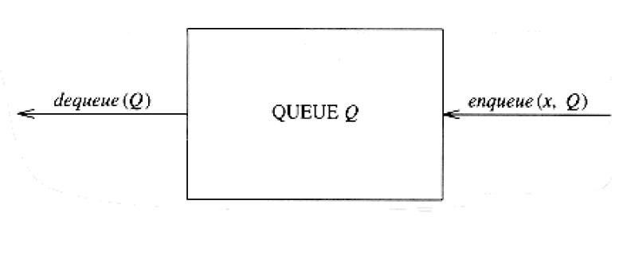
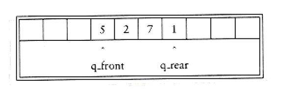
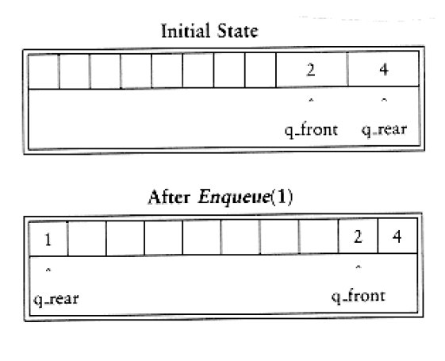
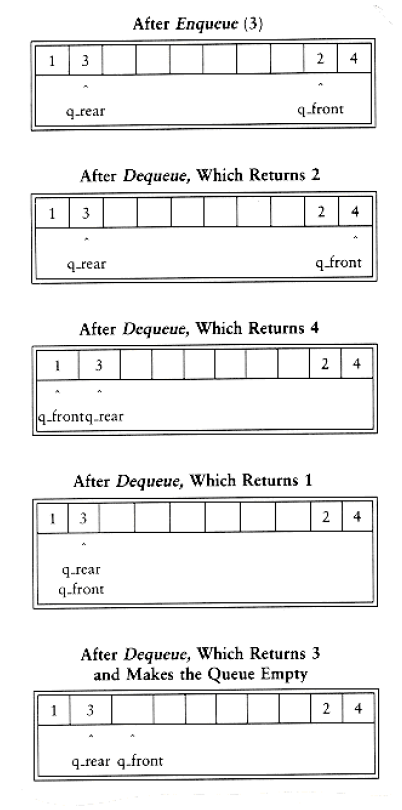

## The Queue ADT

Like stacks, queues are lists. With a queue, however, insertion is done at one end, whereas deletion is performed at the other end.

### Queue Model

The basic operations on a queue are enqueue, which inserts an element at the end of the list (called the rear), and dequeue, which deletes (and returns) the element at the start of the list (known as the front). Figure 3.56 shows the abstract model of a queue.

**Figure 3.56 Model of a queue**

### Array Implementation of Queues

As with stacks, any list implementation is legal for queues. Like stacks, both the linked list and array implementations give fast O(1) running times for every operation. The linked list implementation is straightforward and left as an exercise. We will now discuss an array implementation of queues.

For each queue data structure, we keep an array, QUEUE[], and the positions q_front and q_rear, which represent the ends of the queue. We also keep track of the number of elements that are actually in the queue, q_size. All this information is part of one structure, and as usual, except for the queue routines themselves, no routine should ever access these directly. The following figure shows a queue in some intermediate state. By the way, the cells that are blanks have undefined values in them. In particular, the first two cells have elements that used to be in the queue.

The operations should be clear. To enqueue an element x, we increment q_size and q_rear, then set QUEUE[q_rear] = x. To dequeue an element, we set the return value to QUEUE[q_front], decrement q_size, and then increment q_front. Other strategies are possible (this is discussed later). We will comment on checking for errors presently.

There is one potential problem with this implementation. After 10 enqueues, the queue appears to be full, since q_front is now 10, and the next enqueue would be in a nonexistent position. However, there might only be a few elements in the queue, because several elements may have already been dequeued. Queues, like stacks, frequently stay small even in the presence of a lot of operations.

The simple solution is that whenever q_front or q_rear gets to the end of the array, it is wrapped around to the beginning. The following figure shows the queue during some operations. This is known as a circular array implementation.


The extra code required to implement the wraparound is minimal (although it probably doubles the running time). If incrementing either q_rear or q_front causes it to go past the array, the value is reset to the first position in the array.

There are two warnings about the circular array implementation of queues. First, it is important to check the queue for emptiness, because a dequeue when the queue is empty will return an undefined value, silently.

Secondly, some programmers use different ways of representing the front and rear of a queue. For instance, some do not use an entry to keep track of the size, because they rely on the base case that when the queue is empty, q_rear = q_front - 1. The size is computed implicitly by comparing q_rear and q_front. This is a very tricky way to go, because there are some special cases, so be very careful if you need to modify code written this way. If the size is not part of the structure, then if the array size is A_SIZE, the queue is full when there are A_SIZE -1 elements, since only A_SIZE different sizes can be differentiated, and one of these is 0. Pick any style you like and make sure that all your routines are consistent. Since there are a few options for implementation, it is probably worth a comment or two in the code, if you don't use the size field.

In applications where you are sure that the number of enqueues is not larger than the size of the queue, obviously the wraparound is not necessary. As with stacks, dequeues are rarely performed unless the calling routines are certain that the queue is not empty. Thus error calls are frequently skipped for this operation, except in critical code. This is generally not justifiable, because the time savings that you are likely to achieve are too minimal.

We finish this section by writing some of the queue routines. We leave the others as an exercise to the reader. First, we give the type definitions in Figure 3.57. We add a maximum size field, as was done for the array implementation of the stack; queue_create and queue_dispose routines also need to be provided. We also provide routines to test whether a queue is empty and to make an empty queue (Figs. 3.58 and 3.59). The reader can write the function is_full, which performs the test implied by its name. Notice that q_rear is preinitialized to 1 before q_front. The final operation we will write is the enqueue routine. Following the exact description above, we arrive at the implementation in Figure 3.60.

### Applications of Queues

There are several algorithms that use queues to give efficient running times. Several of these are found in graph theory, and we will discuss them later in

Chapter 9. For now, we will give some simple examples of queue usage.

```c
struct queue_record
{

unsigned int q_max_size; /* Maximum # of elements */

/* until Q is full */

unsigned int q_front;

unsigned int q_rear;

unsigned int q_size; /* Current # of elements in Q */

element_type *q_array;

};

typedef struct queue_record * QUEUE;

Figure 3.57 Type declarations for queue--array implementation

int

is_empty(QUEUE Q)
{

return(Q->q_size == 0);

}
```

**Figure 3.58 Routine to test whether a queue is empty-array implementation**

```c
void make_null (QUEUE Q)
{

Q->q_size = 0;

Q->q_front = 1;

Q->q_rear = 0;

}
```

**Figure 3.59 Routine to make an empty queue-array implementation**

```c
unsigned int

succ(unsigned int value, QUEUE Q)
{

if(++value == Q->q_max_size)
value = 0;

return value;

}

void enqueue(element_type x, QUEUE Q)
{

if(is_full(Q))
error("Full queue");

else{

Q->q_size++;

Q->q_rear = succ(Q->q_rear, Q);

Q->q_array[ Q->q_rear ] = x;

}

}
```

**Figure 3.60 Routines to enqueue-array implementation**

When jobs are submitted to a printer, they are arranged in order of arrival. Thus, essentially, jobs sent to a line printer are placed on a queue.

We say essentially a queue, because jobs can be killed. This amounts to a deletion from the middle of the queue, which is a violation of the strict definition.

Virtually every real-life line is (supposed to be) a queue. For instance, lines at ticket counters are queues, because service is first-come first-served.

Another example concerns computer networks. There are many network setups of personal computers in which the disk is attached to one machine, known as the file server. Users on other machines are given access to files on a first-come first-served basis, so the data structure is a queue.

Further examples include the following:

Calls to large companies are generally placed on a queue when all operators are busy.

In large universities, where resources are limited, students must sign a waiting list if all terminals are occupied. The student who has been at a terminal the longest is forced off first, and the student who has been waiting the longest is the next user to be allowed on.

A whole branch of mathematics, known as queueing theory, deals with computing, probabilistically, how long users expect to wait on a line, how long the line gets, and other such questions. The answer depends on how frequently users arrive to the line and how long it takes to process a user once the user is served. Both of these parameters are given as probability distribution functions. In simple cases, an answer can be computed analytically. An example of an easy case would be a phone line with one operator. If the operator is busy, callers are placed on a waiting line (up to some maximum limit). This problem is important for businesses, because studies have shown that people are quick to hang up the phone.

If there are k operators, then this problem is much more difficult to solve. Problems that are difficult to solve analytically are often solved by a simulation. In our case, we would need to use a queue to perform the simulation. If k is large, we also need other data structures to do this efficiently. We shall see how to do this simulation in Chapter 6. We could then run the simulation for several values of k and choose the minimum k that gives a reasonable waiting time.

Additional uses for queues abound, and as with stacks, it is staggering that such a simple data structure can be so important.

## Summary

This chapter describes the concept of ADTs and illustrates the concept with three of the most common abstract data types. The primary objective is to separate the implementation of the abstract data types from their function. The program must know what the operations do, but it is actually better off not knowing how it is done.

Lists, stacks, and queues are perhaps the three fundamental data structures in all of computer science, and their use is documented through a host of examples. In particular, we saw how stacks are used to keep track of procedure and function calls and how recursion is actually implemented. This is important to understand, not just because it makes procedural languages possible, but because knowing how recursion is implemented removes a good deal of the mystery that surrounds its use. Although recursion is very powerful, it is not an entirely free operation; misuse and abuse of recursion can result in programs crashing.

## Exercises

3.1 Write a program to print out the elements of a singly linked list.

3.2 You are given a linked list, L, and another linked list, P, containing integers, sorted in ascending order. The operation print_lots(L,P) will print the elements in L that are in positions specified by P. For instance, if P = 1, 3, 4, 6, the first, third, fourth, and sixth elements in L are printed. Write the routine print_lots(L,P). You should use only the basic list operations. What is the running time of your routine?

3.3 Swap two adjacent elements by adjusting only the pointers (and not the data) using

a. singly linked lists,

b. doubly linked lists.

3.4 Given two sorted lists, L1 and L2, write a procedure to compute L1 L2 using only the basic list operations.

3.5 Given two sorted lists, L1 and L2, write a procedure to compute L1 L2 using only the basic list operations.

3.6 Write a function to add two polynomials. Do not destroy the input. Use a linked list implementation. If the polynomials have m and n terms respectively, what is the time complexity of your program?

3.7 Write a function to multiply two polynomials, using a linked list implementation. You must make sure that the output polynomial is sorted by exponent and has at most one term of any power.

a. Give an algorithm to solve this problem in O(m2n2) time.

*b. Write a program to perform the multiplication in O(m2n) time, where m is the number of terms in the polynomial of fewer terms.

*c. Write a program to perform the multiplication in O(mn log(mn)) time.

d. Which time bound above is the best?

3.8 Write a program that takes a polynomial, (x), and computes ((x))p. What is the complexity of your program? Propose at least one alternative solution that could be competitive for some plausible choices of (x) and p.

3.9 Write an arbitrary-precision integer arithmetic package. You should use a strategy similar to polynomial arithmetic. Compute the distribution of the digits 0 to 9 in 24000.

3.10 The Josephus problem is the following mass suicide "game": n people, numbered 1 to n, are sitting in a circle. Starting at person 1, a handgun is passed. After m passes, the person holding the gun commits suicide, the body is removed, the circle closes ranks, and the game continues with the person who was sitting after the corpse picking up the gun. The last survivor is tried for n - 1 counts of manslaughter. Thus, if m = 0 and n = 5, players are killed in order and player 5 stands trial. If m = 1 and n = 5, the order of death is 2, 4, 1, 5.

a. Write a program to solve the Josephus problem for general values of m and n. Try to make your program as efficient as possible. Make sure you dispose of cells.

b. What is the running time of your program?

c. If m = 1, what is the running time of your program? How is the actual speed affected by the free routine for large values of n (n > 10000)?

3.11 Write a program to find a particular element in a singly linked list. Do this both recursively and nonrecursively, and compare the running times. How big does the list have to be

before the recursive version crashes?

3.12 a. Write a nonrecursive procedure to reverse a singly linked list in O(n) time.

*b. Write a procedure to reverse a singly linked list in O(n) time using constant extra space.

3.13 You have to sort an array of student records by social security number. Write a program to do this, using radix sort with 1000 buckets and three passes.

3.14 Write a program to read a graph into adjacency lists using

a. linked lists

b. cursors

3.15 a. Write an array implementation of self-adjusting lists. A self-adjusting list is like a regular list, except that all insertions are performed at the front, and when an element is accessed by a find, it is moved to the front of the list without changing the relative order of the other items.

b. Write a linked list implementation of self-adjusting lists.

*c. Suppose each element has a fixed probability, pi, of being accessed. Show that the elements

with highest access probability are expected to be close to the front.

3.16 Suppose we have an array-based list a[0..n -1] and we want to delete all duplicates. last_position is initially n - 1, but gets smaller as elements are deleted. Consider the pseudocode program fragment in Figure 3.61. The procedure DELETE deletes the element in position j and collapses the list.

a. Explain how this procedure works.

b. Rewrite this procedure using general list operations.

```c
/*1*/ for(i=0; i<last_position; i++)
{

/*2*/ j = i + 1;

/*3*/ while(j<last_position)

/*4*/ if(a[i] == a[j]

/*5*/ DELETE(j);

else
/*6*/ j++;

}
```

**Figure 3.61 Routine to remove duplicates from a lists--array implementation**

*c. Using a standard array implementation, what is the running time of this procedure?

d. What is the running time using a linked list implementation?

*e. Give an algorithm to solve this problem in O(n log n) time.

**f. Prove that any algorithm to solve this problem requires (n log n) comparisons if only comparisons are used. Hint: Look to

*g. Prove that if we allow operations besides comparisons, and the keys are real numbers, then we can solve the problem without using comparisons between elements.

3.17 An alternative to the deletion strategy we have given is to use lazy deletion. To delete an element, we merely mark it deleted (using an extra bit field). The number of deleted and nondeleted elements in the list is kept as part of the data structure. If there are as many deleted elements as nondeleted elements, we traverse the entire list, performing the standard deletion algorithm on all marked nodes.

a. List the advantages and disadvantages of lazy deletion.

b. Write routines to implement the standard linked list operations using lazy deletion.

3.18 Write a program to check for balancing symbols in the following languages:

a. Pascal (begin/end, (), [ ], { }).

b. C (/* */, (), [ ], { }).

*c. Explain how to print out an error message that is likely to reflect the probable cause.

3.19 Write a program to evaluate a postfix expression.

3.20 a. Write a program to convert an infix expression which includes '(', ')', '+', '-', '*' and '/' to postfix.

b. Add the exponentiation operator to your repertoire.

c. Write a program to convert a postfix expression to infix.

3.21 Write routines to implement two stacks using only one array. Your stack routines should not declare an overflow unless every slot in the array is used.

3.22 *a. Propose a data structure that supports the stack push and pop operations and a third operation find_min, which returns the smallest element in the data structure, all in O(1) worst case time.

*b. Prove that if we add the fourth operation delete_min which finds and removes the smallest

element, then at least one of the operations must take (logn) time. (This requires reading

Chapter 7.)

3.23 *Show how to implement three stacks in one array.

3.24 If the recursive routine in Section 2.4 used to compute Fibonacci numbers is run for n = 50, is stack space likely to run out? Why or why not?

3.25 Write the routines to implement queues using

a. linked lists

b. arrays

3.26 A deque is a data structure consisting of a list of items, on which the following operations are possible:

push(x,d): Insert item x on the front end of deque d.

pop(d): Remove the front item from deque d and return it.

inject(x,d): Insert item x on the rear end of deque d.

eject(d): Remove the rear item from deque d and return it.

Write routines to support the deque that take O(1) time per operation.

Go to Chapter 4 Return to Table of Contents
