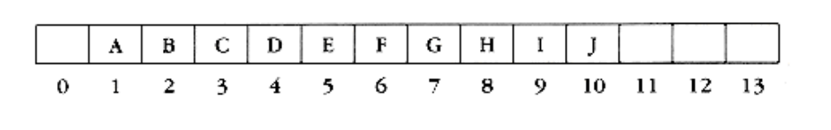
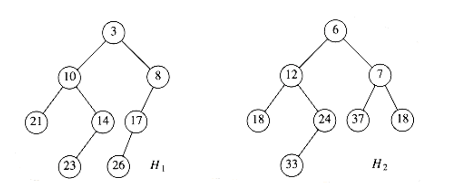
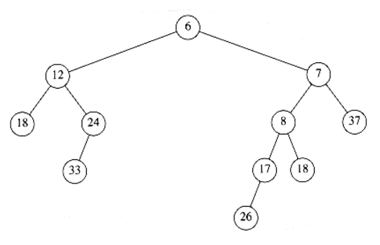

# Priority Queues (heaps)

Although jobs sent to a line printer are generally placed on a queue, this might not always be the best thing to do. For instance, one job might be particularly important, so that it might be desirable to allow that job to be run as soon as the printer is available. Conversely, if, when the printer becomes available, there are several one-page jobs and one hundred-page job, it might be reasonable to make the long job go last, even if it is not the last job submitted. (Unfortunately, most systems do not do this, which can be particularly annoying at times.)

Similarly, in a multiuser environment, the operating system scheduler must decide which of several processes to run. Generally a process is only allowed to run for a fixed period of time. One algorithm uses a queue. Jobs are initially placed at the end of the queue. The scheduler will repeatedly take the first job on the queue, run it until either it finishes or its time limit is up, and place it at the end of the queue if it does not finish. This strategy is generally not appropriate, because very short jobs will seem to take a long time because of the wait involved to run. Generally, it is important that short jobs finish as fast as possible, so these jobs should have preference over jobs that have already been running. Furthermore, some jobs that are not short are still very important and should also have preference.

This particular application seems to require a special kind of queue, known as a priority queue. In this chapter, we will discuss

- Efficient implementation of the priority queue ADT.

- Uses of priority queues.

- Advanced implementations of priority queues.

The data structures we will see are among the most elegant in computer science.

## Model

A priority queue is a data structure that allows at least the following two operations: insert, which does the obvious thing, and delete_min, which finds, returns and removes the minimum element in the heap. The insert operation is the equivalent of enqueue, and delete_min is the priority queue equivalent of the queue's dequeue operation. The delete_min function also alters its input. Current thinking in the software engineering community suggests that this is no longer a good idea. However, we will continue to use this function because of historical reasons--many programmers expect delete_min to operate this way.


**Figure 6.1 Basic model of a priority queue**

As with most data structures, it is sometimes possible to add other operations, but these are extensions and not part of the basic model depicted in Figure 6.1.

Priority queues have many applications besides operating systems. In Chapter 7, we will see how priority queues are used for external sorting. Priority queues are also important in the implementation of greedy algorithms, which operate by repeatedly finding a minimum; we will see specific examples in Chapters 9 and 10. In this chapter we will see a use of priority queues in discrete event simulation.

## Simple Implementations

There are several obvious ways to implement a priority queue. We could use a simple linked list, performing insertions at the front in O(1) and traversing the list, which requires O(n) time, to delete the minimum. Alternatively, we could insist that the list be always kept sorted; this makes insertions expensive (O (n)) and delete_mins cheap (O(1)). The former is probably the better idea of the two, based on the fact that there are never more delete_mins than insertions.

Another way of implementing priority queues would be to use a binary search tree. This gives an O(log n) average running time for both operations. This is true in spite of the fact that although the insertions are random, the deletions are not. Recall that the only element we ever delete is the minimum. Repeatedly removing a node that is in the left subtree would seem to hurt the balance of the tree by making the right subtree heavy. However, the right subtree is random. In the worst case, where the delete_mins have depleted the left subtree, the right subtree would have at most twice as many elements as it should. This adds only a small constant to its expected depth. Notice that the bound can be made into a worst-case bound by using a balanced tree; this protects one against bad insertion sequences.

Using a search tree could be overkill because it supports a host of operations that are not required. The basic data structure we will use will not require pointers and will support both operations in O(log n) worst-case time. Insertion will actually take constant time on average, and our implementation will allow building a heap of n items in linear time, if no deletions intervene. We will then discuss how to implement heaps to support efficient merging. This additional operation seems to complicate matters a bit and apparently requires the use of pointers.

## Binary Heap

The implementation we will use is known as a binary heap. Its use is so common for priority queue implementations that when the word heap is used without a qualifier, it is generally assumed to be referring to this implementation of the data structure. In this section, we will refer to binary heaps as merely heaps. Like binary search trees, heaps have two properties, namely, a structure property and a heap order property. As with AVL trees, an operation on a heap can destroy one of the properties, so a heap operation must not terminate until all heap properties are in order. This turns out to be simple to do.

### Structure Property

A heap is a binary tree that is completely filled, with the possible exception of the bottom level, which is filled from left to right. Such a tree is known as a complete binary tree. Figure 6.2 shows an example.

It is easy to show that a complete binary tree of height h has between 2^h^ and 2^h+1^ - 1 nodes. This implies that the height of a complete binary tree is log~n~ , which is clearly 0(log n).

An important observation is that because a complete binary tree is so regular, it can be represented in an array and no pointers are necessary. The array in Figure 6.3 corresponds to the heap in Figure 6.2.


**Figure 6.2 A complete binary tree**


**Figure 6.3 Array implementation of complete binary tree**

For any element in array position i, the left child is in position 2i, the right child is in the cell after the left child (2i + 1), and the parent is in position _i_/2 . Thus not only are pointers not required, but the operations required to traverse the tree are extremely simple and likely to be very fast on most computers. The only problem with this implementation is that an estimate of the maximum heap size is required in advance, but typically this is not a problem. In the figure above, the limit on the heap size is 13 elements. The array has a position 0; more on this later.

A heap data structure will, then, consist of an array (of whatever type the key is) and integers representing the maximum 2nd current heap size. Figure 6.4 shows a typical priority queue declaration. Notice the similarity to the stack declaration in Figure 3.47. Figure 6.4a creates an empty heap. Line 11 will be explained later.

Throughout this chapter, we shall draw the heaps as trees, with the implication that an actual implementation will use simple arrays.

### Heap Order Property

The property that allows operations to be performed quickly is the heap order property. Since we want to be able to find the minimum quickly, it makes sense that the smallest element should be at the root. If we consider that any subtree should also be a heap, then any node should be smaller than all of its descendants.

Applying this logic, we arrive at the heap order property. In a heap, for every node X, the key in the parent of X is smaller than (or equal to) the key in X, with the obvious exception of the root (which has no parent). In Figure 6.5 the tree on the left is a heap, but the tree on the right is not (the dashed line shows the violation of heap order). As usual, we will assume that the keys are integers, although they could be arbitrarily complex.

Analogously, we can declare a (max) heap, which enables us to efficiently find and remove the maximum element, by changing the heap order property. Thus, a priority queue can be used to find either a minimum or a maximum, but this needs to be decided ahead of time. By the heap order property, the minimum element can always be found at the root. Thus, we get the extra operation, find_min, in constant time.

```c
struct heap_struct
 {

/* Maximum # that can fit in the heap */

unsigned int max_heap_size;

/* Current # of elements in the heap */

unsigned int size;

element_type *elements;

};

typedef struct heap_struct *PRIORITY_QUEUE;
```

**Figure 6.4 Declaration for priority queue**

```c
PRIORITY_QUEUE

create_pq(unsigned int max_elements)
{

PRIORITY_QUEUE H;

if(max_elements < MIN_PQ_SIZE)
error("Priority queue size is too small");

H = (PRIORITY_QUEUE) malloc (sizeof (struct heap_struct));

if(H == NULL)
fatal_error("Out of space!!!");

/*Allocate the array + one extra for sentinel */

H->elements = (element_type *) malloc

((max_elements+1) * sizeof (element_type));

if(H->elements == NULL)
fatal_error("Out of space!!!");

H->max_heap_size = max_elements;

H->size = 0;

H->elements[0] = MIN_DATA;

return H;

}
```

**Figure 6.4a**


**Figure 6.5 Two complete trees (only the left tree is a heap)**

### Basic Heap Operations

It is easy (both conceptually and practically) to perform the two required operations. All the work involves ensuring that the heap order property is maintained.

#### Insert

To insert an element x into the heap, we create a hole in the next available location, since otherwise the tree will not be complete. If x can be placed in the hole without violating heap order, then we do so and are done. Otherwise we slide the element that is in the hole's parent node into the hole, thus bubbling the hole up toward the root. We continue this process until x can be placed in the hole. Figure 6.6 shows that to insert 14, we create a hole in the next available heap location. Inserting 14 in the hole would violate the heap order property, so 31 is slid down into the hole. This strategy is continued in Figure 6.7 until the correct location for 14 is found.

This general strategy is known as a percolate up; the new element is percolated up the heap until the correct location is found. Insertion is easily implemented with the code shown in Figure 6.8.

We could have implemented the percolation in the insert routine by performing repeated swaps until the correct order was established, but a swap requires three assignment statements. If an element is percolated up d levels, the number of assignments performed by the swaps would be 3d. Our method uses d + 1 assignments.


**Figure 6.6 Attempt to insert 14: creating the hole, and bubbling the hole up**


**Figure 6.7 The remaining two steps to insert 14 in previous heap**

```c
/* H->element[0] is a sentinel */

void insert(elementtype x, PRIORITY_QUEUE H){

unsigned int i;

if(is_full(H))error("Priority queue is full");

else{

i = ++H->size;

while(H->elements[i/2] > x){

H->elements[i] = H->elements[i/2];

 i /= 2;

}

H->elements[i] = x;

}

}
```

**Figure 6.8 Procedure to insert into a binary heap**

If the element to be inserted is the new minimum, it will be pushed all the way to the top. At some point, i will be 1 and we will want to break out of the while loop. We could do this with an explicit test, but we have chosen to put a very small value in position 0 in order to make the while loop terminate. This value must be guaranteed to be smaller than (or equal to) any element in the heap; it is known as a sentinel. This idea is similar to the use of header nodes in linked lists. By adding a dummy piece of information, we avoid a test that is executed once per loop iteration, thus saving some time.

The time to do the insertion could be as much as O (log n), if the element to be inserted is the new minimum and is percolated all the way to the root. On average, the percolation terminates early; it has been shown that 2.607 comparisons are required on average to perform an insert, so the average insert moves an element up 1.607 levels.

#### Delete_min

Delete_mins are handled in a similar manner as insertions. Finding the minimum is easy; the hard part is removing it. When the minimum is removed, a hole is created at the root. Since the heap now becomes one smaller, it follows that the last element x in the heap must move somewhere in the heap. If x can be placed in the hole, then we are done. This is unlikely, so we slide the smaller of the hole's children into the hole, thus pushing the hole down one level. We repeat this step until x can be placed in the hole. Thus, our action is to place x in its correct spot along a path from the root containing minimum children.

In Figure 6.9 the left figure shows a heap prior to the delete_min. After 13 is removed, we must now try to place 31 in the heap. 31 cannot be placed in the hole, because this would violate heap order. Thus, we place the smaller child (14) in the hole, sliding the hole down one level (see Fig. 6.10). We repeat this again, placing 19 into the hole and creating a new hole one level deeper. We then place 26 in the hole and create a new hole on the bottom level. Finally, we are able to place 31 in the hole (Fig. 6.11). This general strategy is known as a percolate down. We use the same technique as in the insert routine to avoid the use of swaps in this routine.


**Figure 6.9 Creation of the hole at the root**


**Figure 6.10 Next two steps in delete_min**


**Figure 6.11 Last two steps in delete_min**

A frequent implementation error in heaps occurs when there are an even number of elements in the heap, and the one node that has only one child is encountered. You must make sure not to assume that there are always two children, so this usually involves an extra test. In the code, depicted in Figure 6.12, we've done this test at line 8. One extremely tricky solution is always to ensure that your algorithm thinks every node has two children. Do this by placing a sentinel, of value higher than any in the heap, at the spot after the heap ends, at the start of each percolate down when the heap size is even. You should think very carefully before attempting this, and you must put in a prominent comment if you do use this technique.

```c
element_type

delete_min(PRIORITY_QUEUE H)
{

unsigned int i, child;

element_type min_element, last_element;

if(is_empty(H)){

error("Priority queue is empty");

return H->elements[0];

}

min_element = H->elements[1];

last_element = H->elements[H->size--];

for(i=1; i*2 <= H->size; i=child)
{

/* find smaller child */

child = i*2;

if((child != H->size) &&

(H->elements[child+1] < H->elements [child]))

child++;

* percolate one level *

if(last_element > H->elements[child])
H->elements[i] = H->elements[child];

else
break;

}

H->elements[i] = last_element;

return min_element;

}
```
**Figure 6.12 Function to perform delete_min in a binary heap**

Although this eliminates the need to test for the presence of a right child, you cannot eliminate the requirement that you test when you reach the bottom because this would require a sentinel for every leaf.

The worst-case running time for this operation is O(log n). On average, the element that is placed at the root is percolated almost to the bottom of the heap (which is the level it came from), so the average running time is O (log n).

### Other Heap Operations

Notice that although finding the minimum can be performed in constant time, a heap designed to find the minimum element (also known as a (min) heap) is of no help whatsoever in finding the maximum element. In fact, a heap has very little ordering information, so there is no way to find any particular key without a linear scan through the entire heap. To see this, consider the large heap structure (the elements are not shown) in Figure 6.13, where we see that the only information known about the maximum element is that it is at one of the leaves. Half the elements, though, are contained in leaves, so this is practically useless information. For this reason, if it is important to know where elements are, some other data structure, such as a hash table, must be used in addition to the heap. (Recall that the model does not allow looking inside the heap.)

If we assume that the position of every element is known by some other method, then several other operations become cheap. The three operations below all run in logarithmic worst-case time.

**Decrease_key**

The decrease_key(x, , H) operation lowers the value of the key at position x by a positive amount . Since this might violate the heap order, it must be fixed by a percolate up. This operation could be useful to system administrators: they can make their programs run with highest priority


**Figure 6.13 A very large complete binary tree**

#### Increase_key

The increase_key(x, , H) operation increases the value of the key at position x by a positive amount . This is done with a percolate down. Many schedulers automatically drop the priority of a process that is consuming excessive CPU time.

#### Delete

The delete(x, H) operation removes the node at position x from the heap. This is done by first performing decrease_key(x, , H) and then performing delete_min (H). When a process is terminated by a user (instead of finishing normally), it must be removed from the priority queue.

#### Build_heap

The build_heap(H) operation takes as input n keys and places them into an empty heap. Obviously, this can be done with n successive inserts. Since each insert will take O(1) average and O(log n) worst-case time, the total running time of this algorithm would be O(n) average but O(n log n) worst-case. Since this is a special instruction and there are no other operations intervening, and we already know that the instruction can be performed in linear average time, it is reasonable to expect that with reasonable care a linear time bound can be guaranteed.

The general algorithm is to place the n keys into the tree in any order, maintaining the structure property. Then, if percolate_down(i) percolates down from node i, perform the algorithm in Figure 6.14 to create a heap-ordered tree.

The first tree in Figure 6.15 is the unordered tree. The seven remaining trees in Figures 6.15 through 6.18 show the result of each of the seven percolate downs. Each dashed line corresponds to two comparisons: one to find the smaller child and one to compare the smaller child with the node. Notice that there are only 10 dashed lines in the entire algorithm (there could have been an 11th -- where?) corresponding to 20 comparisons.

```c
for(i=n/2; i>0; i--)

percolate_down(i);
```

**Figure 6.14 Sketch of build_heap**


**Figure 6.15 Left: initial heap; right: after percolate_down(7)**


**Figure 6.16 Left: after percolate_down(6); right: after percolate_down(5)**


**Figure 6.17 Left: after percolate_down(4); right: after percolate_down(3)**


**Figure 6.18 Left: after percolate_down(2); right: after percolate_down(1)**

To bound the running time of build_heap, we must bound the number of dashed lines. This can be done by computing the sum of the heights of all the nodes in the heap, which is the maximum number of dashed lines. What we would like to show is that this sum is O(n).

**THEOREM 6.1.**

For the perfect binary tree of height h containing 2h+1 - 1 nodes, the sum of the

heights of the nodes is 2h+1 - 1 - (h + 1).

PROOF:

It is easy to see that this tree consists of 1 node at height h, 2 nodes at

height h - 1, 22 nodes at height h - 2, and in general 2i nodes at height h - i. The sum of the heights of all the nodes is then


= h +2(h - 1) + 4(h - 2) + 8(h - 3) + 16(h - 4) +. . .+ 2h-1(1)

**(6.1)**

Multiplying by 2 gives the equation

2S = 2h + 4(h - 1) + 8(h - 2) + 16(h - 3) + . . . + 2h(1)

**(6.2)**

We subtract these two equations and obtain Equation (6.3). We find that certain terms almost cancel. For instance, we have 2h - 2(h - 1) = 2, 4(h - 1) - 4(h - 2)

= 4, and so on. The last term in Equation (6.2), 2h, does not appear in Equation (6.1); thus, it appears in Equation (6.3). The first term in Equation (6.1), h, does not appear in equation (6.2); thus, -h appears in Equation (6.3).

We obtain S = - h + 2 + 4 + 8 + . . . + 2h-1 + 2h = (2h+1 - 1) - (h + 1)

**(6.3)**

which proves the theorem.

A complete tree is not a perfect binary tree, but the result we have obtained is an upper bound on the the sum of the heights of the nodes in a complete tree.

Since a complete tree has between 2h and 2h+1 nodes, this theorem implies that this sum is O(n), where n is the number of nodes.

Although the result we have obtained is sufficient to show that build_heap is linear, the bound on the sum of the heights is not as strong as possible. For a complete tree with n = 2h nodes, the bound we have obtained is roughly 2n. The sum of the heights can be shown by induction to be n - b(n), where b(n) is the number of 1s in the binary representation of n.

## Applications of Priority Queues

We have already mentioned how priority queues are used in operating systems design. In Chapter 9, we will see how priority queues are used to implement several graph algorithms efficiently. Here we will show how to use priority queues to obtain solutions to two problems.

### The Selection Problem

The first problem we will examine is the selection problem from Chapter 1. Recall that the input is a list of n elements, which can be totally ordered, and an integer k. The selection problem is to find the kth largest element.

Two algorithms were given in Chapter 1, but neither is very efficient. The first algorithm, which we shall call Algorithm 1A, is to read the elements into an array and sort them, returning the appropriate element. Assuming a simple sorting algorithm, the running time is O(n2). The alternative algorithm, 1B, is to read k elements into an array and sort them. The smallest of these is in the kth position. We process the remaining elements one by one. As an element arrives, it is compared with kth element in the array. If it is larger, then the kth element is removed, and the new element is placed in the correct place among the remaining k - 1 elements. When the algorithm ends, the element in the kth position is the answer. The running time is O(n k) (why?). If k = n/2, then both algorithms are O(n2). Notice that for any k, we can solve the symmetric problem of finding the (n - k + 1)th smallest element, so k = n/2 is really the hardest case for these algorithms. This also happens to be the most interesting case, since this value of k is known as the median.

We give two algorithms here, both of which run in O(n log n) in the extreme case of k = n/2 , which is a distinct improvement.

#### Algorithm 6A

For simplicity, we assume that we are interested in finding the kth smallest element. The algorithm is simple. We read the n elements into an array. We then apply the build_heap algorithm to this array. Finally, we'll perform k delete_min operations. The last element extracted from the heap is our answer. It should be clear that by changing the heap order property, we could solve the original problem of finding the kth largest element.

The correctness of the algorithm should be clear. The worst-case timing is O(n) to construct the heap, if build_heap is used, and O(log n) for each delete_min. Since there are k delete_mins, we obtain a total running time of O(n + k log n). If k = O(n/log n), then the running time is dominated by the build_heap operation and is O(n). For larger values of k, the running time is O(k log n). If k = n/2 , then the running time is (n log n).

Notice that if we run this program for k = n and record the values as they leave the heap, we will have essentially sorted the input file in O(n log n) time. In Chapter 7, we will refine this idea to obtain a fast sorting algorithm known as heapsort.

#### Algorithm 6B

For the second algorithm, we return to the original problem and find the kth largest element. We use the idea from Algorithm 1B. At any point in time we will maintain a set S of the k largest elements. After the first k elements are read, when a new element is read, it is compared with the kth largest element, which we denote by Sk. Notice that Sk is the smallest element in S. If the new element is larger, then it replaces Sk in S. S will then have a new smallest element, which may or may not be the newly added element. At the end of the input, we find the smallest element in S and return it as the answer.

This is essentially the same algorithm described in Chapter 1. Here, however, we will use a heap to implement S. The first k elements are placed into the heap in total time O(k) with a call to build_heap. The time to process each of the remaining elements is O(1), to test if the element goes into S, plus O(log k), to delete Sk and insert the new element if this is necessary. Thus, the total time is O(k + (n - k) log k) = O (n log k) . This algorithm also gives a bound of (n log n) for finding the median.

In Chapter 7, we will see how to solve this problem in O(n) average time. In Chapter 10, we will see an elegant, albeit impractical, algorithm to solve this problem in O(n) worst-case time.

### Event Simulation

In Section 3.4.3, we described an important queuing problem. Recall that we have a system, such as a bank, where customers arrive and wait on a line until one of k tellers is available. Customer arrival is governed by a probability distribution function, as is the service time (the amount of time to be served once a teller is available). We are interested in statistics such as how long on average a customer has to wait or how long the line might be.

With certain probability distributions and values of k, these answers can be computed exactly. However, as k gets larger, the analysis becomes considerably more difficult, so it is appealing to use a computer to simulate the operation of the bank. In this way, the bank officers can determine how many tellers are needed to ensure reasonably smooth service.

A simulation consists of processing events. The two events here are (a) a customer arriving and (b) a customer departing, thus freeing up a teller.

We can use the probability functions to generate an input stream consisting of ordered pairs of arrival time and service time for each customer, sorted by arrival time. We do not need to use the exact time of day. Rather, we can use a quantum unit, which we will refer to as a tick.

One way to do this simulation is to start a simulation clock at zero ticks. We then advance the clock one tick at a time, checking to see if there is an event. If there is, then we process the event(s) and compile statistics. When there are no customers left in the input stream and all the tellers are free, then the simulation is over.

The problem with this simulation strategy is that its running time does not depend on the number of customers or events (there are two events per customer), but instead depends on the number of ticks, which is not really part of the input. To see why this is important, suppose we changed the clock units to milliticks and multiplied all the times in the input by 1,000. The result would be that the simulation would take 1,000 times longer!

The key to avoiding this problem is to advance the clock to the next event time at each stage. This is conceptually easy to do. At any point, the next event that can occur is either (a) the next customer in the input file arrives, or (b) one of the customers at a teller leaves. Since all the times when the events will happen are available, we just need to find the event that happens nearest in the future and process that event.

If the event is a departure, processing includes gathering statistics for the departing customer and checking the line (queue) to see whether there is another customer waiting. If so, we add that customer, process whatever statistics are required, compute the time when that customer will leave, and add that departure to the set of events waiting to happen.

If the event is an arrival, we check for an available teller. If there is none,we place the arrival on the line (queue); otherwise we give the customer a teller, compute the customer's departure time, and add the departure to the set of events waiting to happen.

The waiting line for customers can be implemented as a queue. Since we need to find the event nearest in the future, it is appropriate that the set of departures waiting to happen be organized in a priority queue. The next event is thus the next arrival or next departure (whichever is sooner); both are easily available.

It is then straightforward, although possibly time-consuming, to write the simulation routines. If there are C customers (and thus 2C events) and k tellers, then the running time of the simulation would be O(C log(k + 1)) because computing and processing each event takes O(logH), where H = k + 1 is the size of the heap.

We use O(C log(k + 1)) instead of O(C log k) to avoid confusion for the k = 1 case.

## d-Heaps

Binary heaps are so simple that they are almost always used when priority queues are needed. A simple generalization is a d-heap, which is exactly like a binary heap except that all nodes have d children (thus, a binary heap is a 2-heap). Figure 6.19 shows a 3-heap.

Notice that a d-heap is much more shallow than a binary heap, improving the running time of inserts to O(logdn). However, the delete_min operation is more expensive, because even though the tree is shallower, the minimum of d children must be found, which takes d - 1 comparisons using a standard algorithm. This raises the time for this operation to O(d logdn). If d is a constant, both running times are, of course, O(log n). Furthermore, although an array can still be used, the multiplications and divisions to find children and parents are now by d, which seriously increases the running time, because we can no longer implement division by a bit shift. d-heaps are interesting in theory, because there are many algorithms where the number of insertions is much greater than the number of delete_mins (and thus a theoretical speedup is possible). They are also of interest when the priority queue is too large to fit entirely in main memory. In this case, a d-heap can be advantageous in much the same way as B-trees.

The most glaring weakness of the heap implementation, aside from the inability to perform finds is that combining two heaps into one is a hard operation. This extra operation is known as a merge. There are quite a few ways of implementing heaps so that the running time of a merge is O(log n). We will now discuss three data structures, of various complexity, that support the merge operation efficiently. We will defer any complicated analysis until Chapter 11.


**Figure 6.19 A d-heap**

## Leftist Heaps

It seems difficult to design a data structure that efficiently supports merging (that is, processes a merge in o(n) time) and uses only an array, as in a binary heap. The reason for this is that merging would seem to require copying one array into another which would take (n) time for equal-sized heaps. For this reason, all the advanced data structures that support efficient merging require the use of pointers. In practice, we can expect that this will make all the other operations slower; pointer manipulation is generally more time-consuming than multiplication and division by two.

Like a binary heap, a leftist heap has both a structural property and an ordering property. Indeed, a leftist heap, like virtually all heaps used, has the same heap order property we have already seen. Furthermore, a leftist heap is also a binary tree. The only difference between a leftist heap and a binary heap is that leftist heaps are not perfectly balanced, but actually attempt to be very unbalanced.

### Leftist Heap Property

We define the null path length, npl(X) of any node X to be the length of the shortest path from X to a node without two children. Thus, the npl of a node with zero or one child is 0, while npl(NULL) = -1. In the tree in Figure 6.20, the null path lengths are indicated inside the tree nodes.

Notice that the null path length of any node is 1 more than the minimum of the null path lengths of its children. This applies to nodes with less than two children because the null path length of is -1.

The leftist heap property is that for every node X in the heap, the null path length of the left child is at least as large as that of the right child. This property is satisfied by only one of the trees in Figure 6.20, namely, the tree on the left. This property actually goes out of its way to ensure that the tree is unbalanced, because it clearly biases the tree to get deep towards the left.


Indeed, a tree consisting of a long path of left nodes is possible (and actually preferable to facilitate merging); hence the name leftist heap.


**Figure 6.20 Null path lengths for two trees; only the left tree is leftist**

Because leftist heaps tend to have deep left paths, it follows that the right path ought to be short. Indeed, the right path down a leftist heap is as short as any in the heap. Otherwise, there would be a path that goes through some node X and takes the left child. Then X would violate the leftist property.

**HEOREM 6.2.**

A leftist tree with r nodes on the right path must have at least 2r - 1 nodes.

**PROOF:**

The proof is by induction. If r = 1, there must be at least one tree node. Otherwise, suppose that the theorem is true for 1, 2, . . ., r. Consider a leftist tree with r + 1 nodes on the right path. Then the root has a right subtree with r nodes on the right path, and a left subtree with at least r nodes on the right path (otherwise it would not be leftist). Applying the inductive hypothesis to these subtrees yields a minimum of 2r - 1 nodes in each subtree.

This plus the root gives at least 2r+1 - 1 nodes in the tree, proving the theorem.

From this theorem, it follows immediately that a leftist tree of n nodes has a right path containing at most log(n + 1) nodes. The general idea for the leftist heap operations is to perform all the work on the right path, which is guaranteed to be short. The only tricky part is that performing inserts and merges on the right path could destroy the leftist heap property. It turns out to be extremely easy to restore the property.

### Leftist Heap Operations

The fundamental operation on leftist heaps is merging. Notice that insertion is merely a special case of merging, since we may view an insertion as a merge of a one-node heap with a larger heap. We will first give a simple recursive solution and then show how this might be done nonrecursively. Our input is the two leftist heaps, H1 and H2, in Figure 6.21. You should check that these heaps really are leftist. Notice that the smallest elements are at the roots. In addition to space for the data and left and right pointers, each cell will have an entry that indicates the null path length.

If either of the two heaps is empty, then we can return the other heap. Otherwise, to merge the two heaps, we compare their roots. First, we recursively merge the heap with the larger root with the right subheap of the heap with the smaller root. In our example, this means we recursively merge H2 with the subheap of H1 rooted at 8, obtaining the heap in Figure 6.22.

Since this tree is formed recursively, and we have not yet finished the description of the algorithm, we cannot at this point show how this heap was obtained. However, it is reasonable to assume that the resulting tree is a leftist heap, because it was obtained via a recursive step. This is much like the inductive hypothesis in a proof by induction. Since we can handle the base case (which occurs when one tree is empty), we can assume that the recursive step works as long as we can finish the merge; this is rule 3 of recursion, which we discussed in Chapter 1. We now make this new heap the right child of the root of H1 (see Fig. 6.23).



**Figure 6.21 Two leftist heaps H~1~ and H~2~**



**Figure 6.22 Result of merging H2 with H1's right subheap**


**Figure 6.23 Result of attaching leftist heap of previous figure as H1's right child**

Although the resulting heap satisfies the heap order property, it is not leftist because the left subtree of the root has a null path length of 1 while the right subtree has null path length of 2. Thus, the leftist property is violated at the root. However, it is easy to see that the remainder of the tree must be leftist. The right subtree of the root is leftist, because of the recursive step. The left subtree of the root has not been changed, so it too must still be leftist. Thus, we only need to fix the root. We can make the entire tree leftist by merely swapping the root's left and right children (Fig. 6.24) and updating the null path length -- the new null path length is 1 plus the null path length of the new right child -- completing the merge. Notice that if the null path length is not updated, then all null path lengths will be 0, and the heap will not be leftist but merely random. In this case, the algorithm will work, but the time bound we will claim will no longer be valid.

The description of the algorithm translates directly into code. The type definition (Fig. 6.25) is the same as the binary tree, except that it is augmented with the npl (null path length) field. We have seen in Chapter 4 that when an element is inserted into an empty binary tree, the pointer to the root will need to change. The easiest way to implement this is to have the insertion routine return a pointer to the new tree. Unfortunately, this will make the leftist heap insert incompatible with the binary heap insert (which does not return anything). The last line in Figure 6.25 represents one way out of this quandary. The leftist heap insertion routine which returns the new tree will be called insert1; the insert macro will make an insertion compatible with binary heaps. Using macros this way may not be the best or safest course, but the alternative, declaring a PRIORITY QUEUE as a pointer to a tree_ptr will flood the code with extra asterisks.

Because insert is a macro and is textually substituted by the preprocessor, any routine that calls insert must be able to see the macro definition. Figure 6.25 would typically be a header file, so placing the macro declaration there is the only reasonable course. As we will see later. delete_min also needs to be written as a macro.


**Figure 6.24 Result of swapping children of H1's root**

```c
typedef struct tree_node *tree_ptr;

struct tree_node
{

element_type element;

tree_ptr left;

tree_ptr right;

unsigned int npl;

};

typedef tree_ptr PRIORITY_QUEUE;

define insert(x, H) (H = insert1((x), H))
```

**Figure 6.25 Leftist heap type declarations**

The routine to merge (Fig. 6.26) is a driver designed to remove special cases and ensure that H1 has the smaller root. The actual merging is performed in merge1 (Fig. 6.27).

The time to perform the merge is proportional to the sum of the length of the right paths, because constant work is performed at each node visited during the recursive calls. Thus we obtain an O(log n) time bound to merge two leftist heaps. We can also perform this operation nonrecursively by essentially performing two passes. In the first pass, we create a new tree by merging the right paths of both heaps. To do this, we arrange the nodes on the right paths of H1
and H2 in sorted order, keeping their respective left children. In our example, the new rightm path is 3, 6, 7, 8, 18 and the resulting tree is shown in Figure 6.28. A second pass is made up the heap, and child swaps are performed at nodes that violate the leftist heap property. In Figure 6.28, there is a swap at nodes 7 and 3, and the same tree as before is obtained. The nonrecursive version is simpler to visualize but harder to code. We leave it to the reader to show that the recursive and nonrecursive procedures do the same thing.

```c

PRIORITY_QUEUE

merge(PRIORITY_QUEUE H1, PRIORITY_QUEUE H2)
{

if(H1 == NULL)
return H2;

if(H2 == NULL)
return H1;

if(H1->element < H2->element)
return merge1(H1, H2);

else
return merge1(H2, H1);

}
```
**Figure 6.26 Driving routine for merging leftist heaps**

```c
/* For merge1, H1 has smaller root, H1 and H2 are not NULL */

PRIORITY_QUEUE

merge1(PRIORITY_QUEUE H1, PRIORITY_QUEUE H2)
{

if(H1->left == NULL) /* single node */

H1->left = H2; /* H1->right is already NULL,

H1->npl is already 0 */

else{

H1->right = merge(H1->right, H2);

if(H1->left->npl < H1->right->npl)
swap_children(H1);

H1->npl = H1->right->npl + 1;

}

return H1;

}
```

**Figure 6.27 Actual routine to merge leftist heaps**


**Figure 6.28 Result of merging right paths of H1 and H2**

As mentioned above, we can carry out insertions by making the item to be inserted a one-node heap and performing a merge. To perform a delete_min, we merely destroy the root, creating two heaps, which can then be merged. Thus, the time to perform a delete_min is O(logn). These two routines are coded in Figure 6.29 and Figure 6.30. Delete_min can be written as a macro that calls delete_min1 and find_min. This is left as an exercise to the reader.

The call to free on line 4 of Figure 6.30 might look chancy, but it is actually correct. The call does not destroy the variable H; rather, it indicates that the cell to which it points can be used. That cell is placed on the freelist. H, which is a pointer, is then set to point somewhere else by line 5. Also, notice how the headings for these routines can be made identical to those for the binary heap implementation. Either priority queue package could be used, and the implementation would be completely transparent to the calling routines.

Finally, we can build a leftist heap in O(n) time by building a binary heap (obviously using a pointer implementation). Although a binary heap is clearly leftist, this is not necessarily the best solution, because the heap we obtain is the worst possible leftist heap. Furthermore, traversing the tree in reverse-level order is not as easy with pointers. The build_heap effect can be obtained by recursively building the left and right subtrees and then percolating the root down. The exercises contain an alternative solution.

```c

PRIORITY_QUEUE

insert1(element_type x, PRIORITY_QUEUE H)
{

tree_ptr single_node;

single_node = (tree_ptr) malloc(sizeof (struct tree_node));

if(single_node == NULL)
fatal_error("Out of space!!!");

else{

single_node->element = x; single_node->npl = 0;

single_node->left = single_node->right = NULL;

H = merge(single_node, H);

}

return H;

}

```

**Figure 6.29 Insertion routine for leftist heaps**

/* Delete_min1 returns the new tree; */

/* to get the minimum use find_min */

/* This is for convenience. */

```c
PRIORITY_QUEUE

delete_min1(PRIORITY_QUEUE H)
{

PRIORITY_QUEUE left_heap, right_heap;

left_heap = H->left;

right_heap = H->right;

free(H);

return merge(left_heap, right_heap);

}
```

**Figure 6.30 Delete_min routine for leftist heaps**

## Skew Heaps

A skew heap is a self-adjusting version of a leftist heap that is incredibly simple to implement. The relationship of skew heaps to leftist heaps is analogous to the relation between splay trees and AVL trees. Skew heaps are binary trees with heap order, but there is no structural constraint on these trees. Unlike leftist heaps, no information is maintained about the null path length of any node. The right path of a skew heap can be arbitrarily long at any time, so the worst-case running time of all operations is O(n). However, as with splay trees, it can be shown (see Chapter 11) that for any m consecutive operations, the total worst-case running time is O(m log n). Thus, skew heaps have O(log n) amortized cost per operation.

As with leftist heaps, the fundamental operation on skew heaps is merging. The merge routine is once again recursive, and we perform the exact same operations as before, with one exception. The difference is that for leftist heaps, we check to see whether the left and right children satisfy the leftist heap order property and swap them if they do not. For skew heaps, the swap is unconditional -- we always do it, with the one exception that the smallest of all the nodes on the right paths does not have its children swapped. This one exception is what happens in the natural recursive implementation, so it is not really a special case at all. Furthermore, it is not necessary to prove the bounds, but since this node is guaranteed not to have a right child, it would be silly to perform the swap and give it one. (In our example, there are no children of this node, so we do not worry about it.) Again, suppose our input is the same two heaps as before, Figure 6.31.

If we recursively merge H2 with the subheap of H1 rooted at 8, we will get the heap in Figure 6.32.

Again, this is done recursively, so by the third rule of recursion (Section 1.3) we need not worry about how it was obtained. This heap happens to be leftist, but there is no guarantee that this is always the case. We make this heap the new left child of H1 and the old left child of H1 becomes the new right child (see Fig. 6.33).


**Figure 6.31 Two skew heaps H1 and H2**


**Figure 6.32 Result of merging H2 with H1's right subheap**


**Figure 6.33 Result of merging skew heaps H1 and H2**

The entire tree is leftist, but it is easy to see that that is not always true: Inserting 15 into this new heap would destroy the leftist property.

We can perform all operations nonrecursively, as with leftist heaps, by merging the right paths and swapping left and right children for every node on the right path, with the exception of the last. After a few examples, it becomes clear that since all but the last node on the right path have their children swapped, the net effect is that this becomes the new left path (see the preceding example to convince yourself). This makes it very easy to merge two skew heaps visually.

The implementation of skew heaps is left as a (trivial) exercise. Skew heaps have the advantage that no extra space is required to maintain path lengths and no tests are required to determine when to swap children. It is an open problem to determine precisely the expected right path length of both leftist and skew heaps (the latter is undoubtedly more difficult). Such a comparison would make it easier to determine whether the slight loss of balance information is compensated by the lack of testing.

## Binomial Queues

Although both leftist and skew heaps support merging, insertion, and delete_min all effectively in O(log n) time per operation, there is room for improvement because we know that binary heaps support insertion in constant average time per operation. Binomial queues support all three operations in O(log n) worst-case time per operation, but insertions take constant time on average.
```
< P>
```
### Binomial Queue Structure

Binomial queues differ from all the priority queue implementations that we have seen in that a binomial queue is not a heap-ordered tree but rather a collection of heap-ordered trees, known as a forest. Each of the heap-ordered trees are of a constrained form known as a binomial tree (the name will be obvious later). There is at most one binomial tree of every height. A binomial tree of height 0 is a one-node tree; a binomial tree, Bk, of height k is formed by attaching a binomial tree, Bk-1, to the root of another binomial tree, Bk-1. Figure 6.34 shows binomial trees B0, B1, B2, B3, and B4.

It is probably obvious from the diagram that a binomial tree, Bk consists of a root with children B0, B1, . . ., Bk-1. Binomial trees of height k have exactly 2 k nodes, and the number of nodes at depth d is the binomial coefficient . If we impose heap order on the binomial trees and allow at most one binomial tree of any height, we can uniquely represent a priority queue of any size by a collection of binomial trees. For instance, a priority queue of size 13 could be represented by the forest B3, B2, B0. We might write this representation as 1101, which not only represents 13 in binary but also represents the fact that B3, B2 and B0 are present in the representation and B1 is not.

As an example, a priority queue of six elements could be represented as in Figure 6.35.


**Figure 6.34 Binomial trees B0, B1, B2, B3, and B4**


**Figure 6.35 Binomial queue H1 with six elements**

### Binomial Queue Operations

The minimum element can then be found by scanning the roots of all the trees. Since there are at most log n different trees, the minimum can be found in O(log n) time. Alternatively, we can maintain knowledge of the minimum and perform the operation in O(1) time, if we remember to update the minimum when it changes during other operations.

Merging two binomial queues is a conceptually easy operation, which we will describe by example. Consider the two binomial queues, H1 and H2 with six and seven elements, respectively, pictured in Figure 6.36.

The merge is performed by essentially adding the two queues together. Let H3 be the new binomial queue. Since H1 has no binomial tree of height 0 and H2 does, we can just use the binomial tree of height 0 in H2 as part of H3. Next, we add binomial trees of height 1. Since both H1 and H2 have binomial trees of height 1, we merge them by making the larger root a subtree of the smaller, creating a binomial tree of height 2, shown in Figure 6.37. Thus, H3 will not have a binomial tree of height 1. There are now three binomial trees of height 2, namely, the original trees of H1 and H2 plus the tree formed by the previous step. We keep one binomial tree of height 2 in H3 and merge the other two, creating a binomial tree of height 3. Since H1 and H2 have no trees of height 3, this tree becomes part of H3 and we are finished. The resulting binomial queue is shown in Figure 6.38.


**Figure 6.36 Two binomial queues H1 and H2**


**Figure 6.37 Merge of the two B1 trees in H1 and H2**


**Figure 6.38 Binomial queue H3**: the result of merging H1 and H2

Since merging two binomial trees takes constant time with almost any reasonable implementation, and there are O(log n) binomial trees, the merge takes O(log n) time in the worst case. To make this operation efficient, we need to keep the trees in the binomial queue sorted by height, which is certainly a simple thing to do.

Insertion is just a special case of merging, since we merely create a one-node tree and perform a merge. The worst-case time of this operation is likewise O(log n). More precisely, if the priority queue into which the element is being inserted has the property that the smallest nonexistent binomial tree is Bi, the running time is proportional to i + 1. For example, H3 (Fig.6.38) is missing a binomial tree of height 1, so the insertion will terminate in two steps. Since each tree in a binomial queue is present with probability , it follows that we expect an insertion to terminate in two steps, so the average time is constant. Furthermore, an easy analysis will show that performing n inserts on an initially empty binomial queue will take O(n) worst-case time. Indeed, it is possible to do this operation using only n - 1 comparisons; we leave this as an exercise.

As an example, we show in Figures 6.39 through 6.45 the binomial queues that are formed by inserting 1 through 7 in order. Inserting 4 shows off a bad case. We merge 4 with B0, obtaining a new tree of height 1. We then merge this tree with B1, obtaining a tree of height 2, which is the new priority queue. We count this as three steps (two tree merges plus the stopping case). The next insertion after 7 is inserted is another bad case and would require three tree merges.

A delete_min can be performed by first finding the binomial tree with the smallest root. Let this tree be Bk, and let the original priority queue be H. We remove the binomial tree Bk from the forest of trees in H, forming the new binomial queue H'. We also remove the root of Bk, creating binomial trees B0, B1, . . . , Bk - l, which collectively form priority queue H''. We finish the operation by merging H' and H''.

As an example, suppose we perform a delete_min on H3, which is shown again in Figure 6.46.The minimum root is 12, so we obtain the two priority queues H' and H'' in Figure 6.47 and Figure 6.48. The binomial queue that results from merging H' and H'' is the final answer and is shown in Figure 6.49.

For the analysis, note first that the delete_min operation breaks the original binomial queue into two. It takes O (log n) time to find the tree containing the minimum element and to create the queues H' and H''. Merging these two queues takes O (log n) time, so the entire delete_min operation takes O (log n) time.

### Implementation of Binomial Queues

The delete_min operation requires the ability to find all the subtrees of the root quickly, so the standard representation of general trees is required: The children of each node are kept in a linked list, and each node has a pointer to its first child (if any). This operation also requires that the children be ordered by the size of their subtrees, in essentially the same way as we have been drawing them. The reason for this is that when a delete_min is performed, the children will form the binomial queue H''.

We also need to make sure that it is easy to merge two trees. Two binomial trees can be merged only if they have the same size, so if this is to be done efficiently, the size of the tree must be stored in the root. Also, when two trees are merged, one of the trees is added as a child to the other. Since this new tree will be the last child (as it will be the largest subtree), we must be able to keep track of the last child of each node efficiently. Only then will we be able to merge two binomial trees, and thus two binomial queues, efficiently. One way to do this is to use a circular doubly linked list. In this list, the left sibling of the first child will be the last child. The right sibling of the last child could be defined as the first child, but it might be easier just to define it as . This makes it easy to test whether the child we are pointing to is the last.

To summarize, then, each node in a binomial tree will contain the data, first child, left and right sibling, and the number of children (which we will call the rank). Since a binomial queue is just a list of trees, we can use a pointer to the smallest tree as the reference to the data structure.

Figure 6.51 shows how the binomial queue in Figure 6.50 is represented. Figure 6.52 shows the type declarations for a node in the binomial tree.

In order to merge two binomial queues, we need a routine to merge two binomial trees of the same size. Figure 6.53 shows how the pointers change when two binomial trees are merged. First, the root of the new tree gains a child, so we must update its rank. We then need to change several pointers in order to splice one tree into the list of children of the root of the other tree. The code to do this is simple and shown in Figure 6.54.


**Figure 6.39 After 1 is inserted**


**Figure 6.40 After 2 is inserted**


**Figure 6.41 After 3 is inserted**


**Figure 6.42 After 4 is inserted**


**Figure 6.43 After 5 is inserted**


**Figure 6.44 After 6 is inserted**


**Figure 6.45 After 7 is inserted**


**Figure 6.46 Binomial queue H3**


**Figure 6.47 Binomial queue H', containing all the binomial trees in H3 except B3**


**Figure 6.48 Binomial queue H'': B3 with 12 removed**


**Figure 6.49 Result of delete_min(H3)**


**Figure 6.50 Binomial queue H3 drawn as a forest**


**Figure 6.51 Representation of binomial queue H3**
```c
typedef struct tree_node *tree_ptr;

struct tree_node
{

element_type element;

tree_ptr l_sib;

tree_ptr r_sib;

tree_ptr f_child;

unsigned int rank;

};

typedef tree_ptr PRIORITY_QUEUE;
```

**Figure 6.52 Binomial queue type declarations**


**Figure 6.53 Merging two binomial trees**

The routine to merge two binomial queues is relatively simple. We use recursion to keep the code size small; a nonrecursive procedure will give better performance, and is left as Exercise 6.32. We assume the macro extract(T, H), which removes the first tree from the priority queue H, placing the tree in T. Suppose the smallest binomial tree is contained in H1, but not in H2.

Then, to merge H1, we remove the first tree in H1 and add to it the result of merging the rest of H1 with H2. If the smallest tree is contained in both Hl and H2, then we remove both trees and merge them, obtaining a one-tree binomial queue H'. We then merge the remainder of Hl and H2, and merge this result with H'. This strategy is implemented in Figure 6.55. The other routines are straightforward implementations, which we leave as exercises.
```c
/* Merge two equal-sized binomial trees */

tree_ptr

merge_tree(tree_ptr T1, tree_ptr T2)
{

if(T1->element > T2->element)
return merge_tree(T2, T1);

if(T1->rank++ == 0)
T1->f_child = T2;

else{

T2->l_sib = T1->f_child->l_sib;

T2->l_sib->r_sib = T2;

T1->f_child->l_sib = T2;

}

return T1;

}
```

**Figure 6.54 Routine to merge two equal-sized binomial trees**

We can extend binomial queues to support some of the nonstandard operations that binary heaps allow, such as decrease_key and delete, when the position of the affected element is known. A decrease_key is a percolate up, which can be performed in O(log n) time if we add a field to each node pointing to its parent. An arbitrary delete can be performed by a combination of decrease_key and delete_min in O(log n) time.

## Summary

In this chapter we have seen various implementations and uses of the priority queue ADT. The standard binary heap implementation is elegant because of its simplicity and speed. It requires no pointers and only a constant amount of extra space, yet supports the priority queue operations efficiently.

We considered the additional merge operation and developed three implementations, each of which is unique in its own way. The leftist heap is a wonderful example of the power of recursion. The skew heap represents a remarkable data structure because of the lack of balance criteria. Its analysis, which we will perform in Chapter 11, is interesting in its own right. The binomial queue shows how a simple idea can be used to achieve a good time bound.

We have also seen several uses of priority queues, ranging from operating systems scheduling to simulation. We will see their use again in Chapters 7, 9, 10.

```c
PRIORITY_QUEUE

merge(PRIORITY_QUEUE H1, PRIORITY_QUEUE H2)
{

PRIORITY_QUEUE H3;

tree_ptr T1, T2, T3;

if(H1 == NULL)
return H2;

if(H2 == NULL)
return H1;

if(H1->rank < H2->rank){

T1 = extract(H1); /* extract is a macro */

H3 = merge(H1, H2);

T1->l_sib = H3->l_sib;

H3->l_sib->r_sib = NULL;

T1->r_sib = H3; H3->l_sib = T1;

return T1;
{

if(H2->rank < H1->rank)
return merge(H2, H1);

/* Otherwise, first two trees have same rank */

T1 = extract(H1); T2 = extract(H2);

H3 = merge(H1, H2);

T3 = merge_tree(T1, T2);

return merge(T3, H3);

}
```

**Figure 6.55 Routine to merge two priority queues**

## Exercises

6.1 Suppose that we replace the delete_min function with find_min. Can both insert and find_min be implemented in constant time?

6.2 a. Show the result of inserting 10, 12, 1, 14, 6, 5, 8, 15, 3, 9, 7, 4, 11, 13, and 2, one at a time, into an initially empty binary heap.

b. Show the result of using the linear-time algorithm to build a binary heap using the same input.

6.3 Show the result of performing three delete_min operations in the heap of the previous exercise.

6.4 Write the routines to do a percolate up and a percolate down in a binary heap.

6.5 Write and test a program that performs the operations insert, delete_min, build_heap, find_min, decrease_key, delete, and increase_key in a binary heap.

6.6 How many nodes are in the large heap in Figure 6.13?

6.7 a. Prove that for binary heaps, build_heap does at most 2n - 2 comparisons between elements.

b. Show that a heap of 8 elements can be constructed in 8 comparisons between heap elements.

c. Give an algorithm to build a binary heap in 13/8n + O(log n) element comparisons.

6.8 Show that the expected depth of the kth smallest element in a large complete heap (you may assume n = 2k - 1) is bounded by log k.

6.9  a. Give an algorithm to find all nodes less than some value, x, in a binary heap. Your algorithm should run in O(K), where K is the number of nodes output.

b. Does your algorithm extend to any of the other heap structures discussed in this chapter?

6.10 Propose an algorithm to insert m nodes into a binary heap on n elements in O(m + log n) time. Prove your time bound.

6.11 Write a program to take n elements and do the following:

a. Insert them into a heap one by one,

b. Build a heap in linear time. Compare the running time of both algorithms for sorted, reverse-ordered, and random inputs.

6.12 Each delete_min operation uses 2 log n comparisons in the worst case.

a. Propose a scheme so that the delete_min operation uses only log n + log log n + O(1) comparisons between elements. This need not imply less data movement.

b. Extend your scheme in part (a) so that only log n + log log log n + O(1) comparisons are performed.

c. How far can you take this idea?

d. Do the savings in comparisons compensate for the increased complexity of your algorithm?

6.13 If a d-heap is stored as an array, for an entry located in position i, where are the parents and children?

6.14 Suppose we need to perform m percolate_ups and n delete_mins on a d-heap that initially has n elements.

a. What is the total running time of all operations in terms of m, n, and d?

b. If d = 2, what is the running time of all heap operations?

c. If d = (n), what is the total running time?

d. What choice of d minimizes the total running time?

6.15 A min-max heap is a data structure that supports both delete_min and delete_max in O(log n) per operation. The structure is identical to a binary heap, but the heap order property is that for any node, X, at even depth, the key stored at X is smaller than the parent but larger than the grandparent (where this makes sense), and for any node X at odd depth, the key stored at X is larger than the parent but smaller than the grandparent. See Figure 6.56.

a. How do we find the minimum and maximum elements?

b. Give an algorithm to insert a new node into the min-max heap.

c. Give an algorithm to perform delete_min and delete_max.

d. Can you build a min-max heap in linear time?

e. Suppose we would like to support delete_min, delete_max, and merge. Propose a data structure to support all operations in O(log n) time.

6.16 Merge the two leftist heaps in Figure 6.57.

6.17 Show the result of inserting keys 1 to 15 in order into an initially empty leftist heap.

6.18 Prove or disprove: A perfectly balanced tree forms if keys 1 to 2k - 1 are inserted in order into an initially empty leftist heap.

6.19 Give an example of input which generates the best leftist heap.


Figure 6.56 Min-max heap


Figure 6.57

6.20 a. Can leftist heaps efficiently support decrease_key?

b. What changes, if any (if possible), are required to do this?

6.21 One way to delete nodes from a known position in a leftist heap is to use a lazy strategy. To delete a node, merely mark it deleted. When a find_min or delete_min is performed, there is a potential problem if the root is marked deleted, since then the node has to be actually deleted and the real minimum needs to be found, which may involve deleting other marked nodes. In this strategy, deletes cost one unit, but the cost of a delete_min or find_min depends on the number of nodes that are marked deleted. Suppose that after a delete_min or find_min there are k fewer marked nodes than before the operation.

a. Show how to perform the delete_min in O(k log n) time.

b. Propose an implementation, with an analysis to show that the time to perform the delete_min is O(k log(2n/k)).

6.22 We can perform build_heap in linear time for leftist heaps by considering each element as a one-node leftist heap, placing all these heaps on a queue, and performing the following step: Until only one heap is on the queue, dequeue two heaps, merge them, and enqueue the result.

a. Prove that this algorithm is O(n) in the worst case.

b. Why might this algorithm be preferable to the algorithm described in the text?

6.23 Merge the two skew heaps in Figure 6.57.

6.24 Show the result of inserting keys 1 to 15 in order into a skew heap.

6.25 Prove or disprove: A perfectly balanced tree forms if the keys 1 to 2k - 1 are inserted in order into an initially empty skew heap.

6.26 A skew heap of n elements can be built using the standard binary heap algorithm. Can we use the same merging strategy described in Exercise 6.22 for skew heaps to get an O(n) running time?

6.27 Prove that a binomial tree Bk has binomial trees B0, B1, . . . , Bk-1 as children of the root.

6.28 Prove that a binomial tree of height k has nodes at depth d.

6.29 Merge the two binomial queues in Figure 6.58.

6.30 a. Show that n inserts into an initially empty binomial queue takes O(n) time in the worst case.

b. Give an algorithm to build a binomial queue of n elements, using at most n - 1 comparisons between elements.

6.31 Propose an algorithm to insert m nodes into a binomial queue of n elements in O(m + log n) worst-case time. Prove your bound.

6.32 Write nonrecursive routines to perform merge, insert, and delete_min using binomial queues.

6.33 Suppose we extend binomial queues to allow at most two trees of the same height per structure. Can we obtain O(1) worst-case time for insertion while retaining O(log n) for the other operations?


Figure 6.58

6.34 Suppose you have a number of boxes, each of which can hold total weight C and items i1, i2, i3, . . . , in, which weigh w1, w2, w3, . . . , wn. The object is to pack all the items without placing more weight in any box than its capacity and using as few boxes as possible. For instance, if C = 5, and the items have weights 2, 2, 3, 3, then we can solve the problem with two boxes. In general, this problem is very hard and no efficient solution is known. Write programs to implement efficiently the following approximation strategies:

a. Place the weight in the first box for which it fits (creating a new box if there is no box with enough room). (This strategy and all that follow would give three boxes, which is suboptimal.)

b. Place the weight in the box with the most room for it.

c. Place the weight in the most filled box that can accept it without overflowing.

d. Are any of these strategies enhanced by presorting the items by weight?

6.35 Suppose we want to add the decrease_all_keys() operation to the heap repertoire. The result of this operation is that all keys in the heap have their value decreased by an amount. For the heap implementation of your choice, explain the necessary modifications so that all other operations retain their running times and decrease_all_keys runs in O(1).

6.36 Which of the two selection algorithms has the better time bound?

## References

The binary heap was first described in [21]. The linear-time algorithm for its construction is from [9]. 

The first description of d -heaps was in [14]. Leftist heaps were invented by Crane [7] and described in Knuth [15]. Skew heaps were developed by Sleator and Tarjan [17]. Binomial queues were invented by Vuillemin [20]; Brown provided a detailed analysis and empirical study showing 
that they perform well in practice [2], if carefully implemented. 

Exercise 6.7 (b-c) is taken from [12]. A method for constructing binary heaps that uses about 1.52n comparisons on average is described in [16]. Lazy deletion in leftist heaps (Exercise 6.21) is from [6]. A solution to Exercise 6.33 can be found in [5].

Min-max heaps (Exercise 6.15) were originally described in [1]. More efficient implementation of the operations is given in [13] and [18]. An alternate representation for double ended priority queues is the deap. Details can be found in [3] and [4]. 

A theoretically interesting priority queue representation is the Fibonacci heap [11], which we will describe in Chapter 11. The Fibonacci heap allows all operations to be performed in O(1) amortized time, except for deletions, which are O(log n). Relaxed heaps [8] achieve identical 
bounds in the worst case. Another interesting mplementation is the pairing heap [10]. Finally, a priority queue that works when the data consists of small integers is described in [19].

1. M. D. Atkinson, J. R. Sack, N. Santoro, and T. Strothotte, "Min-Max Heaps and Generalized Priority Queues," Communications of the ACM 29 (1986), 996-1000.

2.  M. R. Brown, "Implementation and Analysis of Binomial Queue Algorithms," SIAM Journal on Computing 7 (1978), 298-319.

3. S. Carlsson, "The Deap--A Double-ended Heap to Implement Double-ended Priority Queues," Information Processing Letters 26 (1987), 33-36.

4. S. Carlsson, J. Chen, and T. Strothotte, "A Note on the Construction of the Data Structure 'Deap'," Information Processing Letters 31 (1989), 315-317.

5. S. Carlsson, J. I. Munro, and P. V. Poblete, "An Implicit Binomial Queue with Constant Insertion Time," Proceedings of First Scandinavian Workshop on Algorithm Theory, 1988, 1-13.

6. D. Cheriton and R. E. Tarjan, "Finding Minimum Spanning Trees," SIAM Journal on Computing 5 (1976), 724-742.

7. C. A. Crane, "Linear Lists and Priority Queues as Balanced Binary Trees," Technical Report STAN-CS-72-259, Computer Science Department, Stanford University, Stanford, CA, 1972.

8. J. R. Driscoll, H. N. Gabow, R. Shrairman, and R. E. Tarjan, "Relaxed Heaps: An Alternative to Fibonacci Heaps with Applications to Parallel Computation," Communications of the ACM 31 (1988), 1343-1354.

9. R. W. Floyd, "Algorithm 245: Treesort 3:", Communications of the ACM 7 (1964), 701.

10. M. L. Fredman, R. Sedgewick, D. D. Sleator, and R. E. Tarjan, "The Pairing Heap: A New Form of Self-adjusting Heap," Algorithmica 1 (1986), 111-129.

11. M. L. Fredman and R. E. Tarjan, "Fibonacci Heaps and Their Uses in Improved Network Optimization Algorithms," Journal of the ACM 34 (1987), 596-615.

12. G. H. Gonnet and J. I. Munro, "Heaps on Heaps," SIAM Journal on Computing 15 (1986), 964-971.

13. A. Hasham and J. R. Sack, "Bounds for Min-max Heaps," BIT 27 (1987), 315-323.

14. D. B. Johnson, "Priority Queues with Update and Finding Minimum Spanning Trees," Information Processing Letters 4 (1975), 53-57.

15. D. E. Knuth, The Art of Computer Programming, Vol 3: Sorting and Searching, second printing, Addison-Wesley, Reading, MA, 1975.

16. C. J. H. McDiarmid and B. A. Reed, "Building Heaps Fast," Journal of Algorithms 10 (1989), 352-365.

17. D. D. Sleator and R. E. Tarjan, "Self-adjusting Heaps," SIAM Journal on Computing 15 (1986), 52-69.

18. T. Strothotte, P. Eriksson, and S. Vallner, "A Note on Constructing Min-max Heaps," BIT 29 (1989), 251-256.

19. P. van Emde Boas, R. Kaas, E. Zijlstra, "Design and Implementation of an Efficient Priority Queue," Mathematical Systems Theory 10 (1977), 99-127.

20. J. Vuillemin, "A Data Structure for Manipulating Priority Queues," Communications of the ACM 21 (1978), 309-314.

21. J. W. J. Williams, "Algorithm 232: Heapsort," Communications of the ACM 7 (1964), 347-348.
