## Binary Heap

The implementation we will use is known as a binary heap. Its use is so common for priority queue implementations that when the word heap is used without a qualifier, it is generally assumed to be referring to this implementation of the data structure. In this section, we will refer to binary heaps as merely heaps. Like binary search trees, heaps have two properties, namely, a structure property and a heap order property. As with AVL trees, an operation on a heap can destroy one of the properties, so a heap operation must not terminate until all heap properties are in order. This turns out to be simple to do.

### Structure Property

A heap is a binary tree that is completely filled, with the possible exception of the bottom level, which is filled from left to right. Such a tree is known as a complete binary tree. Figure 6.2 shows an example.

It is easy to show that a complete binary tree of height h has between 2^h^ and 2^h+1^ - 1 nodes. This implies that the height of a complete binary tree is log~n~ , which is clearly 0(log n).

An important observation is that because a complete binary tree is so regular, it can be represented in an array and no pointers are necessary. The array in Figure 6.3 corresponds to the heap in Figure 6.2.

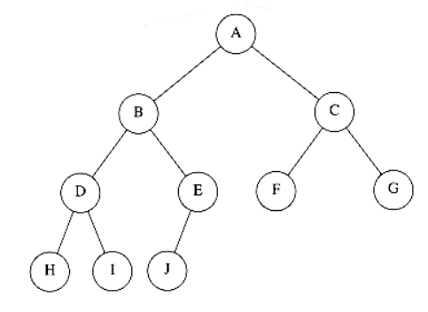
**Figure 6.2 A complete binary tree**

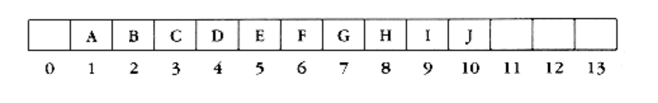
**Figure 6.3 Array implementation of complete binary tree**

For any element in array position i, the left child is in position 2i, the right child is in the cell after the left child (2i + 1), and the parent is in position _i_/2 . Thus not only are pointers not required, but the operations required to traverse the tree are extremely simple and likely to be very fast on most computers. The only problem with this implementation is that an estimate of the maximum heap size is required in advance, but typically this is not a problem. In the figure above, the limit on the heap size is 13 elements. The array has a position 0; more on this later.

A heap data structure will, then, consist of an array (of whatever type the key is) and integers representing the maximum 2nd current heap size. Figure 6.4 shows a typical priority queue declaration. Notice the similarity to the stack declaration in Figure 3.47. Figure 6.4a creates an empty heap. Line 11 will be explained later.

Throughout this chapter, we shall draw the heaps as trees, with the implication that an actual implementation will use simple arrays.

### Heap Order Property

The property that allows operations to be performed quickly is the heap order property. Since we want to be able to find the minimum quickly, it makes sense that the smallest element should be at the root. If we consider that any subtree should also be a heap, then any node should be smaller than all of its descendants.

Applying this logic, we arrive at the heap order property. In a heap, for every node X, the key in the parent of X is smaller than (or equal to) the key in X, with the obvious exception of the root (which has no parent). In Figure 6.5 the tree on the left is a heap, but the tree on the right is not (the dashed line shows the violation of heap order). As usual, we will assume that the keys are integers, although they could be arbitrarily complex.

Analogously, we can declare a (max) heap, which enables us to efficiently find and remove the maximum element, by changing the heap order property. Thus, a priority queue can be used to find either a minimum or a maximum, but this needs to be decided ahead of time. By the heap order property, the minimum element can always be found at the root. Thus, we get the extra operation, find_min, in constant time.

```c
struct heap_struct
 {

/* Maximum # that can fit in the heap */

unsigned int max_heap_size;

/* Current # of elements in the heap */

unsigned int size;

element_type *elements;

};

typedef struct heap_struct *PRIORITY_QUEUE;
```

**Figure 6.4 Declaration for priority queue**

```c
PRIORITY_QUEUE

create_pq(unsigned int max_elements)
{

PRIORITY_QUEUE H;

if(max_elements < MIN_PQ_SIZE)
error("Priority queue size is too small");

H = (PRIORITY_QUEUE) malloc (sizeof (struct heap_struct));

if(H == NULL)
fatal_error("Out of space!!!");

/*Allocate the array + one extra for sentinel */

H->elements = (element_type *) malloc

((max_elements+1) * sizeof (element_type));

if(H->elements == NULL)
fatal_error("Out of space!!!");

H->max_heap_size = max_elements;

H->size = 0;

H->elements[0] = MIN_DATA;

return H;

}
```

**Figure 6.4a**

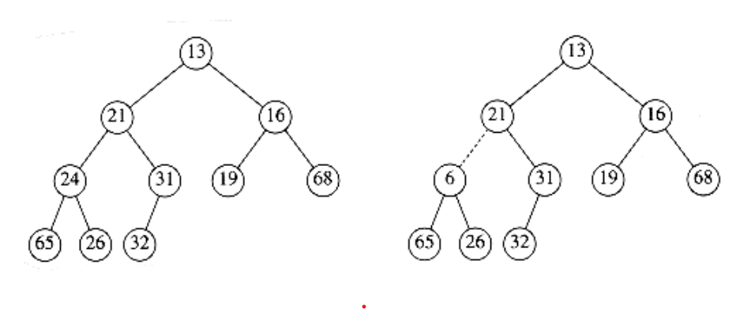

**Figure 6.5 Two complete trees (only the left tree is a heap)**

### Basic Heap Operations

It is easy (both conceptually and practically) to perform the two required operations. All the work involves ensuring that the heap order property is maintained.

#### Insert

To insert an element x into the heap, we create a hole in the next available location, since otherwise the tree will not be complete. If x can be placed in the hole without violating heap order, then we do so and are done. Otherwise we slide the element that is in the hole's parent node into the hole, thus bubbling the hole up toward the root. We continue this process until x can be placed in the hole. Figure 6.6 shows that to insert 14, we create a hole in the next available heap location. Inserting 14 in the hole would violate the heap order property, so 31 is slid down into the hole. This strategy is continued in Figure 6.7 until the correct location for 14 is found.

This general strategy is known as a percolate up; the new element is percolated up the heap until the correct location is found. Insertion is easily implemented with the code shown in Figure 6.8.

We could have implemented the percolation in the insert routine by performing repeated swaps until the correct order was established, but a swap requires three assignment statements. If an element is percolated up d levels, the number of assignments performed by the swaps would be 3d. Our method uses d + 1 assignments.

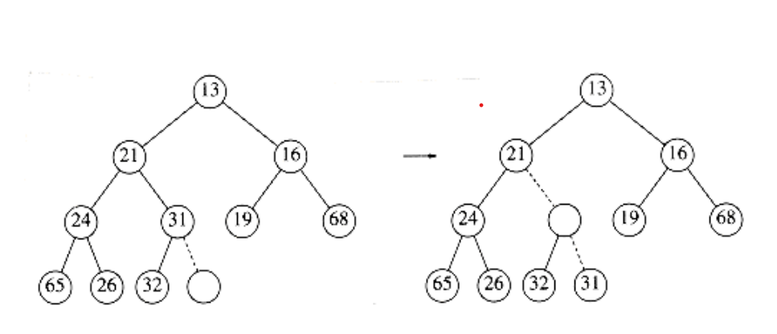

**Figure 6.6 Attempt to insert 14: creating the hole, and bubbling the hole up**

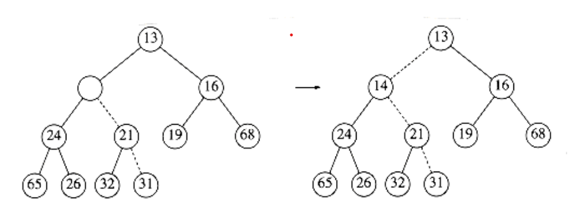

**Figure 6.7 The remaining two steps to insert 14 in previous heap**

```c
/* H->element[0] is a sentinel */

void insert(elementtype x, PRIORITY_QUEUE H){

unsigned int i;

if(is_full(H))error("Priority queue is full");

else{

i = ++H->size;

while(H->elements[i/2] > x){

H->elements[i] = H->elements[i/2];

 i /= 2;

}

H->elements[i] = x;

}

}
```

**Figure 6.8 Procedure to insert into a binary heap**

If the element to be inserted is the new minimum, it will be pushed all the way to the top. At some point, i will be 1 and we will want to break out of the while loop. We could do this with an explicit test, but we have chosen to put a very small value in position 0 in order to make the while loop terminate. This value must be guaranteed to be smaller than (or equal to) any element in the heap; it is known as a sentinel. This idea is similar to the use of header nodes in linked lists. By adding a dummy piece of information, we avoid a test that is executed once per loop iteration, thus saving some time.

The time to do the insertion could be as much as O (log n), if the element to be inserted is the new minimum and is percolated all the way to the root. On average, the percolation terminates early; it has been shown that 2.607 comparisons are required on average to perform an insert, so the average insert moves an element up 1.607 levels.

#### Delete_min

Delete_mins are handled in a similar manner as insertions. Finding the minimum is easy; the hard part is removing it. When the minimum is removed, a hole is created at the root. Since the heap now becomes one smaller, it follows that the last element x in the heap must move somewhere in the heap. If x can be placed in the hole, then we are done. This is unlikely, so we slide the smaller of the hole's children into the hole, thus pushing the hole down one level. We repeat this step until x can be placed in the hole. Thus, our action is to place x in its correct spot along a path from the root containing minimum children.

In Figure 6.9 the left figure shows a heap prior to the delete_min. After 13 is removed, we must now try to place 31 in the heap. 31 cannot be placed in the hole, because this would violate heap order. Thus, we place the smaller child (14) in the hole, sliding the hole down one level (see Fig. 6.10). We repeat this again, placing 19 into the hole and creating a new hole one level deeper. We then place 26 in the hole and create a new hole on the bottom level. Finally, we are able to place 31 in the hole (Fig. 6.11). This general strategy is known as a percolate down. We use the same technique as in the insert routine to avoid the use of swaps in this routine.

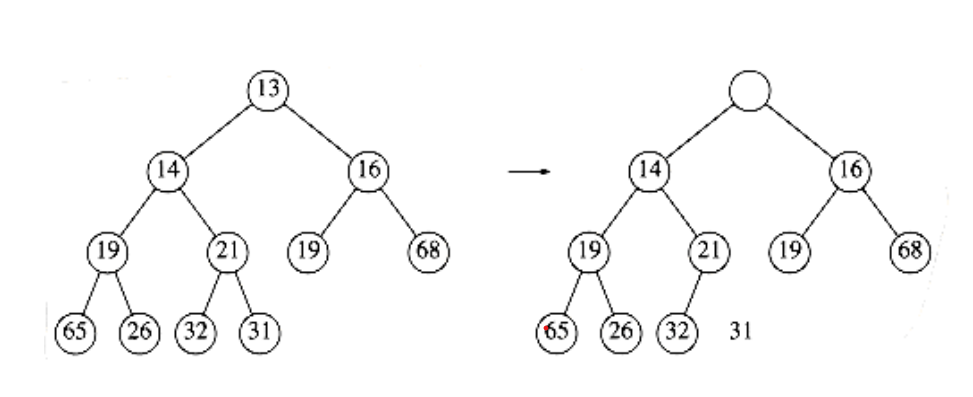
**Figure 6.9 Creation of the hole at the root**


**Figure 6.10 Next two steps in delete_min**

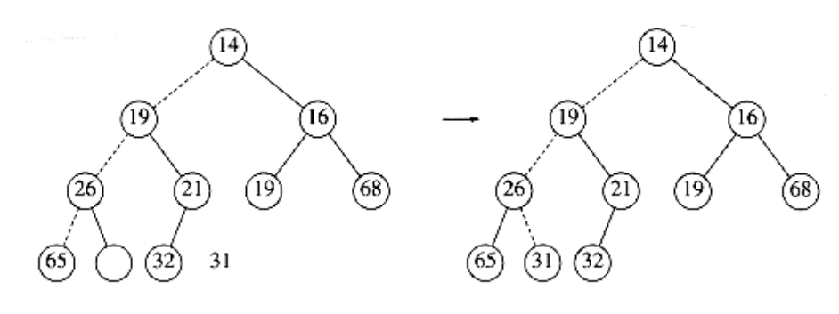
**Figure 6.11 Last two steps in delete_min**

A frequent implementation error in heaps occurs when there are an even number of elements in the heap, and the one node that has only one child is encountered. You must make sure not to assume that there are always two children, so this usually involves an extra test. In the code, depicted in Figure 6.12, we've done this test at line 8. One extremely tricky solution is always to ensure that your algorithm thinks every node has two children. Do this by placing a sentinel, of value higher than any in the heap, at the spot after the heap ends, at the start of each percolate down when the heap size is even. You should think very carefully before attempting this, and you must put in a prominent comment if you do use this technique.

```c
element_type

delete_min(PRIORITY_QUEUE H)
{

unsigned int i, child;

element_type min_element, last_element;

if(is_empty(H)){

error("Priority queue is empty");

return H->elements[0];

}

min_element = H->elements[1];

last_element = H->elements[H->size--];

for(i=1; i*2 <= H->size; i=child)
{

/* find smaller child */

child = i*2;

if((child != H->size) &&

(H->elements[child+1] < H->elements [child]))

child++;

* percolate one level *

if(last_element > H->elements[child])
H->elements[i] = H->elements[child];

else
break;

}

H->elements[i] = last_element;

return min_element;

}
```
**Figure 6.12 Function to perform delete_min in a binary heap**

Although this eliminates the need to test for the presence of a right child, you cannot eliminate the requirement that you test when you reach the bottom because this would require a sentinel for every leaf.

The worst-case running time for this operation is O(log n). On average, the element that is placed at the root is percolated almost to the bottom of the heap (which is the level it came from), so the average running time is O (log n).

### Other Heap Operations

Notice that although finding the minimum can be performed in constant time, a heap designed to find the minimum element (also known as a (min) heap) is of no help whatsoever in finding the maximum element. In fact, a heap has very little ordering information, so there is no way to find any particular key without a linear scan through the entire heap. To see this, consider the large heap structure (the elements are not shown) in Figure 6.13, where we see that the only information known about the maximum element is that it is at one of the leaves. Half the elements, though, are contained in leaves, so this is practically useless information. For this reason, if it is important to know where elements are, some other data structure, such as a hash table, must be used in addition to the heap. (Recall that the model does not allow looking inside the heap.)

If we assume that the position of every element is known by some other method, then several other operations become cheap. The three operations below all run in logarithmic worst-case time.

**Decrease_key**

The decrease_key(x, , H) operation lowers the value of the key at position x by a positive amount . Since this might violate the heap order, it must be fixed by a percolate up. This operation could be useful to system administrators: they can make their programs run with highest priority

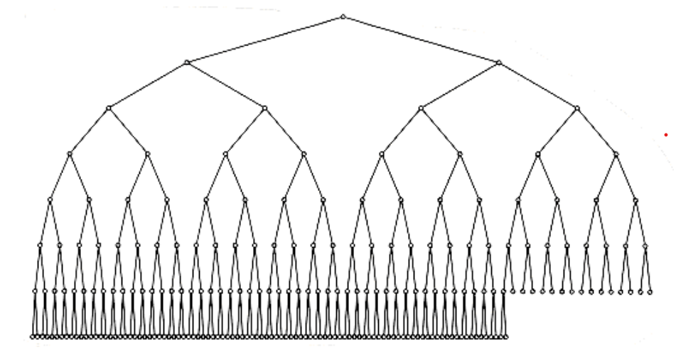

**Figure 6.13 A very large complete binary tree**

#### Increase_key

The increase_key(x, , H) operation increases the value of the key at position x by a positive amount . This is done with a percolate down. Many schedulers automatically drop the priority of a process that is consuming excessive CPU time.

#### Delete

The delete(x, H) operation removes the node at position x from the heap. This is done by first performing decrease_key(x, , H) and then performing delete_min (H). When a process is terminated by a user (instead of finishing normally), it must be removed from the priority queue.

#### Build_heap

The build_heap(H) operation takes as input n keys and places them into an empty heap. Obviously, this can be done with n successive inserts. Since each insert will take O(1) average and O(log n) worst-case time, the total running time of this algorithm would be O(n) average but O(n log n) worst-case. Since this is a special instruction and there are no other operations intervening, and we already know that the instruction can be performed in linear average time, it is reasonable to expect that with reasonable care a linear time bound can be guaranteed.

The general algorithm is to place the n keys into the tree in any order, maintaining the structure property. Then, if percolate_down(i) percolates down from node i, perform the algorithm in Figure 6.14 to create a heap-ordered tree.

The first tree in Figure 6.15 is the unordered tree. The seven remaining trees in Figures 6.15 through 6.18 show the result of each of the seven percolate downs. Each dashed line corresponds to two comparisons: one to find the smaller child and one to compare the smaller child with the node. Notice that there are only 10 dashed lines in the entire algorithm (there could have been an 11th -- where?) corresponding to 20 comparisons.

```c
for(i=n/2; i>0; i--)

percolate_down(i);
```

**Figure 6.14 Sketch of build_heap**
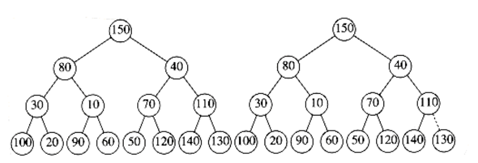

**Figure 6.15 Left: initial heap; right: after percolate_down(7)**
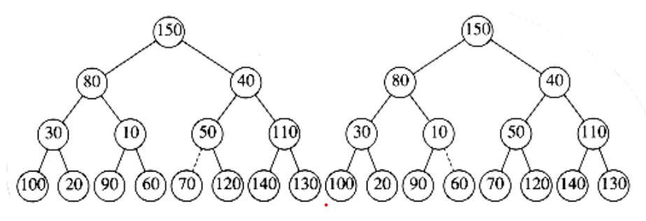

**Figure 6.16 Left: after percolate_down(6); right: after percolate_down(5)**
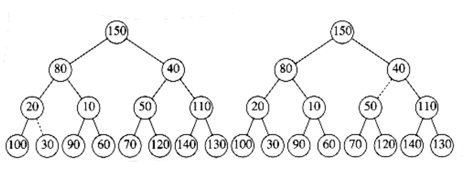

**Figure 6.17 Left: after percolate_down(4); right: after percolate_down(3)**
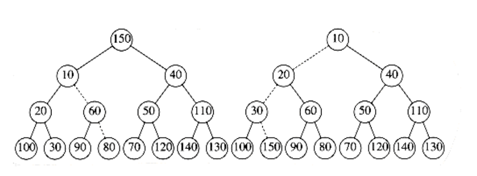

**Figure 6.18 Left: after percolate_down(2); right: after percolate_down(1)**

To bound the running time of build_heap, we must bound the number of dashed lines. This can be done by computing the sum of the heights of all the nodes in the heap, which is the maximum number of dashed lines. What we would like to show is that this sum is O(n).

**THEOREM 6.1.**

For the perfect binary tree of height h containing 2h+1 - 1 nodes, the sum of the

heights of the nodes is 2h+1 - 1 - (h + 1).

PROOF:

It is easy to see that this tree consists of 1 node at height h, 2 nodes at

height h - 1, 22 nodes at height h - 2, and in general 2i nodes at height h - i. The sum of the heights of all the nodes is then

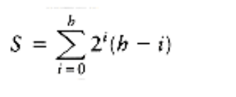

= h +2(h - 1) + 4(h - 2) + 8(h - 3) + 16(h - 4) +. . .+ 2h-1(1)

**(6.1)**

Multiplying by 2 gives the equation

2S = 2h + 4(h - 1) + 8(h - 2) + 16(h - 3) + . . . + 2h(1)

**(6.2)**

We subtract these two equations and obtain Equation (6.3). We find that certain terms almost cancel. For instance, we have 2h - 2(h - 1) = 2, 4(h - 1) - 4(h - 2)

= 4, and so on. The last term in Equation (6.2), 2h, does not appear in Equation (6.1); thus, it appears in Equation (6.3). The first term in Equation (6.1), h, does not appear in equation (6.2); thus, -h appears in Equation (6.3).

We obtain S = - h + 2 + 4 + 8 + . . . + 2h-1 + 2h = (2h+1 - 1) - (h + 1)

**(6.3)**

which proves the theorem.

A complete tree is not a perfect binary tree, but the result we have obtained is an upper bound on the the sum of the heights of the nodes in a complete tree.

Since a complete tree has between 2h and 2h+1 nodes, this theorem implies that this sum is O(n), where n is the number of nodes.

Although the result we have obtained is sufficient to show that build_heap is linear, the bound on the sum of the heights is not as strong as possible. For a complete tree with n = 2h nodes, the bound we have obtained is roughly 2n. The sum of the heights can be shown by induction to be n - b(n), where b(n) is the number of 1s in the binary representation of n.
