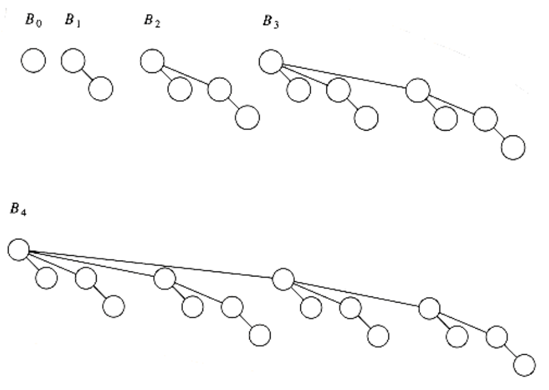
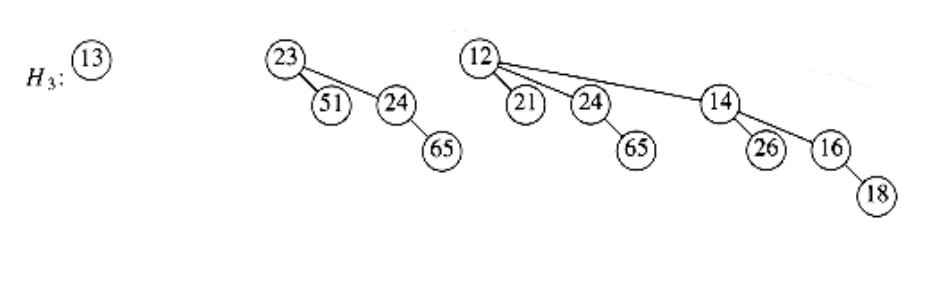
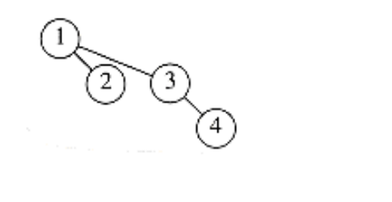
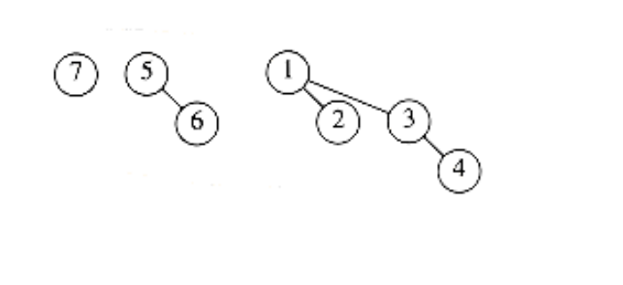
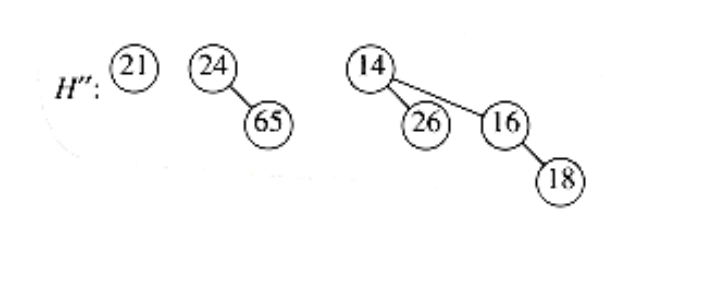
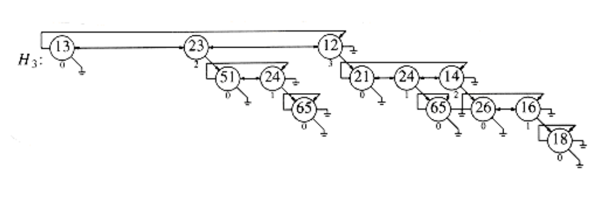
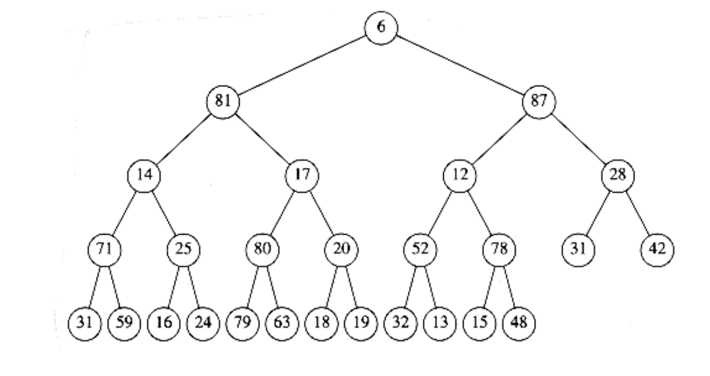
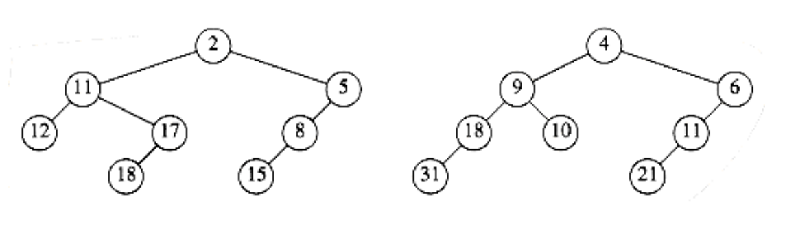

## Binomial Queues

Although both leftist and skew heaps support merging, insertion, and delete_min all effectively in O(log n) time per operation, there is room for improvement because we know that binary heaps support insertion in constant average time per operation. Binomial queues support all three operations in O(log n) worst-case time per operation, but insertions take constant time on average.
```
< P>
```
### Binomial Queue Structure

Binomial queues differ from all the priority queue implementations that we have seen in that a binomial queue is not a heap-ordered tree but rather a collection of heap-ordered trees, known as a forest. Each of the heap-ordered trees are of a constrained form known as a binomial tree (the name will be obvious later). There is at most one binomial tree of every height. A binomial tree of height 0 is a one-node tree; a binomial tree, Bk, of height k is formed by attaching a binomial tree, Bk-1, to the root of another binomial tree, Bk-1. Figure 6.34 shows binomial trees B0, B1, B2, B3, and B4.

It is probably obvious from the diagram that a binomial tree, Bk consists of a root with children B0, B1, . . ., Bk-1. Binomial trees of height k have exactly 2 k nodes, and the number of nodes at depth d is the binomial coefficient . If we impose heap order on the binomial trees and allow at most one binomial tree of any height, we can uniquely represent a priority queue of any size by a collection of binomial trees. For instance, a priority queue of size 13 could be represented by the forest B3, B2, B0. We might write this representation as 1101, which not only represents 13 in binary but also represents the fact that B3, B2 and B0 are present in the representation and B1 is not.

As an example, a priority queue of six elements could be represented as in Figure 6.35.



**Figure 6.34 Binomial trees B0, B1, B2, B3, and B4**


**Figure 6.35 Binomial queue H1 with six elements**

### Binomial Queue Operations

The minimum element can then be found by scanning the roots of all the trees. Since there are at most log n different trees, the minimum can be found in O(log n) time. Alternatively, we can maintain knowledge of the minimum and perform the operation in O(1) time, if we remember to update the minimum when it changes during other operations.

Merging two binomial queues is a conceptually easy operation, which we will describe by example. Consider the two binomial queues, H1 and H2 with six and seven elements, respectively, pictured in Figure 6.36.

The merge is performed by essentially adding the two queues together. Let H3 be the new binomial queue. Since H1 has no binomial tree of height 0 and H2 does, we can just use the binomial tree of height 0 in H2 as part of H3. Next, we add binomial trees of height 1. Since both H1 and H2 have binomial trees of height 1, we merge them by making the larger root a subtree of the smaller, creating a binomial tree of height 2, shown in Figure 6.37. Thus, H3 will not have a binomial tree of height 1. There are now three binomial trees of height 2, namely, the original trees of H1 and H2 plus the tree formed by the previous step. We keep one binomial tree of height 2 in H3 and merge the other two, creating a binomial tree of height 3. Since H1 and H2 have no trees of height 3, this tree becomes part of H3 and we are finished. The resulting binomial queue is shown in Figure 6.38.


**Figure 6.36 Two binomial queues H1 and H2**


**Figure 6.37 Merge of the two B1 trees in H1 and H2**



**Figure 6.38 Binomial queue H3**: the result of merging H1 and H2

Since merging two binomial trees takes constant time with almost any reasonable implementation, and there are O(log n) binomial trees, the merge takes O(log n) time in the worst case. To make this operation efficient, we need to keep the trees in the binomial queue sorted by height, which is certainly a simple thing to do.

Insertion is just a special case of merging, since we merely create a one-node tree and perform a merge. The worst-case time of this operation is likewise O(log n). More precisely, if the priority queue into which the element is being inserted has the property that the smallest nonexistent binomial tree is Bi, the running time is proportional to i + 1. For example, H3 (Fig.6.38) is missing a binomial tree of height 1, so the insertion will terminate in two steps. Since each tree in a binomial queue is present with probability , it follows that we expect an insertion to terminate in two steps, so the average time is constant. Furthermore, an easy analysis will show that performing n inserts on an initially empty binomial queue will take O(n) worst-case time. Indeed, it is possible to do this operation using only n - 1 comparisons; we leave this as an exercise.

As an example, we show in Figures 6.39 through 6.45 the binomial queues that are formed by inserting 1 through 7 in order. Inserting 4 shows off a bad case. We merge 4 with B0, obtaining a new tree of height 1. We then merge this tree with B1, obtaining a tree of height 2, which is the new priority queue. We count this as three steps (two tree merges plus the stopping case). The next insertion after 7 is inserted is another bad case and would require three tree merges.

A delete_min can be performed by first finding the binomial tree with the smallest root. Let this tree be Bk, and let the original priority queue be H. We remove the binomial tree Bk from the forest of trees in H, forming the new binomial queue H'. We also remove the root of Bk, creating binomial trees B0, B1, . . . , Bk - l, which collectively form priority queue H''. We finish the operation by merging H' and H''.

As an example, suppose we perform a delete_min on H3, which is shown again in Figure 6.46.The minimum root is 12, so we obtain the two priority queues H' and H'' in Figure 6.47 and Figure 6.48. The binomial queue that results from merging H' and H'' is the final answer and is shown in Figure 6.49.

For the analysis, note first that the delete_min operation breaks the original binomial queue into two. It takes O (log n) time to find the tree containing the minimum element and to create the queues H' and H''. Merging these two queues takes O (log n) time, so the entire delete_min operation takes O (log n) time.

### Implementation of Binomial Queues

The delete_min operation requires the ability to find all the subtrees of the root quickly, so the standard representation of general trees is required: The children of each node are kept in a linked list, and each node has a pointer to its first child (if any). This operation also requires that the children be ordered by the size of their subtrees, in essentially the same way as we have been drawing them. The reason for this is that when a delete_min is performed, the children will form the binomial queue H''.

We also need to make sure that it is easy to merge two trees. Two binomial trees can be merged only if they have the same size, so if this is to be done efficiently, the size of the tree must be stored in the root. Also, when two trees are merged, one of the trees is added as a child to the other. Since this new tree will be the last child (as it will be the largest subtree), we must be able to keep track of the last child of each node efficiently. Only then will we be able to merge two binomial trees, and thus two binomial queues, efficiently. One way to do this is to use a circular doubly linked list. In this list, the left sibling of the first child will be the last child. The right sibling of the last child could be defined as the first child, but it might be easier just to define it as . This makes it easy to test whether the child we are pointing to is the last.

To summarize, then, each node in a binomial tree will contain the data, first child, left and right sibling, and the number of children (which we will call the rank). Since a binomial queue is just a list of trees, we can use a pointer to the smallest tree as the reference to the data structure.

Figure 6.51 shows how the binomial queue in Figure 6.50 is represented. Figure 6.52 shows the type declarations for a node in the binomial tree.

In order to merge two binomial queues, we need a routine to merge two binomial trees of the same size. Figure 6.53 shows how the pointers change when two binomial trees are merged. First, the root of the new tree gains a child, so we must update its rank. We then need to change several pointers in order to splice one tree into the list of children of the root of the other tree. The code to do this is simple and shown in Figure 6.54.


**Figure 6.39 After 1 is inserted**


**Figure 6.40 After 2 is inserted**


**Figure 6.41 After 3 is inserted**


**Figure 6.42 After 4 is inserted**


**Figure 6.43 After 5 is inserted**


**Figure 6.44 After 6 is inserted**


**Figure 6.45 After 7 is inserted**


**Figure 6.46 Binomial queue H3**


**Figure 6.47 Binomial queue H', containing all the binomial trees in H3 except B3**


**Figure 6.48 Binomial queue H'': B3 with 12 removed**


**Figure 6.49 Result of delete_min(H3)**


**Figure 6.50 Binomial queue H3 drawn as a forest**


**Figure 6.51 Representation of binomial queue H3**
```c
typedef struct tree_node *tree_ptr;

struct tree_node
{

element_type element;

tree_ptr l_sib;

tree_ptr r_sib;

tree_ptr f_child;

unsigned int rank;

};

typedef tree_ptr PRIORITY_QUEUE;
```

**Figure 6.52 Binomial queue type declarations**


**Figure 6.53 Merging two binomial trees**

The routine to merge two binomial queues is relatively simple. We use recursion to keep the code size small; a nonrecursive procedure will give better performance, and is left as Exercise 6.32. We assume the macro extract(T, H), which removes the first tree from the priority queue H, placing the tree in T. Suppose the smallest binomial tree is contained in H1, but not in H2.

Then, to merge H1, we remove the first tree in H1 and add to it the result of merging the rest of H1 with H2. If the smallest tree is contained in both Hl and H2, then we remove both trees and merge them, obtaining a one-tree binomial queue H'. We then merge the remainder of Hl and H2, and merge this result with H'. This strategy is implemented in Figure 6.55. The other routines are straightforward implementations, which we leave as exercises.
```c
/* Merge two equal-sized binomial trees */

tree_ptr

merge_tree(tree_ptr T1, tree_ptr T2)
{

if(T1->element > T2->element)
return merge_tree(T2, T1);

if(T1->rank++ == 0)
T1->f_child = T2;

else{

T2->l_sib = T1->f_child->l_sib;

T2->l_sib->r_sib = T2;

T1->f_child->l_sib = T2;

}

return T1;

}
```

**Figure 6.54 Routine to merge two equal-sized binomial trees**

We can extend binomial queues to support some of the nonstandard operations that binary heaps allow, such as decrease_key and delete, when the position of the affected element is known. A decrease_key is a percolate up, which can be performed in O(log n) time if we add a field to each node pointing to its parent. An arbitrary delete can be performed by a combination of decrease_key and delete_min in O(log n) time.

## Summary

In this chapter we have seen various implementations and uses of the priority queue ADT. The standard binary heap implementation is elegant because of its simplicity and speed. It requires no pointers and only a constant amount of extra space, yet supports the priority queue operations efficiently.

We considered the additional merge operation and developed three implementations, each of which is unique in its own way. The leftist heap is a wonderful example of the power of recursion. The skew heap represents a remarkable data structure because of the lack of balance criteria. Its analysis, which we will perform in Chapter 11, is interesting in its own right. The binomial queue shows how a simple idea can be used to achieve a good time bound.

We have also seen several uses of priority queues, ranging from operating systems scheduling to simulation. We will see their use again in Chapters 7, 9, 10.

```c
PRIORITY_QUEUE

merge(PRIORITY_QUEUE H1, PRIORITY_QUEUE H2)
{

PRIORITY_QUEUE H3;

tree_ptr T1, T2, T3;

if(H1 == NULL)
return H2;

if(H2 == NULL)
return H1;

if(H1->rank < H2->rank){

T1 = extract(H1); /* extract is a macro */

H3 = merge(H1, H2);

T1->l_sib = H3->l_sib;

H3->l_sib->r_sib = NULL;

T1->r_sib = H3; H3->l_sib = T1;

return T1;
{

if(H2->rank < H1->rank)
return merge(H2, H1);

/* Otherwise, first two trees have same rank */

T1 = extract(H1); T2 = extract(H2);

H3 = merge(H1, H2);

T3 = merge_tree(T1, T2);

return merge(T3, H3);

}
```

**Figure 6.55 Routine to merge two priority queues**

## Exercises

6.1 Suppose that we replace the delete_min function with find_min. Can both insert and find_min be implemented in constant time?

6.2 a. Show the result of inserting 10, 12, 1, 14, 6, 5, 8, 15, 3, 9, 7, 4, 11, 13, and 2, one at a time, into an initially empty binary heap.

b. Show the result of using the linear-time algorithm to build a binary heap using the same input.

6.3 Show the result of performing three delete_min operations in the heap of the previous exercise.

6.4 Write the routines to do a percolate up and a percolate down in a binary heap.

6.5 Write and test a program that performs the operations insert, delete_min, build_heap, find_min, decrease_key, delete, and increase_key in a binary heap.

6.6 How many nodes are in the large heap in Figure 6.13?

6.7 a. Prove that for binary heaps, build_heap does at most 2n - 2 comparisons between elements.

b. Show that a heap of 8 elements can be constructed in 8 comparisons between heap elements.

c. Give an algorithm to build a binary heap in 13/8n + O(log n) element comparisons.

6.8 Show that the expected depth of the kth smallest element in a large complete heap (you may assume n = 2k - 1) is bounded by log k.

6.9  a. Give an algorithm to find all nodes less than some value, x, in a binary heap. Your algorithm should run in O(K), where K is the number of nodes output.

b. Does your algorithm extend to any of the other heap structures discussed in this chapter?

6.10 Propose an algorithm to insert m nodes into a binary heap on n elements in O(m + log n) time. Prove your time bound.

6.11 Write a program to take n elements and do the following:

a. Insert them into a heap one by one,

b. Build a heap in linear time. Compare the running time of both algorithms for sorted, reverse-ordered, and random inputs.

6.12 Each delete_min operation uses 2 log n comparisons in the worst case.

a. Propose a scheme so that the delete_min operation uses only log n + log log n + O(1) comparisons between elements. This need not imply less data movement.

b. Extend your scheme in part (a) so that only log n + log log log n + O(1) comparisons are performed.

c. How far can you take this idea?

d. Do the savings in comparisons compensate for the increased complexity of your algorithm?

6.13 If a d-heap is stored as an array, for an entry located in position i, where are the parents and children?

6.14 Suppose we need to perform m percolate_ups and n delete_mins on a d-heap that initially has n elements.

a. What is the total running time of all operations in terms of m, n, and d?

b. If d = 2, what is the running time of all heap operations?

c. If d = (n), what is the total running time?

d. What choice of d minimizes the total running time?

6.15 A min-max heap is a data structure that supports both delete_min and delete_max in O(log n) per operation. The structure is identical to a binary heap, but the heap order property is that for any node, X, at even depth, the key stored at X is smaller than the parent but larger than the grandparent (where this makes sense), and for any node X at odd depth, the key stored at X is larger than the parent but smaller than the grandparent. See Figure 6.56.

a. How do we find the minimum and maximum elements?

b. Give an algorithm to insert a new node into the min-max heap.

c. Give an algorithm to perform delete_min and delete_max.

d. Can you build a min-max heap in linear time?

e. Suppose we would like to support delete_min, delete_max, and merge. Propose a data structure to support all operations in O(log n) time.

6.16 Merge the two leftist heaps in Figure 6.57.

6.17 Show the result of inserting keys 1 to 15 in order into an initially empty leftist heap.

6.18 Prove or disprove: A perfectly balanced tree forms if keys 1 to 2k - 1 are inserted in order into an initially empty leftist heap.

6.19 Give an example of input which generates the best leftist heap.



Figure 6.56 Min-max heap



Figure 6.57

6.20 a. Can leftist heaps efficiently support decrease_key?

b. What changes, if any (if possible), are required to do this?

6.21 One way to delete nodes from a known position in a leftist heap is to use a lazy strategy. To delete a node, merely mark it deleted. When a find_min or delete_min is performed, there is a potential problem if the root is marked deleted, since then the node has to be actually deleted and the real minimum needs to be found, which may involve deleting other marked nodes. In this strategy, deletes cost one unit, but the cost of a delete_min or find_min depends on the number of nodes that are marked deleted. Suppose that after a delete_min or find_min there are k fewer marked nodes than before the operation.

a. Show how to perform the delete_min in O(k log n) time.

b. Propose an implementation, with an analysis to show that the time to perform the delete_min is O(k log(2n/k)).

6.22 We can perform build_heap in linear time for leftist heaps by considering each element as a one-node leftist heap, placing all these heaps on a queue, and performing the following step: Until only one heap is on the queue, dequeue two heaps, merge them, and enqueue the result.

a. Prove that this algorithm is O(n) in the worst case.

b. Why might this algorithm be preferable to the algorithm described in the text?

6.23 Merge the two skew heaps in Figure 6.57.

6.24 Show the result of inserting keys 1 to 15 in order into a skew heap.

6.25 Prove or disprove: A perfectly balanced tree forms if the keys 1 to 2k - 1 are inserted in order into an initially empty skew heap.

6.26 A skew heap of n elements can be built using the standard binary heap algorithm. Can we use the same merging strategy described in Exercise 6.22 for skew heaps to get an O(n) running time?

6.27 Prove that a binomial tree Bk has binomial trees B0, B1, . . . , Bk-1 as children of the root.

6.28 Prove that a binomial tree of height k has nodes at depth d.

6.29 Merge the two binomial queues in Figure 6.58.

6.30 a. Show that n inserts into an initially empty binomial queue takes O(n) time in the worst case.

b. Give an algorithm to build a binomial queue of n elements, using at most n - 1 comparisons between elements.

6.31 Propose an algorithm to insert m nodes into a binomial queue of n elements in O(m + log n) worst-case time. Prove your bound.

6.32 Write nonrecursive routines to perform merge, insert, and delete_min using binomial queues.

6.33 Suppose we extend binomial queues to allow at most two trees of the same height per structure. Can we obtain O(1) worst-case time for insertion while retaining O(log n) for the other operations?


Figure 6.58

6.34 Suppose you have a number of boxes, each of which can hold total weight C and items i1, i2, i3, . . . , in, which weigh w1, w2, w3, . . . , wn. The object is to pack all the items without placing more weight in any box than its capacity and using as few boxes as possible. For instance, if C = 5, and the items have weights 2, 2, 3, 3, then we can solve the problem with two boxes. In general, this problem is very hard and no efficient solution is known. Write programs to implement efficiently the following approximation strategies:

a. Place the weight in the first box for which it fits (creating a new box if there is no box with enough room). (This strategy and all that follow would give three boxes, which is suboptimal.)

b. Place the weight in the box with the most room for it.

c. Place the weight in the most filled box that can accept it without overflowing.

d. Are any of these strategies enhanced by presorting the items by weight?

6.35 Suppose we want to add the decrease_all_keys() operation to the heap repertoire. The result of this operation is that all keys in the heap have their value decreased by an amount. For the heap implementation of your choice, explain the necessary modifications so that all other operations retain their running times and decrease_all_keys runs in O(1).

6.36 Which of the two selection algorithms has the better time bound?

## References

The binary heap was first described in [21]. The linear-time algorithm for its construction is from [9]. 

The first description of d -heaps was in [14]. Leftist heaps were invented by Crane [7] and described in Knuth [15]. Skew heaps were developed by Sleator and Tarjan [17]. Binomial queues were invented by Vuillemin [20]; Brown provided a detailed analysis and empirical study showing 
that they perform well in practice [2], if carefully implemented. 

Exercise 6.7 (b-c) is taken from [12]. A method for constructing binary heaps that uses about 1.52n comparisons on average is described in [16]. Lazy deletion in leftist heaps (Exercise 6.21) is from [6]. A solution to Exercise 6.33 can be found in [5].

Min-max heaps (Exercise 6.15) were originally described in [1]. More efficient implementation of the operations is given in [13] and [18]. An alternate representation for double ended priority queues is the deap. Details can be found in [3] and [4]. 

A theoretically interesting priority queue representation is the Fibonacci heap [11], which we will describe in Chapter 11. The Fibonacci heap allows all operations to be performed in O(1) amortized time, except for deletions, which are O(log n). Relaxed heaps [8] achieve identical 
bounds in the worst case. Another interesting mplementation is the pairing heap [10]. Finally, a priority queue that works when the data consists of small integers is described in [19].

1. M. D. Atkinson, J. R. Sack, N. Santoro, and T. Strothotte, "Min-Max Heaps and Generalized Priority Queues," Communications of the ACM 29 (1986), 996-1000.

2.  M. R. Brown, "Implementation and Analysis of Binomial Queue Algorithms," SIAM Journal on Computing 7 (1978), 298-319.

3. S. Carlsson, "The Deap--A Double-ended Heap to Implement Double-ended Priority Queues," Information Processing Letters 26 (1987), 33-36.

4. S. Carlsson, J. Chen, and T. Strothotte, "A Note on the Construction of the Data Structure 'Deap'," Information Processing Letters 31 (1989), 315-317.

5. S. Carlsson, J. I. Munro, and P. V. Poblete, "An Implicit Binomial Queue with Constant Insertion Time," Proceedings of First Scandinavian Workshop on Algorithm Theory, 1988, 1-13.

6. D. Cheriton and R. E. Tarjan, "Finding Minimum Spanning Trees," SIAM Journal on Computing 5 (1976), 724-742.

7. C. A. Crane, "Linear Lists and Priority Queues as Balanced Binary Trees," Technical Report STAN-CS-72-259, Computer Science Department, Stanford University, Stanford, CA, 1972.

8. J. R. Driscoll, H. N. Gabow, R. Shrairman, and R. E. Tarjan, "Relaxed Heaps: An Alternative to Fibonacci Heaps with Applications to Parallel Computation," Communications of the ACM 31 (1988), 1343-1354.

9. R. W. Floyd, "Algorithm 245: Treesort 3:", Communications of the ACM 7 (1964), 701.

10. M. L. Fredman, R. Sedgewick, D. D. Sleator, and R. E. Tarjan, "The Pairing Heap: A New Form of Self-adjusting Heap," Algorithmica 1 (1986), 111-129.

11. M. L. Fredman and R. E. Tarjan, "Fibonacci Heaps and Their Uses in Improved Network Optimization Algorithms," Journal of the ACM 34 (1987), 596-615.

12. G. H. Gonnet and J. I. Munro, "Heaps on Heaps," SIAM Journal on Computing 15 (1986), 964-971.

13. A. Hasham and J. R. Sack, "Bounds for Min-max Heaps," BIT 27 (1987), 315-323.

14. D. B. Johnson, "Priority Queues with Update and Finding Minimum Spanning Trees," Information Processing Letters 4 (1975), 53-57.

15. D. E. Knuth, The Art of Computer Programming, Vol 3: Sorting and Searching, second printing, Addison-Wesley, Reading, MA, 1975.

16. C. J. H. McDiarmid and B. A. Reed, "Building Heaps Fast," Journal of Algorithms 10 (1989), 352-365.

17. D. D. Sleator and R. E. Tarjan, "Self-adjusting Heaps," SIAM Journal on Computing 15 (1986), 52-69.

18. T. Strothotte, P. Eriksson, and S. Vallner, "A Note on Constructing Min-max Heaps," BIT 29 (1989), 251-256.

19. P. van Emde Boas, R. Kaas, E. Zijlstra, "Design and Implementation of an Efficient Priority Queue," Mathematical Systems Theory 10 (1977), 99-127.

20. J. Vuillemin, "A Data Structure for Manipulating Priority Queues," Communications of the ACM 21 (1978), 309-314.

21. J. W. J. Williams, "Algorithm 232: Heapsort," Communications of the ACM 7 (1964), 347-348.
