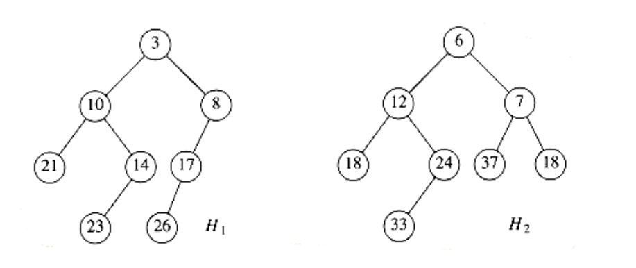
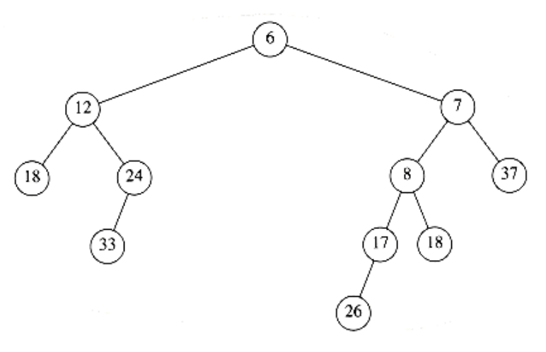
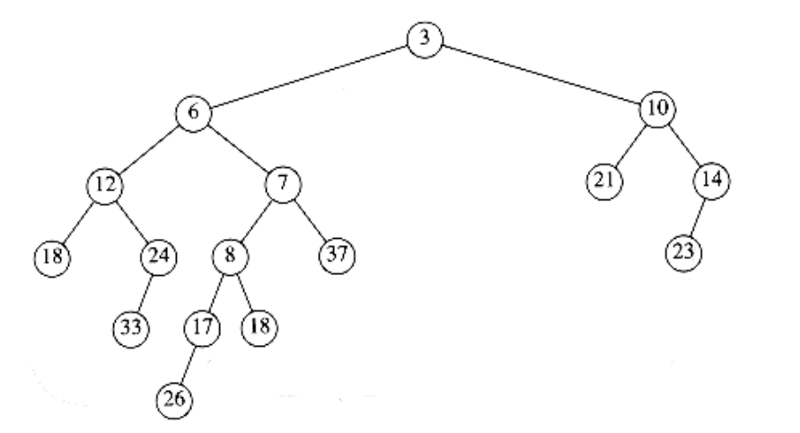
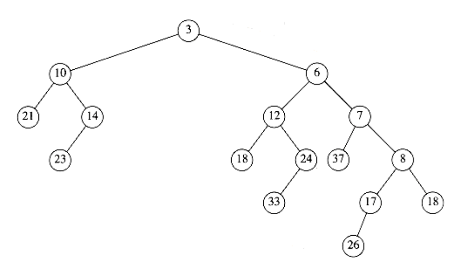

## Leftist Heaps

It seems difficult to design a data structure that efficiently supports merging (that is, processes a merge in o(n) time) and uses only an array, as in a binary heap. The reason for this is that merging would seem to require copying one array into another which would take (n) time for equal-sized heaps. For this reason, all the advanced data structures that support efficient merging require the use of pointers. In practice, we can expect that this will make all the other operations slower; pointer manipulation is generally more time-consuming than multiplication and division by two.

Like a binary heap, a leftist heap has both a structural property and an ordering property. Indeed, a leftist heap, like virtually all heaps used, has the same heap order property we have already seen. Furthermore, a leftist heap is also a binary tree. The only difference between a leftist heap and a binary heap is that leftist heaps are not perfectly balanced, but actually attempt to be very unbalanced.

### Leftist Heap Property

We define the null path length, npl(X) of any node X to be the length of the shortest path from X to a node without two children. Thus, the npl of a node with zero or one child is 0, while npl(NULL) = -1. In the tree in Figure 6.20, the null path lengths are indicated inside the tree nodes.

Notice that the null path length of any node is 1 more than the minimum of the null path lengths of its children. This applies to nodes with less than two children because the null path length of is -1.

The leftist heap property is that for every node X in the heap, the null path length of the left child is at least as large as that of the right child. This property is satisfied by only one of the trees in Figure 6.20, namely, the tree on the left. This property actually goes out of its way to ensure that the tree is unbalanced, because it clearly biases the tree to get deep towards the left.


Indeed, a tree consisting of a long path of left nodes is possible (and actually preferable to facilitate merging); hence the name leftist heap.


**Figure 6.20 Null path lengths for two trees; only the left tree is leftist**

Because leftist heaps tend to have deep left paths, it follows that the right path ought to be short. Indeed, the right path down a leftist heap is as short as any in the heap. Otherwise, there would be a path that goes through some node X and takes the left child. Then X would violate the leftist property.

**HEOREM 6.2.**

A leftist tree with r nodes on the right path must have at least 2r - 1 nodes.

**PROOF:**

The proof is by induction. If r = 1, there must be at least one tree node. Otherwise, suppose that the theorem is true for 1, 2, . . ., r. Consider a leftist tree with r + 1 nodes on the right path. Then the root has a right subtree with r nodes on the right path, and a left subtree with at least r nodes on the right path (otherwise it would not be leftist). Applying the inductive hypothesis to these subtrees yields a minimum of 2r - 1 nodes in each subtree.

This plus the root gives at least 2r+1 - 1 nodes in the tree, proving the theorem.

From this theorem, it follows immediately that a leftist tree of n nodes has a right path containing at most log(n + 1) nodes. The general idea for the leftist heap operations is to perform all the work on the right path, which is guaranteed to be short. The only tricky part is that performing inserts and merges on the right path could destroy the leftist heap property. It turns out to be extremely easy to restore the property.

### Leftist Heap Operations

The fundamental operation on leftist heaps is merging. Notice that insertion is merely a special case of merging, since we may view an insertion as a merge of a one-node heap with a larger heap. We will first give a simple recursive solution and then show how this might be done nonrecursively. Our input is the two leftist heaps, H1 and H2, in Figure 6.21. You should check that these heaps really are leftist. Notice that the smallest elements are at the roots. In addition to space for the data and left and right pointers, each cell will have an entry that indicates the null path length.

If either of the two heaps is empty, then we can return the other heap. Otherwise, to merge the two heaps, we compare their roots. First, we recursively merge the heap with the larger root with the right subheap of the heap with the smaller root. In our example, this means we recursively merge H2 with the subheap of H1 rooted at 8, obtaining the heap in Figure 6.22.

Since this tree is formed recursively, and we have not yet finished the description of the algorithm, we cannot at this point show how this heap was obtained. However, it is reasonable to assume that the resulting tree is a leftist heap, because it was obtained via a recursive step. This is much like the inductive hypothesis in a proof by induction. Since we can handle the base case (which occurs when one tree is empty), we can assume that the recursive step works as long as we can finish the merge; this is rule 3 of recursion, which we discussed in Chapter 1. We now make this new heap the right child of the root of H1 (see Fig. 6.23).



**Figure 6.21 Two leftist heaps H~1~ and H~2~**



**Figure 6.22 Result of merging H2 with H1's right subheap**


**Figure 6.23 Result of attaching leftist heap of previous figure as H1's right child**

Although the resulting heap satisfies the heap order property, it is not leftist because the left subtree of the root has a null path length of 1 while the right subtree has null path length of 2. Thus, the leftist property is violated at the root. However, it is easy to see that the remainder of the tree must be leftist. The right subtree of the root is leftist, because of the recursive step. The left subtree of the root has not been changed, so it too must still be leftist. Thus, we only need to fix the root. We can make the entire tree leftist by merely swapping the root's left and right children (Fig. 6.24) and updating the null path length -- the new null path length is 1 plus the null path length of the new right child -- completing the merge. Notice that if the null path length is not updated, then all null path lengths will be 0, and the heap will not be leftist but merely random. In this case, the algorithm will work, but the time bound we will claim will no longer be valid.

The description of the algorithm translates directly into code. The type definition (Fig. 6.25) is the same as the binary tree, except that it is augmented with the npl (null path length) field. We have seen in Chapter 4 that when an element is inserted into an empty binary tree, the pointer to the root will need to change. The easiest way to implement this is to have the insertion routine return a pointer to the new tree. Unfortunately, this will make the leftist heap insert incompatible with the binary heap insert (which does not return anything). The last line in Figure 6.25 represents one way out of this quandary. The leftist heap insertion routine which returns the new tree will be called insert1; the insert macro will make an insertion compatible with binary heaps. Using macros this way may not be the best or safest course, but the alternative, declaring a PRIORITY QUEUE as a pointer to a tree_ptr will flood the code with extra asterisks.

Because insert is a macro and is textually substituted by the preprocessor, any routine that calls insert must be able to see the macro definition. Figure 6.25 would typically be a header file, so placing the macro declaration there is the only reasonable course. As we will see later. delete_min also needs to be written as a macro.



**Figure 6.24 Result of swapping children of H1's root**

```c
typedef struct tree_node *tree_ptr;

struct tree_node
{

element_type element;

tree_ptr left;

tree_ptr right;

unsigned int npl;

};

typedef tree_ptr PRIORITY_QUEUE;

define insert(x, H) (H = insert1((x), H))
```

**Figure 6.25 Leftist heap type declarations**

The routine to merge (Fig. 6.26) is a driver designed to remove special cases and ensure that H1 has the smaller root. The actual merging is performed in merge1 (Fig. 6.27).

The time to perform the merge is proportional to the sum of the length of the right paths, because constant work is performed at each node visited during the recursive calls. Thus we obtain an O(log n) time bound to merge two leftist heaps. We can also perform this operation nonrecursively by essentially performing two passes. In the first pass, we create a new tree by merging the right paths of both heaps. To do this, we arrange the nodes on the right paths of H1
and H2 in sorted order, keeping their respective left children. In our example, the new rightm path is 3, 6, 7, 8, 18 and the resulting tree is shown in Figure 6.28. A second pass is made up the heap, and child swaps are performed at nodes that violate the leftist heap property. In Figure 6.28, there is a swap at nodes 7 and 3, and the same tree as before is obtained. The nonrecursive version is simpler to visualize but harder to code. We leave it to the reader to show that the recursive and nonrecursive procedures do the same thing.

```c

PRIORITY_QUEUE

merge(PRIORITY_QUEUE H1, PRIORITY_QUEUE H2)
{

if(H1 == NULL)
return H2;

if(H2 == NULL)
return H1;

if(H1->element < H2->element)
return merge1(H1, H2);

else
return merge1(H2, H1);

}
```
**Figure 6.26 Driving routine for merging leftist heaps**

```c
/* For merge1, H1 has smaller root, H1 and H2 are not NULL */

PRIORITY_QUEUE

merge1(PRIORITY_QUEUE H1, PRIORITY_QUEUE H2)
{

if(H1->left == NULL) /* single node */

H1->left = H2; /* H1->right is already NULL,

H1->npl is already 0 */

else{

H1->right = merge(H1->right, H2);

if(H1->left->npl < H1->right->npl)
swap_children(H1);

H1->npl = H1->right->npl + 1;

}

return H1;

}
```

**Figure 6.27 Actual routine to merge leftist heaps**



**Figure 6.28 Result of merging right paths of H1 and H2**

As mentioned above, we can carry out insertions by making the item to be inserted a one-node heap and performing a merge. To perform a delete_min, we merely destroy the root, creating two heaps, which can then be merged. Thus, the time to perform a delete_min is O(logn). These two routines are coded in Figure 6.29 and Figure 6.30. Delete_min can be written as a macro that calls delete_min1 and find_min. This is left as an exercise to the reader.

The call to free on line 4 of Figure 6.30 might look chancy, but it is actually correct. The call does not destroy the variable H; rather, it indicates that the cell to which it points can be used. That cell is placed on the freelist. H, which is a pointer, is then set to point somewhere else by line 5. Also, notice how the headings for these routines can be made identical to those for the binary heap implementation. Either priority queue package could be used, and the implementation would be completely transparent to the calling routines.

Finally, we can build a leftist heap in O(n) time by building a binary heap (obviously using a pointer implementation). Although a binary heap is clearly leftist, this is not necessarily the best solution, because the heap we obtain is the worst possible leftist heap. Furthermore, traversing the tree in reverse-level order is not as easy with pointers. The build_heap effect can be obtained by recursively building the left and right subtrees and then percolating the root down. The exercises contain an alternative solution.

```c

PRIORITY_QUEUE

insert1(element_type x, PRIORITY_QUEUE H)
{

tree_ptr single_node;

single_node = (tree_ptr) malloc(sizeof (struct tree_node));

if(single_node == NULL)
fatal_error("Out of space!!!");

else{

single_node->element = x; single_node->npl = 0;

single_node->left = single_node->right = NULL;

H = merge(single_node, H);

}

return H;

}

```

**Figure 6.29 Insertion routine for leftist heaps**

/* Delete_min1 returns the new tree; */

/* to get the minimum use find_min */

/* This is for convenience. */

```c
PRIORITY_QUEUE

delete_min1(PRIORITY_QUEUE H)
{

PRIORITY_QUEUE left_heap, right_heap;

left_heap = H->left;

right_heap = H->right;

free(H);

return merge(left_heap, right_heap);

}
```

**Figure 6.30 Delete_min routine for leftist heaps**
