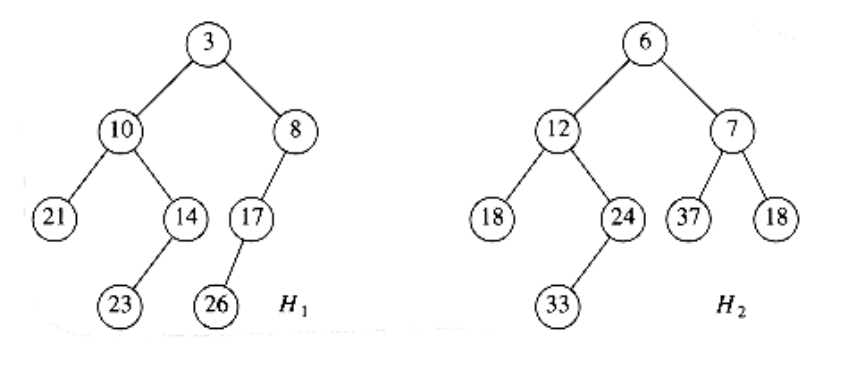
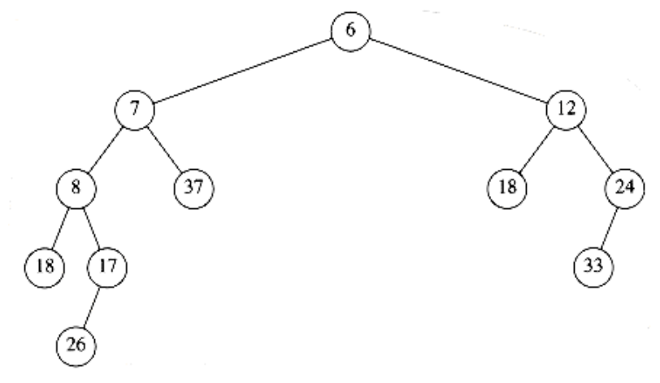
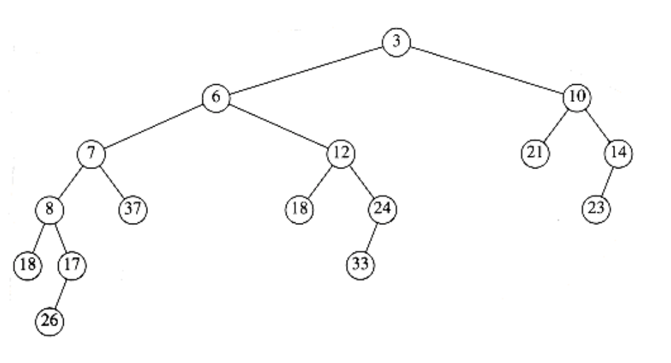

## Skew Heaps

A skew heap is a self-adjusting version of a leftist heap that is incredibly simple to implement. The relationship of skew heaps to leftist heaps is analogous to the relation between splay trees and AVL trees. Skew heaps are binary trees with heap order, but there is no structural constraint on these trees. Unlike leftist heaps, no information is maintained about the null path length of any node. The right path of a skew heap can be arbitrarily long at any time, so the worst-case running time of all operations is O(n). However, as with splay trees, it can be shown (see Chapter 11) that for any m consecutive operations, the total worst-case running time is O(m log n). Thus, skew heaps have O(log n) amortized cost per operation.

As with leftist heaps, the fundamental operation on skew heaps is merging. The merge routine is once again recursive, and we perform the exact same operations as before, with one exception. The difference is that for leftist heaps, we check to see whether the left and right children satisfy the leftist heap order property and swap them if they do not. For skew heaps, the swap is unconditional -- we always do it, with the one exception that the smallest of all the nodes on the right paths does not have its children swapped. This one exception is what happens in the natural recursive implementation, so it is not really a special case at all. Furthermore, it is not necessary to prove the bounds, but since this node is guaranteed not to have a right child, it would be silly to perform the swap and give it one. (In our example, there are no children of this node, so we do not worry about it.) Again, suppose our input is the same two heaps as before, Figure 6.31.

If we recursively merge H2 with the subheap of H1 rooted at 8, we will get the heap in Figure 6.32.

Again, this is done recursively, so by the third rule of recursion (Section 1.3) we need not worry about how it was obtained. This heap happens to be leftist, but there is no guarantee that this is always the case. We make this heap the new left child of H1 and the old left child of H1 becomes the new right child (see Fig. 6.33).

**Figure 6.31 Two skew heaps H1 and H2**

**Figure 6.32 Result of merging H2 with H1's right subheap**

**Figure 6.33 Result of merging skew heaps H1 and H2**

The entire tree is leftist, but it is easy to see that that is not always true: Inserting 15 into this new heap would destroy the leftist property.

We can perform all operations nonrecursively, as with leftist heaps, by merging the right paths and swapping left and right children for every node on the right path, with the exception of the last. After a few examples, it becomes clear that since all but the last node on the right path have their children swapped, the net effect is that this becomes the new left path (see the preceding example to convince yourself). This makes it very easy to merge two skew heaps visually.

The implementation of skew heaps is left as a (trivial) exercise. Skew heaps have the advantage that no extra space is required to maintain path lengths and no tests are required to determine when to swap children. It is an open problem to determine precisely the expected right path length of both leftist and skew heaps (the latter is undoubtedly more difficult). Such a comparison would make it easier to determine whether the slight loss of balance information is compensated by the lack of testing.
