  

# SORTING

In this chapter we discuss the problem of sorting an array of elements. To simplify matters, we will assume in our examples that the array contains only integers, although, obviously, more complicated structures are possible. For most of this chapter, we will also assume that the entire sort can be done in main memory, so that the number of elements is relatively small (less than a million). Sorts that cannot be performed in main memory and must be done on disk or tape are also quite important. This type of sorting, known as external sorting, will be discussed at the end of the chapter.

- Our investigation of internal sorting will show that There are several easy algorithms to sort in O(n2), such as insertion sort.

- There is an algorithm, Shellsort, that is very simple to code, runs in o (n2), and is efficient in practice.

- There are slightly more complicated O(n log n) sorting algorithms.

- Any general-purpose sorting algorithm requires (n log n) comparisons.

The rest of this chapter will describe and analyze the various sorting algorithms. These algorithms contain interesting and important ideas for code optimization as well as algorithm design. Sorting is also an example where the analysis can be precisely performed. Be forewarned that where appropriate, we will do as much analysis as possible.

## Preliminaries

The algorithms we describe will all be exchangeable. Each will be passed an array containing the elements and an integer containing the number of elements.

We will assume that n, the number of elements passed to our sorting routines, has already been checked and is legal. For some of the sorting routines, it will be convenient to place a sentinel in position 0, so we will assume that the array ranges from 0 to n. The actual data will start at position 1 for all the sorts.

We will also assume the existence of the "<" and ">" operators, which can be used to place a consistent ordering on the input. Besides the assignment operator, these are the only operations allowed on the input data. Sorting under these conditions is known as comparison-based sorting.

## Insertion Sort
### The Algorithm

One of the simplest sorting algorithms is the insertion sort. Insertion sort consists of n - 1 passes. For pass p = 2 through n, insertion sort ensures that the elements in positions 1 through p are in sorted order. Insertion sort makes use of the fact that elements in positions 1 through p - 1 are already known to be in sorted order. **figure 7.1** shows a sample file after each pass of insertion sort.

**figure 7.1** shows the general strategy. In pass p, we move the pth element left until its correct place is found among the first p elements. The code in **figure 7.2** implements this strategy. The sentinel in a[0] terminates the while loop in the event that in some pass an element is moved all the way to the front. Lines 3 through 6 implement that data movement without the explicit use of swaps. The element in position p is saved in tmp, and all larger elements (prior to position p) are moved one spot to the right. Then tmp is placed in the correct spot. This is the same technique that was used in the implementation of binary heaps.

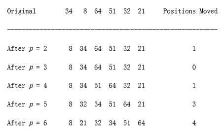
**figure 7.1** Insertion sort after each pass
```c
void insertion_sort(input_type a[], unsigned int n){

unsigned int j, p;

input_type tmp;

/*1*/ a[0] = MIN_DATA; /* sentinel */

/*2*/ for(p=2; p <= n; p++)
{

/*3*/ tmp = a[p];

/*4*/ for(j = p; tmp < a[j-1]; j--)

/*5*/ a[j] = a[j-1];


/*6*/ a[j] = tmp;

}

}
```
**figure 7.2** Insertion sort routine.

### Analysis of Insertion Sort

Because of the nested loops, each of which can take n iterations, insertion sort

is O(n2). Furthermore, this bound is tight, because input in reverse order can actually achieve this bound. A precise calculation shows that the test at line 4 can be executed at most p times for each value of p. Summing over all p gives a total of
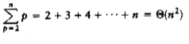
On the other hand, if the input is presorted, the running time is O(n), because the test in the inner for loop always fails immediately. Indeed, if the input is almost sorted (this term will be more rigorously defined in the next section), insertion sort will run quickly. Because of this wide variation, it is worth analyzing the average-case behavior of this algorithm. It turns out that the average case is (n2) for insertion sort, as well as for a variety of other sorting algorithms, as the next section shows.

## A Lower Bound for Simple Sorting Algorithms

An inversion in an array of numbers is any ordered pair (i, j) having the property that i < j but a[i] > a[j]. In the example of the last section, the input list 34, 8, 64, 51, 32, 21 had nine inversions, namely (34,8), (34,32), (34,21), (64,51), (64,32), (64,21), (51,32), (51,21) and (32,21). Notice that this is exactly the number of swaps that needed to be (implicitly) performed by insertion sort. This is always the case, because swapping two adjacent elements that are out of place removes exactly one inversion, and a sorted file has no inversions. Since there is O(n) other work involved in the algorithm, the running time of insertion sort is O(I + n), where I is the number of inversions in the original file. Thus, insertion sort runs in linear time if the number of inversions is O(n).

We can compute precise bounds on the average running time of insertion sort by computing the average number of inversions in a permutation. As usual, defining average is a difficult proposition. We will assume that there are no duplicate elements (if we allow duplicates, it is not even clear what the average number of duplicates is). Using this assumption, we can assume that the input is some permutation of the first n integers (since only relative ordering is important) and that all are equally likely. Under these assumptions, we have the following theorem:

**THEOREM 7.1.**

The average number of inversions in an array of n distinct numbers is n(n - 1)/4.

PROOF:

For any list, L, of numbers, consider Lr, the list in reverse order. The reverse list of the example is 21, 32, 51, 64, 34, 8. Consider any pair of two numbers in the list (x, y), with y > x. Clearly, in exactly one of L and Lr this ordered pair represents an inversion. The total number of these pairs in a list L and its reverse Lr is n(n - 1)/2. Thus, an average list has half this amount, or n(n - 1)/4 inversions.

This theorem implies that insertion sort is quadratic on average. It also provides a very strong lower bound about any algorithm that only exchanges adjacent elements.

**THEOREM 7.2.**

Any algorithm that sorts by exchanging adjacent elements requires (n2) time on average.

PROOF:

The average number of inversions is initially n(n - 1)/4 = (n2). Each swap removes only one inversion, so (n2) swaps are required.

This is an example of a lower-bound proof. It is valid not only for insertion sort, which performs adjacent exchanges implicitly, but also for other simple algorithms such as bubble sort and selection sort, which we will not describe here. In fact, it is valid over an entire class of sorting algorithms, including those undiscovered, that perform only adjacent exchanges. Because of this, this proof cannot be confirmed empirically. Although this lower-bound proof is rather simple, in general proving lower bounds is much more complicated than proving upper bounds and in some cases resembles voodoo.

This lower bound shows us that in order for a sorting algorithm to run in subquadratic, or o(n2), time, it must do comparisons and, in particular, exchanges between elements that are far apart. A sorting algorithm makes progress by eliminating inversions, and to run efficiently, it must eliminate more than just one inversion per exchange.

## Shellsort

Shellsort, named after its inventor, Donald Shell, was one of the first algorithms to break the quadratic time barrier, although it was not until several years after its initial discovery that a subquadratic time bound was proven. As suggested in the previous section, it works by comparing elements that are distant; the distance between comparisons decreases as the algorithm runs until the last phase, in which adjacent elements are compared. For this reason, Shellsort is sometimes referred to as diminishing increment sort.

Shellsort uses a sequence, h1, h2, . . . , ht, called the increment sequence. Any increment sequence will do as long as h1 = 1, but obviously some choices are better than others (we will discuss that question later). After a phase, using some increment hk, for every i, we have a[i] a[i+hk] (where this makes sense); all elements spaced hk apart are sorted. The file is then said to be hk-sorted. For example, **figure 7.3** shows an array after several phases of Shellsort. An important property of Shellsort (which we state without proof) is that an hk-sorted file that is then hk-1-sorted remains hk-sorted. If this were not the case, the algorithm would likely be of little value, since work done by early phases would be undone by later phases.

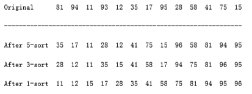
**figure 7.3** Shellsort after each pass

The general strategy to hk-sort is for each position, i, in hk + 1, hk + 2, . . ., n, place the element in the correct spot among i, i - hk, i - 2hk, etc. Although this does not affect the implementation, a careful examination shows that the action of an hk-sort is to perform an insertion sort on hk independent sub-arrays. This observation will be important when we analyze the running time of Shellsort.

A popular (but poor) choice for increment sequence is to use the sequence suggested by Shell: ht _n_/2 , and hk = _hk+1_/2 . **figure 7.4** contains a program that implements Shellsort using this sequence. We shall see later that there are increment sequences that give a significant improvement in the algorithm's running time.

The program in **figure 7.4** avoids the explicit use of swaps in the same manner as our implementation of insertion sort. Unfortunately, for Shellsort it is not possible to use a sentinel, and so the code in lines 3 through 7 is not quite as clean as the corresponding code in insertion sort (lines 3 through 5).

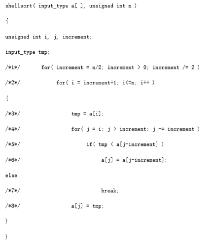

**figure 7.4** Shellsort routine using Shell's increments (better increments are possible)

### Worst-Case Analysis of Shellsort

Although Shellsort is simple to code, the analysis of its running time is quite another story. The running time of Shellsort depends on the choice of increment sequence, and the proofs can be rather involved. The average-case analysis of Shellsort is a long-standing open problem, except for the most trivial increment sequences. We will prove tight worst-case bounds for two particular increment sequences.

**THEOREM 7.3.**

The worst-case running time of Shellsort, using Shell's increments, is (n2).

PROOF:

The proof requires showing not only an upper bound on the worst-case running time but also showing that there exists some input that actually takes (n2) time to run. We prove the lower bound first, by constructing a bad case. First, we choose n to be a power of 2. This makes all the increments even, except for the last increment, which is 1. Now, we will give as input an array, input_data, with the n/2 largest numbers in the even positions and the n/2 smallest numbers in the odd positions. As all the increments except the last are even, when we come to the last pass, the n/2 largest numbers are still all in even positions and the n/2 smallest numbers are still all in odd positions. The ith smallest number (in/2) is thus in position 2i -1 before the beginning of the last pass. Restoring the ith element to its correct place requires moving it i -1 spaces in the array. Thus, to merely place the n/2 smallest elements in the correct place requires at least work. As an example, **figure 7.5** shows a bad (but not the worst) input when n = 16. The number of inversions remaining after the 2-sort is exactly 1 + 2 + 3 + 4 + 5 + 6 + 7 = 28; thus, the last pass will take considerable time.

To finish the proof, we show the upper bound of O(n2). As we have observed before, a pass with increment hk consists of hk insertion sorts of about n/hk elements. Since insertion sort is quadratic, the total cost of a pass is O(hk (n/hk) 2) = O(n2/hk). Summing over all passes gives a total bound of

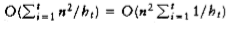

- Because the increments form a geometric series with common ratio 2, and the largest term in the series is

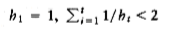

Thus we obtain a total bound of O(n2).

The problem with Shell's increments is that pairs of increments are not necessarily relatively prime, and thus the smaller increment can have little effect. Hibbard suggested a slightly different increment sequence, which gives better results in practice (and theoretically). His increments are of the form 1, 3, 7, . . . , 2k - 1. Although these increments are almost identical, the key difference is that consecutive increments have no common factors. We now analyze the worst-case running time of Shellsort for this increment sequence. The proof is rather complicated.

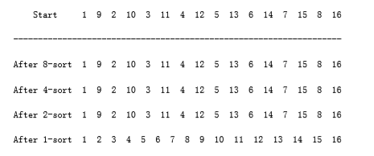

**figure 7.5** Bad case for Shellsort with Shell's increments

**THEOREM 7.4.**

The worst-case running time of Shellsort using Hibbard's increments is (n3/2).

PROOF:

We will prove only the upper bound and leave the proof of the lower bound as an exercise. The proof requires some well-known results from additive number theory. References to these results are provided at the end of the chapter.

For the upper bound, as before, we bound the running time of each pass and sum over all passes. For increments hk > n 1/2, we will use the bound O(n2/hk) from the previous theorem. Although this bound holds for the other increments, it is too large to be useful. Intuitively, we must take advantage of the fact that this increment sequence is special. What we need to show is that for any element ap in position p, when it is time to perform an hk-sort, there are only a few elements to the left of position p that are larger than ap.

When we come to hk-sort the input array, we know that it has already been hk+1- and hk+2-sorted. Prior to the hk-sort, consider elements in positions p and p - i, i < p. If i is a multiple of hk+1 or hk+2, then clearly a[p - i] < a[p]. We can say more, however. If i is expressible as a linear combination (in nonnegative integers) of hk+1 and hk+2, then a[p - i] < a[p]. As an example, when we come to 3-sort, the file is already 7- and 15-sorted. 52 is expressible as a linear combination of 7 and 15, because 52 = 1 * 7 + 3 * 15. Thus, a[100] cannot be larger than a[152] because a[100] a[107] a[122] a[137] a [152].

Now, hk+2 = 2hk +1 + 1, so hk +1 and hk +2 cannot share a common factor. In this case, it is possible to show that all integers that are at least as large as (hk+1 - 1)(hk+2 - 1) = 8h 2 k + 4hk can be expressed as a linear combination of hk+1 and hk+2 (see the reference at the end of the chapter).

This tells us that the body of the for loop at line 4 can be executed at most 8hk + 4 = O(hk) times for each of the n - hk positions. This gives a bound of O(nhk) per pass.

Using the fact that about half the increments satisfy , and assuming that t is even, the total running time is then Because both sums are geometric series, and since ,this simplifies to The average-case running time of Shellsort, using Hibbard's increments, is thought to be O(n5/4), based on simulations, but nobody has been able to prove this. Pratt has shown that the (n3/2) bound applies to a wide range of increment sequences.

Sedgewick has proposed several increment sequences that give an O(n4/3) worst- case running time (also achievable). The average running time is conjectured to be O(n7/6) for these increment sequences. Empirical studies show that these sequences perform significantly better in practice than Hibbard's. The best of these is the sequence {1, 5, 19, 41, 109, . . .}, in which the terms are either of the form 9 4i - 9 2i + 1 or 4i - 3 2i + 1. This is most easily implemented by placing these values in an array. This increment sequence is the best known in practice, although there is a lingering possibility that some increment sequence might exist that could give a significant improvement in the running time of Shellsort.

There are several other results on Shellsort that (generally) require difficult theorems from number theory and combinatorics and are mainly of theoretical interest. Shellsort is a fine example of a very simple algorithm with an extremely complex analysis.

The performance of Shellsort is quite acceptable in practice, even for n in the tens of thousands. The simplicity of the code makes it the algorithm of choice for sorting up to moderately large input.

## Heapsort

As mentioned in Chapter 6, priority queues can be used to sort in O(n log n) time. The algorithm based on this idea is known as heapsort and gives the best Big-Oh running time we have seen so far. In practice however, it is slower than a version of Shellsort that uses Sedgewick's increment sequence.

Recall, from Chapter 6, that the basic strategy is to build a binary heap of n elements. This stage takes O(n) time. We then perform n delete_min operations. The elements leave the heap smallest first, in sorted order. By recording these elements in a second array and then copying the array back, we sort n elements. Since each delete_min takes O(log n) time, the total running time is O(n log n).

The main problem with this algorithm is that it uses an extra array. Thus, the memory requirement is doubled. This could be a problem in some instances. Notice that the extra time spent copying the second array back to the first is only O (n), so that this is not likely to affect the running time significantly. The problem is space.

A clever way to avoid using a second array makes use of the fact that after each delete_min, the heap shrinks by 1. Thus the cell that was last in the heap can be used to store the element that was just deleted. As an example, suppose we have a heap with six elements. The first delete_min produces a1. Now the heap has only five elements, so we can place a1 in position 6. The next delete_min produces a2.Since the heap will now only have four elements, we can place a2 in position 5. Using this strategy, after the last delete_min the array will contain the elements in decreasing sorted order. If we want the elements in the more typical increasing sorted order, we can change the ordering property so that the parent has a larger key than the child. Thus we have a (max)heap.

In our implementation, we will use a (max)heap, but avoid the actual ADT for the purposes of speed. As usual, everything is done in an array. The first step builds the heap in linear time. We then perform n - 1 delete_maxes by swapping the last element in the heap with the first, decrementing the heap size, and percolating down. When the algorithm terminates, the array contains the elements in sorted order. For instance, consider the input sequence 31, 41, 59, 26, 53, 58, 97. The resulting heap is shown in **figure 7.6**.

**figure 7.7** shows the heap that results after the first delete_max. As the figures imply, the last element in the heap is 31; 97 has been placed in a part of the heap array that is technically no longer part of the heap. After 5 more delete_max operations, the heap will actually have only one element, but the elements left in the heap array will be in sorted order.

The code to perform heapsort is given in **figure 7.8**.

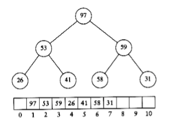

**figure 7.6** (Max) heap after build_heap phase

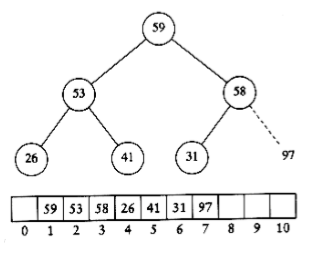

**figure 7.7** Heap after first delete_max

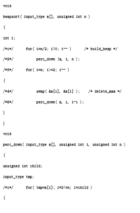

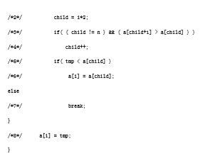

**figure 7.8** Heapsort

## Mergesort

We now turn our attention to mergesort. Mergesort runs in O(n log n) worst-case running time, and the number of comparisons used is nearly optimal. It is a fine example of a recursive algorithm. The fundamental operation in this algorithm is merging two sorted lists. Because the lists are sorted, this can be done in one pass through the input, if the output is put in a third list. The basic merging algorithm takes two input arrays a and b, an output array c, and three counters, aptr, bptr, and cptr, which are initially set to the beginning of their respective arrays. The smaller of a[aptr] and b[bptr] is copied to the next entry in c, and the appropriate counters are advanced. When either input list is exhausted, the remainder of the other list is copied to c. An example of how the merge routine works is provided for the following input.


If the array a contains 1, 13, 24, 26, and b contains 2, 15, 27, 38, then the algorithm proceeds as follows: First, a comparison is done between 1 and 2. 1 is added to c, and then 13 and 2 are compared.

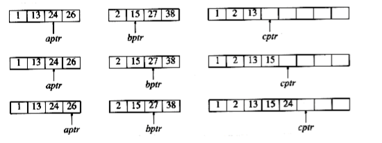

2 is added to c, and then 13 and 15 are compared.

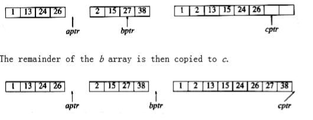

13 is added to c, and then 24 and 15 are compared. This proceeds until 26 and 27 are compared.

26 is added to c, and the a array is exhausted.

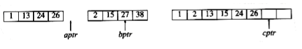

The remainder of the b array is then copied to c.

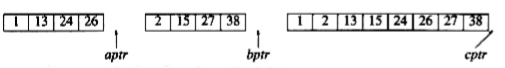

The time to merge two sorted lists is clearly linear, because at most n - 1 comparisons are made, where n is the total number of elements. To see this, note that every comparison adds an element to c, except the last comparison, which adds at least two.The mergesort algorithm is therefore easy to describe. If n = 1, there is only one element to sort, and the answer is at hand. Otherwise, recursively mergesort the first half and the second half. This gives two sorted halves, which can then be merged together using the merging algorithm described above. For instance, to sort the eight-element array 24, 13, 26, 1, 2, 27, 38, 15, we recursively sort the first four and last four elements, obtaining 1, 13, 24, 26, 2, 15, 27, 38. Then we merge the two halves as above, obtaining the final list 1, 2, 13, 15, 24, 26, 27, 38. This algorithm is a classic divide-and-conquer strategy. The problem is divided into smaller problems and solved recursively. The conquering phase consists of patching together the answers. Divide-and-conquer is a very powerful use of recursion that we will see many times.

An implementation of mergesort is provided in **figure 7.9**. The procedure called mergesort is just a driver for the recursive routine m_sort.

The merge routine is subtle. If a temporary array is declared locally for each recursive call of merge, then there could be log n temporary arrays active at any point. This could be fatal on a machine with small memory. On the other hand, if the merge routine dynamically allocates and frees the minimum amount of temporary memory, considerable time will be used by malloc. A close examination shows that since merge is the last line of m_sort, there only needs to be one temporary array active at any point. Further, we can use any part of the temporary array; we will use the same portion as the input array a. This allows the improvement described at the end of this section. **figure 7.10** implements the merge routine.

### Analysis of Mergesort

Mergesort is a classic example of the techniques used to analyze recursive routines. It is not obvious that mergesort can easily be rewritten without recursion (it can), so we have to write a recurrence relation for the running time. We will assume that n is a power of 2, so that we always split into even halves. For n = 1, the time to mergesort is constant, which we will denote by 1. Otherwise, the time to mergesort n numbers is equal to the time to do two recursive mergesorts of size n/2, plus the time to merge, which is linear. The equations below say this exactly:

T(1) = 1

T(n) = 2T(n/2) + n

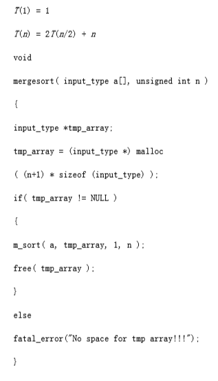

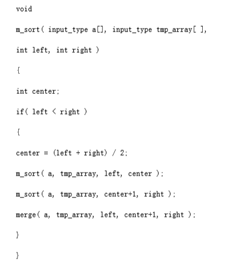

**figure 7.9** Mergesort routine

This is a standard recurrence relation, which can be solved several ways. We will show two methods. The first idea is to divide the recurrence relation through by n. The reason for doing this will become apparent soon. This yields

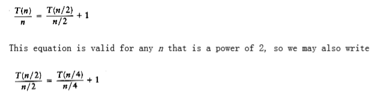
```
/* 1_pos = start of left half, r_pos = start of right half */
```
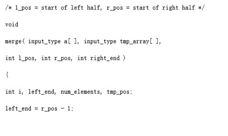
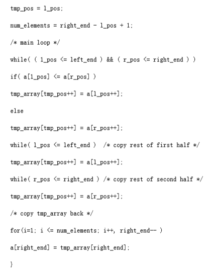
**figure 7.10** Merge routine and
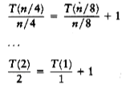
Now add up all the equations. This means that we add all of the terms on the left-hand side and set the result equal to the sum of all of the terms on the right-hand side. Observe that the term T(n/2)/(n/2) appears on both sides and thus cancels. In fact, virtually all the terms appear on both sides and cancel. This is called telescoping a sum. After everything is added, the final result is

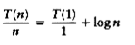

because all of the other terms cancel and there are log n equations, and so all the 1s at the end of these equations add up to log n. Multiplying through by n gives the final answer.

T(n) = n log n + n = O(n log n)

Notice that if we did not divide through by n at the start of the solutions, the sum would not telescope. This is why it was necessary to divide through by n. An alternative method is to substitute the recurrence relation continually on the right-hand side. We have T(n) = 2T(n/2) + n Since we can substitute n/2 into the main equation,

2T(n/2) = 2(2(T(n/4)) + n/2) = 4T(n/4) + n

we have T(n) = 4T(n/4) + 2n

Again, by substituting n/4 into the main equation, we see that

4T(n/4) = 4(2T(n/8)) + (n/4) = 8T(n/8) + n

So we have

T(n) = 8T(n/8) + 3n

Continuing in this manner, we obtain

T(n) = 2kT(n/2k) + k n

Using k = log n, we obtain

T(n) = nT(1) + n log n = n log n + n

The choice of which method to use is a matter of taste. The first method tends to produce scrap work that fits better on a standard sheet of paper, leading to fewer mathematical errors, but it requires a certain amount of experience to apply. The second method is more of a brute force approach.

Recall that we have assumed n = 2k. The analysis can be refined to handle cases when n is not a power of 2. The answer turns out to be almost identical (this is usually the case).

Although mergesort's running time is O(n log n), it is hardly ever used for main memory sorts. The main problem is that merging two sorted lists requires linear extra memory, and the additional work spent copying to the temporary array and back, throughout the algorithm, has the effect of slowing down the sort considerably. This copying can be avoided by judiciously switching the roles of a and tmp_array at alternate levels of the recursion. A variant of mergesort can also be implemented nonrecursively (Exercise 7.13), but even so, for serious internal sorting applications, the algorithm of choice is quicksort, which is described in the next section. Nevertheless, as we will see later in this chapter, the merging routine is the cornerstone of most external sorting algorithms.

## Quicksort

As its name implies, quicksort is the fastest known sorting algorithm in practice. Its average running time is O(n log n). It is very fast, mainly due to a very tight and highly optimized inner loop. It has O(n2) worst-case performance, but this can be made exponentially unlikely with a little effort. The quicksort algorithm is simple to understand and prove correct, although for many years it had the reputation of being an algorithm that could in theory be highly optimized but in practice was impossible to code correctly (no doubt because of FORTRAN). Like mergesort, quicksort is a divide-and-conquer recursive algorithm. The basic algorithm to sort an array S consists of the following four easy steps:

1. If the number of elements in S is 0 or 1, then return.

2. Pick any element v in S. This is called the pivot.

3. Partition S - {v} (the remaining elements in S) into two disjoint groups: S1 =
{x S - {v}| x v}, and S2 = {x S -{v}| x v}.

4. Return { quicksort(S1) followed by v followed by quicksort(S2)}.

Since the partition step ambiguously describes what to do with elements equal to the pivot, this becomes a design decision. Part of a good implementation is handling this case as efficiently as possible. Intuitively, we would hope that about half the keys that are equal to the pivot go into S1 and the other half into S2, much as we like binary search trees to be balanced.

**figure 7.11** shows the action of quicksort on a set of numbers. The pivot is chosen (by chance) to be 65. The remaining elements in the set are partitioned into two smaller sets. Recursively sorting the set of smaller numbers yields 0, 13, 26, 31, 43, 57 (by rule 3 of recursion). The set of large numbers is similarly sorted. The sorted arrangement of the entire set is then trivially obtained.

It should be clear that this algorithm works, but it is not clear why it is any faster than mergesort. Like mergesort, it recursively solves two subproblems and requires linear additional work (step 3), but, unlike mergesort, the subproblems are not guaranteed to be of equal size, which is potentially bad. The reason that quicksort is faster is that the partitioning step can actually be performed in place and very efficiently. This efficiency more than makes up for the lack of equal-sized recursive calls.

The algorithm as described so far lacks quite a few details, which we now fill in. There are many ways to implement steps 2 and 3; the method presented here is the result of extensive analysis and empirical study and represents a very efficient way to implement quicksort. Even the slightest deviations from this method can cause surprisingly bad results.

### Picking the Pivot

Although the algorithm as described works no matter which element is chosen as pivot, some choices are obviously better than others.
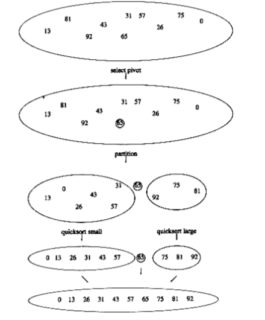
**figure 7.11** The steps of quicksort illustrated by example

**A Wrong Way**

The popular, uninformed choice is to use the first element as the pivot. This is acceptable if the input is random, but if the input is presorted or in reverse order, then the pivot provides a poor partition, because virtually all the elements go into S1 or S2. Worse, this happens consistently throughout the recursive calls. The practical effect is that if the first element is used as the pivot and the input is presorted, then quicksort will take quadratic time to do essentially nothing at all, which is quite embarrassing. Moreover, presorted input (or input with a large presorted section) is quite frequent, so using the first element as pivot is an absolutely horrible idea and should be discarded immediately. An alternative is choosing the larger of the first two distinct keys as pivot, but this has the same bad properties as merely choosing the first key. Do not use that pivoting strategy either.

**A Safe Maneuver**

A safe course is merely to choose the pivot randomly. This strategy is generally perfectly safe, unless the random number generator has a flaw (which is not as uncommon as you might think), since it is very unlikely that a random pivot would consistently provide a poor partition. On the other hand, random number generation is generally an expensive commodity and does not reduce the average running time of the rest of the algorithm at all.

**Median-of-Three Partitioning**

The median of a group of n numbers is the _n_/2 th largest number. The best choice of pivot would be the median of the file. Unfortunately, this is hard to calculate and would slow down quicksort considerably. A good estimate can be obtained by picking three elements randomly and using the median of these three as pivot. The randomness turns out not to help much, so the common course is to use as pivot the median of the left, right and center elements. For instance, with input 8, 1, 4, 9, 6, 3, 5, 2, 7, 0 as before, the left element is 8, the right element is 0 and the center (in position (_left_ + right)/2) element is 6. Thus, the pivot would be v = 6. Using median-of-three partitioning clearly eliminates the bad case for sorted input (the partitions become equal in this case) and actually reduces the running time of quicksort by about 5 percent.

### Partitioning Strategy

There are several partitioning strategies used in practice, but the one described here is known to give good results. It is very easy, as we shall see, to do this wrong or inefficiently, but it is safe to use a known method. The first step is to get the pivot element out of the way by swapping it with the last element. i starts at the first element and j starts at the next-to-last element. If the original input was the same as before, the following figure shows the current situation.
```
8 1 4 9 0 3 5 2 7 6

i j
```
For now we will assume that all the elements are distinct. Later on we will worry about what to do in the presence of duplicates. As a limiting case, our algorithm must do the proper thing if all of the elements are identical. It is surprising how easy it is to do the wrong thing.

What our partitioning stage wants to do is to move all the small elements to the left part of the array and all the large elements to the right part. "Small" and "large" are, of course, relative to the pivot.

While i is to the left of j, we move i right, skipping over elements that are smaller than the pivot. We move j left, skipping over elements that are larger than the pivot. When i and j have stopped, i is pointing at a large element and j is pointing at a small element. If i is to the left of j, those elements are swapped. The effect is to push a large element to the right and a small element to the left. In the example above, i would not move and j would slide over one place. The situation is as follows.
```
8 1 4 9 0 3 5 2 7 6

i j
```
We then swap the elements pointed to by i and j and repeat the process until i and j cross. After First Swap

----------------------------
```
2 1 4 9 0 3 5 8 7 6

i j

Before Second Swap
```
----------------------------
```
2 1 4 9 0 3 5 8 7 6

i j

After Second Swap
```
----------------------------
```
2 1 4 5 0 3 9 8 7 6

i j

Before Third Swap
```
----------------------------
```
2 1 4 5 0 3 9 8 7 6

j i
```
At this stage, i and j have crossed, so no swap is performed. The final part of the partitioning is to swap the pivot element with the element pointed to by i.

After Swap with Pivot

---------------------------------------
```
2 1 4 5 0 3 6 8 7 9

i pivot
```
When the pivot is swapped with i in the last step, we know that every element in a position p < i must be small. This is because either position p contained a small element to start with, or the large element originally in position p was replaced during a swap. A similar argument shows that elements in positions p > i must be large.

One important detail we must consider is how to handle keys that are equal to the pivot. The questions are whether or not i should stop when it sees a key equal to the pivot and whether or not j should stop when it sees a key equal to the pivot. Intuitively, i and j ought to do the same thing, since otherwise the partitioning step is biased. For instance, if i stops and j does not, then all keys that are equal to the pivot will wind up in S2.
 
To get an idea of what might be good, we consider the case where all the keys in the file are identical. If both i and j stop, there will be many swaps between identical elements. Although this seems useless, the positive effect is that i and j will cross in the middle, so when the pivot is replaced, the partition creates two nearly equal subfiles. The mergesort analysis tells us that the total running time would then be O(n log n).

If neither i nor j stop, and code is present to prevent them from running off the end of the array, no swaps will be performed. Although this seems good, a correct implementation would then swap the pivot into the last spot that i touched, which would be the next-to-last position (or last, depending on the exact implementation). This would create very uneven subfiles. If all the keys are identical, the running time is O(n2). The effect is the same as using the first element as a pivot for presorted input. It takes quadratic time to do nothing!

Thus, we find that it is better to do the unnecessary swaps and create even subfiles than to risk wildly uneven subfiles. Therefore, we will have both i and j stop if they encounter a key equal to the pivot. This turns out to be the only one of the four possibilities that does not take quadratic time for this input.

At first glance it may seem that worrying about a file of identical elements is silly. After all, why would anyone want to sort 5,000 identical elements? However, recall that quicksort is recursive. Suppose there are 100,000 elements, of which 5,000 are identical. Eventually, quicksort will make the recursive call on only these 5,000 elements. Then it really will be important to make sure that 5,000 identical elements can be sorted efficiently.

### Small Files

For very small files (n 20), quicksort does not perform as well as insertion sort. Furthermore, because quicksort is recursive, these cases will occur frequently. A common solution is not to use quicksort recursively for small files, but instead use a sorting algorithm that is efficient for small files, such as insertion sort. An even better idea is to leave the file slightly unsorted and finish up with insertion sort. This works well, because insertion sort is efficient for nearly sorted files. Using this strategy can actually save about 15 percent in the running time (over doing no cutoff at all). A good cutoff range is n = 10, although any cutoff between 5 and 20 is likely to produce similar results. This also saves nasty degenerate cases, such as taking the median of three elements when there are only one or two. Of course, if there is a bug in the basic quicksort routine, then the insertion sort will be very, very slow.

### Actual Quicksort Routines

The driver for quicksort is shown in **figure 7.12**.

The general form of the routines will be to pass the array and the range of the array (left and right) to be sorted. The first routine to deal with is pivot selection. The easiest way to do this is to sort a[left], a[right], and a[center] in place. This has the extra advantage that the smallest of the three winds up in a[left], which is where the partitioning step would put it anyway. The largest winds up in a[right], which is also the correct place, since it is larger than the pivot. Therefore, we can place the pivot in a[right - 1] and initialize i and j to left + 1 and right - 2 in the partition phase. Yet another benefit is that because a[left] is smaller than the pivot, it will act as a sentinel for j. Thus, we do not need to worry about j running past the end. Since i will stop on keys equal to the pivot, storing the pivot in a[right - 1] provides a sentinel for i. The code in **figure 7.13** does the median-of-three partitioning with all the side effects described. It may seem that it is only slightly inefficient to compute the pivot by a method that does not actually sort a[left], a[center], and a [right], but, surprisingly, this produces bad results (see Exercise 7.37).

The real heart of the quicksort routine is in **figure 7.14**. It includes the partitioning and recursive calls. There are several things worth noting in this implementation. Line 3 initializes i and j to 1 past their correct values, so that there are no special cases to consider. This initialization depends on the fact that median-of-three partitioning has some side effects; this program will not work if you try to use it without change with a simple pivoting strategy, because i and j start in the wrong place and there is no longer a sentinel for j.

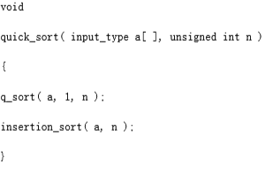

**figure 7.12** Driver for quicksort
```
/* Return median of left, center, and right. */

/* Order these and hide pivot */

input_type

median3(input_type a[], int left, int right)
{

int center;

center = (left + right) / 2;

if(a[left] > a[center])
swap(&a[left], &a[center]);

if(a[left] > a[right])
swap(&a[left], &a[right]);

if(a[center] > a[right])
swap(&a[center], &a[right]);

/* invariant: a[left] <= a[center] <= a[right] */

swap(&a[center], &a[right-1]); /* hide pivot */

return a[right-1]; /* return pivot */

}
```
**figure 7.13** Code to perform median-of-three partitioning

The swap at line 8 is sometimes written explicitly, for speed purposes. For the algorithm to be fast, it is necessary to force the compiler to compile this code in-line. Many compilers will do this automatically, if asked to, but for those that do not the difference can be significant.

Finally, lines 5 and 6 show why quicksort is so fast. The inner loop of the algorithm consists of an increment/decrement (by 1, which is fast), a test, and a jump. There is no extra juggling as there is in mergesort. This code is still surprisingly tricky. It is tempting to replace lines 3 through 9 with the statements in **figure 7.15**. This does not work, because there would be an infinite loop if a[i] = a[j] = pivot.

### Analysis of Quicksort

Like mergesort, quicksort is recursive, and hence, its analysis requires solving a recurrence formula. We will do the analysis for a quicksort, assuming a random pivot (no median-of-three partitioning) and no cutoff for small files. We will take T(0) = T(1) = 1, as in mergesort. The running time of quicksort is equal to the running time of the two recursive calls plus the linear time spent in the partition (the pivot selection takes only constant time). This gives the basic quicksort relation T(n) = T(i) + T(n - i - 1) + cn

**(7.1)**
```c
where i = |S1| is the number of elements in S1. We will look at three cases.

void q_sort(input_type a[], int left, int right)
{

int i, j;

input_type pivot;

/*1*/ if(left + CUTOFF <= right){

/*2*/ pivot = median3(a, left, right);

/*3*/ i=left; j=right-1;

/*4*/ for(; ;)
{

/*5*/ while(a[++i] < pivot);

/*6*/ while(a[--j] > pivot);

/*7*/ if(i < j)
/*8*/ swap(&a[i], &a[j]);

else
/*9*/ break;

}

/*10*/ swap(&a[i], &a[right-1]); /*restore pivot*/

/*11*/ q_sort(a, left, i-1);

/*12*/ q_sort(a, i+1, right);

}

}

**figure 7.14** Main quicksort routine

/*3*/ i=left+1; j=right-2;

/*4*/ for(; ;)
{

/*5*/ while(a[i] < pivot) i++;

/*6*/ while(a[j] > pivot) j--;

/*7*/ if(i < j)
/*8*/ swap(&a[i], &a[j]);

else
/*9*/ break;

}
```

**figure 7.15** A small change to quicksort, which breaks the algorithm

**Worst-Case Analysis**

The pivot is the smallest element, all the time. Then i = 0 and if we ignore T(0) = 1, which is insignificant, the recurrence is

T(n) = T(n - 1) + cn, n > 1

****(7.2)****

We telescope, using Equation **(7.2)** repeatedly. Thus

T(n -1) = T(n - 2) + c(n - 1)

****(7.3)****

T(n - 2) = T(n - 3) + c(n - 2)

****(7.4)****
...

T(2) = T(1) + c(2)

****(7.5)****

Adding up all these equations yields
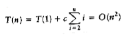
**(7.6)**

as claimed earlier.

**Best-Case Analysis**

In the best case, the pivot is in the middle. To simplify the math, we assume that the two subfiles are each exactly half the size of the original, and although this gives a slight overestimate, this is acceptable because we are only interested in a Big-Oh answer.

T(n) = 2T(n/2) + cn

**(7.7)**

Divide both sides of Equation **(7.7)** by n.
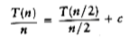
**(7.8)**

We will telescope using this equation.
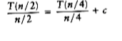
**(7.9)**
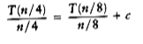
**(7.10)**
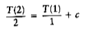
**(7.11)**

We add all the equations from **(7.7)** to **(7.11)** and note that there are log n of them:
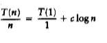
**(7.12)**

which yields

T(n) = cn log n + n = O(n log n)

**(7.13)**

Notice that this is the exact same analysis as mergesort, hence we get the same answer.

**Average-Case Analysis**

This is the most difficult part. For the average case, we assume that each of the file sizes for S1 is equally likely, and hence has probability 1/n. This assumption is actually valid for our pivoting and partitioning strategy, but it is not valid for some others. Partitioning strategies that do not preserve the randomness of the subfiles cannot use this analysis. Interestingly, these strategies seem to result in programs that take longer to run in practice. With this assumption, the average value of T(i), and hence T(n - i -1), is Equation **(7.1)** then becomes
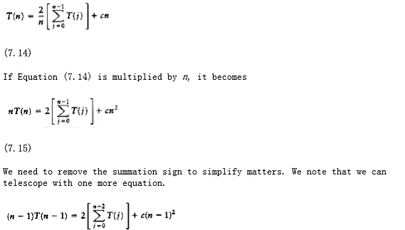

**(7.16)**

If we subtract **(7.16)** from **(7.15)**, we obtain

nT(n) - (n -1)T(n -1) = 2T(n -1) + 2cn -c

**(7.17)**

We rearrange terms and drop the insignificant -c on the right, obtaining

nT(n) = (n + 1)T(n -1) + 2cn

**(7.18)**

We now have a formula for T(n) in terms of T(n -1) only. Again the idea is to telescope, but Equation **(7.18)** is in the wrong form. Divide **(7.18)** by n(n + 1):

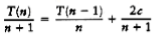

**(7.19)**

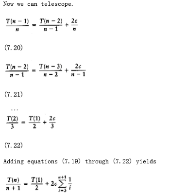

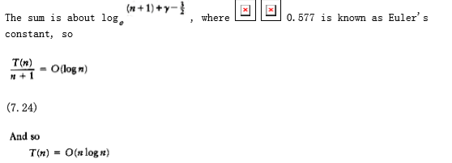

**(7.25)**

Although this analysis seems complicated, it really is not--the steps are natural once you have seen some recurrence relations. The analysis can actually be taken further. The highly optimized version that was described above has also been analyzed, and this result gets extremely difficult, involving complicated recurrences and advanced mathematics. The effects of equal keys has also been analyzed in detail, and it turns out that the code presented does the right thing.

### A Linear-Expected-Time Algorithm for Selection

Quicksort can be modified to solve the selection problem, which we have seen in chapters 1 and 6. Recall that by using a priority queue, we can find the kth largest (or smallest) element in O(n + k log n). For the special case of finding the median, this gives an O(n log n) algorithm.

Since we can sort the file in O(n log n) time, one might expect to obtain a better time bound for selection. The algorithm we present to find the kth smallest element in a set S is almost identical to quicksort. In fact, the first three steps are the same. We will call this algorithm quickselect. Let |Si| denote the number of elements in Si. The steps of quickselect are

1. If |S| = 1, then k = 1 and return the elements in S as the answer. If a cutoff for small files is being used and |S| CUTOFF, then sort S and return the kth smallest element.

2. Pick a pivot element, v S.

3. Partition S - {v} into S1 and S2, as was done with quicksort.

4. If k |S1|, then the kth smallest element must be in S1. In this case, return quickselect (S1, k). If k = 1 + |S1|, then the pivot is the kth smallest element and we can return it as the answer. Otherwise, the kth smallest element lies in S2, and it is the (k - |S1| - 1)st smallest element in S2. We make a recursive call and return quickselect (S2, k - |S1| - 1). In contrast to quicksort, quickselect makes only one recursive call instead of two. The worst case of quickselect is identical to that of quicksort and is O (n2). Intuitively, this is because quicksort's worst case is when one of S1 and S2 is empty; thus, quickselect is not really saving a recursive call. The average running time, however, is O(n). The analysis is similar to quicksort's and is left as an exercise.

The implementation of quickselect is even simpler than the abstract description might imply. The code to do this shown in **figure 7.16**. When the algorithm terminates, the kth smallest element is in position k. This destroys the original ordering; if this is not desirable, then a copy must be made.
```c
/* q_select places the kth smallest element in a[k]*/

void q_select(input_type a[], int k, int left, int right)
{

int i, j;

input_type pivot;

/*1*/ if(left + CUTOFF <= right){

/*2*/ pivot = median3(a, left, right);

/*3*/ i=left; j=right-1;

/*4*/ for(;;)
{

/*5*/ while(a[++i] < pivot);

/*6*/ while(a[--j] > pivot);

/*7*/ if (i < j)

/*8*/ swap(&a[i], &a[j]);

else
/*9*/ break;

}

/*10*/ swap(&a[i], &a[right-1]); /* restore pivot */

/*11*/ if(k < i)
/*12*/ q_select(a, k, left, i-1);

else
/*13*/ if(k > i)
/*14*/ q-select(a, k, i+1, right);

}

else
/*15*/ insert_sort(a, left, right);

}
```
**figure 7.16** Main quickselect routine

Using a median-of-three pivoting strategy makes the chance of the worst case occuring almost negligible. By carefully choosing the pivot, however, we can eliminate the quadratic worst case and ensure an O(n) algorithm. The overhead involved in doing this is considerable, so the resulting algorithm is mostly of theoretical interest. In Chapter 10, we will examine the linear-time worst-case algorithm for selection, and we shall also see an interesting technique of choosing the pivot that results in a somewhat faster selection algorithm in practice.

## Sorting Large Structures

Throughout our discussion of sorting, we have assumed that the elements to be sorted are simply integers. Frequently, we need to sort large structures by a certain key. For instance, we might have payroll records, with each record consisting of a name, address, phone number, financial information such as salary, and tax information. We might want to sort this information by one particular field, such as the name. For all of our algorithms, the fundamental operation is the swap, but here swapping two structures can be a very expensive operation, because the structures are potentially large. If this is the case, a practical solution is to have the input array contain pointers to the structures. We sort by comparing the keys the pointers point to, swapping pointers when necessary. This means that all the data movement is essentially the same as if we were sorting integers. This is known as indirect sorting; we can use this technique for most of the data structures we have described. This justifies our assumption that complex structures can be handled without tremendous loss efficiency.

## A General Lower Bound for Sorting

Although we have O(n log n) algorithms for sorting, it is not clear that this is as good as we can do. In this section, we prove that any algorithm for sorting that uses only comparisons requires (n log n) comparisons (and hence time) in the worst case, so that mergesort and heapsort are optimal to within a constant factor. The proof can be extended to show that (n log n) comparisons are required, even on average, for any sorting algorithm that uses only comparisons, which means that quicksort is optimal on average to within a constant factor. Specifically, we will prove the following result: Any sorting algorithm that uses only comparisons requires log n! comparisons in the worst case and log n! comparisons on average. We will assume that all n elements are distinct, since any sorting algorithm must work for this case.


### Decision Trees

A decision tree is an abstraction used to prove lower bounds. In our context, a decision tree is a binary tree. Each node represents a set of possible orderings, consistent with comparisons that have been made, among the elements. The results of the comparisons are the tree edges.

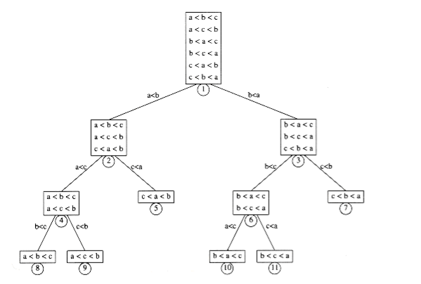

**figure 7.17** A decision tree for three-element insertion sort

The decision tree in **figure 7.17** represents an algorithm that sorts the three elements a, b, and c. The initial state of the algorithm is at the root. (We will use the terms state and node interchangeably.) No comparisons have been done, so all orderings are legal. The first comparison that this particular algorithm performs compares a and b. The two results lead to two possible states. If a < b, then only three possibilities remain. If the algorithm reaches node 2, then it will compare a and c. Other algorithms might do different things; a different algorithm would have a different decision tree. If a > c, the algorithm enters state 5. Since there is only one ordering that is consistent, the algorithm can terminate and report that it has completed the sort. If a < c, the algorithm cannot do this, because there are two possible orderings and it cannot possibly be sure which is correct. In this case, the algorithm will require one more comparison.

Every algorithm that sorts by using only comparisons can be represented by a decision tree. Of course, it is only feasible to draw the tree for extremely small input sizes. The number of comparisons used by the sorting algorithm is equal to the depth of the deepest leaf. In our case, this algorithm uses three comparisons in the worst case. The average number of comparisons used is equal to the average depth of the leaves. Since a decision tree is large, it follows that there must be some long paths. To prove the lower bounds, all that needs to be shown are some basic tree properties.

LEMMA 7.1.

Let T be a binary tree of depth d. Then T has at most 2d leaves.

PROOF:

The proof is by induction. If d = 0, then there is at most one leaf, so the basis is true. Otherwise, we have a root, which cannot be a leaf, and a left and right subtree, each of depth at most d - 1. By the induction hypothesis, they can each have at most 2d-1 leaves, giving a total of at most 2d leaves. This proves the lemma.

LEMMA 7.2.

A binary tree with L leaves must have depth at least log L .

PROOF:

Immediate from the preceding lemma.

**THEOREM 7.5.**

Any sorting algorithm that uses only comparisons between elements requires at

least log n! comparisons in the worst case.

PROOF:

A decision tree to sort n elements must have n! leaves. The theorem follows from the preceding lemma.

**THEOREM 7.6.**

Any sorting algorithm that uses only comparisons between elements requires (n log n) comparisons.

PROOF:

From the previous theorem, log n! comparisons are required.
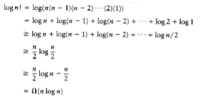
This type of lower-bound argument, when used to prove a worst-case result, is sometimes known as an information-theoretic lower bound. The general theorem says that if there are P different possible cases to distinguish, and the questions are of the form YES/NO, then log P questions are always required in some case by any algorithm to solve the problem. It is possible to prove a similar result for the average-case running time of any comparison-based sorting algorithm. This result is implied by the following lemma, which is left as an exercise: Any binary tree with L leaves has an average depth of at least log L.

## Bucket Sort

Although we proved in the previous section that any general sorting algorithm that uses only comparisons requires (n log n) time in the worst case, recall that it is still possible to sort in linear time in some special cases. A simple example is bucket sort. For bucket sort to work, extra information must be available. The input a1, a2, . . . , an must consist of only positive integers smaller than m. (Obviously extensions to this are possible.) If this is the case, then the algorithm is simple: Keep an array called count, of size m, which is initialized to all 0s. Thus, count has m cells, or buckets, which are initially empty. When ai is read, increment count[ai] by 1. After all the input is read, scan the count array, printing out a representation of the sorted list. This algorithm takes O(m + n); the proof is left as an exercise. If m is O(n), then the total is O(n).

Although this algorithm seems to violate the lower bound, it turns out that it does not because it uses a more powerful operation than simple comparisons. By incrementing the appropriate bucket, the algorithm essentially performs an m-way comparison in unit time. This is similar to the strategy used in extendible hashing (Section 5.6). This is clearly not in the model for which the lower bound was proven.

This algorithm does, however, question the validity of the model used in proving the lower bound. The model actually is a strong model, because a general-purpose sorting algorithm cannot make assumptions about the type of input it can expect to see, but must make decisions based on ordering information only. Naturally, if there is extra information available, we should expect to find a more efficient algorithm, since otherwise the extra information would be wasted.

Although bucket sort seems like much too trivial an algorithm to be useful, it turns out that there are many cases where the input is only small integers, so that using a method like quicksort is really overkill.

## External Sorting

So far, all the algorithms we have examined require that the input fit into main memory. There are, however, applications where the input is much too large to fit into memory. This section will discuss external sorting algorithms, which are designed to handle very large inputs.

### Why We Need New Algorithms

Most of the internal sorting algorithms take advantage of the fact that memory is directly addressable. Shellsort compares elements a[i] and a[i - hk] in one time unit. Heapsort compares elements a[i] and a[i * 2] in one time unit. Quicksort, with median-of-three partitioning, requires comparing a[left], a[center], and a [right] in a constant number of time units. If the input is on a tape, then all these operations lose their efficiency, since elements on a tape can only be accessed sequentially. Even if the data is on a disk, there is still a practical loss of efficiency because of the delay required to spin the disk and move the disk head.

To see how slow external accesses really are, create a random file that is large, but not too big to fit in main memory. Read the file in and sort it using an efficient algorithm. The time it takes to sort the input is certain to be insignificant compared to the time to read the input, even though sorting is an O (n log n) operation and reading the input is only O(n).

### Model for External Sorting

The wide variety of mass storage devices makes external sorting much more device- dependent than internal sorting. The algorithms that we will consider work on tapes, which are probably the most restrictive storage medium. Since access to an element on tape is done by winding the tape to the correct location, tapes can be efficiently accessed only in sequential order (in either direction).

We will assume that we have at least three tape drives to perform the sorting. We need two drives to do an efficient sort; the third drive simplifies matters. If only one tape drive is present, then we are in trouble: any algorithm will require (n2) tape accesses.

### The Simple Algorithm

The basic external sorting algorithm uses the merge routine from mergesort. Suppose we have four tapes, Ta1, Ta2, Tb1, Tb2, which are two input and two output tapes. Depending on the point in the algorithm, the a and b tapes are either input tapes or output tapes. Suppose the data is initially on Ta1. Suppose further that the internal memory can hold (and sort) m records at a time. A natural first step is to read m records at a time from the input tape, sort the records internally, and then write the sorted records alternately to Tb1 and Tb2.

We will call each set of sorted records a run. When this is done, we rewind all the tapes. Suppose we have the same input as our example for Shellsort.

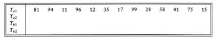

If m = 3, then after the runs are constructed, the tapes will contain the data indicated in the following figure.

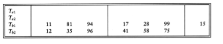

Now Tb1 and Tb2 contain a group of runs. We take the first run from each tape and merge them, writing the result, which is a run twice as long, onto Ta1. Then we take the next run from each tape, merge these, and write the result to Ta2. We continue this process, alternating between Ta1 and Ta2, until either Tb1 or Tb2 is empty. At this point either both are empty or there is one run left. In the latter case, we copy this run to the appropriate tape. We rewind all four tapes, and repeat the same steps, this time using the a tapes as input and the b tapes as output. This will give runs of 4m. We continue the process until we get one run of length n.

This algorithm will require log(n/m) passes, plus the initial run- constructing pass. For instance, if we have 10 million records of 128 bytes each, and four megabytes of internal memory, then the first pass will create 320 runs. We would then need nine more passes to complete the sort. Our example requires log 13/3 = 3 more passes, which are shown in the following figure.

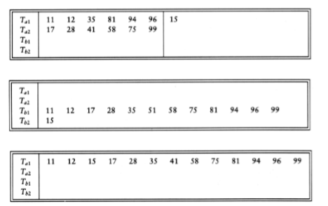

### Multiway Merge

If we have extra tapes, then we can expect to reduce the number of passes required to sort our input. We do this by extending the basic (two-way) merge to a k-way merge. Merging two runs is done by winding each input tape to the beginning of each run. Then the smaller element is found, placed on an output tape, and the appropriate input tape is advanced. If there are k input tapes, this strategy works the same way, the only difference being that it is slightly more complicated to find the smallest of the k elements. We can find the smallest of these elements by using a priority queue. To obtain the next element to write on the output tape, we perform a delete_min operation. The appropriate input tape is advanced, and if the run on the input tape is not yet completed, we insert the new element into the priority queue. Using the same example as before, we distribute the input onto the three tapes.

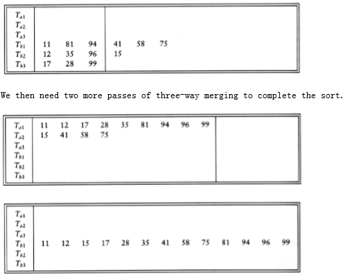

After the initial run construction phase, the number of passes required using k- way merging is logk(n/m) , because the runs get k times as large in each pass. For the example above, the formula is verified, since log3 13/3 = 2. If we have 10 tapes, then k = 5, and our large example from the previous section would require log5 320 = 4 passes.

### Polyphase Merge

The k-way merging strategy developed in the last section requires the use of 2k tapes. This could be prohibitive for some applications. It is possible to get by with only k + 1 tapes. As an example, we will show how to perform two-way merging using only three tapes. Suppose we have three tapes, T1, T2, and T3, and an input file on T1 that will produce 34 runs. One option is to put 17 runs on each of T2 and T3. We could then merge this result onto T1, obtaining one tape with 17 runs. The problem is that since all the runs are on one tape, we must now put some of these runs on T2 to perform another merge. The logical way to do this is to copy the first eight runs from T1 onto T2 and then perform the merge. This has the effect of adding an extra half pass for every pass we do.

An alternative method is to split the original 34 runs unevenly. Suppose we put 21 runs on T2 and 13 runs on T3. We would then merge 13 runs onto T1 before T3 was empty. At this point, we could rewind T1 and T3, and merge T1, with 13 runs, and T2, which has 8 runs, onto T3. We could then merge 8 runs until T2 was empty, which would leave 5 runs left on T1 and 8 runs on T3. We could then merge T1 and T3, and so on. The following table below shows the number of runs on each tape after each pass.

Run After After After After After After After

Const. T3 + T2 T1 + T2 T1 + T3 T2 + T3 T1 + T2 T1 + T3 T2 + T3

-------------------------------------------------------------------------

T1 0 13 5 0 3 1 0 1

T2 21 8 0 5 2 0 1 0

T3 13 0 8 3 0 2 1 0

The original distribution of runs makes a great deal of difference. For instance, if 22 runs are placed on T2, with 12 on T3, then after the first merge, we obtain 12 runs on T1 and 10 runs on T2. Afte another merge, there are 10 runs on T1 and 2 runs on T3. At this point the going gets slow, because we can only merge two sets of runs before T3 is exhausted. Then T1 has 8 runs and T2 has 2 runs. Again, we can only merge two sets of runs, obtaining T1 with 6 runs and T3 with 2runs. After three more passes, T2 has two runs and the other tapes are empty. We must copy one run to another tape, and then we can finish the merge. It turns out that the first distribution we gave is optimal. If the number of runs is a Fibonacci number Fn, then the best way to distribute them is to split them into two Fibonacci numbers Fn-1 and Fn-2. Otherwise, it is necessary to pad the tape with dummy runs in order to get the number of runs up to a Fibonacci number. We leave the details of how to place the initial set of runs on the tapes as an exercise.

We can extend this to a k-way merge, in which case we need kth order Fibonacci numbers for the distribution, where the kth order Fibonacci number is defined as F(k)(n) = F(k)(n - 1) + F(k)(n - 2) + + F(k)(n - k), with the appropriate initial conditions F(k)(n) = 0, 0 n k - 2, F(k)(k - 1) =1.

### Replacement Selection

The last item we will consider is construction of the runs. The strategy we have used so far is the simplest possible: We read as many records as possible and sort them, writing the result to some tape. This seems like the best approach possible, until one realizes that as soon as the first record is written to an output tape, the memory it used becomes available for another record. If the next record on the input tape is larger than the record we have just output, then it can be included in the run.

Using this observation, we can give an algorithm for producing runs. This technique is commonly referred to as replacement selection. Initially, m records are read into memory and placed in a priority queue. We perform a delete_min, writing the smallest record to the output tape. We read the next record from the input tape. If it is larger than the record we have just written, we can add it to the priority queue. Otherwise, it cannot go into the current run. Since the priority queue is smaller by one element, we can store this new element in the dead space of the priority queue until the run is completed and use the element for the next run. Storing an element in the dead space is similar to what is done in heapsort. We continue doing this until the size of the priority queue is zero, at which point the run is over. We start a new run by building a new priority queue, using all the elements in the dead space.

**figure 7.18** shows the run construction for the small example we have been using, with m = 3. Dead elements are indicated by an asterisk.

In this example, replacement selection produces only three runs, compared with the five runs obtained by sorting. Because of this, a three-way merge finishes in one pass instead of two. If the input is randomly distributed, replacement selection can be shown to produce runs of average length 2m. For our large example, we would expect 160 runs instead of 320 runs, so a five-way merge would require four passes. In this case, we have not saved a pass, although we might if we get lucky and have 125 runs or less. Since external sorts take so long, every pass saved can make a significant difference in the running time.

3 Elements In Heap Array Output Next Element Read

H[1] H[2] H[3]

---------------------------------------------------------------

Run 1 11 94 81 11 96

81 94 96 81 12*

94 96 12* 94 35*

96 35* 12* 96 17*

17* 35* 12* End of Run. Rebuild Heap

---------------------------------------------------------------

Run 2 12 35 17 12 99

17 35 99 17 28

28 99 35 28 58

35 99 58 35 41

41 99 58 41 75*

58 99 75* 58 end of tape

99 75* 99

75* End of Run. Rebuild Heap

---------------------------------------------------------------

Run 3 75 75

**figure 7.18** Example of run construction

As we have seen, it is possible for replacement selection to do no better than the standard algorithm. However, the input is frequently sorted or nearly sorted to start with, in which case replacement selection produces only a few very long runs. This kind of input is common for external sorts and makes replacement selection extremely valuable.

## Summary

For most general internal sorting applications, either insertion sort, Shellsort, or quicksort will be the method of choice, and the decision of which to use will depend mostly on the size of the input. **figure 7.19** shows the running time obtained for each algorithm on various file sizes.

The data was chosen to be random permutations of n integers, and the times given include only the actual time to sort. The code given in **figure 7.2** was used for insertion sort. Shellsort used the code in Section 7.4 modified to run with Sedgewick's increments. Based on literally millions of sorts, ranging in size from 100 to 25 million, the expected running time of Shellsort with these increments is conjectured to be O(n7/6). The heapsort routine is the same as in Section 7.5. Two versions of quicksort are given. The first uses a simple pivoting strategy and does not do a cutoff. Fortunately, the input files were random. The second uses median-of-three partitioning and a cutoff of ten. Further optimizations were possible. We could have coded the median-of-three routine in-line instead of using a function, and we could have written quicksort nonrecursively. There are some other optimizations to the code that are fairly tricky to implement, and of course we could have used an assembly language. We have made an honest attempt to code all routines efficiently, but of course the performance can vary somewhat from machine to machine.

The highly optimized version of quicksort is as fast as Shellsort even for very small input sizes. The improved version of quicksort still has an O(n2) worst case (one exercise asks you to construct a small example), but the chances of this worst case appearing are so negligible as to not be a factor. If you need to sort large files, quicksort is the method of choice. But never, ever, take the easy way out and use the first element as pivot. It is just not safe to assume that the input will be random. If you do not want to worry about this, use Shellsort. Shellsort will give a small performance penalty but could also be acceptable, especially if simplicity is required. Its worst case is only O(n4/3); the chance of that worst case occuring is likewise negligible.

Heapsort, although an O (n log n) algorithm with an apparently tight inner loop, is slower than Shellsort. A close examination of the algorithm reveals that in order to move data, heapsort does two comparisons. Carlsson has analyzed an improvement suggested by Floyd that moves data with essentially only one comparison, but implementing this improvement makes the code somewhat longer. We leave it to the reader to decide whether the extra coding effort is worth the increased speed (Exercise 7.39).

Insertion Sort Shellsort Heapsort Quicksort Quicksort(opt.)

n O(n2) O(n7/6) O(n log n) O(n log n) O(n log n)

---------------------------------------------------------------------------

10 0.00044 0.00041 0.00057 0.00052 .00046

100 0.00675 0.00171 0.00420 0.00284 .00244

1000 0.59564 0.02927 0.05565 0.03153 .02587

10000 58.864 0.42998 0.71650 0.36765 .31532

100000 NA 5.7298 8.8591 4.2298 3.5882

1000000 NA 71.164 104.68 47.065 41.282

**figure 7.19** Comparison of different sorting algorithms (all times are in seconds)

Insertion sort is useful only for small files or very nearly sorted files. We have not included mergesort, because its performance is not as good as quicksort for main memory sorts and it is not any simpler to code. We have seen, however, that merging is the central idea of external sorts.

## Exercises

7.1 Sort the sequence 3, 1, 4, 1, 5, 9, 2, 6, 5 using insertion sort.

7.2 What is the running time of insertion sort if all keys are equal?

7.3 Suppose we exchange elements a[i] and a[i + k], which were originally out of order. Prove that at least 1 and at most 2k - 1 inversions are removed.

7.4 Show the result of running Shellsort on the input 9, 8, 7, 6, 5, 4, 3, 2, 1 using the increments { 1, 3, 7 }.

7.5 What is the running time of Shellsort using the two-increment sequence 1, 2 }?

7.6 *a. Prove that the running time of Shellsort is (n2) using increments of the form 1, c, c2, ..., ci for any integer c.

**b. Prove that for these increments, the average running time is (n3/2).

*7.7 Prove that if a k-sorted file is then h-sorted, it remains k-sorted.

**7.8 Prove that the running time of Shellsort, using the increment sequence suggested by Hibbard, is (n3/2) in the worst case. Hint: You can prove the bound by considering the special case of what Shellsort does when all elements are either 0 or 1. Set input_data[i] = 1 if i is expressible as a linear combination of ht, ht-1, ..., h t/2 +1 and 0 otherwise.

7.9 Determine the running time of Shellsort for

a. sorted input

*b. reverse-ordered input

7.10 Show how heapsort processes the input 142, 543, 123, 65, 453, 879, 572, 434, 111, 242, 811, 102.

7.11 a. What is the running time of heapsort for presorted input?

**b. Is there any input for which heapsort runs in o(n log n) (in other words, are there any particularly good inputs for heapsort)?

7.12 Sort 3, 1, 4, 1, 5, 9, 2, 6 using mergesort.

7.13 How would you implement mergesort without using recursion?

7.14 Determine the running time of mergesort for

a. sorted input

b. reverse-ordered input

c. random input

7.15 In the analysis of mergesort, constants have been disregarded. Prove that the number of comparisons used in the worst case by mergesort is n log n - 2 log n + 1.

7.16 Sort 3, 1, 4, 1, 5, 9, 2, 6, 5, 3, 5 using quicksort with median-of-three partitioning and a cutoff of 3.

7.17 Using the quicksort implementation in this chapter, determine the running time of quicksort for

a. sorted input

b. reverse-ordered input

c. random input

7.18 Repeat Exercise 7.17 when the pivot is chosen as

a. the first element

b. the largest of the first two nondistinct keys

c. a random element

*d. the average of all keys in the set

7.19 a. for the quicksort implementation in this chapter, what is the running time when all keys are equal?

b. Suppose we change the partitioning strategy so that neither i nor j stops when an element with the same key as the pivot is found. What fixes need to be made in the code to guarantee that quicksort works, and what is the running time, when all keys are equal?

c. Suppose we change the partitioning strategy so that i stops at an element with the same key as the pivot, but j does not stop in a similar case. What fixes need to be made in the code to guarantee that quicksort works, and when all keys are equal, what is the running time of quicksort?

7.20 Suppose we choose the middle key as pivot. Does this make it unlikely that quicksort will require quadratic time?

7.21 Construct a permutation of 20 elements that is as bad as possible for quicksort using median-of-three partitioning and a cutoff of 3.

7.22 Write a program to implement the selection algorithm.

7.23 Solve the following recurrence: .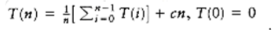

7.24 A sorting algorithm is stable if elements with equal keys are left in the same order as they occur in the input. Which of the sorting algorithms in this chapter are stable and which are not? Why?

7.25 Suppose you are given a sorted list of n elements followed by â(n) randomly ordered elements. How would you sort the entire list if

a. â(n) =O(1)?

b. â(n) =O(log n)?
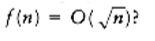

*d. How large can â(n) be for the entire list still to be sortable in O(n) time?

7.26 Prove that any algorithm that finds an element x in a sorted list of n elements requires

(log n) comparisons.

7.27 Using Stirling's formula,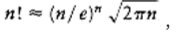 , give a precise estimate for log n !.

7.28 *a. In how many ways can two sorted arrays of n elements be merged?

*b. Give a nontrivial lower bound on the number of comparisons required to merge two sorted lists of n elements.

7.29 Prove that sorting n elements with integer keys in the range 1 key m takes O(m + n) time using bucket sort.

7.30 Suppose you have an array of n elements containing only two distinct keys, true and false. Give an O(n) algorithm to rearrange the list so that all false elements precede the true elements. You may use only constant extra space.

7.31 Suppose you have an array of n elements, containing three distinct keys, true, false, and maybe. Give an O(n) algorithm to rearrange the list so that all false elements precede maybe elements, which in turn precede true elements. You may use only constant extra space.

7.32 a. Prove that any comparison-based algorithm to sort 4 elements requires 5 comparisons.

b. Give an algorithm to sort 4 elements in 5 comparisons.

7.33 a. Prove that 7 comparisons are required to sort 5 elements using any comparison-based algorithm.

*b. Give an algorithm to sort 5 elements with 7 comparisons.

7.34 Write an efficient version of Shellsort and compare performance when the following increment sequences are used:

a. Shell's original sequence

b. Hibbard's increments
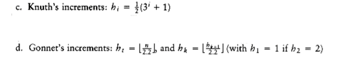
e. Sedgewick's increments.

7.35 Implement an optimized version of quicksort and experiment with combinations of the following:

a. Pivot: first element, middle element, random element, median of three, median of five.

b. Cutoff values from 0 to 20.

7.36 Write a routine that reads in two alphabetized files and merges them together, forming a third, alphabetized, file.

7.37 Suppose we implement the median of three routine as follows: Find the median of a[left], a [center], a[right], and swap it with a[right]. Proceed with the normal partitioning step starting i at left and j at right - 1 (instead of left + 1 and right - 2). Assume that a [0] = MIN_DATA, so that sentinels are present.

a. Suppose the input is 2,3,4, ...,n -1, n, 1. What is the running time of this version of quicksort?

b. Suppose the input is in reverse order. What is the running time of this version of quicksort?

7.38 Prove that any comparison-based sorting algorithm requires (n log n) comparisons on average.

7.39 Consider the following strategy for percolate_down. We have a hole at node X. The normal routine is to compare X's children and then move the child up to X if it is larger (in the case of a (max)heap) than the element we are trying to place, thereby pushing the hole down; we stop when it is safe to place the new element in the hole. The alternate strategy is to move elements up and the hole down as far as possible, without testing whether the new cell can be inserted. This would place the new cell in a leaf and probably violate the heap order; to fix the heap order, percolate the new cell up in the normal manner. Write a routine to include this idea, and compare the running time with a standard implementation of heapsort.

7.40 Propose an algorithm to sort a large file using only two tapes.

## References

Knuth's book [10] is a comprehensive, though somewhat dated, reference for sorting. Gonnet and Baeza-Yates [4] has some more recent results, as well as a huge bibliography. The original paper detailing Shellsort is [21]. The paper by Hibbard [5] suggested the use of the increments 2k - 1 and tightened the code by avoiding swaps. **THEOREM 7.4.**is from [12]. Pratt's lower bound, which uses a more complex method than that suggested in the text, can be found in [14]. Improved increment sequences and upper bounds appear in [9], [20], and [23]; matching lower bounds have been shown in [24]. A recent unpublished result by Poonen shows that no increment sequence gives an O(n log n) worst-case running time. An identical result was obtained independently and appears in [13]. The average-case running time for Shellsort is still unresolved. Yao [26] has performed an extremely complex analysis for the three-increment case. The result has yet to be extended to more increments. Experiments with various increment sequences appear in [22].

Heapsort was invented by Williams [25]; Floyd [1] provided the linear-time algorithm for heap construction. The analysis of its average case has only recently been obtained [15].

An exact average-case analysis of mergesort has been claimed in [3]; the paper detailing the results is forthcoming. An algorithm to perform merging in linear time without extra space is described in [8].

Quicksort is from Hoare [6]. This paper analyzes the basic algorithm, describes most of the improvements, and includes the selection algorithm. A detailed analysis and empirical study was the subject of Sedgewick's dissertation [19]. Many of the important results appear in the three papers [16], [17], and [18].

Decision trees and sorting optimality are discussed in Ford and Johnson [2]. This paper also provides an algorithm that almost meets the lower bound in terms of number of comparisons (but not other operations). This algorithm was eventually shown to be slightly suboptimal by Manacher [11].

External sorting is covered in detail in [10]. Stable sorting, described in Exercise 7.24, has been addressed by Horvath [7].

1. R. W. Floyd, "Algorithm 245: Treesort 3," Communications of the ACM 7 (1964), 701.

2. L. R. Ford and S. M. Johnson, "A Tournament Problem," American Mathematics Monthly 66 (1959), 387-389.

3. M. Golin and R. Sedgewick, "Exact Analysis of Mergesort," Fourth SIAM Conference on Discrete Mathematics, 1988.

4. G. H. Gonnet and R. Baeza-Yates, Handbook of Algorithms and Data Structures, second edition, Addison-Wesley, Reading, MA, 1991.

5. T. H. Hibbard, "An Empirical Study of Minimal Storage Sorting," Communications of the ACM 6 (1963), 206-213.

6. C. A. R. Hoare, "Quicksort," Computer Journal 5 (1962), 10-15.

7. E. C. Horvath, "Stable Sorting in Asymptotically Optimal Time and Extra Space," Journal of the ACM 25 (1978), 177-199.

8. B. Huang and M. Langston, "Practical In-place Merging," Communications of the ACM 31 (1988), 348-352.

9. J. Incerpi and R. Sedgewick, "Improved Upper Bounds on Shellsort," Journal of Computer and System Sciences 31 (1985), 210-224.

10. D. E. Knuth, The Art of Computer Programming. Volume 3: Sorting and Searching, second printing, Addison-Wesley, Reading, MA, 1975.

11. G. K. Manacher, "The Ford-Johnson Sorting Algorithm Is Not Optimal," Journal of the ACM 26 (1979), 441-456.

12. A. A. Papernov and G. V. Stasevich, "A Method of Information Sorting in Computer Memories," Problems of Information Transmission 1 (1965), 63-75.

13. C. G. Plaxton and T. Suel, "Improved Lower Bounds for Shellsort," Proceedings of the Thirty- third Annual IEEE Symposium on the Foundations of Computer Science, (1992).

14. V. R. Pratt, Shellsort and Sorting Networks, Garland Publishing, New York, 1979. (Originally presented as the author's Ph.D. thesis, Stanford University, 1971.)

15. R. Schaffer and R. Sedgewick, "The Analysis of Heapsort," Journal of Algorithms, to appear.

16. R. Sedgewick, "Quicksort with Equal Keys,"SIAM Journal on Computing 6 (1977), 240-267.

17. R. Sedgewick, "The Analysis of Quicksort Programs," Acta Informatica 7 (1977), 327-355.

18. R. Sedgewick, "Implementing Quicksort Programs," Communications of the ACM 21 (1978), 847- 857.

19. R. Sedgewick, Quicksort, Garland Publishing, New York, 1978. (Originally presented as the author's Ph.D. thesis, Stanford University, 1975.)

20. R. Sedgewick, "A New Upper Bound for Shellsort," Journal of Algorithms 2 (1986), 159-173.

21. D. L. Shell, "A High-Speed Sorting Procedure," Communications of the ACM 2 (1959), 30-32.

22. M. A. Weiss, "Empirical Results on the Running Time of Shellsort," Computer Journal 34 (1991), 88-91.

23. M. A. Weiss and R. Sedgewick, "More On Shellsort Increment Sequences," Information Processing Letters 34 (1990), 267-270.

24. M. A. Weiss and R. Sedgewick, "Tight Lower Bounds for Shellsort," Journal of Algorithms 11 (1990), 242-251.

25. J. W. J. Williams, "Algorithm 232: Heapsort," Communications of the ACM 7 (1964), 347-348.

26. A. C. Yao, "An Analysis of (h, k, 1) Shellsort," Journal of Algorithms 1 (1980), 14-50.

