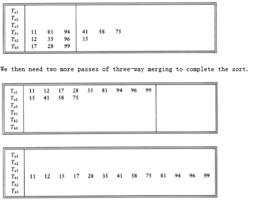

## External Sorting

So far, all the algorithms we have examined require that the input fit into main memory. There are, however, applications where the input is much too large to fit into memory. This section will discuss external sorting algorithms, which are designed to handle very large inputs.

### Why We Need New Algorithms

Most of the internal sorting algorithms take advantage of the fact that memory is directly addressable. Shellsort compares elements a[i] and a[i - hk] in one time unit. Heapsort compares elements a[i] and a[i * 2] in one time unit. Quicksort, with median-of-three partitioning, requires comparing a[left], a[center], and a [right] in a constant number of time units. If the input is on a tape, then all these operations lose their efficiency, since elements on a tape can only be accessed sequentially. Even if the data is on a disk, there is still a practical loss of efficiency because of the delay required to spin the disk and move the disk head.

To see how slow external accesses really are, create a random file that is large, but not too big to fit in main memory. Read the file in and sort it using an efficient algorithm. The time it takes to sort the input is certain to be insignificant compared to the time to read the input, even though sorting is an O (n log n) operation and reading the input is only O(n).

### Model for External Sorting

The wide variety of mass storage devices makes external sorting much more device- dependent than internal sorting. The algorithms that we will consider work on tapes, which are probably the most restrictive storage medium. Since access to an element on tape is done by winding the tape to the correct location, tapes can be efficiently accessed only in sequential order (in either direction).

We will assume that we have at least three tape drives to perform the sorting. We need two drives to do an efficient sort; the third drive simplifies matters. If only one tape drive is present, then we are in trouble: any algorithm will require (n2) tape accesses.

### The Simple Algorithm

The basic external sorting algorithm uses the merge routine from mergesort. Suppose we have four tapes, Ta1, Ta2, Tb1, Tb2, which are two input and two output tapes. Depending on the point in the algorithm, the a and b tapes are either input tapes or output tapes. Suppose the data is initially on Ta1. Suppose further that the internal memory can hold (and sort) m records at a time. A natural first step is to read m records at a time from the input tape, sort the records internally, and then write the sorted records alternately to Tb1 and Tb2.

We will call each set of sorted records a run. When this is done, we rewind all the tapes. Suppose we have the same input as our example for Shellsort.

If m = 3, then after the runs are constructed, the tapes will contain the data indicated in the following figure.

Now Tb1 and Tb2 contain a group of runs. We take the first run from each tape and merge them, writing the result, which is a run twice as long, onto Ta1. Then we take the next run from each tape, merge these, and write the result to Ta2. We continue this process, alternating between Ta1 and Ta2, until either Tb1 or Tb2 is empty. At this point either both are empty or there is one run left. In the latter case, we copy this run to the appropriate tape. We rewind all four tapes, and repeat the same steps, this time using the a tapes as input and the b tapes as output. This will give runs of 4m. We continue the process until we get one run of length n.

This algorithm will require log(n/m) passes, plus the initial run- constructing pass. For instance, if we have 10 million records of 128 bytes each, and four megabytes of internal memory, then the first pass will create 320 runs. We would then need nine more passes to complete the sort. Our example requires log 13/3 = 3 more passes, which are shown in the following figure.

### Multiway Merge

If we have extra tapes, then we can expect to reduce the number of passes required to sort our input. We do this by extending the basic (two-way) merge to a k-way merge. Merging two runs is done by winding each input tape to the beginning of each run. Then the smaller element is found, placed on an output tape, and the appropriate input tape is advanced. If there are k input tapes, this strategy works the same way, the only difference being that it is slightly more complicated to find the smallest of the k elements. We can find the smallest of these elements by using a priority queue. To obtain the next element to write on the output tape, we perform a delete_min operation. The appropriate input tape is advanced, and if the run on the input tape is not yet completed, we insert the new element into the priority queue. Using the same example as before, we distribute the input onto the three tapes.

After the initial run construction phase, the number of passes required using k- way merging is logk(n/m) , because the runs get k times as large in each pass. For the example above, the formula is verified, since log3 13/3 = 2. If we have 10 tapes, then k = 5, and our large example from the previous section would require log5 320 = 4 passes.

### Polyphase Merge

The k-way merging strategy developed in the last section requires the use of 2k tapes. This could be prohibitive for some applications. It is possible to get by with only k + 1 tapes. As an example, we will show how to perform two-way merging using only three tapes. Suppose we have three tapes, T1, T2, and T3, and an input file on T1 that will produce 34 runs. One option is to put 17 runs on each of T2 and T3. We could then merge this result onto T1, obtaining one tape with 17 runs. The problem is that since all the runs are on one tape, we must now put some of these runs on T2 to perform another merge. The logical way to do this is to copy the first eight runs from T1 onto T2 and then perform the merge. This has the effect of adding an extra half pass for every pass we do.

An alternative method is to split the original 34 runs unevenly. Suppose we put 21 runs on T2 and 13 runs on T3. We would then merge 13 runs onto T1 before T3 was empty. At this point, we could rewind T1 and T3, and merge T1, with 13 runs, and T2, which has 8 runs, onto T3. We could then merge 8 runs until T2 was empty, which would leave 5 runs left on T1 and 8 runs on T3. We could then merge T1 and T3, and so on. The following table below shows the number of runs on each tape after each pass.

Run After After After After After After After

Const. T3 + T2 T1 + T2 T1 + T3 T2 + T3 T1 + T2 T1 + T3 T2 + T3

-------------------------------------------------------------------------

T1 0 13 5 0 3 1 0 1

T2 21 8 0 5 2 0 1 0

T3 13 0 8 3 0 2 1 0

The original distribution of runs makes a great deal of difference. For instance, if 22 runs are placed on T2, with 12 on T3, then after the first merge, we obtain 12 runs on T1 and 10 runs on T2. Afte another merge, there are 10 runs on T1 and 2 runs on T3. At this point the going gets slow, because we can only merge two sets of runs before T3 is exhausted. Then T1 has 8 runs and T2 has 2 runs. Again, we can only merge two sets of runs, obtaining T1 with 6 runs and T3 with 2runs. After three more passes, T2 has two runs and the other tapes are empty. We must copy one run to another tape, and then we can finish the merge. It turns out that the first distribution we gave is optimal. If the number of runs is a Fibonacci number Fn, then the best way to distribute them is to split them into two Fibonacci numbers Fn-1 and Fn-2. Otherwise, it is necessary to pad the tape with dummy runs in order to get the number of runs up to a Fibonacci number. We leave the details of how to place the initial set of runs on the tapes as an exercise.

We can extend this to a k-way merge, in which case we need kth order Fibonacci numbers for the distribution, where the kth order Fibonacci number is defined as F(k)(n) = F(k)(n - 1) + F(k)(n - 2) + + F(k)(n - k), with the appropriate initial conditions F(k)(n) = 0, 0 n k - 2, F(k)(k - 1) =1.

### Replacement Selection

The last item we will consider is construction of the runs. The strategy we have used so far is the simplest possible: We read as many records as possible and sort them, writing the result to some tape. This seems like the best approach possible, until one realizes that as soon as the first record is written to an output tape, the memory it used becomes available for another record. If the next record on the input tape is larger than the record we have just output, then it can be included in the run.

Using this observation, we can give an algorithm for producing runs. This technique is commonly referred to as replacement selection. Initially, m records are read into memory and placed in a priority queue. We perform a delete_min, writing the smallest record to the output tape. We read the next record from the input tape. If it is larger than the record we have just written, we can add it to the priority queue. Otherwise, it cannot go into the current run. Since the priority queue is smaller by one element, we can store this new element in the dead space of the priority queue until the run is completed and use the element for the next run. Storing an element in the dead space is similar to what is done in heapsort. We continue doing this until the size of the priority queue is zero, at which point the run is over. We start a new run by building a new priority queue, using all the elements in the dead space.

**figure 7.18** shows the run construction for the small example we have been using, with m = 3. Dead elements are indicated by an asterisk.

In this example, replacement selection produces only three runs, compared with the five runs obtained by sorting. Because of this, a three-way merge finishes in one pass instead of two. If the input is randomly distributed, replacement selection can be shown to produce runs of average length 2m. For our large example, we would expect 160 runs instead of 320 runs, so a five-way merge would require four passes. In this case, we have not saved a pass, although we might if we get lucky and have 125 runs or less. Since external sorts take so long, every pass saved can make a significant difference in the running time.

3 Elements In Heap Array Output Next Element Read

H[1] H[2] H[3]

---------------------------------------------------------------

Run 1 11 94 81 11 96

81 94 96 81 12*

94 96 12* 94 35*

96 35* 12* 96 17*

17* 35* 12* End of Run. Rebuild Heap

---------------------------------------------------------------

Run 2 12 35 17 12 99

17 35 99 17 28

28 99 35 28 58

35 99 58 35 41

41 99 58 41 75*

58 99 75* 58 end of tape

99 75* 99

75* End of Run. Rebuild Heap

---------------------------------------------------------------

Run 3 75 75

**figure 7.18** Example of run construction

As we have seen, it is possible for replacement selection to do no better than the standard algorithm. However, the input is frequently sorted or nearly sorted to start with, in which case replacement selection produces only a few very long runs. This kind of input is common for external sorts and makes replacement selection extremely valuable.
