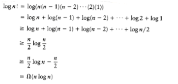

## A General Lower Bound for Sorting

Although we have O(n log n) algorithms for sorting, it is not clear that this is as good as we can do. In this section, we prove that any algorithm for sorting that uses only comparisons requires (n log n) comparisons (and hence time) in the worst case, so that mergesort and heapsort are optimal to within a constant factor. The proof can be extended to show that (n log n) comparisons are required, even on average, for any sorting algorithm that uses only comparisons, which means that quicksort is optimal on average to within a constant factor. Specifically, we will prove the following result: Any sorting algorithm that uses only comparisons requires log n! comparisons in the worst case and log n! comparisons on average. We will assume that all n elements are distinct, since any sorting algorithm must work for this case.

### Decision Trees

A decision tree is an abstraction used to prove lower bounds. In our context, a decision tree is a binary tree. Each node represents a set of possible orderings, consistent with comparisons that have been made, among the elements. The results of the comparisons are the tree edges.

**figure 7.17** A decision tree for three-element insertion sort

The decision tree in **figure 7.17** represents an algorithm that sorts the three elements a, b, and c. The initial state of the algorithm is at the root. (We will use the terms state and node interchangeably.) No comparisons have been done, so all orderings are legal. The first comparison that this particular algorithm performs compares a and b. The two results lead to two possible states. If a < b, then only three possibilities remain. If the algorithm reaches node 2, then it will compare a and c. Other algorithms might do different things; a different algorithm would have a different decision tree. If a > c, the algorithm enters state 5. Since there is only one ordering that is consistent, the algorithm can terminate and report that it has completed the sort. If a < c, the algorithm cannot do this, because there are two possible orderings and it cannot possibly be sure which is correct. In this case, the algorithm will require one more comparison.

Every algorithm that sorts by using only comparisons can be represented by a decision tree. Of course, it is only feasible to draw the tree for extremely small input sizes. The number of comparisons used by the sorting algorithm is equal to the depth of the deepest leaf. In our case, this algorithm uses three comparisons in the worst case. The average number of comparisons used is equal to the average depth of the leaves. Since a decision tree is large, it follows that there must be some long paths. To prove the lower bounds, all that needs to be shown are some basic tree properties.

LEMMA 7.1.

Let T be a binary tree of depth d. Then T has at most 2d leaves.

PROOF:

The proof is by induction. If d = 0, then there is at most one leaf, so the basis is true. Otherwise, we have a root, which cannot be a leaf, and a left and right subtree, each of depth at most d - 1. By the induction hypothesis, they can each have at most 2d-1 leaves, giving a total of at most 2d leaves. This proves the lemma.

LEMMA 7.2.

A binary tree with L leaves must have depth at least log L .

PROOF:

Immediate from the preceding lemma.

**THEOREM 7.5.**

Any sorting algorithm that uses only comparisons between elements requires at

least log n! comparisons in the worst case.

PROOF:

A decision tree to sort n elements must have n! leaves. The theorem follows from the preceding lemma.

**THEOREM 7.6.**

Any sorting algorithm that uses only comparisons between elements requires (n log n) comparisons.

PROOF:

From the previous theorem, log n! comparisons are required.

This type of lower-bound argument, when used to prove a worst-case result, is sometimes known as an information-theoretic lower bound. The general theorem says that if there are P different possible cases to distinguish, and the questions are of the form YES/NO, then log P questions are always required in some case by any algorithm to solve the problem. It is possible to prove a similar result for the average-case running time of any comparison-based sorting algorithm. This result is implied by the following lemma, which is left as an exercise: Any binary tree with L leaves has an average depth of at least log L.
