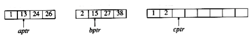
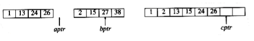
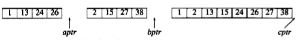
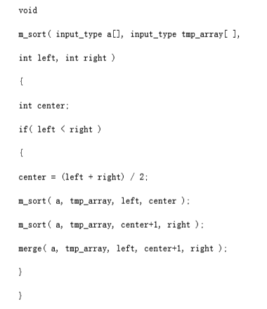
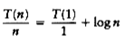

## Mergesort

We now turn our attention to mergesort. Mergesort runs in O(n log n) worst-case running time, and the number of comparisons used is nearly optimal. It is a fine example of a recursive algorithm. The fundamental operation in this algorithm is merging two sorted lists. Because the lists are sorted, this can be done in one pass through the input, if the output is put in a third list. The basic merging algorithm takes two input arrays a and b, an output array c, and three counters, aptr, bptr, and cptr, which are initially set to the beginning of their respective arrays. The smaller of a[aptr] and b[bptr] is copied to the next entry in c, and the appropriate counters are advanced. When either input list is exhausted, the remainder of the other list is copied to c. An example of how the merge routine works is provided for the following input.



If the array a contains 1, 13, 24, 26, and b contains 2, 15, 27, 38, then the algorithm proceeds as follows: First, a comparison is done between 1 and 2. 1 is added to c, and then 13 and 2 are compared.


2 is added to c, and then 13 and 15 are compared.


13 is added to c, and then 24 and 15 are compared. This proceeds until 26 and 27 are compared.

26 is added to c, and the a array is exhausted.



The remainder of the b array is then copied to c.



The time to merge two sorted lists is clearly linear, because at most n - 1 comparisons are made, where n is the total number of elements. To see this, note that every comparison adds an element to c, except the last comparison, which adds at least two.The mergesort algorithm is therefore easy to describe. If n = 1, there is only one element to sort, and the answer is at hand. Otherwise, recursively mergesort the first half and the second half. This gives two sorted halves, which can then be merged together using the merging algorithm described above. For instance, to sort the eight-element array 24, 13, 26, 1, 2, 27, 38, 15, we recursively sort the first four and last four elements, obtaining 1, 13, 24, 26, 2, 15, 27, 38. Then we merge the two halves as above, obtaining the final list 1, 2, 13, 15, 24, 26, 27, 38. This algorithm is a classic divide-and-conquer strategy. The problem is divided into smaller problems and solved recursively. The conquering phase consists of patching together the answers. Divide-and-conquer is a very powerful use of recursion that we will see many times.

An implementation of mergesort is provided in **figure 7.9**. The procedure called mergesort is just a driver for the recursive routine m_sort.

The merge routine is subtle. If a temporary array is declared locally for each recursive call of merge, then there could be log n temporary arrays active at any point. This could be fatal on a machine with small memory. On the other hand, if the merge routine dynamically allocates and frees the minimum amount of temporary memory, considerable time will be used by malloc. A close examination shows that since merge is the last line of m_sort, there only needs to be one temporary array active at any point. Further, we can use any part of the temporary array; we will use the same portion as the input array a. This allows the improvement described at the end of this section. **figure 7.10** implements the merge routine.

### Analysis of Mergesort

Mergesort is a classic example of the techniques used to analyze recursive routines. It is not obvious that mergesort can easily be rewritten without recursion (it can), so we have to write a recurrence relation for the running time. We will assume that n is a power of 2, so that we always split into even halves. For n = 1, the time to mergesort is constant, which we will denote by 1. Otherwise, the time to mergesort n numbers is equal to the time to do two recursive mergesorts of size n/2, plus the time to merge, which is linear. The equations below say this exactly:

T(1) = 1

T(n) = 2T(n/2) + n




**figure 7.9** Mergesort routine

This is a standard recurrence relation, which can be solved several ways. We will show two methods. The first idea is to divide the recurrence relation through by n. The reason for doing this will become apparent soon. This yields


```
/* 1_pos = start of left half, r_pos = start of right half */
```


**figure 7.10** Merge routine and

Now add up all the equations. This means that we add all of the terms on the left-hand side and set the result equal to the sum of all of the terms on the right-hand side. Observe that the term T(n/2)/(n/2) appears on both sides and thus cancels. In fact, virtually all the terms appear on both sides and cancel. This is called telescoping a sum. After everything is added, the final result is



because all of the other terms cancel and there are log n equations, and so all the 1s at the end of these equations add up to log n. Multiplying through by n gives the final answer.

T(n) = n log n + n = O(n log n)

Notice that if we did not divide through by n at the start of the solutions, the sum would not telescope. This is why it was necessary to divide through by n. An alternative method is to substitute the recurrence relation continually on the right-hand side. We have T(n) = 2T(n/2) + n Since we can substitute n/2 into the main equation,

2T(n/2) = 2(2(T(n/4)) + n/2) = 4T(n/4) + n

we have T(n) = 4T(n/4) + 2n

Again, by substituting n/4 into the main equation, we see that

4T(n/4) = 4(2T(n/8)) + (n/4) = 8T(n/8) + n

So we have

T(n) = 8T(n/8) + 3n

Continuing in this manner, we obtain

T(n) = 2kT(n/2k) + k n

Using k = log n, we obtain

T(n) = nT(1) + n log n = n log n + n

The choice of which method to use is a matter of taste. The first method tends to produce scrap work that fits better on a standard sheet of paper, leading to fewer mathematical errors, but it requires a certain amount of experience to apply. The second method is more of a brute force approach.

Recall that we have assumed n = 2k. The analysis can be refined to handle cases when n is not a power of 2. The answer turns out to be almost identical (this is usually the case).

Although mergesort's running time is O(n log n), it is hardly ever used for main memory sorts. The main problem is that merging two sorted lists requires linear extra memory, and the additional work spent copying to the temporary array and back, throughout the algorithm, has the effect of slowing down the sort considerably. This copying can be avoided by judiciously switching the roles of a and tmp_array at alternate levels of the recursion. A variant of mergesort can also be implemented nonrecursively (Exercise 7.13), but even so, for serious internal sorting applications, the algorithm of choice is quicksort, which is described in the next section. Nevertheless, as we will see later in this chapter, the merging routine is the cornerstone of most external sorting algorithms.
