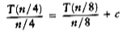
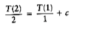
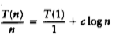
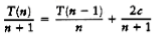
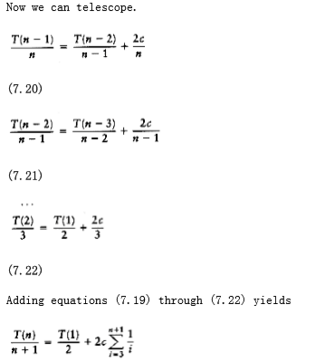
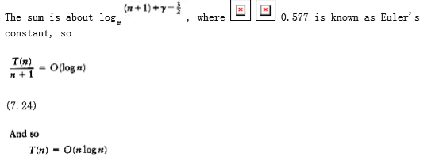

## Quicksort

As its name implies, quicksort is the fastest known sorting algorithm in practice. Its average running time is O(n log n). It is very fast, mainly due to a very tight and highly optimized inner loop. It has O(n2) worst-case performance, but this can be made exponentially unlikely with a little effort. The quicksort algorithm is simple to understand and prove correct, although for many years it had the reputation of being an algorithm that could in theory be highly optimized but in practice was impossible to code correctly (no doubt because of FORTRAN). Like mergesort, quicksort is a divide-and-conquer recursive algorithm. The basic algorithm to sort an array S consists of the following four easy steps:

1. If the number of elements in S is 0 or 1, then return.

2. Pick any element v in S. This is called the pivot.

3. Partition S - {v} (the remaining elements in S) into two disjoint groups: S1 =
{x S - {v}| x v}, and S2 = {x S -{v}| x v}.

4. Return { quicksort(S1) followed by v followed by quicksort(S2)}.

Since the partition step ambiguously describes what to do with elements equal to the pivot, this becomes a design decision. Part of a good implementation is handling this case as efficiently as possible. Intuitively, we would hope that about half the keys that are equal to the pivot go into S1 and the other half into S2, much as we like binary search trees to be balanced.

**figure 7.11** shows the action of quicksort on a set of numbers. The pivot is chosen (by chance) to be 65. The remaining elements in the set are partitioned into two smaller sets. Recursively sorting the set of smaller numbers yields 0, 13, 26, 31, 43, 57 (by rule 3 of recursion). The set of large numbers is similarly sorted. The sorted arrangement of the entire set is then trivially obtained.

It should be clear that this algorithm works, but it is not clear why it is any faster than mergesort. Like mergesort, it recursively solves two subproblems and requires linear additional work (step 3), but, unlike mergesort, the subproblems are not guaranteed to be of equal size, which is potentially bad. The reason that quicksort is faster is that the partitioning step can actually be performed in place and very efficiently. This efficiency more than makes up for the lack of equal-sized recursive calls.

The algorithm as described so far lacks quite a few details, which we now fill in. There are many ways to implement steps 2 and 3; the method presented here is the result of extensive analysis and empirical study and represents a very efficient way to implement quicksort. Even the slightest deviations from this method can cause surprisingly bad results.

### Picking the Pivot

Although the algorithm as described works no matter which element is chosen as pivot, some choices are obviously better than others.

**figure 7.11** The steps of quicksort illustrated by example

**A Wrong Way**

The popular, uninformed choice is to use the first element as the pivot. This is acceptable if the input is random, but if the input is presorted or in reverse order, then the pivot provides a poor partition, because virtually all the elements go into S1 or S2. Worse, this happens consistently throughout the recursive calls. The practical effect is that if the first element is used as the pivot and the input is presorted, then quicksort will take quadratic time to do essentially nothing at all, which is quite embarrassing. Moreover, presorted input (or input with a large presorted section) is quite frequent, so using the first element as pivot is an absolutely horrible idea and should be discarded immediately. An alternative is choosing the larger of the first two distinct keys as pivot, but this has the same bad properties as merely choosing the first key. Do not use that pivoting strategy either.

**A Safe Maneuver**

A safe course is merely to choose the pivot randomly. This strategy is generally perfectly safe, unless the random number generator has a flaw (which is not as uncommon as you might think), since it is very unlikely that a random pivot would consistently provide a poor partition. On the other hand, random number generation is generally an expensive commodity and does not reduce the average running time of the rest of the algorithm at all.

**Median-of-Three Partitioning**

The median of a group of n numbers is the _n_/2 th largest number. The best choice of pivot would be the median of the file. Unfortunately, this is hard to calculate and would slow down quicksort considerably. A good estimate can be obtained by picking three elements randomly and using the median of these three as pivot. The randomness turns out not to help much, so the common course is to use as pivot the median of the left, right and center elements. For instance, with input 8, 1, 4, 9, 6, 3, 5, 2, 7, 0 as before, the left element is 8, the right element is 0 and the center (in position (_left_ + right)/2) element is 6. Thus, the pivot would be v = 6. Using median-of-three partitioning clearly eliminates the bad case for sorted input (the partitions become equal in this case) and actually reduces the running time of quicksort by about 5 percent.

### Partitioning Strategy

There are several partitioning strategies used in practice, but the one described here is known to give good results. It is very easy, as we shall see, to do this wrong or inefficiently, but it is safe to use a known method. The first step is to get the pivot element out of the way by swapping it with the last element. i starts at the first element and j starts at the next-to-last element. If the original input was the same as before, the following figure shows the current situation.
```
8 1 4 9 0 3 5 2 7 6

i j
```
For now we will assume that all the elements are distinct. Later on we will worry about what to do in the presence of duplicates. As a limiting case, our algorithm must do the proper thing if all of the elements are identical. It is surprising how easy it is to do the wrong thing.

What our partitioning stage wants to do is to move all the small elements to the left part of the array and all the large elements to the right part. "Small" and "large" are, of course, relative to the pivot.

While i is to the left of j, we move i right, skipping over elements that are smaller than the pivot. We move j left, skipping over elements that are larger than the pivot. When i and j have stopped, i is pointing at a large element and j is pointing at a small element. If i is to the left of j, those elements are swapped. The effect is to push a large element to the right and a small element to the left. In the example above, i would not move and j would slide over one place. The situation is as follows.
```
8 1 4 9 0 3 5 2 7 6

i j
```
We then swap the elements pointed to by i and j and repeat the process until i and j cross. After First Swap

----------------------------
```
2 1 4 9 0 3 5 8 7 6

i j

Before Second Swap
```
----------------------------
```
2 1 4 9 0 3 5 8 7 6

i j

After Second Swap
```
----------------------------
```
2 1 4 5 0 3 9 8 7 6

i j

Before Third Swap
```
----------------------------
```
2 1 4 5 0 3 9 8 7 6

j i
```
At this stage, i and j have crossed, so no swap is performed. The final part of the partitioning is to swap the pivot element with the element pointed to by i.

After Swap with Pivot

---------------------------------------
```
2 1 4 5 0 3 6 8 7 9

i pivot
```
When the pivot is swapped with i in the last step, we know that every element in a position p < i must be small. This is because either position p contained a small element to start with, or the large element originally in position p was replaced during a swap. A similar argument shows that elements in positions p > i must be large.

One important detail we must consider is how to handle keys that are equal to the pivot. The questions are whether or not i should stop when it sees a key equal to the pivot and whether or not j should stop when it sees a key equal to the pivot. Intuitively, i and j ought to do the same thing, since otherwise the partitioning step is biased. For instance, if i stops and j does not, then all keys that are equal to the pivot will wind up in S2.
 
To get an idea of what might be good, we consider the case where all the keys in the file are identical. If both i and j stop, there will be many swaps between identical elements. Although this seems useless, the positive effect is that i and j will cross in the middle, so when the pivot is replaced, the partition creates two nearly equal subfiles. The mergesort analysis tells us that the total running time would then be O(n log n).

If neither i nor j stop, and code is present to prevent them from running off the end of the array, no swaps will be performed. Although this seems good, a correct implementation would then swap the pivot into the last spot that i touched, which would be the next-to-last position (or last, depending on the exact implementation). This would create very uneven subfiles. If all the keys are identical, the running time is O(n2). The effect is the same as using the first element as a pivot for presorted input. It takes quadratic time to do nothing!

Thus, we find that it is better to do the unnecessary swaps and create even subfiles than to risk wildly uneven subfiles. Therefore, we will have both i and j stop if they encounter a key equal to the pivot. This turns out to be the only one of the four possibilities that does not take quadratic time for this input.

At first glance it may seem that worrying about a file of identical elements is silly. After all, why would anyone want to sort 5,000 identical elements? However, recall that quicksort is recursive. Suppose there are 100,000 elements, of which 5,000 are identical. Eventually, quicksort will make the recursive call on only these 5,000 elements. Then it really will be important to make sure that 5,000 identical elements can be sorted efficiently.

### Small Files

For very small files (n 20), quicksort does not perform as well as insertion sort. Furthermore, because quicksort is recursive, these cases will occur frequently. A common solution is not to use quicksort recursively for small files, but instead use a sorting algorithm that is efficient for small files, such as insertion sort. An even better idea is to leave the file slightly unsorted and finish up with insertion sort. This works well, because insertion sort is efficient for nearly sorted files. Using this strategy can actually save about 15 percent in the running time (over doing no cutoff at all). A good cutoff range is n = 10, although any cutoff between 5 and 20 is likely to produce similar results. This also saves nasty degenerate cases, such as taking the median of three elements when there are only one or two. Of course, if there is a bug in the basic quicksort routine, then the insertion sort will be very, very slow.

### Actual Quicksort Routines

The driver for quicksort is shown in **figure 7.12**.

The general form of the routines will be to pass the array and the range of the array (left and right) to be sorted. The first routine to deal with is pivot selection. The easiest way to do this is to sort a[left], a[right], and a[center] in place. This has the extra advantage that the smallest of the three winds up in a[left], which is where the partitioning step would put it anyway. The largest winds up in a[right], which is also the correct place, since it is larger than the pivot. Therefore, we can place the pivot in a[right - 1] and initialize i and j to left + 1 and right - 2 in the partition phase. Yet another benefit is that because a[left] is smaller than the pivot, it will act as a sentinel for j. Thus, we do not need to worry about j running past the end. Since i will stop on keys equal to the pivot, storing the pivot in a[right - 1] provides a sentinel for i. The code in **figure 7.13** does the median-of-three partitioning with all the side effects described. It may seem that it is only slightly inefficient to compute the pivot by a method that does not actually sort a[left], a[center], and a [right], but, surprisingly, this produces bad results (see Exercise 7.37).

The real heart of the quicksort routine is in **figure 7.14**. It includes the partitioning and recursive calls. There are several things worth noting in this implementation. Line 3 initializes i and j to 1 past their correct values, so that there are no special cases to consider. This initialization depends on the fact that median-of-three partitioning has some side effects; this program will not work if you try to use it without change with a simple pivoting strategy, because i and j start in the wrong place and there is no longer a sentinel for j.


**figure 7.12** Driver for quicksort
```
/* Return median of left, center, and right. */

/* Order these and hide pivot */

input_type

median3(input_type a[], int left, int right)
{

int center;

center = (left + right) / 2;

if(a[left] > a[center])
swap(&a[left], &a[center]);

if(a[left] > a[right])
swap(&a[left], &a[right]);

if(a[center] > a[right])
swap(&a[center], &a[right]);

/* invariant: a[left] <= a[center] <= a[right] */

swap(&a[center], &a[right-1]); /* hide pivot */

return a[right-1]; /* return pivot */

}
```
**figure 7.13** Code to perform median-of-three partitioning

The swap at line 8 is sometimes written explicitly, for speed purposes. For the algorithm to be fast, it is necessary to force the compiler to compile this code in-line. Many compilers will do this automatically, if asked to, but for those that do not the difference can be significant.

Finally, lines 5 and 6 show why quicksort is so fast. The inner loop of the algorithm consists of an increment/decrement (by 1, which is fast), a test, and a jump. There is no extra juggling as there is in mergesort. This code is still surprisingly tricky. It is tempting to replace lines 3 through 9 with the statements in **figure 7.15**. This does not work, because there would be an infinite loop if a[i] = a[j] = pivot.

### Analysis of Quicksort

Like mergesort, quicksort is recursive, and hence, its analysis requires solving a recurrence formula. We will do the analysis for a quicksort, assuming a random pivot (no median-of-three partitioning) and no cutoff for small files. We will take T(0) = T(1) = 1, as in mergesort. The running time of quicksort is equal to the running time of the two recursive calls plus the linear time spent in the partition (the pivot selection takes only constant time). This gives the basic quicksort relation T(n) = T(i) + T(n - i - 1) + cn

**(7.1)**
```c
where i = |S1| is the number of elements in S1. We will look at three cases.

void q_sort(input_type a[], int left, int right)
{

int i, j;

input_type pivot;

/*1*/ if(left + CUTOFF <= right){

/*2*/ pivot = median3(a, left, right);

/*3*/ i=left; j=right-1;

/*4*/ for(; ;)
{

/*5*/ while(a[++i] < pivot);

/*6*/ while(a[--j] > pivot);

/*7*/ if(i < j)
/*8*/ swap(&a[i], &a[j]);

else
/*9*/ break;

}

/*10*/ swap(&a[i], &a[right-1]); /*restore pivot*/

/*11*/ q_sort(a, left, i-1);

/*12*/ q_sort(a, i+1, right);

}

}

**figure 7.14** Main quicksort routine

/*3*/ i=left+1; j=right-2;

/*4*/ for(; ;)
{

/*5*/ while(a[i] < pivot) i++;

/*6*/ while(a[j] > pivot) j--;

/*7*/ if(i < j)
/*8*/ swap(&a[i], &a[j]);

else
/*9*/ break;

}
```

**figure 7.15** A small change to quicksort, which breaks the algorithm

**Worst-Case Analysis**

The pivot is the smallest element, all the time. Then i = 0 and if we ignore T(0) = 1, which is insignificant, the recurrence is

T(n) = T(n - 1) + cn, n > 1

****(7.2)****

We telescope, using Equation **(7.2)** repeatedly. Thus

T(n -1) = T(n - 2) + c(n - 1)

****(7.3)****

T(n - 2) = T(n - 3) + c(n - 2)

****(7.4)****
...

T(2) = T(1) + c(2)

****(7.5)****

Adding up all these equations yields

**(7.6)**

as claimed earlier.

**Best-Case Analysis**

In the best case, the pivot is in the middle. To simplify the math, we assume that the two subfiles are each exactly half the size of the original, and although this gives a slight overestimate, this is acceptable because we are only interested in a Big-Oh answer.

T(n) = 2T(n/2) + cn

**(7.7)**

Divide both sides of Equation **(7.7)** by n.

**(7.8)**

We will telescope using this equation.

**(7.9)**

**(7.10)**

**(7.11)**

We add all the equations from **(7.7)** to **(7.11)** and note that there are log n of them:

**(7.12)**

which yields

T(n) = cn log n + n = O(n log n)

**(7.13)**

Notice that this is the exact same analysis as mergesort, hence we get the same answer.

**Average-Case Analysis**

This is the most difficult part. For the average case, we assume that each of the file sizes for S1 is equally likely, and hence has probability 1/n. This assumption is actually valid for our pivoting and partitioning strategy, but it is not valid for some others. Partitioning strategies that do not preserve the randomness of the subfiles cannot use this analysis. Interestingly, these strategies seem to result in programs that take longer to run in practice. With this assumption, the average value of T(i), and hence T(n - i -1), is Equation **(7.1)** then becomes


**(7.16)**

If we subtract **(7.16)** from **(7.15)**, we obtain

nT(n) - (n -1)T(n -1) = 2T(n -1) + 2cn -c

**(7.17)**

We rearrange terms and drop the insignificant -c on the right, obtaining

nT(n) = (n + 1)T(n -1) + 2cn

**(7.18)**

We now have a formula for T(n) in terms of T(n -1) only. Again the idea is to telescope, but Equation **(7.18)** is in the wrong form. Divide **(7.18)** by n(n + 1):



**(7.19)**





**(7.25)**

Although this analysis seems complicated, it really is not--the steps are natural once you have seen some recurrence relations. The analysis can actually be taken further. The highly optimized version that was described above has also been analyzed, and this result gets extremely difficult, involving complicated recurrences and advanced mathematics. The effects of equal keys has also been analyzed in detail, and it turns out that the code presented does the right thing.

### A Linear-Expected-Time Algorithm for Selection

Quicksort can be modified to solve the selection problem, which we have seen in chapters 1 and 6. Recall that by using a priority queue, we can find the kth largest (or smallest) element in O(n + k log n). For the special case of finding the median, this gives an O(n log n) algorithm.

Since we can sort the file in O(n log n) time, one might expect to obtain a better time bound for selection. The algorithm we present to find the kth smallest element in a set S is almost identical to quicksort. In fact, the first three steps are the same. We will call this algorithm quickselect. Let |Si| denote the number of elements in Si. The steps of quickselect are

1. If |S| = 1, then k = 1 and return the elements in S as the answer. If a cutoff for small files is being used and |S| CUTOFF, then sort S and return the kth smallest element.

2. Pick a pivot element, v S.

3. Partition S - {v} into S1 and S2, as was done with quicksort.

4. If k |S1|, then the kth smallest element must be in S1. In this case, return quickselect (S1, k). If k = 1 + |S1|, then the pivot is the kth smallest element and we can return it as the answer. Otherwise, the kth smallest element lies in S2, and it is the (k - |S1| - 1)st smallest element in S2. We make a recursive call and return quickselect (S2, k - |S1| - 1). In contrast to quicksort, quickselect makes only one recursive call instead of two. The worst case of quickselect is identical to that of quicksort and is O (n2). Intuitively, this is because quicksort's worst case is when one of S1 and S2 is empty; thus, quickselect is not really saving a recursive call. The average running time, however, is O(n). The analysis is similar to quicksort's and is left as an exercise.

The implementation of quickselect is even simpler than the abstract description might imply. The code to do this shown in **figure 7.16**. When the algorithm terminates, the kth smallest element is in position k. This destroys the original ordering; if this is not desirable, then a copy must be made.
```c
/* q_select places the kth smallest element in a[k]*/

void q_select(input_type a[], int k, int left, int right)
{

int i, j;

input_type pivot;

/*1*/ if(left + CUTOFF <= right){

/*2*/ pivot = median3(a, left, right);

/*3*/ i=left; j=right-1;

/*4*/ for(;;)
{

/*5*/ while(a[++i] < pivot);

/*6*/ while(a[--j] > pivot);

/*7*/ if (i < j)

/*8*/ swap(&a[i], &a[j]);

else
/*9*/ break;

}

/*10*/ swap(&a[i], &a[right-1]); /* restore pivot */

/*11*/ if(k < i)
/*12*/ q_select(a, k, left, i-1);

else
/*13*/ if(k > i)
/*14*/ q-select(a, k, i+1, right);

}

else
/*15*/ insert_sort(a, left, right);

}
```
**figure 7.16** Main quickselect routine

Using a median-of-three pivoting strategy makes the chance of the worst case occuring almost negligible. By carefully choosing the pivot, however, we can eliminate the quadratic worst case and ensure an O(n) algorithm. The overhead involved in doing this is considerable, so the resulting algorithm is mostly of theoretical interest. In Chapter 10, we will examine the linear-time worst-case algorithm for selection, and we shall also see an interesting technique of choosing the pivot that results in a somewhat faster selection algorithm in practice.