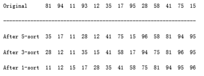
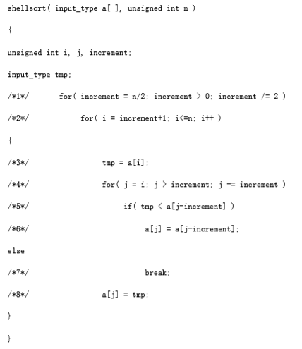

## Shellsort

Shellsort, named after its inventor, Donald Shell, was one of the first algorithms to break the quadratic time barrier, although it was not until several years after its initial discovery that a subquadratic time bound was proven. As suggested in the previous section, it works by comparing elements that are distant; the distance between comparisons decreases as the algorithm runs until the last phase, in which adjacent elements are compared. For this reason, Shellsort is sometimes referred to as diminishing increment sort.

Shellsort uses a sequence, h1, h2, . . . , ht, called the increment sequence. Any increment sequence will do as long as h1 = 1, but obviously some choices are better than others (we will discuss that question later). After a phase, using some increment hk, for every i, we have a[i] a[i+hk] (where this makes sense); all elements spaced hk apart are sorted. The file is then said to be hk-sorted. For example, **figure 7.3** shows an array after several phases of Shellsort. An important property of Shellsort (which we state without proof) is that an hk-sorted file that is then hk-1-sorted remains hk-sorted. If this were not the case, the algorithm would likely be of little value, since work done by early phases would be undone by later phases.

**figure 7.3** Shellsort after each pass

The general strategy to hk-sort is for each position, i, in hk + 1, hk + 2, . . ., n, place the element in the correct spot among i, i - hk, i - 2hk, etc. Although this does not affect the implementation, a careful examination shows that the action of an hk-sort is to perform an insertion sort on hk independent sub-arrays. This observation will be important when we analyze the running time of Shellsort.

A popular (but poor) choice for increment sequence is to use the sequence suggested by Shell: ht _n_/2 , and hk = _hk+1_/2 . **figure 7.4** contains a program that implements Shellsort using this sequence. We shall see later that there are increment sequences that give a significant improvement in the algorithm's running time.

The program in **figure 7.4** avoids the explicit use of swaps in the same manner as our implementation of insertion sort. Unfortunately, for Shellsort it is not possible to use a sentinel, and so the code in lines 3 through 7 is not quite as clean as the corresponding code in insertion sort (lines 3 through 5).

**figure 7.4** Shellsort routine using Shell's increments (better increments are possible)

### Worst-Case Analysis of Shellsort

Although Shellsort is simple to code, the analysis of its running time is quite another story. The running time of Shellsort depends on the choice of increment sequence, and the proofs can be rather involved. The average-case analysis of Shellsort is a long-standing open problem, except for the most trivial increment sequences. We will prove tight worst-case bounds for two particular increment sequences.

**THEOREM 7.3.**

The worst-case running time of Shellsort, using Shell's increments, is (n2).

PROOF:

The proof requires showing not only an upper bound on the worst-case running time but also showing that there exists some input that actually takes (n2) time to run. We prove the lower bound first, by constructing a bad case. First, we choose n to be a power of 2. This makes all the increments even, except for the last increment, which is 1. Now, we will give as input an array, input_data, with the n/2 largest numbers in the even positions and the n/2 smallest numbers in the odd positions. As all the increments except the last are even, when we come to the last pass, the n/2 largest numbers are still all in even positions and the n/2 smallest numbers are still all in odd positions. The ith smallest number (in/2) is thus in position 2i -1 before the beginning of the last pass. Restoring the ith element to its correct place requires moving it i -1 spaces in the array. Thus, to merely place the n/2 smallest elements in the correct place requires at least work. As an example, **figure 7.5** shows a bad (but not the worst) input when n = 16. The number of inversions remaining after the 2-sort is exactly 1 + 2 + 3 + 4 + 5 + 6 + 7 = 28; thus, the last pass will take considerable time.

To finish the proof, we show the upper bound of O(n2). As we have observed before, a pass with increment hk consists of hk insertion sorts of about n/hk elements. Since insertion sort is quadratic, the total cost of a pass is O(hk (n/hk) 2) = O(n2/hk). Summing over all passes gives a total bound of

- Because the increments form a geometric series with common ratio 2, and the largest term in the series is

Thus we obtain a total bound of O(n2).

The problem with Shell's increments is that pairs of increments are not necessarily relatively prime, and thus the smaller increment can have little effect. Hibbard suggested a slightly different increment sequence, which gives better results in practice (and theoretically). His increments are of the form 1, 3, 7, . . . , 2k - 1. Although these increments are almost identical, the key difference is that consecutive increments have no common factors. We now analyze the worst-case running time of Shellsort for this increment sequence. The proof is rather complicated.

**figure 7.5** Bad case for Shellsort with Shell's increments

**THEOREM 7.4.**

The worst-case running time of Shellsort using Hibbard's increments is (n3/2).

PROOF:

We will prove only the upper bound and leave the proof of the lower bound as an exercise. The proof requires some well-known results from additive number theory. References to these results are provided at the end of the chapter.

For the upper bound, as before, we bound the running time of each pass and sum over all passes. For increments hk > n 1/2, we will use the bound O(n2/hk) from the previous theorem. Although this bound holds for the other increments, it is too large to be useful. Intuitively, we must take advantage of the fact that this increment sequence is special. What we need to show is that for any element ap in position p, when it is time to perform an hk-sort, there are only a few elements to the left of position p that are larger than ap.

When we come to hk-sort the input array, we know that it has already been hk+1- and hk+2-sorted. Prior to the hk-sort, consider elements in positions p and p - i, i < p. If i is a multiple of hk+1 or hk+2, then clearly a[p - i] < a[p]. We can say more, however. If i is expressible as a linear combination (in nonnegative integers) of hk+1 and hk+2, then a[p - i] < a[p]. As an example, when we come to 3-sort, the file is already 7- and 15-sorted. 52 is expressible as a linear combination of 7 and 15, because 52 = 1 * 7 + 3 * 15. Thus, a[100] cannot be larger than a[152] because a[100] a[107] a[122] a[137] a [152].

Now, hk+2 = 2hk +1 + 1, so hk +1 and hk +2 cannot share a common factor. In this case, it is possible to show that all integers that are at least as large as (hk+1 - 1)(hk+2 - 1) = 8h 2 k + 4hk can be expressed as a linear combination of hk+1 and hk+2 (see the reference at the end of the chapter).

This tells us that the body of the for loop at line 4 can be executed at most 8hk + 4 = O(hk) times for each of the n - hk positions. This gives a bound of O(nhk) per pass.

Using the fact that about half the increments satisfy , and assuming that t is even, the total running time is then Because both sums are geometric series, and since ,this simplifies to The average-case running time of Shellsort, using Hibbard's increments, is thought to be O(n5/4), based on simulations, but nobody has been able to prove this. Pratt has shown that the (n3/2) bound applies to a wide range of increment sequences.

Sedgewick has proposed several increment sequences that give an O(n4/3) worst- case running time (also achievable). The average running time is conjectured to be O(n7/6) for these increment sequences. Empirical studies show that these sequences perform significantly better in practice than Hibbard's. The best of these is the sequence {1, 5, 19, 41, 109, . . .}, in which the terms are either of the form 9 4i - 9 2i + 1 or 4i - 3 2i + 1. This is most easily implemented by placing these values in an array. This increment sequence is the best known in practice, although there is a lingering possibility that some increment sequence might exist that could give a significant improvement in the running time of Shellsort.

There are several other results on Shellsort that (generally) require difficult theorems from number theory and combinatorics and are mainly of theoretical interest. Shellsort is a fine example of a very simple algorithm with an extremely complex analysis.

The performance of Shellsort is quite acceptable in practice, even for n in the tens of thousands. The simplicity of the code makes it the algorithm of choice for sorting up to moderately large input.
