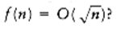

# Summary

For most general internal sorting applications, either insertion sort, Shellsort, or quicksort will be the method of choice, and the decision of which to use will depend mostly on the size of the input. **figure 7.19** shows the running time obtained for each algorithm on various file sizes.

The data was chosen to be random permutations of n integers, and the times given include only the actual time to sort. The code given in **figure 7.2** was used for insertion sort. Shellsort used the code in Section 7.4 modified to run with Sedgewick's increments. Based on literally millions of sorts, ranging in size from 100 to 25 million, the expected running time of Shellsort with these increments is conjectured to be O(n7/6). The heapsort routine is the same as in Section 7.5. Two versions of quicksort are given. The first uses a simple pivoting strategy and does not do a cutoff. Fortunately, the input files were random. The second uses median-of-three partitioning and a cutoff of ten. Further optimizations were possible. We could have coded the median-of-three routine in-line instead of using a function, and we could have written quicksort nonrecursively. There are some other optimizations to the code that are fairly tricky to implement, and of course we could have used an assembly language. We have made an honest attempt to code all routines efficiently, but of course the performance can vary somewhat from machine to machine.

The highly optimized version of quicksort is as fast as Shellsort even for very small input sizes. The improved version of quicksort still has an O(n2) worst case (one exercise asks you to construct a small example), but the chances of this worst case appearing are so negligible as to not be a factor. If you need to sort large files, quicksort is the method of choice. But never, ever, take the easy way out and use the first element as pivot. It is just not safe to assume that the input will be random. If you do not want to worry about this, use Shellsort. Shellsort will give a small performance penalty but could also be acceptable, especially if simplicity is required. Its worst case is only O(n4/3); the chance of that worst case occuring is likewise negligible.

Heapsort, although an O (n log n) algorithm with an apparently tight inner loop, is slower than Shellsort. A close examination of the algorithm reveals that in order to move data, heapsort does two comparisons. Carlsson has analyzed an improvement suggested by Floyd that moves data with essentially only one comparison, but implementing this improvement makes the code somewhat longer. We leave it to the reader to decide whether the extra coding effort is worth the increased speed (Exercise 7.39).

Insertion Sort Shellsort Heapsort Quicksort Quicksort(opt.)

n O(n2) O(n7/6) O(n log n) O(n log n) O(n log n)

---------------------------------------------------------------------------

10 0.00044 0.00041 0.00057 0.00052 .00046

100 0.00675 0.00171 0.00420 0.00284 .00244

1000 0.59564 0.02927 0.05565 0.03153 .02587

10000 58.864 0.42998 0.71650 0.36765 .31532

100000 NA 5.7298 8.8591 4.2298 3.5882

1000000 NA 71.164 104.68 47.065 41.282

**figure 7.19** Comparison of different sorting algorithms (all times are in seconds)

Insertion sort is useful only for small files or very nearly sorted files. We have not included mergesort, because its performance is not as good as quicksort for main memory sorts and it is not any simpler to code. We have seen, however, that merging is the central idea of external sorts.

## Exercises

7.1 Sort the sequence 3, 1, 4, 1, 5, 9, 2, 6, 5 using insertion sort.

7.2 What is the running time of insertion sort if all keys are equal?

7.3 Suppose we exchange elements a[i] and a[i + k], which were originally out of order. Prove that at least 1 and at most 2k - 1 inversions are removed.

7.4 Show the result of running Shellsort on the input 9, 8, 7, 6, 5, 4, 3, 2, 1 using the increments { 1, 3, 7 }.

7.5 What is the running time of Shellsort using the two-increment sequence 1, 2 }?

7.6 *a. Prove that the running time of Shellsort is (n2) using increments of the form 1, c, c2, ..., ci for any integer c.

**b. Prove that for these increments, the average running time is (n3/2).

*7.7 Prove that if a k-sorted file is then h-sorted, it remains k-sorted.

**7.8 Prove that the running time of Shellsort, using the increment sequence suggested by Hibbard, is (n3/2) in the worst case. Hint: You can prove the bound by considering the special case of what Shellsort does when all elements are either 0 or 1. Set input_data[i] = 1 if i is expressible as a linear combination of ht, ht-1, ..., h t/2 +1 and 0 otherwise.

7.9 Determine the running time of Shellsort for

a. sorted input

*b. reverse-ordered input

7.10 Show how heapsort processes the input 142, 543, 123, 65, 453, 879, 572, 434, 111, 242, 811, 102.

7.11 a. What is the running time of heapsort for presorted input?

**b. Is there any input for which heapsort runs in o(n log n) (in other words, are there any particularly good inputs for heapsort)?

7.12 Sort 3, 1, 4, 1, 5, 9, 2, 6 using mergesort.

7.13 How would you implement mergesort without using recursion?

7.14 Determine the running time of mergesort for

a. sorted input

b. reverse-ordered input

c. random input

7.15 In the analysis of mergesort, constants have been disregarded. Prove that the number of comparisons used in the worst case by mergesort is n log n - 2 log n + 1.

7.16 Sort 3, 1, 4, 1, 5, 9, 2, 6, 5, 3, 5 using quicksort with median-of-three partitioning and a cutoff of 3.

7.17 Using the quicksort implementation in this chapter, determine the running time of quicksort for

a. sorted input

b. reverse-ordered input

c. random input

7.18 Repeat Exercise 7.17 when the pivot is chosen as

a. the first element

b. the largest of the first two nondistinct keys

c. a random element

*d. the average of all keys in the set

7.19 a. for the quicksort implementation in this chapter, what is the running time when all keys are equal?

b. Suppose we change the partitioning strategy so that neither i nor j stops when an element with the same key as the pivot is found. What fixes need to be made in the code to guarantee that quicksort works, and what is the running time, when all keys are equal?

c. Suppose we change the partitioning strategy so that i stops at an element with the same key as the pivot, but j does not stop in a similar case. What fixes need to be made in the code to guarantee that quicksort works, and when all keys are equal, what is the running time of quicksort?

7.20 Suppose we choose the middle key as pivot. Does this make it unlikely that quicksort will require quadratic time?

7.21 Construct a permutation of 20 elements that is as bad as possible for quicksort using median-of-three partitioning and a cutoff of 3.

7.22 Write a program to implement the selection algorithm.

7.23 Solve the following recurrence: .

7.24 A sorting algorithm is stable if elements with equal keys are left in the same order as they occur in the input. Which of the sorting algorithms in this chapter are stable and which are not? Why?

7.25 Suppose you are given a sorted list of n elements followed by â(n) randomly ordered elements. How would you sort the entire list if

a. â(n) =O(1)?

b. â(n) =O(log n)?

*d. How large can â(n) be for the entire list still to be sortable in O(n) time?

7.26 Prove that any algorithm that finds an element x in a sorted list of n elements requires

(log n) comparisons.

7.27 Using Stirling's formula, , give a precise estimate for log n !.

7.28 *a. In how many ways can two sorted arrays of n elements be merged?

*b. Give a nontrivial lower bound on the number of comparisons required to merge two sorted lists of n elements.

7.29 Prove that sorting n elements with integer keys in the range 1 key m takes O(m + n) time using bucket sort.

7.30 Suppose you have an array of n elements containing only two distinct keys, true and false. Give an O(n) algorithm to rearrange the list so that all false elements precede the true elements. You may use only constant extra space.

7.31 Suppose you have an array of n elements, containing three distinct keys, true, false, and maybe. Give an O(n) algorithm to rearrange the list so that all false elements precede maybe elements, which in turn precede true elements. You may use only constant extra space.

7.32 a. Prove that any comparison-based algorithm to sort 4 elements requires 5 comparisons.

b. Give an algorithm to sort 4 elements in 5 comparisons.

7.33 a. Prove that 7 comparisons are required to sort 5 elements using any comparison-based algorithm.

*b. Give an algorithm to sort 5 elements with 7 comparisons.

7.34 Write an efficient version of Shellsort and compare performance when the following increment sequences are used:

a. Shell's original sequence

b. Hibbard's increments

e. Sedgewick's increments.

7.35 Implement an optimized version of quicksort and experiment with combinations of the following:

a. Pivot: first element, middle element, random element, median of three, median of five.

b. Cutoff values from 0 to 20.

7.36 Write a routine that reads in two alphabetized files and merges them together, forming a third, alphabetized, file.

7.37 Suppose we implement the median of three routine as follows: Find the median of a[left], a [center], a[right], and swap it with a[right]. Proceed with the normal partitioning step starting i at left and j at right - 1 (instead of left + 1 and right - 2). Assume that a [0] = MIN_DATA, so that sentinels are present.

a. Suppose the input is 2,3,4, ...,n -1, n, 1. What is the running time of this version of quicksort?

b. Suppose the input is in reverse order. What is the running time of this version of quicksort?

7.38 Prove that any comparison-based sorting algorithm requires (n log n) comparisons on average.

7.39 Consider the following strategy for percolate_down. We have a hole at node X. The normal routine is to compare X's children and then move the child up to X if it is larger (in the case of a (max)heap) than the element we are trying to place, thereby pushing the hole down; we stop when it is safe to place the new element in the hole. The alternate strategy is to move elements up and the hole down as far as possible, without testing whether the new cell can be inserted. This would place the new cell in a leaf and probably violate the heap order; to fix the heap order, percolate the new cell up in the normal manner. Write a routine to include this idea, and compare the running time with a standard implementation of heapsort.

7.40 Propose an algorithm to sort a large file using only two tapes.

## References

Knuth's book [10] is a comprehensive, though somewhat dated, reference for sorting. Gonnet and Baeza-Yates [4] has some more recent results, as well as a huge bibliography. The original paper detailing Shellsort is [21]. The paper by Hibbard [5] suggested the use of the increments 2k - 1 and tightened the code by avoiding swaps. **THEOREM 7.4.**is from [12]. Pratt's lower bound, which uses a more complex method than that suggested in the text, can be found in [14]. Improved increment sequences and upper bounds appear in [9], [20], and [23]; matching lower bounds have been shown in [24]. A recent unpublished result by Poonen shows that no increment sequence gives an O(n log n) worst-case running time. An identical result was obtained independently and appears in [13]. The average-case running time for Shellsort is still unresolved. Yao [26] has performed an extremely complex analysis for the three-increment case. The result has yet to be extended to more increments. Experiments with various increment sequences appear in [22].

Heapsort was invented by Williams [25]; Floyd [1] provided the linear-time algorithm for heap construction. The analysis of its average case has only recently been obtained [15].

An exact average-case analysis of mergesort has been claimed in [3]; the paper detailing the results is forthcoming. An algorithm to perform merging in linear time without extra space is described in [8].

Quicksort is from Hoare [6]. This paper analyzes the basic algorithm, describes most of the improvements, and includes the selection algorithm. A detailed analysis and empirical study was the subject of Sedgewick's dissertation [19]. Many of the important results appear in the three papers [16], [17], and [18].

Decision trees and sorting optimality are discussed in Ford and Johnson [2]. This paper also provides an algorithm that almost meets the lower bound in terms of number of comparisons (but not other operations). This algorithm was eventually shown to be slightly suboptimal by Manacher [11].

External sorting is covered in detail in [10]. Stable sorting, described in Exercise 7.24, has been addressed by Horvath [7].

1. R. W. Floyd, "Algorithm 245: Treesort 3," Communications of the ACM 7 (1964), 701.

2. L. R. Ford and S. M. Johnson, "A Tournament Problem," American Mathematics Monthly 66 (1959), 387-389.

3. M. Golin and R. Sedgewick, "Exact Analysis of Mergesort," Fourth SIAM Conference on Discrete Mathematics, 1988.

4. G. H. Gonnet and R. Baeza-Yates, Handbook of Algorithms and Data Structures, second edition, Addison-Wesley, Reading, MA, 1991.

5. T. H. Hibbard, "An Empirical Study of Minimal Storage Sorting," Communications of the ACM 6 (1963), 206-213.

6. C. A. R. Hoare, "Quicksort," Computer Journal 5 (1962), 10-15.

7. E. C. Horvath, "Stable Sorting in Asymptotically Optimal Time and Extra Space," Journal of the ACM 25 (1978), 177-199.

8. B. Huang and M. Langston, "Practical In-place Merging," Communications of the ACM 31 (1988), 348-352.

9. J. Incerpi and R. Sedgewick, "Improved Upper Bounds on Shellsort," Journal of Computer and System Sciences 31 (1985), 210-224.

10. D. E. Knuth, The Art of Computer Programming. Volume 3: Sorting and Searching, second printing, Addison-Wesley, Reading, MA, 1975.

11. G. K. Manacher, "The Ford-Johnson Sorting Algorithm Is Not Optimal," Journal of the ACM 26 (1979), 441-456.

12. A. A. Papernov and G. V. Stasevich, "A Method of Information Sorting in Computer Memories," Problems of Information Transmission 1 (1965), 63-75.

13. C. G. Plaxton and T. Suel, "Improved Lower Bounds for Shellsort," Proceedings of the Thirty- third Annual IEEE Symposium on the Foundations of Computer Science, (1992).

14. V. R. Pratt, Shellsort and Sorting Networks, Garland Publishing, New York, 1979. (Originally presented as the author's Ph.D. thesis, Stanford University, 1971.)

15. R. Schaffer and R. Sedgewick, "The Analysis of Heapsort," Journal of Algorithms, to appear.

16. R. Sedgewick, "Quicksort with Equal Keys,"SIAM Journal on Computing 6 (1977), 240-267.

17. R. Sedgewick, "The Analysis of Quicksort Programs," Acta Informatica 7 (1977), 327-355.

18. R. Sedgewick, "Implementing Quicksort Programs," Communications of the ACM 21 (1978), 847- 857.

19. R. Sedgewick, Quicksort, Garland Publishing, New York, 1978. (Originally presented as the author's Ph.D. thesis, Stanford University, 1975.)

20. R. Sedgewick, "A New Upper Bound for Shellsort," Journal of Algorithms 2 (1986), 159-173.

21. D. L. Shell, "A High-Speed Sorting Procedure," Communications of the ACM 2 (1959), 30-32.

22. M. A. Weiss, "Empirical Results on the Running Time of Shellsort," Computer Journal 34 (1991), 88-91.

23. M. A. Weiss and R. Sedgewick, "More On Shellsort Increment Sequences," Information Processing Letters 34 (1990), 267-270.

24. M. A. Weiss and R. Sedgewick, "Tight Lower Bounds for Shellsort," Journal of Algorithms 11 (1990), 242-251.

25. J. W. J. Williams, "Algorithm 232: Heapsort," Communications of the ACM 7 (1964), 347-348.

26. A. C. Yao, "An Analysis of (h, k, 1) Shellsort," Journal of Algorithms 1 (1980), 14-50.

