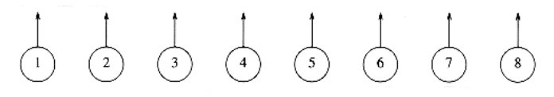
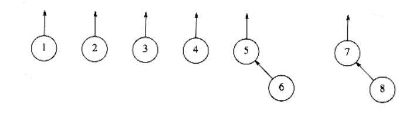
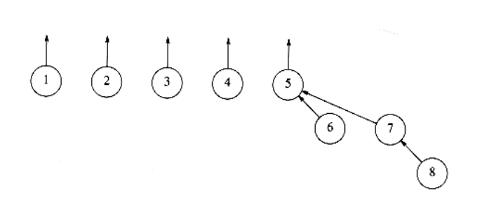
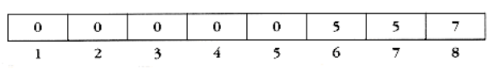
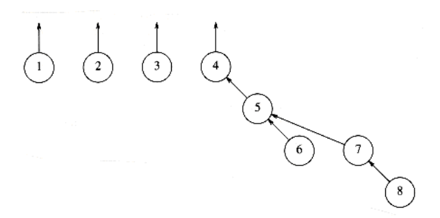
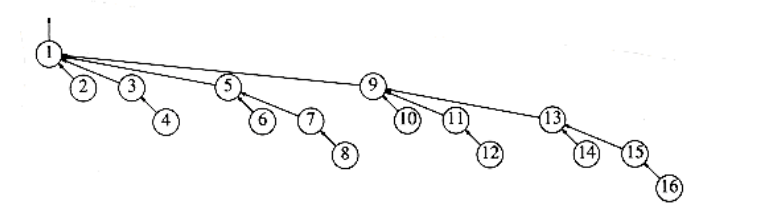
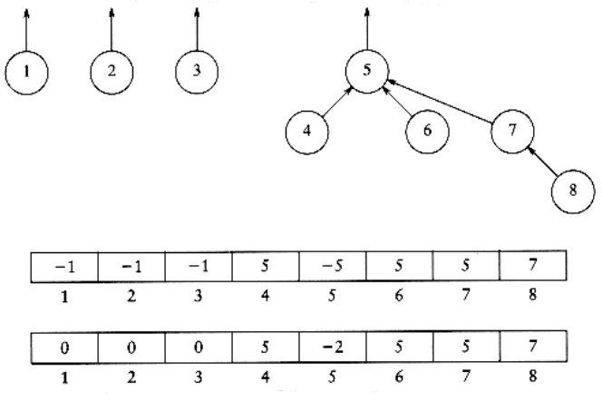
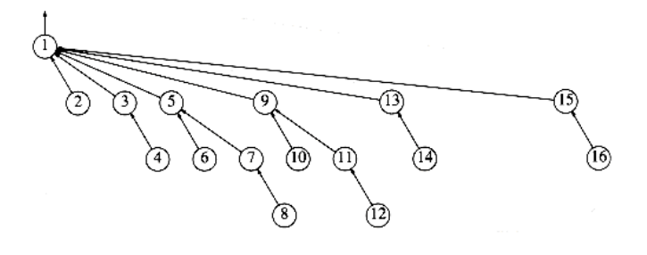
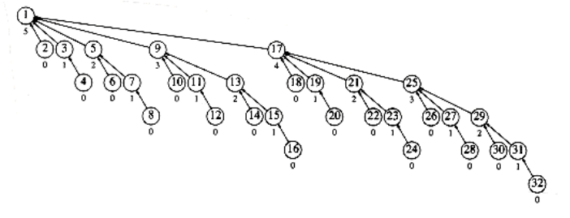
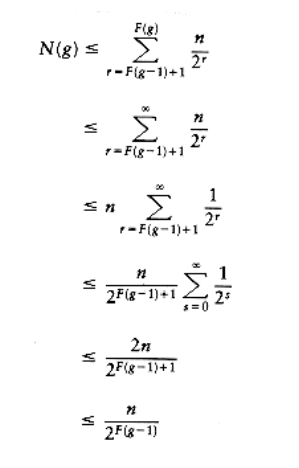

# THE DISJOINT SET ADT

In this chapter, we describe an efficient data structure to solve the equivalence problem. The data structure is simple to implement. Each routine requires only a few lines of code, and a simple array can be used. The implementation is also extremely fast, requiring constant average time per operation. This data structure is also very interesting from a theoretical point of view, because its analysis is extremely difficult; the functional form of the worst case is unlike any we have yet seen. For the disjoint set ADT, we will Show how it can be implemented with minimal coding effort.

- Greatly increase its speed, using just two simple observations.

- Analyze the running time of a fast implementation.

- See a simple application.

## Equivalence Relations

A relation R is defined on a set S if for every pair of elements (a, b), a, b S, a R b is either true or false. If a R b is true, then we say that a is related to b.

An equivalence relation is a relation R that satisfies three properties:

1. (Reflexive) a R a, for all a S.

2. (Symmetric) a R b if and only if b R a.

3. (Transitive) a R b and b R c implies that a R c.

We'll consider several examples.

The relationship is not an equivalence relationship. Although it is reflexive, since a a, and transitive, since a b and b c implies a c, it is not symmetric, since a b does not imply b a.

Electrical connectivity, where all connections are by metal wires, is an equivalence relation. The relation is clearly reflexive, as any component is connected to itself. If a is electrically connected to b, then b must be electrically connected to a, so the relation is symmetric. Finally, if a is connected to b and b is connected to c, then a is connected to c. Thus electrical connectivity is an equivalence relation.

Two cities are related if they are in the same country. It is easily verified that this is an equivalence relation. Suppose town a is related to b if it is possible to travel from a to b by taking roads. This relation is an equivalence relation if all the roads are two-way.

## The Dynamic Equivalence Problem

Given an equivalence relation ^~^, the natural problem is to decide, for any a and b, if a ^~^ b. If the relation is stored as a two-dimensional array of booleans, then, of course, this can be done in constant time. The problem is that the relation is usually not explicitly, but rather implicitly, defined.

As an example, suppose the equivalence relation is defined over the five-element set {a1, a2, a3, a4, a5}. Then there are 25 pairs of elements, each of which is

either related or not. However, the information a1^~^a2, a3 ^~^ a4, a5 ^~^ a1, a4 ^~^ a2 implies that all pairs are related. We would like to be able to infer this quickly.

The equivalence class of an element a S is the subset of S that contains all the elements that are related to a. Notice that the equivalence classes form a partition of S: Every member of S appears in exactly one equivalence class. To decide if a ^~^ b, we need only to check whether a and b are in the same equivalence class. This provides our strategy to solve the equivalence problem.

The input is initially a collection of n sets, each with one element. This initial representation is that all relations (except reflexive relations) are false. Each set has a different element, so that Si Sj = ; this makes the sets disjoint.

There are two permissible operations. The first is find, which returns the name of the set (that is, the equivalence class) containing a given element. The second operation adds relations. If we want to add the relation a ^~^ b, then we first see if a and b are already related. This is done by performing finds on both a and b and checking whether they are in the same equivalence class. If they are not, then we apply union. This operation merges the two equivalence classes containing a and b into a new equivalence class. From a set point of view, the result of is to create a new set Sk = Si Sj, destroying the originals and preserving the disjointness of all the sets. The algorithm to do this is frequently known as the disjoint set union/find algorithm for this reason.

This algorithm is dynamic because, during the course of the algorithm, the sets can change via the union operation. The algorithm must also operate on-line: When a find is performed, it must give an answer before continuing. Another possibility would be an off-line algorithm. Such an algorithm would be allowed to see the entire sequence of unions and finds. The answer it provides for each find must still be consistent with all the unions that were performed up until the find, but the algorithm can give all its answers after it has seen all the questions. The difference is similar to taking a written exam (which is generally off-line--you only have to give the answers before time expires), and an oral exam (which is on-line, because you must answer the current question before proceeding to the next question).

Notice that we do not perform any operations comparing the relative values of elements, but merely require knowledge of their location. For this reason, we can assume that all the elements have been numbered sequentially from 1 to n and that the numbering can be determined easily by some hashing scheme. Thus, initially we have Si = {i} for i = 1 through n.

Our second observation is that the name of the set returned by find is actually fairly abitrary. All that really matters is that find(x) = find() if and only if x and are in the same set.

These operations are important in many graph theory problems and also in compilers which process equivalence (or type) declarations. We will see an application later.

There are two strategies to solve this problem. One ensures that the find instruction can be executed in constant worst-case time, and the other ensures that the union instruction can be executed in constant worst-case time. It has recently been shown that both cannot be done simultaneously in constant worst- case time.

We will now briefly discuss the first approach. For the find operation to be fast, we could maintain, in an array, the name of the equivalence class for each element. Then find is just a simple O(1) lookup. Suppose we want to perform union (a, b). Suppose that a is in equivalence class i and b is in equivalence class j. Then we scan down the array, changing all is to j. Unfortunately, this scan takes (n). Thus, a sequence of n - 1 unions (the maximum, since then everything is in one set), would take (n2) time. If there are (n2) find operations, this performance is fine, since the total running time would then amount to O(1) for each union or find operation over the course of the algorithm. If there are fewer finds, this bound is not acceptable.

One idea is to keep all the elements that are in the same equivalence class in a linked list. This saves time when updating, because we do not have to search through the entire array. This by itself does not reduce the asymptotic running time, because it is still possible to perform (n2) equivalence class updates over the course of the algorithm.

If we also keep track of the size of each equivalence class, and when performing unions we change the name of the smaller equivalence class to the larger, then the total time spent for n - 1 merges isO (n log n). The reason for this is that each element can have its equivalence class changed at most log n times, since every time its class is changed, its new equivalence class is at least twice as large as its old. Using this strategy, any sequence of m finds and up to n - 1 unions takes at most O(m + n log n) time.

In the remainder of this chapter, we will examine a solution to the union/find problem that makes unions easy but finds hard. Even so, the running time for any sequences of at most m finds and up to n - 1 unions will be only a little more than O(m + n).

## Basic Data Structure

Recall that the problem does not require that a find operation return any specific name, just that finds on two elements return the same answer if and only if they are in the same set. One idea might be to use a tree to represent each set, since each element in a tree has the same root. Thus, the root can be used to name the set. We will represent each set by a tree. (Recall that a collection of trees is known as a forest.) Initially, each set contains one element. The trees we will use are not necessarily binary trees, but their representation is easy, because the only information we will need is a parent pointer. The name of a set is given by the node at the root. Since only the name of the parent is required, we can assume that this tree is stored implicitly in an array: each entry p[i] in the array represents the parent of element i. If i is a root, then p[i] = 0. In the forest in Figure 8.1, p[i] = 0 for 1 i 8. As with heaps, we will draw the trees explicitly, with the understanding that an array is being used. Figure 8.1 shows the explicit representation. We will draw the root's parent pointer vertically for convenience.

To perform a union of two sets, we merge the two trees by making the root of one tree point to the root of the other. It should be clear that this operation takes constant time. Figures 8.2, 8.3, and 8.4 represent the forest after each of union (5,6) union(7,8), union(5,7), where we have adopted the convention that the new root after the union(x,y) is x. The implicit representation of the last forest is shown in Figure 8.5.

A find(x) on element x is performed by returning the root of the tree containing x. The time to perform this operation is proportional to the depth of the node representing x, assuming, of course, that we can find the node representing x in constant time. Using the strategy above, it is possible to create a tree of depth n - 1, so the worst-case running time of a find is O(n). Typically, the running time is computed for a sequence of m intermixed instructions. In this case, m consecutive operations could take O(mn) time in the worst case.

The code in Figures 8.6 through 8.9 represents an implementation of the basic algorithm, assuming that error checks have already been performed. In our routine, unions are performed on the roots of the trees. Sometimes the operation is performed by passing any two elements, and having the union perform two finds to determine the roots.

The average-case analysis is quite hard to do. The least of the problems is that


the answer depends on how to define average (with respect to the union operation). For instance, in the forest in Figure 8.4, we could say that since

there are five trees, there are 5 4 = 20 equally likely results of the next union (as any two different trees can be unioned). Of course, the implication of

this model is that there is only a chance that the next union will involve the large tree. Another model might say that all unions between any two elements in different trees are equally likely, so a larger tree is more likely to be involved in the next union than a smaller tree. In the example above, there is an

chance that the large tree is involved in the next union, since (ignoring symmetries) there are 6 ways in which to merge two elements in {1, 2, 3, 4}, and 16 ways to merge an element in {5, 6, 7, 8} with an element in {1, 2, 3, 4}. There are still more models and no general agreement on which is the best. The

average running time depends on the model; (m), (m log n), and (mn) bounds have actually been shown for three different models, although the latter bound is thought to be more realistic.


**Figure 8.1 Eight elements, initially in different sets**


**Figure 8.2 After union (5, 6)**


**Figure 8.3 After union (7, 8)**

  

**Figure 8.4 After union (5, 7)**


**Figure 8.5 Implicit representation of previous tree**

typedef int DISJ_SET[ NUM_SETS+1 ];

typedef unsigned int set_type;

typedef unsigned int element_type;


**Figure 8.6 Disjoint set type declaration**
```c
void initialize(DISJ_SET S)
{

int i;

for(i = NUN_SETS; i > 0; i--)

S[i] = 0;

}

**Figure 8.7 Disjoint set initialization routine**

/* Assumes root1 and root2 are roots. */

/* union is a C keyword, so this routine is named set_union. */

void set_union(DISJ_SET S, set_type root1, set_type root2)
{

S[root2] = root1;


}

**Figure 8.8 Union (not the best way)**

set_type

find(element_type x, DISJ_SET S)
{

if(S[x] <= 0)
return x;

else
return(find(S[x], S));

}
```
**Figure 8.9 A simple disjoint set find algorithm**

Quadratic running time for a sequence of operations is generally unacceptable. Fortunately, there are several ways of easily ensuring that this running time does not occur.

## Smart Union Algorithms

The unions above were performed rather arbitrarily, by making the second tree a subtree of the first. A simple improvement is always to make the smaller tree a subtree of the larger, breaking ties by any method; we call this approach union- by-size. The three unions in the preceding example were all ties, and so we can consider that they were performed by size. If the next operation were union (4, 5), then the forest in Figure 8.10 would form. Had the size heuristic not been used, a deeper forest would have been formed (Fig. 8.11).


**Figure 8.10 Result of union-by-size**


**Figure 8.11 Result of an arbitrary union**


**Figure 8.12 Worst-case tree for n = 16**

We can prove that if unions are done by size, the depth of any node is never more than log n. To see this, note that a node is initially at depth 0. When its depth increases as a result of a union, it is placed in a tree that is at least twice as large as before. Thus, its depth can be increased at most log n times. (We used this argument in the quick-find algorithm at the end of Section 8.2.) This implies that the running time for a find operation is O(log n), and a sequence of m operations takes O(m log n). The tree in Figure 8.12 shows the worst tree possible after 16 unions and is obtained if all unions are between equal-sized trees (the worst-case trees are binomial trees, discussed in Chapter 6).

To implement this strategy, we need to keep track of the size of each tree. Since we are really just using an array, we can have the array entry of each root contain the negative of the size of its tree. Thus, initially the array representation of the tree is all -1s (and Fig 8.7 needs to be changed accordingly). When a union is performed, check the sizes; the new size is the sum of the old. Thus, union-by-size is not at all difficult to implement and requires no extra space. It is also fast, on average. For virtually all reasonable models, it has been shown that a sequence of m operations requires O(m) average time if union-by-size is used. This is because when random unions are performed, generally very small (usually one-element) sets are merged with large sets throughout the algorithm.

An alternative implementation, which also guarantees that all the trees will have depth at most O(log n), is union-by-height. We keep track of the height, instead of the size, of each tree and perform unions by making the shallow tree a subtree of the deeper tree. This is an easy algorithm, since the height of a tree increases only when two equally deep trees are joined (and then the height goes up by one). Thus, union-by-height is a trivial modification of union-by-size.

The following figures show a tree and its implicit representation for both union- by-size and union-by-height. The code in Figure 8.13 implements union-by-height.


## Path Compression

The union/find algorithm, as described so far, is quite acceptable for most cases. It is very simple and linear on average for a sequence of m instructions (under all models). However, the worst case of O(m log n) can occur fairly easily and naturally.
```c
/* assume root1 and root2 are roots */

/* union is a C keyword, so this routine is named set_union */

void set_union (DISJ_SET S, set_type root1, set_type root2)
{

if(S[root2] < S[root1]) /* root2 is deeper set */

S[root1] = root2; /* make root2 new root */

else{

if(S[root2] == S[root1]) /* same height, so update */


S[root1]--;

S[root2] = root1; /* make root1 new root */

}

}
```
**Figure 8.13 Code for union-by-height (rank)**

For instance, if we put all the sets on a queue and repeatedly dequeue the first two sets and enqueue the union, the worst case occurs. If there are many more finds than unions, this running time is worse than that of the quick-find algorithm. Moreover, it should be clear that there are probably no more improvements possible for the union algorithm. This is based on the observation that any method to perform the unions will yield the same worst-case trees, since it must break ties arbitrarily. Therefore, the only way to speed the algorithm up, without reworking the data structure entirely, is to do something clever on the find operation.

The clever operation is known as path compression. Path compression is performed during a find operation and is independent of the strategy used to perform unions. Suppose the operation is find(x). Then the effect of path compression is that every node on the path from x to the root has its parent changed to the root. Figure 8.14 shows the effect of path compression after find (15) on the generic worst tree of Figure 8.12.

The effect of path compression is that with an extra two pointer moves, nodes 13 and 14 are now one position closer to the root and nodes 15 and 16 are now two positions closer. Thus, the fast future accesses on these nodes will pay (we hope) for the extra work to do the path compression.

As the code in Figure 8.15 shows, path compression is a trivial change to the basic find algorithm. The only change to the find routine is that S[x] is made equal to the value returned by find; thus after the root of the set is found recursively, x is made to point directly to it. This occurs recursively to every node on the path to the root, so this implements path compression. As we stated when we implemented stacks and queues, modifying a parameter to a function called is not necessarily in line with current software engineering rules. Some languages will not allow this, so this code may well need changes.


**Figure 8.14 An example of path compression**
```c
set_type

find(element_type x, DISJ_SET S)
{

if(S[x] <= 0)
return x;

else
return(S[x] = find(S[x], S));

}
```
**Figure 8.15 Code for disjoint set find with path compression**

When unions are done arbitrarily, path compression is a good idea, because there is an abundance of deep nodes and these are brought near the root by path compression. It has been proven that when path compression is done in this case, a sequence of m operations requires at most O(m log n) time. It is still an open problem to determine what the average-case behavior is in this situation.

Path compression is perfectly compatible with union-by-size, and thus both routines can be implemented at the same time. Since doing union-by-size by itself is expected to execute a sequence of m operations in linear time, it is not clear that the extra pass involved in path compression is worthwhile on average. Indeed, this problem is still open. However, as we shall see later, the combination of path compression and a smart union rule guarantees a very efficient algorithm in all cases.

Path compression is not entirely compatible with union-by-height, because path compression can change the heights of the trees. It is not at all clear how to re-compute them efficiently. The answer is do not!! Then the heights stored for each tree become estimated heights (sometimes known as ranks), but it turns out that union-by-rank (which is what this has now become) is just as efficient in theory as union-by-size. Furthermore, heights are updated less often than sizes. As with union-by-size, it is not clear whether path compression is worthwhile on average. What we will show in the next section is that with either union heuristic, path compression significantly reduces the worst-case running time.

## Worst Case for Union-by-Rank and Path Compression

When both heuristics are used, the algorithm is almost linear in the worst case.

Specifically, the time required in the worst case is (m (m, n)) (provided m, n), where (m, n) is a functional inverse of Ackerman's function, which is defined below:*

A(1, j) = 2j for j 1

A(i, 1) = A(i - 1, 2) for i 2

A(i, j) = A(i - 1,A(i, j - 1)) for i, j 2

**Ackerman's function is frequently defined with A(1, j) = j + 1 for j 1. the form in this text grows faster; thus, the inverse grows more slowly.**

From this, we define

(m, n) = min{i 1|A(i, m/ n) > log n}

You may want to compute some values, but for all practical purposes, (m, n) 4, which is all that is really important here. The single-variable inverse Ackerman function, sometimes written as log\*n, is the number of times the logarithm of n needs to be applied until n 1. Thus, log\* 65536 = 4, because log log log log 65536 = 1. log\* 265536 = 5, but keep in mind that 265536 is a 20,000-digit number. (m, n) actually grows even slower then log\* n. However, (m, n) is not a constant, so the running time is not linear.

In the remainder of this section, we will prove a slightly weaker result. We will show that any sequence of m = (n) union/find operations takes a total of O(m log* n) running time. The same bound holds if union-by-rank is replaced with union-by-size. This analysis is probably the most complex in the book and one of the first truly complex worst-case analyses ever performed for an algorithm that is essentially trivial to implement.

### Analysis of the Union/Find Algorithm

In this section we establish a fairly tight bound on the running time of a sequence of m = (n) union/find operations. The unions and finds may occur in any order, but unions are done by rank and finds are done with path compression.

We begin by establishing some lemmas concerning the number of nodes of rank r. Intuitively, because of the union-by-rank rule, there are many more nodes of small rank than large rank. In particular, there can be at most one node of rank log n. What we would like to do is to produce as precise a bound as possible on the number of nodes of any particular rank r. Since ranks only change when unions are performed (and then only when the two trees have the same rank), we can prove this bound by ignoring the path compression.

LEMMA 8.1.

When executing a sequence of union instructions, a node of rank r must have 2r descendants (including itself).

PROOF:

By induction. the basis, r = 0, is clearly true. Let T be the tree of rank r with the fewest number of descendants and let x be T's root. Suppose the last union x was involved in was between T1 and T2. Suppose T1's root was x. If T1 had rank r, then T1 would be a tree of height r with fewer descendants than T, which contradicts the assumption that T is the tree with the smallest number of descendants. Hence the rank of T1 r - 1. The rank of T2 rank of T1.

Since T has rank r and the rank could only increase because of T2, it follows that the rank of T2 = r - 1. Then the rank of T1 = r - 1. By the induction hypothesis, each tree has at least 2r-1 descendants, giving a total of 2r and establishing the lemma.

Lemma 8.1 tells us that if no path compression is performed, then any node of rank r must have at least 2r descendants. Path compression can change this, of course, since it can remove descendants from a node. However, when unions are performed, even with path compression, we are using the ranks, which are estimated heights. These ranks behave as though there is no path compression. Thus, when bounding the number of nodes of rank r, path compression can be ignored.

Thus, the next lemma is valid with or without path compression.

LEMMA 8.2.

The number of nodes of rank r is at most n/2r.

PROOF:

Without path compression, each node of rank r is the root of a subtree of at least 2r nodes. No node in the subtree can have rank r. Thus all subtrees of nodes of rank r are disjoint.

Therefore, there are at most n/2r disjoint subtrees and hence n/2r nodes of rank r.

The next lemma seems somewhat obvious, but is crucial in the analysis.

LEMMA 8.3.

At any point in the union/find algorithm, the ranks of the nodes on a path from the left to a root increase monotonically.

PROOF:

The lemma is obvious if there is no path compression (see the example). If, after path compression, some node v is a descendant of w, then clearly v must have been a descendant of w when only unions were considered. Hence the rank of v is less than the rank of w.

Let us summarize the preliminary results. Lemma 8.2 tells us how many nodes can be assigned rank r. Because ranks are assigned only by unions, which have no idea of path compression, Lemma 8.2 is valid at any stage of the union/find algorithm--even in the midst of path compression. Figure 8.16 shows that while there are many nodes of ranks 0 and 1, there are fewer nodes of rank r as r gets larger.

Lemma 8.2 is tight, in the sense that it is possible for there to be n/2r nodes for any rank r. It is slightly loose, because it is not possible for the bound to hold for all ranks r simultaneously. While Lemma 8.2 describes the number of nodes in a rank r, Lemma 8.3 tells us their distribution. As one would expect, the rank of nodes is strictly increasing along the path from a leaf to the root.

We are now ready to prove the main theorem. Our basic idea is as follows: A find on any node v costs time proportional to the number of nodes on the path from v to the root. Let us, then, charge one unit of cost for every node on the path from v to the root for each find. To help us count the charges, we will deposit an imaginary penny into each node on the path. This is strictly an accounting gimmick, which is not part of the program. When the algorithm is over, we collect all the coins that have been deposited; this is the total cost.

As a further accounting gimmick, we deposit both American and Canadian pennies. We will show that during the execution of the algorithm, we can deposit only a certain number of American pennies during each find. We will also show that we can deposit only a certain number of Canadian pennies to each node. Adding these two totals gives us a bound on the total number of pennies that can be deposited.

We now sketch our accounting scheme in a little more detail. We will divide the nodes by their ranks. We then divide the ranks into rank groups. On each find, we will deposit some American coins into the general kitty and some Canadian coins into specific vertices. To compute the total number of Canadian coins deposited, we will compute the deposits per node. By adding up all the deposits for each node in rank r, we will get the total deposits per rank r. Then we will add up all the deposits for each rank r in group g and thereby obtain the total deposits for each rank group g. Finally, we add up all the deposits for each rank group g to obtain the total number of Canadian coins deposited in the forest. Adding this to the number of American coins in the kitty gives us the answer.

We will partition ranks into groups. Ranks r goes into group G(r), and G will be determined later. The largest rank in any rank group g is F(g), where F = G-1 is the inverse of G. The number of ranks in any rank group, g > 0, is thus F(g) - F(g - 1). Clearly G(n) is a very loose upper bound on the largest rank group. As an example, suppose that we partitioned the ranks as in Figure 8.7. In this case, . The largest rank in group g is F(g) = g2, and observe that group g > 0 contains ranks F(g - 1) + 1 through F(g) inclusive. This formula does not apply for rank group 0, so for convenience we will ensure that rank group 0 contains only elements of rank 0. Notice that the groups are made of consecutive ranks.


Figure 8.16 A large disjoint set tree (numbers below nodes are ranks)

As mentioned before, each union instruction takes constant time, as long as each root keeps track of how big its subtrees are. Thus, unions are essentially free, as far as this proof goes.

Each find(i) takes time proportional to the number of vertices on the path from the vertex representing i to the root. We will thus deposit one penny for each vertex on the path. If this is all we do, however, we cannot expect much of a bound, because we are not taking advantage of path compression. Thus, we need to take advantage of path compression in our analysis. We will use fancy accounting.

For each vertex, v, on the path from the vertex representing i to the root, we deposit one penny under one of two accounts:

1. If v is the root, or if the parent of v is the root, or if the parent of v is in a different rank group from v, then charge one unit under this rule. This deposits an American penny into the kitty.

2. Otherwise deposit a Canadian penny into the vertex.

LEMMA 8.4.

For any find (v), the total number of pennies deposited, either into the kitty or into a vertex, is exactly equal to the number of nodes on the path from v to the root.

PROOF:

Obvious.

Thus all we need to do is to sum all the American pennies deposited under rule 1 with all the Canadian pennies deposited under rule 2.

We are doing at most m finds. We need to bound the number of pennies that can be deposited into the kitty during a find.

LEMMA 8.5

Over the entire algorithm, the total deposits of American pennies under rule 1 amount to m(G(n) + 2).

Group Rank

------------------------------


0 0

1 1

2 2,3,4

3 5 through 9

4 10 through 16

i (i-1)2 + 1 through i2

**Figure 8.17 Possible partitioning of ranks into groups**

PROOF:

This is easy. For any find, two American pennies are deposited, because of the root and its child. By Lemma 8.3, the vertices going up the path are monotonically increasing in rank, and since there are at most G(n) rank groups, only G(n) other vertices on the path can qualify as a rule 1 deposit for any particular find. Thus, during any one find, at most G(n) + 2 American pennies can be placed in the kitty. Thus, at most m(G(n) + 2) American pennies can be deposited under rule 1 for a sequence of m finds.

To get a good estimate for all the Canadian deposits under rule 2, we will add up the deposits by vertices instead of by find instructions. If a coin is deposited into vertex v under rule 2, v will be moved by path compression and get a new parent of higher rank than its old parent. (This is where we are using the fact that path compression is being done.) Thus, a vertex v in rank group g > 0 can be moved at most F(g) - F(g - 1) times before its parent gets pushed out of rank group g, since that is the size of the rank group.* After this happens, all future charges to v will go under rule 1.

*This can be reduced by 1. We do not for the sake of clarity; the bound is not improved by being more careful here.

LEMMA 8.6.

The number of vertices, N(g), in rank group g > 0 is at most n/2F(g - 1).

PROOF:

By Lemma 8.2, there are at most n/2r vertices of rank r. Summing over the ranks in group g, we obtain


LEMMA 8.7.

The number of Canadian pennies deposited into all vertices in rank group g is at most nF(g)/2F(g - 1).

PROOF:

Each vertex in the rank group can receive at most F(g) - F(g - 1) F(g) Canadian pennies while its parent stays in its rank group, and Lemma 8.6 tells how many such vertices there are The result is obtained by a simple multiplication.

LEMMA 8.8.

The total deposit under rule 2 is at most n Canadian pennies.

PROOF:

Because rank group 0 contains only elements of rank 0, it cannot contribute to rule 2 charges (it cannot have a parent in the same rank group). The bound is obtained by summing the other rank groups.

Thus we have the deposits under rules 1 and 2. The total is

(8.1)

We still have not specified G(n) or its inverse F(n). Obviously, we are free to choose virtually anything we want, but it makes sense to choose G(n) to minimize the bound above. However, if G(n) is too small, then F(n) will be large, hurting the bound. An apparently good choice is to choose F(i) to be the function recursively defined by F(0) = 0 and F(i) = 2F(i - 1). This gives G(n) = 1 +[log* n]. Figure 8.18 shows how this partitions the ranks. Notice that group 0 contains only rank 0, which we required in the previous lemma. F is very similar to the single-variable Ackerman function, which differs only in the definition of the base case (F(0) = 1).

THEOREM 8.1.

The running time of m unions and finds is O(m log* n).

Group Rank

---------------------------

0 0

1 1

2 2

3 3,4

4 5 through 16

5 17 through 216

6 65537 through 265536

7 truly huge ranks

**Figure 8.18 Actual partitioning of ranks into groups used in the proof**

PROOF:

Plug in the definitions of F and G into Equation (8.1). The total number of American pennies is O (mG(n)) = O(m log* n). The total number of Canadian pennies is Since m = (n), the bound follows.

What the analysis shows is that there are few nodes that could be moved frequently by path compression, and thus the total time spent is relatively small.

## An Application

As an example of how this data structure might be used, consider the following problem. We have a network of computers and a list of bidirectional connections; each of these connections allows a file transfer from one computer to another. Is it possible to send a file from any computer on the network to any other? An extra restriction is that the problem must be solved on-line. Thus, the list of connections is presented one at a time, and the algorithm must be prepared to give an answer at any point.

An algorithm to solve this problem can initially put every computer in its own set. Our invariant is that two computers can transfer files if and only if they are in the same set. We can see that the ability to transfer files forms an equivalence relation. We then read connections one at a time. When we read some connection, say (u, v), we test to see whether u and v are in the same set and do nothing if they are. If they are in different sets, we merge their sets. At the end of the algorithm, the graph is connected if and only if there is exactly one set. If there are m connections and n computers, the space requirement is O(n). Using union-by-size and path compression, we obtain a worst-case running time of O(m (m, n)), since there are 2m finds and at most n - 1 unions. This running time is linear for all practical purposes.

We will see a much better application in the next chapter.

## Summary

We have seen a very simple data structure to maintain disjoint sets. When the union operation is performed, it does not matter, as far as correctness is concerned, which set retains its name. A valuable lesson that should be learned here is that it can be very important to consider the alternatives when a particular step is not totally specified. The union step is flexible; by taking advantage of this, we are able to get a much more efficient algorithm.

Path compression is one of the earliest forms of self-adjustment, which we have seen elsewhere (splay trees, skew heaps). Its use is extremely interesting, especially from a theoretical point of view, because it was one of the first examples of a simple algorithm with a not-so-simple worst-case analysis.

## Exercises

8.1 Show the result of the following sequence of instructions: union(1, 2), union(3, 4), union(3,

5), union(1, 7), union(3, 6), union(8, 9), union(1, 8), union(3, 10), union(3, 11), union(3, 12), union(3, 13), union(14, 15), union(16, 17), union(14, 16), union(1, 3), union(1, 14), when the unions are

a. performed arbitrarily

b. performed by height

c. performed by size

8.2 For each of the trees in the previous exercise, perform a find with path compression on the deepest node.

8.3 Write a program to determine the effects of path compression and the various unioning

strategies. Your program should process a long sequence of equivalence operations using all six of the possible strategies.

8.4 Show that if unions are performed by height, then the depth of any tree is O(log n) .


8.5 a. Show that if m = n2, then the running time of m union/find operations is O(m).

b. Show that if m = n log n, then the running time of m union/find operations is O(m) .

*c. Suppose m = (n log log n). What is the running time of m union/find operations?

*d. Suppose m = (n log* n). What is the running time of m union/find operations?

8.6 Show the operation of the program in Section 8.7 on the following graph: (1,2), (3,4), (3,6),

(5,7), (4,6), (2,4), (8,9), (5,8). What are the connected components?

8.7 Write a program to implement the algorithm in Section 8.7.

*8.8 Suppose we want to add an extra operation, deunion, which undoes the last union operation that has not been already undone.

a. Show that if we do union-by-height and finds without path compression, then deunion is easy and a sequence of m union, find, and deunion operations take O(m log n) time.

b. Why does path compression make deunion hard?

**c. Show how to implement all three operations so that the sequence of m operations takes O(m log n/log log n) time.

*8.9 Suppose we want to add an extra operation, remove(x), which removes x from its current set and places it in its own. Show how to modify the union/find algorithm so that the running time of a sequence of m union, find, and remove operations is O(m (m, n)).

*8.10 Give an algorithm that takes as input an n-vertex tree and a list of n pairs of vertices and determines for each pair (v, w) the closest common ancestor of v and w. Your algorithm should run in O(n log\* n).

*8.11 Show that if all of the unions precede the finds, then the disjoint set algorithm with path compression requires linear time, even if the unions are done arbitrarily.

*8.12 Prove that if unions are done arbitrarily, but path compression is performed on the finds, then the worst-case running time is (m log n).


8.13 Prove that if unions are done by size and path compression is performed, the worst-case running time is O(m log* n).

8.14 Suppose we implement partial path compression on find(i) by making every other node on the path from i to the root point to its grandparent (where this makes sense). This is known as path halving.

a. Write a procedure to do this.

b. Prove that if path halving is performed on the finds and either union-by-height or union-by- size is used, the worst-case running time is O(m log* n).

## References

Various solutions to the union/find problem can be found in [5], [8], and [10]. Hopcroft and Ullman showed the O(m log* n) bound of Section 8.6. Tarjan [14] obtained the bound O(m (m,n)). A more precise (but asymptotically identical) bound for m < n appears in [2] and [17]. Various other strategies for path compression and unions also achieve the same bound; see [17] for details.

A lower bound showing that under certain restrictions (m (m,n)) time is required to process m union/find operations was given by Tarjan [15]. Identical bounds under less restrictive conditions have been recently shown in [6] and [13].

Applications of the union/find data structure appear in [1] and [9]. Certain special cases of the union/find problem can be solved in O(m) time [7]. This reduces the running time of several algorithms, such as [1], graph dominance, and reducibility (see references in Chapter 9) by a

factor of (m,n). Others, such as [9] and the graph connectivity problem in this chapter, are unaffected. The paper lists 10 examples. Tarjan has used path compression to obtain efficient algorithms for several graph problems [16].

Average-case results for the union/find problem appear in [4], [11], and [19]. Results bounding the running time of any single operation (as opposed to the entire sequence) appear in [3] and [12].

Exercise 8.8 is solved in [18].

1. A. V. Aho, J. E. Hopcroft, J. D. Ullman, "On Finding Lowest Common Ancestors in Trees," SIAM Journal on Computing 5 (1976), 115-132.

2. L. Banachowski, "A Complement to Tarjan's Result about the Lower Bound on the Complexity of the Set Union Problem," Information Processing Letters 11 (1980), 59-65.

3. N. Blum, "On the Single-operation Worst-case Time Complexity of the Disjoint Set UnionProblem," SIAM Journal on Computing 15 (1986), 1021-1024.

4. J. Doyle and R. L. Rivest, "Linear Expected Time of a Simple Union Find Algorithm,"Information Processing Letters 5 (1976), 146-148.

5. M. J. Fischer, "Efficiency of Equivalence Algorithms," Complexity of Computer Computation (eds. R. E. Miller and J. W. Thatcher), Plenum Press, 1972, 153-168.

6. M. L. Fredman and M. E. Saks, "The Cell Probe Complexity of Dynamic Data Structures,"Proceedings of the Twenty-first Annual Symposium on Theory of Computing (1989), 345-354.

7. H. N. Gabow and R. E. Tarjan, "A Linear-time Algorithm for a Special Case of Disjoint Set Union,"Journal of Computer and System Sciences 30 (1985), 209-221.

8. B. A. Galler and M. J. Fischer, "An Improved Equivalence Algorithm," Communications of the ACM 7 (1964), 301-303.

9. J. E. Hopcroft and R. M. Karp, "An Algorithm for Testing the Equivalence of Finite Automata,"Technical Report TR-71-114, Department of Computer Science, Cornell University, Ithaca, NY, 1971.

10. J. E. Hopcroft and J. D. Ullman, "Set Merging Algorithms," SIAM Journal on Computing 2 (1973), 294-303.

11. D. E. Knuth and A. Schonhage, "The Expected Linearity of a Simple Equivalence Algorithm," Theoretical Computer Science 6 (1978), 281-315.

12. J. A. LaPoutre, "New Techniques for the Union-Find Problem," Proceedings of the First Annual ACM-SIAM Symposium on Discrete Algorithms (1990), 54-63.

13. J. A. LaPoutre, "Lower Bounds for the Union-Find and the Split-Find Problem on Pointer Machines," Proceedings of the Twenty Second Annual ACM Symposium on Theory of Computing (1990), 34-44.

14. R. E. Tarjan, "Efficiency of a Good but Not Linear Set Union Algorithm," Journal of the ACM 22 (1975), 215-225.

15. R. E. Tarjan, "A Class of Algorithms Which Require Nonlinear Time to Maintain Disjoint Sets,"Journal of Computer and System Sciences 18 (1979), 110-127.

16. R. E. Tarjan, "Applications of Path Compression on Balanced Trees," Journal of the ACM 26 (1979), 690-715.

17. R. E. Tarjan and J. van Leeuwen, "Worst Case Analysis of Set Union Algorithms," Journal of the ACM 31 (1984), 245-281.

18. J. Westbrook and R. E. Tarjan, "Amortized Analysis of Algorithms for Set Union with Backtracking," SIAM Journal on Computing 18 (1989), 1-11.

19. A. C. Yao, "On the Average Behavior of Set Merging Algorithms," Proceedings of Eighth Annual ACM Symposium on the Theory of Computation (1976), 192-195.


