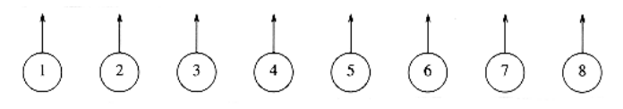
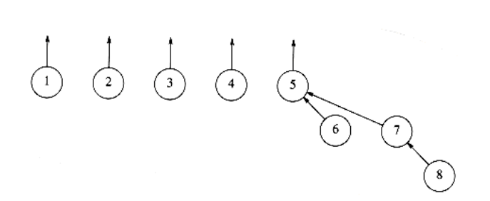

# Basic Data Structure

Recall that the problem does not require that a find operation return any specific name, just that finds on two elements return the same answer if and only if they are in the same set. One idea might be to use a tree to represent each set, since each element in a tree has the same root. Thus, the root can be used to name the set. We will represent each set by a tree. (Recall that a collection of trees is known as a forest.) Initially, each set contains one element. The trees we will use are not necessarily binary trees, but their representation is easy, because the only information we will need is a parent pointer. The name of a set is given by the node at the root. Since only the name of the parent is required, we can assume that this tree is stored implicitly in an array: each entry p[i] in the array represents the parent of element i. If i is a root, then p[i] = 0. In the forest in Figure 8.1, p[i] = 0 for 1 i 8. As with heaps, we will draw the trees explicitly, with the understanding that an array is being used. Figure 8.1 shows the explicit representation. We will draw the root's parent pointer vertically for convenience.

To perform a union of two sets, we merge the two trees by making the root of one tree point to the root of the other. It should be clear that this operation takes constant time. Figures 8.2, 8.3, and 8.4 represent the forest after each of union (5,6) union(7,8), union(5,7), where we have adopted the convention that the new root after the union(x,y) is x. The implicit representation of the last forest is shown in Figure 8.5.

A find(x) on element x is performed by returning the root of the tree containing x. The time to perform this operation is proportional to the depth of the node representing x, assuming, of course, that we can find the node representing x in constant time. Using the strategy above, it is possible to create a tree of depth n - 1, so the worst-case running time of a find is O(n). Typically, the running time is computed for a sequence of m intermixed instructions. In this case, m consecutive operations could take O(mn) time in the worst case.

The code in Figures 8.6 through 8.9 represents an implementation of the basic algorithm, assuming that error checks have already been performed. In our routine, unions are performed on the roots of the trees. Sometimes the operation is performed by passing any two elements, and having the union perform two finds to determine the roots.

The average-case analysis is quite hard to do. The least of the problems is that


the answer depends on how to define average (with respect to the union operation). For instance, in the forest in Figure 8.4, we could say that since

there are five trees, there are 5 4 = 20 equally likely results of the next union (as any two different trees can be unioned). Of course, the implication of

this model is that there is only a chance that the next union will involve the large tree. Another model might say that all unions between any two elements in different trees are equally likely, so a larger tree is more likely to be involved in the next union than a smaller tree. In the example above, there is an

chance that the large tree is involved in the next union, since (ignoring symmetries) there are 6 ways in which to merge two elements in {1, 2, 3, 4}, and 16 ways to merge an element in {5, 6, 7, 8} with an element in {1, 2, 3, 4}. There are still more models and no general agreement on which is the best. The

average running time depends on the model; (m), (m log n), and (mn) bounds have actually been shown for three different models, although the latter bound is thought to be more realistic.


**Figure 8.1 Eight elements, initially in different sets**


**Figure 8.2 After union (5, 6)**


**Figure 8.3 After union (7, 8)**

  

**Figure 8.4 After union (5, 7)**


**Figure 8.5 Implicit representation of previous tree**

typedef int DISJ_SET[ NUM_SETS+1 ];

typedef unsigned int set_type;

typedef unsigned int element_type;


**Figure 8.6 Disjoint set type declaration**
```c
void initialize(DISJ_SET S)
{

int i;

for(i = NUN_SETS; i > 0; i--)

S[i] = 0;

}

**Figure 8.7 Disjoint set initialization routine**

/* Assumes root1 and root2 are roots. */

/* union is a C keyword, so this routine is named set_union. */

void set_union(DISJ_SET S, set_type root1, set_type root2)
{

S[root2] = root1;


}

**Figure 8.8 Union (not the best way)**

set_type

find(element_type x, DISJ_SET S)
{

if(S[x] <= 0)
return x;

else
return(find(S[x], S));

}
```
**Figure 8.9 A simple disjoint set find algorithm**

Quadratic running time for a sequence of operations is generally unacceptable. Fortunately, there are several ways of easily ensuring that this running time does not occur.