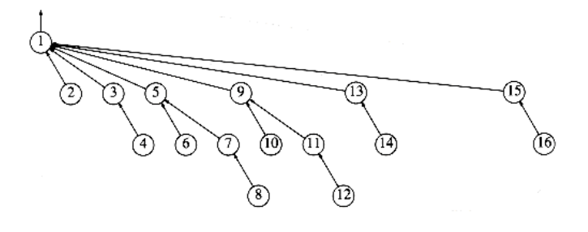

# Path Compression

The union/find algorithm, as described so far, is quite acceptable for most cases. It is very simple and linear on average for a sequence of m instructions (under all models). However, the worst case of O(m log n) can occur fairly easily and naturally.
```c
/* assume root1 and root2 are roots */

/* union is a C keyword, so this routine is named set_union */

void set_union (DISJ_SET S, set_type root1, set_type root2)
{

if(S[root2] < S[root1]) /* root2 is deeper set */

S[root1] = root2; /* make root2 new root */

else{

if(S[root2] == S[root1]) /* same height, so update */


S[root1]--;

S[root2] = root1; /* make root1 new root */

}

}
```
**Figure 8.13 Code for union-by-height (rank)**

For instance, if we put all the sets on a queue and repeatedly dequeue the first two sets and enqueue the union, the worst case occurs. If there are many more finds than unions, this running time is worse than that of the quick-find algorithm. Moreover, it should be clear that there are probably no more improvements possible for the union algorithm. This is based on the observation that any method to perform the unions will yield the same worst-case trees, since it must break ties arbitrarily. Therefore, the only way to speed the algorithm up, without reworking the data structure entirely, is to do something clever on the find operation.

The clever operation is known as path compression. Path compression is performed during a find operation and is independent of the strategy used to perform unions. Suppose the operation is find(x). Then the effect of path compression is that every node on the path from x to the root has its parent changed to the root. Figure 8.14 shows the effect of path compression after find (15) on the generic worst tree of Figure 8.12.

The effect of path compression is that with an extra two pointer moves, nodes 13 and 14 are now one position closer to the root and nodes 15 and 16 are now two positions closer. Thus, the fast future accesses on these nodes will pay (we hope) for the extra work to do the path compression.

As the code in Figure 8.15 shows, path compression is a trivial change to the basic find algorithm. The only change to the find routine is that S[x] is made equal to the value returned by find; thus after the root of the set is found recursively, x is made to point directly to it. This occurs recursively to every node on the path to the root, so this implements path compression. As we stated when we implemented stacks and queues, modifying a parameter to a function called is not necessarily in line with current software engineering rules. Some languages will not allow this, so this code may well need changes.


**Figure 8.14 An example of path compression**
```c
set_type

find(element_type x, DISJ_SET S)
{

if(S[x] <= 0)
return x;

else
return(S[x] = find(S[x], S));

}
```
**Figure 8.15 Code for disjoint set find with path compression**

When unions are done arbitrarily, path compression is a good idea, because there is an abundance of deep nodes and these are brought near the root by path compression. It has been proven that when path compression is done in this case, a sequence of m operations requires at most O(m log n) time. It is still an open problem to determine what the average-case behavior is in this situation.

Path compression is perfectly compatible with union-by-size, and thus both routines can be implemented at the same time. Since doing union-by-size by itself is expected to execute a sequence of m operations in linear time, it is not clear that the extra pass involved in path compression is worthwhile on average. Indeed, this problem is still open. However, as we shall see later, the combination of path compression and a smart union rule guarantees a very efficient algorithm in all cases.

Path compression is not entirely compatible with union-by-height, because path compression can change the heights of the trees. It is not at all clear how to re-compute them efficiently. The answer is do not!! Then the heights stored for each tree become estimated heights (sometimes known as ranks), but it turns out that union-by-rank (which is what this has now become) is just as efficient in theory as union-by-size. Furthermore, heights are updated less often than sizes. As with union-by-size, it is not clear whether path compression is worthwhile on average. What we will show in the next section is that with either union heuristic, path compression significantly reduces the worst-case running time.